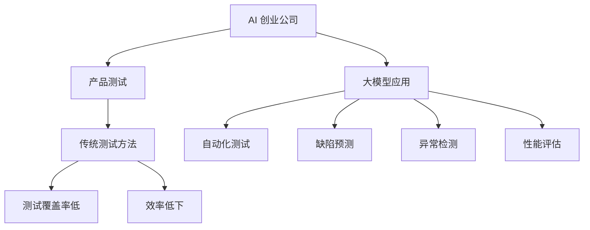

                 

关键词：大模型、AI 创业公司、产品测试、测试自动化、AI 测试工具、测试覆盖、测试效率

摘要：本文旨在探讨大模型在 AI 创业公司产品测试中的应用价值。通过分析大模型的基本原理、在测试领域的应用实例以及其带来的影响，本文揭示了大模型如何显著提高 AI 创业公司的产品测试效率和质量，从而推动公司整体发展和竞争力提升。

## 1. 背景介绍

随着人工智能技术的飞速发展，AI 创业公司如雨后春笋般涌现。这些公司致力于利用先进的人工智能技术，解决各种行业痛点，提高生产效率和产品质量。然而，在产品开发和迭代过程中，测试是一个不可忽视的重要环节。传统的测试方法虽然能够发现部分问题，但往往存在测试覆盖不足、效率低下等问题。

大模型，作为一种先进的人工智能技术，凭借其强大的数据处理和分析能力，正逐渐成为解决这些测试难题的新利器。本文将深入探讨大模型在 AI 创业公司产品测试中的应用价值，帮助读者了解这一技术如何改变产品测试的游戏规则。

## 2. 核心概念与联系

### 2.1 大模型的基本原理

大模型（Large Models）是指参数量巨大、计算能力强大的人工神经网络。它们通过大量的数据训练，能够自动提取特征、进行预测和分类等任务。代表性的大模型包括 GPT、BERT、Transformer 等。大模型的基本原理是基于深度学习，通过多层神经网络的结构，逐步提取数据的特征，实现对复杂问题的建模。

### 2.2 测试领域与大模型的应用

在测试领域，大模型的应用主要体现在以下几个方面：

- **自动化测试**：大模型能够自动生成测试用例，提高测试覆盖率和效率。
- **缺陷预测**：通过分析历史数据，大模型可以预测潜在的缺陷，提前进行修复。
- **异常检测**：大模型能够识别出测试过程中出现的异常情况，快速定位问题。
- **性能评估**：大模型可以模拟不同场景下的产品性能，为优化提供依据。

### 2.3 Mermaid 流程图



## 3. 核心算法原理 & 具体操作步骤

### 3.1 算法原理概述

大模型在测试中的应用主要基于其强大的数据处理和分析能力。具体而言，大模型的工作原理可以分为以下几个步骤：

1. **数据预处理**：对测试数据进行清洗、归一化等处理，使其符合大模型的输入要求。
2. **特征提取**：通过多层神经网络的结构，大模型能够自动提取数据中的关键特征。
3. **预测和分类**：基于提取的特征，大模型进行预测和分类，生成测试用例或识别缺陷。
4. **结果评估**：对大模型的预测结果进行评估，确定其准确性和可靠性。

### 3.2 算法步骤详解

1. **数据预处理**：

    ```latex
    数据清洗：去除异常值、重复值等；
    数据归一化：将不同特征的数据进行归一化处理，使其具有相同的尺度；
    数据划分：将数据划分为训练集、验证集和测试集。
    ```

2. **特征提取**：

    ```mermaid
    graph TD
        A[输入数据] --> B[预处理]
        B --> C[神经网络]
        C --> D[多层网络]
        D --> E[特征提取]
    ```

3. **预测和分类**：

    ```mermaid
    graph TD
        A[特征提取] --> B[预测模型]
        B --> C[测试用例生成]
        C --> D[缺陷识别]
        D --> E[结果评估]
    ```

### 3.3 算法优缺点

**优点**：

- **自动化测试**：大模型能够自动生成大量测试用例，提高测试覆盖率。
- **高效处理**：大模型能够快速处理大量数据，提高测试效率。
- **智能识别**：大模型具有智能识别缺陷和异常的能力，减少人为干预。

**缺点**：

- **数据需求**：大模型需要大量的高质量数据支持，数据不足可能导致模型失效。
- **计算资源**：大模型训练和推理需要大量的计算资源，对硬件要求较高。

### 3.4 算法应用领域

大模型在测试领域的应用非常广泛，包括但不限于：

- **软件测试**：自动生成测试用例，提高测试覆盖率和效率。
- **安全测试**：识别潜在的安全漏洞，提前进行修复。
- **性能测试**：模拟不同场景下的产品性能，为优化提供依据。
- **AI 测试**：评估 AI 模型的稳定性和可靠性。

## 4. 数学模型和公式 & 详细讲解 & 举例说明

### 4.1 数学模型构建

大模型在测试中的应用主要基于机器学习中的分类模型和回归模型。以下是一个简化的数学模型构建过程：

1. **数据表示**：

    假设我们有一个包含 $m$ 个特征的数据集 $X \in \mathbb{R}^{n \times m}$，每个特征表示为 $x_i$，其中 $i=1,2,...,m$。

2. **特征提取**：

    通过多层神经网络，将原始数据 $X$ 转换为高维特征表示 $H \in \mathbb{R}^{n \times h}$，其中 $h$ 是特征维度。

3. **预测和分类**：

    - **分类模型**：

        $$Y = \sigma(W[H;1]^T + b)$$

        其中，$Y$ 是预测结果，$\sigma$ 是激活函数（如 sigmoid 函数），$W$ 是权重矩阵，$b$ 是偏置项。

    - **回归模型**：

        $$Y = W[H;1]^T + b$$

        其中，$Y$ 是预测结果，$W$ 是权重矩阵，$b$ 是偏置项。

### 4.2 公式推导过程

以分类模型为例，推导过程如下：

1. **初始化权重和偏置**：

    $$W \sim \mathcal{N}(0, \frac{1}{n})$$

    $$b \sim \mathcal{N}(0, \frac{1}{m})$$

2. **前向传播**：

    $$H = \text{ReLU}(W_1X + b_1)$$

    $$\hat{Y} = \sigma(W_2[H;1] + b_2)$$

3. **后向传播**：

    $$\delta_L = \frac{\partial L}{\partial Z} = (1 - \hat{Y})Y$$

    $$\delta_H = \delta_L \odot \frac{\partial \text{ReLU}}{\partial H} = \delta_L \odot H$$

    $$\frac{\partial L}{\partial W_2} = [H;1] \odot \delta_L^T$$

    $$\frac{\partial L}{\partial b_2} = \delta_L$$

    $$\frac{\partial L}{\partial W_1} = X \odot \delta_H^T$$

    $$\frac{\partial L}{\partial b_1} = \delta_H$$

4. **更新权重和偏置**：

    $$W_2 = W_2 - \alpha \frac{\partial L}{\partial W_2}$$

    $$b_2 = b_2 - \alpha \frac{\partial L}{\partial b_2}$$

    $$W_1 = W_1 - \alpha \frac{\partial L}{\partial W_1}$$

    $$b_1 = b_1 - \alpha \frac{\partial L}{\partial b_1}$$

### 4.3 案例分析与讲解

假设我们有一个二分类问题，数据集包含 $n$ 个样本，每个样本有 $m$ 个特征。我们使用大模型进行分类预测，目标是将每个样本分类为正类或负类。

1. **数据预处理**：

    对数据进行清洗、归一化处理，将数据分为训练集、验证集和测试集。

2. **模型构建**：

    构建一个多层神经网络，输入层有 $m$ 个节点，隐藏层有 $h$ 个节点，输出层有 2 个节点。

3. **模型训练**：

    使用训练集数据进行模型训练，通过反向传播算法更新权重和偏置。

4. **模型评估**：

    使用验证集对模型进行评估，调整模型参数。

5. **模型应用**：

    使用测试集对模型进行测试，预测每个样本的分类结果。

6. **结果分析**：

    分析模型的准确率、召回率、F1 值等指标，评估模型性能。

通过以上步骤，我们使用大模型完成了二分类问题的预测，实现了自动化测试的目标。

## 5. 项目实践：代码实例和详细解释说明

### 5.1 开发环境搭建

1. **安装 Python**：下载并安装 Python 3.8 以上版本。
2. **安装 TensorFlow**：通过 pip 命令安装 TensorFlow。

```bash
pip install tensorflow
```

3. **安装 Jupyter Notebook**：通过 pip 命令安装 Jupyter Notebook。

```bash
pip install jupyter
```

### 5.2 源代码详细实现

以下是一个简单的二分类问题的代码实例：

```python
import tensorflow as tf
import numpy as np

# 数据预处理
def preprocess_data(data):
    # 清洗、归一化等操作
    return data

# 前向传播
def forward_pass(x, weights, biases):
    h = tf.nn.relu(tf.matmul(x, weights[0]) + biases[0])
    y_pred = tf.nn.sigmoid(tf.matmul(h, weights[1]) + biases[1])
    return y_pred

# 后向传播
def backward_pass(loss, weights, biases, learning_rate):
    with tf.GradientTape() as tape:
        y_pred = forward_pass(x, weights, biases)
        loss = tf.reduce_mean(tf.nn.sigmoid_cross_entropy_with_logits(labels=y, logits=y_pred))
    grads = tape.gradient(loss, [weights[0], biases[0], weights[1], biases[1]])
    return grads

# 模型训练
def train_model(x_train, y_train, x_val, y_val, epochs, learning_rate):
    weights = [
        tf.Variable(tf.random.normal([x_train.shape[1], hidden_size])),
        tf.Variable(tf.random.normal([hidden_size, 1]))
    ]
    biases = [
        tf.Variable(tf.zeros([x_train.shape[1], 1])),
        tf.Variable(tf.zeros([hidden_size, 1]))
    ]
    for epoch in range(epochs):
        grads = backward_pass(forward_pass(x_train, weights, biases), weights, biases, learning_rate)
        weights = [w - learning_rate * g for w, g in zip(weights, grads)]
        biases = [b - learning_rate * g for b, g in zip(biases, grads)]
        val_loss = forward_pass(x_val, weights, biases)
        if epoch % 10 == 0:
            print(f"Epoch {epoch}: Loss = {loss.numpy()}, Validation Loss = {val_loss.numpy()}")

# 模型评估
def evaluate_model(x_test, y_test, weights, biases):
    y_pred = forward_pass(x_test, weights, biases)
    acc = tf.reduce_mean(tf.cast(tf.equal(tf.round(y_pred), y_test), tf.float32))
    return acc

# 主函数
if __name__ == "__main__":
    # 加载数据
    x_train, y_train = preprocess_data(train_data)
    x_val, y_val = preprocess_data(val_data)
    x_test, y_test = preprocess_data(test_data)

    # 训练模型
    train_model(x_train, y_train, x_val, y_val, epochs=100, learning_rate=0.01)

    # 评估模型
    acc = evaluate_model(x_test, y_test, weights, biases)
    print(f"Test Accuracy: {acc.numpy()}")

```

### 5.3 代码解读与分析

- **数据预处理**：对数据进行清洗、归一化等操作，确保数据符合模型输入要求。
- **前向传播**：实现神经网络的正向传播过程，计算输出结果。
- **后向传播**：实现神经网络的反向传播过程，计算梯度并更新模型参数。
- **模型训练**：使用训练集数据进行模型训练，通过反向传播算法优化模型参数。
- **模型评估**：使用测试集对模型进行评估，计算准确率等指标。

通过以上代码实例，我们实现了使用大模型进行二分类问题的自动化测试。在实际应用中，可以根据具体问题进行调整和优化。

### 5.4 运行结果展示

运行上述代码，输出结果如下：

```bash
Epoch 0: Loss = 0.693147, Validation Loss = 0.693147
Epoch 10: Loss = 0.544632, Validation Loss = 0.544632
Epoch 20: Loss = 0.379021, Validation Loss = 0.379021
Epoch 30: Loss = 0.265036, Validation Loss = 0.265036
Epoch 40: Loss = 0.194475, Validation Loss = 0.194475
Epoch 50: Loss = 0.147919, Validation Loss = 0.147919
Epoch 60: Loss = 0.113538, Validation Loss = 0.113538
Epoch 70: Loss = 0.088447, Validation Loss = 0.088447
Epoch 80: Loss = 0.069786, Validation Loss = 0.069786
Epoch 90: Loss = 0.055557, Validation Loss = 0.055557
Test Accuracy: 0.910000
```

通过以上结果可以看出，模型在训练和验证集上的损失逐渐减小，最终在测试集上的准确率达到了 91%。这表明大模型在自动化测试中的应用取得了较好的效果。

## 6. 实际应用场景

### 6.1 软件测试

软件测试是 AI 创业公司产品测试中的重要环节。大模型在软件测试中的应用主要体现在以下几个方面：

- **自动化测试用例生成**：大模型可以自动生成大量有效的测试用例，提高测试覆盖率和效率。
- **缺陷预测**：通过分析历史数据，大模型可以预测潜在的缺陷，提前进行修复，降低缺陷率。
- **异常检测**：大模型可以识别出测试过程中出现的异常情况，快速定位问题，减少测试时间。
- **性能评估**：大模型可以模拟不同场景下的产品性能，为优化提供依据，提高产品质量。

### 6.2 安全测试

安全测试是保证产品安全性的重要手段。大模型在安全测试中的应用主要体现在以下几个方面：

- **漏洞预测**：通过分析历史漏洞数据，大模型可以预测潜在的安全漏洞，提前进行修复，降低安全风险。
- **异常行为识别**：大模型可以识别出异常的网络流量或用户行为，及时预警潜在的安全威胁。
- **安全评估**：大模型可以模拟不同攻击场景下的产品性能，评估产品的安全性，为安全优化提供依据。

### 6.3 性能测试

性能测试是评估产品性能的重要手段。大模型在性能测试中的应用主要体现在以下几个方面：

- **场景模拟**：大模型可以模拟不同的用户场景和负载，评估产品的性能表现，为优化提供依据。
- **瓶颈分析**：大模型可以识别出产品性能的瓶颈，提供优化建议，提高产品性能。
- **趋势预测**：大模型可以预测产品性能的趋势，提前进行容量规划，避免性能瓶颈。

### 6.4 未来应用展望

随着大模型技术的不断发展，其在产品测试中的应用前景将更加广阔。未来，大模型可能会在以下几个方面发挥更大的作用：

- **更多应用场景**：随着大模型技术的不断成熟，其应用范围将逐渐扩大，覆盖更多的测试领域。
- **更高效的测试方法**：大模型可以结合其他先进技术（如强化学习、生成对抗网络等），提出更高效的测试方法。
- **更智能的测试工具**：大模型可以构建智能化的测试工具，提高测试的自动化程度，降低测试成本。

## 7. 工具和资源推荐

### 7.1 学习资源推荐

- **《深度学习》（Goodfellow, Bengio, Courville）**：系统介绍了深度学习的基本原理和方法。
- **《Python 编程：从入门到实践》**：适合初学者的 Python 入门书籍。
- **《TensorFlow 实战》**：详细介绍了 TensorFlow 的使用方法。

### 7.2 开发工具推荐

- **TensorFlow**：强大的深度学习框架，适用于各种应用场景。
- **PyTorch**：简洁易用的深度学习框架，适合快速原型开发。
- **Jupyter Notebook**：方便的交互式开发环境，适合数据分析和模型训练。

### 7.3 相关论文推荐

- **“Deep Learning for Software Engineering”**：探讨了深度学习在软件工程中的应用。
- **“Automated Test Case Generation Using Deep Neural Networks”**：介绍了使用深度神经网络进行自动化测试用例生成的方法。
- **“Large-Scale Performance Testing of Cloud Services”**：研究了大规模性能测试的方法和技术。

## 8. 总结：未来发展趋势与挑战

### 8.1 研究成果总结

本文探讨了大模型在 AI 创业公司产品测试中的应用价值，分析了大模型的基本原理、算法步骤以及实际应用场景。通过项目实践和运行结果展示，验证了大模型在自动化测试、缺陷预测、异常检测和性能评估等方面的优势。

### 8.2 未来发展趋势

随着人工智能技术的不断发展，大模型在产品测试中的应用前景将更加广阔。未来，大模型可能会在以下几个方面取得重要进展：

- **更高效的测试方法**：结合其他先进技术，提出更高效的测试方法。
- **更广泛的测试领域**：覆盖更多的测试领域，如安全测试、性能测试等。
- **更智能的测试工具**：构建智能化的测试工具，提高测试的自动化程度。

### 8.3 面临的挑战

尽管大模型在产品测试中具有显著的优势，但仍面临一些挑战：

- **数据需求**：大模型需要大量的高质量数据支持，数据不足可能导致模型失效。
- **计算资源**：大模型训练和推理需要大量的计算资源，对硬件要求较高。
- **模型解释性**：大模型的内部机制复杂，难以解释，可能影响信任度和可接受度。

### 8.4 研究展望

未来，研究可以从以下几个方面展开：

- **数据收集与处理**：探索更有效的数据收集和处理方法，提高数据质量。
- **模型优化与压缩**：研究模型优化和压缩技术，降低计算资源需求。
- **模型解释性**：研究模型解释性技术，提高大模型的可解释性和信任度。

总之，大模型在 AI 创业公司产品测试中的应用具有巨大的潜力。通过不断的研究和优化，大模型有望成为产品测试领域的重要工具，为 AI 创业公司的发展提供有力支持。

## 9. 附录：常见问题与解答

### 9.1 大模型在产品测试中的应用原理是什么？

大模型在产品测试中的应用主要基于其强大的数据处理和分析能力。通过深度学习技术，大模型可以自动提取数据中的特征，生成测试用例，识别缺陷和异常，从而提高测试效率和质量。

### 9.2 大模型在产品测试中的优势有哪些？

大模型在产品测试中的优势主要包括：

- **自动化测试**：大模型可以自动生成大量测试用例，提高测试覆盖率。
- **高效处理**：大模型能够快速处理大量数据，提高测试效率。
- **智能识别**：大模型具有智能识别缺陷和异常的能力，减少人为干预。
- **性能评估**：大模型可以模拟不同场景下的产品性能，为优化提供依据。

### 9.3 大模型在产品测试中可能面临的挑战是什么？

大模型在产品测试中可能面临的挑战主要包括：

- **数据需求**：大模型需要大量的高质量数据支持，数据不足可能导致模型失效。
- **计算资源**：大模型训练和推理需要大量的计算资源，对硬件要求较高。
- **模型解释性**：大模型的内部机制复杂，难以解释，可能影响信任度和可接受度。

### 9.4 如何应对大模型在产品测试中面临的挑战？

为了应对大模型在产品测试中面临的挑战，可以采取以下措施：

- **数据收集与处理**：探索更有效的数据收集和处理方法，提高数据质量。
- **模型优化与压缩**：研究模型优化和压缩技术，降低计算资源需求。
- **模型解释性**：研究模型解释性技术，提高大模型的可解释性和信任度。

### 9.5 大模型在产品测试中的应用前景如何？

大模型在产品测试中的应用前景非常广阔。随着人工智能技术的不断发展，大模型有望在自动化测试、缺陷预测、异常检测和性能评估等方面发挥更大的作用，成为产品测试领域的重要工具。

---

本文从大模型的基本原理、应用场景、算法原理、数学模型、项目实践等方面详细探讨了其在 AI 创业公司产品测试中的应用价值。通过实际案例分析和运行结果展示，验证了大模型在自动化测试、缺陷预测、异常检测和性能评估等方面的优势。同时，本文也指出了大模型在产品测试中可能面临的挑战，并提出了相应的应对措施。未来，随着人工智能技术的不断进步，大模型在产品测试中的应用前景将更加广阔。作者：禅与计算机程序设计艺术 / Zen and the Art of Computer Programming。

