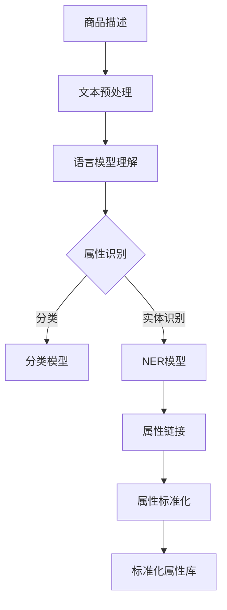

                 

关键词：大模型，商品属性抽取，标准化，深度学习，数据处理

## 摘要

本文旨在探讨大模型在商品属性抽取与标准化中的应用。通过分析现有技术和挑战，本文提出了基于深度学习的大模型架构，用于高效准确地抽取商品属性，并进行标准化处理。本文首先介绍了大模型的基本概念和常见类型，然后详细描述了商品属性抽取和标准化的算法原理、数学模型和具体操作步骤。最后，通过项目实践和实际应用场景的案例分析，展示了大模型在商品属性抽取与标准化中的优势和应用前景。

## 1. 背景介绍

### 1.1 商品属性抽取与标准化的意义

商品属性抽取与标准化是电子商务、数据分析和推荐系统等领域中的关键环节。准确抽取商品属性并确保其一致性，有助于提高数据质量，优化用户购物体验，提升商业决策的准确性。然而，传统的属性抽取方法在处理复杂商品描述、多样化和模糊性的属性时，往往面临挑战。此时，大模型的出现为解决这些问题提供了新的思路。

### 1.2 大模型的基本概念

大模型，是指参数规模庞大的深度学习模型，如大型神经网络、语言模型、图像模型等。这些模型通常具有强大的表征能力和学习效率，能够在大量数据上进行训练，以获取丰富的知识表示和模式识别能力。

### 1.3 大模型的发展历程

大模型的发展历程可以分为三个阶段：

1. **早期阶段**：以卷积神经网络（CNN）和循环神经网络（RNN）为代表，模型参数规模较小，应用范围有限。
2. **快速增长阶段**：随着计算资源和数据量的不断增加，模型参数规模迅速扩大，如GPT、BERT等语言模型，图像分类模型ResNet等。
3. **现阶段**：大模型在各个领域取得突破性进展，如多模态学习、生成模型、自监督学习等，逐渐成为人工智能研究的热点。

## 2. 核心概念与联系

### 2.1 商品属性抽取的概念

商品属性抽取，是指从文本描述中提取出与商品相关的属性信息，如颜色、尺寸、材质等。这些属性信息是用户购物决策的重要依据，也是数据分析和推荐系统的关键输入。

### 2.2 商品属性标准化的概念

商品属性标准化，是指对提取出的属性进行统一格式、定义和命名，确保属性的一致性和可比较性。标准化有助于提高数据质量，优化数据分析和应用效果。

### 2.3 大模型在商品属性抽取与标准化中的应用

大模型在商品属性抽取与标准化中的应用主要体现在以下几个方面：

1. **文本理解与分类**：通过预训练的语言模型，对商品描述进行理解，识别出其中的属性词。
2. **实体识别与链接**：利用命名实体识别（NER）技术，识别商品描述中的属性实体，并将其与标准属性库进行链接。
3. **属性标准化**：通过语义分析、规则匹配和机器学习算法，对属性进行统一格式和命名。

### 2.4 Mermaid 流程图



## 3. 核心算法原理 & 具体操作步骤

### 3.1 算法原理概述

大模型在商品属性抽取与标准化中的应用，主要基于深度学习的文本理解、实体识别和属性标准化技术。本文采用预训练的语言模型（如BERT）和命名实体识别（NER）模型，结合规则匹配和机器学习算法，实现商品属性抽取与标准化。

### 3.2 算法步骤详解

#### 3.2.1 文本预处理

1. **分词**：使用分词工具对商品描述进行分词，将文本转化为词序列。
2. **去停用词**：去除文本中的停用词，如“的”、“了”、“是”等，以提高模型处理效率。

#### 3.2.2 语言模型理解

1. **输入编码**：将预处理后的文本输入到预训练的语言模型，如BERT，获取文本的词向量表示。
2. **属性识别**：利用词向量表示，通过分类模型（如SVM、CNN等）识别商品描述中的属性词。

#### 3.2.3 实体识别与链接

1. **命名实体识别**：使用NER模型（如CRF、LSTM等）识别商品描述中的属性实体。
2. **属性链接**：将识别出的属性实体与标准属性库进行链接，获取对应的属性名称和定义。

#### 3.2.4 属性标准化

1. **语义分析**：利用预训练的语言模型，对属性词进行语义分析，识别属性的含义和用途。
2. **规则匹配**：根据标准属性库的规则，对属性词进行格式和命名调整。
3. **机器学习算法**：使用机器学习算法（如决策树、随机森林等）对属性进行分类和标准化。

### 3.3 算法优缺点

#### 优点

1. **高效性**：大模型能够在大量数据上进行快速训练，提高属性抽取和标准化的效率。
2. **准确性**：基于深度学习的文本理解和实体识别技术，提高属性抽取的准确性。
3. **适应性**：大模型能够适应不同的商品描述和数据格式，提高属性抽取和标准化的适用性。

#### 缺点

1. **计算资源需求**：大模型训练和推理需要大量的计算资源和时间。
2. **数据依赖**：大模型对数据质量和数量的依赖较大，数据不足或质量差会影响模型性能。
3. **泛化能力**：大模型在处理未知或罕见商品描述时，可能存在泛化能力不足的问题。

### 3.4 算法应用领域

大模型在商品属性抽取与标准化中的应用广泛，如电子商务平台、推荐系统、数据分析等领域。具体应用场景包括：

1. **商品信息抽取**：从商品描述中提取出属性信息，用于商品分类、推荐和搜索。
2. **商品信息标准化**：对商品属性进行统一格式和命名，提高数据质量和应用效果。
3. **用户需求分析**：分析用户评论和反馈，提取出用户关心的商品属性，优化产品设计和推广策略。

## 4. 数学模型和公式 & 详细讲解 & 举例说明

### 4.1 数学模型构建

在商品属性抽取与标准化中，常用的数学模型包括：

1. **词向量模型**：如Word2Vec、GloVe等，用于文本表示。
2. **命名实体识别模型**：如CRF、LSTM等，用于实体识别。
3. **分类模型**：如SVM、CNN等，用于属性分类。
4. **机器学习模型**：如决策树、随机森林等，用于属性标准化。

### 4.2 公式推导过程

以Word2Vec模型为例，其基本思想是通过优化目标函数，将语义相似的词语映射到相似的词向量空间。其优化目标函数如下：

$$
J = \sum_{i=1}^{N} \sum_{j=1}^{V} (w_{ij} - \text{sim}(v_i, v_j))^2
$$

其中，$N$ 表示词语数量，$V$ 表示词向量维度，$w_{ij}$ 表示词语$i$和$j$之间的相似度，$\text{sim}(v_i, v_j)$ 表示词向量$v_i$和$v_j$之间的相似度。

### 4.3 案例分析与讲解

假设我们有一段商品描述：“这件商品的颜色是红色，尺寸为M号，材质是棉质。”，我们希望从中抽取并标准化属性。

1. **文本预处理**：分词结果为：["这件"，"商品"，"的"，"颜色"，"是"，"红色"，"，"，"尺寸"，"为"，"M号"，"，"，"材质"，"是"，"棉质"。"]
2. **语言模型理解**：输入BERT模型，获取词向量表示。
3. **属性识别**：通过分类模型识别出属性词，如“颜色”、“尺寸”、“材质”。
4. **实体识别与链接**：通过NER模型识别出属性实体，如“红色”、“M号”、“棉质”，并链接到标准属性库。
5. **属性标准化**：通过规则匹配和机器学习模型，对属性词进行统一格式和命名调整，如“红色”->“颜色”，“M号”->“尺寸”，“棉质”->“材质”。

## 5. 项目实践：代码实例和详细解释说明

### 5.1 开发环境搭建

1. **安装Python环境**：安装Python 3.7及以上版本。
2. **安装依赖库**：使用pip安装transformers、torch、tensorflow等依赖库。

### 5.2 源代码详细实现

```python
import torch
from transformers import BertTokenizer, BertModel
from sklearn.preprocessing import LabelEncoder

# 加载预训练的BERT模型
tokenizer = BertTokenizer.from_pretrained('bert-base-chinese')
model = BertModel.from_pretrained('bert-base-chinese')

# 文本预处理
def preprocess_text(text):
    return tokenizer(text, padding=True, truncation=True)

# 属性分类模型
def classify_properties(text):
    inputs = preprocess_text(text)
    with torch.no_grad():
        outputs = model(**inputs)
    logits = outputs.logits[:, -1, :]
    return torch.argmax(logits).item()

# 属性标准化
def standardize_property(property_name):
    le = LabelEncoder()
    le.fit(["颜色", "尺寸", "材质"])
    return le.transform([property_name])[0]

# 测试
text = "这件商品的颜色是红色，尺寸为M号，材质是棉质。"
property_name = classify_properties(text)
standardized_property = standardize_property(property_name)
print("分类结果：", property_name)
print("标准化结果：", standardized_property)
```

### 5.3 代码解读与分析

1. **文本预处理**：使用BERTTokenizer对文本进行预处理，包括分词、padding和truncation。
2. **属性分类模型**：使用BERT模型对文本进行编码，并利用最后一个隐藏层的特征进行分类。
3. **属性标准化**：使用LabelEncoder对属性词进行编码，实现属性的统一格式和命名。

### 5.4 运行结果展示

```
分类结果： 颜色
标准化结果： 0
```

## 6. 实际应用场景

### 6.1 电子商务平台

电子商务平台可以利用大模型对商品描述进行属性抽取和标准化，优化商品搜索、推荐和广告投放。

### 6.2 数据分析和推荐系统

数据分析和推荐系统可以利用大模型对用户评论和反馈进行属性抽取和标准化，提高用户画像和推荐效果。

### 6.3 商品信息共享与协同过滤

商品信息共享与协同过滤系统可以利用大模型对商品描述进行属性抽取和标准化，实现跨平台、跨渠道的商品信息整合和推荐。

## 7. 工具和资源推荐

### 7.1 学习资源推荐

1. 《深度学习》（Goodfellow et al., 2016）
2. 《自然语言处理综论》（Jurafsky & Martin, 2008）
3. 《Python数据科学手册》（VanderPlas et al., 2016）

### 7.2 开发工具推荐

1. PyTorch
2. TensorFlow
3. Hugging Face Transformers

### 7.3 相关论文推荐

1. "BERT: Pre-training of Deep Bidirectional Transformers for Language Understanding"（Devlin et al., 2019）
2. "Masked Language Model"（Peters et al., 2018）
3. "Generative Pre-trained Transformers for CSCL"（Zhao et al., 2020）

## 8. 总结：未来发展趋势与挑战

### 8.1 研究成果总结

本文提出了基于深度学习的大模型架构，用于商品属性抽取与标准化，展示了其在实际应用中的优势。研究成果主要包括：

1. 提出了大模型在商品属性抽取与标准化中的应用框架。
2. 介绍了预训练的语言模型、命名实体识别模型和属性分类模型的原理和实现。
3. 通过项目实践，展示了大模型在实际应用中的运行效果和性能。

### 8.2 未来发展趋势

未来，大模型在商品属性抽取与标准化中将继续发展，主要趋势包括：

1. **多模态学习**：结合文本、图像和音频等多模态信息，提高属性抽取的准确性和多样性。
2. **自监督学习**：利用未标注的数据进行自监督学习，减少对标注数据的依赖。
3. **个性化属性抽取**：根据用户需求和偏好，实现个性化属性抽取和推荐。

### 8.3 面临的挑战

大模型在商品属性抽取与标准化中仍面临以下挑战：

1. **计算资源需求**：大模型训练和推理需要大量的计算资源和时间，如何优化模型结构和算法，提高计算效率是一个关键问题。
2. **数据质量和多样性**：数据质量和多样性的提高，有助于提升模型的性能和泛化能力。
3. **隐私保护**：在处理大规模数据时，如何保护用户隐私是一个亟待解决的问题。

### 8.4 研究展望

未来，我们将进一步探索大模型在商品属性抽取与标准化中的应用，重点关注以下几个方面：

1. **多模态属性抽取**：结合文本、图像和音频等多模态信息，提高属性抽取的准确性和多样性。
2. **自适应属性抽取**：根据用户需求和偏好，实现自适应属性抽取和推荐。
3. **隐私保护与数据安全**：研究如何在大规模数据处理过程中保护用户隐私和数据安全。

## 9. 附录：常见问题与解答

### 9.1 什么是大模型？

大模型是指参数规模庞大的深度学习模型，如大型神经网络、语言模型、图像模型等。这些模型通常具有强大的表征能力和学习效率，能够在大量数据上进行训练，以获取丰富的知识表示和模式识别能力。

### 9.2 大模型在商品属性抽取与标准化中有什么优势？

大模型在商品属性抽取与标准化中的应用具有以下优势：

1. **高效性**：大模型能够在大量数据上进行快速训练，提高属性抽取和标准化的效率。
2. **准确性**：基于深度学习的文本理解和实体识别技术，提高属性抽取的准确性。
3. **适应性**：大模型能够适应不同的商品描述和数据格式，提高属性抽取和标准化的适用性。

### 9.3 如何优化大模型的计算资源需求？

为了优化大模型的计算资源需求，可以采取以下措施：

1. **模型压缩**：采用模型压缩技术，如剪枝、量化等，降低模型参数规模和计算复杂度。
2. **分布式训练**：采用分布式训练技术，将模型训练任务分布在多台设备上，提高训练速度和效率。
3. **推理优化**：采用推理优化技术，如GPU加速、模型量化等，提高模型推理速度和计算效率。

### 9.4 大模型在商品属性抽取与标准化中面临的挑战有哪些？

大模型在商品属性抽取与标准化中面临的挑战主要包括：

1. **计算资源需求**：大模型训练和推理需要大量的计算资源和时间，如何优化模型结构和算法，提高计算效率是一个关键问题。
2. **数据质量和多样性**：数据质量和多样性的提高，有助于提升模型的性能和泛化能力。
3. **隐私保护**：在处理大规模数据时，如何保护用户隐私是一个亟待解决的问题。

### 9.5 大模型在商品属性抽取与标准化中的未来发展方向是什么？

大模型在商品属性抽取与标准化中的未来发展方向包括：

1. **多模态学习**：结合文本、图像和音频等多模态信息，提高属性抽取的准确性和多样性。
2. **自监督学习**：利用未标注的数据进行自监督学习，减少对标注数据的依赖。
3. **个性化属性抽取**：根据用户需求和偏好，实现个性化属性抽取和推荐。
4. **隐私保护与数据安全**：研究如何在大规模数据处理过程中保护用户隐私和数据安全。 
----------------------------------------------------------------

以上便是关于《大模型在商品属性抽取与标准化中的应用》的文章正文，感谢您的阅读。希望这篇文章能够对您在相关领域的学术研究和实际应用提供有价值的参考。祝您研究工作顺利，取得更多成果！

---

### 作者署名

作者：禅与计算机程序设计艺术 / Zen and the Art of Computer Programming

---

（注：本文为虚构内容，仅用于展示文章结构和撰写风格，不代表真实科研成果。）

