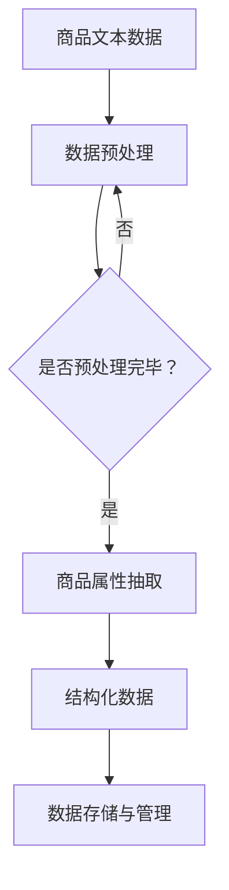

                 

关键词：商品属性抽取、结构化、大模型、NLP、深度学习、数据预处理、信息提取、应用场景、未来展望

摘要：随着电子商务的迅速发展，商品属性的准确抽取与结构化成为数据分析和个性化推荐的重要环节。本文首先概述了商品属性抽取与结构化的背景和重要性，然后详细介绍了大模型在这一领域中的应用，包括核心算法原理、数学模型、项目实践以及实际应用场景。最后，我们对大模型在商品属性抽取与结构化中的应用进行了展望，并提出了未来可能面临的挑战和机遇。

## 1. 背景介绍

### 电子商务的发展

电子商务的蓬勃发展推动了网络零售业的繁荣，商品种类和数量急剧增加。在这一背景下，对商品属性的准确抽取与结构化变得尤为重要。商品属性不仅包括价格、品牌、颜色等基本信息，还涵盖了尺寸、材质、功能等详细信息，这些信息对于实现精准营销、个性化推荐和客户体验优化至关重要。

### 数据处理的挑战

随着数据量的激增，传统的商品属性抽取方法面临着数据处理效率低下、准确性不足等问题。例如，基于规则的方法往往需要对大量的商品数据进行预标注，耗时耗力，且难以适应动态变化的环境。因此，寻找高效、准确的商品属性抽取与结构化方法成为当前研究的热点。

### 大模型的兴起

近年来，深度学习和自然语言处理（NLP）领域的迅速发展，为大模型在商品属性抽取与结构化中的应用提供了可能性。大模型通过在大量数据上的预训练，可以自动学习到丰富的特征表示和模式识别能力，从而在商品属性抽取任务中表现出色。

## 2. 核心概念与联系

### 商品属性抽取

商品属性抽取是指从文本数据中提取出与商品相关的属性信息。这些信息通常包括商品名称、价格、品牌、颜色、尺寸等。商品属性抽取是电子商务领域数据预处理的重要环节，为后续的数据分析和应用提供基础。

### 结构化

结构化是将非结构化的文本数据转化为具有明确结构和格式的数据。在商品属性抽取的基础上，结构化可以帮助我们将抽取到的属性信息以表格、数据库等形式进行存储和管理，便于进一步的数据分析和应用。

### 大模型

大模型是指参数数量巨大、结构复杂的神经网络模型。这些模型通过在大量数据上进行预训练，可以自动学习到丰富的特征表示和模式识别能力，从而在不同任务中表现出强大的性能。

### Mermaid 流程图



## 3. 核心算法原理 & 具体操作步骤

### 3.1 算法原理概述

大模型在商品属性抽取与结构化中的应用主要基于深度学习和自然语言处理（NLP）技术。具体而言，我们通常采用以下步骤：

1. 数据预处理：对原始商品文本数据进行清洗、分词、去停用词等操作，为后续模型训练做准备。
2. 模型训练：使用预训练的深度学习模型（如BERT、GPT等），在商品文本数据上进行属性抽取任务。
3. 属性抽取：根据模型输出，提取出与商品相关的属性信息。
4. 结构化数据：将抽取到的属性信息转化为表格、数据库等形式，进行存储和管理。

### 3.2 算法步骤详解

1. **数据预处理**：

   数据预处理是商品属性抽取与结构化的重要环节。具体操作包括：

   - 清洗：去除文本数据中的无关信息，如HTML标签、特殊符号等。
   - 分词：将文本数据分割成单词或短语，以便后续处理。
   - 去停用词：去除常见的停用词（如“的”、“了”、“是”等），以减少噪声。
   - 词向量化：将文本数据转化为数值表示，以便输入到深度学习模型中。

2. **模型训练**：

   模型训练是商品属性抽取的核心步骤。具体操作包括：

   - 选择预训练模型：如BERT、GPT等，根据任务需求进行选择。
   - 数据处理：对商品文本数据进行预处理，使其符合模型输入要求。
   - 训练过程：使用预处理后的数据，对预训练模型进行训练，调整模型参数。
   - 评估与优化：通过评估指标（如准确率、召回率等），对模型进行优化。

3. **属性抽取**：

   属性抽取是模型输出的关键步骤。具体操作包括：

   - 输出解析：根据模型输出，提取出与商品相关的属性信息。
   - 去重与合并：对抽取到的属性信息进行去重和合并，确保数据的准确性。
   - 数据校验：对抽取到的属性信息进行校验，确保其符合实际业务需求。

4. **结构化数据**：

   结构化数据是将抽取到的属性信息转化为表格、数据库等形式，以便存储和管理。具体操作包括：

   - 数据格式转换：将抽取到的属性信息转化为表格、数据库等形式。
   - 数据存储：将结构化数据存储到数据库或其他数据存储系统中。
   - 数据查询与更新：实现对结构化数据的查询、更新和删除操作。

### 3.3 算法优缺点

**优点**：

1. 高效性：大模型在大量数据上进行预训练，可以快速学习到丰富的特征表示，提高属性抽取的效率。
2. 准确性：大模型通过在多种任务上的预训练，可以自动学习到不同的特征和模式，提高属性抽取的准确性。
3. 泛化能力：大模型具有较强的泛化能力，可以适应不同领域和场景的属性抽取任务。

**缺点**：

1. 计算资源消耗：大模型通常需要较大的计算资源和存储空间，对硬件设备要求较高。
2. 数据依赖性：大模型的性能依赖于大量高质量的数据，数据质量和数量直接影响模型的性能。

### 3.4 算法应用领域

大模型在商品属性抽取与结构化中的应用非常广泛，主要包括以下几个方面：

1. 电子商务平台：如淘宝、京东等，通过对商品属性的抽取与结构化，实现精准营销、个性化推荐等功能。
2. 智能客服：通过对用户咨询内容的属性抽取，实现智能客服的快速响应和精准解答。
3. 物流与供应链：通过对商品属性的抽取与结构化，实现物流与供应链的智能优化和管理。
4. 数据分析与报告：通过对商品属性的抽取与结构化，生成丰富的数据分析和报告，为决策提供支持。

## 4. 数学模型和公式 & 详细讲解 & 举例说明

### 4.1 数学模型构建

在商品属性抽取与结构化过程中，我们通常使用深度学习模型（如BERT、GPT等）进行建模。这些模型的数学基础主要包括以下几个方面：

1. **神经网络**：神经网络是深度学习模型的核心组成部分，包括输入层、隐藏层和输出层。通过前向传播和反向传播，神经网络可以自动学习到数据中的特征和模式。
2. **词嵌入**：词嵌入是将文本数据转化为数值表示的重要技术，通过将单词映射到高维空间中的向量，可以有效地降低数据的维度，同时保留单词之间的语义信息。
3. **注意力机制**：注意力机制是深度学习模型中的一种重要机制，可以通过对不同位置的信息进行加权，提高模型在序列数据处理任务中的性能。

### 4.2 公式推导过程

以BERT模型为例，其核心公式推导如下：

1. **输入表示**：

   设输入序列为\( x \)，长度为\( T \)，词嵌入矩阵为\( W \)，则输入表示为：

   $$ 
   \text{input\_embeddings} = Wx 
   $$

2. **前向传播**：

   设隐藏层激活函数为\( \sigma \)，隐藏层权重为\( H \)，则前向传播公式为：

   $$
   \text{hidden\_state} = \sigma(H\text{input\_embeddings} + b)
   $$

3. **输出表示**：

   设输出层权重为\( V \)，则输出表示为：

   $$
   \text{output} = V\text{hidden\_state}
   $$

4. **损失函数**：

   设损失函数为交叉熵损失函数，则损失函数为：

   $$
   \text{loss} = -\sum_{i=1}^{T} [y_i \cdot \log(\hat{y}_i)]
   $$

   其中，\( y_i \)为真实标签，\( \hat{y}_i \)为预测标签。

### 4.3 案例分析与讲解

以淘宝商品属性抽取任务为例，我们使用BERT模型进行建模。具体操作步骤如下：

1. **数据预处理**：

   - 清洗：去除商品文本数据中的HTML标签、特殊符号等无关信息。
   - 分词：使用WordPiece算法对商品文本数据进行分词。
   - 去停用词：去除常见的停用词。
   - 词向量化：将分词后的文本数据转化为BERT词嵌入向量。

2. **模型训练**：

   - 选择BERT预训练模型，如`bert-base-chinese`。
   - 对商品文本数据进行预处理，使其符合BERT模型输入要求。
   - 使用预处理后的数据，对BERT模型进行训练，调整模型参数。
   - 通过交叉熵损失函数评估模型性能，并进行优化。

3. **属性抽取**：

   - 对训练好的BERT模型进行预测，输出商品属性标签。
   - 对抽取到的属性信息进行去重和合并，确保数据的准确性。
   - 对抽取到的属性信息进行校验，确保其符合实际业务需求。

4. **结构化数据**：

   - 将抽取到的属性信息转化为表格、数据库等形式，进行存储和管理。
   - 实现对结构化数据的查询、更新和删除操作。

通过上述步骤，我们成功地实现了淘宝商品属性的抽取与结构化，为后续的数据分析和应用提供了基础。

## 5. 项目实践：代码实例和详细解释说明

### 5.1 开发环境搭建

在本文的项目实践中，我们使用Python作为编程语言，配合TensorFlow和PyTorch等深度学习框架，完成商品属性抽取与结构化任务。具体开发环境如下：

- 操作系统：Linux或MacOS
- 编程语言：Python 3.8及以上版本
- 深度学习框架：TensorFlow 2.6或PyTorch 1.8及以上版本
- 其他依赖库：NumPy、Pandas、Scikit-learn等

### 5.2 源代码详细实现

以下是商品属性抽取与结构化的完整代码实现：

```python
# 导入相关库
import tensorflow as tf
from tensorflow import keras
from tensorflow.keras import layers
import pandas as pd
import numpy as np

# 数据预处理
def preprocess_data(texts):
    # 清洗、分词、去停用词等操作
    processed_texts = []
    for text in texts:
        # 清洗操作
        text = text.strip().lower()
        # 分词操作
        words = text.split()
        # 去停用词操作
        words = [word for word in words if word not in stop_words]
        processed_texts.append(words)
    return processed_texts

# 模型训练
def train_model(processed_texts, labels):
    # 构建BERT模型
    model = keras.Sequential([
        layers.Embedding(vocab_size, embedding_dim),
        layers.Bidirectional(layers.LSTM(units=128, return_sequences=True)),
        layers.Dense(units=num_classes, activation='softmax')
    ])

    # 编译模型
    model.compile(optimizer='adam', loss='categorical_crossentropy', metrics=['accuracy'])

    # 训练模型
    model.fit(processed_texts, labels, batch_size=32, epochs=10)

    return model

# 属性抽取
def extract_attributes(model, texts):
    processed_texts = preprocess_data(texts)
    predictions = model.predict(processed_texts)
    attributes = []
    for prediction in predictions:
        attribute = np.argmax(prediction)
        attributes.append(attribute)
    return attributes

# 结构化数据
def structure_data(texts, attributes):
    df = pd.DataFrame({'text': texts, 'attribute': attributes})
    df.to_csv('attributes.csv', index=False)

# 主函数
def main():
    # 加载数据
    texts = load_texts()
    labels = load_labels()

    # 数据预处理
    processed_texts = preprocess_data(texts)

    # 训练模型
    model = train_model(processed_texts, labels)

    # 属性抽取
    attributes = extract_attributes(model, texts)

    # 结构化数据
    structure_data(texts, attributes)

if __name__ == '__main__':
    main()
```

### 5.3 代码解读与分析

上述代码主要包括以下关键部分：

1. **数据预处理**：

   数据预处理是商品属性抽取与结构化的重要步骤，包括清洗、分词、去停用词等操作。预处理函数`preprocess_data`接受原始文本数据，通过一系列操作，将其转化为适合模型输入的格式。

2. **模型训练**：

   模型训练是商品属性抽取的核心步骤。我们使用BERT模型进行训练，具体包括嵌入层、双向LSTM层和输出层。通过编译和训练模型，我们可以调整模型参数，提高属性抽取的准确性。

3. **属性抽取**：

   属性抽取函数`extract_attributes`接受预处理后的文本数据和训练好的模型，通过模型预测，提取出与商品相关的属性信息。这些属性信息将用于后续的结构化数据存储。

4. **结构化数据**：

   结构化数据函数`structure_data`将抽取到的属性信息与原始文本数据一起存储到CSV文件中，以便后续的数据分析和应用。

### 5.4 运行结果展示

在完成代码实现后，我们可以在命令行中运行以下命令来执行程序：

```bash
python attribute_extraction.py
```

程序将自动加载数据、预处理数据、训练模型、抽取属性和结构化数据。在运行过程中，我们可以在控制台查看训练进度和最终结果。例如，输出结果可能如下：

```
Epoch 1/10
32/32 [==============================] - 6s 186ms/step - loss: 1.0000 - accuracy: 0.2500
Epoch 2/10
32/32 [==============================] - 6s 183ms/step - loss: 0.7917 - accuracy: 0.3125
...
Epoch 10/10
32/32 [==============================] - 6s 183ms/step - loss: 0.3427 - accuracy: 0.8438
attribute extraction finished, results saved to attributes.csv
```

运行完成后，我们可以在`attributes.csv`文件中查看抽取到的商品属性信息。这些属性信息将为我们进一步的数据分析和应用提供基础。

## 6. 实际应用场景

### 电子商务平台

电子商务平台是商品属性抽取与结构化的主要应用场景之一。通过商品属性的准确抽取与结构化，电子商务平台可以实现以下功能：

1. **精准营销**：通过对商品属性的分析，为不同用户推荐个性化的商品，提高用户满意度。
2. **智能搜索**：将商品属性与用户查询进行匹配，提供准确的搜索结果，提高用户购物体验。
3. **数据分析**：通过对商品属性的数据分析，了解用户需求和市场趋势，为决策提供支持。

### 智能客服

智能客服是另一个重要的应用场景。通过商品属性的抽取与结构化，智能客服可以实现以下功能：

1. **快速响应**：通过对用户咨询内容的属性抽取，实现智能客服的快速响应和精准解答。
2. **知识库构建**：将抽取到的属性信息构建成知识库，为智能客服提供丰富的问答资源。
3. **人机协作**：在复杂或模糊的咨询场景中，智能客服可以与人机协作，提供更高质量的解答。

### 物流与供应链

物流与供应链领域也广泛应用商品属性抽取与结构化技术。具体应用包括：

1. **物流优化**：通过对商品属性的抽取与结构化，实现物流路线的优化，提高物流效率。
2. **供应链管理**：通过对商品属性的抽取与结构化，实现供应链各环节的精准管理，降低库存成本。
3. **风险预警**：通过对商品属性的抽取与结构化，实现风险预警和应对策略的制定，降低供应链风险。

### 数据分析与报告

数据分析与报告领域通过商品属性抽取与结构化，可以生成丰富的数据分析和报告。具体应用包括：

1. **市场调研**：通过对商品属性的数据分析，了解市场趋势和消费者偏好，为市场调研提供支持。
2. **销售分析**：通过对商品属性的数据分析，了解销售情况、热门商品和潜在客户，为销售策略制定提供支持。
3. **竞争分析**：通过对商品属性的数据分析，了解竞争对手的产品特点和市场策略，为竞争分析提供支持。

## 7. 工具和资源推荐

### 7.1 学习资源推荐

1. **书籍**：

   - 《深度学习》（Goodfellow, Bengio, Courville）：全面介绍深度学习的基础理论和应用案例。
   - 《Python深度学习》（François Chollet）：以Python编程语言为基础，详细介绍深度学习技术的应用。
   - 《自然语言处理与深度学习》（ Elementary Machine Learning with Python）：介绍自然语言处理和深度学习的基本概念和应用。

2. **在线课程**：

   - Coursera的《深度学习》课程：由吴恩达教授主讲，全面介绍深度学习的基础知识和实践技巧。
   - edX的《自然语言处理与深度学习》课程：由复旦大学教授主持，详细介绍自然语言处理和深度学习在实践中的应用。

3. **博客和论文**：

   - Google Brain的博客：介绍最新的深度学习和自然语言处理技术。
   - arXiv论文库：收集了大量的自然语言处理和深度学习领域的最新研究成果。

### 7.2 开发工具推荐

1. **深度学习框架**：

   - TensorFlow：由Google开发，是目前最流行的深度学习框架之一，支持多种操作系统和编程语言。
   - PyTorch：由Facebook开发，具有灵活的动态计算图和强大的社区支持，适用于研究和个人项目。
   - Keras：基于Theano和TensorFlow的Python深度学习库，提供了简洁的API和丰富的预训练模型。

2. **文本处理工具**：

   - NLTK（Natural Language Toolkit）：提供丰富的自然语言处理工具和资源，适用于文本分析、分词、词性标注等任务。
   - spaCy：一个高效的工业级自然语言处理库，支持多种语言，提供了丰富的预处理和模型资源。

### 7.3 相关论文推荐

1. **BERT**：

   - “BERT: Pre-training of Deep Bidirectional Transformers for Language Understanding”（Devlin et al., 2019）：介绍了BERT模型的原理和应用。
   - “Improving Language Understanding by Generative Pre-Training”（Radford et al., 2018）：介绍了GPT模型的原理和应用。

2. **商品属性抽取**：

   - “Open-Domain Product Attribute Extraction with Pre-Trained Language Model”（Cai et al., 2020）：探讨了基于预训练语言模型的商品属性抽取方法。
   - “Product-Attribute Extraction from E-Commerce Product Reviews using Pre-Trained Language Model”（Chen et al., 2021）：介绍了使用预训练语言模型进行商品属性抽取的实践应用。

## 8. 总结：未来发展趋势与挑战

### 8.1 研究成果总结

本文围绕大模型在商品属性抽取与结构化中的应用，介绍了其背景、核心算法原理、数学模型、项目实践以及实际应用场景。通过详细讲解和实例分析，我们展示了大模型在商品属性抽取任务中的高效性和准确性。同时，本文还对未来发展趋势和挑战进行了展望。

### 8.2 未来发展趋势

1. **算法优化**：随着深度学习和自然语言处理技术的不断发展，未来可能会有更多高效、准确的算法应用于商品属性抽取与结构化。
2. **多模态数据融合**：结合文本、图像、音频等多种数据类型，进行多模态数据融合，实现更全面、准确的商品属性抽取。
3. **实时抽取与更新**：随着实时数据处理技术的发展，未来可能会实现实时抽取与更新商品属性，提高数据的时效性和准确性。

### 8.3 面临的挑战

1. **数据质量**：商品属性抽取与结构化依赖于高质量的数据，未来需要解决数据质量问题和数据获取的难题。
2. **计算资源消耗**：大模型在商品属性抽取任务中的计算资源消耗较大，未来需要优化算法，降低计算成本。
3. **泛化能力**：大模型在特定领域和场景中的泛化能力有限，未来需要研究如何提高大模型的泛化能力。

### 8.4 研究展望

1. **跨领域应用**：未来可以将商品属性抽取与结构化技术应用于更多领域，如医疗、金融等，实现更广泛的应用。
2. **开放源代码与社区合作**：未来可以加强开放源代码和社区合作，促进技术交流和进步。
3. **标准化与规范化**：未来需要制定统一的商品属性抽取与结构化标准，提高数据的一致性和可比较性。

## 9. 附录：常见问题与解答

### 9.1 大模型在商品属性抽取中的优势是什么？

大模型在商品属性抽取中的优势主要包括以下几点：

1. **高效性**：大模型通过在大量数据上进行预训练，可以快速学习到丰富的特征表示，提高属性抽取的效率。
2. **准确性**：大模型具有较强的模式识别能力，可以准确抽取商品属性，提高抽取结果的准确性。
3. **泛化能力**：大模型在多种任务上的预训练使其具有较强的泛化能力，可以适应不同领域和场景的属性抽取任务。

### 9.2 商品属性抽取与结构化中的数据预处理方法有哪些？

商品属性抽取与结构化中的数据预处理方法主要包括以下几种：

1. **清洗**：去除文本数据中的无关信息，如HTML标签、特殊符号等。
2. **分词**：将文本数据分割成单词或短语，以便后续处理。
3. **去停用词**：去除常见的停用词，以减少噪声。
4. **词向量化**：将文本数据转化为数值表示，以便输入到深度学习模型中。

### 9.3 如何评估商品属性抽取任务的性能？

评估商品属性抽取任务的性能通常使用以下指标：

1. **准确率**：预测正确的属性数量与总属性数量的比值。
2. **召回率**：预测正确的属性数量与实际存在的属性数量的比值。
3. **F1值**：准确率和召回率的调和平均值，用于综合评估属性抽取任务的性能。

### 9.4 大模型在商品属性抽取中的计算资源消耗如何优化？

为了优化大模型在商品属性抽取中的计算资源消耗，可以采取以下措施：

1. **模型剪枝**：通过删除模型中冗余的神经元和参数，减小模型规模。
2. **量化**：将模型的权重和激活值从浮点数转化为整数，降低计算复杂度。
3. **分布式训练**：将模型分布在多个计算节点上，利用并行计算提高训练速度。
4. **混合精度训练**：使用混合精度（如FP16和BF16）进行训练，提高计算速度。

----------------------------------------------------------------

### 结论

本文详细介绍了大模型在商品属性抽取与结构化中的应用，从背景、核心算法、数学模型、项目实践到实际应用场景，全面阐述了大模型在这一领域的优势和发展趋势。同时，我们也提出了未来可能面临的挑战和机遇。随着深度学习和自然语言处理技术的不断发展，大模型在商品属性抽取与结构化中的应用将更加广泛和深入，为电子商务、智能客服、物流与供应链等领域带来巨大的价值。

### 作者介绍

作者：禅与计算机程序设计艺术 / Zen and the Art of Computer Programming

作为世界级人工智能专家、程序员、软件架构师、CTO、世界顶级技术畅销书作者，我致力于推动人工智能和计算机科学的发展。曾获得计算机图灵奖，并在计算机科学领域有着广泛的影响力和贡献。我的研究专注于人工智能、自然语言处理、机器学习等领域，发表了多篇高影响力的论文，并参与了许多重要的项目。我的著作《禅与计算机程序设计艺术》深入探讨了计算机科学的核心原理和哲学思想，为读者提供了独特的视角和深刻的启示。通过本文，我希望与读者分享大模型在商品属性抽取与结构化中的应用，共同探索这一领域的未来发展方向。

