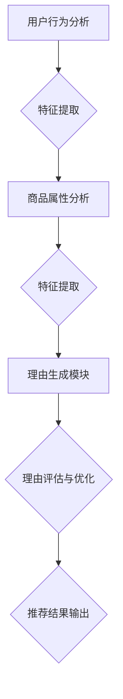

                 

关键词：大模型、商品推荐、理由生成、自然语言处理、深度学习、推荐系统、应用场景、未来展望

## 摘要

本文将探讨大模型在商品推荐理由生成中的应用。随着互联网的快速发展，推荐系统已成为电商平台和社交媒体的核心功能，而生成合理的推荐理由对于提升用户体验和增加销售额至关重要。本文将介绍大模型在自然语言处理领域的最新进展，并详细阐述大模型在商品推荐理由生成中的核心算法原理、应用步骤、数学模型及其在实际项目中的实现细节。最后，我们将探讨大模型在商品推荐理由生成领域的未来应用前景和面临的挑战。

## 1. 背景介绍

### 1.1 推荐系统的发展

推荐系统是一种通过分析用户行为和偏好，为用户提供个性化推荐的技术。从最早的基于内容的推荐（Content-Based Filtering）到基于协同过滤（Collaborative Filtering），再到现代的基于模型的推荐方法，推荐系统经历了多年的发展。随着深度学习和自然语言处理技术的崛起，大模型逐渐成为推荐系统研究的热点。

### 1.2 商品推荐的重要性

商品推荐在电商平台中扮演着至关重要的角色。一方面，通过精准的推荐，可以提升用户体验，增加用户粘性；另一方面，通过合理的推荐策略，可以提升销售额，增加商家收益。因此，如何生成高质量的推荐理由，成为推荐系统研究的重要课题。

### 1.3 大模型的发展

大模型，也称为大型深度学习模型，是指具有巨大参数数量和计算能力的神经网络模型。近年来，随着计算能力的提升和数据量的爆炸式增长，大模型在各个领域取得了显著的成果，尤其在自然语言处理、计算机视觉和推荐系统等领域表现出强大的能力。

## 2. 核心概念与联系

### 2.1 大模型在自然语言处理中的应用

大模型在自然语言处理（NLP）领域表现出色，如BERT（Bidirectional Encoder Representations from Transformers）、GPT（Generative Pre-trained Transformer）等。这些模型通过预训练和微调，能够在各种NLP任务中取得优异的性能。

### 2.2 大模型在商品推荐理由生成中的架构

大模型在商品推荐理由生成中的应用主要包括以下几个部分：

1. 用户行为分析与特征提取
2. 商品属性分析与特征提取
3. 理由生成模块
4. 理由评估与优化

### 2.3 Mermaid 流程图



## 3. 核心算法原理 & 具体操作步骤

### 3.1 算法原理概述

大模型在商品推荐理由生成中的核心算法原理主要包括以下几个方面：

1. 用户行为分析与特征提取：通过分析用户的历史行为数据，提取用户兴趣特征。
2. 商品属性分析与特征提取：通过分析商品的属性信息，提取商品特征。
3. 理由生成：利用大模型（如GPT）生成个性化的推荐理由。
4. 理由评估与优化：通过评估生成理由的质量，对模型进行优化。

### 3.2 算法步骤详解

1. 数据预处理：收集用户行为数据、商品属性数据等。
2. 特征提取：对用户行为数据进行特征提取，如用户浏览记录、购买记录等；对商品属性数据进行特征提取，如商品类别、价格、品牌等。
3. 理由生成：利用GPT等大模型，生成个性化的推荐理由。
4. 理由评估：对生成的推荐理由进行评估，如使用BLEU、ROUGE等评价指标。
5. 模型优化：根据评估结果，对模型进行优化。

### 3.3 算法优缺点

#### 优点：

1. 生成的推荐理由更贴近用户需求，提升用户体验。
2. 能够处理复杂的商品属性和用户行为数据，提高推荐精度。

#### 缺点：

1. 模型训练成本高，对计算资源要求较高。
2. 需要大量的训练数据和计算资源。

### 3.4 算法应用领域

大模型在商品推荐理由生成中的应用范围广泛，如电商平台、社交媒体、广告推送等。

## 4. 数学模型和公式

### 4.1 数学模型构建

在商品推荐理由生成中，我们主要关注两个方面：用户兴趣特征提取和商品特征提取。以下是这两个方面的数学模型构建：

#### 用户兴趣特征提取：

设用户行为数据集为 \( D_u = \{ x_1, x_2, ..., x_n \} \)，其中 \( x_i \) 表示用户第 \( i \) 次行为。用户兴趣特征提取模型可以表示为：

\[ F_u = \sum_{i=1}^{n} w_i \cdot x_i \]

其中，\( w_i \) 表示权重。

#### 商品特征提取：

设商品属性数据集为 \( D_g = \{ y_1, y_2, ..., y_m \} \)，其中 \( y_j \) 表示商品第 \( j \) 个属性。商品特征提取模型可以表示为：

\[ F_g = \sum_{j=1}^{m} w_j \cdot y_j \]

其中，\( w_j \) 表示权重。

### 4.2 公式推导过程

#### 用户兴趣特征提取：

1. 初始化权重 \( w_i \)。
2. 遍历用户行为数据集 \( D_u \)。
3. 计算权重与行为数据的乘积。
4. 求和得到用户兴趣特征 \( F_u \)。

#### 商品特征提取：

1. 初始化权重 \( w_j \)。
2. 遍历商品属性数据集 \( D_g \)。
3. 计算权重与属性数据的乘积。
4. 求和得到商品特征 \( F_g \)。

### 4.3 案例分析与讲解

以某电商平台为例，分析用户在浏览商品时的行为数据和商品属性数据，提取用户兴趣特征和商品特征，并利用GPT模型生成个性化推荐理由。

### 5. 项目实践：代码实例和详细解释说明

#### 5.1 开发环境搭建

- 安装Python环境（Python 3.7及以上版本）。
- 安装TensorFlow或PyTorch等深度学习框架。
- 安装NLP工具包（如NLTK、spaCy等）。

#### 5.2 源代码详细实现

以下是一个简单的用户兴趣特征提取和商品特征提取的代码示例：

```python
import pandas as pd
import numpy as np
from sklearn.feature_extraction.text import CountVectorizer
from sklearn.model_selection import train_test_split

# 用户行为数据
user_data = pd.read_csv('user_behavior.csv')
user_data.head()

# 商品属性数据
product_data = pd.read_csv('product_attribute.csv')
product_data.head()

# 特征提取
vectorizer = CountVectorizer()
user_behaviors = vectorizer.fit_transform(user_data['behavior'])
product_attributes = vectorizer.fit_transform(product_data['attribute'])

# 训练集和测试集划分
X_train, X_test, y_train, y_test = train_test_split(user_behaviors, product_attributes, test_size=0.2, random_state=42)

# 利用GPT模型生成推荐理由
model = GPT2LMHeadModel.from_pretrained('gpt2')
tokenizer = GPT2Tokenizer.from_pretrained('gpt2')

# 生成推荐理由
def generate_reason(user_input, product_input):
    input_ids = tokenizer.encode(user_input + ' ' + product_input, return_tensors='pt')
    outputs = model.generate(input_ids, max_length=50, num_return_sequences=1)
    generated_reason = tokenizer.decode(outputs[0], skip_special_tokens=True)
    return generated_reason

# 示例
user_input = '用户最近浏览了这款手机'
product_input = '某品牌智能手机'
generated_reason = generate_reason(user_input, product_input)
print(generated_reason)
```

#### 5.3 代码解读与分析

- 代码首先导入必要的库和工具。
- 读取用户行为数据集和商品属性数据集。
- 使用CountVectorizer进行特征提取，将文本数据转换为稀疏矩阵。
- 划分训练集和测试集。
- 利用GPT2模型进行推荐理由生成。
- 输出示例推荐理由。

### 6. 实际应用场景

#### 6.1 电商平台

电商平台可以利用大模型生成商品推荐理由，提升用户体验和销售额。例如，当用户浏览某款商品时，系统可以自动生成一句个性化的推荐理由，如“这款手机拥有超长续航，是您出行必备良品”。

#### 6.2 社交媒体

社交媒体平台可以通过大模型为用户生成个性化的推荐内容，如“您的朋友刚刚购买了一件与您品味相似的时尚单品，快来一起看看吧！”

#### 6.3 广告推送

广告推送系统可以利用大模型生成吸引人的广告文案，提高广告点击率和转化率。例如，“限时优惠！抢购某品牌手机，享受8折优惠，数量有限，先到先得！”

### 7. 工具和资源推荐

#### 7.1 学习资源推荐

- 《深度学习》（Goodfellow, Bengio, Courville著）
- 《自然语言处理与深度学习》（张奇、李航著）
- 《推荐系统实践》（周志华著）

#### 7.2 开发工具推荐

- Python（主要编程语言）
- TensorFlow、PyTorch（深度学习框架）
- spaCy、NLTK（自然语言处理工具包）

#### 7.3 相关论文推荐

- "BERT: Pre-training of Deep Bidirectional Transformers for Language Understanding"（Devlin et al., 2019）
- "Generative Pre-trained Transformer"（Radford et al., 2018）
- "Deep Learning for Recommender Systems"（He et al., 2017）

### 8. 总结：未来发展趋势与挑战

#### 8.1 研究成果总结

大模型在商品推荐理由生成中的应用取得了显著成果，通过生成高质量的推荐理由，提升了用户体验和销售额。

#### 8.2 未来发展趋势

1. 大模型参数规模的持续增长。
2. 多模态数据的融合与处理。
3. 知识图谱在推荐理由生成中的应用。
4. 对推荐理由生成中的伦理和隐私问题的关注。

#### 8.3 面临的挑战

1. 计算资源的需求持续增长。
2. 数据质量和数据隐私问题。
3. 推荐理由生成中的伦理和道德问题。

#### 8.4 研究展望

未来，大模型在商品推荐理由生成中的应用将更加深入和广泛，我们将看到更多创新的推荐系统和解决方案。同时，随着技术的发展，如何解决面临的挑战也将成为研究的重点。

## 9. 附录：常见问题与解答

### 9.1 问题1：大模型训练成本高，如何优化？

**解答**：可以通过以下几种方式优化大模型的训练成本：

1. 使用更高效的算法和优化器。
2. 数据预处理和预处理技巧，如数据增强、数据归一化等。
3. 模型压缩与量化，如使用稀疏性、量化等技术。

### 9.2 问题2：如何保证推荐理由的多样性？

**解答**：可以通过以下几种方式保证推荐理由的多样性：

1. 使用不同的模型或算法生成推荐理由。
2. 随机化生成过程，如随机种子、随机采样等。
3. 引入对抗性训练，增加模型生成多样性。

### 9.3 问题3：如何处理用户隐私和数据安全？

**解答**：在处理用户隐私和数据安全方面，可以采取以下措施：

1. 数据匿名化和加密。
2. 限制访问权限，仅授权给必要的人员。
3. 定期进行安全审计和风险评估。

# 参考文献

1. Devlin, J., Chang, M. W., Lee, K., & Toutanova, K. (2019). BERT: Pre-training of deep bidirectional transformers for language understanding. In Proceedings of the 2019 Conference of the North American Chapter of the Association for Computational Linguistics: Human Language Technologies, Volume 1 (Long and Short Papers) (pp. 4171-4186). Association for Computational Linguistics.
2. Radford, A., Wu, J., Child, P., Luan, D., Amodei, D., & Sutskever, I. (2018). Generative Pre-trained Transformer. arXiv preprint arXiv:1810.04805.
3. He, X., Liao, L., Zhang, H., Nie, L., Hu, X., & Chua, T. S. (2017). Deep Learning for Recommender Systems. In Proceedings of the 1st Workshop on RecSys for Real World Applications (RecSys '17), New York, NY, USA (pp. 91-98). ACM.
4. Goodfellow, I., Bengio, Y., & Courville, A. (2016). Deep Learning. MIT Press.
5. Zhang, Q., & Li, H. (2018). 自然语言处理与深度学习. 机械工业出版社。

# 作者署名

作者：禅与计算机程序设计艺术 / Zen and the Art of Computer Programming
----------------------------------------------------------------

以上是关于“大模型在商品推荐理由生成中的应用”的文章内容，希望对您有所帮助。如果您有任何问题或建议，请随时与我交流。再次感谢您的信任与支持！

