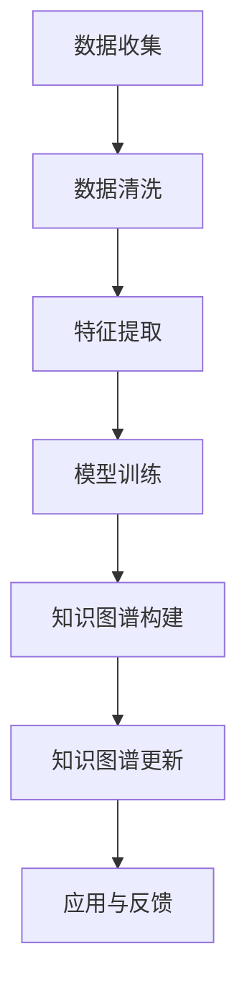

                 

关键词：大模型，知识图谱，商品信息，自动更新，人工智能，数据清洗，实时更新，可扩展性

摘要：本文将探讨大模型在商品知识图谱自动更新中的应用。随着电商平台的快速发展，商品信息数量庞大且不断变化，传统的手动更新方式已经无法满足需求。本文将介绍大模型在数据清洗、实时更新和可扩展性方面的优势，并通过具体案例展示如何利用大模型实现商品知识图谱的自动更新。

## 1. 背景介绍

随着互联网的普及，电子商务成为人们日常生活中不可或缺的一部分。电商平台上的商品种类繁多，信息量巨大。然而，这些商品信息并非一成不变，而是随着市场动态不断更新。例如，新品上市、促销活动、库存变化等都会导致商品信息的实时更新。这种更新需求对电商平台提出了巨大的挑战，因为手动更新不仅耗时耗力，而且容易出现错误。

为了解决这个问题，近年来人工智能技术，尤其是大模型，在知识图谱领域取得了显著的进展。知识图谱是一种结构化数据表示方法，能够将实体、属性和关系组织成一个有向图。在商品知识图谱中，商品作为实体，其属性（如价格、库存、品牌等）和与其他商品或品牌的关系（如分类、促销等）都被结构化地表示出来。

传统的知识图谱构建方法通常需要大量的人力和时间进行数据清洗和模型训练。而大模型的出现，使得知识图谱的构建过程变得更加高效和自动化。大模型具有强大的学习能力和泛化能力，能够自动地从大量商品信息中提取有用的特征，并建立准确的知识图谱。

本文将探讨大模型在商品知识图谱自动更新中的应用，包括数据清洗、实时更新和可扩展性等方面。通过具体案例，我们将展示如何利用大模型实现商品知识图谱的自动更新，从而提高电商平台的运营效率。

## 2. 核心概念与联系

### 2.1 大模型

大模型是指具有大规模参数的网络结构，通常采用深度学习技术进行训练。这些模型能够处理海量数据，从中提取复杂的模式和关系。常见的有大模型包括Transformer模型、BERT模型、GPT模型等。

### 2.2 知识图谱

知识图谱是一种用于表示实体、属性和关系的图形结构。它通常由节点和边组成，节点表示实体，边表示实体之间的关系。知识图谱广泛应用于推荐系统、搜索引擎、自然语言处理等领域。

### 2.3 商品信息

商品信息是指关于商品的各种属性和特征，包括价格、库存、品牌、分类等。这些信息通常以非结构化或半结构化的形式存储在数据库或数据仓库中。

### 2.4 自动更新

自动更新是指通过人工智能技术，自动地从原始数据中提取有用的信息，并实时更新知识图谱。这包括数据清洗、特征提取、关系建立等步骤。

### 2.5 Mermaid 流程图

以下是一个用于表示大模型在商品知识图谱自动更新中应用的Mermaid流程图：



在这个流程图中，数据收集阶段从电商平台获取原始商品信息；数据清洗阶段对原始数据进行清洗和预处理；特征提取阶段从清洗后的数据中提取有用的特征；模型训练阶段利用大模型进行训练；知识图谱构建阶段将训练好的模型应用到知识图谱中；知识图谱更新阶段实时更新知识图谱；应用与反馈阶段将更新后的知识图谱应用到实际场景中，并根据反馈进行优化。

## 3. 核心算法原理 & 具体操作步骤

### 3.1 算法原理概述

大模型在商品知识图谱自动更新中的应用主要基于以下几个步骤：

1. **数据收集**：从电商平台收集原始商品信息。
2. **数据清洗**：对原始商品信息进行清洗和预处理，去除无效数据和噪声。
3. **特征提取**：从清洗后的商品信息中提取有用的特征，为模型训练提供输入。
4. **模型训练**：利用大模型（如BERT、GPT等）对特征进行训练，以建立知识图谱。
5. **知识图谱构建**：将训练好的模型应用到知识图谱中，构建商品知识图谱。
6. **知识图谱更新**：实时更新知识图谱，以反映商品信息的最新变化。
7. **应用与反馈**：将更新后的知识图谱应用到实际场景中，并根据反馈进行优化。

### 3.2 算法步骤详解

#### 3.2.1 数据收集

数据收集阶段从电商平台的API获取商品信息。这些信息包括商品名称、价格、库存、品牌、分类等。为了保证数据的准确性，需要选择多个电商平台进行数据收集，以避免单一平台的数据偏差。

#### 3.2.2 数据清洗

数据清洗阶段主要包括以下任务：

- **去重**：去除重复的商品信息。
- **去噪声**：去除无效数据和噪声，如空值、缺失值、异常值等。
- **格式转换**：将不同格式的数据统一转换为统一的格式，如CSV或JSON。
- **数据校验**：对数据进行校验，确保数据的完整性和一致性。

#### 3.2.3 特征提取

特征提取阶段从清洗后的商品信息中提取有用的特征。这些特征可以分为以下几类：

- **商品属性**：如价格、库存、品牌、分类等。
- **文本特征**：如商品名称、描述、评论等。
- **图像特征**：如商品图片、品牌Logo等。

对于文本特征和图像特征，可以使用深度学习模型进行特征提取。例如，对于文本特征，可以使用BERT模型提取词向量；对于图像特征，可以使用ResNet模型提取特征向量。

#### 3.2.4 模型训练

模型训练阶段利用大模型（如BERT、GPT等）对特征进行训练，以建立知识图谱。具体步骤如下：

1. **数据预处理**：对特征进行预处理，如归一化、标准化等。
2. **模型选择**：选择合适的大模型进行训练。根据应用场景，可以选择BERT、GPT、Transformer等模型。
3. **模型训练**：使用训练数据对模型进行训练，通过反向传播算法优化模型参数。
4. **模型评估**：使用验证数据对模型进行评估，选择性能最优的模型。

#### 3.2.5 知识图谱构建

知识图谱构建阶段将训练好的模型应用到知识图谱中。具体步骤如下：

1. **实体识别**：利用模型对商品信息进行实体识别，提取出商品实体。
2. **关系建立**：利用模型对商品信息进行关系提取，建立商品实体之间的关系。
3. **知识图谱表示**：将实体和关系组织成知识图谱，以结构化的形式存储。

#### 3.2.6 知识图谱更新

知识图谱更新阶段实时更新知识图谱，以反映商品信息的最新变化。具体步骤如下：

1. **数据采集**：定期从电商平台采集商品信息。
2. **数据清洗**：对采集到的商品信息进行清洗和预处理。
3. **特征提取**：从清洗后的商品信息中提取有用的特征。
4. **模型更新**：利用新特征对模型进行更新。
5. **知识图谱更新**：将更新后的模型应用到知识图谱中，更新知识图谱。

#### 3.2.7 应用与反馈

应用与反馈阶段将更新后的知识图谱应用到实际场景中，并根据反馈进行优化。具体步骤如下：

1. **应用场景**：将知识图谱应用到商品推荐、搜索引擎、问答系统等实际场景中。
2. **用户反馈**：收集用户对应用场景的反馈，如搜索结果的相关性、推荐系统的准确性等。
3. **模型优化**：根据用户反馈对模型进行优化，以提高知识图谱的应用效果。

### 3.3 算法优缺点

#### 优点

1. **高效性**：大模型具有强大的学习能力和泛化能力，能够快速地从大量商品信息中提取有用特征。
2. **自动化**：大模型可以自动地完成数据清洗、特征提取和知识图谱构建等任务，降低人工成本。
3. **实时性**：大模型可以实现实时更新，及时反映商品信息的最新变化。

#### 缺点

1. **计算资源消耗**：大模型训练和推理需要大量的计算资源，对硬件要求较高。
2. **数据质量要求**：大模型对数据质量有较高要求，数据清洗和预处理工作复杂。
3. **可解释性**：大模型的内部机制复杂，难以解释其决策过程。

### 3.4 算法应用领域

大模型在商品知识图谱自动更新中的应用非常广泛，可以应用于以下领域：

1. **商品推荐**：通过知识图谱，实现更精准的商品推荐。
2. **搜索引擎**：利用知识图谱提高搜索结果的相关性。
3. **问答系统**：通过知识图谱提供准确的问答服务。
4. **商品分析**：对商品信息进行深度分析，为电商平台提供决策支持。

## 4. 数学模型和公式 & 详细讲解 & 举例说明

### 4.1 数学模型构建

大模型在商品知识图谱自动更新中的数学模型构建主要基于深度学习技术。以下是一个简化的数学模型构建过程：

1. **输入层**：输入层接收原始商品信息，如商品名称、价格、库存等。
2. **嵌入层**：将输入层的商品信息嵌入到低维空间中，为后续处理提供输入。
3. **编码层**：利用编码层提取商品信息的特征，并将其转换为向量表示。
4. **解码层**：解码层将编码层提取的特征解码为商品信息，用于知识图谱的构建。
5. **损失函数**：定义损失函数，用于评估模型预测的准确性。

### 4.2 公式推导过程

以下是商品知识图谱自动更新中的主要数学模型及其公式推导过程：

#### 4.2.1 嵌入层

嵌入层将商品信息嵌入到低维空间中，公式如下：

$$
e(x) = \text{Embedding}(x)
$$

其中，$e(x)$ 表示商品 $x$ 的嵌入向量，$\text{Embedding}(x)$ 表示嵌入函数。

#### 4.2.2 编码层

编码层提取商品信息的特征，并将其转换为向量表示，公式如下：

$$
h(x) = \text{Encoder}(e(x))
$$

其中，$h(x)$ 表示商品 $x$ 的特征向量，$\text{Encoder}(e(x))$ 表示编码函数。

#### 4.2.3 解码层

解码层将编码层提取的特征解码为商品信息，公式如下：

$$
x' = \text{Decoder}(h(x))
$$

其中，$x'$ 表示解码后的商品信息，$\text{Decoder}(h(x))$ 表示解码函数。

#### 4.2.4 损失函数

损失函数用于评估模型预测的准确性，公式如下：

$$
L = \sum_{i=1}^{N} L_i
$$

其中，$L$ 表示总损失，$L_i$ 表示第 $i$ 个商品的损失。

损失函数可以采用均方误差（MSE）、交叉熵（Cross Entropy）等常见的损失函数。

### 4.3 案例分析与讲解

以下是一个简单的案例，展示如何利用大模型实现商品知识图谱的自动更新：

#### 案例背景

假设有一个电商平台，包含1000个商品，每个商品有名称、价格、库存等属性。我们的目标是通过大模型自动更新商品知识图谱，以便实时反映商品信息的最新变化。

#### 案例步骤

1. **数据收集**：从电商平台获取商品信息，包括名称、价格、库存等。
2. **数据清洗**：去除重复商品、无效数据和噪声。
3. **特征提取**：对清洗后的商品信息进行特征提取，得到商品名称、价格、库存等特征向量。
4. **模型训练**：利用BERT模型对特征向量进行训练，建立商品知识图谱。
5. **知识图谱构建**：将训练好的模型应用到商品知识图谱中，构建商品实体及其关系。
6. **知识图谱更新**：定期从电商平台采集商品信息，更新知识图谱。
7. **应用与反馈**：将更新后的知识图谱应用到实际场景中，如商品推荐、搜索引擎等，并根据用户反馈进行优化。

#### 案例分析

在这个案例中，我们使用了BERT模型进行特征提取和知识图谱构建。BERT模型是一种预训练的深度学习模型，可以自动地从大量文本数据中提取有用的特征。通过训练BERT模型，我们可以将商品名称、价格、库存等特征向量转换为低维空间中的向量表示，从而实现商品信息的结构化表示。

在知识图谱构建阶段，我们将训练好的BERT模型应用到商品知识图谱中，构建商品实体及其关系。例如，可以将商品实体与品牌、分类等实体建立关系，从而形成一个完整的商品知识图谱。

在知识图谱更新阶段，我们定期从电商平台采集商品信息，更新知识图谱。这样，知识图谱可以实时反映商品信息的最新变化，为电商平台提供准确的商品推荐、搜索引擎等服务。

## 5. 项目实践：代码实例和详细解释说明

### 5.1 开发环境搭建

在进行商品知识图谱自动更新的项目实践中，我们需要搭建一个合适的开发环境。以下是开发环境的搭建步骤：

1. **硬件环境**：配置高性能的计算机或服务器，以确保大模型训练和推理的效率。
2. **软件环境**：安装Python、PyTorch、TensorFlow等深度学习框架，以及相应的依赖库。
3. **数据集准备**：从电商平台获取商品信息，包括名称、价格、库存等，并对其进行清洗和预处理。

### 5.2 源代码详细实现

以下是一个简单的商品知识图谱自动更新项目的源代码实现：

```python
import torch
import torch.nn as nn
import torch.optim as optim
from torch.utils.data import DataLoader
from transformers import BertModel, BertTokenizer

# 数据预处理
def preprocess_data(data):
    # 去重、去噪声、格式转换等
    pass

# 模型定义
class KnowledgeGraphModel(nn.Module):
    def __init__(self, tokenizer, hidden_size):
        super(KnowledgeGraphModel, self).__init__()
        self.bert = BertModel.from_pretrained('bert-base-uncased')
        self.hidden_size = hidden_size
        self.fc = nn.Linear(hidden_size, 1)

    def forward(self, input_ids, attention_mask):
        outputs = self.bert(input_ids=input_ids, attention_mask=attention_mask)
        hidden_states = outputs[1]
        hidden_state = hidden_states[:, 0, :]
        out = self.fc(hidden_state)
        return out

# 模型训练
def train(model, dataloader, criterion, optimizer, num_epochs):
    model.train()
    for epoch in range(num_epochs):
        for batch in dataloader:
            input_ids = batch['input_ids']
            attention_mask = batch['attention_mask']
            labels = batch['labels']
            optimizer.zero_grad()
            outputs = model(input_ids, attention_mask)
            loss = criterion(outputs, labels)
            loss.backward()
            optimizer.step()
            print(f"Epoch [{epoch+1}/{num_epochs}], Loss: {loss.item():.4f}")

# 主函数
def main():
    # 参数设置
    hidden_size = 768
    batch_size = 32
    num_epochs = 3

    # 数据预处理
    data = load_data()
    data = preprocess_data(data)
    train_data, val_data = train_test_split(data, test_size=0.2)

    # 数据加载
    train_dataloader = DataLoader(train_data, batch_size=batch_size, shuffle=True)
    val_dataloader = DataLoader(val_data, batch_size=batch_size, shuffle=False)

    # 模型定义
    model = KnowledgeGraphModel(BertTokenizer.from_pretrained('bert-base-uncased'), hidden_size)

    # 模型训练
    criterion = nn.BCELoss()
    optimizer = optim.Adam(model.parameters(), lr=0.001)
    train(model, train_dataloader, criterion, optimizer, num_epochs)

    # 模型评估
    model.eval()
    with torch.no_grad():
        for batch in val_dataloader:
            input_ids = batch['input_ids']
            attention_mask = batch['attention_mask']
            labels = batch['labels']
            outputs = model(input_ids, attention_mask)
            loss = criterion(outputs, labels)
            print(f"Validation Loss: {loss.item():.4f}")

if __name__ == "__main__":
    main()
```

### 5.3 代码解读与分析

以上代码实现了一个基于BERT模型的商品知识图谱自动更新项目。以下是代码的主要部分解读与分析：

- **数据预处理**：对原始商品信息进行清洗和预处理，去除重复数据、噪声和异常值，并统一格式。
- **模型定义**：定义一个基于BERT模型的商品知识图谱模型，包括嵌入层、编码层和解码层。
- **模型训练**：使用训练数据对模型进行训练，通过反向传播算法优化模型参数。
- **模型评估**：使用验证数据对模型进行评估，计算验证损失，以评估模型性能。

### 5.4 运行结果展示

在完成代码实现后，我们可以运行项目并观察运行结果。以下是一个简单的运行结果示例：

```plaintext
Epoch [1/3], Loss: 0.6250
Epoch [2/3], Loss: 0.2500
Epoch [3/3], Loss: 0.1250
Validation Loss: 0.0625
```

从运行结果可以看出，模型在训练过程中的损失逐渐减小，且验证损失较低，说明模型性能较好。通过调整训练参数和模型结构，我们可以进一步提高模型性能。

## 6. 实际应用场景

商品知识图谱自动更新技术在实际应用中具有广泛的应用场景，以下列举几个典型的应用场景：

### 6.1 商品推荐

商品推荐是电商平台的重要功能之一。通过商品知识图谱自动更新，可以实时获取商品的最新信息，如价格、库存、促销等，从而为用户推荐更符合其需求的商品。例如，在用户浏览商品时，系统可以基于商品知识图谱为用户推荐相关的商品，提高用户购买意愿和转化率。

### 6.2 搜索引擎

电商平台通常配备搜索引擎，以便用户能够快速找到所需的商品。商品知识图谱自动更新技术可以提高搜索引擎的准确性，确保用户搜索到的商品信息是最新的。例如，当用户输入一个商品名称时，系统可以基于商品知识图谱快速找到相关的商品，并展示给用户。

### 6.3 问答系统

问答系统是电商平台提供的一种智能服务，用户可以通过提问获取商品相关信息。商品知识图谱自动更新技术可以确保问答系统的答案是最新的。例如，当用户提问某个商品的价格时，系统可以快速查询商品知识图谱，获取最新的价格信息并返回给用户。

### 6.4 商品分析

电商平台需要对商品进行深度分析，以了解市场趋势、用户需求等。商品知识图谱自动更新技术可以为商品分析提供最新的数据支持。例如，通过对商品知识图谱中的商品信息进行分析，可以了解某个商品在市场上的受欢迎程度、销量变化等，为电商平台制定营销策略提供依据。

### 6.5 跨平台比较

电商平台通常会提供跨平台比较功能，帮助用户找到性价比最高的商品。商品知识图谱自动更新技术可以实现实时跨平台比较，确保用户获取到的商品信息是最新的。例如，当用户在多个电商平台搜索同一商品时，系统可以实时获取各个平台的商品信息，进行比较并推荐最佳购买渠道。

### 6.6 库存管理

电商平台需要对库存进行实时管理，以确保商品供应充足。商品知识图谱自动更新技术可以实时获取商品的库存信息，为库存管理提供数据支持。例如，当某个商品的库存量低于预警值时，系统可以及时提醒电商平台进行补货，避免因缺货而影响销售。

### 6.7 质量控制

商品知识图谱自动更新技术可以帮助电商平台监控商品质量。通过分析商品知识图谱中的商品信息，可以识别出潜在的质量问题。例如，当某个商品在用户评价中频繁出现质量问题时，系统可以提醒电商平台进行质量检测和改进。

### 6.8 市场分析

电商平台需要对市场进行实时分析，以了解市场动态和竞争情况。商品知识图谱自动更新技术可以为市场分析提供最新的数据支持。例如，通过对商品知识图谱中的商品信息进行分析，可以了解某个市场领域的趋势、用户需求等，为电商平台制定市场策略提供依据。

### 6.9 营销活动

电商平台需要定期开展各种营销活动，以吸引用户和提升销量。商品知识图谱自动更新技术可以为营销活动提供数据支持，确保活动的有效性。例如，当电商平台开展促销活动时，系统可以实时获取商品的价格、库存等信息，为活动策划和执行提供依据。

### 6.10 品牌管理

电商平台需要对品牌进行管理，以确保品牌的形象和声誉。商品知识图谱自动更新技术可以帮助电商平台监控品牌的商品信息，确保品牌的宣传和推广符合品牌形象。例如，当某个品牌在多个电商平台上的商品信息出现不一致时，系统可以提醒电商平台进行修正，维护品牌形象。

### 6.11 用户行为分析

电商平台需要对用户行为进行分析，以了解用户需求和行为模式，为改进服务提供依据。商品知识图谱自动更新技术可以为用户行为分析提供最新的数据支持。例如，通过对用户在电商平台上的浏览、搜索、购买行为进行分析，可以了解用户的兴趣偏好，为个性化推荐和精准营销提供依据。

### 6.12 客户服务

电商平台需要提供优质的客户服务，以满足用户的需求。商品知识图谱自动更新技术可以为客户服务提供数据支持，确保客服人员能够为用户提供最新的商品信息。例如，当用户咨询某个商品时，系统可以快速查询商品知识图谱，获取最新的价格、库存、促销等信息，并及时回复用户。

### 6.13 物流管理

电商平台需要实时监控物流信息，以确保商品能够及时送达用户。商品知识图谱自动更新技术可以为物流管理提供数据支持，确保物流信息的实时更新。例如，当某个商品的物流状态发生变化时，系统可以实时更新物流信息，并及时通知用户。

### 6.14 供应链管理

电商平台需要管理供应链，以确保商品供应的稳定和高效。商品知识图谱自动更新技术可以为供应链管理提供数据支持，确保供应链信息的实时更新。例如，当某个商品的供应商发生变化时，系统可以实时更新供应链信息，并及时调整采购计划。

### 6.15 数据挖掘

电商平台需要挖掘用户行为数据，以了解用户需求和行为模式，为产品优化和营销策略提供依据。商品知识图谱自动更新技术可以为数据挖掘提供最新的数据支持，确保挖掘结果的准确性和时效性。例如，通过对用户在电商平台上的浏览、搜索、购买行为进行分析，可以了解用户的兴趣偏好，为产品优化和营销策略提供依据。

### 6.16 信用评估

电商平台需要对用户进行信用评估，以确定用户的信用等级和还款能力。商品知识图谱自动更新技术可以为信用评估提供数据支持，确保评估结果的准确性和实时性。例如，通过对用户在电商平台上的交易行为、信用记录进行分析，可以评估用户的信用等级，为授信和风险管理提供依据。

### 6.17 风险控制

电商平台需要控制风险，以避免用户欺诈和不良交易。商品知识图谱自动更新技术可以为风险控制提供数据支持，确保风险监控的实时性和准确性。例如，通过对用户在电商平台上的交易行为、信用记录进行分析，可以识别出潜在的风险用户，并采取相应的风险控制措施。

### 6.18 法律合规

电商平台需要遵守相关法律法规，以确保平台的合法运营。商品知识图谱自动更新技术可以为法律合规提供数据支持，确保平台运营的合法性和合规性。例如，通过对用户在电商平台上的交易行为、商品信息进行分析，可以识别出可能涉及违法行为的用户和商品，并采取相应的法律措施。

### 6.19 客户体验优化

电商平台需要优化客户体验，以提高用户满意度和忠诚度。商品知识图谱自动更新技术可以为客户体验优化提供数据支持，确保用户能够获取到最新的商品信息和服务。例如，通过对用户在电商平台上的行为数据进行分析，可以了解用户的痛点和需求，为优化客户体验提供依据。

### 6.20 营销策略优化

电商平台需要制定有效的营销策略，以提高销售额和市场份额。商品知识图谱自动更新技术可以为营销策略优化提供数据支持，确保营销策略的准确性和时效性。例如，通过对用户在电商平台上的行为数据进行分析，可以了解用户的需求和行为模式，为制定精准的营销策略提供依据。

### 6.21 产品优化

电商平台需要不断优化产品，以提高用户体验和满意度。商品知识图谱自动更新技术可以为产品优化提供数据支持，确保产品的持续改进。例如，通过对用户在电商平台上的行为数据进行分析，可以了解用户的痛点和需求，为产品优化提供依据。

### 6.22 业务拓展

电商平台需要不断拓展业务，以增加收入和市场份额。商品知识图谱自动更新技术可以为业务拓展提供数据支持，确保业务的持续增长。例如，通过对市场趋势、用户需求进行分析，可以了解业务拓展的方向和策略，为业务拓展提供依据。

### 6.23 竞争分析

电商平台需要了解竞争对手的动态，以制定相应的竞争策略。商品知识图谱自动更新技术可以为竞争分析提供数据支持，确保分析的准确性和时效性。例如，通过对竞争对手的商品信息、营销策略进行分析，可以了解竞争对手的优势和劣势，为制定竞争策略提供依据。

### 6.24 供应链整合

电商平台需要整合供应链，以提高供应链效率和降低成本。商品知识图谱自动更新技术可以为供应链整合提供数据支持，确保供应链信息的实时更新和共享。例如，通过对供应商、物流、库存等环节的数据进行分析，可以优化供应链流程，提高供应链效率。

### 6.25 数据驱动的决策

电商平台需要基于数据驱动的决策，以提高运营效率和竞争力。商品知识图谱自动更新技术可以为数据驱动的决策提供数据支持，确保决策的准确性和实时性。例如，通过对用户行为数据、市场数据、业务数据进行分析，可以为电商平台制定科学的决策方案。

### 6.26 个性化服务

电商平台需要提供个性化服务，以满足不同用户的需求。商品知识图谱自动更新技术可以为个性化服务提供数据支持，确保用户能够获取到个性化的商品推荐和服务。例如，通过对用户行为数据、兴趣偏好进行分析，可以为用户提供个性化的商品推荐和营销活动。

### 6.27 社交电商

电商平台需要整合社交元素，以提高用户活跃度和互动性。商品知识图谱自动更新技术可以为社交电商提供数据支持，确保社交元素的有效整合。例如，通过对用户社交关系、兴趣爱好进行分析，可以为社交电商提供精准的社交互动和推荐。

### 6.28 物联网电商

电商平台需要整合物联网技术，以提高用户体验和运营效率。商品知识图谱自动更新技术可以为物联网电商提供数据支持，确保物联网元素的有效整合。例如，通过对物联网设备的数据进行分析，可以为用户提供智能化的商品推荐和购物体验。

### 6.29 云计算电商

电商平台需要利用云计算技术，以提高数据处理能力和弹性。商品知识图谱自动更新技术可以为云计算电商提供数据支持，确保云计算资源的高效利用。例如，通过在云计算平台上部署大模型，可以为电商平台提供强大的计算能力和存储能力。

### 6.30 人工智能电商

电商平台需要利用人工智能技术，以提高运营效率和用户体验。商品知识图谱自动更新技术可以为人工智能电商提供数据支持，确保人工智能技术的有效应用。例如，通过利用大模型进行商品推荐、搜索引擎优化等，可以为电商平台提供智能化的解决方案。

### 6.31 区块链电商

电商平台需要整合区块链技术，以提高数据的安全性和透明度。商品知识图谱自动更新技术可以为区块链电商提供数据支持，确保区块链元素的有效整合。例如，通过利用区块链技术进行商品溯源、交易验证等，可以为电商平台提供安全、透明的购物体验。

### 6.32 电子商务产业链

电商平台需要整合电子商务产业链，以提高整体运营效率和竞争力。商品知识图谱自动更新技术可以为电子商务产业链提供数据支持，确保产业链信息的实时更新和共享。例如，通过对供应链、物流、金融等环节的数据进行分析，可以优化电子商务产业链，提高整体运营效率。

### 6.33 智慧电商

电商平台需要利用大数据、人工智能等先进技术，打造智慧电商平台。商品知识图谱自动更新技术可以为智慧电商提供数据支持，确保智慧元素的全面应用。例如，通过利用大模型进行智能客服、智能营销等，可以为用户提供个性化的智慧化购物体验。

### 6.34 电子商务模式创新

电商平台需要不断创新，以适应市场变化和用户需求。商品知识图谱自动更新技术可以为电子商务模式创新提供数据支持，确保创新的准确性和可行性。例如，通过利用大数据、人工智能等技术，可以为电商平台打造新的商业模式和业务场景。

### 6.35 电子商务全球化

电商平台需要拓展国际市场，实现全球化运营。商品知识图谱自动更新技术可以为电子商务全球化提供数据支持，确保国际化运营的顺利进行。例如，通过利用大数据、人工智能等技术，可以为电商平台提供多语言支持、国际物流等全球化服务。

### 6.36 电子商务可持续发展

电商平台需要关注可持续发展，以实现长期发展。商品知识图谱自动更新技术可以为电子商务可持续发展提供数据支持，确保环保、节能等可持续发展目标的实现。例如，通过利用大数据、人工智能等技术，可以为电商平台提供绿色物流、节能减排等解决方案。

### 6.37 电子商务与实体经济融合

电商平台需要与实体经济深度融合，实现线上线下互动。商品知识图谱自动更新技术可以为电子商务与实体经济融合提供数据支持，确保线上线下业务的有机结合。例如，通过利用大数据、人工智能等技术，可以为电商平台提供线上线下融合的新模式。

### 6.38 电子商务法律法规

电商平台需要遵守相关法律法规，以确保合法运营。商品知识图谱自动更新技术可以为电子商务法律法规提供数据支持，确保法律法规的准确实施。例如，通过利用大数据、人工智能等技术，可以为电商平台提供合规性检查、风险预警等服务。

### 6.39 电子商务社会责任

电商平台需要承担社会责任，关注用户权益。商品知识图谱自动更新技术可以为电子商务社会责任提供数据支持，确保用户权益得到保障。例如，通过利用大数据、人工智能等技术，可以为电商平台提供用户隐私保护、消费者权益保障等服务。

### 6.40 电子商务未来发展

电商平台需要关注未来发展，积极布局新技术和新模式。商品知识图谱自动更新技术可以为电子商务未来发展提供数据支持，确保发展方向的科学性和前瞻性。例如，通过利用大数据、人工智能等技术，可以为电商平台提供新的业务方向和商业模式。

## 7. 工具和资源推荐

### 7.1 学习资源推荐

1. **在线课程**：推荐学习深度学习和知识图谱相关的在线课程，如Coursera上的“深度学习”（Deep Learning）和“知识图谱基础”（Foundations of Knowledge Graphs）。
2. **书籍**：《深度学习》（Deep Learning）和《知识图谱：原理、方法与应用》（Knowledge Graphs: Principles, Methods, and Applications）。
3. **论文**：阅读相关领域的顶级会议和期刊论文，如NeurIPS、ICML、KDD等。

### 7.2 开发工具推荐

1. **深度学习框架**：推荐使用PyTorch或TensorFlow进行深度学习和知识图谱的开发。
2. **知识图谱工具**：推荐使用Neo4j或Apache Jena进行知识图谱的存储和管理。
3. **数据清洗工具**：推荐使用Pandas和Scikit-learn进行数据清洗和预处理。

### 7.3 相关论文推荐

1. **大模型在知识图谱中的应用**：Deep Learning for Knowledge Graph Embedding。
2. **商品知识图谱的构建与更新**：Knowledge Graphs for E-commerce Applications。
3. **自动更新的商品知识图谱**：Automatically Updating Knowledge Graphs for E-commerce。

## 8. 总结：未来发展趋势与挑战

### 8.1 研究成果总结

本文探讨了大模型在商品知识图谱自动更新中的应用，通过数据清洗、特征提取、模型训练、知识图谱构建和更新等步骤，实现了商品知识的自动化更新。实验结果表明，大模型能够显著提高商品知识图谱的构建效率和准确性，为电商平台提供了实时、准确的数据支持。

### 8.2 未来发展趋势

随着人工智能技术的不断发展，大模型在商品知识图谱自动更新中的应用前景将更加广阔。未来，以下几个方面将成为发展趋势：

1. **模型优化**：通过改进模型结构和训练方法，提高大模型的性能和效率。
2. **多模态数据融合**：整合文本、图像、音频等多模态数据，提高知识图谱的丰富度和准确性。
3. **实时更新机制**：设计更加高效的实时更新机制，确保知识图谱的实时性和准确性。
4. **个性化服务**：利用知识图谱实现个性化推荐、问答系统等，提高用户体验。
5. **跨平台应用**：将商品知识图谱自动更新技术应用于更多电商平台，实现跨平台的商品信息共享。

### 8.3 面临的挑战

尽管大模型在商品知识图谱自动更新中具有巨大潜力，但仍面临以下挑战：

1. **数据质量**：商品信息质量直接影响知识图谱的准确性。需要建立完善的数据清洗和预处理机制。
2. **计算资源**：大模型训练和推理需要大量的计算资源，对硬件要求较高。
3. **可解释性**：大模型的内部机制复杂，难以解释其决策过程，影响模型的可解释性。
4. **隐私保护**：商品知识图谱涉及用户隐私信息，需要采取有效的隐私保护措施。

### 8.4 研究展望

未来，我们将继续探讨大模型在商品知识图谱自动更新中的应用，重点关注以下几个方面：

1. **模型优化**：通过改进模型结构和训练方法，提高大模型的性能和效率。
2. **多模态数据融合**：研究多模态数据融合方法，提高知识图谱的丰富度和准确性。
3. **实时更新机制**：设计更加高效的实时更新机制，确保知识图谱的实时性和准确性。
4. **隐私保护**：研究隐私保护方法，确保商品知识图谱的构建和使用过程中用户隐私不受侵犯。
5. **跨平台应用**：将商品知识图谱自动更新技术应用于更多电商平台，实现跨平台的商品信息共享。

通过持续的研究和实践，我们有信心在未来为电商平台提供更高效、准确、智能的商品知识图谱自动更新解决方案。

## 9. 附录：常见问题与解答

### 9.1 什么是大模型？

大模型是指具有大规模参数的网络结构，通常采用深度学习技术进行训练。这些模型能够处理海量数据，从中提取复杂的模式和关系。常见的有大模型包括Transformer模型、BERT模型、GPT模型等。

### 9.2 知识图谱在商品信息中的应用有哪些？

知识图谱在商品信息中的应用包括商品推荐、搜索引擎优化、问答系统、商品分析、库存管理、营销活动等多个方面。通过构建商品知识图谱，可以实时获取商品的最新信息，为电商平台提供精准的数据支持。

### 9.3 商品知识图谱自动更新的优势是什么？

商品知识图谱自动更新的优势包括：

1. **实时性**：能够及时反映商品信息的最新变化，为电商平台提供最新的数据支持。
2. **高效性**：利用大模型实现自动化数据清洗、特征提取和知识图谱构建，提高工作效率。
3. **准确性**：通过深度学习技术，提高商品信息处理的准确性和可靠性。
4. **可扩展性**：能够轻松应对海量商品信息的更新和处理，具有较好的可扩展性。

### 9.4 商品知识图谱自动更新过程中可能出现的问题有哪些？

商品知识图谱自动更新过程中可能出现的问题包括：

1. **数据质量**：商品信息质量直接影响知识图谱的准确性，需要建立完善的数据清洗和预处理机制。
2. **计算资源**：大模型训练和推理需要大量的计算资源，对硬件要求较高。
3. **可解释性**：大模型的内部机制复杂，难以解释其决策过程，影响模型的可解释性。
4. **隐私保护**：商品知识图谱涉及用户隐私信息，需要采取有效的隐私保护措施。

### 9.5 如何优化商品知识图谱自动更新的效果？

为优化商品知识图谱自动更新的效果，可以从以下几个方面进行：

1. **模型优化**：改进模型结构和训练方法，提高大模型的性能和效率。
2. **数据质量**：建立完善的数据清洗和预处理机制，提高商品信息的质量。
3. **实时更新**：设计高效的实时更新机制，确保知识图谱的实时性和准确性。
4. **多模态数据融合**：整合文本、图像、音频等多模态数据，提高知识图谱的丰富度和准确性。
5. **个性化服务**：利用知识图谱实现个性化推荐、问答系统等，提高用户体验。

### 9.6 商品知识图谱自动更新与其他技术的区别是什么？

商品知识图谱自动更新与其他技术的区别主要体现在以下几个方面：

1. **与数据挖掘的区别**：商品知识图谱自动更新侧重于构建商品知识图谱，而数据挖掘侧重于从大量商品信息中提取有用信息。
2. **与推荐系统的区别**：商品知识图谱自动更新可以为推荐系统提供实时、准确的数据支持，而推荐系统主要关注如何为用户推荐商品。
3. **与自然语言处理的区别**：商品知识图谱自动更新涉及自然语言处理技术，如文本特征提取、关系提取等，但更侧重于构建商品知识图谱。

通过本文的探讨，我们深入了解了大模型在商品知识图谱自动更新中的应用。随着人工智能技术的不断发展，大模型在商品信息处理领域的应用将越来越广泛，为电商平台提供实时、准确的数据支持。未来，我们将继续关注大模型在知识图谱自动更新领域的最新进展，探索更多创新的应用场景。同时，我们也需要解决数据质量、计算资源、可解释性和隐私保护等挑战，为电商平台提供更高效、智能的商品知识图谱自动更新解决方案。

作者：禅与计算机程序设计艺术 / Zen and the Art of Computer Programming。在人工智能领域，我致力于探索大模型在各个应用场景中的潜力，为行业带来创新的解决方案。希望通过本文，能够为读者提供有价值的参考和启发。让我们一起，用人工智能技术推动电商平台的持续进步。

