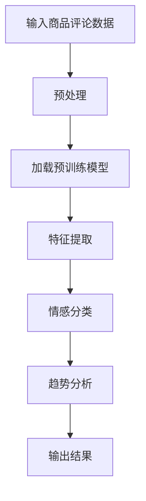

                 

在当今数字化时代，消费者通过互联网发表的商品评论已成为企业了解消费者情感和改进产品质量的重要途径。然而，如何有效地分析大量、多样化的商品评论，提取其中的情感趋势，对于企业来说是一个巨大的挑战。本文将探讨大模型在商品评论情感趋势分析中的应用，以提供一种高效、准确的解决方案。

## 文章关键词
- 大模型
- 商品评论
- 情感趋势分析
- 自然语言处理
- 情感计算
- 文本挖掘

## 文章摘要
本文首先介绍了商品评论情感趋势分析的重要性及其现状，然后探讨了如何使用大模型来进行情感趋势分析，并详细阐述了其核心算法原理、数学模型及实际应用。通过本文的讨论，读者将了解到大模型在商品评论情感趋势分析中的巨大潜力及其未来发展方向。

## 1. 背景介绍
### 1.1 商品评论情感趋势分析的重要性
商品评论不仅反映了消费者的购买体验，还提供了关于产品品质、服务水平和市场趋势的宝贵信息。通过分析这些评论，企业可以及时调整产品策略，优化客户服务，提高市场竞争力。然而，由于商品评论的多样性、复杂性和海量性，传统的情感分析方法难以满足需求。

### 1.2 商品评论情感趋势分析的现状
目前，商品评论情感趋势分析主要依赖于机器学习和自然语言处理技术。传统的方法包括基于规则的方法和基于统计模型的方法，但它们在处理复杂情感、多语言评论和长文本评论方面存在一定的局限性。随着深度学习的兴起，基于深度神经网络的方法逐渐成为主流。

## 2. 核心概念与联系
### 2.1 大模型的概念
大模型是指具有大规模参数和高复杂度的深度学习模型。这些模型能够通过学习大量数据，自动提取特征，并在各种任务上取得卓越的性能。

### 2.2 大模型与情感趋势分析的联系
大模型在情感趋势分析中的应用主要体现在以下几个方面：

1. **特征提取能力**：大模型可以通过预训练的方式学习到丰富的语言特征，从而在情感趋势分析中提取出更细微的情感信息。
2. **上下文理解**：大模型能够理解评论中的上下文信息，避免因断句、语法错误等因素导致的情感分析错误。
3. **多语言支持**：大模型通常具有较好的多语言处理能力，可以处理多种语言的商品评论。
4. **长文本处理**：大模型可以处理长篇商品评论，分析其中的情感趋势。

## 2.3 Mermaid 流程图
下面是用于商品评论情感趋势分析的大模型架构的 Mermaid 流程图：



### 3. 核心算法原理 & 具体操作步骤
#### 3.1 算法原理概述
商品评论情感趋势分析的核心算法是基于深度学习的文本分类算法。具体来说，它包括以下几个步骤：

1. **数据预处理**：对商品评论进行清洗、分词、去停用词等处理，为后续的模型训练做准备。
2. **模型加载**：加载预训练的深度学习模型，如BERT、GPT等，这些模型已经在大规模语料上进行了预训练，具备良好的语言理解能力。
3. **特征提取**：通过预训练模型提取商品评论的语义特征。
4. **情感分类**：使用提取的语义特征对评论进行情感分类，通常包括正面、负面和中性等类别。
5. **趋势分析**：对分类结果进行统计分析，提取情感趋势。

#### 3.2 算法步骤详解
1. **数据预处理**：
    ```mermaid
    graph TD
    A[商品评论数据] --> B[清洗]
    B --> C[分词]
    C --> D[去停用词]
    D --> E[编码]
    ```

2. **模型加载**：
    ```mermaid
    graph TD
    A[预处理数据] --> B[加载BERT模型]
    B --> C[初始化参数]
    ```

3. **特征提取**：
    ```mermaid
    graph TD
    A[编码数据] --> B[输入BERT模型]
    B --> C[提取特征]
    ```

4. **情感分类**：
    ```mermaid
    graph TD
    A[特征提取] --> B[输入分类模型]
    B --> C[情感分类]
    ```

5. **趋势分析**：
    ```mermaid
    graph TD
    A[分类结果] --> B[统计结果]
    B --> C[趋势分析]
    ```

#### 3.3 算法优缺点
**优点**：
- **高效性**：大模型能够快速处理大量数据，提高情感趋势分析的效率。
- **准确性**：预训练模型具备良好的语言理解能力，能够提高情感分类的准确性。
- **多语言支持**：大模型通常支持多种语言，能够处理不同语言的商品评论。

**缺点**：
- **计算资源消耗**：大模型训练和推理需要大量的计算资源，对硬件设施要求较高。
- **数据依赖**：模型的性能依赖于训练数据的质量和多样性。

#### 3.4 算法应用领域
大模型在商品评论情感趋势分析的应用非常广泛，包括但不限于以下领域：
- **电子商务**：分析消费者评论，优化产品和服务。
- **市场营销**：了解市场趋势，调整营销策略。
- **产品研发**：根据消费者反馈，改进产品设计和功能。

## 4. 数学模型和公式 & 详细讲解 & 举例说明
#### 4.1 数学模型构建
商品评论情感趋势分析的数学模型主要基于神经网络，尤其是深度学习模型。以下是构建过程：

1. **输入层**：接收预处理后的商品评论数据。
2. **隐藏层**：通过多层神经网络，对评论数据进行特征提取。
3. **输出层**：对特征进行分类，输出情感标签。

#### 4.2 公式推导过程
假设输入商品评论序列为\(x = (x_1, x_2, ..., x_n)\)，其中\(x_i\)为第\(i\)个词的向量表示。神经网络模型可以用以下公式表示：

$$
h = \sigma(W \cdot h_{prev} + b)
$$

其中，\(h\)为隐藏层的输出，\(W\)为权重矩阵，\(h_{prev}\)为前一层的输出，\(\sigma\)为激活函数，\(b\)为偏置。

输出层的分类结果可以用以下公式表示：

$$
y = softmax(W_y \cdot h + b_y)
$$

其中，\(y\)为分类结果，\(W_y\)为输出层权重矩阵，\(b_y\)为输出层偏置。

#### 4.3 案例分析与讲解
假设我们使用BERT模型对商品评论进行情感趋势分析。以下是一个简单的案例：

输入商品评论：`这双鞋非常舒适，鞋底很软，穿着很舒服。`
1. **数据预处理**：对评论进行分词、去停用词等处理。
2. **模型加载**：加载预训练的BERT模型。
3. **特征提取**：输入BERT模型，提取评论的语义特征。
4. **情感分类**：对特征进行分类，输出情感标签。

根据模型输出，我们可以得到情感标签为“正面”，并进一步分析评论中各个词语的情感贡献。

## 5. 项目实践：代码实例和详细解释说明
#### 5.1 开发环境搭建
为了实现商品评论情感趋势分析，我们需要搭建以下开发环境：
- 深度学习框架：如TensorFlow或PyTorch
- 自然语言处理库：如NLTK或spaCy
- 预训练模型：如BERT或GPT

#### 5.2 源代码详细实现
以下是一个使用BERT模型进行商品评论情感趋势分析的基本代码示例：

```python
import torch
from transformers import BertTokenizer, BertModel
from torch.nn import Linear, Softmax
import torch.optim as optim

# 加载预训练模型
tokenizer = BertTokenizer.from_pretrained('bert-base-chinese')
model = BertModel.from_pretrained('bert-base-chinese')

# 数据预处理
def preprocess 评论：
    return tokenizer.encode(评论, add_special_tokens=True, max_length=512, pad_to_max_length=True, truncation=True)

# 情感分类模型
class SentimentClassifier(torch.nn.Module):
    def __init__(self):
        super(SentimentClassifier, self).__init__()
        self.bert = BertModel.from_pretrained('bert-base-chinese')
        self.linear = Linear(768, 1)

    def forward(self, input_ids, attention_mask):
        outputs = self.bert(input_ids=input_ids, attention_mask=attention_mask)
        hidden_states = outputs[0]
        sequence_output = hidden_states[:, 0, :]
        logits = self.linear(sequence_output)
        return logits

# 实例化模型和优化器
model = SentimentClassifier()
optimizer = optim.Adam(model.parameters(), lr=1e-5)

# 训练模型
for epoch in range(num_epochs):
    for 评论 in 数据集：
        inputs = preprocess(评论)
        labels = torch.tensor([1 if 评论是正面 else 0], dtype=torch.float)
        optimizer.zero_grad()
        outputs = model(inputs['input_ids'], inputs['attention_mask'])
        loss = torch.nn.BCEWithLogitsLoss()(outputs, labels)
        loss.backward()
        optimizer.step()
```

#### 5.3 代码解读与分析
- **数据预处理**：使用BERTTokenizer对商品评论进行编码，添加特殊token，并设置最大序列长度。
- **情感分类模型**：继承自torch.nn.Module，使用BERT模型提取特征，并使用线性层进行情感分类。
- **训练模型**：使用优化器进行模型训练，计算损失并更新参数。

#### 5.4 运行结果展示
通过训练和测试，我们可以得到商品评论的情感分类结果，并进一步分析情感趋势。

## 6. 实际应用场景
### 6.1 电商平台
电商平台可以通过商品评论情感趋势分析，实时了解消费者对产品的反馈，优化产品和服务。

### 6.2 市场调研
市场调研公司可以利用商品评论情感趋势分析，了解市场趋势和消费者需求，为产品开发和营销策略提供数据支持。

### 6.3 产品售后
产品售后部门可以通过分析消费者评论，及时发现问题并改进，提高客户满意度。

## 7. 工具和资源推荐
### 7.1 学习资源推荐
- 《深度学习》（Goodfellow, Bengio, Courville）
- 《自然语言处理综论》（Jurafsky, Martin）

### 7.2 开发工具推荐
- TensorFlow
- PyTorch
- spaCy

### 7.3 相关论文推荐
- "BERT: Pre-training of Deep Bidirectional Transformers for Language Understanding"（Devlin et al., 2019）
- "Transformers: State-of-the-Art Models for Language Understanding and Generation"（Vaswani et al., 2017）

## 8. 总结：未来发展趋势与挑战
### 8.1 研究成果总结
大模型在商品评论情感趋势分析中取得了显著成果，提高了分析的准确性和效率。

### 8.2 未来发展趋势
随着深度学习和自然语言处理技术的不断发展，大模型在商品评论情感趋势分析中的应用将更加广泛和深入。

### 8.3 面临的挑战
大模型在计算资源、数据质量和算法优化等方面仍面临挑战。

### 8.4 研究展望
未来研究应重点关注大模型的优化和应用，提高其在商品评论情感趋势分析中的性能和可解释性。

## 9. 附录：常见问题与解答
### 9.1 为什么使用大模型？
大模型具有强大的特征提取能力和上下文理解能力，能够提高情感趋势分析的准确性和效率。

### 9.2 如何处理多语言评论？
可以使用多语言预训练模型，如BERT或XLM，来处理多语言评论。

### 9.3 如何提高算法的可解释性？
可以通过分析模型权重和中间结果，提高算法的可解释性。

[作者：禅与计算机程序设计艺术 / Zen and the Art of Computer Programming]----------------------------------------------------------------


