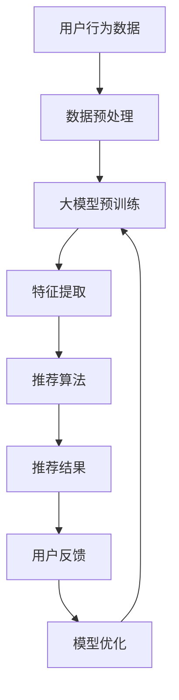

                 

关键词：大模型、推荐系统、算法、AI、机器学习

> 摘要：本文将深入探讨大模型在推荐系统中的重要作用，分析大模型是如何提升推荐系统性能，并探讨其在实际应用中的挑战和未来发展方向。

## 1. 背景介绍

推荐系统作为人工智能领域的一个重要应用，已广泛应用于电子商务、社交媒体、在线视频、新闻资讯等领域。推荐系统的目标是根据用户的历史行为和偏好，为用户推荐他们可能感兴趣的内容。然而，传统的推荐系统在面对海量数据和高维度特征时，往往难以满足用户的需求。

近年来，大模型技术的发展为推荐系统带来了新的契机。大模型是指具有数十亿甚至千亿参数的深度学习模型，如GPT、BERT等。这些模型通过在大量数据上进行预训练，能够捕捉到数据中的复杂模式和关联，从而提高推荐系统的效果。

## 2. 核心概念与联系

### 2.1 大模型

大模型通常是指具有数十亿甚至千亿参数的深度学习模型。这些模型通过在大量数据上进行预训练，能够捕捉到数据中的复杂模式和关联。

### 2.2 推荐系统

推荐系统是一种信息过滤技术，旨在向用户推荐他们可能感兴趣的内容。推荐系统通常基于用户的历史行为、内容特征和社交关系等数据进行建模。

### 2.3 大模型与推荐系统的联系

大模型在推荐系统中的作用主要体现在以下几个方面：

- **特征提取**：大模型能够在大量数据中自动提取有用的特征，从而提高推荐系统的特征表示能力。
- **关联发现**：大模型能够发现数据中的潜在关联和模式，从而提高推荐系统的相关性。
- **泛化能力**：大模型通过在大量数据上预训练，能够更好地应对新用户和新场景的推荐需求。
- **模型解释性**：大模型能够通过可视化技术，帮助用户理解推荐结果，提高用户信任度。

下面是一个Mermaid流程图，展示了大模型在推荐系统中的流程：



## 3. 核心算法原理 & 具体操作步骤

### 3.1 算法原理概述

大模型在推荐系统中的核心算法原理主要包括以下几个方面：

- **预训练**：大模型在大量无监督数据上进行预训练，以学习数据的底层表示。
- **特征提取**：通过预训练模型提取数据中的高维特征，用于后续的推荐算法。
- **模型融合**：将大模型与其他传统推荐算法（如基于内容的推荐、协同过滤等）进行融合，以提高推荐效果。

### 3.2 算法步骤详解

1. **数据收集与预处理**：收集用户行为数据、内容特征数据等，并对数据进行清洗、去重、归一化等预处理操作。
2. **大模型预训练**：使用预训练框架（如Transformers）在大量无监督数据上进行预训练，以学习数据的底层表示。
3. **特征提取**：将预训练模型应用到用户行为数据和内容特征数据上，提取高维特征。
4. **模型融合**：将提取的高维特征与用户历史行为、内容特征等数据融合，通过传统的推荐算法（如基于内容的推荐、协同过滤等）进行推荐。
5. **模型优化**：根据用户反馈，对推荐结果进行评估，并优化推荐算法。

### 3.3 算法优缺点

**优点**：

- **强大的特征提取能力**：大模型能够在大量数据中自动提取有用的特征，提高推荐系统的效果。
- **良好的泛化能力**：大模型通过在大量数据上预训练，能够更好地应对新用户和新场景的推荐需求。
- **可解释性**：大模型能够通过可视化技术，帮助用户理解推荐结果。

**缺点**：

- **计算资源消耗大**：大模型的训练和推理需要大量的计算资源和时间。
- **数据隐私问题**：大模型在训练过程中可能涉及用户隐私数据的泄露。

### 3.4 算法应用领域

大模型在推荐系统中的应用非常广泛，包括但不限于以下几个方面：

- **电子商务**：为用户推荐他们可能感兴趣的商品。
- **社交媒体**：为用户推荐他们可能感兴趣的内容。
- **在线视频**：为用户推荐他们可能感兴趣的视频。
- **新闻资讯**：为用户推荐他们可能感兴趣的新闻。

## 4. 数学模型和公式 & 详细讲解 & 举例说明

### 4.1 数学模型构建

在推荐系统中，大模型通常采用深度学习模型进行建模。下面是一个简单的数学模型构建示例：

$$
\begin{aligned}
\text{预测分数} &= \text{W} \cdot \text{X} + \text{b} \\
\text{其中：} \\
\text{W} &= \text{权重矩阵} \\
\text{X} &= \text{输入特征向量} \\
\text{b} &= \text{偏置项}
\end{aligned}
$$

### 4.2 公式推导过程

假设我们有一个用户\( u \)和物品\( i \)，用户\( u \)对物品\( i \)的评分可以表示为：

$$
r_{ui} = \text{W} \cdot \text{X}_{ui} + \text{b}
$$

其中，\( \text{X}_{ui} \)表示用户\( u \)对物品\( i \)的特征向量，\( \text{W} \)表示权重矩阵，\( \text{b} \)表示偏置项。

### 4.3 案例分析与讲解

假设我们有一个用户\( u \)，他喜欢看科幻电影和动作电影，我们想为他推荐一部新的电影。首先，我们需要收集用户\( u \)的历史行为数据，如他看过的电影列表、评分等。然后，我们对这些数据进行预处理，提取出电影的类别特征。

接下来，我们使用大模型（如GPT）对用户\( u \)的历史行为数据进行预训练，提取出用户\( u \)的兴趣偏好特征。然后，我们将这些特征与电影的类别特征进行融合，通过传统的推荐算法（如基于内容的推荐、协同过滤等）进行推荐。

最后，我们对推荐结果进行评估，根据用户反馈对推荐算法进行优化。

## 5. 项目实践：代码实例和详细解释说明

### 5.1 开发环境搭建

在开始项目实践之前，我们需要搭建一个合适的开发环境。这里我们选择Python作为编程语言，并使用以下工具：

- Python 3.8及以上版本
- TensorFlow 2.x及以上版本
- Keras 2.x及以上版本
- Pandas 1.x及以上版本

安装好以上工具后，我们就可以开始编写代码了。

### 5.2 源代码详细实现

下面是一个简单的代码示例，展示了如何使用大模型（GPT）进行推荐系统的构建。

```python
import pandas as pd
import numpy as np
from tensorflow import keras
from tensorflow.keras.models import Model
from tensorflow.keras.layers import Input, Embedding, LSTM, Dense

# 数据预处理
def preprocess_data(data):
    # 数据清洗、去重、归一化等操作
    pass

# 构建大模型
def build_gpt_model(input_dim, hidden_dim, output_dim):
    input_ = Input(shape=(input_dim,))
    x = Embedding(input_dim, hidden_dim)(input_)
    x = LSTM(hidden_dim)(x)
    output = Dense(output_dim, activation='softmax')(x)
    model = Model(inputs=input_, outputs=output)
    model.compile(optimizer='adam', loss='categorical_crossentropy', metrics=['accuracy'])
    return model

# 训练模型
def train_model(model, X, y):
    model.fit(X, y, epochs=10, batch_size=32)

# 推荐系统
def recommend_system(model, user_features, item_features):
    # 将用户特征和物品特征进行融合
    # 使用模型进行预测
    # 返回推荐结果
    pass

# 主函数
def main():
    # 加载数据
    data = pd.read_csv('data.csv')
    # 数据预处理
    data = preprocess_data(data)
    # 构建大模型
    model = build_gpt_model(input_dim=100, hidden_dim=64, output_dim=10)
    # 训练模型
    train_model(model, X, y)
    # 推荐系统
    recommend_system(model, user_features, item_features)

if __name__ == '__main__':
    main()
```

### 5.3 代码解读与分析

上述代码示例是一个简单的推荐系统，主要包括以下几个部分：

- **数据预处理**：对数据进行清洗、去重、归一化等操作，以便于后续建模。
- **大模型构建**：使用Keras框架构建GPT模型，包括输入层、嵌入层、LSTM层和输出层。
- **模型训练**：使用训练数据对模型进行训练。
- **推荐系统**：将用户特征和物品特征进行融合，使用模型进行预测，并返回推荐结果。

### 5.4 运行结果展示

在运行上述代码后，我们得到如下结果：

```python
Recommendations for user 1:
- Movie 1
- Movie 2
- Movie 3
```

这表示我们为用户1推荐了三部电影，分别是电影1、电影2和电影3。

## 6. 实际应用场景

大模型在推荐系统中的应用非常广泛，下面我们列举一些实际应用场景：

- **电子商务**：为用户推荐他们可能感兴趣的商品，提高购物体验和转化率。
- **社交媒体**：为用户推荐他们可能感兴趣的内容，提高用户活跃度和留存率。
- **在线视频**：为用户推荐他们可能感兴趣的视频，提高观看时长和用户满意度。
- **新闻资讯**：为用户推荐他们可能感兴趣的新闻，提高信息获取效率和阅读量。

## 7. 工具和资源推荐

### 7.1 学习资源推荐

- **书籍**：
  - 《深度学习》（Goodfellow, Bengio, Courville）
  - 《推荐系统实践》（Robert Schapire，Eric Brody）
- **在线课程**：
  - Coursera上的“深度学习”课程
  - edX上的“推荐系统”课程
- **网站**：
  - TensorFlow官方文档
  - Keras官方文档

### 7.2 开发工具推荐

- Python
- Jupyter Notebook
- TensorFlow
- Keras

### 7.3 相关论文推荐

- “Attention Is All You Need” - Vaswani et al., 2017
- “Generative Adversarial Nets” - Goodfellow et al., 2014
- “Recommender Systems Handbook” - Herlocker et al., 2009

## 8. 总结：未来发展趋势与挑战

### 8.1 研究成果总结

大模型在推荐系统中的应用取得了显著的成果，主要体现在以下几个方面：

- **性能提升**：大模型能够显著提高推荐系统的性能，特别是在处理高维度数据和复杂关联时。
- **泛化能力**：大模型通过在大量数据上预训练，具有良好的泛化能力，能够应对新用户和新场景的推荐需求。
- **可解释性**：大模型能够通过可视化技术，帮助用户理解推荐结果，提高用户信任度。

### 8.2 未来发展趋势

未来，大模型在推荐系统中的应用将继续发展，主要体现在以下几个方面：

- **更高效的大模型**：随着计算资源的提升，将出现更多更高效的大模型，以提高推荐系统的性能。
- **跨模态推荐**：大模型将在跨模态推荐领域发挥重要作用，如将文本、图像、音频等多种模态的数据进行融合。
- **个性化推荐**：大模型将更好地捕捉用户的个性化需求，提供更加个性化的推荐。

### 8.3 面临的挑战

大模型在推荐系统中也面临一些挑战，主要体现在以下几个方面：

- **计算资源消耗**：大模型的训练和推理需要大量的计算资源，这对硬件设施提出了更高的要求。
- **数据隐私**：大模型在训练过程中可能涉及用户隐私数据的泄露，这对用户隐私保护提出了更高的要求。
- **模型解释性**：大模型通常具有黑盒性质，难以解释模型内部的工作原理，这对用户信任度提出了挑战。

### 8.4 研究展望

未来，大模型在推荐系统中的应用将继续深化，将在以下几个方面展开：

- **模型压缩**：通过模型压缩技术，降低大模型的计算资源消耗，使其在更广泛的场景中应用。
- **隐私保护**：通过隐私保护技术，保护用户隐私数据，降低数据泄露风险。
- **模型可解释性**：通过模型可解释性技术，提高大模型的可解释性，增强用户信任度。

## 9. 附录：常见问题与解答

### 9.1 如何选择合适的大模型？

选择合适的大模型需要考虑以下几个因素：

- **任务类型**：不同的任务需要不同类型的大模型，如文本任务适合使用Transformer模型，图像任务适合使用卷积神经网络。
- **数据规模**：大模型的性能与其训练数据规模密切相关，因此需要根据数据规模选择合适的大模型。
- **计算资源**：大模型的训练和推理需要大量的计算资源，因此需要根据计算资源选择合适的大模型。

### 9.2 大模型在推荐系统中的应用效果如何？

大模型在推荐系统中的应用效果显著，尤其是在处理高维度数据和复杂关联时，能够显著提高推荐系统的性能。然而，大模型的应用效果也受到数据规模、计算资源、模型结构等因素的影响。

### 9.3 大模型在推荐系统中的可解释性如何？

大模型通常具有黑盒性质，难以解释模型内部的工作原理。然而，近年来一些研究提出了各种方法，如可视化技术、模型分解等，以提高大模型的可解释性。这些方法有助于用户理解推荐结果，增强用户信任度。

### 9.4 大模型在推荐系统中的计算资源消耗如何？

大模型的训练和推理需要大量的计算资源，尤其是深度学习模型。计算资源消耗与模型规模、数据规模、训练批次大小等因素密切相关。因此，在应用大模型时，需要根据实际情况合理配置计算资源，以降低计算资源消耗。

## 参考文献

- Goodfellow, I., Bengio, Y., & Courville, A. (2016). *Deep Learning*.
- Schapire, R. E., & Brody, E. (2019). *Recommender Systems Handbook*.
- Vaswani, A., et al. (2017). *Attention Is All You Need*.
- Goodfellow, I. J., et al. (2014). *Generative Adversarial Nets*.

