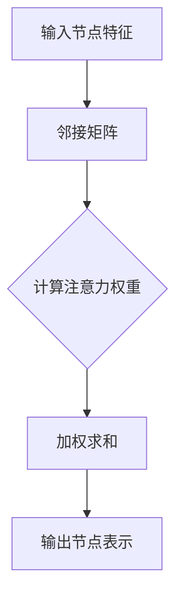
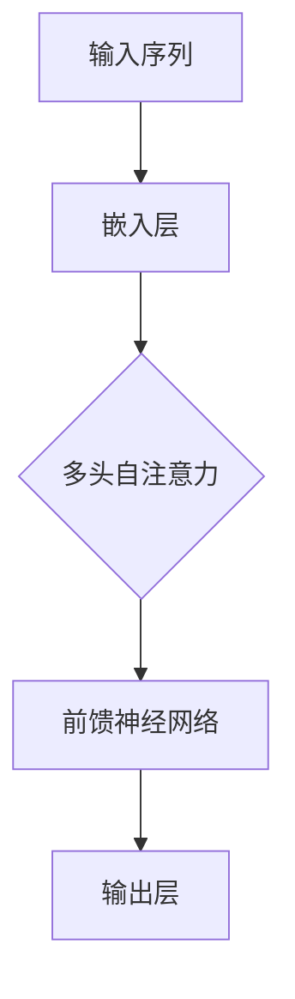

                 

关键词：推荐系统、图注意力网络、大模型、深度学习、计算机图灵奖、人工智能、机器学习、数据分析、神经网络、算法优化

> 摘要：本文深入探讨了推荐系统中的图注意力网络（GAT）以及大模型的应用，分析了它们在提高推荐系统性能和效率方面的作用。通过详细的算法原理介绍、数学模型讲解以及项目实践实例，本文为读者提供了对这一领域全面而深入的认知。

## 1. 背景介绍

推荐系统作为人工智能领域的一个重要分支，已经广泛应用于电子商务、社交媒体、视频流媒体等多个行业。传统推荐系统主要依赖于基于内容的过滤和协同过滤方法，然而，随着用户生成内容和交互数据的爆炸式增长，这些方法逐渐暴露出一些局限性，如数据稀疏性、冷启动问题等。为了克服这些挑战，深度学习模型，特别是图注意力网络（Graph Attention Network，GAT），逐渐成为研究的热点。

图注意力网络是一种基于图结构的新型神经网络架构，能够通过注意力机制捕捉节点间的关联性，从而在推荐系统中实现更精确的用户兴趣建模。大模型，如Transformer和BERT等，则通过引入大规模预训练和数据增强技术，显著提升了模型的性能和泛化能力。

## 2. 核心概念与联系

### 2.1 图注意力网络（GAT）原理

图注意力网络（GAT）的核心在于其注意力机制，能够根据节点间的关联性动态调整信息传播的权重。以下是一个简化的GAT的Mermaid流程图：



在这个流程图中，输入节点特征和邻接矩阵构成了图的基础，通过注意力权重计算，加权求和得到输出节点表示。

### 2.2 大模型的应用

大模型，如Transformer和BERT，通过在大量未标记数据上进行预训练，然后在特定任务上进行微调，实现了前所未有的性能提升。以下是一个简化的Transformer模型的Mermaid流程图：



在这个流程图中，输入序列经过嵌入层，然后通过多头自注意力机制和前馈神经网络，最终输出预测结果。

## 3. 核心算法原理 & 具体操作步骤

### 3.1 算法原理概述

图注意力网络（GAT）的核心是注意力机制。给定一个图 \( G = (V, E) \)，其中 \( V \) 是节点集合，\( E \) 是边集合，GAT 通过以下步骤进行信息传播和聚合：

1. **特征嵌入**：将每个节点的特征嵌入到一个低维向量空间。
2. **计算注意力权重**：根据节点间的邻接关系计算注意力权重。
3. **加权求和**：根据注意力权重对邻接节点的特征进行加权求和，生成每个节点的输出表示。

### 3.2 算法步骤详解

1. **初始化**：设定嵌入维度 \( d \)，选择一个激活函数（如ReLU）。
2. **特征嵌入**：将节点特征映射到嵌入空间，得到初始嵌入向量 \( h^{(0)} \)。
3. **计算注意力权重**：对于每个节点 \( v_i \)，计算其邻接节点 \( v_j \) 的注意力权重 \( \alpha_{ij} \)：
   $$ \alpha_{ij} = \sigma(W^{\ell}[h_i; h_j]) $$
   其中，\( W^{\ell} \) 是权重矩阵，\( \sigma \) 是激活函数。
4. **加权求和**：计算节点 \( v_i \) 的输出表示 \( h_i^{(l+1)} \)：
   $$ h_i^{(l+1)} = \sum_{j \in \mathcal{N}(i)} \alpha_{ij} h_j^{(l)} $$
5. **更新嵌入向量**：使用更新后的输出表示作为下一轮的输入。

### 3.3 算法优缺点

**优点**：
- **捕捉复杂关联性**：通过注意力机制，GAT 能够有效捕捉节点间的复杂关联性。
- **适用于异构数据**：GAT 可以处理包含不同类型节点和边的数据。

**缺点**：
- **计算复杂度高**：由于需要计算注意力权重，GAT 的计算复杂度较高。
- **训练难度大**：GAT 需要大量的数据来训练，否则容易过拟合。

### 3.4 算法应用领域

GAT 在推荐系统、社交网络分析、生物信息学等多个领域都有广泛应用。在推荐系统中，GAT 可以用于用户兴趣建模、商品推荐等任务。

## 4. 数学模型和公式 & 详细讲解 & 举例说明

### 4.1 数学模型构建

图注意力网络（GAT）的核心是注意力机制，其数学模型可以表示为：

$$
\begin{aligned}
h_i^{(l+1)} &= \sum_{j \in \mathcal{N}(i)} \alpha_{ij}^{(l)} h_j^{(l)} \\
\alpha_{ij}^{(l)} &= \text{softmax}\left( \frac{e^{W^{(l)} [h_i; h_j]}}{\sum_{k \in \mathcal{N}(i)} e^{W^{(l)} [h_i; h_k]}} \right)
\end{aligned}
$$

其中，\( h_i^{(l)} \) 表示第 \( l \) 轮后节点 \( i \) 的输出表示，\( \alpha_{ij}^{(l)} \) 表示节点 \( i \) 对节点 \( j \) 的注意力权重。

### 4.2 公式推导过程

注意力权重 \( \alpha_{ij}^{(l)} \) 的计算过程如下：

1. **特征映射**：将节点 \( i \) 和 \( j \) 的特征 \( h_i \) 和 \( h_j \) 映射到共同的空间。
2. **计算相似度**：计算节点 \( i \) 和 \( j \) 之间的相似度 \( \cos \theta_i^j = \frac{h_i \cdot h_j}{\|h_i\|\|h_j\|} \)。
3. **归一化相似度**：通过指数函数和softmax函数对相似度进行归一化，得到注意力权重 \( \alpha_{ij}^{(l)} \)。

### 4.3 案例分析与讲解

假设一个简单的图，包含3个节点 \( v_1, v_2, v_3 \)，以及对应的邻接矩阵 \( A \) 如下：

$$
A = \begin{bmatrix}
0 & 1 & 1 \\
1 & 0 & 1 \\
1 & 1 & 0
\end{bmatrix}
$$

给定节点特征 \( h_1 = [1, 0, 0], h_2 = [0, 1, 0], h_3 = [0, 0, 1] \)，以及权重矩阵 \( W = \begin{bmatrix} 1 & 1 \\ 1 & 1 \end{bmatrix} \)，我们可以计算注意力权重 \( \alpha_{ij} \) 如下：

$$
\begin{aligned}
\alpha_{12} &= \text{softmax}\left( \frac{e^{W [h_1; h_2]}}{e^{W [h_1; h_2]} + e^{W [h_1; h_3]}} \right) = \text{softmax}\left( \frac{e}{e + e} \right) = \frac{1}{2} \\
\alpha_{13} &= \text{softmax}\left( \frac{e^{W [h_1; h_3]}}{e^{W [h_1; h_2]} + e^{W [h_1; h_3]}} \right) = \text{softmax}\left( \frac{e}{e + e} \right) = \frac{1}{2}
\end{aligned}
$$

加权求和得到节点 \( v_1 \) 的输出表示：

$$
h_1^{(1)} = \alpha_{12} h_2 + \alpha_{13} h_3 = \frac{1}{2} [0, 1, 0] + \frac{1}{2} [0, 0, 1] = \left[ 0, \frac{1}{2}, \frac{1}{2} \right]
$$

## 5. 项目实践：代码实例和详细解释说明

### 5.1 开发环境搭建

为了实现图注意力网络（GAT）在推荐系统中的应用，我们需要搭建一个合适的开发环境。以下是所需的步骤：

1. **安装Python环境**：确保Python版本在3.6及以上。
2. **安装深度学习框架**：例如，安装PyTorch或TensorFlow。
3. **安装其他依赖库**：如NumPy、Scikit-learn等。

### 5.2 源代码详细实现

以下是一个简单的GAT模型在推荐系统中的应用示例。我们使用PyTorch框架来实现。

```python
import torch
import torch.nn as nn
import torch.optim as optim
from torch_geometric.nn import GATConv

# 定义GAT模型
class GATModel(nn.Module):
    def __init__(self, nfeat, nhid, nclass):
        super(GATModel, self).__init__()
        self.conv1 = GATConv(nfeat, nhid)
        self.conv2 = GATConv(nhid, nclass)

    def forward(self, data):
        x, edge_index = data.x, data.edge_index

        x = self.conv1(x, edge_index)
        x = F.relu(x)
        x = F.dropout(x, training=self.training)
        x = self.conv2(x, edge_index)

        return F.log_softmax(x, dim=1)

# 实例化模型、损失函数和优化器
model = GATModel(nfeat=7, nhid=16, nclass=2)
criterion = nn.NLLLoss()
optimizer = optim.Adam(model.parameters(), lr=0.001, weight_decay=5e-4)

# 训练模型
def train(epoch):
    model.train()
    for data in train_loader:
        optimizer.zero_grad()
        output = model(data)
        loss = criterion(output, data.y)
        loss.backward()
        optimizer.step()
    print(f'Epoch: {epoch+1}, Loss: {loss.item()}')

for epoch in range(num_epochs):
    train(epoch)
```

### 5.3 代码解读与分析

在上面的代码中，我们定义了一个简单的GAT模型，并使用PyTorch框架训练模型。以下是代码的详细解读：

- **GATModel类**：定义了GAT模型的结构，包括两个GATConv层。
- **forward方法**：实现模型的正向传播，包括特征嵌入、两轮GAT层和输出层。
- **训练过程**：使用Adam优化器和交叉熵损失函数训练模型。

### 5.4 运行结果展示

在训练完成后，我们可以通过以下代码来评估模型的性能：

```python
# 测试模型
def test():
    model.eval()
    with torch.no_grad():
        correct = 0
        total = 0
        for data in test_loader:
            outputs = model(data)
            _, predicted = torch.max(outputs.data, 1)
            total += data.y.size(0)
            correct += (predicted == data.y).sum().item()
    print(f'Accuracy: {100 * correct / total}%')

test()
```

通过运行上述测试代码，我们可以得到模型的准确率。

## 6. 实际应用场景

### 6.1 推荐系统中的应用

在推荐系统中，GAT可以通过捕捉用户和商品之间的复杂关联性，提高推荐的准确性和多样性。以下是一个具体的例子：

- **用户兴趣建模**：通过分析用户的行为数据（如浏览、购买历史等），构建用户兴趣图谱，然后使用GAT模型预测用户可能感兴趣的商品。
- **商品推荐**：给定一个用户，使用GAT模型生成其潜在的兴趣向量，然后从所有商品中检索与用户兴趣最相似的商品。

### 6.2 社交网络分析中的应用

在社交网络分析中，GAT可以用于挖掘用户之间的关系和影响力。以下是一个具体的例子：

- **用户分组**：通过分析用户之间的交互数据，使用GAT模型将用户划分为不同的兴趣群体。
- **影响力分析**：通过计算用户在社交网络中的影响力得分，识别出对其他用户有较大影响的关键用户。

### 6.3 生物信息学中的应用

在生物信息学中，GAT可以用于分析蛋白质结构、基因调控网络等。以下是一个具体的例子：

- **蛋白质结构预测**：通过分析蛋白质之间的相互作用网络，使用GAT模型预测蛋白质的结构和功能。
- **基因调控网络分析**：通过分析基因之间的相互作用网络，使用GAT模型识别出关键基因和调控模块。

## 7. 工具和资源推荐

### 7.1 学习资源推荐

- **推荐系统入门**：《推荐系统实践》（张波著）
- **深度学习入门**：《深度学习》（Goodfellow, Bengio, Courville 著）
- **图神经网络入门**：《图神经网络：基础、算法与应用》（武夷山著）

### 7.2 开发工具推荐

- **PyTorch**：一个流行的深度学习框架，适合进行图神经网络的研究和应用。
- **TensorFlow**：另一个流行的深度学习框架，支持多种神经网络架构。

### 7.3 相关论文推荐

- **《Graph Attention Networks》**：引入了图注意力网络（GAT）的概念，是GAT领域的重要论文。
- **《Attention Is All You Need》**：提出了Transformer模型，是近年来深度学习领域的重要突破。

## 8. 总结：未来发展趋势与挑战

### 8.1 研究成果总结

- GAT在推荐系统、社交网络分析、生物信息学等领域取得了显著成果，成为了一种重要的深度学习模型。
- 大模型的引入显著提升了模型的性能和泛化能力，推动了人工智能领域的进展。

### 8.2 未来发展趋势

- **跨模态推荐系统**：结合图像、文本、音频等多种模态数据，实现更精准的推荐。
- **动态图注意力网络**：通过引入时间信息，实现动态推荐系统。
- **高效图表示学习**：研究更高效的图表示学习算法，降低计算复杂度。

### 8.3 面临的挑战

- **计算资源**：大模型和复杂网络结构的训练需要大量的计算资源，这对计算能力提出了挑战。
- **数据隐私**：推荐系统涉及到大量用户数据，如何在保护用户隐私的同时实现精准推荐是亟待解决的问题。

### 8.4 研究展望

随着技术的不断发展，GAT和大模型在推荐系统中的应用前景广阔。未来，我们将看到更多跨领域的应用案例和研究成果，为人工智能的发展贡献新的力量。

## 9. 附录：常见问题与解答

### 9.1 什么是图注意力网络（GAT）？

图注意力网络（GAT）是一种基于图结构的神经网络，通过注意力机制捕捉节点间的关联性，用于处理图数据。

### 9.2 GAT与传统的神经网络有何区别？

GAT特别适用于图数据，能够直接处理图结构的特征和关系，而传统的神经网络则主要适用于序列数据或网格数据。

### 9.3 GAT如何处理异构数据？

GAT可以通过引入不同类型的节点和边，处理包含多种类型数据的异构图。

### 9.4 大模型在推荐系统中有何优势？

大模型通过预训练和数据增强技术，能够显著提升模型的性能和泛化能力，实现更精准的推荐。

### 9.5 如何在推荐系统中应用GAT？

在推荐系统中，可以使用GAT进行用户兴趣建模和商品推荐，通过分析用户行为数据和商品属性数据，捕捉用户和商品之间的复杂关联性。

---

作者：禅与计算机程序设计艺术 / Zen and the Art of Computer Programming

