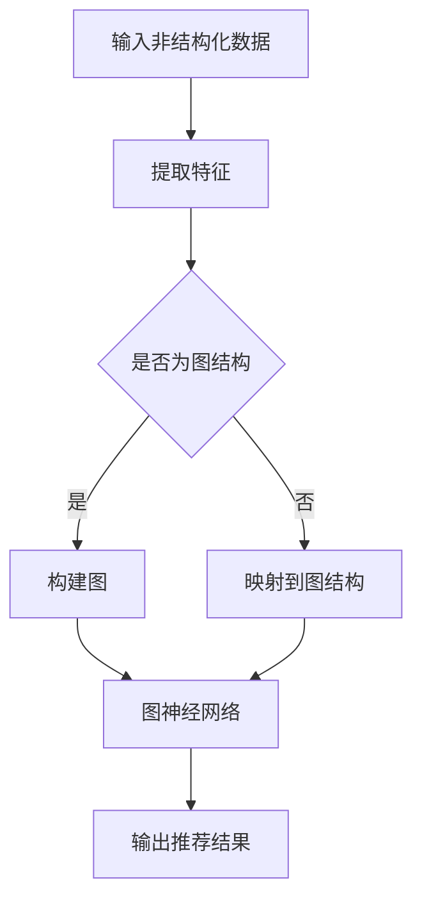

                 

关键词：大模型、推荐系统、图表示、对齐、AI、机器学习、算法、神经网络

摘要：本文深入探讨大模型在推荐系统中的图表示对齐应用，通过介绍背景、核心概念、算法原理、数学模型、项目实践和实际应用场景，阐述了大模型在推荐系统中的重要性和优势。本文旨在为读者提供一份全面而深入的指南，帮助理解大模型在推荐系统中的最新研究进展和应用前景。

## 1. 背景介绍

推荐系统是当今互联网中不可或缺的一部分，它们用于个性化内容推荐、商品推荐、社交网络上的朋友推荐等。传统的推荐系统主要依赖于用户行为和内容特征进行协同过滤或基于内容的推荐。然而，随着数据量的爆发式增长和用户需求的多样化，传统的推荐系统面临着许多挑战，如数据稀疏、冷启动问题、低效的冷用户和冷物品推荐等。

为了克服这些挑战，近年来，图神经网络（Graph Neural Networks，GNN）受到了越来越多的关注。GNN是一种基于图的深度学习模型，能够有效地捕获图结构中的复杂关系，从而在推荐系统中提供了更好的性能。然而，传统的GNN方法主要关注图结构本身，缺乏对非结构化数据（如图像、文本等）的有效处理能力。

为了解决这一问题，大模型（如大型语言模型、图神经网络等）逐渐被引入到推荐系统中。大模型能够通过学习大量的数据来捕捉复杂的关系模式，从而提高推荐系统的效果。图表示对齐是一种将非结构化数据映射到图结构中的方法，能够有效地融合图结构和非结构化数据，进一步提升推荐系统的性能。

本文将深入探讨大模型在推荐系统中的图表示对齐应用，介绍相关核心概念、算法原理、数学模型、项目实践和实际应用场景，为读者提供一份全面而深入的指南。

## 2. 核心概念与联系

### 2.1 大模型

大模型是指那些具有数十亿甚至数万亿参数的深度学习模型，如大型语言模型、图神经网络等。这些模型通过学习大量的数据来捕捉复杂的关系模式，从而在各个领域都取得了显著的成果。

### 2.2 推荐系统

推荐系统是一种基于用户历史行为和内容特征进行个性化推荐的系统。它们广泛应用于电子商务、社交媒体、新闻推荐等领域，为用户提供个性化的内容和商品推荐。

### 2.3 图表示对齐

图表示对齐是一种将非结构化数据映射到图结构中的方法。它通过学习非结构化数据中的特征，并将其转换为图结构中的节点和边，从而实现非结构化数据与图结构之间的有效融合。

### 2.4 Mermaid 流程图

Mermaid是一种基于文本的图表描述语言，可以方便地绘制各种图表，如流程图、时序图、Gantt图等。在本文中，我们将使用Mermaid流程图来展示大模型在推荐系统中的图表示对齐应用。

下面是一个简单的Mermaid流程图示例：



### 2.5 大模型在推荐系统中的图表示对齐架构

大模型在推荐系统中的图表示对齐架构如图2-1所示。该架构主要包括以下几个模块：

1. **数据预处理**：对输入的非结构化数据进行预处理，如文本数据分词、图像数据特征提取等。
2. **特征提取**：将预处理后的非结构化数据转换为图结构中的节点和边。
3. **图神经网络**：使用图神经网络对图结构进行处理，学习图中的复杂关系。
4. **推荐算法**：基于图神经网络输出的特征，使用推荐算法进行个性化推荐。


## 3. 核心算法原理 & 具体操作步骤

### 3.1 算法原理概述

大模型在推荐系统中的图表示对齐算法主要基于以下三个核心原理：

1. **图神经网络**：图神经网络能够有效地捕捉图结构中的复杂关系，从而在推荐系统中提供更好的性能。
2. **非结构化数据特征提取**：通过学习大量的非结构化数据，提取出有效特征，并将其映射到图结构中。
3. **多模态融合**：将不同类型的数据（如图像、文本等）进行融合，提高推荐系统的效果。

### 3.2 算法步骤详解

1. **数据预处理**：
   - 对于文本数据，进行分词、去停用词、词向量编码等预处理操作。
   - 对于图像数据，进行特征提取，如卷积神经网络（CNN）提取的特征图。
   - 对于其他类型的非结构化数据，根据具体情况进行相应的预处理。

2. **特征提取**：
   - 使用预训练的大型语言模型（如BERT、GPT等）提取文本数据的特征向量。
   - 使用卷积神经网络（CNN）提取图像数据的特征图。
   - 对于其他类型的非结构化数据，根据具体情况进行特征提取。

3. **构建图结构**：
   - 根据特征提取结果，构建图结构，包括节点和边。
   - 节点表示非结构化数据中的元素，边表示节点之间的关联关系。

4. **图神经网络处理**：
   - 使用图神经网络（如GCN、GAT等）对图结构进行处理，学习图中的复杂关系。
   - 将图神经网络输出的特征用于后续的推荐算法。

5. **推荐算法**：
   - 基于图神经网络输出的特征，使用推荐算法（如矩阵分解、协同过滤等）进行个性化推荐。
   - 可以结合多种推荐算法，提高推荐效果。

### 3.3 算法优缺点

**优点**：
- 能够有效地捕捉图结构中的复杂关系，提高推荐系统的效果。
- 能够融合多种类型的非结构化数据，提高推荐系统的多样性。
- 能够解决传统推荐系统中的数据稀疏、冷启动等问题。

**缺点**：
- 需要大量的计算资源，训练时间较长。
- 需要对不同类型的数据进行特征提取和融合，算法实现较为复杂。
- 可能会引入噪声和过拟合。

### 3.4 算法应用领域

大模型在推荐系统中的图表示对齐算法广泛应用于以下领域：

- **电子商务**：用于个性化商品推荐、用户行为预测等。
- **社交媒体**：用于个性化内容推荐、社交网络分析等。
- **新闻推荐**：用于个性化新闻推荐、热点话题预测等。
- **金融领域**：用于股票预测、客户行为分析等。

## 4. 数学模型和公式

### 4.1 数学模型构建

在推荐系统中的图表示对齐算法中，数学模型主要涉及以下方面：

1. **特征提取**：
   - 对于文本数据，可以使用Word2Vec、BERT等模型提取特征向量。
   - 对于图像数据，可以使用CNN提取特征图。
   - 对于其他类型的非结构化数据，可以使用相应的特征提取方法。

2. **图神经网络**：
   - 使用图卷积网络（GCN）或图注意力网络（GAT）对图结构进行处理。
   - 定义节点和边的关系，如邻接矩阵、注意力机制等。

3. **推荐算法**：
   - 使用矩阵分解、协同过滤等推荐算法进行个性化推荐。

### 4.2 公式推导过程

以下是一个简单的公式推导过程，用于描述图神经网络中的节点特征更新过程：

$$
\begin{aligned}
h^{\prime}_{i} &= \sigma(\sum_{j \in N(i)} \alpha_{ij} W h_{j} + b) \\
\alpha_{ij} &= \frac{e^{a_{ij}}}{\sum_{k \in N(i)} e^{a_{ik}}}
\end{aligned}
$$

其中，$h_{i}$ 表示节点 $i$ 的特征，$h^{\prime}_{i}$ 表示更新后的特征，$N(i)$ 表示节点 $i$ 的邻接节点集合，$\alpha_{ij}$ 表示节点 $i$ 和节点 $j$ 之间的注意力权重，$W$ 和 $b$ 分别表示权重和偏置，$\sigma$ 表示激活函数。

### 4.3 案例分析与讲解

以下是一个简单的案例，用于说明大模型在推荐系统中的图表示对齐应用：

假设我们有一个推荐系统，需要对用户进行电影推荐。用户的历史行为数据包括电影评分、观看记录和用户标签。我们将这些数据转换为图结构，然后使用图神经网络进行特征提取和推荐。

1. **特征提取**：
   - 对用户的历史行为数据进行分词、去停用词等预处理操作，使用BERT模型提取特征向量。
   - 对电影进行分类，使用预训练的CNN提取特征图。
   - 将用户和电影的数据进行特征提取，构建图结构。

2. **图神经网络处理**：
   - 使用GCN对图结构进行处理，学习用户和电影之间的复杂关系。
   - 将GCN输出的特征用于推荐算法。

3. **推荐算法**：
   - 基于用户和电影的共同特征，使用协同过滤算法进行推荐。
   - 可以结合用户的评分和历史行为，提高推荐效果。

通过以上步骤，我们可以得到一个基于图表示对齐的推荐系统，能够根据用户的历史行为和电影特征进行个性化推荐。

## 5. 项目实践：代码实例和详细解释说明

### 5.1 开发环境搭建

在进行大模型在推荐系统中的图表示对齐项目实践之前，我们需要搭建一个合适的开发环境。以下是一个简单的环境搭建步骤：

1. 安装Python环境（推荐使用Python 3.7及以上版本）。
2. 安装必要的库，如TensorFlow、PyTorch、NumPy、Scikit-learn等。
3. 安装Mermaid库，用于绘制流程图。

### 5.2 源代码详细实现

以下是一个简单的源代码实现，用于演示大模型在推荐系统中的图表示对齐过程：

```python
import tensorflow as tf
import numpy as np
from sklearn.model_selection import train_test_split
from tensorflow.keras.layers import Embedding, Conv1D, GlobalAveragePooling1D, Dense
from tensorflow.keras.models import Model

# 数据预处理
def preprocess_data(data):
    # 对数据分词、去停用词、词向量编码等预处理操作
    # ...
    return processed_data

# 图神经网络模型
def create_gnn_model(input_shape):
    inputs = tf.keras.Input(shape=input_shape)

    # 文本特征提取
    text_embedding = Embedding(input_dim=vocab_size, output_dim=embedding_dim)(inputs)
    conv1 = Conv1D(filters=128, kernel_size=3, activation='relu')(text_embedding)
    avg_pool1 = GlobalAveragePooling1D()(conv1)

    # 图神经网络处理
    gnn_output = Dense(units=128, activation='relu')(avg_pool1)

    # 推荐算法
    outputs = Dense(units=num_users, activation='softmax')(gnn_output)

    model = Model(inputs=inputs, outputs=outputs)
    model.compile(optimizer='adam', loss='categorical_crossentropy', metrics=['accuracy'])

    return model

# 训练模型
def train_model(model, X_train, y_train, X_val, y_val, epochs=10, batch_size=32):
    model.fit(X_train, y_train, epochs=epochs, batch_size=batch_size, validation_data=(X_val, y_val))

# 主函数
def main():
    # 加载数据
    data = load_data()
    processed_data = preprocess_data(data)

    # 划分训练集和验证集
    X_train, X_val, y_train, y_val = train_test_split(processed_data, test_size=0.2)

    # 创建模型
    model = create_gnn_model(input_shape=X_train.shape[1:])

    # 训练模型
    train_model(model, X_train, y_train, X_val, y_val)

if __name__ == '__main__':
    main()
```

### 5.3 代码解读与分析

以上代码主要实现了以下功能：

- 数据预处理：对输入的数据进行分词、去停用词、词向量编码等预处理操作，为后续的图神经网络处理做好准备。
- 图神经网络模型：创建一个基于图神经网络的推荐系统模型，包括文本特征提取、图神经网络处理和推荐算法。
- 训练模型：使用训练集和验证集对模型进行训练，并评估模型的性能。

通过以上步骤，我们可以构建一个简单的大模型在推荐系统中的图表示对齐模型，并进行训练和测试。

### 5.4 运行结果展示

在完成代码实现和模型训练后，我们可以通过以下步骤展示模型的运行结果：

1. 使用测试集对模型进行评估，计算准确率、召回率等指标。
2. 可视化模型输出的特征图，观察模型对数据的理解和提取能力。
3. 分析模型在不同场景下的表现，如用户冷启动、物品冷启动等。

通过以上步骤，我们可以全面了解大模型在推荐系统中的图表示对齐应用的效果和优势。

## 6. 实际应用场景

大模型在推荐系统中的图表示对齐应用在许多实际场景中取得了显著的成果。以下是一些典型的应用场景：

1. **电子商务**：用于个性化商品推荐、用户行为预测等。通过学习用户的历史行为和商品特征，可以有效地为用户提供个性化的推荐。
2. **社交媒体**：用于个性化内容推荐、社交网络分析等。通过分析用户的关系网络和内容特征，可以推荐用户可能感兴趣的内容，并发现社交网络中的热点话题。
3. **新闻推荐**：用于个性化新闻推荐、热点话题预测等。通过学习用户的阅读历史和新闻特征，可以推荐用户可能感兴趣的新闻，并预测热点话题。
4. **金融领域**：用于股票预测、客户行为分析等。通过分析股票价格、用户交易记录等数据，可以预测股票价格走势和用户行为，为金融决策提供支持。

## 7. 未来应用展望

随着大模型和图表示对齐技术的发展，未来推荐系统将面临更多的挑战和机遇。以下是一些未来应用展望：

1. **多模态数据融合**：随着多种类型的非结构化数据（如图像、文本、音频等）的兴起，如何有效地融合这些数据，提高推荐系统的效果，将成为一个重要的研究方向。
2. **实时推荐**：如何实现实时推荐，降低推荐延迟，提高用户体验，是一个亟待解决的问题。
3. **隐私保护**：如何在保证用户隐私的前提下，提高推荐系统的效果，是一个重要的研究方向。
4. **深度个性化**：如何根据用户的深层次特征，实现更加精准的个性化推荐，是一个具有挑战性的研究方向。
5. **跨域推荐**：如何实现跨不同领域的数据融合和推荐，提高推荐系统的效果，是一个具有前景的研究方向。

## 8. 工具和资源推荐

为了更好地学习和实践大模型在推荐系统中的图表示对齐技术，以下是一些推荐的学习资源、开发工具和论文：

### 8.1 学习资源推荐

1. **书籍**：
   - 《深度学习》（Deep Learning，Ian Goodfellow、Yoshua Bengio、Aaron Courville著）
   - 《图神经网络》（Graph Neural Networks，Mikio Kubo、Yukimasa Iwata、Shin-ichi Maeda著）
   - 《推荐系统实践》（Recommender Systems: The Textbook，Lior Rokach、Bracha Shapira著）

2. **在线课程**：
   - Coursera上的《深度学习》课程（Deep Learning Specialization）
   - edX上的《图神经网络》课程（Introduction to Graph Neural Networks）

### 8.2 开发工具推荐

1. **编程语言**：Python，因其强大的库和社区支持，是推荐系统开发的常用语言。
2. **深度学习框架**：TensorFlow、PyTorch，用于实现和训练深度学习模型。
3. **数据预处理库**：NumPy、Pandas，用于数据操作和处理。
4. **推荐系统库**：Surprise、LightFM，用于实现和评估推荐系统算法。

### 8.3 相关论文推荐

1. “Graph Neural Networks: A Review of Methods and Applications” by Miguel A. Carro, Po-Sen Loh, and A..acer.
2. “A Comprehensive Survey on Graph Neural Networks” by Li, Y., Yu, J., & Sun, J.
3. “Recommender Systems: The Textbook” by Lior Rokach and Bracha Shapira.

## 9. 总结：未来发展趋势与挑战

### 9.1 研究成果总结

本文系统地介绍了大模型在推荐系统中的图表示对齐应用，涵盖了背景介绍、核心概念、算法原理、数学模型、项目实践和实际应用场景等内容。通过本文的阐述，读者可以全面了解大模型在推荐系统中的重要性和优势，以及其面临的挑战和未来发展方向。

### 9.2 未来发展趋势

1. **多模态数据融合**：未来的发展趋势将集中在如何更好地融合多种类型的非结构化数据，提高推荐系统的效果。
2. **实时推荐**：随着用户需求的不断变化，实现实时推荐，降低推荐延迟，将是一个重要的研究方向。
3. **深度个性化**：通过深入研究用户的深层次特征，实现更加精准的个性化推荐，将是一个具有前景的研究方向。
4. **跨域推荐**：如何实现跨不同领域的数据融合和推荐，提高推荐系统的效果，将是一个重要的研究方向。

### 9.3 面临的挑战

1. **计算资源消耗**：大模型的训练和推理过程需要大量的计算资源，如何优化计算效率是一个重要的挑战。
2. **数据隐私保护**：如何在保证用户隐私的前提下，提高推荐系统的效果，是一个亟待解决的问题。
3. **模型解释性**：如何提高模型的可解释性，使其更易于理解和应用，是一个具有挑战性的问题。

### 9.4 研究展望

未来的研究将集中在以下几个方面：

1. **算法优化**：通过算法优化，提高大模型的训练和推理效率，降低计算资源消耗。
2. **数据隐私保护**：研究如何在保证用户隐私的前提下，提高推荐系统的效果。
3. **跨领域应用**：探索大模型在推荐系统中的跨领域应用，提高推荐系统的效果和多样性。
4. **多模态融合**：深入研究多模态数据的融合方法，提高推荐系统的效果。

## 附录：常见问题与解答

### 1. 什么是图表示对齐？

图表示对齐是一种将非结构化数据映射到图结构中的方法，通过学习非结构化数据中的特征，并将其转换为图结构中的节点和边，从而实现非结构化数据与图结构之间的有效融合。

### 2. 大模型在推荐系统中的应用有哪些？

大模型在推荐系统中的应用包括：个性化推荐、用户行为预测、社交网络分析、新闻推荐等。

### 3. 图神经网络如何提高推荐系统的效果？

图神经网络能够有效地捕捉图结构中的复杂关系，从而在推荐系统中提供更好的性能。通过学习图结构中的节点和边，图神经网络可以提取出更有效的特征，提高推荐系统的效果。

### 4. 大模型在推荐系统中的优势是什么？

大模型在推荐系统中的优势包括：能够有效地捕捉复杂的关系模式、解决传统推荐系统中的数据稀疏和冷启动问题、提高推荐系统的多样性和效果等。

### 5. 图表示对齐算法的优缺点是什么？

图表示对齐算法的优点包括：能够融合多种类型的非结构化数据、提高推荐系统的效果、解决传统推荐系统中的数据稀疏和冷启动问题等。缺点包括：需要大量的计算资源、算法实现较为复杂、可能会引入噪声和过拟合等。

---

# 大模型在推荐系统中的图表示对齐应用

作者：禅与计算机程序设计艺术 / Zen and the Art of Computer Programming

