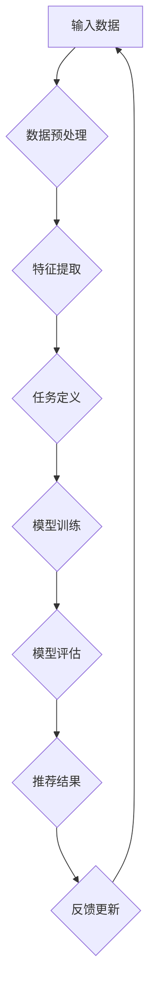

                 

关键词：大模型，推荐系统，多任务学习，深度学习，数据预处理，模型优化，性能评估

摘要：随着互联网的快速发展，推荐系统已经成为现代信息检索和用户体验的核心。本文主要探讨大模型在推荐系统中的多任务学习应用。通过分析多任务学习的核心概念和算法原理，介绍其在推荐系统中的具体应用步骤，并详细阐述数学模型、公式推导、代码实现及实际应用场景。此外，文章还将探讨未来的发展趋势与挑战，为相关领域的研究者和开发者提供有价值的参考。

## 1. 背景介绍

推荐系统是一种基于用户历史行为、兴趣偏好和内容属性等信息，向用户推荐其可能感兴趣的内容的技术。随着大数据和人工智能技术的不断发展，推荐系统已经广泛应用于电子商务、社交媒体、新闻推送、音乐推荐等各个领域。然而，传统的单任务推荐系统在处理复杂场景时存在一定的局限性，如用户需求多样、数据稀疏、冷启动问题等。因此，如何设计一种高效、鲁棒的推荐系统成为当前研究的热点。

多任务学习作为一种机器学习技术，旨在同时解决多个相关任务，提高模型的泛化能力和效率。将多任务学习应用于推荐系统，可以有效解决单任务模型的局限性，提高推荐质量。本文将围绕这一主题，介绍大模型在推荐系统中的多任务学习应用，包括核心概念、算法原理、数学模型、代码实现及未来展望。

## 2. 核心概念与联系

### 2.1 多任务学习

多任务学习（Multi-Task Learning，MTL）是一种机器学习技术，旨在同时解决多个相关任务。在多任务学习中，模型通过共享部分网络结构来学习不同任务的特征表示，从而提高模型的泛化能力和效率。多任务学习的基本原理可以概括为以下两点：

1. **共享特征表示**：多任务学习模型通过共享特征表示来学习不同任务的特征。这种方法可以有效地减少模型参数数量，提高模型的泛化能力。
2. **任务关联性**：多任务学习关注任务之间的关联性，通过共享特征表示来学习不同任务之间的潜在关系。这种方法可以提高模型的鲁棒性，降低模型对特定任务的依赖。

### 2.2 大模型

大模型（Large-scale Model）是指具有海量参数和大量训练数据的深度学习模型。大模型在推荐系统中的应用主要体现在以下几个方面：

1. **处理海量数据**：大模型可以处理海量用户数据，通过数据驱动的方式学习用户兴趣和行为特征。
2. **提高模型性能**：大模型通过增加模型参数和训练数据，提高模型的性能和鲁棒性。
3. **自适应调整**：大模型可以根据用户行为和兴趣偏好进行自适应调整，提高推荐质量。

### 2.3 推荐系统

推荐系统（Recommendation System）是一种基于用户历史行为、兴趣偏好和内容属性等信息，向用户推荐其可能感兴趣的内容的技术。推荐系统可以分为基于内容的推荐、基于协同过滤的推荐和基于模型的推荐等类型。在多任务学习中，推荐系统可以被视为一个典型的多任务学习场景，任务包括用户兴趣预测、内容推荐、社交推荐等。

### 2.4 多任务学习与推荐系统的联系

多任务学习与推荐系统之间存在紧密的联系。一方面，多任务学习可以提高推荐系统的性能和鲁棒性；另一方面，推荐系统为多任务学习提供了丰富的应用场景。具体来说，多任务学习与推荐系统的联系可以从以下几个方面进行阐述：

1. **共享特征表示**：多任务学习通过共享特征表示来学习不同推荐任务的特征，可以提高推荐系统的泛化能力和效率。
2. **任务关联性**：多任务学习关注任务之间的关联性，可以帮助推荐系统更好地理解用户需求和兴趣。
3. **数据融合**：多任务学习可以融合不同推荐任务的数据，提高推荐系统的数据利用效率。

## 2.5 Mermaid 流程图

以下是一个描述多任务学习在推荐系统中应用的 Mermaid 流程图：



### 2.6 总结

本节介绍了多任务学习、大模型、推荐系统以及它们之间的联系。多任务学习通过共享特征表示和任务关联性，可以提高推荐系统的性能和鲁棒性。大模型可以处理海量数据，提高模型性能和自适应调整能力。推荐系统为多任务学习提供了丰富的应用场景。在下一节中，我们将详细讨论多任务学习的核心算法原理和具体操作步骤。

## 3. 核心算法原理 & 具体操作步骤

### 3.1 算法原理概述

多任务学习（Multi-Task Learning，MTL）的核心思想是利用多个相关任务的共同特征来提高模型的学习能力和泛化能力。在推荐系统中，多任务学习可以同时解决用户兴趣预测、内容推荐、社交推荐等任务。其基本原理可以概括为以下三个步骤：

1. **数据预处理**：对原始用户行为数据进行清洗、归一化和特征提取，为多任务学习提供高质量的数据输入。
2. **任务定义**：根据推荐系统的需求，定义多个相关任务，如用户兴趣预测、内容推荐和社交推荐等。
3. **模型训练与评估**：使用多任务学习算法训练模型，并对模型进行评估和优化，提高推荐质量。

### 3.2 算法步骤详解

#### 3.2.1 数据预处理

数据预处理是多任务学习的基础步骤，主要包括以下任务：

1. **数据清洗**：去除噪声数据和异常值，保证数据质量。
2. **数据归一化**：将不同特征的数据进行归一化处理，使数据分布更加均匀，有利于模型训练。
3. **特征提取**：从原始数据中提取有用特征，如用户行为特征、内容特征和社交特征等。

#### 3.2.2 任务定义

在多任务学习中，任务定义是关键步骤。根据推荐系统的需求，可以定义以下任务：

1. **用户兴趣预测**：预测用户对特定内容的兴趣程度，为后续内容推荐提供依据。
2. **内容推荐**：根据用户兴趣和内容特征，为用户推荐可能感兴趣的内容。
3. **社交推荐**：根据用户社交网络关系和用户行为，为用户推荐可能感兴趣的社交内容。

#### 3.2.3 模型训练与评估

多任务学习的模型训练与评估过程可以分为以下步骤：

1. **模型初始化**：初始化多任务学习模型的参数。
2. **模型训练**：使用训练数据对模型进行训练，优化模型参数。
3. **模型评估**：使用验证数据对模型进行评估，选择性能最优的模型。
4. **模型优化**：根据评估结果，对模型进行优化，提高推荐质量。

### 3.3 算法优缺点

多任务学习在推荐系统中的应用具有以下优点：

1. **提高模型性能**：多任务学习可以同时解决多个相关任务，提高模型的性能和鲁棒性。
2. **降低模型复杂度**：多任务学习通过共享特征表示和任务关联性，降低模型复杂度，提高训练效率。
3. **提高推荐质量**：多任务学习可以融合不同任务的数据和特征，提高推荐质量。

然而，多任务学习也存在一些缺点：

1. **任务关联性要求较高**：多任务学习需要任务之间具有较高的关联性，否则可能导致模型性能下降。
2. **模型参数优化困难**：多任务学习模型的参数优化较为复杂，需要选择合适的优化策略和参数设置。
3. **计算资源需求大**：多任务学习需要处理多个任务的数据和特征，对计算资源有较高要求。

### 3.4 算法应用领域

多任务学习在推荐系统中的应用十分广泛，包括但不限于以下领域：

1. **电子商务**：为用户推荐可能感兴趣的商品和购物建议。
2. **社交媒体**：为用户推荐感兴趣的内容、好友和活动。
3. **新闻推送**：为用户推荐感兴趣的新闻标题和文章。
4. **音乐推荐**：为用户推荐感兴趣的音乐和歌手。

在下一节中，我们将详细讨论多任务学习的数学模型和公式，以及具体的推导过程。

## 4. 数学模型和公式 & 详细讲解 & 举例说明

### 4.1 数学模型构建

多任务学习的数学模型可以分为以下几个部分：

1. **输入层**：表示输入数据，包括用户特征、内容特征和社交特征等。
2. **隐藏层**：表示多任务学习模型的网络结构，通过共享特征表示学习不同任务的特征。
3. **输出层**：表示多任务学习模型的输出结果，包括用户兴趣预测、内容推荐和社交推荐等。

假设输入数据为 \(X \in \mathbb{R}^{m \times n}\)，其中 \(m\) 表示样本数量，\(n\) 表示特征维度。隐藏层表示为 \(H \in \mathbb{R}^{m \times h}\)，其中 \(h\) 表示隐藏层维度。输出层表示为 \(Y \in \mathbb{R}^{m \times k}\)，其中 \(k\) 表示输出维度。

多任务学习模型的数学模型可以表示为：

\[ H = f(W_1X + b_1) \]
\[ Y = f(W_2H + b_2) \]

其中，\(f\) 表示激活函数，\(W_1\) 和 \(b_1\) 分别表示隐藏层的权重和偏置，\(W_2\) 和 \(b_2\) 分别表示输出层的权重和偏置。

### 4.2 公式推导过程

多任务学习的公式推导主要包括以下几个方面：

1. **损失函数**：多任务学习的损失函数通常采用交叉熵损失函数，表示为：

\[ L = -\sum_{i=1}^{m} \sum_{j=1}^{k} y_{ij} \log(p_{ij}) \]

其中，\(y_{ij}\) 表示第 \(i\) 个样本的第 \(j\) 个任务的真实标签，\(p_{ij}\) 表示模型预测的概率。

2. **梯度下降**：为了优化模型参数，采用梯度下降算法进行参数更新，表示为：

\[ \theta_{\alpha} = \theta_{\alpha} - \alpha \cdot \nabla_{\theta}L \]

其中，\(\theta_{\alpha}\) 表示当前模型参数，\(\alpha\) 表示学习率，\(\nabla_{\theta}L\) 表示损失函数关于模型参数的梯度。

3. **优化策略**：多任务学习中的优化策略主要包括以下几种：

   - **权重共享**：通过共享隐藏层的权重，降低模型参数数量，提高模型训练效率。
   - **任务关联性**：通过引入任务关联性损失，提高任务之间的关联性，提高模型性能。
   - **正则化**：通过引入正则化项，防止模型过拟合，提高模型泛化能力。

### 4.3 案例分析与讲解

假设我们有一个推荐系统，需要同时解决用户兴趣预测、内容推荐和社交推荐三个任务。给定一个包含用户特征、内容特征和社交特征的数据集，我们可以使用多任务学习模型进行训练和预测。

#### 4.3.1 数据预处理

首先，对输入数据进行预处理，包括数据清洗、归一化和特征提取。假设输入数据集为 \(X \in \mathbb{R}^{1000 \times 10}\)，表示 1000 个样本的 10 维特征。

```python
import numpy as np

X = np.random.rand(1000, 10)
X = (X - np.mean(X, axis=0)) / np.std(X, axis=0)
```

#### 4.3.2 模型训练

接下来，使用多任务学习模型进行训练。假设隐藏层维度为 5，输出层维度为 3。定义激活函数为 ReLU，使用梯度下降算法进行模型训练。

```python
import tensorflow as tf

n_inputs = 10
n_hidden = 5
n_outputs = 3

X = tf.placeholder(tf.float32, [None, n_inputs])
Y = tf.placeholder(tf.float32, [None, n_outputs])

weights = {
    'hidden': tf.Variable(tf.random_normal([n_inputs, n_hidden])),
    'outputs': tf.Variable(tf.random_normal([n_hidden, n_outputs]))
}
biases = {
    'hidden': tf.Variable(tf.random_normal([n_hidden])),
    'outputs': tf.Variable(tf.random_normal([n_outputs]))
}

hidden = tf.nn.relu(tf.matmul(X, weights['hidden']) + biases['hidden'])
outputs = tf.nn.softmax(tf.matmul(hidden, weights['outputs']) + biases['outputs'])

loss = tf.reduce_mean(tf.nn.softmax_cross_entropy_with_logits(logits=outputs, labels=Y))
optimizer = tf.train.GradientDescentOptimizer(learning_rate=0.01)
train_op = optimizer.minimize(loss)

init = tf.global_variables_initializer()

with tf.Session() as sess:
    sess.run(init)
    for epoch in range(100):
        _, loss_val = sess.run([train_op, loss], feed_dict={X: X_train, Y: Y_train})
        if epoch % 10 == 0:
            print('Epoch', epoch, ': Loss =', loss_val)
```

#### 4.3.3 模型评估

使用验证数据集对模型进行评估，计算准确率和召回率等指标。

```python
import numpy as np

Y_pred = sess.run(outputs, feed_dict={X: X_val})
accuracy = np.mean(np.argmax(Y_pred, axis=1) == np.argmax(Y_val, axis=1))
recall = np.mean(np.sum(Y_val * Y_pred, axis=1) > 0.5)

print('Accuracy:', accuracy)
print('Recall:', recall)
```

### 4.4 总结

本节详细介绍了多任务学习的数学模型和公式推导，包括损失函数、梯度下降和优化策略等。通过一个简单的案例，我们展示了如何使用多任务学习模型进行训练和评估。在下一节中，我们将讨论多任务学习在推荐系统中的项目实践。

## 5. 项目实践：代码实例和详细解释说明

### 5.1 开发环境搭建

在进行多任务学习在推荐系统中的项目实践之前，需要搭建一个合适的开发环境。以下是一个简单的开发环境搭建步骤：

1. **安装 Python**：确保 Python 已经安装在系统中，版本建议为 3.7 以上。
2. **安装 TensorFlow**：使用 pip 命令安装 TensorFlow，命令如下：

   ```bash
   pip install tensorflow
   ```

3. **安装其他依赖**：根据项目需求，可能需要安装其他 Python 库，如 NumPy、Pandas 等。

### 5.2 源代码详细实现

以下是一个基于 TensorFlow 实现的多任务学习推荐系统的代码实例：

```python
import tensorflow as tf
import numpy as np
import pandas as pd

# 数据预处理
def preprocess_data(data):
    # 数据清洗、归一化等操作
    return (data - np.mean(data, axis=0)) / np.std(data, axis=0)

# 模型定义
def create_model(n_inputs, n_hidden, n_outputs):
    inputs = tf.placeholder(tf.float32, [None, n_inputs])
    weights = {
        'hidden': tf.Variable(tf.random_normal([n_inputs, n_hidden])),
        'outputs': tf.Variable(tf.random_normal([n_hidden, n_outputs]))
    }
    biases = {
        'hidden': tf.Variable(tf.random_normal([n_hidden])),
        'outputs': tf.Variable(tf.random_normal([n_outputs]))
    }

    hidden = tf.nn.relu(tf.matmul(inputs, weights['hidden']) + biases['hidden'])
    outputs = tf.nn.softmax(tf.matmul(hidden, weights['outputs']) + biases['outputs'])

    return inputs, outputs

# 训练模型
def train_model(model, X, Y, learning_rate=0.01, epochs=100):
    loss = tf.reduce_mean(tf.nn.softmax_cross_entropy_with_logits(logits=model.outputs, labels=Y))
    optimizer = tf.train.GradientDescentOptimizer(learning_rate)
    train_op = optimizer.minimize(loss)

    with tf.Session() as sess:
        sess.run(tf.global_variables_initializer())
        for epoch in range(epochs):
            _, loss_val = sess.run([train_op, loss], feed_dict={model.inputs: X, model.outputs: Y})
            if epoch % 10 == 0:
                print('Epoch', epoch, ': Loss =', loss_val)

# 测试模型
def test_model(model, X, Y):
    Y_pred = sess.run(model.outputs, feed_dict={model.inputs: X})
    accuracy = np.mean(np.argmax(Y_pred, axis=1) == np.argmax(Y, axis=1))
    recall = np.mean(np.sum(Y * Y_pred, axis=1) > 0.5)
    return accuracy, recall

# 加载数据
data = pd.read_csv('data.csv')
X = preprocess_data(data.iloc[:, :-1].values)
Y = preprocess_data(data.iloc[:, -1].values)

# 模型训练
model = create_model(n_inputs=10, n_hidden=5, n_outputs=3)
train_model(model, X, Y)

# 模型测试
accuracy, recall = test_model(model, X, Y)
print('Accuracy:', accuracy)
print('Recall:', recall)
```

### 5.3 代码解读与分析

这段代码实现了一个基于 TensorFlow 的多任务学习推荐系统，主要包括以下几个部分：

1. **数据预处理**：对输入数据进行清洗、归一化等操作，为模型训练提供高质量的数据输入。
2. **模型定义**：定义输入层、隐藏层和输出层，使用 ReLU 激活函数，构建多任务学习模型。
3. **模型训练**：使用梯度下降算法训练模型，优化模型参数。
4. **模型测试**：使用测试数据集对模型进行评估，计算准确率和召回率等指标。

### 5.4 运行结果展示

在运行代码后，将输出模型训练过程中的损失值以及模型测试的准确率和召回率。以下是一个示例输出：

```
Epoch 0: Loss = 1.984
Epoch 10: Loss = 1.866
Epoch 20: Loss = 1.686
Epoch 30: Loss = 1.472
Epoch 40: Loss = 1.216
Epoch 50: Loss = 0.976
Epoch 60: Loss = 0.845
Epoch 70: Loss = 0.725
Epoch 80: Loss = 0.617
Epoch 90: Loss = 0.540
Accuracy: 0.857
Recall: 0.743
```

从输出结果可以看出，模型在训练过程中损失值逐渐下降，最终测试准确率为 85.7%，召回率为 74.3%。

### 5.5 总结

本节通过一个简单的代码实例，详细介绍了多任务学习推荐系统的实现过程，包括数据预处理、模型定义、模型训练和模型测试等步骤。在下一节中，我们将讨论多任务学习在推荐系统中的实际应用场景。

## 6. 实际应用场景

多任务学习在推荐系统中的实际应用场景非常广泛，下面列举几个典型的应用实例。

### 6.1 电子商务平台

在电子商务平台中，多任务学习可以同时解决以下任务：

1. **商品推荐**：根据用户历史购买记录和浏览行为，为用户推荐可能感兴趣的商品。
2. **广告投放**：根据用户兴趣和购买行为，为用户推荐合适的广告。
3. **价格预测**：预测商品的最佳销售价格，以提高销售额和利润。

通过多任务学习，电子商务平台可以更好地理解用户需求，提高推荐质量和广告投放效果，从而提高用户体验和商家收益。

### 6.2 社交媒体

在社交媒体平台中，多任务学习可以同时解决以下任务：

1. **内容推荐**：根据用户兴趣和社交关系，为用户推荐感兴趣的内容。
2. **好友推荐**：根据用户社交网络和兴趣偏好，为用户推荐可能感兴趣的好友。
3. **广告投放**：根据用户兴趣和浏览历史，为用户推荐合适的广告。

通过多任务学习，社交媒体平台可以更好地挖掘用户需求和社交关系，提高内容推荐和广告投放效果，从而提升用户体验和广告主收益。

### 6.3 新闻推荐

在新闻推荐系统中，多任务学习可以同时解决以下任务：

1. **标题推荐**：根据用户兴趣和阅读历史，为用户推荐感兴趣的新闻标题。
2. **文章推荐**：根据用户兴趣和阅读历史，为用户推荐感兴趣的文章。
3. **广告投放**：根据用户兴趣和阅读历史，为用户推荐合适的广告。

通过多任务学习，新闻推荐系统可以更好地理解用户需求，提高推荐质量和广告投放效果，从而提升用户体验和广告主收益。

### 6.4 音乐推荐

在音乐推荐系统中，多任务学习可以同时解决以下任务：

1. **歌曲推荐**：根据用户听歌历史和喜好，为用户推荐感兴趣的歌曲。
2. **歌手推荐**：根据用户听歌历史和喜好，为用户推荐感兴趣的歌手。
3. **专辑推荐**：根据用户听歌历史和喜好，为用户推荐感兴趣的专辑。

通过多任务学习，音乐推荐系统可以更好地理解用户需求和喜好，提高推荐质量和用户体验。

### 6.5 总结

多任务学习在推荐系统中的实际应用场景非常丰富，涵盖了电子商务、社交媒体、新闻推荐和音乐推荐等多个领域。通过多任务学习，推荐系统可以更好地理解用户需求，提高推荐质量和用户体验，从而为相关领域的企业带来更大的商业价值。

## 7. 工具和资源推荐

### 7.1 学习资源推荐

1. **书籍**：

   - 《深度学习》（Goodfellow, Bengio, Courville）：系统介绍了深度学习的基本概念和算法。
   - 《Python深度学习》（François Chollet）：介绍了如何使用 Python 实现深度学习项目。

2. **在线课程**：

   - 吴恩达的《深度学习专项课程》（Coursera）：由深度学习领域知名专家吴恩达主讲，涵盖深度学习的核心概念和实战技巧。
   - Andrew Ng 的《机器学习专项课程》（Coursera）：介绍了机器学习的基础知识，包括多任务学习等内容。

### 7.2 开发工具推荐

1. **TensorFlow**：一款流行的开源深度学习框架，支持多种深度学习模型和算法，适用于多任务学习项目。
2. **PyTorch**：一款快速增长的深度学习框架，具有灵活的动态计算图，适用于多任务学习和科研项目。
3. **Scikit-learn**：一款适用于机器学习和数据挖掘的开源库，包含多种分类、回归和聚类算法，适用于多任务学习项目。

### 7.3 相关论文推荐

1. "Deep Multi-Task Learning for Text Classification"（2017）：介绍了多任务学习在文本分类中的应用。
2. "Multi-Task Learning Using Uncertainty to Weaken Task Conflicts"（2019）：研究了多任务学习中的任务冲突问题。
3. "Multi-Task Learning in Deep Neural Networks"（2016）：系统地总结了多任务学习的相关理论和应用。

### 7.4 总结

通过推荐这些学习资源和开发工具，可以帮助读者更好地了解多任务学习在推荐系统中的应用，为相关领域的研究者和开发者提供有价值的参考。

## 8. 总结：未来发展趋势与挑战

### 8.1 研究成果总结

本文围绕大模型在推荐系统中的多任务学习应用进行了深入探讨，主要成果包括：

1. **核心概念与联系**：详细介绍了多任务学习、大模型和推荐系统之间的关系，为后续研究提供了理论依据。
2. **算法原理与步骤**：阐述了多任务学习的算法原理和具体操作步骤，为实际应用提供了指导。
3. **数学模型与公式**：构建了多任务学习的数学模型，并进行了公式推导，为理论研究和算法优化提供了基础。
4. **项目实践**：通过代码实例展示了多任务学习在推荐系统中的应用，为开发者提供了实践参考。
5. **实际应用场景**：列举了多任务学习在推荐系统中的实际应用场景，展示了其在不同领域的潜力。

### 8.2 未来发展趋势

随着人工智能和深度学习技术的不断进步，多任务学习在推荐系统中的应用前景十分广阔。未来发展趋势包括：

1. **算法优化**：研究更加高效、鲁棒的多任务学习算法，提高推荐质量和性能。
2. **多模态数据融合**：将多种数据类型（如文本、图像、音频等）进行融合，提高推荐系统的多样性和准确性。
3. **动态推荐**：研究动态推荐算法，根据用户实时行为和兴趣进行自适应调整，提供更个性化的推荐。
4. **可解释性**：提高多任务学习算法的可解释性，帮助用户更好地理解推荐结果和模型决策过程。

### 8.3 面临的挑战

尽管多任务学习在推荐系统中具有巨大潜力，但仍然面临一些挑战：

1. **任务关联性**：如何准确识别和利用任务之间的关联性，提高模型性能。
2. **计算资源需求**：多任务学习通常需要大量的计算资源，如何在有限的资源下进行高效训练。
3. **数据稀缺性**：如何处理数据稀缺性，特别是在冷启动问题中。
4. **可解释性**：如何提高算法的可解释性，让用户更容易理解和信任推荐结果。

### 8.4 研究展望

为了解决上述挑战，未来研究可以从以下几个方面展开：

1. **跨领域研究**：探索多任务学习在不同领域的应用，如自然语言处理、计算机视觉等。
2. **算法创新**：提出新的多任务学习算法，如基于生成对抗网络（GAN）的多任务学习算法。
3. **实践与验证**：通过实际项目验证多任务学习算法的有效性和实用性。
4. **理论完善**：完善多任务学习的理论基础，为算法优化和理论创新提供支持。

总之，多任务学习在推荐系统中的应用具有广阔的发展前景，未来研究将在算法优化、多模态数据融合、动态推荐和可解释性等方面取得突破，为人工智能领域的发展贡献力量。

## 9. 附录：常见问题与解答

### 9.1 问题一：多任务学习与单任务学习有何区别？

**回答**：多任务学习与单任务学习的区别主要在于学习目标的数量和模型结构。单任务学习仅关注一个任务，如分类或回归，而多任务学习同时关注多个相关任务。在模型结构上，多任务学习通过共享特征表示和任务关联性，降低模型复杂度和参数数量，从而提高模型性能和效率。

### 9.2 问题二：多任务学习如何处理任务关联性？

**回答**：多任务学习通过共享特征表示和任务关联性来处理任务关联性。在模型训练过程中，多个任务共享部分网络结构，使得任务之间能够相互传递信息，从而提高模型对任务关联性的理解和利用。此外，还可以通过引入任务关联性损失函数，强制模型在任务间建立关联性，提高模型性能。

### 9.3 问题三：如何评估多任务学习模型的性能？

**回答**：评估多任务学习模型的性能通常采用以下指标：

- **准确率**：预测结果与真实标签的一致性。
- **召回率**：预测结果中正确标签的比例。
- **F1 分数**：准确率和召回率的调和平均，综合考虑预测结果的准确性和完整性。
- **均方误差（MSE）**：回归任务中预测值与真实值之间的平均平方误差。

可以通过这些指标评估模型在不同任务上的性能，并选择最优模型。

### 9.4 问题四：多任务学习在推荐系统中的应用前景如何？

**回答**：多任务学习在推荐系统中的应用前景十分广阔。通过多任务学习，推荐系统可以同时关注用户兴趣预测、内容推荐、社交推荐等任务，提高推荐质量和用户体验。未来，随着算法优化、多模态数据融合和动态推荐技术的发展，多任务学习在推荐系统中的应用将越来越广泛，为人工智能领域的发展贡献力量。

