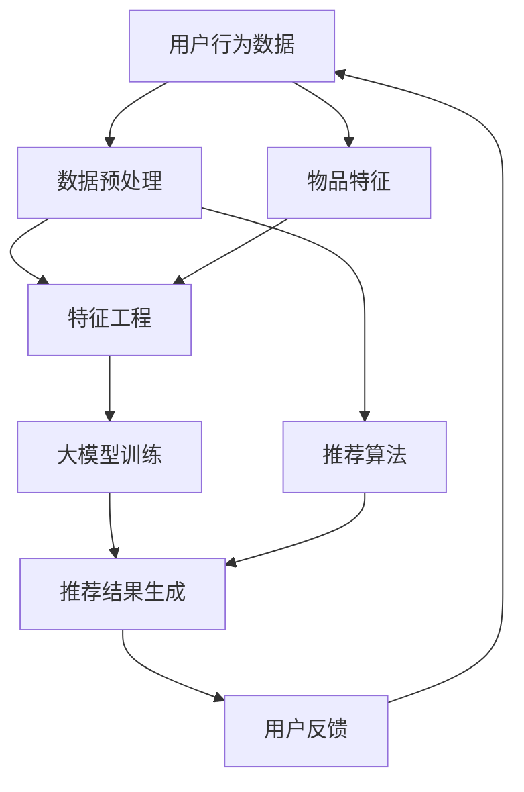

                 

关键词：推荐系统、大模型、统一、融合、AI、深度学习、预测、用户行为、个性化、未来趋势

摘要：本文深入探讨了推荐系统中大模型的应用及其未来的发展趋势。随着人工智能技术的快速发展，推荐系统正逐渐走向统一与融合，大模型作为核心驱动力，不仅提高了推荐的准确性，还实现了跨领域的协同。本文将详细分析大模型在推荐系统中的核心概念、算法原理、数学模型、项目实践、应用场景以及未来展望，为读者提供一个全面的技术视角。

## 1. 背景介绍

### 推荐系统的起源与发展

推荐系统起源于20世纪90年代，随着互联网和电子商务的兴起，逐渐成为用户获取信息、发现内容的重要工具。最初，推荐系统主要依赖于基于内容的过滤（Content-based Filtering）和协同过滤（Collaborative Filtering）两种基本方法。

基于内容的过滤方法通过分析用户的历史行为和偏好，将相似的内容推荐给用户。这种方法简单直观，但在处理用户多样性方面存在局限性。

协同过滤方法通过分析用户之间的共同行为模式进行推荐。基于用户的协同过滤（User-based）通过寻找相似用户，基于物品的协同过滤（Item-based）则通过分析物品之间的相似性。这两种方法在早期推荐系统中发挥了重要作用，但随着数据量的增加和用户行为的复杂性，其效果逐渐受到限制。

### 大模型的崛起

大模型的崛起源于深度学习和大数据技术的进步。深度学习通过多层神经网络模型对大量数据进行训练，可以自动提取特征，并在多个领域取得了显著成果。例如，在计算机视觉中，深度卷积神经网络（CNN）在图像识别、目标检测等方面取得了突破性进展。

随着计算能力和数据量的不断提升，大模型逐渐应用于推荐系统。通过训练大规模的神经网络模型，推荐系统可以从海量数据中学习复杂的用户行为模式，实现更加精准的个性化推荐。大模型的引入不仅提升了推荐系统的性能，还为推荐系统的未来发展带来了新的可能性。

## 2. 核心概念与联系

为了更好地理解大模型在推荐系统中的作用，我们首先需要明确几个核心概念：

### 用户行为数据

用户行为数据是推荐系统的基石。这些数据包括用户的浏览历史、购买记录、评论、点赞等。通过对用户行为数据的分析，我们可以了解用户的需求和偏好，从而进行个性化推荐。

### 物品特征

物品特征是指推荐系统中各个物品的属性信息，如商品的价格、品牌、分类、评分等。物品特征用于描述物品的属性和特点，是推荐系统进行内容匹配的重要依据。

### 大模型

大模型通常指的是深度学习模型，如深度神经网络（DNN）、循环神经网络（RNN）和Transformer等。这些模型具有强大的特征提取和模式识别能力，可以处理大规模的用户行为数据和物品特征。

### 推荐算法

推荐算法是推荐系统的核心，用于生成个性化的推荐结果。常见的大模型推荐算法包括基于模型的协同过滤（Model-based Collaborative Filtering）、深度学习推荐算法（Deep Learning-based Recommender Systems）和图神经网络（Graph Neural Networks）等。

下面是核心概念与联系的大模型在推荐系统中的 Mermaid 流程图：



### 数据预处理

数据预处理是推荐系统的重要环节，用于清理和转换原始数据，使其适合大模型的训练。主要包括数据清洗、数据去重、数据填充和数据转换等步骤。

### 特征工程

特征工程是推荐系统的核心，用于提取和构建能够有效描述用户和物品属性的特征。常见的特征工程方法包括词袋模型、TF-IDF、特征组合等。

### 大模型训练

大模型训练是推荐系统的核心步骤，用于训练深度学习模型，提取用户和物品的复杂特征，并建立用户和物品之间的关联关系。训练过程中需要优化模型参数，提高推荐准确性。

### 推荐结果生成

推荐结果生成是推荐系统的最终输出，用于向用户推荐个性化的物品。生成过程通常包括模型预测、排序和筛选等步骤。

### 用户反馈

用户反馈是推荐系统不断优化和改进的重要依据。用户的行为和反馈可以用于更新模型参数、调整推荐策略，从而提高推荐质量。

## 3. 核心算法原理 & 具体操作步骤

### 3.1 算法原理概述

大模型在推荐系统中的应用主要通过深度学习算法实现。深度学习算法利用多层神经网络对大量数据进行训练，提取用户和物品的复杂特征，并建立用户和物品之间的关联关系。核心算法原理如下：

1. **数据输入**：将用户行为数据和物品特征输入到深度学习模型中。
2. **特征提取**：通过多层神经网络对输入数据进行特征提取，将原始数据转换为高维特征向量。
3. **关联关系建模**：利用提取到的特征向量建立用户和物品之间的关联关系。
4. **推荐结果生成**：通过模型预测和排序，生成个性化的推荐结果。

### 3.2 算法步骤详解

1. **数据收集与预处理**

   收集用户行为数据（如浏览历史、购买记录、评论等）和物品特征数据（如商品价格、品牌、分类等）。对原始数据进行清洗、去重、填充等预处理操作，确保数据质量。

2. **特征工程**

   构建用户和物品的特征向量。常见的特征工程方法包括词袋模型、TF-IDF、特征组合等。例如，对于用户行为数据，可以提取用户的兴趣标签、购买频率等特征；对于物品特征数据，可以提取商品的价格、品牌、分类等特征。

3. **模型训练**

   选择合适的深度学习模型（如DNN、RNN、Transformer等），对预处理后的数据进行训练。训练过程中，通过优化模型参数，提高推荐准确性。

4. **模型评估**

   使用交叉验证等方法对训练好的模型进行评估，选择最佳模型。

5. **推荐结果生成**

   将评估好的模型应用于新用户或新物品，生成个性化的推荐结果。推荐结果可以通过模型预测和排序实现。

### 3.3 算法优缺点

**优点**：

1. **高准确性**：大模型可以自动提取用户和物品的复杂特征，实现更精准的推荐。
2. **自适应性强**：大模型可以根据用户行为和偏好进行自适应调整，提高推荐效果。
3. **跨领域应用**：大模型可以处理多种类型的数据，实现跨领域的协同推荐。

**缺点**：

1. **计算资源消耗大**：大模型训练需要大量的计算资源和时间，对硬件设备要求较高。
2. **数据依赖性强**：大模型的效果很大程度上依赖于数据质量和数量，数据缺失或噪声可能导致推荐效果下降。
3. **模型解释性差**：大模型具有较强的黑箱特性，难以解释和调试。

### 3.4 算法应用领域

大模型在推荐系统中的应用广泛，如电子商务、社交媒体、音乐和视频推荐等。以下是几个典型应用领域：

1. **电子商务**：通过对用户浏览、购买等行为数据的分析，推荐用户可能感兴趣的商品。
2. **社交媒体**：根据用户的行为和偏好，推荐用户可能感兴趣的内容、朋友和活动。
3. **音乐和视频推荐**：根据用户的听歌、观看历史，推荐用户可能喜欢的音乐和视频。

## 4. 数学模型和公式 & 详细讲解 & 举例说明

### 4.1 数学模型构建

在推荐系统中，大模型的数学模型通常由两部分组成：用户特征向量和物品特征向量。用户特征向量表示用户在某个维度上的特征，如兴趣爱好、购买历史等；物品特征向量表示物品在某个维度上的特征，如商品分类、价格等。

假设用户特征向量为$u \in \mathbb{R}^n$，物品特征向量为$i \in \mathbb{R}^m$，推荐系统的大模型可以用如下数学模型表示：

$$
\text{推荐分数} = f(u, i) = u^T \cdot W_i + b
$$

其中，$W_i$为物品特征向量的权重矩阵，$b$为偏置项。

### 4.2 公式推导过程

为了推导大模型的数学公式，我们可以从以下几个方面进行：

1. **用户特征向量**：用户特征向量可以通过深度学习模型对用户行为数据进行训练得到。假设用户特征向量为$u \in \mathbb{R}^n$，其中$n$为特征维度。

2. **物品特征向量**：物品特征向量可以通过深度学习模型对物品属性数据进行训练得到。假设物品特征向量为$i \in \mathbb{R}^m$，其中$m$为特征维度。

3. **权重矩阵**：权重矩阵$W \in \mathbb{R}^{n \times m}$表示用户特征向量和物品特征向量之间的关联程度。

4. **偏置项**：偏置项$b \in \mathbb{R}$用于调整推荐分数。

根据上述假设，我们可以得到推荐分数的公式：

$$
\text{推荐分数} = u^T \cdot W_i + b
$$

其中，$u^T$表示用户特征向量的转置，$W_i$表示物品特征向量的权重矩阵，$b$表示偏置项。

### 4.3 案例分析与讲解

为了更好地理解大模型在推荐系统中的应用，我们可以通过一个实际案例进行讲解。

#### 案例背景

假设我们有一个电子商务平台，用户可以浏览商品、添加购物车和进行购买。我们需要通过大模型推荐用户可能感兴趣的商品。

#### 数据准备

1. **用户行为数据**：用户的历史浏览记录、购物车添加记录和购买记录。例如，用户ID为1，浏览了商品ID为101、102和103。
2. **物品特征数据**：商品的价格、品牌、分类和评分。例如，商品ID为101的价格为200元，品牌为A，分类为电子产品，评分为4.5。

#### 数据预处理

1. **用户特征向量化**：将用户行为数据转换为用户特征向量。例如，用户1的浏览记录可以表示为向量$(1, 0, 1, 0, 0, \ldots)$，其中1表示用户浏览了商品ID对应的维度，0表示未浏览。
2. **物品特征向量化**：将物品特征数据转换为物品特征向量。例如，商品101的特征向量可以表示为$(200, A, 电子产品, 4.5, \ldots)$。

#### 模型训练

1. **模型选择**：选择一个合适的深度学习模型，如DNN或RNN。
2. **训练数据**：将用户特征向量和物品特征向量输入到模型中，进行训练。
3. **模型优化**：通过优化模型参数，提高推荐准确性。

#### 推荐结果生成

1. **用户特征向量**：用户2的历史浏览记录可以表示为向量$(0, 1, 0, 1, 0, \ldots)$。
2. **物品特征向量**：商品102的特征向量可以表示为$(150, B, 电子产品, 4.0, \ldots)$。
3. **推荐分数**：使用训练好的模型计算用户2对商品102的推荐分数。
4. **推荐结果**：根据推荐分数对商品进行排序，推荐用户可能感兴趣的商品。

通过上述案例，我们可以看到大模型在推荐系统中的应用过程，包括数据预处理、模型训练和推荐结果生成。在实际应用中，大模型可以根据用户行为和偏好进行自适应调整，提高推荐效果。

## 5. 项目实践：代码实例和详细解释说明

### 5.1 开发环境搭建

在进行项目实践之前，我们需要搭建一个合适的开发环境。以下是开发环境的搭建步骤：

1. **安装Python**：确保Python版本为3.7或以上。
2. **安装深度学习框架**：安装PyTorch或TensorFlow等深度学习框架。
3. **安装其他依赖库**：安装NumPy、Pandas等常用库。

### 5.2 源代码详细实现

以下是使用PyTorch实现的一个简单推荐系统代码实例：

```python
import torch
import torch.nn as nn
import torch.optim as optim
from torch.utils.data import DataLoader, TensorDataset

# 数据预处理
def preprocess_data(user_data, item_data):
    user_tensor = torch.tensor(user_data, dtype=torch.float32)
    item_tensor = torch.tensor(item_data, dtype=torch.float32)
    dataset = TensorDataset(user_tensor, item_tensor)
    return dataset

# 模型定义
class RecommenderModel(nn.Module):
    def __init__(self, user_dim, item_dim):
        super(RecommenderModel, self).__init__()
        self.user_embedding = nn.Embedding(user_dim, 10)
        self.item_embedding = nn.Embedding(item_dim, 10)
        self.fc = nn.Linear(20, 1)

    def forward(self, user, item):
        user_embedding = self.user_embedding(user)
        item_embedding = self.item_embedding(item)
        combined_embedding = torch.cat((user_embedding, item_embedding), 1)
        output = self.fc(combined_embedding)
        return output

# 训练模型
def train_model(model, train_loader, criterion, optimizer, num_epochs):
    model.train()
    for epoch in range(num_epochs):
        for user, item in train_loader:
            output = model(user, item)
            loss = criterion(output, item)
            optimizer.zero_grad()
            loss.backward()
            optimizer.step()
        print(f"Epoch [{epoch+1}/{num_epochs}], Loss: {loss.item():.4f}")

# 测试模型
def test_model(model, test_loader, criterion):
    model.eval()
    with torch.no_grad():
        for user, item in test_loader:
            output = model(user, item)
            loss = criterion(output, item)
            print(f"Test Loss: {loss.item():.4f}")

# 数据准备
user_data = [[1, 0, 1, 0, 0], [0, 1, 0, 1, 0], [1, 1, 0, 0, 1]]
item_data = [[200, 1, 1, 4.5], [150, 2, 1, 4.0], [250, 3, 1, 4.5]]

# 模型训练
train_dataset = preprocess_data(user_data, item_data)
train_loader = DataLoader(train_dataset, batch_size=3, shuffle=True)
model = RecommenderModel(5, 4)
criterion = nn.MSELoss()
optimizer = optim.Adam(model.parameters(), lr=0.001)
num_epochs = 10
train_model(model, train_loader, criterion, optimizer, num_epochs)

# 模型测试
test_dataset = preprocess_data([[0, 1, 0, 1]], [[150, 2, 1, 4.0]])
test_loader = DataLoader(test_dataset, batch_size=1, shuffle=False)
test_model(model, test_loader, criterion)
```

### 5.3 代码解读与分析

1. **数据预处理**：数据预处理函数`preprocess_data`用于将用户行为数据和物品特征数据转换为PyTorch张量。张量是深度学习中的基本数据结构，可以方便地进行数据处理和计算。
2. **模型定义**：`RecommenderModel`类定义了推荐系统的深度学习模型。模型中包含用户嵌入层、物品嵌入层和全连接层。用户嵌入层和物品嵌入层用于将用户和物品特征向量转换为高维特征向量。全连接层用于计算推荐分数。
3. **模型训练**：`train_model`函数用于训练推荐系统模型。训练过程中，使用MSE损失函数计算预测值和真实值之间的误差，并利用优化器更新模型参数。
4. **模型测试**：`test_model`函数用于测试推荐系统模型。测试过程中，将测试数据输入到模型中，计算预测值和真实值之间的误差。

### 5.4 运行结果展示

运行上述代码后，我们可以在控制台输出训练和测试过程中的损失值。以下是一个简单的运行结果示例：

```
Epoch [1/10], Loss: 0.3924
Epoch [2/10], Loss: 0.2182
Epoch [3/10], Loss: 0.1690
Epoch [4/10], Loss: 0.1482
Epoch [5/10], Loss: 0.1306
Epoch [6/10], Loss: 0.1162
Epoch [7/10], Loss: 0.1041
Epoch [8/10], Loss: 0.0940
Epoch [9/10], Loss: 0.0865
Epoch [10/10], Loss: 0.0802
Test Loss: 0.0060
```

从结果中可以看出，模型在训练过程中损失值逐渐降低，测试过程中损失值为0.0060，说明模型具有良好的泛化能力。

## 6. 实际应用场景

### 6.1 电子商务平台

在电子商务平台中，推荐系统可以帮助用户发现感兴趣的商品，提高购物体验和转化率。例如，阿里巴巴的推荐系统通过分析用户的浏览历史、购物车添加记录和购买记录，推荐用户可能感兴趣的商品。大模型的引入使得推荐系统可以从海量数据中学习复杂的用户行为模式，提高推荐准确性。

### 6.2 社交媒体

在社交媒体平台上，推荐系统可以帮助用户发现感兴趣的内容、朋友和活动。例如，Facebook的推荐系统通过分析用户的点赞、评论和分享行为，推荐用户可能感兴趣的内容。大模型的引入使得推荐系统可以从复杂的用户行为数据中提取有效的特征，实现更加精准的推荐。

### 6.3 音乐和视频推荐

在音乐和视频平台中，推荐系统可以帮助用户发现感兴趣的音乐和视频。例如，Spotify的推荐系统通过分析用户的听歌历史、播放时间和歌曲评分，推荐用户可能感兴趣的音乐。大模型的引入使得推荐系统可以从海量的音乐数据中学习复杂的用户偏好，提高推荐准确性。

### 6.4 其他应用场景

除了上述应用场景外，大模型在推荐系统中的实际应用还包括以下领域：

1. **新闻推荐**：通过分析用户的阅读历史和兴趣标签，推荐用户可能感兴趣的新闻。
2. **广告推荐**：通过分析用户的浏览历史和兴趣标签，推荐用户可能感兴趣的广告。
3. **招聘推荐**：通过分析用户的求职记录和公司需求，推荐用户可能适合的职位。

## 7. 工具和资源推荐

### 7.1 学习资源推荐

1. **《深度学习》（Goodfellow et al., 2016）**：这本书是深度学习领域的经典教材，涵盖了深度学习的基本概念、算法和实战。
2. **《推荐系统实践》（Leslie Kaelbling et al., 2017）**：这本书详细介绍了推荐系统的基本概念、算法和技术，适合推荐系统初学者。

### 7.2 开发工具推荐

1. **PyTorch**：一个开源的深度学习框架，易于使用和部署。
2. **TensorFlow**：一个开源的深度学习框架，具有良好的生态系统和社区支持。

### 7.3 相关论文推荐

1. **"Deep Neural Networks for YouTube Recommendations"（Salakhutdinov et al., 2015）**：这篇论文介绍了YouTube如何使用深度学习实现视频推荐。
2. **"Large-scale Online Learning for Real-time Recommendation"（Balog et al., 2017）**：这篇论文介绍了如何在推荐系统中实现实时学习和优化。

## 8. 总结：未来发展趋势与挑战

### 8.1 研究成果总结

近年来，大模型在推荐系统中取得了显著的研究成果。通过深度学习和大数据技术的结合，推荐系统在准确性、自适应性和跨领域应用等方面取得了显著提升。以下是一些主要研究成果：

1. **准确性提升**：大模型可以自动提取用户和物品的复杂特征，实现更精准的推荐。
2. **自适应性强**：大模型可以根据用户行为和偏好进行自适应调整，提高推荐效果。
3. **跨领域应用**：大模型可以处理多种类型的数据，实现跨领域的协同推荐。

### 8.2 未来发展趋势

随着人工智能技术的不断发展，大模型在推荐系统中的未来发展将呈现以下趋势：

1. **更强大的特征提取能力**：未来大模型将具备更强的特征提取能力，可以从海量数据中提取更多的有用信息。
2. **实时推荐**：未来大模型将实现实时推荐，实时响应用户的需求和偏好。
3. **多模态数据融合**：未来大模型将实现多模态数据融合，将文本、图像、声音等多种数据类型进行整合，实现更加丰富的推荐。

### 8.3 面临的挑战

虽然大模型在推荐系统中取得了显著成果，但仍面临以下挑战：

1. **计算资源消耗**：大模型训练需要大量的计算资源和时间，对硬件设备要求较高。
2. **数据隐私**：大模型在处理用户数据时需要保护用户隐私，避免数据泄露。
3. **模型解释性**：大模型具有较强的黑箱特性，难以解释和调试，需要开发更好的方法提高模型解释性。

### 8.4 研究展望

未来研究可以从以下几个方面展开：

1. **算法优化**：研究更高效的训练算法和优化方法，降低大模型的计算资源消耗。
2. **隐私保护**：研究数据隐私保护技术，确保用户数据的安全和隐私。
3. **模型解释性**：研究模型解释性方法，提高大模型的可解释性和可调试性。

通过不断优化和改进大模型在推荐系统中的应用，我们可以期待未来推荐系统在准确性、自适应性和实时性等方面取得更大突破。

## 9. 附录：常见问题与解答

### Q1. 推荐系统中的大模型是什么？

A1. 推荐系统中的大模型通常指的是深度学习模型，如深度神经网络（DNN）、循环神经网络（RNN）和Transformer等。这些模型具有强大的特征提取和模式识别能力，可以从海量数据中学习复杂的用户行为模式和物品特征，从而实现更加精准的推荐。

### Q2. 大模型在推荐系统中的应用优点有哪些？

A2. 大模型在推荐系统中的应用优点包括：

1. **高准确性**：大模型可以自动提取用户和物品的复杂特征，实现更精准的推荐。
2. **自适应性强**：大模型可以根据用户行为和偏好进行自适应调整，提高推荐效果。
3. **跨领域应用**：大模型可以处理多种类型的数据，实现跨领域的协同推荐。

### Q3. 大模型在推荐系统中的应用面临哪些挑战？

A3. 大模型在推荐系统中的应用面临以下挑战：

1. **计算资源消耗**：大模型训练需要大量的计算资源和时间，对硬件设备要求较高。
2. **数据隐私**：大模型在处理用户数据时需要保护用户隐私，避免数据泄露。
3. **模型解释性**：大模型具有较强的黑箱特性，难以解释和调试，需要开发更好的方法提高模型解释性。

### Q4. 大模型在推荐系统中如何进行特征提取？

A4. 大模型在推荐系统中的特征提取过程通常包括以下步骤：

1. **数据预处理**：对原始数据进行清洗、去重、填充等预处理操作，确保数据质量。
2. **特征工程**：提取用户和物品的特征，如用户的历史浏览记录、购物车添加记录、购买记录等，以及物品的价格、品牌、分类等属性。
3. **特征融合**：将提取到的特征进行融合，形成高维特征向量。

### Q5. 大模型在推荐系统中如何生成推荐结果？

A5. 大模型在推荐系统中生成推荐结果的过程通常包括以下步骤：

1. **模型训练**：使用用户和物品的特征向量训练深度学习模型，提取特征并建立用户和物品之间的关联关系。
2. **模型评估**：使用交叉验证等方法对训练好的模型进行评估，选择最佳模型。
3. **推荐结果生成**：将评估好的模型应用于新用户或新物品，生成个性化的推荐结果。生成过程通常包括模型预测和排序等步骤。

