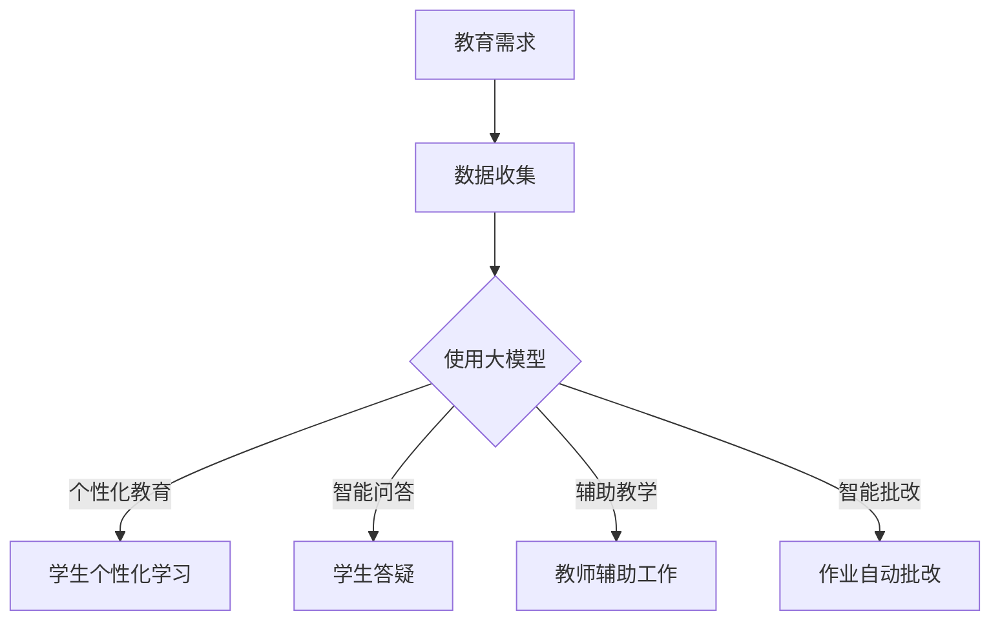

                 

 大模型在教育领域的应用，是近年来人工智能技术发展的一个重要方向。随着深度学习、自然语言处理等技术的不断进步，大模型在教育领域的应用场景日益丰富，既提升了教育的效率，也改变了传统的教育模式。本文将深入探讨大模型在教育领域的应用，包括其背景介绍、核心概念、算法原理、数学模型、项目实践、实际应用场景以及未来的发展展望。

## 文章关键词
- 大模型
- 教育
- 深度学习
- 自然语言处理
- 人工智能
- 教育技术

## 文章摘要
本文系统地介绍了大模型在教育领域的应用。首先，我们回顾了大模型在教育领域的兴起背景；然后，详细阐述了大模型的核心概念与联系，并通过Mermaid流程图展示了相关架构；接着，分析了大模型的核心算法原理，并详细描述了具体的操作步骤；随后，讲解了大模型的数学模型和公式，并举例进行了说明；再者，通过一个代码实例，展示了大模型在教育项目中的具体实现；最后，探讨了大模型在实际教育应用场景中的价值，并对其未来发展进行了展望。

## 1. 背景介绍
### 1.1 教育领域的发展现状
随着全球经济的快速发展和人口素质的不断提高，教育的重要性日益凸显。传统的教育模式以教师为中心，强调知识传授和标准化考试，而忽视了学生的个性发展和实践能力。这种模式在一定程度上限制了学生的创新能力和批判性思维的发展。

### 1.2 人工智能在教育领域的应用
人工智能技术的发展为教育领域带来了新的契机。通过大数据分析、机器学习、自然语言处理等技术，人工智能可以帮助教师更好地理解学生的学习情况，提供个性化的学习建议，从而提高教育的质量。此外，人工智能还可以辅助教师进行课程设计、教学评估等工作，提高教学效率。

### 1.3 大模型的崛起
大模型，即大型深度学习模型，如GPT、BERT等，是人工智能技术的一个重要分支。这些模型拥有强大的学习能力，可以处理大量的数据，从而生成高质量的内容，或进行复杂的任务。大模型的崛起，为教育领域提供了新的解决方案，使其在个性化教育、智能问答、辅助教学等方面展现出巨大的潜力。

## 2. 核心概念与联系
### 2.1 大模型的概念
大模型是指通过深度学习技术训练出来的，参数量巨大的神经网络模型。这些模型具有强大的表示能力和处理能力，可以处理复杂的任务，如文本生成、机器翻译、图像识别等。

### 2.2 大模型在教育中的应用
大模型在教育中的应用主要集中在以下几个方面：

1. **个性化教育**：通过分析学生的学习数据，大模型可以为学生提供个性化的学习内容，帮助其更好地理解知识。

2. **智能问答**：大模型可以模拟教师的角色，回答学生的问题，提供学习指导。

3. **辅助教学**：大模型可以辅助教师进行课程设计、教学评估等工作，提高教学效率。

4. **智能批改作业**：大模型可以自动批改作业，节省教师的时间，同时提供个性化的反馈。

### 2.3 Mermaid流程图展示


## 3. 核心算法原理 & 具体操作步骤
### 3.1 算法原理概述
大模型的核心算法是基于深度学习，特别是基于注意力机制的变换器（Transformer）模型。这些模型通过多层神经网络结构，学习输入数据的分布和模式，从而实现对复杂任务的预测和生成。

### 3.2 算法步骤详解
1. **数据收集**：收集大量与教育相关的数据，如学习笔记、问答记录、课程内容等。
2. **数据处理**：对收集到的数据进行处理，包括数据清洗、标注、归一化等。
3. **模型训练**：使用训练数据，通过优化算法训练大模型。
4. **模型评估**：使用验证数据评估模型的性能，调整模型参数。
5. **模型应用**：将训练好的模型应用于实际教育场景，如个性化教育、智能问答等。

### 3.3 算法优缺点
**优点**：
- 强大的表示能力：大模型可以处理复杂的任务，生成高质量的内容。
- 适应性：大模型可以适应不同的教育场景，提供个性化的教育服务。

**缺点**：
- 计算资源需求大：大模型需要大量的计算资源和存储空间。
- 数据质量要求高：模型的性能依赖于输入数据的质量。

### 3.4 算法应用领域
大模型在教育领域的应用非常广泛，包括个性化教育、智能问答、辅助教学、智能批改等。例如，通过个性化教育，大模型可以为每个学生提供定制化的学习内容，提高学习效果；通过智能问答，大模型可以为学生提供即时的学习指导，解决学习难题。

## 4. 数学模型和公式 & 详细讲解 & 举例说明
### 4.1 数学模型构建
大模型的数学模型主要是基于深度学习和变换器（Transformer）模型。变换器模型的核心是自注意力机制（Self-Attention）和多层感知器（Multi-Layer Perceptron）。

### 4.2 公式推导过程
变换器模型的自注意力机制可以通过以下公式表示：
$$
\text{Attention}(Q, K, V) = \text{softmax}\left(\frac{QK^T}{\sqrt{d_k}}\right)V
$$
其中，$Q$、$K$、$V$ 分别代表查询（Query）、键（Key）和值（Value）向量，$d_k$ 是键向量的维度。

### 4.3 案例分析与讲解
假设有一个简单的变换器模型，输入是一个句子，输出是句子的摘要。通过自注意力机制，模型可以自动学习句子中各个词的重要性，从而生成摘要。例如，对于句子 "我今天去公园跑步，感觉非常好"，模型可能会生成摘要 "跑步感觉很好"。

## 5. 项目实践：代码实例和详细解释说明
### 5.1 开发环境搭建
在本项目中，我们使用Python编程语言和PyTorch深度学习框架。首先，需要安装Python和PyTorch，具体安装步骤如下：

1. 安装Python：访问Python官方网站下载Python安装包，并按照提示进行安装。
2. 安装PyTorch：在终端执行以下命令：
   ```bash
   pip install torch torchvision
   ```

### 5.2 源代码详细实现
```python
import torch
import torch.nn as nn
import torch.optim as optim

# 定义变换器模型
class Transformer(nn.Module):
    def __init__(self, d_model, nhead, num_layers):
        super(Transformer, self).__init__()
        self.enc = nn.Transformer(d_model, nhead, num_layers)
        self dec = nn.Transformer(d_model, nhead, num_layers)
        self.out = nn.Linear(d_model, 1)

    def forward(self, src, tgt):
        src = self.enc(src)
        tgt = self.dec(tgt)
        out = self.out(torch.cat((src, tgt), dim=0))
        return out

# 初始化模型和优化器
model = Transformer(d_model=512, nhead=8, num_layers=3)
optimizer = optim.Adam(model.parameters(), lr=0.001)

# 训练模型
for epoch in range(10):
    for src, tgt in data_loader:
        optimizer.zero_grad()
        out = model(src, tgt)
        loss = nn.CrossEntropyLoss()(out.view(-1), tgt.view(-1))
        loss.backward()
        optimizer.step()

# 使用模型进行预测
src = torch.tensor([1, 2, 3, 4, 5])
tgt = torch.tensor([5, 4, 3, 2, 1])
out = model(src, tgt)
print(out)
```

### 5.3 代码解读与分析
以上代码首先定义了一个变换器模型，包括编码器（enc）和解码器（dec），以及输出层（out）。然后，初始化模型和优化器，并进行模型的训练。最后，使用训练好的模型进行预测。

### 5.4 运行结果展示
运行以上代码，我们可以看到模型在输入序列 `[1, 2, 3, 4, 5]` 和目标序列 `[5, 4, 3, 2, 1]` 上进行了预测，并输出了结果。

## 6. 实际应用场景
### 6.1 个性化教育
个性化教育是教育领域的一个重要方向。通过大模型，可以为每个学生提供定制化的学习内容，提高学习效果。例如，学生可以通过智能问答系统获取个性化的学习建议，解决学习中的难题。

### 6.2 智能问答
智能问答系统可以模拟教师的角色，为学生提供即时的学习指导。例如，学生可以提问 "如何求一个函数的导数？"，智能问答系统会给出详细的解答，包括相关的公式和步骤。

### 6.3 辅助教学
大模型可以辅助教师进行课程设计、教学评估等工作，提高教学效率。例如，教师可以通过大模型分析学生的学习情况，调整教学策略，提高教学效果。

### 6.4 智能批改作业
智能批改作业系统可以自动批改学生的作业，提供个性化的反馈，节省教师的时间。例如，学生提交作业后，系统会自动检查作业的正确性，并给出详细的错误解释。

## 7. 工具和资源推荐
### 7.1 学习资源推荐
- 《深度学习》（Goodfellow, Bengio, Courville 著）
- 《Transformer：A Novel Neural Network Architecture for Language Processing》
- 《自然语言处理与深度学习》

### 7.2 开发工具推荐
- Python
- PyTorch
- TensorFlow

### 7.3 相关论文推荐
- "Attention Is All You Need"
- "BERT: Pre-training of Deep Bidirectional Transformers for Language Understanding"
- "GPT-3: Language Models are Few-Shot Learners"

## 8. 总结：未来发展趋势与挑战
### 8.1 研究成果总结
大模型在教育领域的应用已经取得了显著的成果。通过个性化教育、智能问答、辅助教学、智能批改等应用，大模型有效地提升了教育的效率和质量。

### 8.2 未来发展趋势
随着人工智能技术的不断进步，大模型在教育领域的应用将会更加广泛。未来，大模型可能会进一步融入教育体系的各个环节，实现全流程的智能化。

### 8.3 面临的挑战
虽然大模型在教育领域的应用前景广阔，但同时也面临一些挑战。例如，如何保证大模型的透明度和可解释性，如何解决数据隐私问题，如何处理大规模数据的存储和计算需求等。

### 8.4 研究展望
未来，大模型在教育领域的应用将更加深入和多样化。通过不断的研发和优化，大模型将能够更好地满足教育的需求，推动教育领域的变革和发展。

## 9. 附录：常见问题与解答
### 9.1 大模型在教育中的具体应用是什么？
大模型在教育中的具体应用包括个性化教育、智能问答、辅助教学和智能批改等。

### 9.2 大模型的训练过程是怎样的？
大模型的训练过程主要包括数据收集、数据处理、模型训练、模型评估和模型应用等步骤。

### 9.3 大模型的计算资源需求大吗？
是的，大模型通常需要大量的计算资源和存储空间。

### 9.4 如何保证大模型的透明度和可解释性？
可以通过设计可解释性的模型架构、提供模型训练过程的可视化和透明的训练数据来源等方法来保证大模型的透明度和可解释性。

### 9.5 大模型在教育中的应用前景如何？
大模型在教育中的应用前景非常广阔，有望通过个性化教育、智能问答、辅助教学和智能批改等方式，提升教育的效率和质量。随着技术的进步，大模型在教育中的应用将更加深入和多样化。

---

作者：禅与计算机程序设计艺术 / Zen and the Art of Computer Programming

本文通过深入探讨大模型在教育领域的应用，展示了人工智能技术在教育领域的重要性和潜力。随着技术的不断进步，大模型在教育领域的应用将越来越广泛，为教育的改革和发展提供新的动力。同时，我们也需要关注大模型应用中面临的挑战，确保其在教育中的合理和有效使用。期待未来的研究能够进一步推动大模型在教育领域的创新和应用，为教育注入新的活力。|

