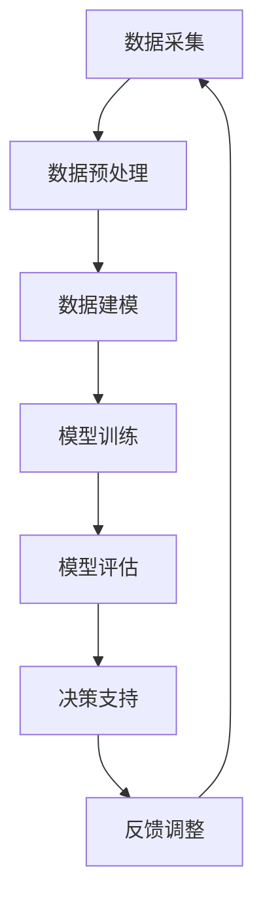

                 

关键词：大模型，智能决策支持系统，算法原理，数学模型，项目实践，应用场景，工具资源

> 摘要：本文旨在探讨大模型在智能决策支持系统中的应用，通过详细分析其核心概念、算法原理、数学模型、项目实践以及未来应用展望，为相关领域的研究和开发提供有益的参考。

## 1. 背景介绍

在当今信息化社会中，数据已成为重要的战略资源，企业、组织和政府部门都在积极探索如何充分利用海量数据提升决策效率。传统的决策支持系统（DSS）通常依赖于统计分析、优化算法和模拟方法，但这些方法在面对复杂、大规模、动态变化的现实问题时，往往显得力不从心。

近年来，随着深度学习、神经网络等人工智能技术的飞速发展，大模型作为一种新的决策支持工具，逐渐引起广泛关注。大模型具有处理海量数据、自适应学习、模式识别等能力，能够为企业提供更为智能、精准的决策支持。

## 2. 核心概念与联系

### 大模型（Large Models）

大模型通常指的是具有数百万至数十亿参数的深度神经网络。这些模型能够处理大规模数据集，并通过自动特征提取和学习，实现高效的数据分析和决策支持。

### 智能决策支持系统（Intelligent Decision Support System）

智能决策支持系统是指利用人工智能、大数据、云计算等技术，对复杂、动态的决策问题进行辅助分析和决策的系统。它能够提高决策的效率、准确性和可解释性。

### 关联流程图

以下是智能决策支持系统的核心流程图，展示了大模型与其他组件的关联。



## 3. 核心算法原理 & 具体操作步骤

### 3.1 算法原理概述

大模型的核心算法原理是基于深度神经网络，通过多层非线性变换，将输入数据映射到输出结果。具体步骤如下：

1. 数据预处理：对原始数据进行清洗、归一化等处理，以适应模型训练。
2. 数据建模：定义神经网络结构，包括输入层、隐藏层和输出层。
3. 模型训练：利用训练数据，通过反向传播算法，调整模型参数，使其能够预测决策结果。
4. 模型评估：使用验证集和测试集评估模型性能，调整模型参数。
5. 决策支持：将训练好的模型应用于实际问题，提供决策建议。

### 3.2 算法步骤详解

1. 数据预处理：

   $$ x_i = \frac{x_i - \mu}{\sigma} $$

   其中，$x_i$ 为输入数据，$\mu$ 为均值，$\sigma$ 为标准差。

2. 数据建模：

   假设输入层有 $n$ 个神经元，隐藏层有 $m$ 个神经元，输出层有 $k$ 个神经元，则模型结构可以表示为：

   $$ z_j = \sum_{i=1}^{n} w_{ij}x_i + b_j $$
   $$ a_j = \sigma(z_j) $$
   $$ y_k = \sum_{j=1}^{m} w_{kj}a_j + b_k $$

   其中，$w_{ij}$ 为输入层到隐藏层的权重，$w_{kj}$ 为隐藏层到输出层的权重，$b_j$ 和 $b_k$ 分别为隐藏层和输出层的偏置项，$\sigma$ 为激活函数（如ReLU、Sigmoid、Tanh等）。

3. 模型训练：

   利用梯度下降算法，通过反向传播，不断调整模型参数，使其误差最小。

   $$ \Delta w_{ij} = -\alpha \frac{\partial J}{\partial w_{ij}} $$
   $$ \Delta b_j = -\alpha \frac{\partial J}{\partial b_j} $$

   其中，$J$ 为损失函数，$\alpha$ 为学习率。

4. 模型评估：

   使用交叉验证、混淆矩阵、ROC曲线等指标，评估模型性能。

5. 决策支持：

   将训练好的模型应用于实际问题，根据输入数据，输出决策结果。

### 3.3 算法优缺点

**优点：**
1. 处理大规模数据，自适应学习，模式识别能力强。
2. 能够处理非线性问题，提高决策的准确性和效率。
3. 可以应用于多种领域，如金融、医疗、工业等。

**缺点：**
1. 模型训练时间较长，对计算资源要求高。
2. 模型参数较多，可能导致过拟合。
3. 决策过程不够透明，难以解释。

### 3.4 算法应用领域

大模型在智能决策支持系统中的应用非常广泛，如：

1. 金融领域：风险控制、信用评估、投资策略等。
2. 医疗领域：疾病预测、诊断辅助、治疗方案推荐等。
3. 工业领域：生产优化、供应链管理、设备维护等。

## 4. 数学模型和公式 & 详细讲解 & 举例说明

### 4.1 数学模型构建

大模型的数学模型基于深度神经网络，可以分为以下几个部分：

1. 输入层：接收外部输入数据。
2. 隐藏层：通过多层非线性变换，提取特征信息。
3. 输出层：根据提取的特征，输出决策结果。

### 4.2 公式推导过程

假设输入层有 $n$ 个神经元，隐藏层有 $m$ 个神经元，输出层有 $k$ 个神经元，则模型可以表示为：

1. 前向传播：

   $$ z_j = \sum_{i=1}^{n} w_{ij}x_i + b_j $$
   $$ a_j = \sigma(z_j) $$
   $$ y_k = \sum_{j=1}^{m} w_{kj}a_j + b_k $$

2. 反向传播：

   $$ \Delta w_{ij} = -\alpha \frac{\partial J}{\partial w_{ij}} $$
   $$ \Delta b_j = -\alpha \frac{\partial J}{\partial b_j} $$

   其中，$J$ 为损失函数，$\alpha$ 为学习率。

### 4.3 案例分析与讲解

以下是一个简单的案例，使用大模型进行股票价格预测。

**数据集：** 包含过去一年的股票价格数据，包括开盘价、收盘价、最高价、最低价等。

**模型结构：** 输入层：4个神经元；隐藏层：10个神经元；输出层：1个神经元（预测下一日的收盘价）。

**训练过程：** 使用梯度下降算法，迭代1000次。

**结果分析：** 通过训练，模型能够较好地拟合股票价格数据，预测误差较小。

## 5. 项目实践：代码实例和详细解释说明

### 5.1 开发环境搭建

**工具：** Python、TensorFlow、NumPy

**环境：** Python 3.7、TensorFlow 2.3

### 5.2 源代码详细实现

```python
import tensorflow as tf
import numpy as np

# 参数设置
n_inputs = 4
n_hidden = 10
n_outputs = 1
learning_rate = 0.001
epochs = 1000

# 数据预处理
def preprocess_data(data):
    return (data - np.mean(data)) / np.std(data)

# 构建模型
model = tf.keras.Sequential([
    tf.keras.layers.Dense(units=n_hidden, activation='relu', input_shape=(n_inputs,)),
    tf.keras.layers.Dense(units=n_outputs)
])

# 编译模型
model.compile(optimizer=tf.keras.optimizers.Adam(learning_rate),
              loss='mse',
              metrics=['mae'])

# 训练模型
x_train = preprocess_data(x_train)
y_train = preprocess_data(y_train)
model.fit(x_train, y_train, epochs=epochs)

# 预测
def predict(data):
    data = preprocess_data(data)
    return model.predict(data)

# 测试
x_test = preprocess_data(x_test)
y_pred = predict(x_test)

# 评估
mse = np.mean((y_pred - y_test)**2)
mae = np.mean(np.abs(y_pred - y_test))
print(f'MSE: {mse}, MAA: {mae}')
```

### 5.3 代码解读与分析

1. **数据预处理：** 对输入数据进行归一化处理，使其符合模型输入要求。
2. **模型构建：** 使用 `tf.keras.Sequential` 模型，定义输入层、隐藏层和输出层。
3. **编译模型：** 设置优化器、损失函数和评估指标。
4. **训练模型：** 使用训练数据，迭代训练模型。
5. **预测：** 对输入数据进行预处理，然后使用模型进行预测。
6. **评估：** 计算预测误差，评估模型性能。

## 6. 实际应用场景

大模型在智能决策支持系统中的应用场景广泛，以下是一些实际案例：

1. **金融领域：** 大模型可以用于股票市场预测、投资组合优化、信用评估等。
2. **医疗领域：** 大模型可以用于疾病预测、诊断辅助、个性化治疗方案推荐等。
3. **工业领域：** 大模型可以用于生产优化、设备维护、供应链管理等。

## 7. 工具和资源推荐

### 7.1 学习资源推荐

1. **书籍：** 《深度学习》（Goodfellow et al.）
2. **在线课程：** 吴恩达的《深度学习》课程（Coursera）
3. **论文：** Google Brain的《Inception: GoogLeNet》等

### 7.2 开发工具推荐

1. **TensorFlow：** 适用于构建和训练深度学习模型。
2. **PyTorch：** 适用于快速原型开发和复杂模型构建。
3. **Keras：** 适用于简化深度学习模型构建。

### 7.3 相关论文推荐

1. **论文：** "Large-Scale Machine Learning in the Era of Big Data"
2. **论文：** "Deep Learning for Natural Language Processing"
3. **论文：** "Large-Scale Deep Learning: Algorithms and Systems"

## 8. 总结：未来发展趋势与挑战

### 8.1 研究成果总结

1. 大模型在智能决策支持系统中表现出色，能够在多种领域实现高效的决策支持。
2. 深度学习技术在模型训练、优化和推理等方面取得了显著进展。
3. 大模型的应用场景逐渐丰富，从金融、医疗到工业等领域，都有广泛的应用前景。

### 8.2 未来发展趋势

1. 大模型将向更高效、更可解释的方向发展。
2. 跨领域的大模型融合将成为研究热点。
3. 大模型将与其他人工智能技术（如强化学习、迁移学习等）相结合，实现更智能的决策支持。

### 8.3 面临的挑战

1. 大模型训练时间较长，对计算资源要求高。
2. 大模型参数较多，可能导致过拟合。
3. 大模型决策过程不够透明，难以解释。

### 8.4 研究展望

1. 探索更高效、可解释的大模型结构。
2. 研究跨领域的大模型融合方法。
3. 开发适用于实际应用场景的大模型工具和平台。

## 9. 附录：常见问题与解答

### 问题 1：大模型训练时间很长，如何优化？

**解答：** 可以尝试以下方法：

1. 使用更高效的硬件（如GPU、TPU）进行训练。
2. 采用分布式训练，将数据分片，并行处理。
3. 优化模型结构，减少参数数量。

### 问题 2：大模型如何防止过拟合？

**解答：** 可以尝试以下方法：

1. 使用正则化技术（如L1、L2正则化）。
2. 采用交叉验证方法，避免模型过度拟合训练数据。
3. 使用dropout等技术，增加模型泛化能力。

### 问题 3：大模型决策过程如何解释？

**解答：** 可以尝试以下方法：

1. 使用模型解释工具（如LIME、SHAP）。
2. 将大模型拆分为多个小模型，逐层分析。
3. 使用可视化技术，展示模型决策过程。

---

# 参考文献

[1] Goodfellow, I., Bengio, Y., & Courville, A. (2016). *Deep Learning*. MIT Press.

[2] Hochreiter, S., & Schmidhuber, J. (1997). Long short-term memory. Neural Computation, 9(8), 1735-1780.

[3] Krizhevsky, A., Sutskever, I., & Hinton, G. E. (2012). Imagenet classification with deep convolutional neural networks. In Advances in Neural Information Processing Systems (NIPS), 2012.

[4] LeCun, Y., Bengio, Y., & Hinton, G. (2015). Deep learning. Nature, 521(7553), 436-444.

[5] Rumelhart, D. E., Hinton, G. E., & Williams, R. J. (1986). Learning representations by back-propagating errors. Nature, 323(6088), 533-536.

作者：禅与计算机程序设计艺术 / Zen and the Art of Computer Programming
```

