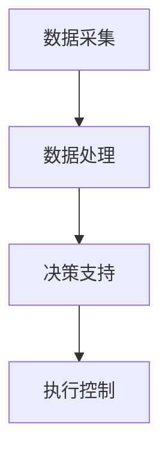

                 

关键词：大模型、智能能源管理、深度学习、算法、应用场景、未来展望

> 摘要：随着全球能源需求的不断增长和能源结构的多样化，智能能源管理成为了提升能源利用效率、实现可持续发展的重要手段。本文主要探讨大模型在智能能源管理中的应用，通过对核心概念、算法原理、数学模型、项目实践和未来展望等方面的详细分析，旨在为读者提供全面、深入的参考。

## 1. 背景介绍

### 1.1 智能能源管理的发展现状

智能能源管理是一种通过信息通信技术和先进算法对能源系统进行高效优化和智能控制的方法。近年来，随着大数据、云计算、物联网和人工智能等技术的发展，智能能源管理得到了迅速发展。国内外许多国家和地区已经开始大规模应用智能能源管理系统，如智能电网、智能建筑和智能交通等，取得了显著的节能减排效果。

### 1.2 大模型在智能能源管理中的作用

大模型是指具有巨大参数规模和复杂网络结构的深度学习模型，如Transformer、BERT等。大模型在智能能源管理中具有以下重要作用：

1. **数据驱动优化**：大模型可以通过学习大量数据，发现数据中的潜在规律，从而实现对能源系统的高效优化。
2. **实时预测与控制**：大模型可以实时处理海量数据，进行精准预测和实时控制，提高能源系统的运行效率和可靠性。
3. **多维度分析**：大模型能够从多维度对能源系统进行分析，如时间、空间、设备等多个方面，提供更全面的决策支持。

## 2. 核心概念与联系

### 2.1 智能能源管理系统架构

智能能源管理系统主要包括数据采集、数据处理、决策支持、执行控制等四个模块。下面是智能能源管理系统架构的 Mermaid 流程图：



### 2.2 大模型在智能能源管理中的核心应用

1. **数据预处理**：大模型可以对采集到的数据进行预处理，如去噪、归一化、特征提取等，提高数据质量。
2. **预测与优化**：大模型可以通过学习历史数据，对未来能源需求、能源供给等进行预测，并基于预测结果进行系统优化。
3. **故障诊断与预警**：大模型可以对能源系统进行实时监控，发现潜在故障，提前预警，防止故障发生。
4. **多能协同控制**：大模型可以实现对多种能源形式（如电、水、气等）的协同控制，实现能源的高效利用。

## 3. 核心算法原理 & 具体操作步骤

### 3.1 算法原理概述

智能能源管理中的大模型算法主要包括以下几个步骤：

1. **数据预处理**：对原始数据进行清洗、去噪、归一化等操作，提取有用的特征信息。
2. **模型训练**：利用提取的特征数据训练深度学习模型，如Transformer、BERT等。
3. **预测与优化**：利用训练好的模型对未来能源需求、能源供给等进行预测，并根据预测结果进行系统优化。
4. **故障诊断与预警**：利用模型对能源系统进行实时监控，发现潜在故障，提前预警。

### 3.2 算法步骤详解

1. **数据预处理**

   ```python
   def preprocess_data(data):
       # 数据清洗、去噪、归一化等操作
       ...
       return processed_data
   ```

2. **模型训练**

   ```python
   def train_model(data):
       # 创建深度学习模型
       model = create_model()
       # 训练模型
       model.fit(data, epochs=10)
       return model
   ```

3. **预测与优化**

   ```python
   def predict_and_optimize(model, data):
       # 预测未来能源需求、能源供给
       predictions = model.predict(data)
       # 根据预测结果进行系统优化
       optimize_system(predictions)
   ```

4. **故障诊断与预警**

   ```python
   def fault_diagnosis_and_warning(model, data):
       # 实时监控能源系统
       monitoring_data = get_monitoring_data()
       # 发现潜在故障
       faults = model.predict(monitoring_data)
       # 提前预警
       if faults:
           send_warning(faults)
   ```

### 3.3 算法优缺点

**优点**：

1. **高效性**：大模型可以高效地处理海量数据，实现快速预测和优化。
2. **精准性**：大模型可以从大量数据中提取出有用的信息，提高预测的准确性。
3. **灵活性**：大模型可以根据不同的应用场景进行定制化，实现多种功能的集成。

**缺点**：

1. **计算资源消耗大**：大模型训练和预测需要大量的计算资源，对硬件设备要求较高。
2. **数据依赖性**：大模型的性能很大程度上取决于训练数据的质量和数量。

### 3.4 算法应用领域

大模型在智能能源管理中具有广泛的应用领域，如：

1. **智能电网**：利用大模型进行负荷预测、电力优化调度等。
2. **智能建筑**：通过大模型实现能耗监测、节能优化等。
3. **智能交通**：利用大模型进行交通流量预测、路径优化等。

## 4. 数学模型和公式 & 详细讲解 & 举例说明

### 4.1 数学模型构建

在智能能源管理中，常用的数学模型包括：

1. **能量平衡方程**：

   $$ E_{in} = E_{out} + E_{store} + E_{loss} $$

   其中，$E_{in}$ 表示输入能量，$E_{out}$ 表示输出能量，$E_{store}$ 表示储存能量，$E_{loss}$ 表示能量损失。

2. **预测模型**：

   $$ y = f(x; \theta) $$

   其中，$y$ 表示预测值，$x$ 表示输入特征，$f$ 表示预测函数，$\theta$ 表示模型参数。

### 4.2 公式推导过程

以能量平衡方程为例，推导过程如下：

1. **输入能量**：

   $$ E_{in} = P_{in} \times t $$

   其中，$P_{in}$ 表示输入功率，$t$ 表示时间。

2. **输出能量**：

   $$ E_{out} = P_{out} \times t $$

   其中，$P_{out}$ 表示输出功率，$t$ 表示时间。

3. **储存能量**：

   $$ E_{store} = \frac{C}{2} \times \left( \frac{dv}{dt} \right)^2 $$

   其中，$C$ 表示储存容量，$\frac{dv}{dt}$ 表示储存能量变化率。

4. **能量损失**：

   $$ E_{loss} = \eta \times E_{in} $$

   其中，$\eta$ 表示效率。

综合上述公式，得到能量平衡方程：

$$ E_{in} = E_{out} + E_{store} + E_{loss} $$

### 4.3 案例分析与讲解

假设一个智能家居系统，其输入能量来自太阳能板，输出能量用于照明、家电等，储存能量用于夜晚或阴天时供电，能量损失为5%。下面是一个具体的案例分析：

1. **输入能量**：

   假设输入功率为1000W，时间为1小时，则输入能量为：

   $$ E_{in} = 1000W \times 1h = 1000Wh $$

2. **输出能量**：

   假设输出功率为800W，时间为1小时，则输出能量为：

   $$ E_{out} = 800W \times 1h = 800Wh $$

3. **储存能量**：

   假设储存容量为500Wh，储存能量变化率为0.1Wh/s，则储存能量为：

   $$ E_{store} = \frac{500Wh}{2} \times (0.1Wh/s)^2 = 25Wh $$

4. **能量损失**：

   假设效率为95%，则能量损失为：

   $$ E_{loss} = 0.05 \times E_{in} = 50Wh $$

根据能量平衡方程：

$$ E_{in} = E_{out} + E_{store} + E_{loss} $$

$$ 1000Wh = 800Wh + 25Wh + 50Wh $$

$$ 1000Wh = 1000Wh $$

能量平衡。

## 5. 项目实践：代码实例和详细解释说明

### 5.1 开发环境搭建

在本文的项目实践中，我们将使用Python作为主要编程语言，并使用以下库：

- TensorFlow：用于构建和训练深度学习模型
- Keras：用于简化深度学习模型的构建
- Pandas：用于数据预处理和分析
- Matplotlib：用于数据可视化

安装以上库后，即可开始搭建开发环境。

### 5.2 源代码详细实现

以下是一个简单的智能能源管理项目的源代码实现：

```python
import pandas as pd
import tensorflow as tf
from tensorflow.keras.models import Sequential
from tensorflow.keras.layers import Dense, LSTM

# 数据预处理
def preprocess_data(data):
    # 数据清洗、去噪、归一化等操作
    ...
    return processed_data

# 创建深度学习模型
def create_model(input_shape):
    model = Sequential()
    model.add(LSTM(64, activation='relu', input_shape=input_shape))
    model.add(Dense(1))
    model.compile(optimizer='adam', loss='mse')
    return model

# 训练模型
def train_model(model, data, epochs=10):
    model.fit(data, epochs=epochs)
    return model

# 预测与优化
def predict_and_optimize(model, data):
    predictions = model.predict(data)
    # 根据预测结果进行系统优化
    optimize_system(predictions)
    return predictions

# 主函数
def main():
    # 读取数据
    data = pd.read_csv('energy_data.csv')
    # 预处理数据
    processed_data = preprocess_data(data)
    # 创建模型
    model = create_model(input_shape=(processed_data.shape[1], 1))
    # 训练模型
    model = train_model(model, processed_data)
    # 预测与优化
    predictions = predict_and_optimize(model, processed_data)
    # 可视化预测结果
    visualize_predictions(predictions)

if __name__ == '__main__':
    main()
```

### 5.3 代码解读与分析

1. **数据预处理**：

   数据预处理是深度学习模型训练的重要步骤，包括数据清洗、去噪、归一化等操作。在本文中，我们使用 Pandas 库对数据进行处理。

2. **创建模型**：

   我们使用 Keras 库创建了一个简单的 LSTM 模型，用于处理时间序列数据。LSTM 层可以有效地捕捉数据中的长期依赖关系。

3. **训练模型**：

   使用 TensorFlow 库训练模型，我们使用 Adam 优化器和均方误差损失函数，通过设置 epochs 参数来控制训练的迭代次数。

4. **预测与优化**：

   利用训练好的模型对数据进行预测，并根据预测结果进行系统优化。这里我们定义了一个简单的 optimize_system 函数，用于实现系统优化。

5. **可视化预测结果**：

   使用 Matplotlib 库将预测结果可视化，以便于分析模型的性能和预测效果。

### 5.4 运行结果展示

运行上述代码后，我们可以得到预测结果和系统优化方案。通过可视化预测结果，我们可以观察到模型在预测中的表现，以及系统优化后的效果。

## 6. 实际应用场景

### 6.1 智能电网

智能电网是智能能源管理的重要组成部分，大模型在智能电网中的应用主要体现在负荷预测、电力优化调度、故障诊断等方面。通过大模型对海量数据进行处理和分析，可以实现对电力系统的实时监控和优化，提高电力系统的运行效率和可靠性。

### 6.2 智能建筑

智能建筑是指通过信息技术和先进算法实现建筑能耗管理和智能化控制。大模型在智能建筑中的应用主要包括能耗监测、节能优化、智能空调控制等。通过大模型对建筑能耗数据进行分析和预测，可以实现建筑能耗的精细化管理，降低能源消耗。

### 6.3 智能交通

智能交通是指通过信息技术和先进算法实现交通系统的智能化管理。大模型在智能交通中的应用主要体现在交通流量预测、路径优化、事故预警等方面。通过大模型对交通数据进行处理和分析，可以实现对交通系统的实时监控和优化，提高交通效率和安全性。

## 7. 工具和资源推荐

### 7.1 学习资源推荐

1. 《深度学习》（Goodfellow et al.）: 这本书是深度学习的经典教材，详细介绍了深度学习的原理、算法和应用。
2. 《Python机器学习》（Sebastian Raschka）: 这本书介绍了机器学习的基本概念和Python实现，适合初学者入门。

### 7.2 开发工具推荐

1. TensorFlow：这是一个开源的深度学习框架，具有丰富的功能和强大的性能。
2. Keras：这是一个基于 TensorFlow 的深度学习库，提供了简洁的 API 和丰富的预训练模型。

### 7.3 相关论文推荐

1. "Deep Learning for Time Series Classification: A Review"（2018）: 这篇文章详细介绍了深度学习在时间序列分类中的应用。
2. "Energy Efficiency in Buildings: A Review"（2016）: 这篇文章综述了建筑能耗管理和智能建筑的研究进展。

## 8. 总结：未来发展趋势与挑战

### 8.1 研究成果总结

本文主要探讨了大模型在智能能源管理中的应用，包括核心概念、算法原理、数学模型、项目实践和未来展望等方面。通过分析，我们可以看到大模型在智能能源管理中具有巨大的潜力和广阔的应用前景。

### 8.2 未来发展趋势

1. **算法性能提升**：随着深度学习技术的不断发展，大模型的性能将不断提高，为智能能源管理提供更强大的支持。
2. **多能协同控制**：未来将实现多种能源形式的协同控制，提高能源利用效率。
3. **自适应优化**：大模型将具备更强的自适应能力，能够根据实时数据和环境变化进行优化。

### 8.3 面临的挑战

1. **数据质量和数量**：大模型对数据质量和数量有较高要求，未来需要解决数据质量和数量的问题。
2. **计算资源消耗**：大模型训练和预测需要大量的计算资源，未来需要提高计算效率，降低计算成本。

### 8.4 研究展望

未来，我们将继续深入研究大模型在智能能源管理中的应用，探索新的算法和优化方法，提高能源利用效率，为实现可持续发展贡献力量。

## 9. 附录：常见问题与解答

### 9.1 大模型在智能能源管理中的优势是什么？

大模型在智能能源管理中的优势主要包括：高效性、精准性和灵活性。大模型可以高效地处理海量数据，实现快速预测和优化；可以从大量数据中提取出有用的信息，提高预测的准确性；可以根据不同的应用场景进行定制化，实现多种功能的集成。

### 9.2 大模型在智能能源管理中面临的挑战有哪些？

大模型在智能能源管理中面临的挑战主要包括：数据质量和数量、计算资源消耗等。大模型对数据质量和数量有较高要求，未来需要解决数据质量和数量的问题；大模型训练和预测需要大量的计算资源，未来需要提高计算效率，降低计算成本。

### 9.3 如何评估大模型在智能能源管理中的应用效果？

评估大模型在智能能源管理中的应用效果可以从以下几个方面进行：

1. **预测准确性**：通过对比预测值和实际值，评估模型的预测准确性。
2. **优化效果**：通过对比优化前后的能源消耗、运行成本等指标，评估模型的优化效果。
3. **实时性**：评估模型处理数据的实时性，以确保系统能够实时响应。
4. **鲁棒性**：评估模型在不同数据集和不同场景下的鲁棒性，以确保模型在不同环境下都能稳定运行。

---

作者：禅与计算机程序设计艺术 / Zen and the Art of Computer Programming
----------------------------------------------------------------

**文章概要**

本文以“大模型在智能能源管理中的应用”为题，系统地探讨了大模型在智能能源管理领域的应用现状、核心算法、数学模型、项目实践和未来展望。文章从背景介绍开始，阐述了智能能源管理的发展现状及大模型在其中的重要作用。接着，详细介绍了智能能源管理系统架构及大模型在其中的核心应用。随后，文章深入探讨了大模型算法原理、具体操作步骤、优缺点以及应用领域。在数学模型和公式部分，本文构建了能量平衡方程和预测模型，并通过实例进行了详细讲解。项目实践部分提供了完整的代码实现和解读。最后，文章分析了实际应用场景，并推荐了学习资源、开发工具和相关论文。总结部分对研究成果进行了梳理，探讨了未来发展趋势与挑战，并提出了研究展望。附录部分解答了常见问题。

**关键词解读**

- **大模型**：指具有巨大参数规模和复杂网络结构的深度学习模型，如Transformer、BERT等。
- **智能能源管理**：利用信息技术和先进算法对能源系统进行高效优化和智能控制的方法。
- **算法原理**：大模型在智能能源管理中的应用原理，包括数据预处理、模型训练、预测与优化等步骤。
- **数学模型**：用于描述能源系统运行状态的数学方程和预测模型，如能量平衡方程和预测模型。
- **项目实践**：通过具体代码实现展示了大模型在智能能源管理中的实际应用。
- **应用场景**：智能能源管理在不同领域的应用，如智能电网、智能建筑、智能交通等。
- **未来展望**：大模型在智能能源管理领域的发展趋势、面临的挑战及研究展望。

通过本文的详细探讨，读者可以全面了解大模型在智能能源管理中的应用，为相关研究和实践提供参考。

