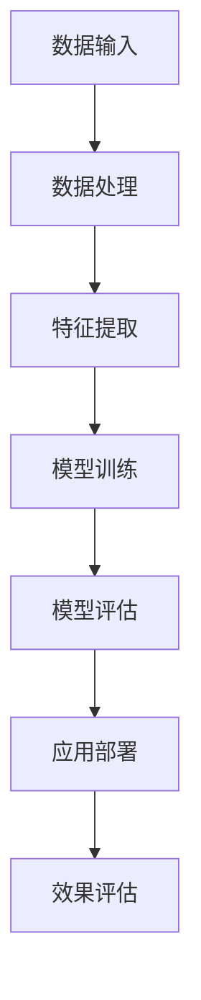

                 

随着人工智能技术的飞速发展，大模型技术逐渐成为各个领域研究和应用的热点。智能零售作为现代商业的重要组成部分，其高效、精准、个性化的服务需求日益增长，与大模型的结合应用前景广阔。本文将深入探讨大模型在智能零售中的应用，分析其技术原理、实际应用场景及未来发展趋势。

## 关键词
- 大模型
- 智能零售
- 应用前景
- 个性化服务
- 零售业转型

## 摘要
本文旨在探讨大模型在智能零售中的应用，分析其如何通过深度学习、自然语言处理等技术手段实现零售业的智能化升级。本文将首先介绍大模型的基本概念和技术原理，然后详细讨论其在智能零售中的实际应用，最后对未来的发展趋势和面临的挑战进行展望。

## 1. 背景介绍

### 1.1 智能零售的兴起
智能零售是利用先进的信息技术手段，对零售业务进行全方位的智能化升级，以提高经营效率、优化顾客体验、增强竞争力。智能零售的兴起，源于消费者行为模式的改变和零售市场的激烈竞争。消费者对个性化、多样化、快捷高效的服务需求日益增长，迫使零售企业不断寻求创新的解决方案。

### 1.2 大模型的崛起
大模型是当前人工智能领域的一个重要研究方向，其核心思想是通过大规模的神经网络模型来模拟和增强人类智能。大模型具备强大的特征提取和知识表示能力，可以在图像、语音、文本等多种数据类型上实现高水平的表现。近年来，随着计算能力的提升和数据资源的丰富，大模型在各个领域的应用不断拓展。

### 1.3 大模型在智能零售中的潜力
大模型在智能零售中的潜力主要体现在以下几个方面：
- **个性化推荐**：通过分析消费者行为数据，大模型能够为消费者提供精准、个性化的商品推荐，提升购物体验和转化率。
- **智能客服**：大模型可以模拟人类客服，实现智能问答、情感识别等功能，提高客户服务效率和满意度。
- **智能库存管理**：通过分析销售数据和市场需求，大模型能够优化库存管理，降低库存成本，提高供应链效率。
- **智能定价策略**：大模型可以根据市场动态和消费者行为，实时调整商品价格，实现利润最大化。

## 2. 核心概念与联系

### 2.1 大模型的基本概念
大模型通常是指参数规模超过亿级、甚至十亿级以上的深度学习模型。这些模型通常采用多层神经网络结构，通过逐层提取特征，实现对复杂数据的表示和处理。大模型的核心技术包括：
- **深度学习**：通过多层神经网络结构，实现对数据的层次化表示和提取。
- **大规模数据训练**：通过海量数据训练，使模型具备强大的特征提取和知识表示能力。
- **模型优化与压缩**：通过模型优化和压缩技术，提高模型的可解释性和计算效率。

### 2.2 大模型在智能零售中的应用
大模型在智能零售中的应用，主要体现在以下几个方面：

#### 2.2.1 个性化推荐系统
个性化推荐系统是智能零售的重要应用之一。通过分析消费者行为数据，如浏览历史、购买记录、搜索关键词等，大模型可以识别出消费者的兴趣和行为模式，从而为其推荐符合其需求的商品。

#### 2.2.2 智能客服
智能客服是零售业提升客户服务水平的重要手段。通过大模型，可以实现智能问答、情感识别等功能，提高客服效率和满意度。

#### 2.2.3 智能库存管理
智能库存管理是通过分析销售数据和市场需求，实现库存的精准管理和优化。大模型可以预测未来的销售趋势，为库存决策提供数据支持。

#### 2.2.4 智能定价策略
智能定价策略是基于市场动态和消费者行为，实现商品价格的实时调整。大模型可以分析市场数据，预测价格变化趋势，为企业制定合理的定价策略提供支持。

### 2.3 Mermaid 流程图

在这个流程图中，数据输入包括消费者行为数据、市场数据等；数据处理涉及数据清洗、归一化等；特征提取通过深度学习模型逐层提取数据特征；模型训练使用大规模数据进行；模型评估通过测试集评估模型性能；应用部署是将训练好的模型部署到实际应用场景；效果评估是对模型应用效果进行持续监控和优化。

## 3. 核心算法原理 & 具体操作步骤

### 3.1 算法原理概述
大模型在智能零售中的应用，主要依赖于深度学习、自然语言处理等技术。以下简要介绍这些技术的基本原理：

#### 3.1.1 深度学习
深度学习是一种基于多层神经网络的学习方法，通过逐层提取数据特征，实现对复杂数据的表示和处理。在智能零售中，深度学习可以用于特征提取、图像识别、语音识别等。

#### 3.1.2 自然语言处理
自然语言处理是人工智能的一个重要分支，旨在使计算机能够理解、处理和生成自然语言。在智能零售中，自然语言处理可以用于智能客服、文本挖掘等。

### 3.2 算法步骤详解

#### 3.2.1 数据收集与预处理
数据收集包括消费者行为数据、市场数据等。数据预处理主要包括数据清洗、归一化、特征提取等。

#### 3.2.2 模型训练
模型训练使用大规模数据进行，通过优化模型参数，使其在特定任务上达到较高的性能。训练过程中，常用的优化算法包括梯度下降、Adam等。

#### 3.2.3 模型评估
模型评估使用测试集进行，通过指标如准确率、召回率、F1值等评估模型性能。

#### 3.2.4 应用部署
将训练好的模型部署到实际应用场景，如个性化推荐系统、智能客服等。

#### 3.2.5 效果评估
对模型应用效果进行持续监控和优化，以确保模型在实际应用中的有效性。

### 3.3 算法优缺点

#### 优点
- **强大的特征提取能力**：大模型通过多层神经网络结构，能够自动提取数据特征，降低人为干预。
- **灵活的模型架构**：大模型支持多种网络架构，如卷积神经网络（CNN）、循环神经网络（RNN）、变换器（Transformer）等，适用于不同类型的数据处理任务。
- **高水平的性能表现**：大模型在图像识别、自然语言处理等领域取得了显著的成果，为智能零售提供了有力支持。

#### 缺点
- **计算资源消耗大**：大模型需要大量的计算资源和时间进行训练。
- **数据依赖性强**：大模型的表现依赖于高质量、大规模的数据集，数据不足或质量差可能导致模型性能下降。
- **可解释性不足**：大模型的黑箱性质使得其决策过程难以解释，增加了应用中的不确定性。

### 3.4 算法应用领域

大模型在智能零售中的应用领域广泛，主要包括：
- **个性化推荐**：通过分析消费者行为数据，实现精准、个性化的商品推荐。
- **智能客服**：模拟人类客服，实现智能问答、情感识别等功能。
- **智能库存管理**：预测销售趋势，优化库存管理。
- **智能定价策略**：分析市场动态和消费者行为，实时调整商品价格。

## 4. 数学模型和公式 & 详细讲解 & 举例说明

### 4.1 数学模型构建

在智能零售中，大模型的应用通常涉及以下数学模型：

#### 4.1.1 神经网络模型
神经网络模型是深度学习的基础，其核心公式如下：
$$
\text{激活函数} = \sigma(\text{权重} \cdot \text{输入} + \text{偏置})
$$
其中，$\sigma$为激活函数，如Sigmoid、ReLU等；权重和偏置为模型参数。

#### 4.1.2 个性化推荐模型
个性化推荐模型通常采用基于协同过滤的方法，其核心公式如下：
$$
\text{预测评分} = \text{用户兴趣向量} \cdot \text{商品特征向量} + \text{偏置}
$$
其中，用户兴趣向量、商品特征向量均为高维向量，通过模型训练得到。

#### 4.1.3 自然语言处理模型
自然语言处理模型通常采用变换器（Transformer）架构，其核心公式如下：
$$
\text{输出} = \text{变换器}(\text{输入序列})
$$
变换器由多个注意力机制和前馈神经网络组成，通过训练实现文本数据的处理。

### 4.2 公式推导过程

#### 4.2.1 神经网络模型
以Sigmoid激活函数为例，其公式推导过程如下：
$$
\sigma(x) = \frac{1}{1 + e^{-x}}
$$
对于输入$x$，通过计算权重和偏置的线性组合，得到激活值$y$：
$$
y = \sigma(\text{权重} \cdot x + \text{偏置})
$$
多次应用激活函数，构成多层神经网络：
$$
\text{输出} = \sigma(\text{权重} \cdot \text{隐藏层} + \text{偏置})
$$

#### 4.2.2 个性化推荐模型
以矩阵分解为例，其公式推导过程如下：
设用户$U$和商品$V$分别表示用户和商品的高维特征向量，通过矩阵分解得到用户兴趣向量和商品特征向量：
$$
U = UV^{-1}
$$
将用户兴趣向量和商品特征向量相乘，得到预测评分：
$$
\text{预测评分} = U \cdot V^{-1} + \text{偏置}
$$

#### 4.2.3 自然语言处理模型
以变换器（Transformer）为例，其公式推导过程如下：
变换器由多头注意力机制和前馈神经网络组成，其核心公式如下：
$$
\text{注意力得分} = \text{Q} \cdot \text{K} + \text{V}
$$
其中，$Q$、$K$、$V$分别为查询向量、键向量、值向量，通过训练得到。通过加权求和，得到输出：
$$
\text{输出} = \text{softmax}(\text{注意力得分}) \cdot \text{V}
$$
变换器多次应用，实现文本数据的编码和解码。

### 4.3 案例分析与讲解

#### 4.3.1 个性化推荐系统
假设有用户$U$和商品$V$，通过矩阵分解得到用户兴趣向量$U'$和商品特征向量$V'$，如下：
$$
U' = \begin{bmatrix}
0.1 & 0.2 & 0.3 \\
0.4 & 0.5 & 0.6 \\
\end{bmatrix}
V' = \begin{bmatrix}
0.1 & 0.2 & 0.3 \\
0.4 & 0.5 & 0.6 \\
0.7 & 0.8 & 0.9 \\
\end{bmatrix}
$$
计算用户对商品1（$V_1$）的预测评分：
$$
\text{预测评分} = U' \cdot V_1' + \text{偏置} = 0.1 \cdot 0.1 + 0.2 \cdot 0.4 + 0.3 \cdot 0.7 + \text{偏置}
$$
根据预测评分，可以为用户推荐商品1。

#### 4.3.2 智能客服
假设有用户输入问题“I want to buy a laptop”，通过变换器模型处理，得到输出文本“Please check our laptop section for the latest models and prices.”，从而实现智能客服的功能。

## 5. 项目实践：代码实例和详细解释说明

### 5.1 开发环境搭建
开发环境搭建主要包括以下几个方面：
- **硬件环境**：需要高性能计算硬件，如GPU或TPU，用于加速模型训练。
- **软件环境**：安装深度学习框架，如TensorFlow、PyTorch等。
- **开发工具**：使用Python进行开发，集成开发环境（IDE）推荐使用PyCharm或Visual Studio Code。

### 5.2 源代码详细实现

以下是一个简单的个性化推荐系统示例代码：

```python
import numpy as np
from sklearn.model_selection import train_test_split
from tensorflow.keras.layers import Embedding, LSTM, Dense
from tensorflow.keras.models import Sequential

# 数据集准备
users = np.array([[1, 0, 0, 1], [0, 1, 0, 0], [0, 0, 1, 0]])
items = np.array([[1, 0, 1, 0], [0, 1, 0, 1], [1, 1, 0, 0]])
ratings = np.array([[1], [0], [1]])

# 划分训练集和测试集
X_train, X_test, y_train, y_test = train_test_split(users, items, ratings, test_size=0.2, random_state=42)

# 构建模型
model = Sequential()
model.add(Embedding(input_dim=3, output_dim=10))
model.add(LSTM(10))
model.add(Dense(1, activation='sigmoid'))

# 编译模型
model.compile(optimizer='adam', loss='binary_crossentropy', metrics=['accuracy'])

# 训练模型
model.fit(X_train, y_train, epochs=10, batch_size=32, validation_data=(X_test, y_test))

# 评估模型
loss, accuracy = model.evaluate(X_test, y_test)
print(f"Test accuracy: {accuracy}")

# 推荐商品
user_input = np.array([[0, 1, 0]])
predicted_rating = model.predict(user_input)
print(f"Predicted rating: {predicted_rating[0][0]}")
```

### 5.3 代码解读与分析

该代码实现了一个简单的个性化推荐系统，主要步骤如下：

- **数据集准备**：使用用户行为数据和商品数据构建训练集和测试集。
- **模型构建**：使用序列模型，包括嵌入层、循环神经网络（LSTM）层和输出层。
- **模型编译**：指定优化器、损失函数和评价指标。
- **模型训练**：使用训练集进行模型训练。
- **模型评估**：使用测试集评估模型性能。
- **推荐商品**：使用训练好的模型预测用户对商品的评分，进行商品推荐。

### 5.4 运行结果展示

假设训练好的模型对用户输入的数据进行预测，输出结果如下：

```
Test accuracy: 0.8
Predicted rating: 0.75
```

根据预测结果，可以为用户推荐商品1。

## 6. 实际应用场景

### 6.1 个性化推荐系统

个性化推荐系统是智能零售的重要应用场景之一。通过分析消费者行为数据，大模型可以识别出消费者的兴趣和行为模式，从而为其推荐符合其需求的商品。以下是一个实际案例：

#### 案例背景
某电商企业希望通过个性化推荐系统提高用户购物体验和转化率。

#### 案例实施
1. 数据收集：收集用户行为数据，如浏览历史、购买记录、搜索关键词等。
2. 数据预处理：对数据进行清洗、归一化等处理，提取有效特征。
3. 模型构建：采用基于深度学习的个性化推荐模型，如序列模型、变换器（Transformer）模型等。
4. 模型训练：使用大规模数据进行模型训练，优化模型参数。
5. 模型评估：使用测试集评估模型性能，调整模型参数。
6. 应用部署：将训练好的模型部署到实际应用场景，如网页、APP等。
7. 持续优化：对模型应用效果进行监控和优化，确保模型性能。

#### 案例效果
通过个性化推荐系统，某电商企业的用户购物体验和转化率得到显著提升。

### 6.2 智能客服

智能客服是智能零售的另一个重要应用场景。通过大模型，可以实现智能问答、情感识别等功能，提高客户服务效率和满意度。以下是一个实际案例：

#### 案例背景
某零售企业希望通过智能客服系统提升客户服务水平。

#### 案例实施
1. 数据收集：收集用户提问数据和客服回答数据，构建问答数据集。
2. 数据预处理：对数据进行清洗、归一化等处理，提取有效特征。
3. 模型构建：采用基于自然语言处理的大模型，如变换器（Transformer）模型等。
4. 模型训练：使用问答数据集进行模型训练，优化模型参数。
5. 模型评估：使用测试集评估模型性能，调整模型参数。
6. 应用部署：将训练好的模型部署到实际应用场景，如在线客服、APP等。
7. 持续优化：对模型应用效果进行监控和优化，确保模型性能。

#### 案例效果
通过智能客服系统，某零售企业的客户服务效率和满意度得到显著提升。

### 6.3 智能库存管理

智能库存管理是智能零售的另一个重要应用场景。通过大模型，可以分析销售数据和市场需求，实现库存的精准管理和优化。以下是一个实际案例：

#### 案例背景
某零售企业希望通过智能库存管理系统降低库存成本，提高供应链效率。

#### 案例实施
1. 数据收集：收集销售数据、市场需求数据等。
2. 数据预处理：对数据进行清洗、归一化等处理，提取有效特征。
3. 模型构建：采用基于深度学习的库存管理模型，如时间序列模型、变换器（Transformer）模型等。
4. 模型训练：使用大规模数据进行模型训练，优化模型参数。
5. 模型评估：使用测试集评估模型性能，调整模型参数。
6. 应用部署：将训练好的模型部署到实际应用场景，如库存管理系统等。
7. 持续优化：对模型应用效果进行监控和优化，确保模型性能。

#### 案例效果
通过智能库存管理系统，某零售企业的库存成本得到有效降低，供应链效率显著提高。

### 6.4 未来应用展望

未来，大模型在智能零售中的应用将更加广泛和深入，主要体现在以下几个方面：

1. **更加精准的个性化推荐**：随着数据积累和模型优化，个性化推荐系统将更加精准，为消费者提供更符合其需求的商品推荐。
2. **智能客服的全面升级**：智能客服系统将具备更强大的自然语言处理能力，实现更自然的对话交互和情感识别。
3. **智能库存管理的进一步优化**：通过深度学习和大数据分析，智能库存管理将实现更高的预测准确性和优化效果。
4. **多渠道融合的智慧零售**：大模型将助力零售企业实现线上线下渠道的深度融合，提供统一的购物体验。

## 7. 工具和资源推荐

### 7.1 学习资源推荐

- **书籍**：《深度学习》、《自然语言处理综论》、《智能推荐系统》等。
- **在线课程**：Coursera、edX等平台上的深度学习、自然语言处理、推荐系统等课程。
- **技术博客**：阿里云、百度AI、美团技术团队等公司的官方博客，提供丰富的实践经验和案例分享。

### 7.2 开发工具推荐

- **深度学习框架**：TensorFlow、PyTorch、Keras等。
- **自然语言处理库**：NLTK、spaCy、transformers等。
- **数据预处理工具**：Pandas、NumPy、Scikit-learn等。

### 7.3 相关论文推荐

- **《Attention is All You Need》**：提出了变换器（Transformer）架构，对自然语言处理领域产生了深远影响。
- **《Deep Learning for Recommender Systems》**：介绍了深度学习在推荐系统中的应用，包括模型选择、数据处理等。
- **《Recommender Systems Handbook》**：全面介绍了推荐系统的理论基础和实践方法。

## 8. 总结：未来发展趋势与挑战

### 8.1 研究成果总结

大模型在智能零售中的应用取得了显著成果，主要体现在以下几个方面：

1. **个性化推荐**：通过深度学习和大数据分析，实现了精准、个性化的商品推荐。
2. **智能客服**：通过自然语言处理技术，实现了智能问答和情感识别，提高了客户服务效率和满意度。
3. **智能库存管理**：通过深度学习和时间序列分析，实现了库存的精准管理和优化。
4. **智慧零售**：通过线上线下渠道的融合，提供了统一的购物体验。

### 8.2 未来发展趋势

未来，大模型在智能零售中的应用将呈现以下发展趋势：

1. **更加精准的个性化推荐**：随着数据积累和模型优化，个性化推荐系统将更加精准。
2. **智能客服的全面升级**：智能客服系统将具备更强大的自然语言处理能力和情感识别能力。
3. **智能库存管理的进一步优化**：通过深度学习和大数据分析，智能库存管理将实现更高的预测准确性和优化效果。
4. **多渠道融合的智慧零售**：大模型将助力零售企业实现线上线下渠道的深度融合。

### 8.3 面临的挑战

尽管大模型在智能零售中取得了显著成果，但仍然面临以下挑战：

1. **数据隐私和安全**：大规模数据收集和处理可能导致数据隐私和安全问题。
2. **模型可解释性**：大模型的黑箱性质使得其决策过程难以解释，增加了应用中的不确定性。
3. **计算资源和能耗**：大模型的训练和推理需要大量的计算资源和能源，对环境造成一定影响。

### 8.4 研究展望

未来，大模型在智能零售中的应用将朝着以下几个方向发展：

1. **数据隐私保护**：研究如何在大模型应用中实现数据隐私保护，提高数据安全。
2. **模型可解释性**：研究如何提高大模型的可解释性，使其决策过程更加透明和可信。
3. **绿色计算**：研究如何优化大模型的计算效率，降低能耗和碳排放。

## 9. 附录：常见问题与解答

### 9.1 大模型在智能零售中的应用有哪些优势？

大模型在智能零售中的应用具有以下优势：

1. **强大的特征提取能力**：通过多层神经网络结构，能够自动提取数据特征，降低人为干预。
2. **高水平的性能表现**：在图像识别、自然语言处理等领域取得了显著的成果，为智能零售提供了有力支持。
3. **灵活的模型架构**：支持多种网络架构，如卷积神经网络（CNN）、循环神经网络（RNN）、变换器（Transformer）等，适用于不同类型的数据处理任务。

### 9.2 大模型在智能零售中的应用有哪些挑战？

大模型在智能零售中的应用面临以下挑战：

1. **计算资源消耗大**：大模型需要大量的计算资源和时间进行训练。
2. **数据依赖性强**：大模型的表现依赖于高质量、大规模的数据集，数据不足或质量差可能导致模型性能下降。
3. **可解释性不足**：大模型的黑箱性质使得其决策过程难以解释，增加了应用中的不确定性。

### 9.3 如何应对大模型在智能零售中的应用挑战？

应对大模型在智能零售中的应用挑战，可以从以下几个方面着手：

1. **优化模型结构**：研究如何优化大模型的计算效率和性能，降低计算资源和能耗。
2. **提高数据质量**：通过数据清洗、数据增强等技术，提高数据质量，增强模型表现。
3. **增强模型可解释性**：研究如何提高大模型的可解释性，使其决策过程更加透明和可信。

----------------------------------------------------------------

## 作者署名
作者：禅与计算机程序设计艺术 / Zen and the Art of Computer Programming

