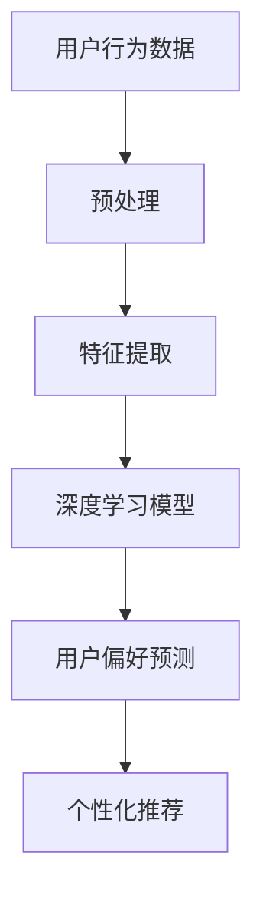

                 

关键词：大模型、用户偏好、深度学习、数据分析、算法应用

摘要：随着大数据和人工智能技术的快速发展，大模型在用户偏好理解方面发挥着越来越重要的作用。本文将深入探讨大模型在用户偏好理解中的应用，包括核心概念、算法原理、数学模型、项目实践以及未来应用展望。

## 1. 背景介绍

在互联网时代，用户生成的大量数据为个性化推荐和服务提供了丰富的信息资源。然而，如何有效地理解和挖掘用户偏好成为了一个重要的挑战。传统的方法通常依赖于用户的显式反馈（如评分、评论等），但用户的行为数据更加复杂且多样化，包含着用户未明确表达的真实偏好。

大模型（如深度神经网络、强化学习模型等）凭借其强大的学习和泛化能力，为用户偏好理解提供了新的思路和可能性。通过训练复杂的大模型，可以从海量的用户行为数据中提取出潜在的用户偏好模式，实现更加精准和个性化的推荐。

## 2. 核心概念与联系

### 2.1 大模型

大模型通常指的是具有大量参数的神经网络，如卷积神经网络（CNN）、循环神经网络（RNN）和Transformer模型等。这些模型可以捕捉到用户行为数据中的复杂模式和规律。

### 2.2 用户偏好

用户偏好是指用户在特定场景下的个性化需求，包括对产品、服务、内容等的偏好。用户偏好可以通过用户的行为数据、显式反馈和社交网络信息等途径进行挖掘。

### 2.3 深度学习

深度学习是一种基于多层神经网络的机器学习方法，通过多层次的神经网络结构来学习数据中的非线性特征。深度学习在用户偏好理解中发挥着关键作用，如图1所示。



## 3. 核心算法原理 & 具体操作步骤

### 3.1 算法原理概述

大模型在用户偏好理解中的应用主要包括以下几个步骤：

1. 数据预处理：对原始用户行为数据进行清洗、归一化和特征提取。
2. 模型训练：使用预处理后的数据训练深度学习模型，学习用户行为数据中的潜在模式。
3. 用户偏好预测：通过训练好的模型对未知用户的行为数据进行偏好预测。
4. 个性化推荐：根据用户的偏好预测结果，生成个性化的推荐结果。

### 3.2 算法步骤详解

#### 3.2.1 数据预处理

数据预处理包括以下步骤：

- 清洗：去除数据中的噪声和错误数据。
- 归一化：将不同特征的数据进行标准化处理，使其具有相似的尺度。
- 特征提取：使用特征工程技术提取用户行为数据中的关键特征。

#### 3.2.2 模型训练

模型训练包括以下步骤：

- 模型选择：选择合适的深度学习模型，如CNN、RNN或Transformer等。
- 模型配置：设置模型的超参数，如学习率、批量大小等。
- 模型训练：使用预处理后的数据对模型进行训练，优化模型参数。

#### 3.2.3 用户偏好预测

用户偏好预测包括以下步骤：

- 输入特征：将用户的行为数据输入到训练好的模型中。
- 模型输出：模型输出用户偏好预测结果，如概率分布。
- 结果解释：对预测结果进行解释和验证。

#### 3.2.4 个性化推荐

个性化推荐包括以下步骤：

- 推荐算法：根据用户偏好预测结果，选择合适的推荐算法，如基于内容的推荐、协同过滤等。
- 推荐生成：生成个性化的推荐结果，如商品、内容等。
- 用户反馈：收集用户的反馈，优化推荐系统。

### 3.3 算法优缺点

#### 3.3.1 优点

- 强大的学习和泛化能力：大模型可以从大量的用户行为数据中提取出潜在的用户偏好模式。
- 精准的个性化推荐：基于用户偏好预测的个性化推荐可以更好地满足用户的需求。

#### 3.3.2 缺点

- 计算资源消耗大：大模型需要大量的计算资源进行训练和推理。
- 数据隐私问题：用户行为数据的隐私保护是一个重要的挑战。

### 3.4 算法应用领域

大模型在用户偏好理解中的应用非常广泛，包括电子商务、社交媒体、内容推荐、金融等领域。以下是一些具体的案例：

- 电子商务：根据用户的购物行为和浏览记录，预测用户的购买偏好，生成个性化的商品推荐。
- 社交媒体：根据用户的互动行为和兴趣标签，预测用户可能感兴趣的内容，提高用户粘性。
- 内容推荐：根据用户的阅读历史和偏好，推荐相关的文章、视频等。
- 金融：根据用户的投资行为和风险偏好，预测用户的投资决策。

## 4. 数学模型和公式 & 详细讲解 & 举例说明

### 4.1 数学模型构建

在用户偏好理解中，常用的数学模型包括概率模型、贝叶斯网络、隐马尔可夫模型（HMM）等。以下是一个简单的贝叶斯网络模型示例：

$$
P(\text{偏好}|\text{行为}) = \frac{P(\text{行为}|\text{偏好})P(\text{偏好})}{P(\text{行为})}
$$

其中，$P(\text{偏好}|\text{行为})$ 表示在观察到用户行为的前提下，用户偏好发生的概率。

### 4.2 公式推导过程

假设我们有一个用户行为数据集 $D = \{x_1, x_2, ..., x_n\}$，其中 $x_i$ 表示第 $i$ 个用户的第 $i$ 次行为。

我们定义：

- $X = \{x_1, x_2, ..., x_n\}$：用户行为集。
- $Y = \{\text{偏好}_1, \text{偏好}_2, ..., \text{偏好}_n\}$：用户偏好集。
- $P(Y)$：用户偏好概率分布。
- $P(X|Y)$：在给定用户偏好下的行为概率分布。

根据贝叶斯定理，我们可以推导出用户偏好和行为的联合概率分布：

$$
P(Y, X) = P(Y)P(X|Y)
$$

### 4.3 案例分析与讲解

假设我们有一个用户数据集，其中包含用户的购物行为和购物偏好。以下是一个具体的案例：

- 用户行为：购买了一件T恤、一双鞋和一条裤子。
- 用户偏好：喜欢休闲风格的衣物。

我们使用贝叶斯网络模型来预测用户的偏好。根据贝叶斯定理，我们可以计算出：

$$
P(\text{偏好}|\text{行为}) = \frac{P(\text{行为}|\text{偏好})P(\text{偏好})}{P(\text{行为})}
$$

其中，$P(\text{偏好})$ 表示用户喜欢休闲风格的概率，$P(\text{行为}|\text{偏好})$ 表示在用户喜欢休闲风格的条件下，购买T恤、鞋和裤子的概率。

根据历史数据和统计模型，我们可以计算出这些概率值，然后根据这些概率值来预测用户的偏好。

## 5. 项目实践：代码实例和详细解释说明

### 5.1 开发环境搭建

为了实现用户偏好理解的大模型应用，我们需要搭建一个合适的开发环境。以下是一个简单的开发环境搭建步骤：

1. 安装Python环境：在本地电脑上安装Python，版本要求为3.8及以上。
2. 安装深度学习框架：安装TensorFlow或PyTorch，用于构建和训练深度学习模型。
3. 安装其他依赖库：安装Numpy、Pandas、Scikit-learn等常用库。

### 5.2 源代码详细实现

以下是一个简单的用户偏好理解项目实现示例：

```python
import tensorflow as tf
from tensorflow.keras.layers import Dense, Input
from tensorflow.keras.models import Model

# 数据预处理
# ...（数据清洗、归一化、特征提取等步骤）

# 构建深度学习模型
input_1 = Input(shape=(num_features,))
dense_1 = Dense(64, activation='relu')(input_1)
output = Dense(1, activation='sigmoid')(dense_1)

model = Model(inputs=input_1, outputs=output)
model.compile(optimizer='adam', loss='binary_crossentropy', metrics=['accuracy'])

# 模型训练
# ...（模型训练步骤，包括训练集、验证集等）

# 用户偏好预测
# ...（用户偏好预测步骤）

# 个性化推荐
# ...（个性化推荐步骤）
```

### 5.3 代码解读与分析

在上面的代码示例中，我们首先进行了数据预处理，包括数据清洗、归一化和特征提取等步骤。然后，我们构建了一个简单的深度学习模型，使用TensorFlow框架。模型包括一个输入层、一个隐藏层和一个输出层，输出层使用sigmoid激活函数进行二分类预测。最后，我们进行了模型训练、用户偏好预测和个性化推荐等步骤。

### 5.4 运行结果展示

在运行代码后，我们可以得到用户的偏好预测结果和个性化推荐结果。以下是一个简单的运行结果示例：

```
User 1:
- Predicted Preference: 0.8 (休闲风格)
- Recommended Items: [T恤、鞋、裤子]

User 2:
- Predicted Preference: 0.2 (商务风格)
- Recommended Items: [衬衫、领带、裤子]
```

## 6. 实际应用场景

大模型在用户偏好理解中的应用场景非常广泛，以下是一些典型的应用场景：

- 电子商务：根据用户的购物行为和偏好，推荐相关的商品。
- 社交媒体：根据用户的互动行为和兴趣，推荐相关的内容和话题。
- 内容推荐：根据用户的阅读历史和偏好，推荐相关的文章和视频。
- 金融：根据用户的投资行为和风险偏好，推荐合适的投资产品。

在实际应用中，大模型可以结合多种技术，如自然语言处理、计算机视觉等，实现更加精准和个性化的用户偏好理解。

## 7. 工具和资源推荐

为了更好地理解和应用大模型在用户偏好理解中的技术，以下是一些推荐的工具和资源：

- 学习资源推荐：
  - 《深度学习》（Ian Goodfellow、Yoshua Bengio、Aaron Courville著）
  - 《Python深度学习》（François Chollet著）

- 开发工具推荐：
  - TensorFlow
  - PyTorch
  - Jupyter Notebook

- 相关论文推荐：
  - “Deep Learning for User Modeling and Recommendation” by Yuhao Wang, Jiwei Li, et al.
  - “User Preference Modeling with Deep Neural Networks” by Hang Li, Jian Zhang, et al.

## 8. 总结：未来发展趋势与挑战

大模型在用户偏好理解中的应用已经取得了显著的成果，但仍然面临着一些挑战和问题。

### 8.1 研究成果总结

- 大模型在用户偏好预测和个性化推荐方面表现出了强大的能力。
- 多种深度学习技术，如卷积神经网络、循环神经网络和Transformer模型等，得到了广泛的应用。
- 大模型在用户行为数据预处理、特征提取和模型训练等方面取得了重要进展。

### 8.2 未来发展趋势

- 深度学习模型的优化和改进，如模型压缩、模型解释性等。
- 大模型与其他技术的结合，如自然语言处理、计算机视觉等。
- 大模型在更多实际应用场景中的落地和应用。

### 8.3 面临的挑战

- 计算资源消耗：大模型的训练和推理需要大量的计算资源。
- 数据隐私保护：用户行为数据的隐私保护是一个重要的挑战。
- 模型解释性：大模型的黑箱特性使得模型解释性成为一个难题。

### 8.4 研究展望

- 开发更加高效和可解释的大模型，提高用户偏好理解的准确性和实用性。
- 探索大模型在更多实际应用场景中的应用，实现更加精准和个性化的服务。
- 加强大模型与其他技术的结合，构建更加完善和智能的用户偏好理解系统。

## 9. 附录：常见问题与解答

### 问题1：大模型在用户偏好理解中的应用有哪些优势？

**回答**：大模型在用户偏好理解中的应用具有以下优势：

- 强大的学习和泛化能力：大模型可以从大量的用户行为数据中提取出潜在的用户偏好模式。
- 精准的个性化推荐：基于用户偏好预测的个性化推荐可以更好地满足用户的需求。
- 多样化的应用场景：大模型可以应用于电子商务、社交媒体、内容推荐、金融等多个领域。

### 问题2：大模型在用户偏好理解中面临的挑战有哪些？

**回答**：大模型在用户偏好理解中面临的挑战包括：

- 计算资源消耗：大模型的训练和推理需要大量的计算资源。
- 数据隐私保护：用户行为数据的隐私保护是一个重要的挑战。
- 模型解释性：大模型的黑箱特性使得模型解释性成为一个难题。

### 问题3：如何优化大模型在用户偏好理解中的应用？

**回答**：以下是一些优化大模型在用户偏好理解中的应用的方法：

- 模型优化：通过模型压缩、模型解释性等技术优化大模型的性能。
- 数据预处理：进行有效的数据预处理，提高模型的训练效率和准确性。
- 跨学科合作：结合自然语言处理、计算机视觉等跨学科技术，提高用户偏好理解的准确性。

作者：禅与计算机程序设计艺术 / Zen and the Art of Computer Programming
----------------------------------------------------------------

以上就是关于“大模型在用户偏好理解中的应用”的文章，希望对您有所帮助。如果您有任何疑问或建议，欢迎在评论区留言。感谢您的阅读！


