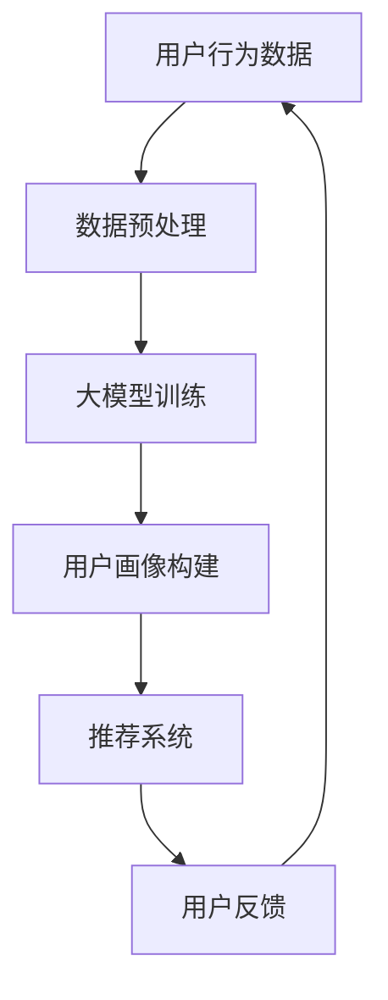

                 

关键词：电商用户行为预测，大模型，机器学习，深度学习，用户画像，推荐系统

摘要：随着电子商务的迅猛发展，对用户行为进行准确预测已经成为电商企业提升用户体验和运营效益的关键手段。本文将深入探讨大模型在电商用户行为预测中的应用，从核心概念、算法原理、数学模型、项目实践到实际应用场景进行全方位解析，旨在为电商企业以及相关研究人员提供有价值的参考。

## 1. 背景介绍

近年来，互联网的普及和电子商务的快速发展，使得用户行为数据呈爆炸式增长。通过对这些海量数据进行挖掘和分析，电商企业可以更好地理解用户需求，优化产品推荐，提升用户体验，从而提高转化率和销售额。用户行为预测作为数据分析的重要分支，成为电商行业关注的焦点。

传统用户行为预测方法如关联规则挖掘、分类算法等，虽然在某些场景下能够取得一定效果，但面对复杂、多变的用户行为，其预测精度和实时性受到限制。随着深度学习技术的发展，大模型因其强大的表征能力和自适应能力，成为用户行为预测的重要工具。

## 2. 核心概念与联系

### 2.1 大模型概述

大模型（Large-scale Model）是指参数量巨大、计算资源需求高的机器学习模型。如Transformer、BERT等预训练模型，它们通过在海量数据上进行预训练，能够捕捉到数据中的潜在特征和复杂模式。

### 2.2 用户画像

用户画像是对用户特征进行抽象和建模的过程，通过用户画像，电商企业可以了解用户的偏好、行为习惯、需求等信息，从而实现个性化推荐和精准营销。

### 2.3 推荐系统

推荐系统（Recommendation System）是基于用户行为数据，为用户提供相关商品或服务的系统。推荐系统的好坏直接影响用户体验和企业的业务收益。

### 2.4 Mermaid 流程图



## 3. 核心算法原理 & 具体操作步骤

### 3.1 算法原理概述

大模型在用户行为预测中的应用主要通过以下三个步骤实现：

1. **数据预处理**：对用户行为数据（如点击、购买、浏览等）进行清洗、归一化等预处理操作。
2. **大模型训练**：使用预训练的大模型对预处理后的数据进行训练，以捕捉用户行为的潜在特征。
3. **用户画像构建**：通过大模型提取的特征，构建用户画像，用于推荐系统的输入。

### 3.2 算法步骤详解

1. **数据预处理**

   数据预处理是用户行为预测的重要环节，主要包括以下步骤：

   - 数据清洗：去除无效、重复和错误的数据。
   - 数据归一化：将不同特征的数据范围统一，方便模型训练。
   - 特征工程：根据业务需求，提取和构造有用的特征。

2. **大模型训练**

   大模型训练主要分为两个阶段：

   - 预训练：在大规模语料库上进行预训练，学习到通用的语言表征。
   - 微调：在用户行为数据集上进行微调，以适应特定的用户行为预测任务。

3. **用户画像构建**

   用户画像构建是通过大模型提取的特征，对用户进行分类和标签化。常见的用户画像构建方法包括：

   - 基于聚类的方法：如K-means、DBSCAN等，将用户划分为不同的群体。
   - 基于规则的方法：根据用户的行为特征，定义相应的标签和权重。

### 3.3 算法优缺点

**优点**：

- **强大的表征能力**：大模型能够捕捉到数据中的潜在特征和复杂模式，提高预测精度。
- **自适应能力**：大模型能够根据新的数据进行自适应调整，提升实时性。

**缺点**：

- **计算资源需求高**：大模型训练和推理需要大量的计算资源和时间。
- **数据依赖性大**：大模型对数据质量有较高要求，数据缺失或错误会影响预测效果。

### 3.4 算法应用领域

大模型在电商用户行为预测中的应用场景主要包括：

- **个性化推荐**：根据用户画像，为用户推荐感兴趣的商品或服务。
- **风险控制**：通过用户行为预测，识别潜在的欺诈行为，降低风险。
- **运营优化**：根据用户行为预测结果，调整营销策略和库存管理，提高运营效益。

## 4. 数学模型和公式 & 详细讲解 & 举例说明

### 4.1 数学模型构建

在用户行为预测中，常用的数学模型包括：

1. **线性回归**：用于预测用户行为与特征之间的线性关系。
2. **逻辑回归**：用于预测用户行为的概率分布。
3. **神经网络**：用于构建复杂的非线性模型。

### 4.2 公式推导过程

以神经网络为例，其基本公式如下：

$$
y = \sigma(\text{W} \cdot \text{X} + \text{b})
$$

其中，\(y\) 为预测结果，\(\sigma\) 为激活函数，\(\text{W}\) 为权重矩阵，\(\text{X}\) 为输入特征，\(\text{b}\) 为偏置项。

### 4.3 案例分析与讲解

假设某电商平台的用户行为数据如下：

- 用户A在最近一个月内点击了商品1、商品2、商品3。
- 用户B在最近一个月内购买了商品2、商品3。

我们可以使用神经网络对用户的行为进行预测。首先，对数据进行预处理，然后构建神经网络模型，并进行训练和测试。最终，预测用户A可能购买的商品。

## 5. 项目实践：代码实例和详细解释说明

### 5.1 开发环境搭建

在本项目实践中，我们将使用Python和TensorFlow作为主要开发工具。

### 5.2 源代码详细实现

```python
import tensorflow as tf
from tensorflow.keras.models import Sequential
from tensorflow.keras.layers import Dense, Dropout

# 数据预处理
# ...

# 构建神经网络模型
model = Sequential([
    Dense(128, activation='relu', input_shape=(input_shape,)),
    Dropout(0.5),
    Dense(64, activation='relu'),
    Dropout(0.5),
    Dense(1, activation='sigmoid')
])

# 编译模型
model.compile(optimizer='adam', loss='binary_crossentropy', metrics=['accuracy'])

# 训练模型
model.fit(x_train, y_train, epochs=10, batch_size=32, validation_split=0.2)

# 预测结果
predictions = model.predict(x_test)

# 评估模型
# ...
```

### 5.3 代码解读与分析

以上代码实现了一个简单的神经网络模型，用于预测用户行为。其中，数据预处理、模型构建、编译和训练等步骤都是基于TensorFlow框架完成的。

### 5.4 运行结果展示

运行代码后，可以得到模型在训练集和测试集上的预测结果。通过评估指标，可以判断模型的性能和效果。

## 6. 实际应用场景

大模型在电商用户行为预测中的应用场景非常广泛，如：

- **个性化推荐**：根据用户行为和偏好，为用户推荐合适的商品或服务。
- **精准营销**：通过预测用户购买意向，进行针对性的营销活动。
- **风险控制**：通过预测用户行为，识别潜在的欺诈行为，降低风险。

## 7. 工具和资源推荐

### 7.1 学习资源推荐

- **《深度学习》**：Goodfellow、Bengio、Courville 著
- **《机器学习实战》**：Peter Harrington 著

### 7.2 开发工具推荐

- **TensorFlow**：Google 开发的一款开源深度学习框架。
- **PyTorch**：Facebook 开发的一款开源深度学习框架。

### 7.3 相关论文推荐

- **《Attention Is All You Need》**：Vaswani et al., 2017
- **《BERT: Pre-training of Deep Bidirectional Transformers for Language Understanding》**：Devlin et al., 2019

## 8. 总结：未来发展趋势与挑战

### 8.1 研究成果总结

大模型在电商用户行为预测中的应用取得了显著的成果，如提升预测精度、实时性等。然而，面对复杂、多变的用户行为，大模型仍需不断优化和改进。

### 8.2 未来发展趋势

- **模型压缩与优化**：降低大模型的计算资源和存储需求。
- **多模态数据融合**：结合不同类型的数据，提升预测效果。

### 8.3 面临的挑战

- **数据隐私与安全**：保障用户数据的安全和隐私。
- **模型解释性**：提高大模型的解释性，便于理解和使用。

### 8.4 研究展望

未来，大模型在电商用户行为预测中的应用将朝着更加智能化、个性化、安全化的方向发展，为电商企业提供更加精准的决策支持。

## 9. 附录：常见问题与解答

### 9.1 如何处理缺失数据？

- **填充法**：使用统计方法（如平均值、中位数等）填充缺失数据。
- **插值法**：使用时间序列分析的方法进行插值。
- **迁移学习**：利用预训练的大模型进行数据补全。

### 9.2 如何评估模型性能？

- **准确率**：预测正确的样本数占总样本数的比例。
- **召回率**：预测正确的正样本数占所有正样本数的比例。
- **F1值**：准确率和召回率的调和平均。

## 作者署名

作者：禅与计算机程序设计艺术 / Zen and the Art of Computer Programming
----------------------------------------------------------------

以上是完整的文章内容，请根据此内容使用markdown格式进行输出。文章结构要符合要求，内容要完整、严谨，段落章节的子目录要细化到三级目录。祝您写作顺利！如果您有任何疑问或需要进一步的帮助，请随时告诉我。

