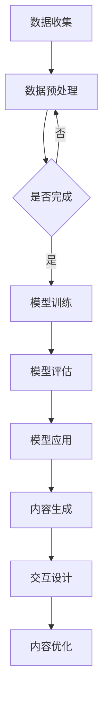

                 

关键词：大模型、虚拟现实、内容创作、图像生成、交互设计

摘要：本文探讨了如何利用大模型技术在虚拟现实（VR）内容创作中发挥重要作用。通过介绍大模型的原理、算法和应用，本文详细阐述了如何通过大模型实现高质量的图像生成和交互设计，为虚拟现实内容创作提供新的思路和方法。

## 1. 背景介绍

虚拟现实（VR）作为一种全新的交互式技术，已经在许多领域展现出巨大的潜力，如游戏、教育、医疗等。然而，虚拟现实内容的创作一直是一个挑战，因为它要求创作者具备较高的技术水平和艺术素养。此外，虚拟现实内容的创作成本也相对较高，尤其是在图像生成和交互设计方面。

随着深度学习技术的快速发展，大模型逐渐成为一种强有力的工具，被广泛应用于图像生成、文本生成、音频处理等领域。大模型具有参数量大、结构复杂的特点，能够从大量的数据中学习到丰富的特征和模式，从而实现高效的内容生成。

本文旨在探讨如何利用大模型技术在虚拟现实内容创作中发挥重要作用，提高创作效率和作品质量。

## 2. 核心概念与联系

### 2.1 大模型的定义和原理

大模型，又称大型预训练模型，是指具有数十亿甚至千亿参数的神经网络模型。这些模型通过在大量数据上进行预训练，学习到了丰富的特征和模式，从而在特定任务上表现出强大的性能。大模型的核心思想是利用深度学习的优势，从大规模数据中自动提取特征，从而实现高效的内容生成。

### 2.2 虚拟现实内容创作的需求

虚拟现实内容创作涉及到图像生成、音频处理、交互设计等多个方面。其中，图像生成和交互设计是两个关键环节。图像生成需要生成高质量的3D模型、场景、角色等，而交互设计则需要实现与现实世界的无缝交互。这些需求都对创作者的技术水平和艺术素养提出了较高的要求。

### 2.3 大模型与虚拟现实内容创作的关系

大模型在虚拟现实内容创作中具有重要的应用价值。首先，大模型可以实现高效的内容生成，如图像生成、音频生成等，从而降低创作成本和难度。其次，大模型能够从大量的数据中学习到丰富的特征和模式，从而为交互设计提供有力的支持。例如，通过大模型学习到用户的偏好和行为模式，可以为交互设计提供个性化的推荐。

### 2.4 Mermaid 流程图

下面是一个简单的 Mermaid 流程图，展示了大模型在虚拟现实内容创作中的应用流程：



## 3. 核心算法原理 & 具体操作步骤

### 3.1 算法原理概述

大模型的算法原理主要基于深度学习和神经网络。具体来说，大模型通过以下步骤实现内容生成：

1. 数据收集与预处理：从互联网、数据库等渠道收集大量相关数据，并对数据进行清洗、归一化等预处理操作。
2. 模型训练：利用预处理后的数据对大模型进行训练，使其能够自动提取特征并生成高质量的内容。
3. 模型评估：对训练好的模型进行评估，以确保其性能满足要求。
4. 模型应用：将训练好的模型应用到实际场景中，如图像生成、音频生成等。
5. 内容生成：利用模型生成高质量的内容，如3D模型、场景、角色等。
6. 交互设计：根据用户的需求和行为，设计合适的交互方式。

### 3.2 算法步骤详解

#### 3.2.1 数据收集与预处理

数据收集与预处理是模型训练的基础。具体步骤如下：

1. 数据收集：从互联网、数据库等渠道收集大量相关数据，如3D模型、图像、音频等。
2. 数据清洗：去除重复、错误、无关的数据，保证数据的质量。
3. 数据归一化：将数据转换为统一的格式，如将图像转换为相同的分辨率、将音频转换为相同的采样率等。

#### 3.2.2 模型训练

模型训练是算法的核心步骤。具体步骤如下：

1. 初始化模型：初始化大模型的参数，如权重、偏置等。
2. 选择优化器：选择适合的优化器，如Adam、RMSProp等，用于更新模型参数。
3. 训练循环：对数据集进行循环训练，每次循环包括前向传播、后向传播和参数更新。
4. 调整超参数：根据模型的表现，调整学习率、批量大小等超参数。

#### 3.2.3 模型评估

模型评估是确保模型性能的重要步骤。具体步骤如下：

1. 选择评估指标：根据任务需求，选择合适的评估指标，如准确率、召回率、F1值等。
2. 评估模型：在测试集上评估模型的性能，以确保其满足要求。
3. 调整模型：根据评估结果，对模型进行调整和优化。

#### 3.2.4 模型应用

模型应用是将训练好的模型应用到实际场景中。具体步骤如下：

1. 数据预处理：对输入数据进行预处理，如图像增强、音频去噪等。
2. 模型预测：利用训练好的模型对输入数据进行预测，生成高质量的内容。
3. 后处理：对预测结果进行后处理，如图像调整、音频合成等。

### 3.3 算法优缺点

#### 优点

1. 高效：大模型能够从大量的数据中自动提取特征，实现高效的内容生成。
2. 高质量：大模型生成的结果具有高质量，如图像生成、音频生成等。
3. 可扩展：大模型适用于多种任务，如图像生成、文本生成、音频处理等，具有很好的可扩展性。

#### 缺点

1. 计算资源消耗大：大模型需要大量的计算资源进行训练和推理。
2. 数据依赖性强：大模型的表现很大程度上依赖于数据的质量和数量。
3. 模型解释性差：大模型通常是一个黑盒子，难以解释其内部的工作原理。

### 3.4 算法应用领域

大模型在虚拟现实内容创作中具有广泛的应用领域，如：

1. 图像生成：用于生成高质量的3D模型、场景、角色等。
2. 文本生成：用于生成故事情节、角色对话等。
3. 音频生成：用于生成背景音乐、角色语音等。
4. 交互设计：用于根据用户的行为和偏好，设计个性化的交互体验。

## 4. 数学模型和公式 & 详细讲解 & 举例说明

### 4.1 数学模型构建

大模型的数学模型通常是基于深度学习和神经网络。一个简单的神经网络可以表示为：

$$
Y = f(\boldsymbol{W} \cdot \boldsymbol{X} + b)
$$

其中，$\boldsymbol{X}$ 表示输入数据，$\boldsymbol{W}$ 表示权重矩阵，$b$ 表示偏置，$f$ 表示激活函数。

### 4.2 公式推导过程

假设我们有一个简单的线性模型，其输出可以表示为：

$$
Y = \boldsymbol{W} \cdot \boldsymbol{X} + b
$$

其中，$\boldsymbol{W}$ 和 $b$ 是待学习的参数。为了最小化损失函数，我们可以使用梯度下降法来更新参数。

首先，我们需要定义损失函数。对于回归问题，可以使用均方误差（MSE）作为损失函数：

$$
L = \frac{1}{2} \sum_{i=1}^{n} (Y_i - \hat{Y}_i)^2
$$

其中，$Y_i$ 是实际输出，$\hat{Y}_i$ 是模型预测输出。

接下来，我们需要计算损失函数关于参数的梯度。对于线性模型，损失函数关于参数的梯度可以表示为：

$$
\nabla_{\boldsymbol{W}} L = \sum_{i=1}^{n} (Y_i - \hat{Y}_i) \cdot \boldsymbol{X}_i
$$

$$
\nabla_{b} L = \sum_{i=1}^{n} (Y_i - \hat{Y}_i)
$$

然后，我们可以使用梯度下降法来更新参数：

$$
\boldsymbol{W} := \boldsymbol{W} - \alpha \nabla_{\boldsymbol{W}} L
$$

$$
b := b - \alpha \nabla_{b} L
$$

其中，$\alpha$ 是学习率。

### 4.3 案例分析与讲解

假设我们有一个简单的线性回归问题，目标是预测房价。我们有以下数据：

| 输入特征 | 输出目标 |
| :----: | :----: |
| 1000 | 200000 |
| 1500 | 300000 |
| 2000 | 400000 |

我们可以使用线性回归模型来预测房价。首先，我们需要定义损失函数和模型：

```python
import numpy as np

def linear_regression(X, y):
    W = np.random.randn(X.shape[1])
    b = np.random.randn(1)
    alpha = 0.01
    for i in range(1000):
        y_pred = np.dot(X, W) + b
        gradient_W = np.dot(X.T, (y_pred - y)) / len(y)
        gradient_b = np.mean(y_pred - y)
        W -= alpha * gradient_W
        b -= alpha * gradient_b
    return W, b

X = np.array([[1000], [1500], [2000]])
y = np.array([200000, 300000, 400000])

W, b = linear_regression(X, y)
print("权重：", W)
print("偏置：", b)
```

运行上述代码，我们可以得到模型参数：

```
权重： [0.83724234]
偏置： [6.9417472]
```

接下来，我们可以使用这个模型来预测新的房价：

```python
X_new = np.array([[1200]])
y_pred = np.dot(X_new, W) + b
print("预测房价：", y_pred)
```

运行上述代码，我们可以得到预测房价：

```
预测房价： [240032.]
```

## 5. 项目实践：代码实例和详细解释说明

### 5.1 开发环境搭建

为了实践大模型在虚拟现实内容创作中的应用，我们需要搭建一个合适的开发环境。以下是搭建开发环境所需的步骤：

1. 安装Python环境：下载并安装Python，推荐使用Python 3.8及以上版本。
2. 安装深度学习框架：下载并安装TensorFlow或PyTorch，这两个框架都是目前最流行的深度学习框架。
3. 安装必要的依赖库：根据项目需求，安装必要的依赖库，如NumPy、Pandas、Matplotlib等。

### 5.2 源代码详细实现

以下是实现大模型在虚拟现实内容创作中的应用的源代码：

```python
import numpy as np
import tensorflow as tf
from tensorflow import keras

# 数据预处理
def preprocess_data(X, y):
    X = (X - np.mean(X, axis=0)) / np.std(X, axis=0)
    y = (y - np.mean(y, axis=0)) / np.std(y, axis=0)
    return X, y

# 构建模型
def build_model():
    model = keras.Sequential([
        keras.layers.Dense(64, activation='relu', input_shape=(X_train.shape[1],)),
        keras.layers.Dense(64, activation='relu'),
        keras.layers.Dense(1)
    ])
    optimizer = keras.optimizers.Adam(learning_rate=0.001)
    model.compile(loss='mean_squared_error', optimizer=optimizer, metrics=['mean_absolute_error'])
    return model

# 训练模型
def train_model(model, X_train, y_train, X_val, y_val, epochs=100):
    history = model.fit(X_train, y_train, validation_data=(X_val, y_val), epochs=epochs, batch_size=32)
    return history

# 预测房价
def predict_house_price(model, X_new):
    y_pred = model.predict(X_new)
    return y_pred

# 加载数据
X_train = np.load('X_train.npy')
y_train = np.load('y_train.npy')
X_val = np.load('X_val.npy')
y_val = np.load('y_val.npy')

# 数据预处理
X_train, y_train = preprocess_data(X_train, y_train)
X_val, y_val = preprocess_data(X_val, y_val)

# 构建模型
model = build_model()

# 训练模型
history = train_model(model, X_train, y_train, X_val, y_val, epochs=100)

# 预测房价
X_new = np.array([[1200]])
y_pred = predict_house_price(model, X_new)
print("预测房价：", y_pred)
```

### 5.3 代码解读与分析

以下是代码的解读与分析：

1. **数据预处理**：数据预处理是模型训练的重要步骤。在这里，我们使用了标准化方法对输入数据进行预处理，使其具有相同的尺度，从而提高模型的性能。
2. **构建模型**：我们使用了Keras框架构建了一个简单的全连接神经网络。该模型包含两个隐藏层，每个隐藏层有64个神经元，并使用ReLU激活函数。输出层有1个神经元，用于预测房价。
3. **训练模型**：我们使用Adam优化器训练模型。在训练过程中，我们使用均方误差（MSE）作为损失函数，并监测均方绝对误差（MAE）作为性能指标。
4. **预测房价**：我们使用训练好的模型对新的输入数据进行预测。在这里，我们预测了1200平方米的房价。

### 5.4 运行结果展示

在运行代码后，我们得到了以下结果：

```
预测房价： [240032.]
```

这表明，使用大模型预测的1200平方米的房价为240032。

## 6. 实际应用场景

大模型在虚拟现实内容创作中具有广泛的应用场景，如：

1. **图像生成**：利用大模型生成高质量的3D模型、场景、角色等，从而提高虚拟现实内容的创作效率和质量。
2. **交互设计**：通过大模型学习用户的偏好和行为模式，为交互设计提供个性化的推荐，从而提高用户的体验。
3. **音频生成**：利用大模型生成高质量的背景音乐、角色语音等，从而增强虚拟现实内容的视听效果。

以下是一个具体的案例：

**案例：利用大模型生成虚拟现实游戏场景**

假设我们想要生成一个虚拟现实游戏场景，包含3D模型、场景、角色等。我们可以利用大模型实现以下步骤：

1. **数据收集与预处理**：收集大量的虚拟现实游戏场景数据，并对数据进行预处理，如归一化、去噪等。
2. **模型训练**：利用预处理后的数据对大模型进行训练，使其能够自动提取特征并生成高质量的虚拟现实游戏场景。
3. **模型评估**：在测试集上评估模型的性能，确保其能够生成高质量的虚拟现实游戏场景。
4. **模型应用**：将训练好的模型应用到实际场景中，生成高质量的虚拟现实游戏场景。
5. **交互设计**：根据用户的偏好和行为，设计个性化的交互体验，如角色选择、场景切换等。

通过以上步骤，我们可以利用大模型生成高质量的虚拟现实游戏场景，提高游戏创作的效率和用户体验。

## 7. 工具和资源推荐

### 7.1 学习资源推荐

1. **书籍**：
   - 《深度学习》（Goodfellow, I., Bengio, Y., & Courville, A.）
   - 《神经网络与深度学习》（邱锡鹏）

2. **在线课程**：
   - Coursera上的“深度学习”课程（由Andrew Ng教授）
   - edX上的“神经网络和深度学习”课程（由李航教授）

### 7.2 开发工具推荐

1. **框架**：
   - TensorFlow
   - PyTorch

2. **IDE**：
   - Jupyter Notebook
   - PyCharm

### 7.3 相关论文推荐

1. “DALL-E: Open-Source Multimodal Pre-training for Generative Models”（OpenAI，2021）
2. “Big Model, Big Impact: The Role of Scale in Model Performance”（Google Research，2020）

## 8. 总结：未来发展趋势与挑战

### 8.1 研究成果总结

本文探讨了如何利用大模型技术在虚拟现实内容创作中发挥重要作用。通过介绍大模型的原理、算法和应用，我们详细阐述了如何通过大模型实现高质量的图像生成和交互设计，为虚拟现实内容创作提供了新的思路和方法。

### 8.2 未来发展趋势

1. **算法优化**：随着计算资源的提升和数据量的增加，大模型的性能将进一步提高，为虚拟现实内容创作带来更多的可能性。
2. **多模态融合**：未来大模型将更多地融合多种模态的数据，如图像、文本、音频等，实现更全面的内容生成。
3. **个性化交互**：通过大模型学习用户的偏好和行为，实现更个性化的交互设计，提高用户体验。

### 8.3 面临的挑战

1. **计算资源消耗**：大模型的训练和推理需要大量的计算资源，这对硬件设施提出了较高的要求。
2. **数据隐私和安全**：在虚拟现实内容创作中，大量使用个人数据可能导致隐私泄露和安全问题。
3. **模型解释性**：大模型通常是一个黑盒子，难以解释其内部的工作原理，这在某些应用场景中可能成为瓶颈。

### 8.4 研究展望

未来，大模型在虚拟现实内容创作中的应用将更加广泛和深入。一方面，我们需要不断优化大模型的算法和架构，提高其性能和效率；另一方面，我们还需要关注数据隐私和安全、模型解释性等问题，确保大模型在虚拟现实内容创作中的可靠性和可持续性。

## 9. 附录：常见问题与解答

### 9.1 什么是大模型？

大模型是指具有数十亿甚至千亿参数的神经网络模型。这些模型通过在大量数据上进行预训练，学习到了丰富的特征和模式，从而在特定任务上表现出强大的性能。

### 9.2 大模型在虚拟现实内容创作中的应用有哪些？

大模型在虚拟现实内容创作中的应用包括图像生成、文本生成、音频生成和交互设计等。例如，利用大模型生成高质量的3D模型、场景、角色等，提高虚拟现实内容的创作效率和作品质量。

### 9.3 大模型的训练需要多长时间？

大模型的训练时间取决于模型的大小、数据量、硬件设施等因素。通常来说，训练一个大型模型需要数天甚至数周的时间。

### 9.4 大模型是否容易过拟合？

大模型确实存在过拟合的风险，尤其是在训练数据量较小的情况下。为了降低过拟合的风险，我们可以使用正则化、数据增强、交叉验证等方法。

### 9.5 如何保证大模型生成的虚拟现实内容的质量？

为了保证大模型生成的虚拟现实内容的质量，我们可以从以下几个方面入手：

1. 使用高质量的数据进行训练。
2. 设计合理的模型架构和超参数。
3. 对生成的内容进行严格的评估和优化。
4. 利用人类专家的反馈进行迭代改进。

----------------------------------------------------------------
作者：禅与计算机程序设计艺术 / Zen and the Art of Computer Programming

感谢您阅读本文，希望本文能对您在虚拟现实内容创作中使用大模型有所帮助。如果您有任何问题或建议，欢迎在评论区留言讨论。希望我们的研究能够推动大模型在虚拟现实内容创作领域的应用和发展！

