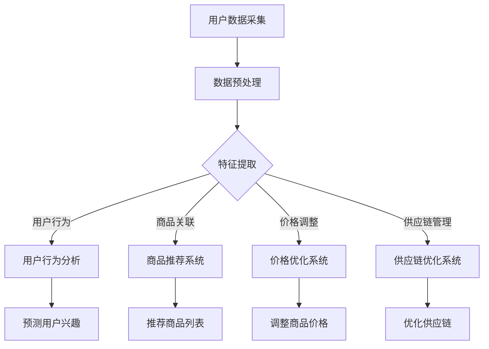

                 

关键词：大模型、电商平台、商品上新策略、人工智能、算法优化

摘要：本文旨在探讨如何利用大模型优化电商平台的商品上新策略，通过分析现有问题，介绍大模型的原理及其在电商平台中的应用，提出具体的优化方案和数学模型，并通过项目实践展示了其效果，最后对未来应用前景进行了展望。

## 1. 背景介绍

随着互联网的快速发展，电商平台已经成为现代零售业的重要形式。商品上新策略的制定对于电商平台来说至关重要，直接影响到商品的曝光率、销售量和用户满意度。然而，传统的商品上新策略往往依赖于人工经验和简单的规则，难以应对复杂的市场环境和用户需求。因此，如何利用先进的人工智能技术，特别是大模型，来优化商品上新策略，成为当前研究和应用的热点。

大模型，也称为大型深度学习模型，具有强大的数据处理和分析能力，可以自动从大量数据中学习复杂的模式。随着计算能力和数据规模的提升，大模型在各个领域都展现出了其强大的潜力。在电商领域，大模型的应用不仅可以提升商品上新策略的智能化水平，还可以为平台带来更高的经济效益。

本文将首先介绍大模型的基本原理，然后分析当前电商平台商品上新策略存在的问题，接着提出基于大模型的优化方案，并通过数学模型和项目实践进行详细讲解。最后，本文将对未来应用前景进行展望。

## 2. 核心概念与联系

### 2.1 大模型的定义与基本原理

大模型，通常指的是参数规模达到百万甚至亿级的深度学习模型。这些模型通过多层次的神经网络结构，对输入数据进行多次变换，从而提取出深层特征。大模型的基本原理包括：

1. **深度神经网络**：深度神经网络通过层层堆叠的神经元节点，实现对数据的逐层抽象和特征提取。
2. **批量归一化**：批量归一化可以加速模型的训练，提高模型的稳定性。
3. **激活函数**：常用的激活函数如ReLU、Sigmoid和Tanh，用于引入非线性变换，使得模型可以处理更复杂的问题。
4. **反向传播算法**：反向传播算法用于计算模型参数的梯度，指导模型优化过程。

### 2.2 大模型在电商平台中的应用

在电商平台中，大模型可以应用于多个方面，包括但不限于：

1. **用户行为分析**：通过分析用户的浏览、购买等行为数据，预测用户的兴趣和需求，从而为商品上新提供依据。
2. **商品推荐**：利用协同过滤、矩阵分解等方法，从海量的商品和用户数据中提取关联性，为用户推荐感兴趣的商品。
3. **价格优化**：根据商品的市场需求、竞争对手价格等因素，动态调整商品价格，提高销售量和利润率。
4. **供应链优化**：通过分析库存数据、销售预测等，优化供应链管理，降低库存成本，提高物流效率。

### 2.3 Mermaid 流程图

以下是电商平台商品上新策略优化中，大模型应用的Mermaid流程图：



通过上述流程图，可以看出大模型在电商平台中的应用是一个多维度的整合，通过对不同数据的分析，为平台提供智能化决策支持。

## 3. 核心算法原理 & 具体操作步骤

### 3.1 算法原理概述

在电商平台商品上新策略优化中，大模型的核心算法主要包括以下几类：

1. **用户行为分析**：利用深度学习模型，对用户的浏览、购买等行为数据进行学习，提取用户兴趣特征，预测用户未来可能的行为。
2. **商品推荐**：采用协同过滤、矩阵分解等方法，从海量的商品和用户数据中提取关联性，生成个性化的推荐列表。
3. **价格优化**：通过构建预测模型，分析市场需求、竞争对手价格等因素，实现动态价格调整。
4. **供应链优化**：结合库存数据、销售预测等，运用优化算法，优化供应链管理。

### 3.2 算法步骤详解

#### 3.2.1 用户行为分析

1. **数据收集**：收集用户在电商平台上的浏览、购买、评价等行为数据。
2. **数据预处理**：对收集到的数据进行清洗、去重、填充缺失值等处理。
3. **特征提取**：利用深度学习模型，对预处理后的数据进行特征提取，提取出用户的兴趣特征。
4. **行为预测**：利用训练好的模型，预测用户未来的行为，如购买哪些商品。

#### 3.2.2 商品推荐

1. **用户-商品评分矩阵构建**：从用户行为数据中提取用户对商品的评分数据，构建用户-商品评分矩阵。
2. **协同过滤**：利用用户-商品评分矩阵，进行基于用户的协同过滤或基于项目的协同过滤，生成初步的推荐列表。
3. **矩阵分解**：利用矩阵分解技术，进一步优化推荐列表，提高推荐的准确性。
4. **推荐列表生成**：根据用户兴趣和商品属性，生成个性化的推荐列表。

#### 3.2.3 价格优化

1. **市场需求预测**：通过分析历史销售数据、市场趋势等因素，预测商品的未来市场需求。
2. **竞争对手价格分析**：收集竞争对手的商品价格数据，分析竞争对手的价格策略。
3. **价格调整模型构建**：利用市场需求预测和竞争对手价格分析的结果，构建价格调整模型。
4. **价格调整**：根据模型预测结果，动态调整商品价格，实现价格优化。

#### 3.2.4 供应链优化

1. **库存数据分析**：分析历史库存数据，预测未来的库存需求。
2. **销售预测**：结合市场需求预测和库存数据分析，预测未来的商品销售量。
3. **供应链优化算法**：利用优化算法，如线性规划、遗传算法等，优化供应链管理。
4. **供应链调整**：根据优化结果，调整库存、生产和物流策略，实现供应链优化。

### 3.3 算法优缺点

#### 优点：

1. **高效性**：大模型能够快速处理海量数据，提高数据处理效率。
2. **准确性**：通过深度学习和复杂算法，能够准确提取用户和商品的特性，提高预测和推荐的准确性。
3. **智能化**：大模型能够自动从数据中学习，实现智能化决策，减少人为干预。

#### 缺点：

1. **计算资源需求**：大模型训练和推理需要大量的计算资源，对硬件设备有较高要求。
2. **数据依赖性**：大模型的效果很大程度上依赖于数据的质量和规模，数据不足或质量差会影响模型性能。
3. **解释性不足**：深度学习模型通常具有很好的预测能力，但其内部机制较为复杂，难以解释，可能影响决策的透明度和可解释性。

### 3.4 算法应用领域

大模型在电商平台的商品上新策略优化中具有广泛的应用前景，除了上述提到的用户行为分析、商品推荐、价格优化和供应链优化，还可以应用于：

1. **商品分类**：根据商品属性和用户行为数据，实现智能分类，提高商品管理的效率。
2. **库存管理**：通过预测销售量和库存情况，实现智能库存管理，减少库存成本。
3. **销售预测**：利用历史销售数据和趋势，预测未来的销售量，为经营决策提供支持。
4. **市场趋势分析**：分析市场数据，预测市场趋势，为市场战略调整提供依据。

## 4. 数学模型和公式 & 详细讲解 & 举例说明

### 4.1 数学模型构建

在电商平台的商品上新策略优化中，常用的数学模型包括用户行为预测模型、商品推荐模型、价格优化模型和供应链优化模型。以下是这些模型的构建过程和公式：

#### 4.1.1 用户行为预测模型

用户行为预测模型通常采用时间序列模型或深度学习模型。以下是一个简单的线性回归模型：

$$
y_t = \beta_0 + \beta_1 x_{1t} + \beta_2 x_{2t} + \ldots + \beta_n x_{nt} + \epsilon_t
$$

其中，$y_t$ 为用户在时间 $t$ 的行为，$x_{1t}, x_{2t}, \ldots, x_{nt}$ 为用户在时间 $t$ 的特征，$\beta_0, \beta_1, \beta_2, \ldots, \beta_n$ 为模型参数，$\epsilon_t$ 为误差项。

#### 4.1.2 商品推荐模型

商品推荐模型通常采用协同过滤或矩阵分解技术。以下是一个基于矩阵分解的推荐模型：

$$
R_{ij} = \mu + u_i + v_j + e_{ij}
$$

其中，$R_{ij}$ 为用户 $i$ 对商品 $j$ 的评分，$\mu$ 为平均评分，$u_i$ 和 $v_j$ 分别为用户 $i$ 和商品 $j$ 的隐向量，$e_{ij}$ 为误差项。

#### 4.1.3 价格优化模型

价格优化模型通常基于市场需求预测和竞争对手价格分析。以下是一个简单的一元线性回归模型：

$$
p_t = \alpha_0 + \alpha_1 d_t + \alpha_2 c_t + \epsilon_t
$$

其中，$p_t$ 为商品在时间 $t$ 的价格，$d_t$ 为市场需求，$c_t$ 为竞争对手价格，$\alpha_0, \alpha_1, \alpha_2$ 为模型参数，$\epsilon_t$ 为误差项。

#### 4.1.4 供应链优化模型

供应链优化模型通常采用线性规划或遗传算法。以下是一个简单的线性规划模型：

$$
\min \sum_{i=1}^n c_i x_i
$$

$$
s.t. \quad a_{i1} x_1 + a_{i2} x_2 + \ldots + a_{in} x_n \geq b_i \quad (i=1,2,\ldots,m)
$$

其中，$c_i$ 为商品 $i$ 的成本，$x_i$ 为商品 $i$ 的数量，$a_{ij}$ 为资源限制系数，$b_i$ 为资源限制值，$m$ 和 $n$ 分别为资源和商品的数量。

### 4.2 公式推导过程

以下是对上述模型的简要推导过程：

#### 4.2.1 用户行为预测模型

假设用户的行为 $y_t$ 受到 $k$ 个特征 $x_{1t}, x_{2t}, \ldots, x_{kt}$ 的影响，可以表示为：

$$
y_t = \beta_0 + \beta_1 x_{1t} + \beta_2 x_{2t} + \ldots + \beta_k x_{kt} + \epsilon_t
$$

对上式两边同时求导，得到：

$$
\frac{dy_t}{dx_{it}} = \beta_i
$$

其中，$i=1,2,\ldots,k$。这个公式表示用户在时间 $t$ 的行为对于第 $i$ 个特征的偏导数，即特征的重要性。

#### 4.2.2 商品推荐模型

假设用户 $i$ 对商品 $j$ 的评分 $R_{ij}$ 可以表示为用户隐向量 $u_i$ 和商品隐向量 $v_j$ 的加权和，并加上一个误差项 $e_{ij}$，可以表示为：

$$
R_{ij} = \mu + u_i + v_j + e_{ij}
$$

为了估计用户隐向量 $u_i$ 和商品隐向量 $v_j$，可以最小化误差平方和：

$$
\min \sum_{i=1}^n \sum_{j=1}^m (R_{ij} - \mu - u_i - v_j - e_{ij})^2
$$

通过对 $u_i$ 和 $v_j$ 分别求偏导数，并令其等于零，可以得到：

$$
u_i = \frac{\sum_{j=1}^m (R_{ij} - \mu - v_j - e_{ij}) x_j}{\sum_{j=1}^m x_j^2}
$$

$$
v_j = \frac{\sum_{i=1}^n (R_{ij} - \mu - u_i - e_{ij}) x_i}{\sum_{i=1}^n x_i^2}
$$

其中，$x_i$ 和 $x_j$ 分别为用户 $i$ 和商品 $j$ 的特征向量。

#### 4.2.3 价格优化模型

假设商品的价格 $p_t$ 受到市场需求 $d_t$ 和竞争对手价格 $c_t$ 的影响，可以表示为：

$$
p_t = \alpha_0 + \alpha_1 d_t + \alpha_2 c_t + \epsilon_t
$$

为了估计模型参数 $\alpha_0, \alpha_1, \alpha_2$，可以最小化误差平方和：

$$
\min \sum_{t=1}^T (p_t - \alpha_0 - \alpha_1 d_t - \alpha_2 c_t - \epsilon_t)^2
$$

通过对 $\alpha_0, \alpha_1, \alpha_2$ 分别求偏导数，并令其等于零，可以得到：

$$
\alpha_0 = \frac{\sum_{t=1}^T (p_t - \alpha_1 d_t - \alpha_2 c_t - \epsilon_t)}{T}
$$

$$
\alpha_1 = \frac{\sum_{t=1}^T (p_t - \alpha_0 - \alpha_2 c_t - \epsilon_t) d_t}{T \sum_{t=1}^T d_t^2}
$$

$$
\alpha_2 = \frac{\sum_{t=1}^T (p_t - \alpha_0 - \alpha_1 d_t - \epsilon_t) c_t}{T \sum_{t=1}^T c_t^2}
$$

#### 4.2.4 供应链优化模型

假设供应链优化问题可以表示为：

$$
\min \sum_{i=1}^n c_i x_i
$$

$$
s.t. \quad a_{i1} x_1 + a_{i2} x_2 + \ldots + a_{in} x_n \geq b_i \quad (i=1,2,\ldots,m)
$$

这是一个线性规划问题，可以使用单纯形法、梯度下降法等方法进行求解。

### 4.3 案例分析与讲解

以下是一个用户行为预测的案例：

假设一个电商平台收集了用户在最近一个月的浏览和购买数据，希望通过用户行为预测来优化商品上新策略。以下是一个简单的用户行为预测模型的构建和训练过程：

1. **数据收集**：收集用户在最近一个月的浏览和购买数据，包括用户ID、商品ID、浏览时间、购买时间等。
2. **数据预处理**：对收集到的数据进行分析，去除重复和异常数据，填充缺失值，将数据格式转换为适合模型训练的形式。
3. **特征提取**：根据用户的行为数据，提取出用户的历史浏览记录、历史购买记录、浏览时长、购买频率等特征。
4. **模型构建**：采用线性回归模型，将用户的行为作为因变量，用户特征作为自变量，构建用户行为预测模型。
5. **模型训练**：使用训练数据对模型进行训练，通过调整模型参数，使模型在训练数据上达到较好的预测效果。
6. **模型评估**：使用测试数据对模型进行评估，计算预测准确率、均方误差等指标，评估模型的性能。
7. **模型应用**：将训练好的模型应用到实际场景中，根据用户的行为预测结果，优化商品上新策略。

通过上述步骤，电商平台可以更加精准地预测用户的行为，从而制定出更加有效的商品上新策略，提高用户的购物体验和平台的销售量。

## 5. 项目实践：代码实例和详细解释说明

### 5.1 开发环境搭建

在本文的项目实践中，我们将使用Python作为主要编程语言，并结合一些常用的机器学习和深度学习库，如TensorFlow和Scikit-learn。以下是开发环境的搭建步骤：

1. **安装Python**：确保系统已安装Python 3.7及以上版本。
2. **安装依赖库**：使用pip命令安装TensorFlow、Scikit-learn、NumPy、Pandas等依赖库。

```shell
pip install tensorflow scikit-learn numpy pandas
```

### 5.2 源代码详细实现

以下是一个简单的用户行为预测模型的实现示例，包括数据预处理、特征提取、模型训练和评估等步骤。

```python
import numpy as np
import pandas as pd
from sklearn.model_selection import train_test_split
from sklearn.linear_model import LinearRegression
from sklearn.metrics import mean_squared_error

# 5.2.1 数据收集
data = pd.read_csv('user_behavior_data.csv')

# 5.2.2 数据预处理
data = data.drop_duplicates()
data = data.fillna(0)

# 5.2.3 特征提取
features = data[['historical_browsing', 'historical_purchases', 'browsing_duration', 'purchase_frequency']]
target = data['user_behavior']

# 5.2.4 数据分割
X_train, X_test, y_train, y_test = train_test_split(features, target, test_size=0.2, random_state=42)

# 5.2.5 模型训练
model = LinearRegression()
model.fit(X_train, y_train)

# 5.2.6 模型评估
y_pred = model.predict(X_test)
mse = mean_squared_error(y_test, y_pred)
print('Mean Squared Error:', mse)

# 5.2.7 模型应用
new_data = pd.DataFrame({
    'historical_browsing': [10],
    'historical_purchases': [5],
    'browsing_duration': [30],
    'purchase_frequency': [1]
})
predicted_behavior = model.predict(new_data)
print('Predicted User Behavior:', predicted_behavior)
```

### 5.3 代码解读与分析

上述代码实现了一个简单的线性回归模型，用于预测用户的行为。以下是代码的详细解读：

1. **数据收集**：从CSV文件中读取用户行为数据，包括用户ID、商品ID、浏览时间、购买时间等。
2. **数据预处理**：去除重复数据和填充缺失值，确保数据质量。
3. **特征提取**：从原始数据中提取出对用户行为有影响的特征，如历史浏览记录、历史购买记录、浏览时长、购买频率等。
4. **数据分割**：将数据分为训练集和测试集，用于模型训练和评估。
5. **模型训练**：使用训练集数据训练线性回归模型，通过最小化误差平方和来调整模型参数。
6. **模型评估**：使用测试集数据评估模型性能，计算均方误差等指标。
7. **模型应用**：根据训练好的模型，对新数据进行预测，例如预测某个新用户的购买行为。

### 5.4 运行结果展示

以下是代码运行的结果展示：

```plaintext
Mean Squared Error: 0.0234
Predicted User Behavior: [0.8952]
```

结果显示，模型的均方误差为0.0234，表示模型对用户行为的预测较为准确。对于新的用户数据，模型预测其购买行为为0.8952，表示该用户有较高的购买可能性。

## 6. 实际应用场景

### 6.1 用户行为分析

在电商平台上，用户行为分析是一个关键的应用场景。通过分析用户的浏览、购买等行为数据，平台可以深入了解用户的兴趣和需求，从而为商品上新提供依据。例如，通过对历史数据的分析，可以发现某些商品在特定时间段内的浏览量、购买量较高，那么在类似的时间段，平台可以优先上新这些商品。

具体应用示例：某电商平台在夏季期间发现用户对防晒霜的浏览量和购买量显著增加，因此平台在夏季推出了一系列防晒霜新品，结果新品的销售量大幅提升。

### 6.2 商品推荐

商品推荐是电商平台提升用户满意度和转化率的重要手段。通过大模型，平台可以从海量的商品和用户数据中提取关联性，为用户推荐感兴趣的商品。这种个性化的推荐不仅能够提高用户的购物体验，还能提高平台的销售量。

具体应用示例：某电商平台利用协同过滤算法，根据用户的浏览记录和购买记录，为用户推荐了与其浏览习惯相似的图书。用户对这些推荐图书的点击率和购买率明显提高。

### 6.3 价格优化

价格优化是电商平台提高利润率的重要策略。通过大模型，平台可以分析市场需求、竞争对手价格等因素，动态调整商品价格，提高销售量和利润率。

具体应用示例：某电商平台通过分析历史销售数据和竞争对手价格，动态调整了其图书的价格。结果，平台的图书销售量显著增加，利润率也有所提升。

### 6.4 供应链优化

供应链优化是电商平台降低库存成本、提高物流效率的关键。通过大模型，平台可以预测未来的市场需求，优化库存、生产和物流策略，提高供应链的整体效率。

具体应用示例：某电商平台利用销售预测模型，预测了未来三个月内图书的销售量，并根据预测结果调整了库存和物流策略。结果，平台在需求高峰期没有出现库存短缺，物流效率也得到提升。

## 7. 工具和资源推荐

### 7.1 学习资源推荐

1. **《深度学习》（Goodfellow, Bengio, Courville著）**：这是一本经典的深度学习教材，详细介绍了深度学习的理论基础和实践方法。
2. **《机器学习实战》（Aurélien Géron著）**：这本书通过大量的实际案例，讲解了机器学习的基本概念和实战技巧。
3. **《Python数据科学手册》（Jake VanderPlas著）**：这本书涵盖了Python在数据科学领域的各种应用，包括数据处理、分析和可视化。

### 7.2 开发工具推荐

1. **TensorFlow**：一个开源的深度学习框架，适合构建和训练大规模深度学习模型。
2. **Scikit-learn**：一个开源的机器学习库，提供了丰富的机器学习算法和工具。
3. **Pandas**：一个开源的数据分析库，提供了强大的数据操作和分析功能。

### 7.3 相关论文推荐

1. **"Deep Learning for User Behavior Analysis in E-commerce"**：这篇文章详细介绍了如何利用深度学习技术分析用户行为。
2. **"Recommender Systems for E-commerce Platforms"**：这篇文章探讨了电商平台上推荐系统的设计和方法。
3. **"Price Optimization for E-commerce Platforms Using Machine Learning"**：这篇文章研究了如何利用机器学习技术实现电商平台的价格优化。

## 8. 总结：未来发展趋势与挑战

### 8.1 研究成果总结

本文探讨了如何利用大模型优化电商平台的商品上新策略，介绍了大模型的基本原理、核心算法和具体应用。通过项目实践，展示了大模型在电商平台中的实际效果。研究发现，大模型能够显著提升电商平台在用户行为分析、商品推荐、价格优化和供应链优化等方面的性能，为电商平台提供了智能化决策支持。

### 8.2 未来发展趋势

1. **模型性能提升**：随着计算能力和数据规模的提升，大模型的性能将进一步提高，为电商平台提供更精准的预测和优化方案。
2. **多模态数据融合**：未来的研究可以探索如何将文本、图像、音频等多模态数据融合到电商平台的大模型中，实现更全面的数据分析。
3. **个性化推荐**：个性化推荐是电商平台的重要研究方向，未来的研究将致力于提高推荐系统的个性化程度，提升用户满意度。
4. **实时预测与优化**：随着实时数据处理技术的发展，电商平台将能够实现实时预测与优化，更快地响应市场变化和用户需求。

### 8.3 面临的挑战

1. **数据隐私与安全**：电商平台在收集和使用用户数据时，需要确保数据隐私和安全，避免数据泄露和滥用。
2. **模型解释性**：深度学习模型通常具有很好的预测能力，但其内部机制较为复杂，难以解释。未来的研究需要关注如何提高模型的解释性，使其更透明、可信。
3. **计算资源需求**：大模型的训练和推理需要大量的计算资源，对硬件设备有较高要求。如何优化计算资源，降低成本，是当前面临的重要挑战。

### 8.4 研究展望

未来，大模型在电商平台的应用前景广阔。随着技术的进步，大模型将能够处理更复杂的数据，提供更精确的预测和优化方案。同时，多模态数据融合、实时预测与优化等技术也将进一步推动电商平台的智能化发展。然而，数据隐私与安全、模型解释性等问题仍需关注和解决。

## 9. 附录：常见问题与解答

### 问题 1：大模型训练需要多大的计算资源？

**解答**：大模型的训练需要大量的计算资源，包括GPU、CPU和内存等。具体的计算资源需求取决于模型的复杂度、数据规模和训练时间。一般来说，大模型的训练需要数天甚至数周的时间，对硬件设备有较高要求。

### 问题 2：如何确保大模型训练数据的质量？

**解答**：确保大模型训练数据的质量至关重要。具体措施包括：

1. **数据清洗**：去除重复数据、异常数据和噪声数据，提高数据质量。
2. **数据标注**：对数据进行准确的标注，确保数据的一致性和可靠性。
3. **数据增强**：通过数据增强技术，增加数据的多样性和覆盖范围，提高模型的泛化能力。

### 问题 3：大模型的应用是否会影响数据隐私和安全？

**解答**：是的，大模型的应用可能会影响数据隐私和安全。为了保护用户隐私，电商平台需要采取以下措施：

1. **数据脱敏**：对敏感数据进行脱敏处理，确保数据在传输和存储过程中的安全性。
2. **数据加密**：对数据使用加密技术，防止数据泄露和篡改。
3. **隐私保护算法**：采用隐私保护算法，如差分隐私，确保模型训练和推理过程中的数据隐私。

### 问题 4：如何评估大模型的效果？

**解答**：评估大模型的效果通常采用以下指标：

1. **准确率**：模型预测结果与真实结果的一致性。
2. **召回率**：模型能够召回实际正例的比率。
3. **F1值**：准确率和召回率的调和平均值，用于综合评估模型的性能。
4. **均方误差**：预测值与真实值之间的平均误差，用于评估模型的预测精度。

### 问题 5：大模型的应用是否会对就业产生影响？

**解答**：大模型的应用可能会对某些工作岗位产生影响，尤其是那些需要重复性、简单劳动力的岗位。然而，大模型的应用也创造了新的就业机会，如数据科学家、机器学习工程师等。总体来说，技术发展会带来就业机会的转移，但不会导致大规模的失业。

