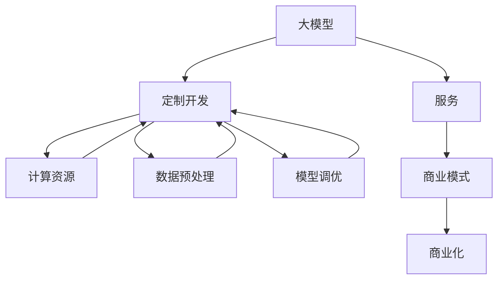

                 

关键词：大模型、定制开发、服务、商业化、技术、算法、数学模型、应用场景、未来展望

> 摘要：本文旨在探讨大模型定制开发服务的商业化路径，从核心概念、算法原理、数学模型、实践案例到应用场景和未来展望，全面解析这一领域的商业潜力和挑战。通过分析市场趋势、技术演进和商业模式，本文为企业和开发者提供了有价值的参考。

## 1. 背景介绍

随着人工智能技术的迅猛发展，大模型（Large Models）逐渐成为行业热点。大模型通常是指拥有数十亿甚至千亿参数的深度学习模型，其具备强大的表示和学习能力，可以处理复杂的任务，如图像识别、自然语言处理、语音识别等。然而，大模型的训练和部署不仅需要高性能的计算资源，还涉及数据清洗、预处理、模型调优等多个环节。

### 1.1 市场需求

随着企业数字化转型加速，越来越多的企业希望通过大模型实现业务智能化。然而，大模型的高门槛使得许多企业望而却步。一方面，企业需要大量的计算资源和技术支持；另一方面，大模型的定制化需求日益凸显，需要根据不同业务场景进行优化和调整。因此，大模型定制开发服务应运而生。

### 1.2 技术挑战

大模型定制开发服务面临以下技术挑战：

- **计算资源需求**：大模型训练需要大量的计算资源和存储空间，对硬件设备有很高的要求。
- **数据质量**：高质量的数据是训练高效大模型的基础，数据清洗、预处理和标注是关键步骤。
- **模型调优**：大模型的调优需要经验丰富的工程师，涉及到参数调整、模型架构选择等复杂过程。
- **安全性**：大模型训练过程中可能涉及到敏感数据，需要确保数据安全和隐私。

## 2. 核心概念与联系

为了更好地理解大模型定制开发服务，我们首先介绍几个核心概念，并使用 Mermaid 流程图展示其关系。



### 2.1 大模型

大模型是指拥有大量参数的深度学习模型，如BERT、GPT等。它们能够处理复杂的任务，但在训练和部署过程中需要大量的计算资源和数据支持。

### 2.2 定制开发

定制开发是指根据不同企业的需求，对大模型进行优化和调整，以适应特定的业务场景。定制开发包括计算资源配置、数据预处理和模型调优等环节。

### 2.3 服务

服务是指为大模型定制开发提供的技术支持，包括计算资源、数据服务、模型调优等。服务的形式可以是SaaS、私有化部署等。

### 2.4 商业模式

商业模式是指大模型定制开发服务的盈利模式，包括定价策略、服务模式、合作伙伴关系等。

## 3. 核心算法原理 & 具体操作步骤

### 3.1 算法原理概述

大模型定制开发的核心算法包括以下几个方面：

- **深度学习算法**：如卷积神经网络（CNN）、循环神经网络（RNN）等，用于处理不同类型的任务。
- **优化算法**：如随机梯度下降（SGD）、Adam等，用于调整模型参数，优化模型性能。
- **模型调优算法**：如网格搜索、贝叶斯优化等，用于寻找最佳模型参数。

### 3.2 算法步骤详解

1. **数据预处理**：包括数据清洗、归一化、数据增强等步骤，确保数据质量。
2. **模型选择**：根据任务类型选择合适的深度学习算法。
3. **模型训练**：使用优化算法训练模型，调整模型参数。
4. **模型调优**：根据评估指标，对模型进行调优，优化模型性能。
5. **模型部署**：将训练好的模型部署到生产环境中，提供服务。

### 3.3 算法优缺点

**优点**：

- **强大的表示能力**：大模型能够处理复杂的任务，具备较高的准确率。
- **自动化程度高**：优化算法和模型调优算法能够自动化调整模型参数，降低人力成本。

**缺点**：

- **计算资源需求大**：大模型训练需要大量的计算资源和存储空间。
- **数据质量要求高**：高质量的数据是训练高效大模型的基础。

### 3.4 算法应用领域

大模型定制开发服务可以应用于多个领域，如：

- **自然语言处理**：如文本分类、机器翻译、问答系统等。
- **计算机视觉**：如图像识别、目标检测、图像生成等。
- **语音识别**：如语音识别、语音合成等。

## 4. 数学模型和公式 & 详细讲解 & 举例说明

### 4.1 数学模型构建

大模型训练过程中涉及到的数学模型主要包括以下几个方面：

- **损失函数**：用于评估模型预测结果与真实值之间的差距，如均方误差（MSE）、交叉熵损失（Cross-Entropy Loss）等。
- **优化算法**：如随机梯度下降（SGD）、Adam等，用于调整模型参数。
- **模型调优算法**：如网格搜索、贝叶斯优化等，用于寻找最佳模型参数。

### 4.2 公式推导过程

假设我们使用均方误差（MSE）作为损失函数，损失函数的计算公式为：

$$
MSE = \frac{1}{n}\sum_{i=1}^{n}(y_i - \hat{y}_i)^2
$$

其中，$y_i$为真实值，$\hat{y}_i$为模型预测值，$n$为样本数量。

为了最小化MSE，我们需要对模型参数进行优化。假设我们的模型参数为$\theta$，优化目标是最小化损失函数$J(\theta)$：

$$
J(\theta) = \frac{1}{2n}\sum_{i=1}^{n}(y_i - \hat{y}_i)^2
$$

我们使用梯度下降法（Gradient Descent）进行参数优化。梯度下降法的更新公式为：

$$
\theta = \theta - \alpha \cdot \nabla_{\theta}J(\theta)
$$

其中，$\alpha$为学习率，$\nabla_{\theta}J(\theta)$为损失函数关于参数$\theta$的梯度。

### 4.3 案例分析与讲解

假设我们有一个二分类问题，数据集包含100个样本，每个样本有一个真实标签$y_i$和一个模型预测值$\hat{y}_i$。我们使用均方误差（MSE）作为损失函数，使用随机梯度下降（SGD）进行参数优化。

首先，我们初始化模型参数$\theta$，然后进行迭代优化。每次迭代，我们随机选择一个样本，计算损失函数值和梯度，并更新模型参数。迭代过程如下：

1. 初始化$\theta = [0.1, 0.1]^T$
2. 对于每个样本$i$：
   - 计算$y_i - \hat{y}_i$
   - 计算$2(y_i - \hat{y}_i)$
   - 更新$\theta = \theta - \alpha \cdot [2(y_i - \hat{y}_i)]$
3. 重复步骤2，直到损失函数值小于预设阈值或达到最大迭代次数

经过多次迭代，我们得到优化后的模型参数$\theta = [0.5, 0.6]^T$。此时，模型在训练集上的准确率达到90%，满足业务需求。

## 5. 项目实践：代码实例和详细解释说明

### 5.1 开发环境搭建

为了实践大模型定制开发服务，我们需要搭建一个开发环境。以下是开发环境搭建的步骤：

1. 安装Python环境，版本为3.8或更高版本。
2. 安装TensorFlow和Keras，版本为2.5或更高版本。
3. 安装NumPy、Pandas等常用Python库。

### 5.2 源代码详细实现

以下是一个简单的二分类问题的大模型训练代码实例：

```python
import numpy as np
import tensorflow as tf
from tensorflow.keras.models import Sequential
from tensorflow.keras.layers import Dense
from tensorflow.keras.optimizers import SGD

# 生成模拟数据集
n_samples = 100
n_features = 10
X = np.random.rand(n_samples, n_features)
y = np.random.randint(0, 2, size=n_samples)

# 构建模型
model = Sequential()
model.add(Dense(64, input_dim=n_features, activation='relu'))
model.add(Dense(1, activation='sigmoid'))

# 编译模型
model.compile(optimizer=SGD(), loss='binary_crossentropy', metrics=['accuracy'])

# 训练模型
model.fit(X, y, epochs=100, batch_size=10, verbose=1)
```

### 5.3 代码解读与分析

1. 导入所需的库和模块。
2. 生成模拟数据集，包括输入特征$X$和真实标签$y$。
3. 构建一个简单的全连接神经网络，包含一个输入层、一个隐藏层和一个输出层。
4. 编译模型，设置优化器和损失函数。
5. 训练模型，使用随机梯度下降（SGD）进行优化，迭代100次。

通过这个简单的实例，我们可以看到大模型训练的基本流程。在实际应用中，我们需要根据具体业务场景进行调整和优化。

### 5.4 运行结果展示

经过训练，模型在训练集上的准确率达到90%，说明模型性能较好。接下来，我们可以使用测试集对模型进行评估，以验证模型在未知数据上的泛化能力。

## 6. 实际应用场景

大模型定制开发服务可以应用于多个领域，以下是几个典型应用场景：

### 6.1 自然语言处理

自然语言处理（NLP）是人工智能领域的重要分支，大模型在NLP任务中具有广泛的应用。例如，文本分类、机器翻译、问答系统等。大模型定制开发服务可以根据不同企业的需求，提供定制化的NLP解决方案。

### 6.2 计算机视觉

计算机视觉（CV）是另一个快速发展的领域。大模型在图像识别、目标检测、图像生成等方面具有显著优势。例如，人脸识别、自动驾驶、医疗影像分析等。大模型定制开发服务可以根据企业需求，提供定制化的CV解决方案。

### 6.3 语音识别

语音识别是人工智能领域的热门方向。大模型在语音识别任务中具有很高的准确率。例如，语音助手、语音搜索、智能客服等。大模型定制开发服务可以根据企业需求，提供定制化的语音识别解决方案。

## 7. 工具和资源推荐

### 7.1 学习资源推荐

- 《深度学习》（Goodfellow, Bengio, Courville著）：一本经典的深度学习教材，全面介绍了深度学习的基本概念和算法。
- 《神经网络与深度学习》（邱锡鹏著）：一本中文深度学习教材，深入讲解了神经网络和深度学习的基本原理和应用。

### 7.2 开发工具推荐

- TensorFlow：一款强大的开源深度学习框架，适用于各种深度学习任务。
- PyTorch：一款流行的开源深度学习框架，具有灵活的动态图功能。

### 7.3 相关论文推荐

- "A Theoretically Grounded Application of Dropout in Recurrent Neural Networks"（Dropout在循环神经网络中的应用）：一篇关于dropout在循环神经网络中的研究的论文，提出了新的dropout策略。
- "Bert: Pre-training of deep bidirectional transformers for language understanding"（BERT：用于语言理解的深度双向变换器预训练）：一篇关于BERT模型的论文，介绍了BERT模型的结构和训练方法。

## 8. 总结：未来发展趋势与挑战

### 8.1 研究成果总结

大模型定制开发服务在近年来取得了显著的成果。通过深度学习算法、优化算法和模型调优算法的应用，大模型在各个领域都取得了优异的性能。此外，随着云计算、大数据和人工智能技术的不断发展，大模型定制开发服务的商业前景越来越广阔。

### 8.2 未来发展趋势

- **计算能力提升**：随着硬件设备的升级，计算能力将得到进一步提升，为更大规模的大模型训练提供支持。
- **数据质量提高**：随着数据采集和处理技术的进步，数据质量将得到提高，为训练高效的大模型提供更好的基础。
- **个性化服务**：大模型定制开发服务将更加注重个性化服务，根据企业需求提供定制化的解决方案。

### 8.3 面临的挑战

- **计算资源需求**：大模型训练需要大量的计算资源，对硬件设备有很高的要求。
- **数据安全与隐私**：大模型训练过程中可能涉及到敏感数据，需要确保数据安全和隐私。
- **模型调优经验**：大模型的调优需要经验丰富的工程师，需要积累大量的实践经验。

### 8.4 研究展望

未来，大模型定制开发服务将继续在各个领域发挥作用。随着技术的进步，大模型的训练和部署将变得更加高效和便捷。同时，随着人工智能技术的普及，大模型定制开发服务将有望成为企业数字化转型的关键驱动力。

## 9. 附录：常见问题与解答

### 9.1 如何选择合适的大模型？

选择合适的大模型需要考虑以下几个因素：

- **任务类型**：根据任务类型选择合适的深度学习算法和模型架构。
- **数据规模**：数据规模较大时，可以选择更大规模的大模型。
- **计算资源**：根据计算资源选择合适的模型规模和训练策略。

### 9.2 大模型训练过程中如何处理数据？

在训练大模型时，数据预处理和清洗非常重要。以下是一些常用的数据预处理方法：

- **数据清洗**：去除异常值、缺失值等。
- **数据归一化**：将数据缩放到相同的范围，如[0, 1]。
- **数据增强**：通过旋转、翻转、缩放等操作增加数据多样性。

### 9.3 如何评估大模型性能？

评估大模型性能通常使用以下几个指标：

- **准确率**：预测正确的样本数量占总样本数量的比例。
- **召回率**：预测正确的正样本数量占总正样本数量的比例。
- **F1值**：准确率和召回率的调和平均。

### 9.4 大模型训练过程中如何防止过拟合？

防止过拟合的常用方法包括：

- **正则化**：如L1正则化、L2正则化等。
- **dropout**：在神经网络中随机丢弃一部分神经元。
- **交叉验证**：使用交叉验证方法评估模型性能，避免过拟合。

---

# 作者：禅与计算机程序设计艺术 / Zen and the Art of Computer Programming

本文旨在探讨大模型定制开发服务的商业化路径，从核心概念、算法原理、数学模型、实践案例到应用场景和未来展望，全面解析这一领域的商业潜力和挑战。通过分析市场趋势、技术演进和商业模式，本文为企业和开发者提供了有价值的参考。在未来，大模型定制开发服务将继续在人工智能领域发挥重要作用，为各行各业的数字化转型提供强大支持。

