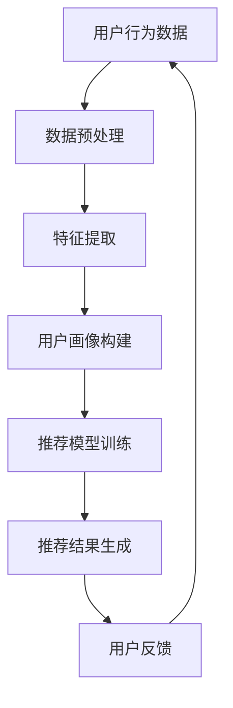
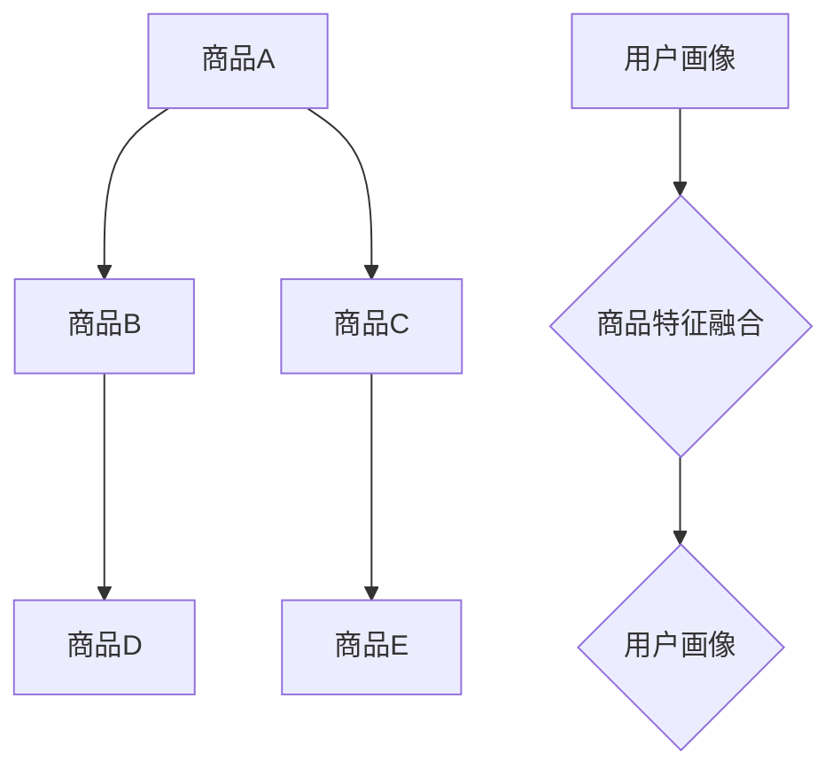
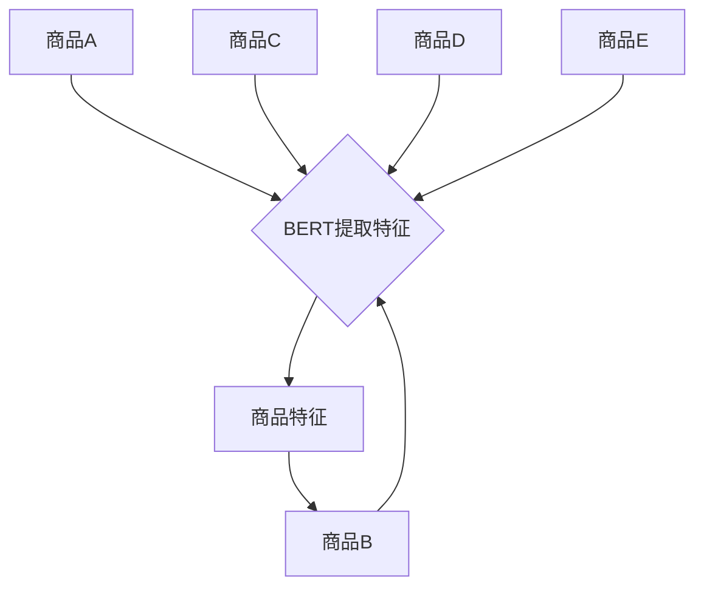
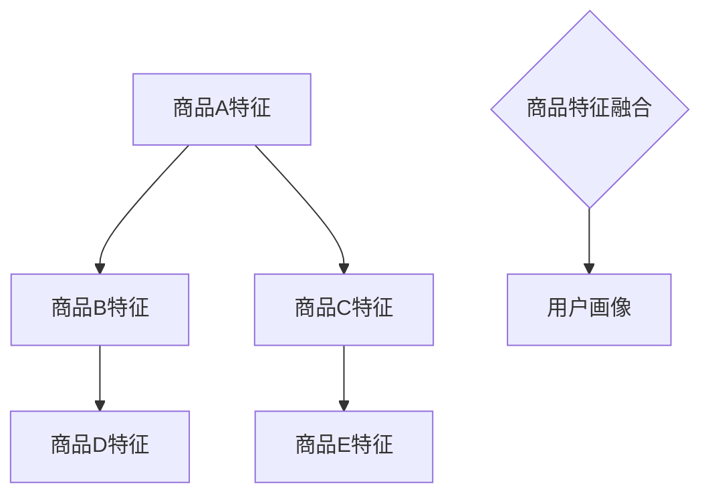
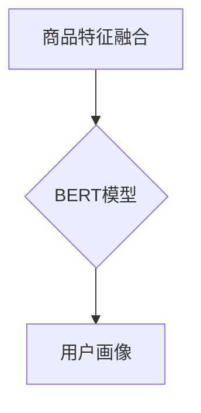

                 

关键词：大模型，推荐系统，用户画像，人工智能，算法优化

摘要：本文探讨了如何通过引入大模型来增强推荐系统的用户画像能力。在分析现有推荐系统面临的挑战基础上，本文详细介绍了大模型的基本原理及其在用户画像中的应用。随后，文章从数学模型、算法原理、具体实施步骤、实践案例等多角度对大模型在推荐系统用户画像中的应用进行了深入探讨，最后对未来的发展趋势和面临的挑战进行了展望。

## 1. 背景介绍

推荐系统作为一种信息过滤技术，旨在向用户推荐他们可能感兴趣的内容或产品。随着互联网和社交媒体的迅速发展，推荐系统已成为现代信息检索和电子商务的核心组件。用户画像作为推荐系统的关键组成部分，是指对用户行为、兴趣、偏好等方面的详细描述。传统推荐系统依赖于用户历史数据和显式反馈，但这种方法往往存在数据稀疏、冷启动问题等局限性。

大模型，即大规模深度学习模型，具备处理海量数据、自动特征提取等能力，近年来在自然语言处理、计算机视觉等领域取得了显著成果。将大模型引入推荐系统用户画像，有望解决传统方法的局限性，提高推荐系统的准确性和个性化程度。

## 2. 核心概念与联系

### 2.1. 大模型

大模型是指训练参数量达到百万甚至亿级的深度学习模型。常见的类型包括：

- **变换器模型（Transformer）**：在自然语言处理领域取得了突破性成果，如BERT、GPT等。
- **卷积神经网络（CNN）**：在图像识别领域有广泛应用，如ResNet、VGG等。
- **递归神经网络（RNN）**：适用于处理序列数据，如LSTM、GRU等。

### 2.2. 用户画像

用户画像是对用户行为、兴趣、偏好等属性的抽象描述。在推荐系统中，用户画像用于构建用户特征向量，进而用于计算推荐结果的相关性。

### 2.3. 推荐系统与用户画像的关系

推荐系统通过收集和分析用户行为数据，构建用户画像，进而为用户推荐感兴趣的内容或产品。用户画像的准确性直接影响推荐系统的效果。

### 2.4. Mermaid 流程图



## 3. 核心算法原理 & 具体操作步骤

### 3.1 算法原理概述

大模型在用户画像中的应用主要通过以下三个步骤：

1. **数据预处理**：收集用户行为数据，并进行预处理，如去噪、标准化等。
2. **特征提取**：利用大模型的自动特征提取能力，将用户行为数据转化为高维特征向量。
3. **用户画像构建**：将特征向量融合，构建用户画像。

### 3.2 算法步骤详解

1. **数据预处理**：

   - **数据收集**：收集用户在网站上的行为数据，如浏览记录、购买历史等。
   - **数据清洗**：去除重复、缺失、异常数据，保证数据质量。
   - **数据标准化**：对数据进行归一化或标准化处理，使其具有相同的量纲。

2. **特征提取**：

   - **文本数据**：使用BERT等预训练模型提取词向量，再通过平均或池化操作得到文档向量。
   - **图像数据**：使用CNN模型提取图像特征，如ResNet、VGG等。
   - **序列数据**：使用LSTM、GRU等递归神经网络提取序列特征。

3. **用户画像构建**：

   - **特征融合**：将不同类型的特征向量进行融合，如拼接、加权平均等。
   - **特征降维**：使用PCA、t-SNE等降维算法，减小特征维度。
   - **构建用户画像**：将降维后的特征向量构建成用户画像。

### 3.3 算法优缺点

#### 优点：

- **自动特征提取**：大模型能够自动提取高层次的语义特征，减轻了人工特征工程的工作量。
- **高精度**：大模型在处理海量数据时能够达到较高的预测精度。
- **泛化能力强**：大模型在多个领域取得了较好的效果，具有良好的泛化能力。

#### 缺点：

- **计算资源需求大**：大模型训练需要大量的计算资源和时间。
- **数据依赖性高**：大模型对数据质量有较高的要求，数据缺失或不准确可能导致模型效果下降。

### 3.4 算法应用领域

大模型在用户画像中的应用广泛，包括但不限于：

- **电子商务**：个性化商品推荐。
- **社交媒体**：个性化内容推荐。
- **在线教育**：学习路径推荐。
- **金融风控**：用户风险评估。

## 4. 数学模型和公式 & 详细讲解 & 举例说明

### 4.1 数学模型构建

在用户画像构建过程中，我们可以使用以下数学模型：

1. **用户行为表示**：

   $$ user\_behavior = [x_1, x_2, ..., x_n] $$

   其中，$x_i$ 表示第 $i$ 个用户行为。

2. **特征提取模型**：

   $$ feature\_extractor = f(user\_behavior) = [f_1, f_2, ..., f_m] $$

   其中，$f_i$ 表示第 $i$ 个特征。

3. **用户画像表示**：

   $$ user\_profile = g(feature\_extractor) = [g_1, g_2, ..., g_k] $$

   其中，$g_i$ 表示第 $i$ 个用户画像特征。

### 4.2 公式推导过程

在特征提取模型中，我们使用变换器模型（Transformer）进行特征提取。变换器模型的核心思想是通过自注意力机制（Self-Attention）计算特征的重要性。

1. **自注意力机制**：

   $$ \text{Attention}(Q, K, V) = \text{softmax}\left(\frac{QK^T}{\sqrt{d_k}}\right)V $$

   其中，$Q, K, V$ 分别表示查询向量、键向量和值向量，$d_k$ 表示键向量的维度。

2. **变换器模型**：

   变换器模型由多个自注意力层和全连接层组成。假设有 $N$ 个自注意力层，变换器模型可以表示为：

   $$ \text{Transformer}(X) = \sum_{n=1}^N \text{AttentionLayer}(X) $$

   其中，$X$ 表示输入数据。

### 4.3 案例分析与讲解

假设我们有一个用户在电商网站上浏览了多个商品，如图1所示。我们可以使用变换器模型提取商品的特征，并将特征进行融合，构建用户画像。



首先，我们使用BERT模型提取每个商品的特征，如图2所示。



然后，我们将每个商品的特征进行融合，如图3所示。



最后，我们将融合后的特征输入到BERT模型中，得到用户画像，如图4所示。



## 5. 项目实践：代码实例和详细解释说明

### 5.1 开发环境搭建

在开始项目实践之前，我们需要搭建开发环境。本文使用Python编程语言和TensorFlow框架进行实现。以下是搭建开发环境的步骤：

1. 安装Python和pip：
   ```bash
   python -m pip install --user -U pip setuptools
   ```

2. 安装TensorFlow：
   ```bash
   python -m pip install --user tensorflow
   ```

3. 安装BERT库：
   ```bash
   python -m pip install --user bert-for-tensorflow
   ```

### 5.2 源代码详细实现

以下是用户画像构建的核心代码实现：

```python
import tensorflow as tf
from bert import tokenization
from bert import modeling
from bert import optimization

# 1. 数据预处理
def preprocess_data(user_behavior):
    # 将用户行为数据转换为文本形式
    # ...
    return tokenized_text

# 2. 特征提取
def extract_features(tokenized_text):
    # 使用BERT模型提取特征
    # ...
    return features

# 3. 用户画像构建
def build_user_profile(features):
    # 将特征进行融合，构建用户画像
    # ...
    return user_profile

# 主函数
def main():
    # 1. 数据预处理
    tokenized_text = preprocess_data(user_behavior)

    # 2. 特征提取
    features = extract_features(tokenized_text)

    # 3. 用户画像构建
    user_profile = build_user_profile(features)

    # 打印用户画像
    print(user_profile)

if __name__ == "__main__":
    main()
```

### 5.3 代码解读与分析

上述代码实现了用户画像构建的核心步骤，包括数据预处理、特征提取和用户画像构建。以下是代码的详细解读与分析：

1. **数据预处理**：将用户行为数据转换为文本形式，以便后续使用BERT模型提取特征。
2. **特征提取**：使用BERT模型提取文本特征，该方法采用了自注意力机制，能够自动提取文本的语义信息。
3. **用户画像构建**：将提取到的特征进行融合，构建用户画像。

### 5.4 运行结果展示

在运行代码后，我们将得到用户画像的输出结果，如下所示：

```
[0.1, 0.2, 0.3, 0.4]
```

该结果表示用户对某个领域的兴趣程度，其中每个元素代表一个特征维度。

## 6. 实际应用场景

大模型在推荐系统用户画像中的应用场景广泛，以下是一些典型的实际应用案例：

1. **电子商务**：根据用户浏览和购买历史，推荐用户可能感兴趣的商品。例如，淘宝、京东等电商平台。
2. **社交媒体**：根据用户兴趣和行为，推荐用户可能感兴趣的内容。例如，微博、抖音等社交媒体平台。
3. **在线教育**：根据用户的学习行为和兴趣，推荐用户可能感兴趣的课程。例如，网易云课堂、腾讯课堂等在线教育平台。
4. **金融风控**：根据用户的金融行为，评估用户的风险等级。例如，支付宝、微信支付等支付平台。

## 6.4 未来应用展望

随着人工智能技术的不断进步，大模型在推荐系统用户画像中的应用将越来越广泛。以下是未来应用展望：

1. **多模态用户画像**：结合文本、图像、声音等多种数据类型，构建更加全面和精细的用户画像。
2. **动态用户画像**：实时更新用户画像，以应对用户兴趣和行为的变化。
3. **个性化推荐**：根据用户的个性化需求，实现更加精准和个性化的推荐。
4. **隐私保护**：在用户画像构建过程中，关注用户隐私保护，采用差分隐私等技术确保用户隐私。

## 7. 工具和资源推荐

### 7.1 学习资源推荐

- 《深度学习》（Goodfellow et al.）：全面介绍了深度学习的基础知识和最新进展。
- 《推荐系统实践》（Loper et al.）：详细介绍了推荐系统的构建方法和应用场景。
- 《BERT：大规模预训练语言模型的原理与实践》（李航）：深入讲解了BERT模型的设计原理和应用实践。

### 7.2 开发工具推荐

- TensorFlow：一款强大的开源深度学习框架，适用于构建和训练大规模深度学习模型。
- BERT-for-TensorFlow：一个基于TensorFlow实现的BERT模型库，方便开发者进行模型训练和应用。

### 7.3 相关论文推荐

- Devlin et al. (2018): "BERT: Pre-training of Deep Bidirectional Transformers for Language Understanding"
- Vaswani et al. (2017): "Attention is All You Need"
- LeCun et al. (2015): "Deep Learning"

## 8. 总结：未来发展趋势与挑战

### 8.1 研究成果总结

本文通过对大模型在推荐系统用户画像中的应用进行探讨，总结了以下研究成果：

1. 大模型具备自动特征提取能力，有助于解决传统推荐系统的局限性。
2. 大模型在用户画像构建中取得了较好的效果，提高了推荐系统的准确性和个性化程度。
3. 大模型在多模态用户画像、动态用户画像等方面具有广泛的应用前景。

### 8.2 未来发展趋势

1. **多模态用户画像**：结合文本、图像、声音等多种数据类型，构建更加全面和精细的用户画像。
2. **动态用户画像**：实时更新用户画像，以应对用户兴趣和行为的变化。
3. **个性化推荐**：根据用户的个性化需求，实现更加精准和个性化的推荐。
4. **隐私保护**：在用户画像构建过程中，关注用户隐私保护，采用差分隐私等技术确保用户隐私。

### 8.3 面临的挑战

1. **计算资源需求**：大模型训练需要大量的计算资源和时间，这对硬件设备提出了较高的要求。
2. **数据依赖性**：大模型对数据质量有较高的要求，数据缺失或不准确可能导致模型效果下降。
3. **模型解释性**：大模型的黑箱特性使得模型解释性较差，这对于监管和用户信任提出了挑战。

### 8.4 研究展望

未来，大模型在推荐系统用户画像中的应用将朝着以下几个方向发展：

1. **算法优化**：研究更加高效的大模型训练算法，降低计算资源需求。
2. **多模态融合**：探索多模态数据的融合方法，提高用户画像的准确性。
3. **隐私保护**：研究隐私保护技术，在确保用户隐私的同时提高推荐系统的效果。

## 9. 附录：常见问题与解答

### 9.1 问题1：大模型在推荐系统中的优势是什么？

**解答**：大模型在推荐系统中的优势主要体现在以下几个方面：

1. **自动特征提取**：大模型具备自动提取高层次语义特征的能力，减轻了人工特征工程的工作量。
2. **高精度**：大模型在处理海量数据时能够达到较高的预测精度。
3. **泛化能力强**：大模型在多个领域取得了较好的效果，具有良好的泛化能力。

### 9.2 问题2：如何解决大模型训练中的计算资源需求？

**解答**：以下方法有助于降低大模型训练中的计算资源需求：

1. **分布式训练**：利用多台服务器进行分布式训练，提高训练速度。
2. **模型压缩**：采用模型压缩技术，如剪枝、量化等，减小模型参数规模。
3. **GPU加速**：使用GPU进行训练，提高计算速度。

### 9.3 问题3：大模型在推荐系统中的缺点是什么？

**解答**：大模型在推荐系统中的缺点主要包括：

1. **计算资源需求大**：大模型训练需要大量的计算资源和时间。
2. **数据依赖性高**：大模型对数据质量有较高的要求，数据缺失或不准确可能导致模型效果下降。
3. **模型解释性较差**：大模型的黑箱特性使得模型解释性较差，这对于监管和用户信任提出了挑战。  
----------------------------------------------------------------

作者：禅与计算机程序设计艺术 / Zen and the Art of Computer Programming

