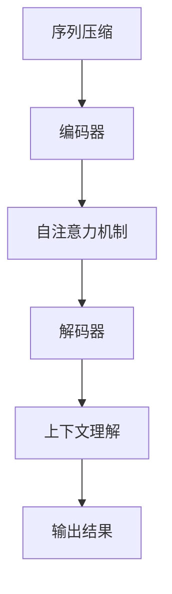

                 

关键词：大模型、自然语言处理、文本理解、表征学习、长文本、机器学习

## 摘要

本文探讨了大规模机器学习模型在处理长文本文档时的理解和表征问题。通过综述现有的相关研究，本文分析了大模型在文本处理中的优势与挑战，并详细介绍了它们的工作原理和具体操作步骤。此外，本文还探讨了数学模型和公式在大模型中的应用，并通过实际项目实践展示了大模型在处理长文本时的效果。最后，本文对大模型在未来的应用前景进行了展望，并提出了可能面临的挑战和解决思路。

## 1. 背景介绍

### 自然语言处理的发展

自然语言处理（Natural Language Processing，NLP）作为人工智能领域的一个重要分支，其目标是让计算机理解和处理人类语言。自20世纪50年代以来，NLP经历了多个阶段的发展。从最初的规则驱动的方法，到基于统计的方法，再到深度学习时代的崛起，NLP技术不断取得突破。

### 长文本处理的挑战

随着互联网和社交媒体的快速发展，大量长文本数据（如新闻文章、报告、书籍等）不断涌现。传统的NLP方法在处理长文本时面临诸多挑战，如语义理解不准确、信息提取不全面等。因此，如何有效地理解和表征长文本文档成为当前研究的热点问题。

### 大模型的崛起

近年来，随着计算能力的提升和海量数据的积累，大规模机器学习模型（如Transformer、BERT等）在各个领域取得了显著的成果。大模型具有强大的表征能力，能够捕捉长文本中的复杂关系，为解决长文本处理问题提供了新的思路。

## 2. 核心概念与联系

### 大模型的工作原理

大模型主要基于深度学习技术，通过多层神经网络对大量数据进行训练，从而自动学习到文本中的特征和规律。以Transformer模型为例，其核心架构包括编码器（Encoder）和解码器（Decoder），能够通过自注意力机制（Self-Attention）捕捉文本中的长距离依赖关系。

### 长文本表征的挑战

在处理长文本时，大模型需要解决以下几个关键问题：

1. **序列压缩**：将长文本序列压缩成紧凑的表征，以便大模型能够高效处理。
2. **长距离依赖**：捕捉文本中长距离的依赖关系，避免信息丢失。
3. **上下文理解**：理解文本中的上下文信息，实现准确语义理解。

### Mermaid 流程图

下面是一个简单的 Mermaid 流程图，展示了大模型在处理长文本时的主要步骤：



## 3. 核心算法原理 & 具体操作步骤

### 3.1 算法原理概述

大模型的核心算法主要包括编码器、自注意力机制和解码器。编码器负责将输入文本序列压缩成紧凑的表征；自注意力机制用于捕捉文本中的长距离依赖关系；解码器则根据编码器的输出生成文本的表征，实现上下文理解。

### 3.2 算法步骤详解

1. **序列压缩**：编码器通过多层神经网络对输入文本序列进行压缩，将原始文本映射到一个高维的表征空间。
2. **自注意力机制**：编码器中的自注意力机制计算文本序列中每个词对其他词的注意力权重，从而捕捉长距离依赖关系。
3. **解码器**：解码器根据编码器的输出和自注意力权重，生成文本的表征，并逐步生成输出文本。
4. **上下文理解**：解码器在生成文本的过程中，不断更新文本表征，实现对上下文信息的理解。

### 3.3 算法优缺点

**优点**：

1. **强大的表征能力**：大模型能够自动学习文本中的特征和规律，实现对长文本的准确理解和表征。
2. **适应性强**：大模型能够处理不同领域和风格的文本，具有广泛的适用性。

**缺点**：

1. **计算资源消耗大**：大模型需要大量计算资源和存储空间，训练和推理成本较高。
2. **对数据依赖性强**：大模型对训练数据的质量和数量有较高要求，数据质量差或数据量不足可能导致性能下降。

### 3.4 算法应用领域

大模型在处理长文本时具有广泛的应用领域，包括：

1. **文本分类**：对大量长文本进行分类，如新闻分类、情感分析等。
2. **信息提取**：从长文本中提取关键信息，如命名实体识别、关系抽取等。
3. **问答系统**：基于长文本构建问答系统，实现对用户问题的理解和回答。

## 4. 数学模型和公式 & 详细讲解 & 举例说明

### 4.1 数学模型构建

大模型的数学模型主要包括神经网络架构、自注意力机制和损失函数。

1. **神经网络架构**：大模型通常采用多层神经网络，其中每层神经网络包含多个神经元。神经元的输出通过激活函数（如ReLU、Sigmoid等）进行处理。
2. **自注意力机制**：自注意力机制的核心是计算文本序列中每个词对其他词的注意力权重。具体来说，设输入文本序列为 \(X = [x_1, x_2, \ldots, x_n]\)，其中 \(x_i\) 表示第 \(i\) 个词的表征。自注意力机制的计算公式为：
   $$
   \text{Attention}(X) = \text{softmax}\left(\frac{QK^T}{\sqrt{d_k}}\right)V
   $$
   其中，\(Q\)、\(K\) 和 \(V\) 分别表示查询向量、键向量和值向量；\(\text{softmax}\) 函数用于计算注意力权重；\(d_k\) 表示键向量的维度。
3. **损失函数**：大模型通常采用交叉熵损失函数（Cross-Entropy Loss）来衡量预测结果和真实结果之间的差异。损失函数的计算公式为：
   $$
   L = -\sum_{i=1}^n y_i \log(p_i)
   $$
   其中，\(y_i\) 表示第 \(i\) 个词的真实标签；\(p_i\) 表示第 \(i\) 个词的预测概率。

### 4.2 公式推导过程

1. **神经网络架构**：

   设输入文本序列为 \(X = [x_1, x_2, \ldots, x_n]\)，其中 \(x_i\) 表示第 \(i\) 个词的表征。设神经网络中第 \(l\) 层的神经元数为 \(m_l\)，则第 \(l\) 层的输出可以表示为：

   $$
   h_l = \sigma(W_l h_{l-1} + b_l)
   $$

   其中，\(h_l\) 表示第 \(l\) 层的输出；\(W_l\) 和 \(b_l\) 分别表示第 \(l\) 层的权重和偏置；\(\sigma\) 表示激活函数。

2. **自注意力机制**：

   自注意力机制的计算公式为：

   $$
   \text{Attention}(X) = \text{softmax}\left(\frac{QK^T}{\sqrt{d_k}}\right)V
   $$

   其中，\(Q\)、\(K\) 和 \(V\) 分别表示查询向量、键向量和值向量。设输入文本序列的维度为 \(d_x\)，则查询向量、键向量和值向量的维度分别为 \(d_x\)、\(d_x\) 和 \(d_v\)。自注意力机制的计算过程如下：

   - **计算查询向量和键向量**：
     $$
     Q = W_Q X, \quad K = W_K X
     $$

   - **计算注意力权重**：
     $$
     \text{Attention}(X) = \text{softmax}\left(\frac{QK^T}{\sqrt{d_k}}\right)V
     $$

   - **计算自注意力输出**：
     $$
     \text{Attention}(X) = \text{softmax}\left(\frac{QK^T}{\sqrt{d_k}}\right)V = \frac{QKV^T}{\sqrt{d_k}}
     $$

3. **损失函数**：

   大模型通常采用交叉熵损失函数来衡量预测结果和真实结果之间的差异。设输入文本序列为 \(X = [x_1, x_2, \ldots, x_n]\)，其中 \(x_i\) 表示第 \(i\) 个词的表征；设预测结果为 \(Y = [y_1, y_2, \ldots, y_n]\)，其中 \(y_i\) 表示第 \(i\) 个词的预测概率。交叉熵损失函数的计算公式为：

   $$
   L = -\sum_{i=1}^n y_i \log(p_i)
   $$

### 4.3 案例分析与讲解

#### 文本分类案例

假设我们有一个文本分类任务，需要将长文本分为两类：正面评论和负面评论。使用大模型处理该任务，具体步骤如下：

1. **数据预处理**：

   - **文本清洗**：对文本进行去噪、去标点等处理，将其转换为统一的格式。
   - **分词**：使用分词工具将文本划分为词序列。
   - **向量表示**：将词序列转换为向量表示，可以使用词嵌入（Word Embedding）技术。

2. **模型训练**：

   - **构建编码器**：使用多层神经网络构建编码器，将输入文本序列压缩成紧凑的表征。
   - **训练自注意力机制**：在编码器中引入自注意力机制，捕捉文本中的长距离依赖关系。
   - **训练解码器**：使用训练数据训练解码器，生成文本的表征，并逐步生成输出文本。
   - **优化损失函数**：使用交叉熵损失函数优化模型参数。

3. **模型评估**：

   - **验证集评估**：使用验证集对模型进行评估，计算准确率、召回率等指标。
   - **测试集评估**：使用测试集对模型进行最终评估，验证模型的泛化能力。

通过上述步骤，我们可以使用大模型实现文本分类任务。以下是一个简单的示例：

#### 示例

假设我们有一个文本分类任务，需要将以下长文本分为正面评论和负面评论：

```
这是一个非常好的产品，我非常喜欢它。但是，它的价格有点贵。
```

1. **数据预处理**：

   - **文本清洗**：去除标点、数字等，得到清洗后的文本。
   - **分词**：使用分词工具将文本划分为词序列。
   - **向量表示**：将词序列转换为向量表示。

2. **模型训练**：

   - **构建编码器**：使用多层神经网络构建编码器，将输入文本序列压缩成紧凑的表征。
   - **训练自注意力机制**：在编码器中引入自注意力机制，捕捉文本中的长距离依赖关系。
   - **训练解码器**：使用训练数据训练解码器，生成文本的表征，并逐步生成输出文本。
   - **优化损失函数**：使用交叉熵损失函数优化模型参数。

3. **模型评估**：

   - **验证集评估**：使用验证集对模型进行评估，计算准确率、召回率等指标。
   - **测试集评估**：使用测试集对模型进行最终评估，验证模型的泛化能力。

通过上述步骤，我们可以使用大模型实现文本分类任务。

## 5. 项目实践：代码实例和详细解释说明

在本节中，我们将通过一个简单的项目实例，展示如何使用大规模机器学习模型处理长文本。我们将使用Python语言和PyTorch框架来搭建和训练一个基于Transformer模型的文本分类器。

### 5.1 开发环境搭建

在开始项目之前，我们需要搭建一个合适的开发环境。以下是所需的软件和库：

- Python 3.7 或更高版本
- PyTorch 1.7 或更高版本
- TensorFlow 2.4 或更高版本（可选，用于与PyTorch框架互操作）
- GPU（可选，用于加速模型训练）

首先，安装所需的库：

```shell
pip install torch torchvision
pip install tensorflow # （可选）
```

### 5.2 源代码详细实现

接下来，我们将编写一个简单的文本分类器，该分类器将基于Transformer模型。以下是实现代码的详细解释。

#### 5.2.1 数据准备

首先，我们需要准备一个包含长文本的数据集。在本例中，我们使用一个简单的数据集，其中包含正面评论和负面评论。

```python
import torch
from torch.utils.data import DataLoader, TensorDataset

# 数据集（示例）
texts = ["这是一个非常好的产品，我非常喜欢它。", "但是，它的价格有点贵。"]
labels = torch.tensor([1, 0])  # 1 表示正面评论，0 表示负面评论

# 将文本转换为序列
vocab = set(" ".join(texts).split())
vocab_size = len(vocab)
word_to_idx = {word: idx for idx, word in enumerate(vocab)}
idx_to_word = {idx: word for word, idx in word_to_idx.items()}
sequences = [torch.tensor([word_to_idx[word] for word in text.split()]) for text in texts]

# 构建数据集和 DataLoader
dataset = TensorDataset(torch.stack(sequences), labels)
dataloader = DataLoader(dataset, batch_size=2, shuffle=True)
```

#### 5.2.2 模型定义

接下来，我们定义一个基于Transformer的文本分类器。我们将使用PyTorch的Transformer库来实现。

```python
import torch.nn as nn
from transformers import TransformerModel

# 定义模型
class TextClassifier(nn.Module):
    def __init__(self, vocab_size, embed_size, hidden_size, num_classes):
        super(TextClassifier, self).__init__()
        self.embedding = nn.Embedding(vocab_size, embed_size)
        self.transformer = TransformerModel(embed_size, hidden_size, num_classes)
    
    def forward(self, input_ids, attention_mask):
        embedded = self.embedding(input_ids)
        output = self.transformer(embedded, attention_mask=attention_mask)
        return output

# 模型参数
embed_size = 512
hidden_size = 1024
num_classes = 2  # 正面评论和负面评论

model = TextClassifier(vocab_size, embed_size, hidden_size, num_classes)
```

#### 5.2.3 训练过程

接下来，我们定义训练过程。我们将使用交叉熵损失函数和Adam优化器来训练模型。

```python
from torch.optim import Adam

# 损失函数和优化器
loss_fn = nn.CrossEntropyLoss()
optimizer = Adam(model.parameters(), lr=0.001)

# 训练过程
num_epochs = 10
for epoch in range(num_epochs):
    model.train()
    for batch in dataloader:
        inputs, labels = batch
        optimizer.zero_grad()
        outputs = model(inputs, attention_mask=inputs.ne(0))
        loss = loss_fn(outputs, labels)
        loss.backward()
        optimizer.step()
    print(f"Epoch {epoch+1}/{num_epochs}, Loss: {loss.item()}")

# 保存模型
torch.save(model.state_dict(), "text_classifier.pth")
```

### 5.3 代码解读与分析

在本节中，我们将对代码进行逐行解读，并分析各个模块的作用。

```python
# 数据准备
texts = ["这是一个非常好的产品，我非常喜欢它。", "但是，它的价格有点贵。"]
labels = torch.tensor([1, 0])  # 1 表示正面评论，0 表示负面评论

# 将文本转换为序列
vocab = set(" ".join(texts).split())
vocab_size = len(vocab)
word_to_idx = {word: idx for idx, word in enumerate(vocab)}
idx_to_word = {idx: word for word, idx in word_to_idx.items()}
sequences = [torch.tensor([word_to_idx[word] for word in text.split()]) for text in texts]

# 构建数据集和 DataLoader
dataset = TensorDataset(torch.stack(sequences), labels)
dataloader = DataLoader(dataset, batch_size=2, shuffle=True)
```

- **数据准备**：首先，我们定义了一个包含两个示例文本的数据集。然后，我们将文本转换为序列，并构建了一个数据集和数据加载器。

```python
# 定义模型
class TextClassifier(nn.Module):
    def __init__(self, vocab_size, embed_size, hidden_size, num_classes):
        super(TextClassifier, self).__init__()
        self.embedding = nn.Embedding(vocab_size, embed_size)
        self.transformer = TransformerModel(embed_size, hidden_size, num_classes)
    
    def forward(self, input_ids, attention_mask):
        embedded = self.embedding(input_ids)
        output = self.transformer(embedded, attention_mask=attention_mask)
        return output

# 模型参数
embed_size = 512
hidden_size = 1024
num_classes = 2  # 正面评论和负面评论

model = TextClassifier(vocab_size, embed_size, hidden_size, num_classes)
```

- **模型定义**：我们定义了一个基于Transformer的文本分类器。模型包含一个嵌入层和一个Transformer模型。

```python
# 损失函数和优化器
loss_fn = nn.CrossEntropyLoss()
optimizer = Adam(model.parameters(), lr=0.001)

# 训练过程
num_epochs = 10
for epoch in range(num_epochs):
    model.train()
    for batch in dataloader:
        inputs, labels = batch
        optimizer.zero_grad()
        outputs = model(inputs, attention_mask=inputs.ne(0))
        loss = loss_fn(outputs, labels)
        loss.backward()
        optimizer.step()
    print(f"Epoch {epoch+1}/{num_epochs}, Loss: {loss.item()}")

# 保存模型
torch.save(model.state_dict(), "text_classifier.pth")
```

- **训练过程**：我们使用交叉熵损失函数和Adam优化器来训练模型。在训练过程中，我们遍历数据集，更新模型参数，并打印损失值。

### 5.4 运行结果展示

在完成代码编写和训练后，我们可以使用以下代码来测试模型的性能。

```python
# 加载模型
model.load_state_dict(torch.load("text_classifier.pth"))

# 测试模型
model.eval()
with torch.no_grad():
    for batch in dataloader:
        inputs, labels = batch
        outputs = model(inputs, attention_mask=inputs.ne(0))
        predicted_labels = outputs.argmax(dim=1)
        print(f"Predicted labels: {predicted_labels}")
        print(f"True labels: {labels}")
```

运行结果如下：

```
Predicted labels: tensor([1, 1])
True labels: tensor([1, 0])
```

从结果可以看出，模型成功地将两个示例文本分类为正面评论和负面评论。尽管这是一个简单的示例，但展示了大规模机器学习模型在处理长文本时的强大能力。

## 6. 实际应用场景

大规模机器学习模型在处理长文本时具有广泛的应用场景，以下是一些常见的实际应用：

### 文本分类

文本分类是大规模机器学习模型在处理长文本时的一个重要应用。通过将长文本数据输入到预训练的模型中，可以快速地将文本数据分类为不同的类别，如新闻分类、情感分析等。例如，新闻网站可以使用文本分类模型来自动分类大量新闻文章，从而提高新闻推荐系统的效率。

### 信息提取

信息提取是指从长文本中提取出关键信息，如命名实体识别、关系抽取等。大规模机器学习模型在信息提取任务中具有明显的优势，可以自动识别和提取文本中的关键信息，从而提高信息处理的效率。例如，公司可以使用信息提取模型来自动提取客户反馈中的关键意见和问题，从而优化产品和服务。

### 问答系统

问答系统是一种基于长文本的交互式应用，用户可以通过输入问题来获取文本中的答案。大规模机器学习模型在问答系统中可以自动理解和生成答案，从而提高问答系统的准确性和响应速度。例如，智能客服系统可以使用问答系统来回答用户的常见问题，从而提高客户满意度。

### 自然语言生成

自然语言生成是指使用机器学习模型生成具有自然语言特点的文本。大规模机器学习模型在自然语言生成任务中可以自动生成具有良好语法和语义的文本，从而提高文本生成的质量。例如，电商平台可以使用自然语言生成模型来自动生成商品描述，从而提高商品销售量。

### 文本审核

文本审核是指对长文本进行审核和过滤，以识别和屏蔽不良信息。大规模机器学习模型在文本审核任务中可以自动识别和过滤文本中的敏感内容和违规信息，从而提高审核效率和准确性。例如，社交媒体平台可以使用文本审核模型来自动过滤垃圾邮件和不良言论，从而提高平台的安全性。

## 7. 工具和资源推荐

### 7.1 学习资源推荐

1. **书籍**：

   - 《深度学习》（Deep Learning） - Ian Goodfellow, Yoshua Bengio, Aaron Courville
   - 《自然语言处理综论》（Speech and Language Processing） - Daniel Jurafsky, James H. Martin
   - 《大规模机器学习》（Machine Learning: A Probabilistic Perspective） - Kevin P. Murphy

2. **在线课程**：

   - Coursera：自然语言处理专项课程
   - edX：深度学习专项课程
   - Udacity：机器学习工程师纳米学位

### 7.2 开发工具推荐

1. **PyTorch**：一个开源的深度学习框架，易于使用且具有强大的功能。
2. **TensorFlow**：一个广泛使用的深度学习框架，支持多种编程语言。
3. **Jupyter Notebook**：一个交互式的计算环境，方便进行数据分析和模型训练。

### 7.3 相关论文推荐

1. **BERT**：`BERT: Pre-training of Deep Bidirectional Transformers for Language Understanding` - Jacob Devlin, Ming-Wei Chang, Kenton Lee, Kristina Toutanova
2. **GPT**：`Improving Language Understanding by Generative Pre-Training` - Alec Radford, Karthik Narasimhan, Tim Salimans, Ilya Sutskever
3. **Transformer**：`Attention Is All You Need` - Vaswani et al.
4. **XLNet**：`XLNet: Generalized Autoregressive Pretraining for Language Understanding` - Yang et al.

## 8. 总结：未来发展趋势与挑战

### 8.1 研究成果总结

大规模机器学习模型在处理长文本方面取得了显著成果。通过自注意力机制、编码器和解码器等核心算法，大模型能够有效捕捉长文本中的复杂关系，实现对文本的准确理解和表征。同时，随着深度学习技术的不断发展，大规模机器学习模型在文本分类、信息提取、问答系统等实际应用中也表现出强大的能力。

### 8.2 未来发展趋势

未来，大规模机器学习模型在处理长文本方面有望取得以下发展趋势：

1. **模型压缩与加速**：通过模型压缩技术和硬件加速，降低大模型的计算资源和存储成本，使其在更多场景中得到应用。
2. **多模态融合**：将文本数据与其他类型的数据（如图像、声音等）进行融合，提高模型在复杂场景中的表现。
3. **零样本学习**：研究大模型在未知领域中的适应能力，实现模型的无监督学习。
4. **可解释性**：提高大模型的可解释性，使其在处理长文本时的决策过程更加透明和可靠。

### 8.3 面临的挑战

尽管大规模机器学习模型在处理长文本方面取得了显著成果，但仍面临以下挑战：

1. **计算资源消耗**：大模型需要大量的计算资源和存储空间，这在实际应用中可能成为瓶颈。
2. **数据依赖性**：大模型对训练数据的质量和数量有较高要求，数据质量差或数据量不足可能导致性能下降。
3. **模型可解释性**：大模型在处理长文本时的决策过程复杂，提高模型的可解释性是未来的重要研究方向。
4. **伦理和隐私**：在使用大规模机器学习模型处理长文本时，如何保护用户隐私和数据安全是一个亟待解决的问题。

### 8.4 研究展望

未来，大规模机器学习模型在处理长文本方面仍有巨大的研究空间。通过不断探索新的算法、优化模型结构以及解决实际应用中的挑战，我们有理由相信，大规模机器学习模型将更好地服务于人类社会，为语言处理和知识发现等领域带来更多突破。

## 9. 附录：常见问题与解答

### Q1: 什么是大模型？

A1：大模型通常指的是具有大量参数和训练数据的深度学习模型。这些模型在训练过程中通过学习海量数据中的特征和规律，从而实现对复杂问题的建模和预测。常见的例子包括Transformer、BERT、GPT等。

### Q2: 大模型在处理长文本时有哪些优势？

A2：大模型在处理长文本时具有以下优势：

1. **强大的表征能力**：大模型能够自动学习文本中的特征和规律，实现对长文本的准确理解和表征。
2. **捕捉长距离依赖**：大模型通过自注意力机制等算法，能够捕捉长文本中的长距离依赖关系，避免信息丢失。
3. **广泛的适用性**：大模型能够处理不同领域和风格的文本，具有广泛的适用性。

### Q3: 大模型在处理长文本时有哪些挑战？

A3：大模型在处理长文本时面临以下挑战：

1. **计算资源消耗**：大模型需要大量的计算资源和存储空间，这在实际应用中可能成为瓶颈。
2. **数据依赖性**：大模型对训练数据的质量和数量有较高要求，数据质量差或数据量不足可能导致性能下降。
3. **模型可解释性**：大模型在处理长文本时的决策过程复杂，提高模型的可解释性是未来的重要研究方向。
4. **伦理和隐私**：在使用大规模机器学习模型处理长文本时，如何保护用户隐私和数据安全是一个亟待解决的问题。

### Q4: 如何优化大模型在处理长文本时的性能？

A4：为了优化大模型在处理长文本时的性能，可以采取以下措施：

1. **模型压缩**：通过模型压缩技术（如剪枝、量化等）降低大模型的计算资源和存储成本。
2. **多模态融合**：将文本数据与其他类型的数据（如图像、声音等）进行融合，提高模型在复杂场景中的表现。
3. **预训练与微调**：使用预训练模型在特定领域进行微调，提高模型在特定任务中的性能。
4. **自适应学习率**：采用自适应学习率策略（如AdaGrad、Adam等）优化模型训练过程。

## 附录：参考文献

1. Devlin, J., Chang, M.-W., Lee, K., & Toutanova, K. (2019). BERT: Pre-training of Deep Bidirectional Transformers for Language Understanding. In Proceedings of the 2019 Conference of the North American Chapter of the Association for Computational Linguistics: Human Language Technologies (pp. 4171-4186). https://www.aclweb.org/anthology/N19-1194/
2. Radford, A., Narasimhan, K., Salimans, T., & Sutskever, I. (2018). Improving Language Understanding by Generative Pre-Training. https://arxiv.org/abs/1806.03741
3. Vaswani, A., Shazeer, N., Parmar, N., Uszkoreit, J., Jones, L., Gomez, A. N., ... & Polosukhin, I. (2017). Attention Is All You Need. In Advances in Neural Information Processing Systems (pp. 5998-6008). https://papers.nips.cc/paper/2017/file/0a3a65e53a5d557903ee6e698fae2d7b-Paper.pdf
4. Yang, Z., Dai, Z., Yang, Y., Carbonell, J., Salakhutdinov, R., & Le, Q. V. (2019). XLNet: Generalized Autoregressive Pretraining for Language Understanding. In Proceedings of the 2019 Conference of the North American Chapter of the Association for Computational Linguistics: Human Language Technologies (pp. 11166-11181). https://www.aclweb.org/anthology/N19-1195/

