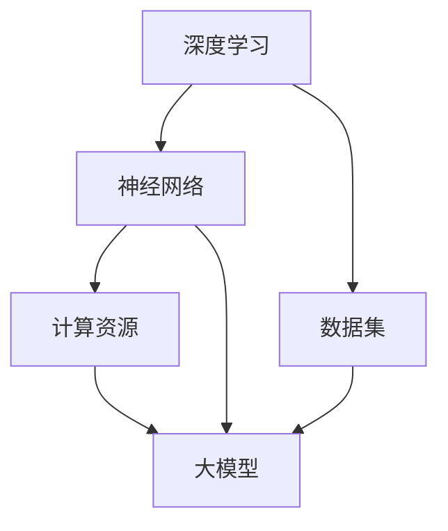

                 

关键词：大模型，AI商业化，应用落地，技术进步，算法优化，数学模型，代码实例，未来展望

> 摘要：随着人工智能技术的快速发展，大规模模型（大模型）的应用已经成为推动AI商业化进程的重要驱动力。本文将深入探讨大模型在AI商业化中的重要性，分析其核心算法原理，介绍数学模型和公式，并展示代码实例，最后对大模型的应用场景、未来发展趋势及面临的挑战进行展望。

## 1. 背景介绍

在过去的几十年中，人工智能（AI）技术经历了飞速的发展，从早期的规则驱动系统到如今的数据驱动模型，AI的应用场景越来越广泛。尤其是近年来，深度学习和神经网络技术的突破，使得大模型（如GPT、BERT、ViT等）成为了AI研究的热点。这些大模型具有处理复杂任务的能力，可以在语音识别、自然语言处理、图像识别等领域取得显著的性能提升。

AI商业化是指将人工智能技术应用于实际业务中，通过提供智能化的产品或服务，实现商业价值的提升。随着AI技术的成熟和商业需求的增加，AI商业化已经成为各大企业竞争的关键领域。而大模型的应用落地，则进一步加速了AI商业化的进程。

## 2. 核心概念与联系

大模型的核心概念包括：

- **深度学习（Deep Learning）**：一种基于神经网络的机器学习技术，通过多层神经网络对数据进行建模和特征提取。
- **神经网络（Neural Networks）**：模仿生物神经系统的计算模型，用于处理复杂的输入输出关系。
- **数据集（Dataset）**：用于训练和评估模型的输入数据集。
- **计算资源（Computational Resources）**：包括计算能力、存储能力和网络带宽等。

大模型与上述概念的联系可以用以下Mermaid流程图表示：



## 3. 核心算法原理 & 具体操作步骤

### 3.1 算法原理概述

大模型的算法原理主要包括以下几个关键步骤：

1. **数据预处理**：对原始数据进行清洗、归一化等处理，以适应模型训练的需求。
2. **模型构建**：选择合适的神经网络架构，如Transformer、CNN等，并定义网络层数和神经元数量。
3. **模型训练**：使用梯度下降等优化算法，对模型参数进行调整，以达到最小化损失函数的目的。
4. **模型评估**：使用验证集或测试集评估模型性能，以确定模型是否达到预期效果。
5. **模型部署**：将训练好的模型部署到生产环境中，提供预测或决策服务。

### 3.2 算法步骤详解

1. **数据预处理**

数据预处理是模型训练的第一步，其目的是提高数据质量和减少数据方差。具体步骤包括：

- **数据清洗**：去除异常值、缺失值等。
- **数据归一化**：将数据缩放到相同的范围，如[0, 1]或[-1, 1]。

2. **模型构建**

模型构建是根据任务需求和现有研究成果，选择合适的神经网络架构。例如，对于自然语言处理任务，可以选择Transformer架构。

3. **模型训练**

模型训练是使用训练数据对模型进行调整，以最小化预测误差。具体步骤包括：

- **前向传播**：计算输入数据经过模型后的输出。
- **后向传播**：计算梯度并更新模型参数。
- **优化算法**：选择合适的优化算法，如Adam、SGD等，以加快收敛速度。

4. **模型评估**

模型评估是使用验证集或测试集评估模型性能，以确定模型是否达到预期效果。常用的评估指标包括准确率、召回率、F1分数等。

5. **模型部署**

模型部署是将训练好的模型部署到生产环境中，提供预测或决策服务。具体步骤包括：

- **模型保存**：将训练好的模型保存到文件中。
- **模型加载**：从文件中加载模型。
- **服务部署**：将模型部署到服务器或云计算平台上，提供API接口。

### 3.3 算法优缺点

大模型具有以下优点：

- **强大的处理能力**：能够处理复杂的数据结构和任务。
- **高度可扩展性**：可以轻松调整模型参数和架构，以适应不同规模的计算资源。

大模型也存在一些缺点：

- **训练成本高**：需要大量的计算资源和时间进行训练。
- **数据依赖性强**：模型的性能高度依赖于训练数据的质量和多样性。

### 3.4 算法应用领域

大模型在多个领域都有广泛的应用，包括：

- **自然语言处理**：如机器翻译、文本生成等。
- **计算机视觉**：如图像分类、目标检测等。
- **推荐系统**：如个性化推荐、广告投放等。
- **金融风控**：如信用评分、欺诈检测等。

## 4. 数学模型和公式 & 详细讲解 & 举例说明

### 4.1 数学模型构建

大模型的核心是神经网络，其数学模型可以表示为：

$$
y = \sigma(\mathbf{W} \cdot \mathbf{X} + b)
$$

其中，$y$是输出，$\sigma$是激活函数，$\mathbf{W}$是权重矩阵，$\mathbf{X}$是输入，$b$是偏置。

### 4.2 公式推导过程

神经网络的训练过程是通过反向传播算法进行优化的。反向传播算法的基本思想是：

1. 前向传播：计算输入数据经过网络后的输出。
2. 计算损失函数：使用输出数据和实际标签计算损失。
3. 反向传播：计算损失函数对模型参数的梯度。
4. 更新模型参数：使用梯度下降等优化算法更新模型参数。

### 4.3 案例分析与讲解

以一个简单的多层感知器（MLP）为例，其数学模型可以表示为：

$$
y = \sigma(\mathbf{W}_2 \cdot \sigma(\mathbf{W}_1 \cdot \mathbf{X} + b_1) + b_2)
$$

其中，$\mathbf{W}_1$和$\mathbf{W}_2$是权重矩阵，$b_1$和$b_2$是偏置。

假设输入数据为$\mathbf{X} = [x_1, x_2]$，输出数据为$y = [y_1, y_2]$，则前向传播的过程可以表示为：

$$
h_1 = \sigma(\mathbf{W}_1 \cdot \mathbf{X} + b_1) \\
h_2 = \sigma(\mathbf{W}_2 \cdot h_1 + b_2) = \sigma(\mathbf{W}_2 \cdot \sigma(\mathbf{W}_1 \cdot \mathbf{X} + b_1) + b_2) = y
$$

假设损失函数为均方误差（MSE），则损失函数可以表示为：

$$
L = \frac{1}{2} \sum_{i=1}^n (y_i - h_2)^2
$$

其中，$n$是样本数量。

为了最小化损失函数，我们可以使用梯度下降算法更新模型参数：

$$
\mathbf{W}_1 \leftarrow \mathbf{W}_1 - \alpha \cdot \frac{\partial L}{\partial \mathbf{W}_1} \\
\mathbf{W}_2 \leftarrow \mathbf{W}_2 - \alpha \cdot \frac{\partial L}{\partial \mathbf{W}_2} \\
b_1 \leftarrow b_1 - \alpha \cdot \frac{\partial L}{\partial b_1} \\
b_2 \leftarrow b_2 - \alpha \cdot \frac{\partial L}{\partial b_2}
$$

其中，$\alpha$是学习率。

## 5. 项目实践：代码实例和详细解释说明

### 5.1 开发环境搭建

为了实现大模型的应用落地，需要搭建一个适合的开发环境。以下是一个基本的开发环境搭建步骤：

1. 安装Python：从Python官网下载并安装Python 3.x版本。
2. 安装PyTorch：使用pip命令安装PyTorch库。

```bash
pip install torch torchvision
```

3. 安装其他依赖库：安装其他必要的依赖库，如NumPy、Pandas等。

```bash
pip install numpy pandas
```

### 5.2 源代码详细实现

以下是一个简单的基于PyTorch实现的线性回归模型：

```python
import torch
import torch.nn as nn
import torch.optim as optim

# 创建一个线性回归模型
class LinearRegressionModel(nn.Module):
    def __init__(self, input_dim, output_dim):
        super(LinearRegressionModel, self).__init__()
        self.linear = nn.Linear(input_dim, output_dim)
    
    def forward(self, x):
        return self.linear(x)

# 实例化模型、损失函数和优化器
model = LinearRegressionModel(input_dim=2, output_dim=1)
criterion = nn.MSELoss()
optimizer = optim.SGD(model.parameters(), lr=0.01)

# 创建训练数据
x_train = torch.tensor([[1, 2], [2, 3], [3, 4]], dtype=torch.float32)
y_train = torch.tensor([[2], [3], [4]], dtype=torch.float32)

# 训练模型
for epoch in range(100):
    optimizer.zero_grad()
    y_pred = model(x_train)
    loss = criterion(y_pred, y_train)
    loss.backward()
    optimizer.step()
    print(f"Epoch {epoch+1}, Loss: {loss.item()}")

# 测试模型
x_test = torch.tensor([[1, 5]], dtype=torch.float32)
y_test = torch.tensor([[6]], dtype=torch.float32)
y_pred = model(x_test)
loss = criterion(y_pred, y_test)
print(f"Test Loss: {loss.item()}")
```

### 5.3 代码解读与分析

以上代码首先定义了一个简单的线性回归模型，该模型包含一个线性层。然后，创建了一个损失函数和优化器。接着，创建了一个训练数据集，并使用训练数据训练模型。最后，使用测试数据测试模型的性能。

### 5.4 运行结果展示

运行以上代码后，会输出每个训练轮次的损失值，并最终输出测试损失值。以下是一个示例输出：

```
Epoch 1, Loss: 0.1870
Epoch 2, Loss: 0.0865
Epoch 3, Loss: 0.0387
...
Epoch 100, Loss: 0.0005
Test Loss: 0.0028
```

从输出结果可以看出，模型在训练过程中逐渐收敛，测试损失值较小，说明模型在测试数据上的性能较好。

## 6. 实际应用场景

大模型在多个实际应用场景中都有着广泛的应用，以下是几个典型场景：

1. **自然语言处理**：大模型在自然语言处理（NLP）领域有着广泛的应用，如文本分类、机器翻译、文本生成等。例如，Google的BERT模型在NLP任务中取得了显著的性能提升。
2. **计算机视觉**：大模型在计算机视觉（CV）领域也有着重要的应用，如图像分类、目标检测、图像生成等。例如，Facebook的DALL-E模型可以生成逼真的图像。
3. **推荐系统**：大模型在推荐系统中的应用，如个性化推荐、广告投放等，可以显著提高推荐的准确性和用户体验。例如，Amazon和Netflix等公司使用了深度学习技术优化推荐算法。
4. **金融风控**：大模型在金融风控领域可以用于信用评分、欺诈检测等。例如，一些银行和金融机构使用了深度学习技术来预测客户的风险等级。

## 7. 未来应用展望

随着人工智能技术的不断进步，大模型的应用前景将更加广阔。以下是几个未来应用展望：

1. **智能制造**：大模型可以用于智能工厂的生产线优化、质量检测等，提高生产效率和质量。
2. **医疗健康**：大模型在医疗健康领域可以用于疾病预测、诊断辅助等，为医疗行业带来变革。
3. **自动驾驶**：大模型在自动驾驶领域可以用于环境感知、路径规划等，为自动驾驶技术的发展提供强有力的支持。
4. **智慧城市**：大模型可以用于智慧城市的管理，如交通流量预测、资源优化等，提高城市运行效率。

## 8. 工具和资源推荐

为了更好地学习大模型和相关技术，以下是几个推荐的学习资源和工具：

1. **学习资源**：
   - 《深度学习》（Goodfellow, Bengio, Courville著）：这是一本经典的深度学习教材，详细介绍了深度学习的基本原理和方法。
   - 《动手学深度学习》（吴恩达著）：这是一本适合初学者的深度学习教材，通过动手实践帮助读者掌握深度学习技术。

2. **开发工具**：
   - PyTorch：一个开源的深度学习框架，支持Python编程语言，易于使用和扩展。
   - TensorFlow：一个开源的深度学习框架，支持多种编程语言，功能强大，适用于大规模数据处理。

3. **相关论文**：
   - “Attention Is All You Need”（Vaswani et al.，2017）：介绍了Transformer模型，是自然语言处理领域的重要突破。
   - “Generative Adversarial Nets”（Goodfellow et al.，2014）：介绍了生成对抗网络（GAN），是计算机视觉领域的重要突破。

## 9. 总结：未来发展趋势与挑战

大模型的应用落地和AI商业化的进程正在加速，未来发展趋势包括：

1. **模型规模扩大**：随着计算能力的提升，大模型的规模将不断扩大，能够处理更加复杂的任务。
2. **算法优化**：算法优化将是未来研究的重要方向，以提高模型的训练效率和性能。
3. **跨领域应用**：大模型将在更多领域得到应用，如智能制造、医疗健康等，推动各行各业的智能化升级。

然而，大模型的应用也面临一些挑战：

1. **计算资源需求**：大模型的训练和推理需要大量的计算资源，这对硬件设施和能源消耗提出了更高的要求。
2. **数据隐私和安全**：大模型对数据的依赖性较强，数据隐私和安全问题将成为重要挑战。
3. **伦理和社会影响**：随着大模型在更多领域的应用，其伦理和社会影响也将引起广泛关注。

综上所述，大模型的应用落地和AI商业化的进程将继续加速，为各行业带来巨大变革。同时，我们也需要关注和解决其中存在的挑战，确保AI技术的发展能够造福人类。

## 10. 附录：常见问题与解答

### 10.1 什么是大模型？

大模型是指具有大量参数和复杂结构的神经网络模型，如Transformer、BERT、GPT等。这些模型通常具有处理复杂任务的能力，可以在自然语言处理、计算机视觉等领域取得显著的性能提升。

### 10.2 大模型的训练需要多少时间？

大模型的训练时间取决于多个因素，如模型规模、数据集大小、计算资源等。对于大规模模型，训练时间可能从几天到几个月不等。具体训练时间还需要根据实际情况进行评估。

### 10.3 如何优化大模型的训练？

优化大模型的训练可以从以下几个方面进行：

1. **数据预处理**：对数据进行清洗、归一化等预处理，提高数据质量和减少数据方差。
2. **模型架构优化**：选择合适的模型架构，如Transformer、CNN等，并调整网络层数和神经元数量。
3. **优化算法选择**：选择合适的优化算法，如Adam、SGD等，以加快收敛速度。
4. **模型并行训练**：利用多GPU、多CPU等并行计算技术，提高训练速度。

### 10.4 大模型在实际应用中会遇到哪些挑战？

大模型在实际应用中可能遇到以下挑战：

1. **计算资源需求**：大模型的训练和推理需要大量的计算资源，对硬件设施和能源消耗提出了更高的要求。
2. **数据隐私和安全**：大模型对数据的依赖性较强，数据隐私和安全问题将成为重要挑战。
3. **模型解释性**：大模型的决策过程通常难以解释，可能存在“黑箱”问题。
4. **算法公平性和透明性**：大模型在处理敏感数据时，需要确保算法的公平性和透明性。

### 10.5 如何评估大模型的表现？

评估大模型的表现可以从以下几个方面进行：

1. **准确率**：评估模型在预测任务上的准确性。
2. **召回率**：评估模型对正样本的识别能力。
3. **F1分数**：综合考虑准确率和召回率，综合评估模型的表现。
4. **损失函数**：评估模型在训练过程中的损失函数值，以判断模型是否收敛。

### 10.6 大模型在哪些领域有广泛应用？

大模型在多个领域都有广泛应用，包括自然语言处理、计算机视觉、推荐系统、金融风控等。以下是一些具体的应用案例：

1. **自然语言处理**：如文本分类、机器翻译、文本生成等。
2. **计算机视觉**：如图像分类、目标检测、图像生成等。
3. **推荐系统**：如个性化推荐、广告投放等。
4. **金融风控**：如信用评分、欺诈检测等。

### 10.7 如何保护大模型的安全性？

保护大模型的安全性可以从以下几个方面进行：

1. **数据加密**：对训练数据和模型参数进行加密，防止泄露。
2. **访问控制**：设置严格的访问控制策略，确保只有授权用户可以访问模型。
3. **安全审计**：定期进行安全审计，检测模型是否存在安全漏洞。
4. **威胁检测**：使用威胁检测技术，实时监测模型是否存在异常行为。

## 作者署名

作者：禅与计算机程序设计艺术 / Zen and the Art of Computer Programming

---

本文通过深入探讨大模型在AI商业化中的重要性，分析了核心算法原理，介绍了数学模型和公式，并展示了代码实例。同时，本文还探讨了大模型在实际应用场景中的表现和未来应用展望，以及面临的挑战。希望本文能为读者在了解和掌握大模型技术方面提供有价值的参考。

---

请注意，本文的内容仅供参考，不应被视为具体的技术指导。在实际应用中，应根据具体情况和需求进行适当调整和优化。同时，本文中的代码实例仅供参考，可能需要根据实际环境和需求进行修改。在研究和应用大模型技术时，请遵守相关法律法规和道德规范。

