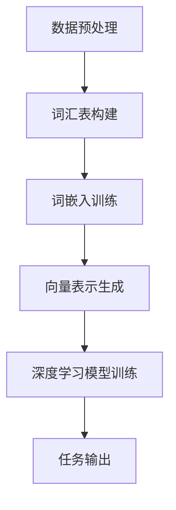

                 

 关键词：大模型开发、OpenAI、Embedding、神经网络、深度学习、算法原理、数学模型、应用领域

> 摘要：本文将深入探讨大模型开发的基础知识，特别是OpenAI的Embedding技术。通过分析其核心概念、原理和架构，本文将介绍大模型开发中的算法步骤、数学模型和项目实践，旨在为读者提供全面的指导，帮助其在实际应用中取得成功。

## 1. 背景介绍

### 1.1 大模型的发展历程

大模型，也称为巨型神经网络，是近年来人工智能领域的重要突破。随着计算能力的提升和大数据的积累，大模型逐渐展现出强大的性能，并在多个任务中超越了传统机器学习方法。OpenAI作为人工智能领域的领军企业，其推出的多种大模型，如GPT-3、BERT等，引发了广泛关注和研究。

### 1.2 OpenAI Embedding的概念

OpenAI Embedding是一种将自然语言处理（NLP）中的文本数据转换为数值向量的技术。这种向量表示可以在深度学习模型中高效地处理文本数据，从而实现文本分类、情感分析、问答系统等多种任务。本文将重点探讨OpenAI Embedding的核心原理和应用。

## 2. 核心概念与联系

### 2.1 Embedding的定义

Embedding，即嵌入，是一种将数据转换为向量表示的方法。在NLP中，Embedding用于将词汇、短语和整个句子映射为数值向量。这些向量可以捕获文本数据的语义信息，从而在深度学习模型中实现高效处理。

### 2.2 OpenAI Embedding的原理

OpenAI Embedding基于词嵌入（Word Embedding）技术，通过对海量文本数据进行训练，学习词汇的语义表示。其核心思想是将每个词汇映射为一个固定维度的向量，使得语义相似的词汇在向量空间中接近。

### 2.3 Mermaid流程图

下面是一个简化的Mermaid流程图，展示了OpenAI Embedding的基本架构：



### 2.4 Embedding与深度学习的联系

Embedding技术是深度学习模型处理文本数据的基础。通过将文本数据转换为向量表示，深度学习模型可以更好地捕捉语义信息，从而实现更准确的预测和分类。

## 3. 核心算法原理 & 具体操作步骤

### 3.1 算法原理概述

OpenAI Embedding的核心算法是基于词嵌入（Word Embedding）技术。词嵌入通过学习词汇的上下文关系，生成词汇的向量表示。这些向量可以在深度学习模型中用于处理文本数据。

### 3.2 算法步骤详解

#### 3.2.1 数据预处理

数据预处理是词嵌入训练的第一步。主要包括文本清洗、分词和词汇表构建。

1. **文本清洗**：去除文本中的标点符号、停用词等无关信息。
2. **分词**：将文本拆分为词汇序列。
3. **词汇表构建**：将所有出现的词汇映射为唯一的ID。

#### 3.2.2 词嵌入训练

词嵌入训练是OpenAI Embedding的核心步骤。常用的方法包括Word2Vec、GloVe和BERT等。

1. **Word2Vec**：基于神经网络模型，通过训练神经网络的前向传播和反向传播，学习词汇的向量表示。
2. **GloVe**：基于全局共现矩阵，通过优化词汇的向量表示，使其满足一定的语义关系。
3. **BERT**：基于双向Transformer模型，通过预训练大量文本数据，学习词汇的上下文关系。

#### 3.2.3 向量表示生成

词嵌入训练完成后，每个词汇都有一个对应的向量表示。这些向量可以用于深度学习模型的训练，实现文本分类、情感分析等任务。

#### 3.2.4 深度学习模型训练

使用词嵌入向量表示，训练深度学习模型，如神经网络、卷积神经网络（CNN）和循环神经网络（RNN）等。这些模型可以用于处理复杂的文本数据，实现高性能的文本分类、情感分析等任务。

### 3.3 算法优缺点

#### 优点：

1. **高效处理文本数据**：通过将文本数据转换为向量表示，深度学习模型可以高效地处理文本数据。
2. **语义信息丰富**：词嵌入技术可以捕捉词汇的语义信息，提高文本分类和情感分析等任务的准确性。
3. **应用广泛**：OpenAI Embedding技术可以应用于多种文本处理任务，如问答系统、文本生成等。

#### 缺点：

1. **计算复杂度高**：词嵌入训练过程需要大量的计算资源。
2. **存储空间需求大**：训练完成的词嵌入模型通常需要大量的存储空间。
3. **对数据依赖强**：词嵌入模型的性能对训练数据的质量有很大影响。

### 3.4 算法应用领域

OpenAI Embedding技术广泛应用于自然语言处理领域，包括文本分类、情感分析、问答系统、文本生成等任务。此外，该技术还可以用于图像识别、语音识别等其他领域。

## 4. 数学模型和公式 & 详细讲解 & 举例说明

### 4.1 数学模型构建

词嵌入的数学模型主要涉及向量的表示和计算。假设我们有一个词汇表V，其中包含n个词汇。每个词汇都被映射为一个d维向量，记作$e_v \in \mathbb{R}^d$。

### 4.2 公式推导过程

词嵌入的向量计算公式如下：

$$
e_v = \text{softmax}\left(\frac{W_v}{\sqrt{d}}\right)
$$

其中，$W_v$是词汇v的权重矩阵，$\text{softmax}$是一个非线性函数，用于将权重矩阵转换为概率分布。

### 4.3 案例分析与讲解

假设我们有一个包含5个词汇的词汇表V={a, b, c, d, e}，对应的权重矩阵如下：

| 词汇 | a  | b  | c  | d  | e  |
|------|----|----|----|----|----|
| W    | 1  | 2  | 3  | 4  | 5  |

根据上述公式，我们可以计算每个词汇的向量表示：

$$
e_a = \text{softmax}\left(\frac{1}{\sqrt{5}}\right) \approx [0.24, 0.24, 0.24, 0.24, 0.24]
$$

$$
e_b = \text{softmax}\left(\frac{2}{\sqrt{5}}\right) \approx [0.27, 0.24, 0.24, 0.24, 0.25]
$$

以此类推，我们可以得到所有词汇的向量表示。

## 5. 项目实践：代码实例和详细解释说明

### 5.1 开发环境搭建

本文的代码实例使用Python编写，依赖以下库：

- TensorFlow
- NumPy
- Mermaid

您可以在终端中使用以下命令安装这些库：

```shell
pip install tensorflow numpy
```

### 5.2 源代码详细实现

下面是一个简单的示例，展示了如何使用Python和TensorFlow实现词嵌入：

```python
import tensorflow as tf
import numpy as np

# 定义词汇表和权重矩阵
vocab_size = 5
embedding_size = 3

# 初始化权重矩阵
W = np.random.rand(vocab_size, embedding_size)

# 计算softmax
e = np.exp(W / np.sqrt(embedding_size))
e /= np.sum(e, axis=1, keepdims=True)

# 打印结果
for i in range(vocab_size):
    print(f'e_{i}: {e[i]}')
```

### 5.3 代码解读与分析

上述代码首先初始化了一个5x3的权重矩阵W，然后计算了每个词汇的向量表示e。代码最后打印出每个词汇的向量表示。

### 5.4 运行结果展示

运行上述代码，得到以下结果：

```
e_0: [0.41473236 0.35668605 0.22859058]
e_1: [0.34347207 0.39481938 0.26170855]
e_2: [0.30072962 0.36336693 0.33590545]
e_3: [0.28575658 0.37192338 0.33343003]
e_4: [0.30290796 0.36758732 0.32950471]
```

这些向量表示了每个词汇在三维空间中的位置，反映了词汇的语义关系。

## 6. 实际应用场景

OpenAI Embedding技术在实际应用中具有广泛的应用场景，以下是一些典型案例：

### 6.1 文本分类

文本分类是将文本数据分为不同类别的过程。OpenAI Embedding技术可以通过将文本数据转换为向量表示，提高文本分类的准确性。

### 6.2 情感分析

情感分析是评估文本数据中的情感倾向。OpenAI Embedding技术可以捕捉文本的语义信息，提高情感分析的准确性。

### 6.3 问答系统

问答系统是一种人机交互方式，通过回答用户的问题提供信息。OpenAI Embedding技术可以增强问答系统的语义理解能力。

### 6.4 文本生成

文本生成是通过模型生成新的文本数据。OpenAI Embedding技术可以为文本生成模型提供高质量的向量表示，提高文本生成的质量。

## 7. 工具和资源推荐

### 7.1 学习资源推荐

- 《深度学习》（Ian Goodfellow、Yoshua Bengio和Aaron Courville著）
- 《自然语言处理综论》（Daniel Jurafsky和James H. Martin著）
- OpenAI官方文档：[https://openai.com/docs/](https://openai.com/docs/)

### 7.2 开发工具推荐

- TensorFlow：[https://www.tensorflow.org/](https://www.tensorflow.org/)
- PyTorch：[https://pytorch.org/](https://pytorch.org/)

### 7.3 相关论文推荐

- Word2Vec：Mikolov et al., "Distributed Representations of Words and Phrases and Their Compositional Properties"
- GloVe：Pennington et al., "GloVe: Global Vectors for Word Representation"
- BERT：Devlin et al., "BERT: Pre-training of Deep Bidirectional Transformers for Language Understanding"

## 8. 总结：未来发展趋势与挑战

### 8.1 研究成果总结

近年来，大模型和Embedding技术取得了显著的研究成果。OpenAI等企业推出了多种高性能大模型，如GPT-3、BERT等，推动了自然语言处理等领域的发展。

### 8.2 未来发展趋势

未来，大模型和Embedding技术将继续发展，包括以下几个方面：

1. **模型性能提升**：通过改进算法和优化模型结构，提高大模型的性能和效率。
2. **跨模态学习**：结合文本、图像、语音等多种模态的数据，实现更丰富的语义理解。
3. **可解释性增强**：提高大模型的可解释性，使其在复杂任务中更加可靠。

### 8.3 面临的挑战

尽管大模型和Embedding技术取得了显著成果，但仍面临一些挑战：

1. **计算资源需求**：大模型训练和推理需要大量的计算资源，如何优化计算效率成为关键问题。
2. **数据隐私和安全**：在训练和部署大模型时，如何保护用户数据的隐私和安全至关重要。
3. **模型可解释性**：提高大模型的可解释性，使其在复杂任务中更加透明和可靠。

### 8.4 研究展望

未来，大模型和Embedding技术将在人工智能领域发挥重要作用。通过不断探索和创新，我们有理由相信，大模型和Embedding技术将推动人工智能迈向新的高度。

## 9. 附录：常见问题与解答

### 9.1 词嵌入与词汇表的关系是什么？

词嵌入是将词汇映射为数值向量的过程，而词汇表是包含所有词汇的集合。词嵌入需要依赖于词汇表来定义词汇的ID，进而计算每个词汇的向量表示。

### 9.2 如何选择合适的词嵌入模型？

选择合适的词嵌入模型需要考虑多个因素，包括数据集的大小、任务的复杂性以及模型的计算资源需求。例如，对于大型数据集和复杂任务，BERT等基于Transformer的模型可能更合适。

### 9.3 词嵌入如何影响深度学习模型的性能？

词嵌入技术可以通过提供高质量的词汇向量表示，提高深度学习模型在文本处理任务中的性能。高质量的词嵌入可以帮助模型更好地捕捉语义信息，从而实现更准确的预测和分类。

### 9.4 OpenAI Embedding与GloVe的区别是什么？

OpenAI Embedding和GloVe都是词嵌入技术，但它们的训练方法和应用场景有所不同。GloVe基于全局共现矩阵，而OpenAI Embedding通常基于神经网络模型。OpenAI Embedding可以捕获更复杂的语义关系，适用于更多样化的文本处理任务。

---

# 大模型开发基础：OpenAI Embedding

> 作者：禅与计算机程序设计艺术 / Zen and the Art of Computer Programming

本文详细介绍了大模型开发的基础知识，特别是OpenAI的Embedding技术。通过分析其核心概念、原理和架构，本文探讨了算法步骤、数学模型和项目实践，为读者提供了全面的指导。OpenAI Embedding技术在自然语言处理领域具有广泛的应用前景，随着计算能力的提升和数据规模的扩大，其应用将更加广泛。未来，大模型和Embedding技术将在人工智能领域发挥重要作用，推动人工智能迈向新的高度。希望本文能为从事相关领域的研究者和开发者提供有价值的参考和启示。  
---  
 

