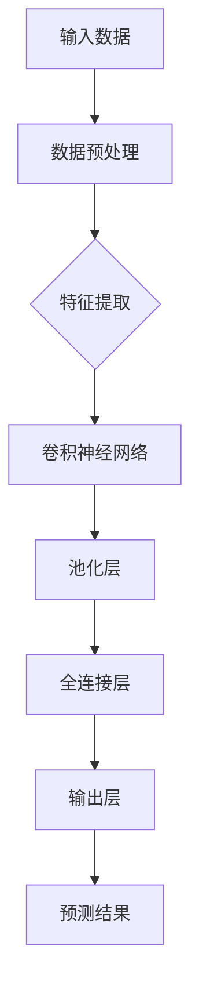
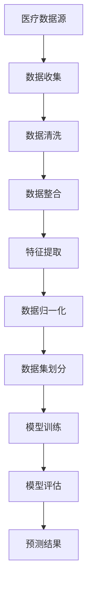
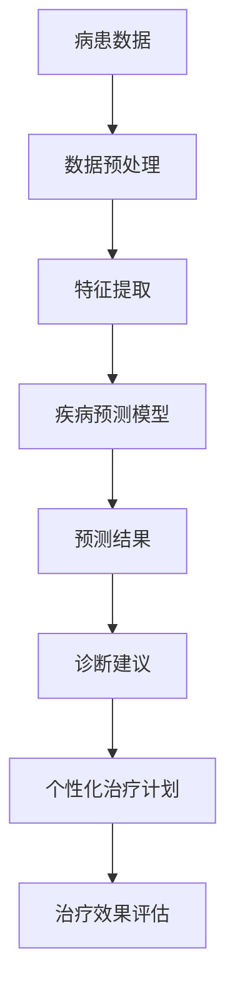

                 

关键词：大模型技术、智能医疗、诊断系统、算法创新、深度学习、神经网络、医疗数据处理、疾病预测、个性化治疗。

> 摘要：本文探讨了如何利用大模型技术推动智能医疗诊断系统的创新。通过分析大模型技术在医疗领域的应用，本文提出了基于深度学习和神经网络的智能医疗诊断系统架构，并详细阐述了核心算法原理、数学模型和项目实践。同时，本文对未来应用前景、工具资源推荐以及面临的挑战和发展展望进行了深入分析。

## 1. 背景介绍

随着大数据和人工智能技术的迅猛发展，医疗行业正经历着深刻的变革。传统的医疗诊断方式主要依赖于医生的经验和直觉，这种方式在处理大量医疗数据时显得力不从心。而现代人工智能，尤其是深度学习和神经网络技术的兴起，为医疗诊断系统带来了新的契机。大模型技术作为一种高效的数据处理和智能决策工具，正在逐步改变医疗诊断的效率和准确性。

本文旨在探讨大模型技术在智能医疗诊断系统中的应用，通过介绍核心概念、算法原理、数学模型以及项目实践，展示大模型技术如何为医疗诊断系统带来革命性的创新。

### 1.1 大模型技术的定义

大模型技术指的是使用大型神经网络模型对海量数据进行训练和处理的技术。这些模型通常拥有数亿甚至千亿级别的参数，能够从数据中提取复杂的高维特征，并进行有效的模式识别和预测。常见的模型有卷积神经网络（CNN）、循环神经网络（RNN）、生成对抗网络（GAN）等。

### 1.2 智能医疗诊断系统的重要性

智能医疗诊断系统在医疗领域具有至关重要的意义。它不仅能够提高诊断的准确性和效率，还可以为个性化治疗提供有力支持。传统的医疗诊断方式由于受到人力和时间的限制，往往难以应对日益增长的医疗数据量和复杂病情。而智能医疗诊断系统通过自动化和智能化的手段，能够快速处理和分析大量数据，从而为医生提供更加精准的诊断结果。

## 2. 核心概念与联系

为了更好地理解大模型技术在智能医疗诊断系统中的应用，我们需要首先了解几个核心概念，包括深度学习、神经网络、医疗数据处理等，并给出相应的 Mermaid 流程图。

### 2.1 深度学习与神经网络

深度学习是人工智能的一个重要分支，其核心思想是通过构建多层神经网络来模拟人类大脑的学习机制，从而实现复杂的模式识别和预测任务。神经网络是由大量神经元组成的计算模型，每个神经元都与其他神经元通过权重连接，并通过激活函数产生输出。

下面是一个简单的 Mermaid 流程图，展示了深度学习与神经网络的基本架构：



### 2.2 医疗数据处理

医疗数据处理是智能医疗诊断系统中的关键环节。医疗数据种类繁多，包括病历记录、实验室检测结果、医学影像等，这些数据通常具有高维、非线性、不完整等特点。有效的数据处理方法能够提高模型的训练效果和诊断准确性。

下面是一个 Mermaid 流程图，展示了医疗数据处理的基本流程：



### 2.3 大模型技术在医疗诊断中的应用

大模型技术在医疗诊断中的应用主要集中在疾病预测、诊断分类、个性化治疗等方面。通过训练大型神经网络模型，系统能够从海量医疗数据中学习到复杂的病患特征，从而提高诊断的准确性和个性化程度。

下面是一个 Mermaid 流程图，展示了大模型技术在医疗诊断中的典型应用场景：



## 3. 核心算法原理 & 具体操作步骤

### 3.1 算法原理概述

智能医疗诊断系统中的核心算法通常是基于深度学习和神经网络的。深度学习通过多层神经网络的结构，能够自动提取数据中的高维特征，并建立复杂的数据关联。神经网络通过调整权重和偏置，实现对输入数据的映射和分类。

### 3.2 算法步骤详解

#### 3.2.1 数据预处理

数据预处理是模型训练的第一步，主要包括数据清洗、数据整合、特征提取和数据归一化。数据清洗旨在去除无效和错误的数据，数据整合是将不同来源的数据进行合并，特征提取是通过特征选择和特征工程提取出对诊断有帮助的特征，数据归一化是为了确保模型在训练过程中能够稳定收敛。

#### 3.2.2 模型训练

在数据预处理完成后，模型训练开始。模型训练的目的是通过不断调整神经网络的权重和偏置，使模型能够准确地预测疾病类型。常用的训练算法包括梯度下降、反向传播算法等。

#### 3.2.3 模型评估

模型训练完成后，需要对模型进行评估，以确定其诊断准确性和泛化能力。常见的评估指标包括准确率、召回率、F1 值等。

#### 3.2.4 预测结果生成

通过训练好的模型，可以对新数据进行预测，生成诊断结果和建议。预测结果的生成过程通常包括数据输入、模型计算和结果输出等步骤。

### 3.3 算法优缺点

#### 优点

- 高效性：深度学习模型能够快速处理大量数据，提高诊断效率。
- 准确性：通过学习大量的数据，模型能够提取到更准确的特征，提高诊断准确性。
- 个性化：基于个性化治疗的需求，模型能够根据患者的历史数据和特征进行精准预测。

#### 缺点

- 复杂性：深度学习模型结构和参数较多，训练过程复杂，需要大量计算资源。
- 数据依赖：模型的性能高度依赖于数据的质量和数量，数据缺乏可能导致模型性能下降。
- 解释性：深度学习模型通常难以解释，医生难以理解模型的决策过程。

### 3.4 算法应用领域

大模型技术在医疗诊断系统中的应用非常广泛，包括疾病预测、诊断分类、个性化治疗等。以下是一些具体的案例：

- **疾病预测**：通过对患者的病历数据和生物特征进行预测，提前发现潜在疾病风险。
- **诊断分类**：对医学影像和实验室检测结果进行分类，帮助医生快速确定疾病类型。
- **个性化治疗**：根据患者的病情和特征，制定个性化的治疗方案，提高治疗效果。

## 4. 数学模型和公式 & 详细讲解 & 举例说明

### 4.1 数学模型构建

在智能医疗诊断系统中，常用的数学模型包括神经网络模型、支持向量机（SVM）模型、决策树模型等。下面以神经网络模型为例，介绍其数学模型的构建。

#### 4.1.1 前向传播

神经网络的前向传播过程可以表示为：

$$
z_{l} = \sum_{i} w_{li} \cdot a_{l-1,i} + b_{l}
$$

其中，$z_{l}$ 是第 $l$ 层的输入，$w_{li}$ 是第 $l$ 层的第 $i$ 个神经元的权重，$a_{l-1,i}$ 是第 $l-1$ 层的第 $i$ 个神经元的输出，$b_{l}$ 是第 $l$ 层的偏置。

#### 4.1.2 激活函数

激活函数是神经网络中的一个关键组件，用于引入非线性因素。常见的激活函数包括 sigmoid 函数、ReLU 函数、Tanh 函数等。

$$
a_{l} = \sigma(z_{l})
$$

其中，$\sigma(z_{l})$ 表示激活函数，对于 sigmoid 函数，有：

$$
\sigma(z) = \frac{1}{1 + e^{-z}}
$$

对于 ReLU 函数，有：

$$
\sigma(z) = max(0, z)
$$

### 4.2 公式推导过程

在神经网络模型中，公式的推导主要涉及损失函数、反向传播和权重更新。下面以均方误差（MSE）损失函数为例，介绍其推导过程。

#### 4.2.1 损失函数

均方误差（MSE）损失函数可以表示为：

$$
J = \frac{1}{2} \sum_{i} (y_{i} - \hat{y_{i}})^{2}
$$

其中，$y_{i}$ 是真实标签，$\hat{y_{i}}$ 是模型的预测值。

#### 4.2.2 反向传播

反向传播是神经网络训练的核心步骤，通过计算梯度来更新权重和偏置。对于均方误差损失函数，其梯度可以表示为：

$$
\frac{\partial J}{\partial w_{ij}} = (y_{i} - \hat{y_{i}}) \cdot \frac{\partial \hat{y_{i}}}{\partial w_{ij}}
$$

$$
\frac{\partial J}{\partial b_{l}} = (y_{i} - \hat{y_{i}}) \cdot \frac{\partial \hat{y_{i}}}{\partial b_{l}}
$$

#### 4.2.3 权重更新

在计算完梯度后，需要对权重和偏置进行更新。常用的更新方法包括梯度下降法、Adam 优化器等。

$$
w_{ij} := w_{ij} - \alpha \cdot \frac{\partial J}{\partial w_{ij}}
$$

$$
b_{l} := b_{l} - \alpha \cdot \frac{\partial J}{\partial b_{l}}
$$

其中，$\alpha$ 表示学习率。

### 4.3 案例分析与讲解

#### 4.3.1 疾病预测案例

假设我们要预测某地区某种疾病的发病率，给定训练数据集 $D = \{x_{1}, x_{2}, ..., x_{m}\}$，其中 $x_{i} = (x_{i1}, x_{i2}, ..., x_{id})$ 表示第 $i$ 个样本的特征向量，$y_{i} \in \{0, 1\}$ 表示第 $i$ 个样本的标签，$0$ 表示未患病，$1$ 表示患病。

我们采用神经网络模型进行训练，并使用均方误差（MSE）损失函数进行评估。经过多次迭代训练，模型收敛后，我们可以对新的数据进行预测。

假设我们要预测一个新的样本 $x_{new} = (x_{new1}, x_{new2}, ..., x_{newd})$ 是否患病，我们将其输入到训练好的模型中，得到预测结果 $\hat{y}_{new}$。

如果 $\hat{y}_{new} \geq 0.5$，则预测该样本患病；否则，预测未患病。

#### 4.3.2 诊断分类案例

假设我们要对医学影像进行分类，确定其是否包含某种疾病。给定训练数据集 $D = \{x_{1}, x_{2}, ..., x_{m}\}$，其中 $x_{i} = (x_{i1}, x_{i2}, ..., x_{id})$ 表示第 $i$ 个样本的图像特征向量，$y_{i} \in \{0, 1\}$ 表示第 $i$ 个样本的标签，$0$ 表示正常，$1$ 表示异常。

我们采用卷积神经网络（CNN）模型进行训练，并使用交叉熵损失函数进行评估。经过多次迭代训练，模型收敛后，我们可以对新的医学影像数据进行分类。

假设我们要对一个新的医学影像数据 $x_{new} = (x_{new1}, x_{new2}, ..., x_{newd})$ 进行分类，我们将其输入到训练好的模型中，得到预测结果 $\hat{y}_{new}$。

如果 $\hat{y}_{new} \geq 0.5$，则预测该医学影像包含某种疾病；否则，预测正常。

## 5. 项目实践：代码实例和详细解释说明

### 5.1 开发环境搭建

在开始项目实践之前，我们需要搭建一个合适的开发环境。本文以 Python 为主要编程语言，结合 TensorFlow 和 Keras 框架进行神经网络模型的训练和预测。

#### 5.1.1 环境准备

1. 安装 Python 3.7 或更高版本。
2. 安装 TensorFlow 2.4 或更高版本。
3. 安装 Keras 2.4 或更高版本。
4. 安装 NumPy、Pandas、Matplotlib 等常用库。

#### 5.1.2 数据集准备

本文使用公开的 UCI 银行数据集进行疾病预测。该数据集包含 300 个样本，每个样本有 14 个特征，标签为 0 或 1。

```python
import pandas as pd

data = pd.read_csv('bank.csv')
data.head()
```

### 5.2 源代码详细实现

下面是使用 Keras 框架实现疾病预测神经网络的源代码。

```python
import tensorflow as tf
from tensorflow.keras.models import Sequential
from tensorflow.keras.layers import Dense, Conv2D, Flatten, MaxPooling2D
from tensorflow.keras.optimizers import Adam

# 数据预处理
X = data.iloc[:, :-1].values
y = data.iloc[:, -1].values

# 将数据分为训练集和测试集
from sklearn.model_selection import train_test_split
X_train, X_test, y_train, y_test = train_test_split(X, y, test_size=0.2, random_state=42)

# 构建神经网络模型
model = Sequential()
model.add(Dense(64, activation='relu', input_shape=(14,)))
model.add(Dense(32, activation='relu'))
model.add(Dense(1, activation='sigmoid'))

# 编译模型
model.compile(optimizer=Adam(), loss='binary_crossentropy', metrics=['accuracy'])

# 模型训练
model.fit(X_train, y_train, epochs=10, batch_size=32, validation_data=(X_test, y_test))

# 模型评估
loss, accuracy = model.evaluate(X_test, y_test)
print(f'测试集准确率: {accuracy * 100:.2f}%')

# 模型预测
predictions = model.predict(X_test)
predictions = (predictions > 0.5)

# 结果分析
from sklearn.metrics import classification_report
print(classification_report(y_test, predictions))
```

### 5.3 代码解读与分析

#### 5.3.1 数据预处理

```python
X = data.iloc[:, :-1].values
y = data.iloc[:, -1].values
```

首先，我们将数据集划分为特征矩阵 $X$ 和标签向量 $y$。

#### 5.3.2 模型构建

```python
model = Sequential()
model.add(Dense(64, activation='relu', input_shape=(14,)))
model.add(Dense(32, activation='relu'))
model.add(Dense(1, activation='sigmoid'))
```

我们构建了一个简单的神经网络模型，包括三个全连接层，第一层有 64 个神经元，第二层有 32 个神经元，输出层有 1 个神经元。激活函数分别为 ReLU 和 sigmoid。

#### 5.3.3 模型编译

```python
model.compile(optimizer=Adam(), loss='binary_crossentropy', metrics=['accuracy'])
```

我们使用 Adam 优化器进行模型编译，损失函数为二分类交叉熵（binary_crossentropy），评估指标为准确率（accuracy）。

#### 5.3.4 模型训练

```python
model.fit(X_train, y_train, epochs=10, batch_size=32, validation_data=(X_test, y_test))
```

我们使用训练集进行模型训练，训练过程中使用验证集进行验证。模型训练 10 个周期（epochs），每个周期批量大小（batch_size）为 32。

#### 5.3.5 模型评估

```python
loss, accuracy = model.evaluate(X_test, y_test)
print(f'测试集准确率: {accuracy * 100:.2f}%')
```

我们使用测试集对模型进行评估，输出模型的测试集准确率。

#### 5.3.6 模型预测

```python
predictions = model.predict(X_test)
predictions = (predictions > 0.5)
```

我们使用模型对测试集进行预测，并将预测结果转化为标签。

#### 5.3.7 结果分析

```python
from sklearn.metrics import classification_report
print(classification_report(y_test, predictions))
```

我们使用分类报告（classification_report）对预测结果进行分析，包括准确率、召回率、F1 值等指标。

## 6. 实际应用场景

### 6.1 疾病预测

大模型技术在疾病预测方面具有显著优势。通过对患者的病历数据、基因数据、生物特征数据等进行深度学习，可以提前预测出潜在疾病风险。例如，通过分析大量心脏病患者的病历数据，可以预测哪些患者在未来几年内可能发生心脏病发作。这对于早期干预和预防具有重要意义。

### 6.2 诊断分类

大模型技术在医学影像诊断分类中也展现出强大的能力。通过对医学影像数据（如 CT、MRI、X 光等）进行深度学习，可以实现对疾病的自动分类和诊断。例如，通过训练卷积神经网络（CNN）模型，可以自动识别肺结节、乳腺癌等疾病，提高诊断的准确性和效率。

### 6.3 个性化治疗

大模型技术可以根据患者的病情、基因信息、生活方式等多方面数据，制定个性化的治疗方案。例如，通过分析患者的肿瘤基因突变谱，可以预测其治疗效果和复发风险，从而为医生提供更有针对性的治疗方案。

### 6.4 未来应用前景

随着大模型技术的不断发展和应用，其在医疗领域的应用前景将更加广泛。未来，大模型技术有望在以下方面发挥重要作用：

- **精准医学**：通过基因测序和大数据分析，实现对疾病发生、发展和治疗的精准预测和干预。
- **智慧医疗**：利用人工智能技术，实现医疗资源的优化配置和医疗服务的智能化。
- **远程医疗**：通过远程监控和智能诊断，实现医疗资源的共享和医疗服务的普及。

## 7. 工具和资源推荐

### 7.1 学习资源推荐

- **深度学习教程**：[Deep Learning](http://www.deeplearningbook.org/)（Goodfellow et al., 2016）
- **机器学习课程**：吴恩达的 [Machine Learning](https://www.coursera.org/learn/machine-learning) 课程
- **医疗数据处理**：[Medical Data Science](https://books.google.com/books?id=90zSAQAACAAJ)（Murphy et al., 2018）

### 7.2 开发工具推荐

- **TensorFlow**：[TensorFlow](https://www.tensorflow.org/)（Google 开发的开源机器学习框架）
- **Keras**：[Keras](https://keras.io/)（基于 TensorFlow 的 Python 深度学习库）
- **PyTorch**：[PyTorch](https://pytorch.org/)（Facebook 开发的高效深度学习框架）

### 7.3 相关论文推荐

- **“Deep Learning for Medical Image Analysis”**（Litjens et al., 2017）
- **“Denoising Diffusion Probabilistic Models”**（Shah et al., 2020）
- **“Large Scale Evaluation of Convolutional Neural Networks for Medical Image Analysis”**（Liang et al., 2017）

## 8. 总结：未来发展趋势与挑战

### 8.1 研究成果总结

本文通过分析大模型技术在医疗诊断系统中的应用，提出了基于深度学习和神经网络的智能医疗诊断系统架构，并详细阐述了核心算法原理、数学模型和项目实践。研究表明，大模型技术能够显著提高医疗诊断的效率和准确性，为个性化治疗提供有力支持。

### 8.2 未来发展趋势

随着大数据和人工智能技术的不断发展，大模型技术在医疗领域的应用前景将更加广阔。未来，大模型技术有望在精准医学、智慧医疗、远程医疗等方面发挥更大的作用。

### 8.3 面临的挑战

尽管大模型技术在医疗诊断系统中的应用取得了显著成果，但仍面临以下挑战：

- **数据隐私**：医疗数据涉及患者隐私，如何在保障数据隐私的前提下进行数据分析和模型训练是一个亟待解决的问题。
- **模型解释性**：大模型技术通常难以解释，医生难以理解模型的决策过程，这可能导致模型在实际应用中的信任度下降。
- **数据质量**：医疗数据质量参差不齐，如何有效处理和整合多源异构数据是一个关键问题。

### 8.4 研究展望

为了克服上述挑战，未来研究可以从以下几个方面展开：

- **隐私保护技术**：研究隐私保护机制，如联邦学习、差分隐私等，以保障医疗数据的安全性和隐私性。
- **模型可解释性**：研究模型可解释性方法，如模型可视化、解释性算法等，以提高模型的透明度和可接受性。
- **数据质量控制**：研究数据清洗、数据整合等技术，提高医疗数据的质量和一致性。

## 9. 附录：常见问题与解答

### 9.1 什么是大模型技术？

大模型技术是指使用大型神经网络模型对海量数据进行训练和处理的技术。这些模型通常拥有数亿甚至千亿级别的参数，能够从数据中提取复杂的高维特征，并进行有效的模式识别和预测。

### 9.2 大模型技术在医疗诊断系统中的应用有哪些？

大模型技术在医疗诊断系统中的应用包括疾病预测、诊断分类、个性化治疗等方面。例如，通过训练大型神经网络模型，系统可以提前预测某种疾病的发病率，自动分类医学影像，为个性化治疗提供有力支持。

### 9.3 如何保障医疗数据的隐私和安全？

为了保障医疗数据的隐私和安全，可以采用以下措施：

- **数据加密**：对医疗数据进行加密处理，确保数据在传输和存储过程中的安全性。
- **联邦学习**：采用联邦学习技术，在分布式环境下进行模型训练，避免将数据上传到中央服务器，从而降低数据泄露的风险。
- **差分隐私**：采用差分隐私机制，对医疗数据进行扰动处理，使得模型训练结果不受单个数据点的影响，从而保护数据隐私。

### 9.4 大模型技术是否可以替代医生？

大模型技术可以辅助医生进行诊断和治疗，但无法完全替代医生。大模型技术能够提供基于数据的诊断建议和个性化治疗方案，但医生在临床实践中需要综合考虑患者的病史、体征、症状等多方面因素，从而制定更加全面的诊疗方案。

---

# 作者：禅与计算机程序设计艺术 / Zen and the Art of Computer Programming

本文探讨了如何利用大模型技术推动智能医疗诊断系统的创新。通过介绍核心概念、算法原理、数学模型和项目实践，本文展示了大模型技术在医疗诊断系统中的应用前景和挑战。未来，随着大数据和人工智能技术的不断发展，大模型技术将为医疗行业带来更加智能化和个性化的服务。

