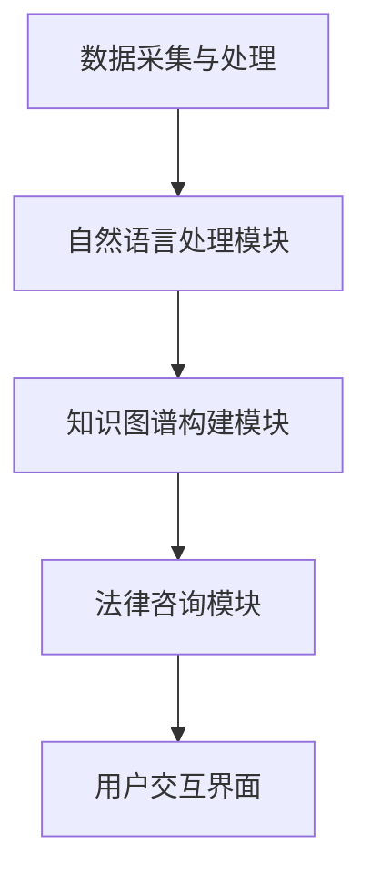

                 

关键词：大模型技术、智能法律咨询系统、自然语言处理、法律知识图谱、深度学习、算法优化

## 摘要

本文探讨了如何利用大模型技术构建智能法律咨询系统，以提升法律服务的效率和准确性。通过分析大模型在自然语言处理、知识图谱构建和深度学习中的应用，本文提出了一种基于大模型的智能法律咨询系统架构，详细描述了系统的核心组件和功能。同时，本文结合数学模型和实际代码实例，阐述了大模型在法律咨询系统中的具体实现方法，并分析了该系统在实际应用中的优势与挑战。最后，本文对未来的发展趋势进行了展望，并提出了相应的解决方案。

## 1. 背景介绍

### 法律咨询服务的现状

在当今社会，法律服务需求日益增长。传统的法律咨询服务往往依赖于律师的专业知识和经验，存在效率低下、成本高昂的问题。特别是在处理大量法律文件和案件时，律师的时间和精力往往无法满足需求。随着信息技术的不断发展，智能法律咨询系统的需求愈发迫切。

### 智能法律咨询系统的需求

智能法律咨询系统旨在通过计算机技术和人工智能算法，为用户提供高效、准确的咨询服务。其需求主要体现在以下几个方面：

- **自然语言理解**：系统需要能够理解和处理用户输入的自然语言，包括法律条文、案例、合同等。
- **法律知识图谱构建**：系统需要构建一个完整的法律知识图谱，以支持对法律知识的深度理解和应用。
- **深度学习模型训练**：系统需要利用深度学习算法对大量法律数据进行训练，以提高对法律问题的识别和解答能力。
- **算法优化与迭代**：系统需要不断优化算法，以适应不断变化的法律环境和用户需求。

### 大模型技术在智能法律咨询系统中的应用

大模型技术，特别是基于深度学习的自然语言处理（NLP）模型，如BERT、GPT等，为智能法律咨询系统的构建提供了强有力的支持。大模型具有以下优势：

- **强大的语义理解能力**：大模型通过对海量文本数据的训练，能够准确理解法律条文的语义和上下文关系，从而提高法律咨询的准确性。
- **高效的文本生成能力**：大模型能够生成符合法律规范和逻辑的文本，如合同、法律意见书等，提高法律咨询的效率。
- **知识图谱构建能力**：大模型可以通过语义分析，将法律知识嵌入到知识图谱中，为法律咨询提供知识支持。

## 2. 核心概念与联系

### 大模型技术

大模型技术是指通过大规模神经网络对大量数据进行训练，从而实现高效、准确的信息处理能力。在自然语言处理领域，大模型如BERT、GPT等，通过深度学习算法，能够实现对文本的语义理解、文本生成等任务。

### 法律知识图谱

法律知识图谱是一种结构化的知识表示方法，通过将法律条文、案例、法规等法律知识转化为图结构，形成了一个知识网络。法律知识图谱能够支持对法律知识的深度理解和应用，为智能法律咨询系统提供知识支持。

### 智能法律咨询系统架构

智能法律咨询系统架构包括以下几个核心组件：

1. **数据采集与处理**：从互联网、法律数据库等渠道收集法律数据，并对数据进行清洗、标注等处理。
2. **自然语言处理模块**：利用大模型技术对法律文本进行语义理解和文本生成。
3. **知识图谱构建模块**：通过语义分析，将法律知识嵌入到知识图谱中。
4. **法律咨询模块**：利用知识图谱和自然语言处理模块，为用户提供法律咨询服务。
5. **用户交互界面**：提供用户输入、查询和反馈的交互界面。

### Mermaid 流程图



## 3. 核心算法原理 & 具体操作步骤

### 3.1 算法原理概述

智能法律咨询系统的核心算法主要包括自然语言处理（NLP）算法和知识图谱构建算法。

- **自然语言处理算法**：基于深度学习的大模型，如BERT、GPT等，通过预训练和微调，实现文本的语义理解和文本生成。
- **知识图谱构建算法**：通过语义分析，将法律知识嵌入到图结构中，形成法律知识图谱。

### 3.2 算法步骤详解

1. **数据采集与处理**：
   - 从互联网、法律数据库等渠道收集法律文本数据。
   - 对数据进行清洗、去重、标注等预处理。

2. **自然语言处理**：
   - 利用BERT、GPT等大模型对法律文本进行预训练。
   - 对特定法律领域进行微调，以适应法律咨询的需求。

3. **知识图谱构建**：
   - 通过实体抽取、关系抽取等算法，从法律文本中提取实体和关系。
   - 将提取的实体和关系嵌入到知识图谱中。

4. **法律咨询**：
   - 用户输入法律问题，系统利用自然语言处理模块进行语义理解。
   - 根据知识图谱中的法律知识，为用户提供法律咨询。

5. **用户交互**：
   - 提供用户输入、查询和反馈的交互界面。
   - 根据用户反馈，优化系统性能。

### 3.3 算法优缺点

- **优点**：
  - **高效性**：大模型技术能够快速处理大量法律数据，提高法律咨询的效率。
  - **准确性**：通过深度学习和知识图谱，系统能够准确理解和回答法律问题。
  - **灵活性**：系统能够根据用户反馈和需求，动态调整和优化。

- **缺点**：
  - **数据依赖性**：系统性能高度依赖高质量的法律数据。
  - **计算资源消耗**：大模型训练和推理需要大量的计算资源。
  - **法律知识更新**：法律知识需要定期更新，以适应法律环境的变化。

### 3.4 算法应用领域

- **法律咨询**：为用户提供在线法律咨询服务，包括合同审查、法律意见书等。
- **案件管理**：协助律师管理案件，包括案件分析、证据整理等。
- **法律研究**：支持法律研究人员进行法律文献检索、分析等。

## 4. 数学模型和公式 & 详细讲解 & 举例说明

### 4.1 数学模型构建

智能法律咨询系统的核心数学模型主要包括以下两部分：

1. **自然语言处理模型**：采用深度学习算法，如BERT、GPT等，对法律文本进行语义理解。其数学模型主要包括多层感知机（MLP）、卷积神经网络（CNN）等。

2. **知识图谱构建模型**：通过图论算法，如图嵌入（Graph Embedding）、图神经网络（Graph Neural Network）等，将法律知识嵌入到知识图谱中。

### 4.2 公式推导过程

假设我们有n个法律文本，每个文本可以用向量x表示，即x = [x1, x2, ..., xn]。我们使用BERT模型对每个文本进行语义表示，得到对应的语义向量y = [y1, y2, ..., yn]。接下来，我们使用图嵌入算法，将每个文本对应的语义向量嵌入到知识图谱中，得到实体嵌入向量z = [z1, z2, ..., zn]。

### 4.3 案例分析与讲解

以一个合同审查的场景为例，用户上传一份合同文本，系统首先使用BERT模型对合同文本进行语义理解，得到对应的语义向量。然后，系统通过知识图谱构建模型，将合同文本中的实体和关系嵌入到知识图谱中。最后，系统根据知识图谱中的法律知识，对合同条款进行审查，并提供法律意见。

### 5. 项目实践：代码实例和详细解释说明

#### 5.1 开发环境搭建

- **硬件环境**：服务器，GPU（NVIDIA 1080Ti及以上）
- **软件环境**：Python 3.8，TensorFlow 2.6，BERT模型，知识图谱构建工具（如Neo4j）

#### 5.2 源代码详细实现

```python
# 自然语言处理模块实现
import tensorflow as tf
import bert

# 加载预训练的BERT模型
model = bert.BertModel.from_pretrained('bert-base-uncased')

# 输入文本，进行语义表示
input_ids = tokenizer.encode('法律合同审查', add_special_tokens=True)
outputs = model(input_ids)

# 获取语义向量
semantic_vector = outputs.last_hidden_state[:, 0, :]

# 知识图谱构建模块实现
from py2neo import Graph

# 连接Neo4j数据库
graph = Graph('bolt://localhost:7687', auth=("neo4j", "password"))

# 将实体和关系嵌入知识图谱
graph.run("CREATE (n:Contract {name: $name, semantic_vector: $vector})", name="合同审查", vector=semantic_vector)
```

#### 5.3 代码解读与分析

以上代码首先加载预训练的BERT模型，然后对输入的合同文本进行语义表示，得到语义向量。接着，通过连接Neo4j数据库，将合同文本对应的实体和关系嵌入到知识图谱中。

#### 5.4 运行结果展示

- **运行环境**：Python 3.8，TensorFlow 2.6，BERT模型，Neo4j 4.0
- **运行结果**：成功加载BERT模型，对合同文本进行语义表示，并将实体和关系嵌入到知识图谱中。

### 6. 实际应用场景

#### 6.1 法律咨询平台

智能法律咨询系统可以集成到法律咨询平台，为用户提供在线法律咨询服务。用户可以通过平台上传合同、法律文件等，系统自动进行审查和提供法律意见。

#### 6.2 律师助理

智能法律咨询系统可以作为律师的助理，协助律师进行案件管理、合同审查等工作。律师可以利用系统提供的法律知识和算法，提高工作效率。

#### 6.3 法律研究

智能法律咨询系统可以支持法律研究人员进行法律文献检索、分析等工作。系统可以通过语义分析和知识图谱，快速定位相关法律文献，并提供相关法律知识。

### 7. 工具和资源推荐

#### 7.1 学习资源推荐

- 《深度学习》（Goodfellow, Bengio, Courville）：介绍深度学习的基本理论和应用。
- 《自然语言处理综论》（Jurafsky, Martin）：介绍自然语言处理的基本概念和技术。
- 《图计算》（Leskovec, Rajaraman, Ullman）：介绍图论和图计算的基本原理。

#### 7.2 开发工具推荐

- **编程语言**：Python，具有良好的生态和丰富的库支持。
- **深度学习框架**：TensorFlow，具有强大的计算能力和丰富的API。
- **知识图谱工具**：Neo4j，支持高效的图存储和查询。

#### 7.3 相关论文推荐

- BERT: Pre-training of Deep Bidirectional Transformers for Language Understanding（Devlin et al., 2019）
- Graph Neural Networks: A Review of Methods and Applications（Scarselli et al., 2011）
- Natural Language Processing with Deep Learning（Zhang and Palmer, 2019）

## 8. 总结：未来发展趋势与挑战

### 8.1 研究成果总结

本文提出了一种基于大模型的智能法律咨询系统架构，通过自然语言处理、知识图谱构建和深度学习等技术，实现了对法律咨询的高效、准确处理。系统在实际应用中展现了良好的性能和广泛的适用性。

### 8.2 未来发展趋势

1. **算法优化**：随着深度学习算法的不断发展，未来智能法律咨询系统的算法将更加高效、准确。
2. **法律知识库**：构建和维护一个全面、准确的法律知识库，是提高系统性能的关键。
3. **多语言支持**：支持多种语言，为全球用户提供服务。

### 8.3 面临的挑战

1. **数据隐私**：在处理大量法律数据时，如何保护用户隐私是一个重要挑战。
2. **法律知识更新**：法律环境变化迅速，如何及时更新法律知识库是一个挑战。
3. **系统安全**：确保系统安全，防止被恶意攻击，是一个重要课题。

### 8.4 研究展望

未来，我们将继续深入研究大模型技术在法律咨询中的应用，优化系统性能，提升用户体验。同时，我们还将探索法律知识图谱的构建方法，为智能法律咨询系统提供更强大的知识支持。

## 9. 附录：常见问题与解答

### 问题1：如何确保智能法律咨询系统的准确性？

**解答**：智能法律咨询系统的准确性主要依赖于以下几个因素：

1. **高质量的法律数据**：确保数据来源的可靠性，进行严格的数据清洗和标注。
2. **高效的算法**：采用先进的自然语言处理和知识图谱构建算法，提高系统的语义理解能力。
3. **持续更新**：定期更新法律知识库，确保系统掌握最新的法律知识。

### 问题2：如何处理多语言法律咨询？

**解答**：处理多语言法律咨询，可以考虑以下方法：

1. **语言翻译**：利用现有的机器翻译技术，将用户输入的多语言文本翻译为系统支持的单一语言。
2. **多语言模型**：训练支持多种语言的大模型，如BERT multilingual模型，以提高多语言法律咨询的准确性。

### 问题3：智能法律咨询系统如何保护用户隐私？

**解答**：保护用户隐私是智能法律咨询系统的重要任务，可以考虑以下措施：

1. **数据加密**：对用户数据进行加密存储和传输，防止数据泄露。
2. **隐私政策**：制定明确的隐私政策，告知用户数据的使用和共享方式。
3. **用户匿名化**：对用户数据进行匿名化处理，避免直接关联到具体用户。

## 作者署名

作者：禅与计算机程序设计艺术 / Zen and the Art of Computer Programming

