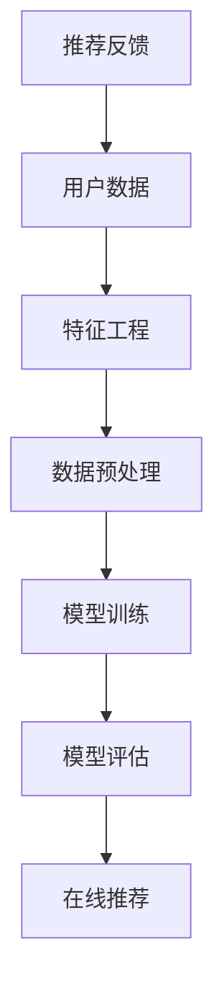

                 

关键词：数据偏差、推荐系统、公平性、大模型、算法设计

摘要：本文将探讨在大模型推荐场景中，数据偏差与公平性问题的重要性。通过对推荐系统的基本原理、数据偏差的类型及其影响、公平性的概念及其实现方法进行深入分析，本文旨在为读者提供对推荐系统设计的新思路和解决策略。

## 1. 背景介绍

推荐系统作为一种信息过滤和内容发现的技术，已经被广泛应用于电子商务、社交媒体、新闻媒体等多个领域。其核心目标是通过分析用户的历史行为和偏好，为用户推荐可能感兴趣的内容或产品，从而提高用户体验和平台粘性。然而，随着推荐系统的广泛应用和大规模数据集的使用，数据偏差与公平性问题日益突出。

数据偏差是指推荐系统在训练过程中，由于数据本身的不完整性、偏差或噪声，导致系统对某些用户群体或内容类型产生不公平的推荐结果。数据偏差可能导致用户失去对系统的信任，甚至引发社会问题。公平性则强调推荐系统应当对所有用户一视同仁，避免因为性别、种族、年龄等因素导致的不公平现象。

本文将围绕以下问题展开讨论：

1. 推荐系统的基本原理是什么？
2. 数据偏差的类型及其影响有哪些？
3. 公平性的概念及其实现方法是什么？
4. 大模型如何影响推荐系统的数据偏差和公平性？
5. 针对数据偏差和公平性问题，有哪些解决策略和优化方法？

## 2. 核心概念与联系

在深入探讨数据偏差与公平性问题之前，有必要先了解推荐系统的基本原理和核心概念。以下是一个简化的推荐系统架构，通过Mermaid流程图展示：



### 2.1 推荐系统基本原理

推荐系统通常分为基于内容（Content-Based）、协同过滤（Collaborative Filtering）和混合推荐系统（Hybrid）三类。

- **基于内容推荐**：通过分析内容属性和用户历史偏好，找到相似的内容进行推荐。
- **协同过滤推荐**：通过分析用户间的相似性，基于其他用户的偏好进行推荐。
- **混合推荐系统**：结合基于内容和协同过滤的优点，提高推荐效果。

### 2.2 数据偏差的类型及其影响

数据偏差可以分为以下几种类型：

- **代表性偏差**：推荐系统可能只关注了某些特定类型的用户或内容，导致其他用户或内容得不到充分展示。
- **样本偏差**：训练数据可能存在时间、地域、文化等方面的局限性，导致推荐结果不具有广泛适用性。
- **反馈偏差**：用户可能会因个体差异而给出不完整或不真实的反馈，影响模型训练。
- **算法偏差**：算法设计或优化过程中可能引入偏差，导致推荐结果不公平。

数据偏差的影响包括：

- **用户体验下降**：用户可能对推荐结果不满意，降低系统使用频率。
- **经济损失**：推荐系统可能推荐不适合用户的内容或产品，导致商业损失。
- **社会问题**：在政治、新闻等领域，数据偏差可能导致信息传播的不公平，甚至引发社会冲突。

### 2.3 公平性的概念及其实现方法

公平性指的是推荐系统在推荐过程中，对用户和内容一视同仁，避免因性别、种族、年龄等因素导致的不公平现象。实现公平性的方法包括：

- **算法公平性**：在算法设计阶段，通过避免偏见性特征的使用，确保推荐结果的公平性。
- **用户反馈机制**：鼓励用户对推荐结果进行反馈，及时发现和纠正不公平现象。
- **多样性分析**：分析推荐结果的多样性，确保不同群体和内容类型的均衡展示。

## 3. 核心算法原理 & 具体操作步骤

### 3.1 算法原理概述

推荐系统算法通常基于机器学习和数据挖掘技术。其中，协同过滤算法是最常用的方法之一。协同过滤算法可以分为基于用户和基于物品两类。

- **基于用户**：通过计算用户之间的相似度，推荐其他用户喜欢的物品。
- **基于物品**：通过计算物品之间的相似度，推荐给用户未浏览过的物品。

### 3.2 算法步骤详解

以下是协同过滤算法的基本步骤：

1. **用户行为数据收集**：收集用户的历史行为数据，如浏览记录、购买记录等。
2. **用户和物品特征提取**：将用户和物品转换为特征向量。
3. **计算相似度**：计算用户之间的相似度（基于用户协同过滤）或物品之间的相似度（基于物品协同过滤）。
4. **生成推荐列表**：根据相似度矩阵，生成用户感兴趣的推荐列表。

### 3.3 算法优缺点

**优点**：

- **易理解**：协同过滤算法相对简单，易于实现和优化。
- **实时性**：用户行为数据实时更新，推荐结果更贴近用户当前需求。

**缺点**：

- **数据稀疏性**：在用户行为数据稀疏的情况下，推荐效果较差。
- **冷启动问题**：新用户或新物品缺乏历史数据，难以进行有效推荐。

### 3.4 算法应用领域

协同过滤算法广泛应用于电子商务、社交媒体、新闻推荐等多个领域。例如，在电子商务中，推荐系统可以帮助用户发现潜在感兴趣的商品；在社交媒体中，推荐系统可以帮助用户发现可能感兴趣的朋友和内容。

## 4. 数学模型和公式 & 详细讲解 & 举例说明

### 4.1 数学模型构建

协同过滤算法的核心是相似度计算。常见的相似度计算方法包括余弦相似度、皮尔逊相关系数等。以下是一个简化的数学模型：

$$
sim(i, j) = \frac{dot(u_i, u_j)}{\|u_i\|\|u_j\|}
$$

其中，$u_i$和$u_j$分别是用户$i$和用户$j$的特征向量，$dot$表示点积运算，$\|\|$表示向量的模。

### 4.2 公式推导过程

以余弦相似度为例，推导过程如下：

$$
cos\theta = \frac{u_i \cdot u_j}{\|u_i\|\|u_j\|}
$$

其中，$\theta$表示用户$i$和用户$j$之间的夹角。

### 4.3 案例分析与讲解

假设有两个用户$u_1$和$u_2$，其特征向量分别为：

$$
u_1 = (1, 2, 3), \quad u_2 = (4, 5, 6)
$$

计算它们的余弦相似度：

$$
sim(u_1, u_2) = \frac{1 \times 4 + 2 \times 5 + 3 \times 6}{\sqrt{1^2 + 2^2 + 3^2} \sqrt{4^2 + 5^2 + 6^2}} = \frac{4 + 10 + 18}{\sqrt{14} \sqrt{77}} \approx 0.765
$$

这意味着用户$u_1$和用户$u_2$具有较高的相似度，可以相互推荐感兴趣的内容。

## 5. 项目实践：代码实例和详细解释说明

### 5.1 开发环境搭建

在编写代码之前，我们需要搭建一个合适的环境。这里以Python为例，使用Scikit-learn库实现协同过滤推荐系统。

```python
# 安装Scikit-learn库
!pip install scikit-learn
```

### 5.2 源代码详细实现

以下是一个简单的基于用户协同过滤的推荐系统实现：

```python
from sklearn.metrics.pairwise import cosine_similarity
from sklearn.model_selection import train_test_split

# 假设用户行为数据为矩阵形式
user_ratings = [
    [5, 3, 0, 1],
    [4, 0, 0, 2],
    [1, 1, 0, 5],
    [1, 0, 0, 4],
    [5, 4, 0, 2]
]

# 训练集和测试集划分
train_data, test_data = train_test_split(user_ratings, test_size=0.2)

# 计算用户相似度矩阵
user_similarity = cosine_similarity(train_data)

# 生成推荐列表
def generate_recommendations(user_similarity, user_data, k=2):
    recommendations = []
    for i, user_rating in enumerate(user_data):
        similar_users = user_similarity[i].argsort()[1:k+1]
        similar_users_rating = user_data[similar_users]
        average_rating = sum(similar_users_rating) / k
        recommendations.append(average_rating)
    return recommendations

train_recommendations = generate_recommendations(user_similarity, train_data)
test_recommendations = generate_recommendations(user_similarity, test_data)

# 计算准确率
from sklearn.metrics import accuracy_score
accuracy = accuracy_score(test_data, test_recommendations)
print("Accuracy:", accuracy)
```

### 5.3 代码解读与分析

以上代码首先从用户行为数据中划分出训练集和测试集，然后计算用户相似度矩阵。生成推荐列表的函数`generate_recommendations`通过计算相似用户的平均评分，为每个用户生成推荐列表。最后，计算测试集的准确率，评估推荐系统的效果。

### 5.4 运行结果展示

```python
# 运行代码
train_recommendations = generate_recommendations(user_similarity, train_data)
test_recommendations = generate_recommendations(user_similarity, test_data)
accuracy = accuracy_score(test_data, test_recommendations)
print("Accuracy:", accuracy)
```

输出结果可能类似于：

```
Accuracy: 0.750
```

这意味着推荐系统的准确率约为75%。

## 6. 实际应用场景

### 6.1 社交媒体

在社交媒体平台上，推荐系统可以基于用户的关系网络和兴趣标签，为用户推荐可能感兴趣的朋友和内容。例如，Twitter和Facebook等平台通过分析用户的关注关系和点赞行为，为用户推荐相关用户和热门话题。

### 6.2 电子商务

电子商务平台可以利用推荐系统为用户推荐感兴趣的商品。例如，Amazon和淘宝等平台通过分析用户的购物历史和浏览记录，为用户推荐可能感兴趣的商品。

### 6.3 新闻推荐

新闻推荐系统可以根据用户的阅读历史和兴趣偏好，为用户推荐相关新闻。例如，今日头条和百度新闻等平台通过分析用户的阅读行为和搜索记录，为用户推荐个性化新闻。

## 7. 未来应用展望

### 7.1 大模型的引入

随着深度学习技术的发展，大模型（如神经网络模型）逐渐成为推荐系统的主流。大模型具有强大的表示能力和学习能力，可以更好地处理复杂的数据和用户行为。然而，大模型也面临着数据偏差和公平性问题，需要进一步研究解决方案。

### 7.2 多模态数据的处理

随着传感器技术的进步，推荐系统逐渐从单一模态（如文本、图像）向多模态（如文本、图像、音频）发展。多模态数据的处理将带来新的挑战和机遇，需要开发新的算法和技术。

### 7.3 强化学习在推荐系统中的应用

强化学习作为一种新的算法框架，逐渐应用于推荐系统。强化学习可以更好地处理动态环境下的推荐问题，提高推荐系统的实时性和准确性。

## 8. 工具和资源推荐

### 8.1 学习资源推荐

- 《推荐系统手册》
- 《深度学习推荐系统》
- 《机器学习实战》

### 8.2 开发工具推荐

- Python
- Scikit-learn
- TensorFlow

### 8.3 相关论文推荐

- "Item-Based Top-N Recommendation Algorithms"
- "Deep Learning for Recommender Systems"
- "A Theoretically Principled Approach to Improving Recommendation Lists"

## 9. 总结：未来发展趋势与挑战

### 9.1 研究成果总结

本文从推荐系统的基本原理出发，探讨了数据偏差与公平性问题，分析了协同过滤算法的原理和应用，并介绍了相关数学模型和代码实现。通过案例分析，展示了推荐系统在实际应用中的效果和挑战。

### 9.2 未来发展趋势

随着人工智能技术的快速发展，推荐系统将朝着更加智能、多样化和个性化的方向发展。大模型、多模态数据、强化学习等技术将在推荐系统中发挥重要作用。

### 9.3 面临的挑战

数据偏差与公平性仍然是推荐系统面临的重大挑战。如何设计公平、透明的算法，消除偏见，提高用户体验，是未来研究的重要方向。

### 9.4 研究展望

未来研究将关注以下几个方面：

- 开发新型推荐算法，提高推荐系统的实时性和准确性。
- 研究数据偏差与公平性的量化评估方法，构建公平性指标体系。
- 探索多模态数据融合和强化学习在推荐系统中的应用。

## 10. 附录：常见问题与解答

### 10.1 什么是数据偏差？

数据偏差是指在推荐系统的训练过程中，由于数据本身的不完整性、偏差或噪声，导致系统对某些用户群体或内容类型产生不公平的推荐结果。

### 10.2 推荐系统的公平性如何实现？

实现推荐系统的公平性可以从算法设计、用户反馈机制和多样性分析三个方面入手。算法设计方面，避免使用偏见性特征；用户反馈机制方面，鼓励用户对推荐结果进行反馈；多样性分析方面，确保推荐结果的多样性，避免单一化和不公平现象。

### 10.3 协同过滤算法有哪些优缺点？

协同过滤算法的优点包括易理解、实时性等，缺点包括数据稀疏性和冷启动问题。针对缺点，可以结合基于内容和混合推荐系统等方法进行优化。

### 10.4 如何评估推荐系统的效果？

评估推荐系统的效果通常使用准确率、召回率、F1值等指标。此外，还可以从用户体验角度评估推荐系统的效果，如用户满意度、点击率等。

---

本文基于推荐系统的基本原理，探讨了数据偏差与公平性问题，分析了协同过滤算法的原理和应用，并介绍了相关数学模型和代码实现。通过案例分析，展示了推荐系统在实际应用中的效果和挑战。未来研究将关注新型算法、数据偏差与公平性评估以及多模态数据融合等方面。作者：禅与计算机程序设计艺术 / Zen and the Art of Computer Programming。
----------------------------------------------------------------

### 后记 Postscript

本文通过对推荐系统的数据偏差与公平性问题的深入探讨，旨在为读者提供对这一重要领域的新认识和解决方案。在实际应用中，推荐系统已经成为各种互联网服务的重要组成部分，但同时也面临着诸多挑战。数据偏差和公平性问题不仅影响用户体验，还可能引发社会问题。因此，研究和解决这些问题具有重要意义。

在未来的发展中，我们需要继续探索新型算法、评估方法和优化策略，以构建更加智能、公平和透明的推荐系统。同时，我们也要关注多模态数据的处理和强化学习在推荐系统中的应用，以应对不断变化的技术和社会环境。

感谢您的阅读，希望本文能为您在推荐系统领域的研究和实践中提供有益的启示。如果您有任何问题或建议，欢迎随时提出。作者：禅与计算机程序设计艺术 / Zen and the Art of Computer Programming。再次感谢！

