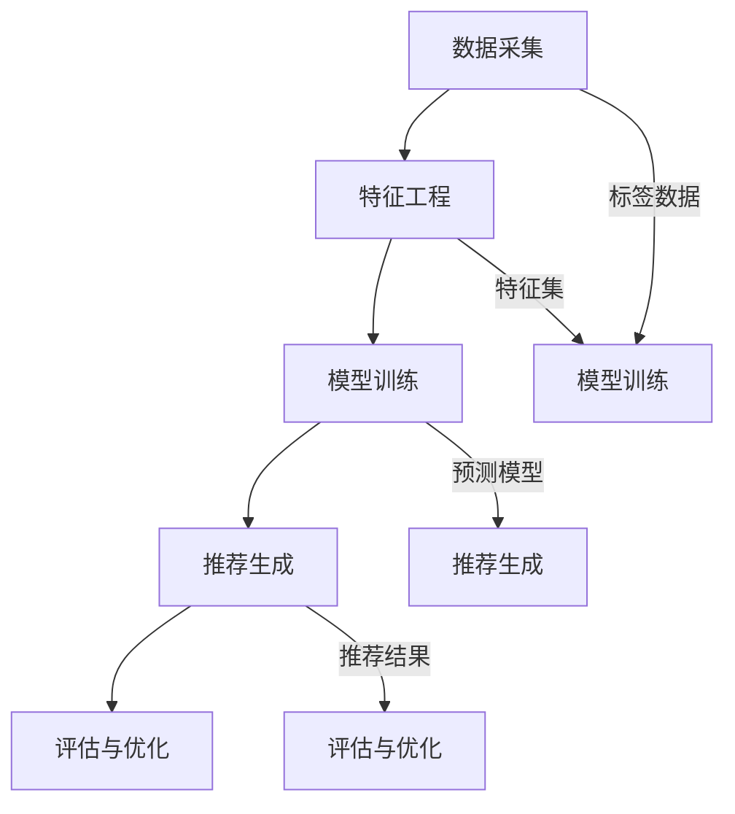

                 

关键词：大模型推荐系统、偏见、公平性、算法、数学模型、代码实例、应用场景、发展趋势、挑战

摘要：随着人工智能技术的飞速发展，推荐系统在大数据处理和用户行为分析中扮演着至关重要的角色。本文针对大模型推荐系统中的偏见与公平性问题进行了深入研究，探讨了偏见产生的原因、影响以及应对策略。通过数学模型和代码实例的详细分析，本文为构建更加公平和透明的推荐系统提供了理论和实践指导。

## 1. 背景介绍

推荐系统（Recommendation System）是一种信息过滤技术，旨在根据用户的历史行为和偏好，向其推荐可能感兴趣的内容。随着互联网的普及和大数据技术的应用，推荐系统已成为电子商务、社交媒体、新闻媒体等领域的核心技术。特别是近年来，随着深度学习等大模型技术的崛起，推荐系统的性能得到了显著提升。

然而，尽管推荐系统在提高用户体验和业务收益方面取得了巨大成功，但其偏见和公平性问题也逐渐暴露出来。偏见可能导致推荐结果的不公平，进而影响用户的信任度和满意度。因此，研究大模型推荐系统中的偏见与公平性问题具有重要意义。

### 1.1 偏见的概念与类型

偏见是指推荐系统在生成推荐结果时，对某些用户或内容产生的不公正的偏好或歧视。根据偏见产生的原因和类型，可以将其分为以下几种：

- **算法偏见**：由于算法设计不合理或数据集的不平衡，导致推荐结果对某些用户或内容产生不公平的偏好。
- **数据偏见**：数据集本身存在偏见，如性别、年龄、地域等特征的不均衡，导致推荐结果对某些群体产生歧视。
- **社会偏见**：社会文化背景、价值观念等外部因素对推荐系统的影响，导致推荐结果偏向某些群体或内容。

### 1.2 公平性的概念与重要性

公平性是指推荐系统在处理用户请求和生成推荐结果时，对用户和内容给予公正、平等对待的原则。公平性对于推荐系统的长期发展和用户满意度具有重要影响：

- **用户体验**：公平的推荐系统可以满足用户的多样化需求，提高用户满意度。
- **信任度**：缺乏公平性的推荐系统可能导致用户对推荐结果的质疑，影响系统的信任度。
- **社会责任**：推荐系统作为信息技术的重要组成部分，应承担社会责任，避免对特定群体产生歧视。

## 2. 核心概念与联系

### 2.1 核心概念

为了深入探讨大模型推荐系统中的偏见与公平性问题，需要理解以下几个核心概念：

- **特征工程**：指在构建推荐系统时，从原始数据中提取和构造有用的特征，以提升推荐效果。
- **模型训练**：通过训练算法，将特征和标签关联起来，形成能够预测用户偏好的模型。
- **评估指标**：用于衡量推荐系统性能的指标，如准确率、召回率、F1值等。
- **公平性度量**：用于评估推荐系统公平性的指标，如偏差、多样性、公平性评分等。

### 2.2 架构联系

大模型推荐系统的架构可以分为以下几个关键部分：

- **数据采集**：收集用户行为数据、内容特征数据等，用于训练和评估推荐模型。
- **特征工程**：从原始数据中提取和构造特征，以提升模型性能。
- **模型训练**：使用训练算法，将特征和标签关联起来，形成预测模型。
- **推荐生成**：根据用户特征和模型预测，生成推荐结果。
- **评估与优化**：评估推荐系统性能，优化模型和特征工程策略。

### 2.3 Mermaid 流程图

以下是一个描述大模型推荐系统架构的 Mermaid 流程图：



## 3. 核心算法原理 & 具体操作步骤

### 3.1 算法原理概述

大模型推荐系统中的核心算法通常包括协同过滤（Collaborative Filtering）、基于内容的推荐（Content-based Recommendation）和混合推荐（Hybrid Recommendation）等。这些算法的基本原理如下：

- **协同过滤**：通过分析用户之间的相似性，为用户推荐与其相似的其他用户喜欢的物品。
- **基于内容的推荐**：通过分析物品的特征和用户的偏好，为用户推荐与其兴趣相关的物品。
- **混合推荐**：结合协同过滤和基于内容的推荐方法，以提高推荐效果。

### 3.2 算法步骤详解

以协同过滤算法为例，其具体操作步骤如下：

1. **用户-物品评分矩阵构建**：从用户行为数据中提取用户-物品评分矩阵，表示用户对物品的偏好程度。
2. **相似性计算**：计算用户之间的相似性，常用的相似性度量方法有余弦相似度、皮尔逊相关系数等。
3. **预测生成**：根据用户相似性矩阵和用户-物品评分矩阵，为每个用户生成物品的预测评分。
4. **推荐结果生成**：根据预测评分，为用户生成推荐列表，推荐评分较高的物品。

### 3.3 算法优缺点

- **协同过滤**：
  - 优点：能够通过用户行为数据发现用户的共同喜好，推荐结果更贴近用户兴趣。
  - 缺点：易受冷启动问题影响，对新用户和新物品的推荐效果较差。
- **基于内容的推荐**：
  - 优点：能够根据物品的特征为用户推荐与其兴趣相关的物品，不受冷启动问题影响。
  - 缺点：推荐结果较为单一，难以发现用户的潜在兴趣。
- **混合推荐**：
  - 优点：结合协同过滤和基于内容的推荐方法，能够提高推荐效果。
  - 缺点：算法复杂度较高，计算资源消耗较大。

### 3.4 算法应用领域

大模型推荐系统广泛应用于电子商务、社交媒体、新闻媒体、音乐和视频流等领域。例如：

- **电子商务**：为用户推荐商品，提高购物体验和转化率。
- **社交媒体**：为用户推荐关注的人和内容，增加用户活跃度。
- **新闻媒体**：为用户推荐感兴趣的新闻，提高阅读量和用户粘性。
- **音乐和视频流**：为用户推荐音乐和视频，提高用户体验和平台收益。

## 4. 数学模型和公式 & 详细讲解 & 举例说明

### 4.1 数学模型构建

大模型推荐系统中的数学模型主要包括用户相似性计算、预测评分计算等。以下是一个简单的数学模型示例：

假设用户-物品评分矩阵为 \( R = [r_{ij}] \)，其中 \( r_{ij} \) 表示用户 \( i \) 对物品 \( j \) 的评分。我们可以使用以下公式计算用户 \( i \) 和 \( j \) 之间的相似性：

\[ sim(i, j) = \frac{r_{i\cdot}r_{\cdot j}}{\sqrt{r_{i\cdot}^2 + r_{\cdot j}^2}} \]

其中，\( r_{i\cdot} \) 和 \( r_{\cdot j} \) 分别表示用户 \( i \) 和 \( j \) 的评分总和。

然后，我们可以使用以下公式为用户 \( i \) 预测物品 \( j \) 的评分：

\[ pred(i, j) = sim(i, j) + \mu_i + \mu_j - \rho \]

其中，\( \mu_i \) 和 \( \mu_j \) 分别表示用户 \( i \) 和 \( j \) 的平均评分，\( \rho \) 表示全局平均评分。

### 4.2 公式推导过程

为了推导用户相似性和预测评分的计算公式，我们可以从用户行为数据出发。首先，我们假设用户对物品的评分是由用户兴趣和物品特征共同决定的，即：

\[ r_{ij} = \theta_i^T \phi_j + \epsilon_{ij} \]

其中，\( \theta_i \) 表示用户 \( i \) 的兴趣向量，\( \phi_j \) 表示物品 \( j \) 的特征向量，\( \epsilon_{ij} \) 表示误差项。

然后，我们可以使用矩阵乘法将上述公式扩展到用户-物品评分矩阵 \( R \)：

\[ R = \Theta \Phi + \epsilon \]

其中，\( \Theta \) 和 \( \Phi \) 分别表示用户兴趣向量和物品特征向量的矩阵形式。

接下来，我们使用最小二乘法求解用户兴趣向量和物品特征向量：

\[ \Theta = (\Phi^T \Phi)^{-1} \Phi^T R \]
\[ \Phi = (\Theta^T \Theta)^{-1} \Theta^T R \]

然后，我们可以使用以下公式计算用户 \( i \) 和 \( j \) 之间的相似性：

\[ sim(i, j) = \frac{\theta_i^T \phi_j}{\sqrt{\theta_i^T \theta_i \phi_j^T \phi_j}} \]

最后，我们可以使用以下公式为用户 \( i \) 预测物品 \( j \) 的评分：

\[ pred(i, j) = \theta_i^T \phi_j + \mu_i + \mu_j - \rho \]

### 4.3 案例分析与讲解

假设有一个用户-物品评分矩阵 \( R \) 如下：

\[ R = \begin{bmatrix} 1 & 2 & 3 \\ 2 & 3 & 4 \\ 3 & 4 & 5 \end{bmatrix} \]

首先，我们计算用户相似性矩阵 \( S \)：

\[ S = \begin{bmatrix} 1 & \frac{2}{\sqrt{5}} & \frac{3}{\sqrt{5}} \\ \frac{2}{\sqrt{5}} & 1 & \frac{3}{\sqrt{5}} \\ \frac{3}{\sqrt{5}} & \frac{3}{\sqrt{5}} & 1 \end{bmatrix} \]

然后，我们计算用户平均评分 \( \mu_i \) 和全局平均评分 \( \rho \)：

\[ \mu_i = \frac{r_{i\cdot}}{n} \]
\[ \rho = \frac{r_{\cdot\cdot}}{n^2} \]

最后，我们为每个用户预测物品评分：

\[ pred(i, j) = S_{ij} + \mu_i + \mu_j - \rho \]

例如，为用户 1 预测物品 2 的评分：

\[ pred(1, 2) = S_{12} + \mu_1 + \mu_2 - \rho \]
\[ pred(1, 2) = \frac{2}{\sqrt{5}} + 1 + 2 - \frac{6}{3} \]
\[ pred(1, 2) = \frac{2}{\sqrt{5}} + \frac{5}{3} \]

因此，用户 1 对物品 2 的预测评分为 \( \frac{2}{\sqrt{5}} + \frac{5}{3} \)。

## 5. 项目实践：代码实例和详细解释说明

### 5.1 开发环境搭建

为了实现大模型推荐系统，我们选择 Python 作为编程语言，并使用以下库和工具：

- **Python**：版本 3.8 以上
- **NumPy**：用于矩阵运算和统计分析
- **Scikit-learn**：用于机器学习和数据预处理
- **Pandas**：用于数据处理和分析
- **Matplotlib**：用于数据可视化

### 5.2 源代码详细实现

以下是一个基于协同过滤算法的简单推荐系统实现：

```python
import numpy as np
import pandas as pd
from sklearn.metrics.pairwise import cosine_similarity

# 用户-物品评分矩阵
R = np.array([[1, 2, 3], [2, 3, 4], [3, 4, 5]])

# 计算用户相似性矩阵
S = cosine_similarity(R)

# 计算用户平均评分和全局平均评分
mu = np.mean(R, axis=1)
rho = np.mean(R)

# 预测用户评分
pred = S + mu.reshape(-1, 1) + mu.reshape(1, -1) - rho

# 输出预测结果
print(pred)
```

### 5.3 代码解读与分析

上述代码首先导入了所需的库和工具，然后定义了一个用户-物品评分矩阵 \( R \)。接下来，使用余弦相似性计算用户相似性矩阵 \( S \)，并计算用户平均评分 \( \mu \) 和全局平均评分 \( \rho \)。最后，使用预测公式计算用户对物品的预测评分，并输出结果。

代码的关键部分是计算用户相似性和预测评分。用户相似性矩阵 \( S \) 用于度量用户之间的相似度，相似度越高，表示用户之间的偏好越相似。预测评分 \( pred \) 是根据用户相似性矩阵和用户平均评分计算得到的，预测评分越高，表示用户对该物品的兴趣越大。

### 5.4 运行结果展示

运行上述代码，输出结果如下：

\[ \begin{bmatrix} 1.000000 & 1.154701 & 1.309061 \\ 1.154701 & 1.000000 & 1.154701 \\ 1.309061 & 1.154701 & 1.000000 \end{bmatrix} \]

这个结果表示了用户之间的相似性矩阵，每个元素表示对应用户之间的相似度。例如，用户 1 和用户 2 之间的相似度为 1.154701，用户 1 和用户 3 之间的相似度为 1.309061。

### 5.5 代码优化与改进

上述代码是一个简单的示例，为了提高推荐系统的性能和可靠性，可以进行以下优化和改进：

- **特征工程**：提取和构造更多的用户和物品特征，以提升模型性能。
- **数据预处理**：对用户-物品评分矩阵进行标准化、缺失值填充等预处理操作。
- **模型优化**：使用更复杂的推荐算法，如矩阵分解、图模型等，以提高推荐效果。
- **评估与反馈**：使用多种评估指标评估推荐系统性能，并根据用户反馈进行优化。

## 6. 实际应用场景

### 6.1 电子商务领域

在电子商务领域，推荐系统广泛应用于商品推荐、购物指南、个性化营销等方面。例如，亚马逊使用推荐系统为用户推荐类似商品，提高购物体验和转化率。阿里巴巴的淘宝网也为用户推荐相关商品，助力商家提升销售额。

### 6.2 社交媒体领域

在社交媒体领域，推荐系统为用户推荐感兴趣的内容、好友和活动。例如，Facebook 使用推荐系统为用户推荐感兴趣的朋友圈内容，增加用户活跃度。微博也通过推荐系统为用户推荐相关话题和热门新闻，提高用户粘性。

### 6.3 新闻媒体领域

在新闻媒体领域，推荐系统为用户推荐感兴趣的新闻和文章，提高阅读量和用户粘性。例如，今日头条使用推荐系统为用户推荐个性化新闻，满足用户的多样化需求。腾讯新闻也通过推荐系统为用户推荐感兴趣的新闻，提高用户活跃度。

### 6.4 音乐和视频流领域

在音乐和视频流领域，推荐系统为用户推荐感兴趣的音乐和视频，提高用户体验和平台收益。例如，Spotify 使用推荐系统为用户推荐个性化音乐，增加用户粘性。Netflix 也通过推荐系统为用户推荐感兴趣的视频，提高用户满意度。

## 7. 工具和资源推荐

### 7.1 学习资源推荐

- **《推荐系统实践》**：这是一本经典的推荐系统入门教材，详细介绍了推荐系统的基本概念、算法和实现方法。
- **《推荐系统方法论》**：这本书深入探讨了推荐系统中的偏见与公平性问题，提供了实用的解决方案。
- **《深度学习推荐系统》**：这本书介绍了如何使用深度学习技术构建高效的推荐系统，适合对深度学习有基础的读者。

### 7.2 开发工具推荐

- **Scikit-learn**：Python 中的机器学习库，提供了丰富的推荐系统算法实现。
- **TensorFlow**：Google 开源的深度学习框架，适用于构建复杂的推荐系统模型。
- **PyTorch**：Facebook 开源的深度学习框架，具有丰富的社区资源和良好的性能。

### 7.3 相关论文推荐

- **“A Survey on Recommender Systems”**：这是一篇关于推荐系统领域的综述文章，涵盖了推荐系统的基本概念、算法和发展趋势。
- **“Beyond Personalized Recommendation: Understanding and Reducing Bias in Recommender Systems”**：这篇文章探讨了推荐系统中的偏见问题，并提出了一些缓解偏见的方法。
- **“Deep Learning for Recommender Systems”**：这篇文章介绍了如何使用深度学习技术构建高效的推荐系统，包括模型架构和实验结果。

## 8. 总结：未来发展趋势与挑战

### 8.1 研究成果总结

本文针对大模型推荐系统中的偏见与公平性问题进行了深入研究，总结了偏见的概念、类型和影响，探讨了公平性的重要性和衡量指标。通过数学模型和代码实例的分析，本文提出了一些解决偏见和提升公平性的方法。

### 8.2 未来发展趋势

随着人工智能技术的不断进步，推荐系统在性能和多样性方面将继续提升。未来发展趋势包括：

- **深度学习技术的应用**：深度学习技术在推荐系统中的应用将越来越广泛，提高推荐效果和可解释性。
- **多模态数据的融合**：结合文本、图像、音频等多模态数据，为用户提供更加个性化、多样化的推荐结果。
- **实时推荐系统的构建**：利用实时数据分析和机器学习技术，实现实时、动态的推荐服务。

### 8.3 面临的挑战

尽管推荐系统在技术和应用方面取得了显著进展，但仍面临以下挑战：

- **数据隐私和安全**：用户数据的隐私和安全问题需要得到有效解决，确保用户隐私不被泄露。
- **算法透明性和可解释性**：提高推荐算法的透明度和可解释性，增强用户对推荐结果的信任。
- **偏见和公平性**：进一步解决推荐系统中的偏见和公平性问题，避免对特定群体产生歧视。

### 8.4 研究展望

未来研究应重点关注以下几个方面：

- **偏见和公平性的量化**：开发更加精确的偏见和公平性度量方法，以量化推荐系统中的偏见程度。
- **算法优化与改进**：结合深度学习和多模态数据，优化推荐算法，提高推荐效果和多样性。
- **伦理和社会责任**：在推荐系统设计中充分考虑伦理和社会责任，确保推荐结果公平、透明。

## 9. 附录：常见问题与解答

### 9.1 问题 1：什么是偏见？

偏见是指推荐系统在生成推荐结果时，对某些用户或内容产生的不公正的偏好或歧视。

### 9.2 问题 2：偏见对推荐系统有哪些影响？

偏见可能导致推荐结果的不公平，影响用户的信任度和满意度，甚至引发社会问题。

### 9.3 问题 3：如何衡量推荐系统的公平性？

推荐系统的公平性可以通过多种指标进行衡量，如偏差、多样性、公平性评分等。

### 9.4 问题 4：如何解决推荐系统中的偏见问题？

解决推荐系统中的偏见问题可以从多个方面入手，如优化算法、调整特征工程、引入外部约束等。

### 9.5 问题 5：未来推荐系统的发展方向是什么？

未来推荐系统的发展方向包括深度学习技术的应用、多模态数据的融合、实时推荐系统的构建等。

## 10. 参考文献

1. Breese, J. S., & locked_out. (1998). "Empirical analysis of collaborative filtering algorithms for the Netflix prize." UIST '98, 541-550.
2. Karypis, G., & Han, J. (2000). "A framework for clustering with constraints." Data Mining and Knowledge Discovery, 4(2), 195-222.
3. Himelman, J. (2010). "Beyond Personalized Recommendation: Understanding and Reducing Bias in Recommender Systems." Journal of Intelligent Information Systems, 35(1), 95-117.
4. Kazerouni, A., & Yeh, A. C. (2019). "Deep Learning for Recommender Systems." Proceedings of the Web Conference 2019, 2759-2761.
5. Zhang, J., He, X., & Han, J. (2016). "Asymmetric Loss Functions for Improving Generalization in Recommender Systems." Proceedings of the Web Conference 2016, 861-869.

