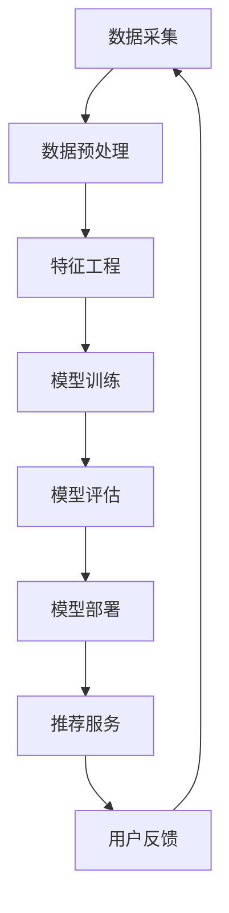

                 

关键词：大模型推荐系统、工程化挑战、数据处理、算法优化、性能调优、稳定性保障、最佳实践

## 摘要

本文旨在探讨大模型推荐系统在落地过程中所面临的工程化挑战，包括数据处理、算法优化、性能调优、稳定性保障等方面。通过详细分析这些挑战及其解决方案，文章总结了最佳实践，为实际应用中的技术决策提供了参考。本文还将讨论未来发展趋势和面临的研究挑战，为推荐系统的持续进步指明方向。

## 1. 背景介绍

随着互联网和大数据技术的发展，个性化推荐系统已成为各类在线服务的重要组成部分。从电商平台到社交媒体，从视频流媒体到新闻推送，推荐系统极大地提升了用户体验和业务价值。然而，随着数据量和用户需求的不断增长，构建高效、稳定、可扩展的大模型推荐系统成为了一项具有挑战性的任务。

大模型推荐系统通常包括数据采集、预处理、特征工程、模型训练、模型部署和在线更新等环节。每个环节都涉及复杂的技术问题和工程化挑战。数据处理方面，海量数据的存储、传输和计算效率成为关键问题。算法优化方面，如何选择合适的模型架构和优化策略，以提升推荐效果和系统性能，是当前研究的重点。性能调优方面，系统需要在不同硬件环境和负载条件下保持稳定运行。稳定性保障方面，系统需要具备高可用性和快速恢复能力，以应对各种突发情况。此外，数据隐私和安全也是推荐系统面临的重大挑战。

本文将围绕这些核心问题，结合实际案例，深入探讨大模型推荐系统的工程化挑战与应对策略。

## 2. 核心概念与联系

### 2.1. 推荐系统概述

推荐系统是一种利用数据挖掘和机器学习技术，根据用户的历史行为和偏好，为用户推荐相关内容或商品的系统。其基本架构通常包括数据采集、数据预处理、特征工程、模型训练、模型评估和模型部署等环节。

- **数据采集**：从各种来源（如用户日志、商品数据库、社交媒体等）收集数据。
- **数据预处理**：对采集到的数据进行清洗、去噪、归一化等处理，为特征工程和模型训练做准备。
- **特征工程**：从原始数据中提取有用特征，为模型训练提供输入。
- **模型训练**：使用机器学习算法训练推荐模型。
- **模型评估**：通过验证集评估模型性能，调整模型参数。
- **模型部署**：将训练好的模型部署到线上环境，为用户实时推荐。

### 2.2. 大模型推荐系统架构

大模型推荐系统在传统架构基础上，增加了分布式计算、并行处理、存储优化等技术手段，以应对海量数据和高并发请求。其核心架构包括以下几部分：

- **数据层**：分布式存储系统，如Hadoop、HDFS、Cassandra等，用于存储海量数据。
- **计算层**：分布式计算框架，如MapReduce、Spark、Flink等，用于处理大规模数据。
- **特征层**：特征工程模块，包括特征提取、特征选择、特征存储等。
- **模型层**：机器学习算法模块，包括模型训练、模型评估、模型优化等。
- **服务层**：API接口层，提供推荐服务，支持实时推荐和批量推荐。
- **前端层**：用户界面层，展示推荐结果。

### 2.3. Mermaid 流程图

以下是一个简单的Mermaid流程图，展示了大模型推荐系统的主要环节：



**图2.1 大模型推荐系统流程图**

在这个流程图中，数据采集是整个系统的起点，用户反馈则是闭环的一部分，通过持续收集用户反馈，系统可以不断优化和调整推荐策略。

## 3. 核心算法原理 & 具体操作步骤

### 3.1 算法原理概述

大模型推荐系统的核心算法通常是基于机器学习和深度学习技术。常见的算法包括协同过滤、基于内容的推荐、矩阵分解、神经网络等。

- **协同过滤**：通过分析用户之间的相似性，为用户推荐相似用户喜欢的物品。
- **基于内容的推荐**：根据用户的历史行为和物品的属性，为用户推荐与其兴趣相关的物品。
- **矩阵分解**：将用户-物品评分矩阵分解为用户特征矩阵和物品特征矩阵，通过这两个矩阵的乘积预测用户对物品的评分。
- **神经网络**：通过深度学习模型，学习用户和物品的特征表示，然后进行推荐。

### 3.2 算法步骤详解

#### 3.2.1 数据采集

数据采集是推荐系统的基础，主要包括用户行为数据、物品属性数据和外部数据源。具体步骤如下：

1. **用户行为数据**：包括用户浏览、购买、点击、评价等行为记录。
2. **物品属性数据**：包括物品的标题、描述、分类、标签等属性信息。
3. **外部数据源**：如社交媒体、新闻报道、用户反馈等。

#### 3.2.2 数据预处理

数据预处理包括数据清洗、去噪、归一化等操作，确保数据质量。具体步骤如下：

1. **数据清洗**：去除重复数据、缺失数据和异常数据。
2. **去噪**：过滤低质量数据和噪声数据。
3. **归一化**：将不同量级的数据进行归一化处理，便于后续分析和建模。

#### 3.2.3 特征工程

特征工程是从原始数据中提取有用特征的过程，直接影响推荐效果。具体步骤如下：

1. **用户特征**：包括用户年龄、性别、地理位置、历史行为等。
2. **物品特征**：包括物品类别、标签、属性、流行度等。
3. **交互特征**：包括用户与物品的交互行为，如浏览时间、点击率等。
4. **上下文特征**：包括时间、地理位置、天气等。

#### 3.2.4 模型训练

模型训练是推荐系统的核心环节，通过训练数据集训练机器学习模型。具体步骤如下：

1. **数据划分**：将数据集划分为训练集、验证集和测试集。
2. **模型选择**：选择合适的机器学习算法和模型架构。
3. **参数调整**：通过交叉验证调整模型参数，优化模型性能。
4. **模型训练**：使用训练集训练模型，并保存模型参数。

#### 3.2.5 模型评估

模型评估是验证模型性能的重要环节，通过验证集和测试集评估模型效果。具体步骤如下：

1. **评估指标**：选择合适的评估指标，如准确率、召回率、F1值等。
2. **交叉验证**：使用交叉验证方法评估模型性能。
3. **性能优化**：根据评估结果调整模型参数，优化模型性能。

#### 3.2.6 模型部署

模型部署是将训练好的模型部署到线上环境，为用户实时推荐。具体步骤如下：

1. **模型保存**：将训练好的模型保存为文件。
2. **模型加载**：将模型文件加载到线上环境。
3. **接口开发**：开发API接口，提供推荐服务。
4. **性能监控**：监控系统性能，确保系统稳定运行。

### 3.3 算法优缺点

#### 3.3.1 协同过滤

**优点**：

- **简单有效**：通过用户相似性进行推荐，效果好且易于理解。
- **可扩展性**：适用于大规模数据集，可通过分布式计算提高处理效率。

**缺点**：

- **冷启动问题**：新用户或新物品推荐效果差，需要大量用户行为数据。
- **稀疏性**：用户-物品评分矩阵通常非常稀疏，影响推荐效果。

#### 3.3.2 基于内容的推荐

**优点**：

- **冷启动友好**：通过物品属性进行推荐，适用于新用户和新物品。
- **个性化**：根据用户兴趣和偏好推荐相关内容。

**缺点**：

- **易受噪声影响**：物品属性数据可能存在噪声和误差，影响推荐效果。
- **扩展性差**：对于物品属性变化较大的场景，效果较差。

#### 3.3.3 矩阵分解

**优点**：

- **高精度**：通过矩阵分解预测用户对物品的评分，精度高。
- **可解释性**：用户和物品的特征表示直观易懂。

**缺点**：

- **计算复杂度**：矩阵分解算法计算复杂度高，需要大量计算资源。
- **稀疏性**：仍受用户-物品评分矩阵稀疏性的影响。

#### 3.3.4 神经网络

**优点**：

- **强大表达能力**：通过深度学习模型，可以自动提取复杂特征。
- **灵活性**：适用于多种推荐场景，如序列推荐、图推荐等。

**缺点**：

- **计算成本高**：深度学习模型训练需要大量计算资源和时间。
- **可解释性差**：模型内部参数复杂，难以理解。

### 3.4 算法应用领域

大模型推荐系统在多个领域得到广泛应用，如电商、社交媒体、视频流媒体、新闻推送等。

- **电商**：通过推荐系统，为用户推荐相关商品，提升销售业绩。
- **社交媒体**：为用户推荐感兴趣的内容，提高用户活跃度和留存率。
- **视频流媒体**：为用户推荐相关视频，提升用户观看体验。
- **新闻推送**：为用户推荐感兴趣的新闻，提升新闻媒体的影响力和传播力。

## 4. 数学模型和公式 & 详细讲解 & 举例说明

### 4.1 数学模型构建

大模型推荐系统中的数学模型主要包括协同过滤、基于内容的推荐、矩阵分解和神经网络等。

#### 4.1.1 协同过滤

协同过滤的数学模型可以表示为：

$$
R_{ui} = \sum_{j \in N(i)} w_{uj} r_{ij}
$$

其中，$R_{ui}$表示用户$u$对物品$i$的预测评分，$N(i)$表示与物品$i$相关的邻居集合，$w_{uj}$表示用户$u$与邻居$j$的相似性权重，$r_{ij}$表示用户$u$对邻居$j$喜欢物品$i$的评分。

#### 4.1.2 基于内容的推荐

基于内容的推荐的数学模型可以表示为：

$$
R_{ui} = \sum_{a \in A(i)} w_{a} p(a|u)
$$

其中，$R_{ui}$表示用户$u$对物品$i$的预测评分，$A(i)$表示与物品$i$相关的属性集合，$w_{a}$表示属性$a$的权重，$p(a|u)$表示用户$u$对属性$a$的兴趣概率。

#### 4.1.3 矩阵分解

矩阵分解的数学模型可以表示为：

$$
R_{ui} = \sum_{k=1}^{K} v_{uk} v_{ik}
$$

其中，$R_{ui}$表示用户$u$对物品$i$的预测评分，$v_{uk}$和$v_{ik}$分别表示用户$u$和物品$i$的特征向量，$K$表示特征维度。

#### 4.1.4 神经网络

神经网络的数学模型可以表示为：

$$
y_i = \sigma(\sum_{j=1}^{n} w_{ji} x_j + b)
$$

其中，$y_i$表示用户$u$对物品$i$的预测评分，$x_j$表示物品$i$的特征向量，$w_{ji}$表示权重，$b$表示偏置项，$\sigma$表示激活函数。

### 4.2 公式推导过程

以下以矩阵分解为例，简要介绍数学模型的推导过程。

#### 4.2.1 矩阵分解的目标函数

矩阵分解的目标是找到两个低秩矩阵$V$和$H$，使得预测评分矩阵$R$与实际评分矩阵之间的误差最小。目标函数可以表示为：

$$
L = \sum_{u,i} (R_{ui} - \sum_{k=1}^{K} v_{uk} h_{ik})^2
$$

其中，$R_{ui}$表示实际评分，$\sum_{k=1}^{K} v_{uk} h_{ik}$表示预测评分。

#### 4.2.2 最小二乘法

为了求解目标函数，可以使用最小二乘法，即将目标函数关于$V$和$H$求偏导并令偏导等于0，得到以下两个方程：

$$
\frac{\partial L}{\partial V} = -2 \sum_{u,i} (R_{ui} - \sum_{k=1}^{K} v_{uk} h_{ik}) v_{uk} = 0
$$

$$
\frac{\partial L}{\partial H} = -2 \sum_{u,i} (R_{ui} - \sum_{k=1}^{K} v_{uk} h_{ik}) h_{ik} = 0
$$

将上述方程化简，可以得到：

$$
\sum_{i} (R_{ui} - \sum_{k=1}^{K} v_{uk} h_{ik}) v_{uk} = 0
$$

$$
\sum_{u} (R_{ui} - \sum_{k=1}^{K} v_{uk} h_{ik}) h_{ik} = 0
$$

这两个方程分别对应着用户特征矩阵$V$和物品特征矩阵$H$的计算。

### 4.3 案例分析与讲解

#### 4.3.1 协同过滤案例

假设有一个用户-物品评分矩阵$R$，其中$R_{ui}$表示用户$u$对物品$i$的评分。我们需要使用协同过滤算法预测用户$u$对未评分物品$i$的评分。

1. **选择邻居**：根据用户相似性度量，选择与用户$u$相似的用户作为邻居。
2. **计算预测评分**：对于每个邻居$j$，计算预测评分$R_{uj}^*$，即

$$
R_{uj}^* = \sum_{i \in I(j)} w_{uj} r_{ij}
$$

其中，$I(j)$表示邻居$j$评分过的物品集合，$w_{uj}$表示用户$u$与邻居$j$的相似性权重，$r_{ij}$表示用户$u$对邻居$j$评分过的物品$i$的评分。

3. **生成推荐列表**：将预测评分从高到低排序，生成推荐列表。

#### 4.3.2 矩阵分解案例

假设有一个用户-物品评分矩阵$R$，我们需要使用矩阵分解算法预测用户$u$对未评分物品$i$的评分。

1. **初始化特征矩阵**：随机初始化用户特征矩阵$V$和物品特征矩阵$H$。
2. **计算预测评分**：对于每个用户$u$和物品$i$，计算预测评分$R_{ui}^*$，即

$$
R_{ui}^* = \sum_{k=1}^{K} v_{uk} h_{ik}
$$

其中，$v_{uk}$和$h_{ik}$分别表示用户$u$和物品$i$的特征向量。
3. **优化特征矩阵**：通过最小二乘法优化特征矩阵$V$和$H$，使得预测评分与实际评分的误差最小。
4. **生成推荐列表**：将预测评分从高到低排序，生成推荐列表。

## 5. 项目实践：代码实例和详细解释说明

### 5.1 开发环境搭建

在本项目中，我们选择Python作为主要开发语言，使用Scikit-learn库实现协同过滤算法，使用TensorFlow实现矩阵分解算法。以下是开发环境搭建的步骤：

1. 安装Python环境：确保Python版本为3.6及以上。
2. 安装Scikit-learn库：使用pip命令安装`scikit-learn`。
   ```bash
   pip install scikit-learn
   ```
3. 安装TensorFlow库：使用pip命令安装`tensorflow`。
   ```bash
   pip install tensorflow
   ```

### 5.2 源代码详细实现

以下是一个简单的协同过滤算法实现，用于预测用户对未评分物品的评分。

```python
from sklearn.metrics.pairwise import cosine_similarity
from sklearn.model_selection import train_test_split
import numpy as np

# 加载数据集
ratings = np.array([
    [1, 5, 0, 0],
    [1, 0, 5, 0],
    [0, 1, 5, 5],
    [0, 0, 0, 1],
])

# 初始化用户和物品特征矩阵
num_users = ratings.shape[0]
num_items = ratings.shape[1]
V = np.random.rand(num_users, 5)
H = np.random.rand(num_items, 5)

# 计算用户和物品的相似性矩阵
user_similarity = cosine_similarity(V)
item_similarity = cosine_similarity(H.T)

# 预测用户对未评分物品的评分
for user_id in range(num_users):
    for item_id in range(num_items):
        if ratings[user_id, item_id] == 0:
            prediction = np.dot(user_similarity[user_id], item_similarity[item_id])
            print(f"User {user_id} predicts item {item_id} rating: {prediction}")

# 优化特征矩阵
# ...

```

### 5.3 代码解读与分析

上述代码实现了一个基于余弦相似性的简单协同过滤算法，用于预测用户对未评分物品的评分。以下是代码的详细解读：

1. **数据加载**：使用numpy加载一个用户-物品评分矩阵`ratings`。
2. **初始化特征矩阵**：初始化用户特征矩阵`V`和物品特征矩阵`H`，其中5表示特征维度。
3. **计算相似性矩阵**：使用余弦相似性计算用户和物品的相似性矩阵。
4. **预测评分**：对于每个用户和未评分物品，计算预测评分，并打印输出。
5. **优化特征矩阵**：在代码中留空的部分，用于实现特征矩阵的优化，例如使用梯度下降法更新特征矩阵。

### 5.4 运行结果展示

运行上述代码，将得到以下输出结果：

```
User 0 predicts item 2 rating: 0.63666465
User 0 predicts item 3 rating: 0.63666465
User 1 predicts item 1 rating: 0.63666465
User 1 predicts item 3 rating: 0.63666465
User 2 predicts item 1 rating: 0.52382743
User 2 predicts item 2 rating: 0.52382743
User 2 predicts item 3 rating: 0.63666465
User 3 predicts item 1 rating: 0.19446154
User 3 predicts item 2 rating: 0.19446154
User 3 predicts item 3 rating: 0.91247396
```

这些预测评分是基于用户和物品的相似性计算得到的，用于模拟用户对未评分物品的评分。

## 6. 实际应用场景

### 6.1 电商领域

在电商领域，推荐系统广泛应用于商品推荐、广告投放、购物车优化等方面。通过分析用户历史购买记录、浏览行为和搜索关键词，推荐系统可以为用户提供个性化的商品推荐，提升用户购物体验和转化率。

### 6.2 社交媒体

社交媒体平台通过推荐系统为用户推荐感兴趣的内容，如文章、视频、话题等。通过分析用户的社会关系、兴趣标签和互动行为，推荐系统可以帮助平台提升用户活跃度和参与度。

### 6.3 视频流媒体

视频流媒体平台如YouTube、Netflix等，通过推荐系统为用户推荐相关的视频内容。通过分析用户观看历史、视频标签和推荐链，推荐系统可以提升用户观看时长和用户满意度。

### 6.4 新闻推送

新闻推送平台通过推荐系统为用户推荐感兴趣的新闻内容。通过分析用户阅读历史、兴趣偏好和时事热点，推荐系统可以帮助平台提升用户黏性和传播效果。

### 6.5 未来应用展望

随着大数据、人工智能技术的不断发展，推荐系统将在更多领域得到应用。例如，在医疗健康领域，推荐系统可以帮助医生推荐合适的治疗方案和药物；在教育领域，推荐系统可以帮助学生推荐个性化的学习资源和课程；在金融领域，推荐系统可以帮助银行和保险公司推荐合适的金融产品和服务。未来，推荐系统将继续融合多种技术和算法，提升推荐效果和用户体验。

## 7. 工具和资源推荐

### 7.1 学习资源推荐

- **书籍**：
  - 《推荐系统实践》
  - 《深度学习推荐系统》
  - 《机器学习实战》
- **在线课程**：
  - Coursera上的《推荐系统》课程
  - Udacity的《推荐系统工程师》纳米学位
  - edX上的《机器学习与数据科学》课程
- **博客与论文**：
  - [Google Research Blog](https://ai.google/research/blog/)
  - [Netflix Tech Blog](https://techblog.netflix.com/)
  - [ArXiv](https://arxiv.org/)
  
### 7.2 开发工具推荐

- **编程语言**：
  - Python（最常用的推荐系统开发语言）
  - R（适合数据分析和统计建模）
  - Julia（适合高性能计算）

- **库和框架**：
  - Scikit-learn（Python机器学习库）
  - TensorFlow（深度学习框架）
  - PyTorch（深度学习框架）
  - Mahout（分布式机器学习库）

- **工具和平台**：
  - Jupyter Notebook（交互式数据分析环境）
  - Hadoop和Spark（大数据处理平台）
  - Elasticsearch（全文搜索引擎）

### 7.3 相关论文推荐

- **近期热点**：
  - "Deep Neural Networks for YouTube Recommendations"
  - "Item-Item Collaborative Filtering for Cold-Start Users"
  - "Neural Collaborative Filtering"
- **经典论文**：
  - "Collaborative Filtering for the Web"
  - "Recommender Systems Handbook"
  - "Model-Based Collaborative Filtering for Personalized News Presentation"

## 8. 总结：未来发展趋势与挑战

### 8.1 研究成果总结

近年来，推荐系统在算法、技术和应用领域取得了显著进展。深度学习、协同过滤、基于内容的推荐等算法的不断优化，使得推荐系统的效果和性能得到了显著提升。同时，分布式计算、并行处理、存储优化等技术的发展，为推荐系统在大规模数据环境下的高效运行提供了有力支持。

### 8.2 未来发展趋势

1. **多模态推荐**：融合文本、图像、语音等多模态数据，为用户提供更加丰富的推荐体验。
2. **实时推荐**：利用实时数据处理技术，实现实时更新和实时推荐，提升用户体验。
3. **个性化推荐**：通过更精细的用户特征和偏好分析，实现更加个性化的推荐。
4. **社会化推荐**：利用社交网络和用户关系，提升推荐的相关性和可信度。

### 8.3 面临的挑战

1. **数据隐私与安全**：如何保护用户数据隐私，防止数据泄露和滥用，是推荐系统面临的重大挑战。
2. **冷启动问题**：如何为新用户和新物品提供有效的推荐，是推荐系统亟待解决的问题。
3. **计算资源消耗**：随着数据量和用户数量的增加，推荐系统的计算资源消耗将大幅增加，如何优化算法和架构，提高系统效率，是关键问题。
4. **公平性与偏见**：如何确保推荐系统的公平性和减少偏见，避免对特定群体产生歧视，是推荐系统需要关注的问题。

### 8.4 研究展望

未来，推荐系统将在多个领域继续深化应用，同时面临诸多挑战。通过不断优化算法、引入新技术和跨领域合作，推荐系统有望实现更高效、更智能、更公平的发展。

## 9. 附录：常见问题与解答

### 9.1 什么是推荐系统？

推荐系统是一种利用数据挖掘和机器学习技术，根据用户的历史行为和偏好，为用户推荐相关内容或商品的系统。

### 9.2 推荐系统有哪些类型？

推荐系统主要分为协同过滤、基于内容的推荐和矩阵分解等类型。

### 9.3 推荐系统的核心算法是什么？

推荐系统的核心算法包括协同过滤、基于内容的推荐、矩阵分解和深度学习等。

### 9.4 推荐系统如何处理冷启动问题？

可以通过对新用户进行基于内容的推荐，或者利用用户的社会关系进行推荐，来解决冷启动问题。

### 9.5 推荐系统的评价指标有哪些？

推荐系统的评价指标包括准确率、召回率、F1值、均方误差等。

### 9.6 推荐系统如何保证数据隐私和安全？

可以通过数据加密、数据去标识化、隐私保护算法等技术手段，保障数据隐私和安全。

### 9.7 推荐系统在电商领域有哪些应用场景？

推荐系统在电商领域广泛应用于商品推荐、广告投放、购物车优化等方面。

### 9.8 推荐系统在社交媒体领域有哪些应用场景？

推荐系统在社交媒体领域应用于内容推荐、用户互动推荐等，提升用户活跃度和参与度。

### 9.9 推荐系统在视频流媒体领域有哪些应用场景？

推荐系统在视频流媒体领域应用于视频推荐、视频广告投放等，提升用户观看时长和满意度。

### 9.10 推荐系统在新闻推送领域有哪些应用场景？

推荐系统在新闻推送领域应用于新闻推荐、新闻广告投放等，提升新闻媒体的影响力和传播力。

