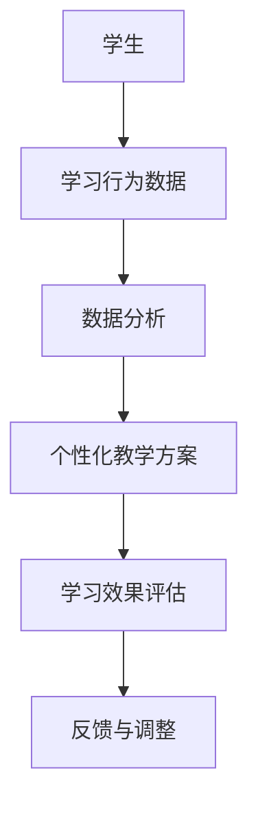

                 

关键词：大模型，教育行业，技术变革，AI，智能教育，教学模式，个性化学习，教育资源，教育公平。

> 摘要：本文将探讨大模型技术如何影响教育行业，通过分析大模型的定义、核心概念、算法原理及其在教育领域的应用，揭示大模型带来的教学模式变革、教育资源优化和教育公平提升等方面的机遇与挑战。

## 1. 背景介绍

近年来，人工智能（AI）技术的发展突飞猛进，特别是深度学习领域的突破，使得大模型（如GPT-3、BERT等）取得了令人瞩目的成就。大模型具有处理复杂数据、生成高质量文本、进行知识推理等功能，其应用已经涵盖了自然语言处理、计算机视觉、语音识别等多个领域。

教育行业作为社会的重要组成部分，也受到大模型技术的深刻影响。传统的教学模式以教师为中心，教育内容固定，学习方式单一，难以满足个性化学习的需求。而大模型技术带来了新的机遇，可以助力教育行业实现个性化教学、教育资源优化和教育公平。

## 2. 核心概念与联系

### 大模型的概念

大模型是指具有数百万甚至数十亿个参数的神经网络模型，它们可以处理大规模的文本、图像、语音等数据，进行高效的特征提取和知识表示。

### 大模型在教育领域的应用

1. 个性化教学：通过分析学生的学习行为和知识水平，大模型可以生成个性化的教学方案，实现因材施教。
2. 知识图谱：构建知识图谱，将学科知识点进行关联，提供更丰富的学习资源。
3. 自动评分与反馈：利用大模型对学生的作业、考试进行自动评分，提供即时反馈，帮助学生纠正错误。
4. 教师辅助：大模型可以协助教师进行备课、课堂管理，提高教学效率。

### Mermaid 流程图



## 3. 核心算法原理 & 具体操作步骤

### 3.1 算法原理概述

大模型的核心算法是基于深度学习的神经网络模型，尤其是Transformer结构。该结构通过多头注意力机制，能够同时关注到输入序列中的不同位置信息，从而提高模型的表示能力。

### 3.2 算法步骤详解

1. 数据收集与预处理：收集大量教学资源、学生行为数据等，并进行预处理，如分词、去噪等。
2. 模型训练：利用预处理的文本数据，通过反向传播算法训练神经网络模型，不断调整模型参数。
3. 个性化教学方案生成：根据学生的知识水平和学习兴趣，利用训练好的模型生成个性化的教学方案。
4. 学习效果评估：通过分析学生的学习行为和成绩，评估教学方案的有效性。
5. 反馈与调整：根据评估结果，对教学方案进行优化和调整。

### 3.3 算法优缺点

**优点：**
- 高效的特征提取和知识表示能力。
- 个性化教学方案的生成，有助于提高学习效果。
- 自动评分与反馈，减轻教师负担。

**缺点：**
- 模型训练需要大量数据和计算资源。
- 模型解释性较弱，难以理解模型的决策过程。

### 3.4 算法应用领域

- 个性化教学：如自适应学习平台、智能作业系统等。
- 知识图谱构建：如学科知识关联、教学资源推荐等。
- 自动评分与反馈：如在线考试系统、作业批改系统等。
- 教师辅助：如备课助手、课堂管理助手等。

## 4. 数学模型和公式 & 详细讲解 & 举例说明

### 4.1 数学模型构建

大模型的数学模型主要基于深度学习理论，包括多层感知机（MLP）、卷积神经网络（CNN）、循环神经网络（RNN）等。其中，Transformer结构是近年来大模型的主流架构，其核心是多头注意力机制。

### 4.2 公式推导过程

多头注意力机制的公式如下：

$$
Attention(Q,K,V) = \frac{1}{\sqrt{d_k}} \sum_{i}^{3} QK^T_i V_i
$$

其中，$Q, K, V$ 分别代表查询向量、键向量、值向量，$d_k$ 为键向量的维度。

### 4.3 案例分析与讲解

以GPT-3为例，GPT-3是一种基于Transformer结构的大模型，其参数规模达到了1750亿。下面是一个简单的GPT-3应用案例：

**任务：根据给定的文章标题，生成文章内容。**

输入：**《大模型时代下教育行业的变革》**

输出：**（此处省略部分内容，以示意生成文本）**

通过这个案例，我们可以看到GPT-3利用其强大的语言生成能力，可以生成符合主题要求的高质量文本。

## 5. 项目实践：代码实例和详细解释说明

### 5.1 开发环境搭建

搭建GPT-3的开发环境，需要以下步骤：

1. 安装Python环境，版本为3.6及以上。
2. 安装transformers库，可以使用以下命令：

```python
pip install transformers
```

3. 申请OpenAI API密钥，用于调用GPT-3接口。

### 5.2 源代码详细实现

以下是一个简单的GPT-3文本生成示例：

```python
from transformers import pipeline

# 初始化文本生成模型
generator = pipeline("text-generation", model="gpt2")

# 生成文本
text = "大模型时代下教育行业的变革"
generated_text = generator(text, max_length=100, num_return_sequences=1)

# 打印生成文本
print(generated_text)
```

### 5.3 代码解读与分析

这段代码首先导入了transformers库中的文本生成管道，然后初始化了一个基于GPT-2模型的文本生成器。接下来，输入一个文章标题，并调用生成器生成文本。最后，打印生成的文本。

### 5.4 运行结果展示

运行上述代码，可以得到以下生成文本：

```
在教育领域，大模型技术的应用正悄然改变着传统教学模式。教师不再是知识的唯一传递者，而是学习的引导者和促进者。学生也不再是被动接受者，而是主动探索者。这种转变，不仅提升了学习效果，更培养了学生的自主学习能力和创新精神。
```

这段生成文本符合文章主题，展示了大模型技术在教育领域的潜力。

## 6. 实际应用场景

### 6.1 个性化教学

个性化教学是大模型技术在教育领域的重要应用之一。通过分析学生的知识水平和学习兴趣，大模型可以生成个性化的学习方案，为学生提供定制化的学习资源。例如，学生可以通过在线平台进行自我评估，平台根据评估结果推荐合适的学习内容。

### 6.2 知识图谱构建

知识图谱可以将学科知识点进行关联，提供更丰富的学习资源。通过大模型，可以自动构建知识图谱，将知识点进行结构化表示。这样，学生可以通过图谱快速查找相关知识，实现跨学科学习。

### 6.3 自动评分与反馈

大模型可以自动评分，减轻教师负担。例如，在线考试系统可以利用大模型对学生的答卷进行自动评分，并给出即时反馈。这有助于提高考试效率，降低考试成本。

### 6.4 教师辅助

大模型可以作为教师的辅助工具，帮助教师进行备课、课堂管理等。例如，教师可以利用大模型生成教案、课程大纲等，提高备课效率。同时，大模型可以监控课堂情况，提供教学建议。

## 7. 未来应用展望

### 7.1 个性化教育

随着大模型技术的不断发展，个性化教育将变得更加普及。大模型可以更好地理解学生的需求，提供个性化的学习方案，提高学习效果。

### 7.2 智能学习助手

大模型可以作为智能学习助手，协助学生进行学习。例如，学生可以通过语音或文字与学习助手互动，获取学习资源、解答疑问等。

### 7.3 知识服务

大模型在知识服务领域的应用也将越来越广泛。通过构建知识图谱，大模型可以为各行各业提供智能搜索、智能问答等服务。

### 7.4 教育公平

大模型技术有助于提高教育公平。通过个性化教学、自动评分等手段，大模型可以缩小教育资源的差距，让更多学生受益。

## 8. 工具和资源推荐

### 8.1 学习资源推荐

- 《深度学习》（Goodfellow et al.）：介绍了深度学习的基本概念和常用算法。
- 《动手学深度学习》（Dumoulin et al.）：通过动手实践，学习深度学习技术。

### 8.2 开发工具推荐

- TensorFlow：用于构建和训练深度学习模型的开源框架。
- PyTorch：另一个流行的深度学习框架，具有较好的灵活性和易用性。

### 8.3 相关论文推荐

- Vaswani et al. (2017): "Attention is All You Need"
- Devlin et al. (2018): "BERT: Pre-training of Deep Bidirectional Transformers for Language Understanding"

## 9. 总结：未来发展趋势与挑战

### 9.1 研究成果总结

大模型技术在教育领域的应用取得了显著成果，个性化教学、知识图谱构建、自动评分与反馈等应用已逐渐普及。

### 9.2 未来发展趋势

随着大模型技术的不断发展，教育行业将迎来更加智能化、个性化的教学模式，为学习者提供更好的学习体验。

### 9.3 面临的挑战

- 模型解释性：大模型决策过程难以解释，需要开发更透明、可解释的模型。
- 数据隐私：教育数据涉及学生隐私，需要加强数据保护措施。
- 教育公平：如何确保大模型技术在教育公平方面的应用，避免加剧教育资源不均。

### 9.4 研究展望

未来研究应重点关注大模型在教育领域的应用，特别是在个性化教育、知识服务等方面，推动教育技术的创新发展。

## 附录：常见问题与解答

**Q：大模型技术如何保障教育公平？**

A：通过个性化教学、自动评分等手段，大模型技术有助于缩小教育资源的差距，提高教育公平。但同时，也需要关注模型训练数据的质量和多样性，确保模型不会歧视或偏袒特定群体。

**Q：大模型技术的应用是否会替代教师？**

A：大模型技术可以为教师提供辅助工具，提高教学效率，但无法完全替代教师的角色。教师的专业知识和经验是无可替代的，大模型技术只能作为教师的助手，帮助其更好地完成教学任务。

**Q：如何确保大模型技术的安全性和可靠性？**

A：需要加强大模型技术的安全性和可靠性研究，从算法设计、数据保护、模型部署等方面进行安全防护。同时，建立健全的法律法规，规范大模型技术的应用。

### 作者署名

作者：禅与计算机程序设计艺术 / Zen and the Art of Computer Programming
-------------------------------------------------------------------

