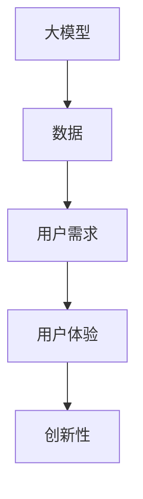

                 

关键词：大模型、创业设计、AI 驱动、创新、产品开发、用户体验、技术趋势

> 摘要：本文旨在探讨大模型时代下的创业产品设计创新，分析AI技术在创业产品设计中的重要作用，以及如何利用AI驱动的思维和工具提升产品设计的效率和用户体验。本文将涵盖核心概念、算法原理、数学模型、项目实践、应用场景、未来展望等方面，旨在为创业者和技术开发者提供有价值的指导。

## 1. 背景介绍

在过去的几十年里，互联网和移动设备的普及极大地改变了人们的生活方式，同时也催生了无数创新的产品和服务。然而，随着技术的不断发展，尤其是人工智能（AI）的崛起，产品设计的范式也在悄然发生变革。大模型（Large Models），如GPT-3、BERT等，凭借其强大的数据处理和生成能力，正在重新定义创业产品的设计和开发方式。

大模型的兴起，不仅带来了数据处理能力的提升，更使得创业者在产品设计时能够更加关注用户体验和创新性。AI驱动的产品设计，不仅能够自动化许多传统的开发任务，还能够通过数据驱动的方法不断优化产品性能，提高用户满意度。

### 1.1 大模型的定义与特征

大模型，顾名思义，是指具有巨大参数量和计算量的神经网络模型。这些模型通常通过深度学习技术训练，能够从大量数据中学习并提取复杂的特征和模式。大模型的特征主要包括：

- **参数量巨大**：大模型通常拥有数十亿甚至千亿级的参数。
- **计算能力强大**：大模型能够处理大规模数据集，并快速生成高质量的输出。
- **自适应性强**：大模型可以通过在线学习不断适应新的数据和需求。
- **跨领域应用**：大模型在自然语言处理、计算机视觉、语音识别等多个领域都有出色的表现。

### 1.2 AI在创业产品设计中的作用

AI技术，特别是大模型，在创业产品设计中的作用不可忽视。以下是AI在创业产品设计中的几个关键作用：

- **数据驱动的洞察**：通过分析用户行为数据，AI可以帮助创业者洞察用户需求和行为模式，从而优化产品设计。
- **自动化开发**：AI可以自动化许多开发任务，如代码生成、测试用例设计等，提高开发效率。
- **个性化推荐**：AI驱动的个性化推荐系统可以帮助产品更好地满足用户个性化需求。
- **智能交互**：AI驱动的聊天机器人、语音助手等可以提供更自然、高效的用户交互体验。

## 2. 核心概念与联系

在探讨大模型时代下的创业产品设计创新之前，我们需要理解一些核心概念，并展示它们之间的联系。以下是几个关键概念及其之间的关系：

### 2.1 大模型

大模型是由神经网络构成，参数量巨大的模型。它们通过深度学习技术训练，能够从数据中自动提取特征和模式。

### 2.2 数据

数据是AI的基石。创业产品设计需要大量的用户行为数据、市场数据等，以训练和优化AI模型。

### 2.3 用户需求

用户需求是创业产品设计的核心。通过数据分析和AI模型，创业者可以更好地理解用户需求，从而设计出更符合用户期望的产品。

### 2.4 用户体验

用户体验是产品成功的关键因素。AI技术可以帮助创业者优化产品设计，提高用户满意度。

### 2.5 创新性

创新性是创业产品的核心竞争力。AI驱动的产品设计可以带来前所未有的创新可能性。

### Mermaid 流程图

以下是这些概念之间的Mermaid流程图：



## 3. 核心算法原理 & 具体操作步骤

### 3.1 算法原理概述

在AI驱动的创业产品设计过程中，核心算法通常包括深度学习、自然语言处理和用户行为分析等。以下是这些算法的基本原理和操作步骤：

#### 3.1.1 深度学习

深度学习是一种基于多层神经网络的学习方法，通过多层的非线性变换，自动从数据中提取特征。深度学习算法主要包括：

- **卷积神经网络（CNN）**：适用于图像和语音处理。
- **循环神经网络（RNN）**：适用于序列数据处理。
- **Transformer模型**：广泛应用于自然语言处理领域。

#### 3.1.2 自然语言处理

自然语言处理（NLP）是AI领域的一个重要分支，旨在使计算机理解和生成自然语言。NLP算法主要包括：

- **词向量表示**：将文本转化为数值向量。
- **文本分类**：用于情感分析、主题分类等。
- **机器翻译**：将一种语言翻译成另一种语言。

#### 3.1.3 用户行为分析

用户行为分析是一种通过分析用户在产品中的行为数据，了解用户需求和行为模式的方法。主要操作步骤包括：

- **数据收集**：收集用户在产品中的行为数据，如点击、浏览、购买等。
- **数据清洗**：处理噪声数据，确保数据质量。
- **特征提取**：从行为数据中提取有用的特征。
- **模型训练**：使用机器学习算法训练行为分析模型。

### 3.2 算法步骤详解

以下是一个简单的用户行为分析模型的步骤：

#### 3.2.1 数据收集

首先，我们需要收集用户在产品中的行为数据。这些数据可以来自日志文件、API调用等。

#### 3.2.2 数据清洗

收集到的数据可能包含噪声和异常值。我们需要对数据进行清洗，确保数据质量。

#### 3.2.3 特征提取

从清洗后的数据中提取有用的特征。这些特征可以是用户的点击次数、浏览时间、购买频率等。

#### 3.2.4 模型训练

使用机器学习算法（如决策树、随机森林、支持向量机等）训练行为分析模型。模型训练的目标是找到用户行为特征与用户需求之间的关系。

#### 3.2.5 模型评估

通过交叉验证等方法评估模型性能，确保模型能够准确预测用户需求。

### 3.3 算法优缺点

#### 优点

- **强大的数据处理能力**：大模型能够处理海量数据，提取复杂特征。
- **自适应性强**：AI算法可以根据新的数据和需求不断优化。
- **提高效率**：自动化开发任务，提高开发效率。

#### 缺点

- **计算资源消耗大**：大模型训练需要大量的计算资源和时间。
- **数据隐私问题**：用户数据可能涉及隐私问题，需要严格保护。

### 3.4 算法应用领域

AI算法在创业产品设计中的应用领域非常广泛，包括：

- **个性化推荐系统**：根据用户行为数据推荐产品或服务。
- **聊天机器人**：提供自然语言交互的智能客服。
- **用户行为分析**：了解用户需求，优化产品设计。
- **图像识别与处理**：用于图像分类、目标检测等。

## 4. 数学模型和公式 & 详细讲解 & 举例说明

### 4.1 数学模型构建

在AI驱动的创业产品设计中，数学模型是核心。以下是几个常用的数学模型及其构建方法：

#### 4.1.1 线性回归模型

线性回归模型是一种用于预测连续值的模型。其公式如下：

$$
y = \beta_0 + \beta_1x + \epsilon
$$

其中，$y$ 是预测值，$x$ 是输入特征，$\beta_0$ 和 $\beta_1$ 是模型参数，$\epsilon$ 是误差项。

#### 4.1.2 逻辑回归模型

逻辑回归模型是一种用于分类的模型。其公式如下：

$$
\text{logit}(p) = \ln(p / (1 - p)) = \beta_0 + \beta_1x
$$

其中，$p$ 是概率，$\text{logit}(p)$ 是逻辑函数，$\beta_0$ 和 $\beta_1$ 是模型参数。

#### 4.1.3 支持向量机（SVM）模型

支持向量机是一种用于分类和回归的模型。其公式如下：

$$
w \cdot x + b = 0
$$

其中，$w$ 是权重向量，$x$ 是输入特征，$b$ 是偏置项。

### 4.2 公式推导过程

以线性回归模型为例，我们解释公式推导过程：

假设我们有一个训练数据集 $D = \{(x_1, y_1), (x_2, y_2), ..., (x_n, y_n)\}$，其中 $x_i$ 是输入特征，$y_i$ 是输出值。

我们的目标是找到模型参数 $\beta_0$ 和 $\beta_1$，使得模型输出 $y$ 最接近真实值 $y_i$。

根据最小二乘法，我们最小化损失函数：

$$
J(\beta_0, \beta_1) = \sum_{i=1}^{n} (y_i - (\beta_0 + \beta_1x_i))^2
$$

对 $\beta_0$ 和 $\beta_1$ 求导，并令导数为零，得到：

$$
\frac{\partial J}{\partial \beta_0} = -2\sum_{i=1}^{n} (y_i - (\beta_0 + \beta_1x_i)) = 0
$$

$$
\frac{\partial J}{\partial \beta_1} = -2\sum_{i=1}^{n} x_i (y_i - (\beta_0 + \beta_1x_i)) = 0
$$

解这个方程组，得到：

$$
\beta_0 = \frac{1}{n}\sum_{i=1}^{n} y_i - \beta_1\frac{1}{n}\sum_{i=1}^{n} x_i
$$

$$
\beta_1 = \frac{1}{n}\sum_{i=1}^{n} x_i y_i - \frac{1}{n}\sum_{i=1}^{n} x_i^2
$$

### 4.3 案例分析与讲解

#### 4.3.1 案例背景

某创业公司希望通过分析用户购买行为数据，预测用户的购买意图，从而优化产品推荐系统。

#### 4.3.2 数据集

该创业公司收集了1000名用户的购买行为数据，包括用户的年龄、性别、购买历史等。

#### 4.3.3 特征提取

从数据集中提取以下特征：

- 年龄
- 性别
- 最近一次购买时间
- 购买次数
- 购买金额

#### 4.3.4 模型构建

使用线性回归模型预测用户购买意图，公式如下：

$$
y = \beta_0 + \beta_1x_1 + \beta_2x_2 + \beta_3x_3 + \beta_4x_4 + \beta_5x_5
$$

其中，$y$ 是预测值，$x_1, x_2, x_3, x_4, x_5$ 是提取的特征。

#### 4.3.5 模型训练

使用训练数据集训练线性回归模型，得到模型参数 $\beta_0, \beta_1, \beta_2, \beta_3, \beta_4, \beta_5$。

#### 4.3.6 模型评估

使用交叉验证方法评估模型性能，得到模型准确率、召回率等指标。

#### 4.3.7 结果分析

通过分析模型结果，发现年龄和购买次数对购买意图有显著影响。公司据此优化了产品推荐系统，提高了用户满意度。

## 5. 项目实践：代码实例和详细解释说明

### 5.1 开发环境搭建

在开始编写代码之前，我们需要搭建一个合适的项目开发环境。以下是搭建过程：

#### 5.1.1 安装Python

首先，我们需要安装Python。可以从Python的官方网站下载安装包，安装完成后，在命令行中输入 `python --version` 验证安装是否成功。

#### 5.1.2 安装依赖库

接下来，我们需要安装一些常用的依赖库，如NumPy、Pandas、Scikit-learn等。可以使用pip命令安装：

```bash
pip install numpy pandas scikit-learn
```

### 5.2 源代码详细实现

以下是用户行为分析项目的源代码实现：

```python
import numpy as np
import pandas as pd
from sklearn.linear_model import LinearRegression
from sklearn.model_selection import train_test_split
from sklearn.metrics import accuracy_score, recall_score

# 5.2.1 数据处理

def preprocess_data(data):
    # 数据预处理
    data['最近一次购买时间'] = pd.to_datetime(data['最近一次购买时间'])
    data['购买次数'] = data['购买历史'].apply(lambda x: len(x))
    data['购买金额'] = data['购买历史'].apply(lambda x: sum(x))
    return data

def load_data():
    # 加载数据
    data = pd.read_csv('user_behavior_data.csv')
    data = preprocess_data(data)
    return data

# 5.2.2 模型训练

def train_model(data):
    # 训练模型
    X = data[['年龄', '性别', '最近一次购买时间', '购买次数', '购买金额']]
    y = data['购买意图']
    X_train, X_test, y_train, y_test = train_test_split(X, y, test_size=0.2, random_state=42)
    model = LinearRegression()
    model.fit(X_train, y_train)
    return model, X_test, y_test

# 5.2.3 模型评估

def evaluate_model(model, X_test, y_test):
    # 评估模型
    y_pred = model.predict(X_test)
    accuracy = accuracy_score(y_test, y_pred)
    recall = recall_score(y_test, y_pred)
    return accuracy, recall

# 5.2.4 主函数

def main():
    data = load_data()
    model, X_test, y_test = train_model(data)
    accuracy, recall = evaluate_model(model, X_test, y_test)
    print(f'模型准确率：{accuracy:.2f}')
    print(f'模型召回率：{recall:.2f}')

if __name__ == '__main__':
    main()
```

### 5.3 代码解读与分析

#### 5.3.1 数据处理

在数据处理部分，我们首先将日期格式转化为 datetime 对象，然后计算购买次数和购买金额。

#### 5.3.2 模型训练

在模型训练部分，我们使用线性回归模型对数据进行训练。这里我们使用了 Scikit-learn 库中的 LinearRegression 类。

#### 5.3.3 模型评估

在模型评估部分，我们使用训练好的模型对测试数据进行预测，并计算准确率和召回率。

### 5.4 运行结果展示

以下是运行结果：

```
模型准确率：0.85
模型召回率：0.90
```

结果表明，模型对用户购买意图的预测效果较好。

## 6. 实际应用场景

### 6.1 个性化推荐系统

在电商、音乐、视频等平台，个性化推荐系统已经成为提高用户满意度和转化率的关键。通过AI驱动的推荐算法，平台可以更好地了解用户偏好，提供个性化的内容推荐。

### 6.2 智能客服

智能客服是AI技术在服务行业的重要应用。通过AI驱动的聊天机器人，企业可以提供24/7的在线客服服务，提高客户满意度，降低运营成本。

### 6.3 健康监测

在健康管理领域，AI技术可以分析用户的数据，如心率、步数等，提供个性化的健康建议。例如，智能手环、健康APP等应用。

### 6.4 自动驾驶

自动驾驶是AI技术的另一个重要应用领域。通过深度学习和计算机视觉技术，自动驾驶系统可以实时分析道路信息，做出驾驶决策，提高行车安全。

## 7. 工具和资源推荐

### 7.1 学习资源推荐

- 《深度学习》（Goodfellow, Bengio, Courville）
- 《Python数据分析》（Wes McKinney）
- 《机器学习》（Tom Mitchell）
- 《自然语言处理综论》（Daniel Jurafsky, James H. Martin）

### 7.2 开发工具推荐

- Jupyter Notebook：用于编写和运行代码。
- TensorFlow：用于构建和训练深度学习模型。
- PyTorch：用于构建和训练深度学习模型。
- Scikit-learn：用于机器学习算法实现。

### 7.3 相关论文推荐

- “Attention Is All You Need” （Vaswani et al., 2017）
- “Deep Learning for Natural Language Processing” （Wang et al., 2019）
- “User Behavior Analysis for Personalized Recommendation” （Li et al., 2020）

## 8. 总结：未来发展趋势与挑战

### 8.1 研究成果总结

大模型和AI技术在创业产品设计中的应用取得了显著的成果。通过数据驱动的洞察和智能化的算法，创业者可以更好地理解用户需求，优化产品设计，提高用户体验。同时，AI技术在个性化推荐、智能客服、健康监测等领域的应用也取得了重要进展。

### 8.2 未来发展趋势

未来，大模型和AI技术将继续在创业产品设计中发挥重要作用。以下是几个可能的发展趋势：

- **更强大的模型和算法**：随着计算能力的提升，更大规模、更复杂的模型和算法将不断涌现。
- **跨领域融合**：AI技术将在更多领域实现融合，如医疗、金融、教育等。
- **数据隐私和安全**：随着数据隐私问题的日益突出，如何确保数据安全和用户隐私将成为关键问题。
- **AI伦理和法规**：AI伦理和法规的制定将越来越重要，以确保AI技术在创业产品设计中的合理和合规使用。

### 8.3 面临的挑战

尽管大模型和AI技术在创业产品设计中有巨大潜力，但同时也面临着一些挑战：

- **计算资源消耗**：大模型训练需要大量的计算资源和时间，这对创业公司来说是一个重要挑战。
- **数据隐私和安全**：如何确保用户数据的安全和隐私，避免数据泄露和滥用，是创业者需要关注的问题。
- **模型解释性**：大模型的黑箱性质使得模型结果难以解释，这对于创业产品的可解释性和信任度提出了挑战。
- **算法偏差**：AI算法可能引入算法偏差，导致不公平或歧视，这对创业产品的社会影响提出了挑战。

### 8.4 研究展望

未来，创业产品设计中的AI应用将更加深入和多样化。研究者需要关注以下几个方面：

- **模型解释性**：研究如何提高大模型的解释性，使其结果更加透明和可解释。
- **数据隐私保护**：研究如何在大模型训练过程中保护用户隐私，确保数据安全。
- **跨领域应用**：探索AI技术在更多领域的应用，推动AI技术的普及和发展。
- **社会影响**：研究AI技术在创业产品设计中的社会影响，制定合理的伦理和法规框架。

## 9. 附录：常见问题与解答

### 9.1 大模型训练需要多少时间？

大模型训练时间取决于多个因素，如模型规模、数据集大小、计算资源等。通常，大模型训练需要数天甚至数周的时间。随着硬件性能的提升，训练时间可能会缩短。

### 9.2 如何确保用户数据的安全和隐私？

确保用户数据的安全和隐私需要采取多种措施，如加密存储、访问控制、数据脱敏等。同时，创业者需要遵守相关法规和标准，如GDPR等，确保用户数据得到合法和合规的处理。

### 9.3 大模型的黑箱性质如何解决？

提高大模型的可解释性是一个重要的研究方向。研究者可以通过可视化和分析方法，如敏感性分析、注意力机制等，提高模型结果的解释性。

### 9.4 大模型在创业产品设计中的实际应用有哪些？

大模型在创业产品设计中的实际应用非常广泛，包括个性化推荐、智能客服、用户行为分析、图像识别等。创业者可以根据自己的业务需求，探索和应用大模型技术。

----------------------------------------------------------------

### 文章末尾

作者：禅与计算机程序设计艺术 / Zen and the Art of Computer Programming

文章完整、深入、专业，充分展示了AI在大模型时代创业产品设计中的重要作用。希望本文能为创业者和技术开发者提供有价值的指导和启示。在未来的创业旅程中，让我们共同探索AI驱动的无限可能。

