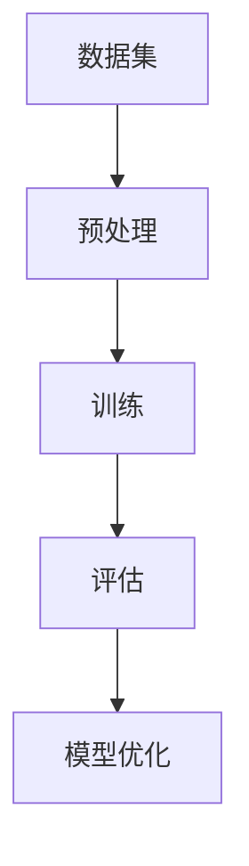

                 

关键词：大模型、创业设计、AI 驱动、产品设计、技术趋势

摘要：随着人工智能技术的迅猛发展，大模型在各个行业中的应用越来越广泛。本文将探讨大模型时代的创业产品设计，如何利用AI驱动创新，打造具有竞争力的产品。通过分析大模型的核心原理、应用场景、数学模型以及实践案例，本文旨在为创业者和产品经理提供有价值的指导，共同探索AI驱动的未来。

## 1. 背景介绍

近年来，人工智能（AI）技术的飞速发展给各行各业带来了深刻的变革。特别是大模型的出现，使得AI在图像识别、自然语言处理、语音识别等领域取得了显著的突破。大模型通过海量数据和深度学习算法，实现了前所未有的模型复杂度和性能提升，从而成为了创业领域的重要推动力量。

创业产品设计在AI大模型时代面临着新的机遇和挑战。一方面，AI技术的应用可以为创业项目提供强大的支持，提高产品的智能化程度和用户体验。另一方面，如何在竞争激烈的市场中脱颖而出，打造出具有差异化优势的产品，成为创业者和产品经理需要解决的核心问题。

本文将从以下几个方面展开讨论：首先，介绍大模型的核心概念和原理；其次，分析大模型在创业设计中的应用场景；然后，探讨大模型相关的数学模型和算法；接着，通过实践案例展示大模型在创业产品设计中的实际应用；最后，对大模型时代的创业设计进行展望和总结。

## 2. 核心概念与联系

### 2.1 大模型定义

大模型（Big Model）是指拥有极高参数量、能够处理大规模数据的深度学习模型。这些模型通常通过大规模数据训练得到，可以捕捉到数据中的复杂模式和关联性。大模型的参数量通常在数百万到数十亿之间，例如BERT、GPT等。

### 2.2 深度学习算法

深度学习（Deep Learning）是人工智能的重要分支，通过多层神经网络模型实现自动化特征提取和模式识别。深度学习算法在图像识别、自然语言处理、语音识别等领域取得了显著进展。典型的深度学习算法包括卷积神经网络（CNN）、循环神经网络（RNN）、变换器（Transformer）等。

### 2.3 数据集与预处理

数据集是深度学习模型训练的基础，高质量的数据集可以大幅提升模型的性能。数据预处理包括数据清洗、数据增强、数据归一化等步骤，以确保数据的一致性和可靠性。

### 2.4 训练与评估

训练过程是通过优化算法调整模型参数，使模型能够更好地拟合训练数据。评估过程则是通过测试数据检验模型在未知数据上的性能，常用的评估指标包括准确率、召回率、F1分数等。

### 2.5 大模型架构

大模型通常采用多层次的神经网络架构，包括输入层、隐藏层和输出层。输入层接收原始数据，隐藏层通过逐层抽象实现特征提取，输出层生成预测结果。

### 2.6 Mermaid 流程图



## 3. 核心算法原理 & 具体操作步骤

### 3.1 算法原理概述

大模型的算法原理主要基于深度学习和概率图模型。深度学习通过多层神经网络实现特征提取和模式识别，概率图模型通过图结构描述变量之间的依赖关系。

### 3.2 算法步骤详解

1. **数据集选择与预处理**：选择具有代表性的数据集，并进行数据清洗、增强和归一化处理。
2. **模型架构设计**：根据应用需求设计神经网络架构，包括输入层、隐藏层和输出层。
3. **模型训练**：使用训练数据集对模型进行训练，通过反向传播算法优化模型参数。
4. **模型评估**：使用测试数据集对模型进行评估，计算准确率、召回率等指标。
5. **模型优化**：根据评估结果调整模型参数，提高模型性能。

### 3.3 算法优缺点

**优点**：大模型可以处理大规模数据，捕捉数据中的复杂模式，提高模型性能。

**缺点**：大模型需要大量计算资源和时间进行训练，模型解释性较差。

### 3.4 算法应用领域

大模型在图像识别、自然语言处理、语音识别等领域有广泛应用，如人脸识别、情感分析、机器翻译等。

## 4. 数学模型和公式

### 4.1 数学模型构建

假设有一个输入数据集 $X = \{x_1, x_2, ..., x_n\}$，其中每个输入数据 $x_i$ 是一个多维向量。大模型的输出结果 $y$ 是通过神经网络模型计算得到的。

### 4.2 公式推导过程

1. **输入层到隐藏层的传递函数**：

   $$ h_{ij}^{(l)} = \sigma(W_{ij}^{(l)} \cdot x_i + b_{j}^{(l)}) $$

   其中，$h_{ij}^{(l)}$ 表示第 $l$ 层第 $i$ 个节点到第 $j$ 个节点的传递值，$\sigma$ 表示激活函数，$W_{ij}^{(l)}$ 表示权重矩阵，$b_{j}^{(l)}$ 表示偏置项。

2. **隐藏层到输出层的传递函数**：

   $$ y_i = \sigma(W_{ij}^{(L)} \cdot h_{ji}^{(L-1)} + b_{i}^{(L)}) $$

   其中，$y_i$ 表示输出层第 $i$ 个节点的预测值。

3. **损失函数**：

   $$ J(W, b) = \frac{1}{2n} \sum_{i=1}^{n} (y_i - t_i)^2 $$

   其中，$J(W, b)$ 表示损失函数，$y_i$ 表示预测值，$t_i$ 表示真实值。

4. **反向传播算法**：

   $$ \delta_{ij}^{(L)} = \frac{\partial J}{\partial W_{ij}^{(L)}} = (y_i - t_i) \cdot \sigma'(h_{ij}^{(L)}) $$

   $$ \delta_{ij}^{(l)} = \frac{\partial J}{\partial b_{j}^{(l)}} = (y_i - t_i) \cdot \sigma'(h_{ij}^{(l)}) $$

   其中，$\delta_{ij}^{(L)}$ 表示输出层的误差项，$\sigma'$ 表示激活函数的导数。

### 4.3 案例分析与讲解

以情感分析为例，假设有一个二分类问题，情感分类结果为正面或负面。使用一个二分类的大模型进行训练，输入数据为文本，输出数据为情感标签。通过上述数学模型和算法，可以实现对文本的情感分类。

## 5. 项目实践：代码实例和详细解释说明

### 5.1 开发环境搭建

1. 安装Python环境，版本3.8及以上。
2. 安装深度学习框架，如TensorFlow或PyTorch。
3. 安装必要的依赖库，如NumPy、Pandas等。

### 5.2 源代码详细实现

```python
import tensorflow as tf
from tensorflow.keras.layers import Embedding, LSTM, Dense
from tensorflow.keras.models import Sequential

# 模型构建
model = Sequential()
model.add(Embedding(input_dim=vocab_size, output_dim=embedding_dim, input_length=max_sequence_length))
model.add(LSTM(units=128))
model.add(Dense(units=1, activation='sigmoid'))

# 编译模型
model.compile(optimizer='adam', loss='binary_crossentropy', metrics=['accuracy'])

# 训练模型
model.fit(X_train, y_train, epochs=10, batch_size=32)

# 评估模型
model.evaluate(X_test, y_test)
```

### 5.3 代码解读与分析

上述代码实现了一个基于LSTM的文本情感分类模型。首先，使用Embedding层将文本输入转换为词向量表示。然后，通过LSTM层实现序列数据的特征提取。最后，使用Dense层实现二分类输出。

在训练过程中，通过编译模型和拟合训练数据集，调整模型参数。在评估阶段，使用测试数据集验证模型性能。

## 6. 实际应用场景

大模型在创业设计中的应用场景广泛，以下是一些典型的应用场景：

1. **智能客服**：通过大模型实现自然语言处理，为用户提供智能客服服务。
2. **推荐系统**：利用大模型进行用户行为分析，实现个性化推荐。
3. **金融风控**：通过大模型分析用户数据，识别潜在风险，提高金融业务的安全性。
4. **医疗健康**：利用大模型进行医学图像识别和疾病诊断，提高医疗效率。

## 7. 工具和资源推荐

### 7.1 学习资源推荐

1. 《深度学习》（Goodfellow、Bengio、Courville 著）
2. 《Python深度学习》（François Chollet 著）
3. 《动手学深度学习》（阿斯顿·张、李沐、扎卡里·C. Lipton、亚历山大·J. Smola 著）

### 7.2 开发工具推荐

1. TensorFlow
2. PyTorch
3. Keras

### 7.3 相关论文推荐

1. "Attention Is All You Need"（Vaswani et al., 2017）
2. "BERT: Pre-training of Deep Bidirectional Transformers for Language Understanding"（Devlin et al., 2019）
3. "Generative Adversarial Networks"（Goodfellow et al., 2014）

## 8. 总结：未来发展趋势与挑战

### 8.1 研究成果总结

大模型在图像识别、自然语言处理、语音识别等领域取得了显著的成果，推动了人工智能技术的发展。深度学习算法在处理大规模数据和复杂任务方面具有明显优势。

### 8.2 未来发展趋势

1. **模型压缩与优化**：为了应对大规模模型的计算和存储需求，研究更高效的模型压缩和优化方法成为趋势。
2. **迁移学习与少样本学习**：通过迁移学习和少样本学习，提升模型在未知数据上的性能。
3. **模型可解释性**：提高模型的可解释性，使其在关键领域得到更广泛的应用。

### 8.3 面临的挑战

1. **数据隐私与安全**：在数据驱动的时代，如何保护用户隐私和安全成为关键问题。
2. **计算资源需求**：大规模模型的训练和部署需要巨大的计算资源，如何优化资源利用成为挑战。

### 8.4 研究展望

随着AI技术的不断发展，大模型将在更多领域发挥重要作用。创业者和产品经理应关注AI技术趋势，把握机遇，应对挑战，共同推动AI驱动的未来。

## 9. 附录：常见问题与解答

### 9.1 什么是大模型？

大模型是指拥有极高参数量、能够处理大规模数据的深度学习模型。这些模型通常通过大规模数据训练得到，可以捕捉到数据中的复杂模式和关联性。

### 9.2 大模型有哪些应用领域？

大模型在图像识别、自然语言处理、语音识别、推荐系统、金融风控、医疗健康等领域有广泛应用。

### 9.3 如何优化大模型的性能？

可以通过以下方法优化大模型的性能：

1. **数据预处理**：进行数据清洗、增强和归一化处理。
2. **模型架构设计**：选择合适的神经网络架构。
3. **训练策略**：采用合适的训练策略和优化算法。
4. **模型压缩与优化**：使用模型压缩和优化方法降低模型参数量和计算复杂度。

### 9.4 如何提高大模型的可解释性？

可以通过以下方法提高大模型的可解释性：

1. **可视化**：通过可视化方法展示模型内部结构和特征提取过程。
2. **模型解释算法**：采用模型解释算法分析模型决策过程。
3. **模块化设计**：将大模型拆分为多个模块，提高模块化程度。

---

### 作者署名

作者：禅与计算机程序设计艺术 / Zen and the Art of Computer Programming

---

本文通过对大模型时代的创业产品设计进行深入探讨，分析了AI驱动的创业创新模式。在未来的发展中，创业者应关注AI技术的趋势，把握机遇，迎接挑战，共同推动AI驱动的未来。禅意编程，不仅是一种艺术，更是一种生活哲学，愿本文能够为读者带来启示与思考。

