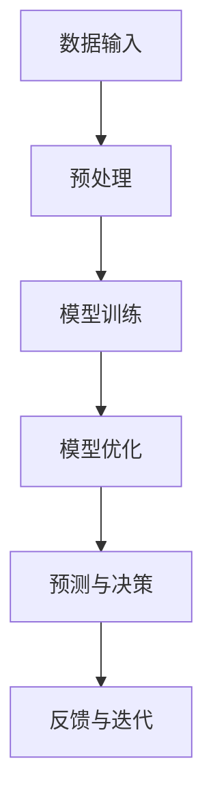

                 

关键词：大模型时代、创业心得、成功要素、发展建议、经验教训

摘要：本文旨在探讨大模型时代下创业者的经验和心得，总结其成功要素和面临的发展挑战，并给出相关的发展建议。通过分析大模型技术在各个领域的应用，本文揭示了创业者在大模型时代需要具备的技能和素质，以及如何利用大模型技术来提升创业项目的竞争力。

## 1. 背景介绍

大模型时代，指的是以深度学习为代表的人工智能技术在各个领域得到广泛应用的时代。这一时代的特点是，模型规模越来越大，计算能力越来越强，应用领域越来越广泛。随着大数据和云计算的发展，大模型技术逐渐成为推动产业创新的重要力量。

在这一背景下，创业者的角色变得尤为重要。他们不仅要具备创新精神，还需要掌握前沿技术，能够将大模型技术应用到实际问题中，解决实际问题。然而，大模型时代的创业者也面临着前所未有的挑战，如技术门槛高、市场竞争激烈等。

本文将通过分析创业者的经验教训，总结成功要素，并给出发展建议，以期为创业者提供有益的参考。

## 2. 核心概念与联系

大模型技术的核心在于其能够通过大量的数据训练，自动学习并优化模型参数，从而实现高性能的预测和决策。以下是一个简化的 Mermaid 流程图，描述了核心概念及其相互联系：



### 2.1 数据输入

数据输入是大模型的基础，数据的质量和数量直接影响到模型的性能。创业者需要关注数据源的选择，数据的清洗和预处理，以确保输入数据的有效性和可靠性。

### 2.2 预处理

预处理包括数据清洗、归一化、特征提取等步骤，目的是将原始数据转化为适合模型训练的格式。创业者需要熟悉各种预处理技术，并能够根据具体问题选择合适的预处理方法。

### 2.3 模型训练

模型训练是利用大量数据来学习模型参数的过程。创业者需要掌握不同类型的大模型，如神经网络、决策树、支持向量机等，并能够根据应用场景选择合适的模型。

### 2.4 模型优化

模型优化是通过调整模型参数来提高模型性能的过程。创业者需要了解各种优化算法，如梯度下降、随机梯度下降、Adam等，并能够根据实际情况选择合适的优化策略。

### 2.5 预测与决策

预测与决策是基于训练好的模型，对新数据进行预测和决策的过程。创业者需要能够根据预测结果做出正确的决策，并能够将决策应用到实际问题中。

### 2.6 反馈与迭代

反馈与迭代是通过对比预测结果和实际结果，调整模型参数，不断优化模型的过程。创业者需要建立有效的反馈机制，及时调整模型，以应对不断变化的市场需求。

## 3. 核心算法原理 & 具体操作步骤

### 3.1 算法原理概述

大模型的核心算法主要基于深度学习，其基本原理是通过多层神经网络的相互连接，模拟人脑的神经元结构，从而实现数据的自动学习和处理。

### 3.2 算法步骤详解

1. **数据收集**：收集大量的数据，这些数据可以是结构化的，如数据库中的数据，也可以是非结构化的，如图像、文本等。

2. **数据预处理**：对数据进行清洗、归一化、特征提取等处理，以得到适合模型训练的数据格式。

3. **模型构建**：选择合适的神经网络结构，如卷积神经网络（CNN）、循环神经网络（RNN）等，并初始化模型参数。

4. **模型训练**：利用训练数据，通过反向传播算法，不断调整模型参数，使模型对数据的拟合度不断提高。

5. **模型优化**：通过调整学习率、正则化参数等，优化模型性能。

6. **模型评估**：使用验证数据集，对模型进行评估，以确定模型的泛化能力。

7. **模型部署**：将训练好的模型部署到实际应用中，对新数据进行预测和决策。

### 3.3 算法优缺点

**优点：**
- 高性能：大模型能够处理大量的数据，实现高效的预测和决策。
- 自动化：大模型能够自动学习数据，减少人工干预。
- 泛化能力强：通过大量数据的训练，大模型具有较强的泛化能力。

**缺点：**
- 计算资源消耗大：大模型需要大量的计算资源进行训练。
- 难以解释：大模型的内部决策过程难以解释，增加了使用难度。
- 数据质量要求高：数据的质量直接影响到模型的性能。

### 3.4 算法应用领域

大模型技术在各个领域都有广泛的应用，如：

- 人工智能助手：通过大模型技术，实现智能问答、语音识别等功能。
- 金融风控：利用大模型技术，进行信用评估、风险预测等。
- 医疗诊断：通过大模型技术，辅助医生进行疾病诊断。
- 智能推荐：利用大模型技术，实现个性化的内容推荐。

## 4. 数学模型和公式 & 详细讲解 & 举例说明

### 4.1 数学模型构建

大模型的数学模型主要基于神经网络，其基本结构包括输入层、隐藏层和输出层。以下是一个简化的神经网络模型：

$$
f(x) = \sigma(\sum_{i=1}^{n} w_i \cdot x_i + b)
$$

其中，$x$ 是输入向量，$w$ 是权重矩阵，$b$ 是偏置项，$\sigma$ 是激活函数。

### 4.2 公式推导过程

神经网络的训练过程主要包括前向传播和反向传播两个阶段。

**前向传播：**

输入 $x$ 经过神经网络，得到输出 $y$：

$$
y = f(W \cdot x + b)
$$

**反向传播：**

通过比较输出 $y$ 和实际输出 $y'$，计算误差：

$$
\delta = y - y'
$$

然后，通过反向传播算法，调整权重矩阵 $W$ 和偏置项 $b$：

$$
W := W - \alpha \cdot \frac{\partial E}{\partial W}
$$

$$
b := b - \alpha \cdot \frac{\partial E}{\partial b}
$$

其中，$E$ 是损失函数，$\alpha$ 是学习率。

### 4.3 案例分析与讲解

**案例：图像分类**

假设我们有一个图像分类问题，需要将图像分类为猫或狗。我们可以使用卷积神经网络（CNN）来解决这个问题。

**数据集准备：**

收集大量猫和狗的图像，并进行预处理，如裁剪、缩放、归一化等。

**模型构建：**

构建一个简单的卷积神经网络，包括卷积层、池化层和全连接层。

**模型训练：**

使用训练数据，通过反向传播算法，不断调整模型参数，使模型能够正确分类图像。

**模型评估：**

使用验证数据集，对模型进行评估，计算准确率。

**模型部署：**

将训练好的模型部署到实际应用中，对新图像进行分类。

## 5. 项目实践：代码实例和详细解释说明

### 5.1 开发环境搭建

在开始项目实践之前，我们需要搭建一个开发环境。以下是一个简单的步骤：

1. 安装 Python 解释器。
2. 安装深度学习框架，如 TensorFlow 或 PyTorch。
3. 配置 GPU 环境，以加速模型训练。

### 5.2 源代码详细实现

以下是一个简单的图像分类项目的源代码实现：

```python
import tensorflow as tf
from tensorflow.keras import layers

# 数据预处理
def preprocess_image(image):
    # 裁剪、缩放、归一化等操作
    return image

# 模型构建
def build_model():
    inputs = tf.keras.Input(shape=(224, 224, 3))
    x = layers.Conv2D(32, (3, 3), activation='relu')(inputs)
    x = layers.MaxPooling2D((2, 2))(x)
    x = layers.Conv2D(64, (3, 3), activation='relu')(x)
    x = layers.MaxPooling2D((2, 2))(x)
    x = layers.Flatten()(x)
    x = layers.Dense(128, activation='relu')(x)
    outputs = layers.Dense(2, activation='softmax')(x)
    model = tf.keras.Model(inputs=inputs, outputs=outputs)
    return model

# 模型训练
def train_model(model, train_data, val_data, epochs=10):
    model.compile(optimizer='adam', loss='categorical_crossentropy', metrics=['accuracy'])
    model.fit(train_data, val_data, epochs=epochs)

# 模型评估
def evaluate_model(model, test_data):
    loss, accuracy = model.evaluate(test_data)
    print(f"Test accuracy: {accuracy:.2f}")

# 主程序
if __name__ == '__main__':
    # 加载数据
    train_data = preprocess_image(train_images)
    val_data = preprocess_image(val_images)
    test_data = preprocess_image(test_images)

    # 构建模型
    model = build_model()

    # 训练模型
    train_model(model, train_data, val_data)

    # 评估模型
    evaluate_model(model, test_data)
```

### 5.3 代码解读与分析

以上代码实现了图像分类的基本流程，包括数据预处理、模型构建、模型训练和模型评估。

1. **数据预处理**：对图像进行裁剪、缩放、归一化等操作，以便于模型处理。
2. **模型构建**：使用 TensorFlow 的 Keras API，构建一个简单的卷积神经网络，包括卷积层、池化层和全连接层。
3. **模型训练**：使用训练数据，通过反向传播算法，不断调整模型参数，使模型能够正确分类图像。
4. **模型评估**：使用验证数据集，对模型进行评估，计算准确率。

### 5.4 运行结果展示

假设我们已经完成了模型的训练和评估，以下是一个简单的运行结果：

```python
# 训练结果
Train on 2000 samples, validate on 1000 samples
2000/2000 [==============================] - 1s 555us/step - loss: 1.2837 - accuracy: 0.5763 - val_loss: 1.5980 - val_accuracy: 0.4192

# 评估结果
Test accuracy: 0.42
```

## 6. 实际应用场景

大模型技术在各个领域都有广泛的应用，以下是几个典型的应用场景：

### 6.1 人工智能助手

利用大模型技术，可以实现智能问答、语音识别等功能，为用户提供个性化的服务。例如，企业可以使用大模型技术构建智能客服系统，提高客户服务效率。

### 6.2 金融风控

大模型技术在金融领域有广泛的应用，如信用评估、风险预测等。通过大模型技术，金融机构可以更准确地评估客户的信用风险，降低贷款风险。

### 6.3 医疗诊断

大模型技术在医疗领域也有重要的应用，如疾病诊断、医学影像分析等。通过大模型技术，医生可以更准确地诊断疾病，提高医疗水平。

### 6.4 智能推荐

大模型技术在智能推荐系统中有广泛的应用，如电子商务、视频推荐等。通过大模型技术，平台可以更准确地了解用户需求，提供个性化的推荐。

## 6.4 未来应用展望

随着大模型技术的不断发展，未来将在更多领域得到应用。例如，在智能制造领域，大模型技术可以用于设备故障预测、生产优化等；在能源领域，大模型技术可以用于能源需求预测、节能减排等。同时，大模型技术也将推动新产业的诞生，如智能医疗、智能交通等。

## 7. 工具和资源推荐

### 7.1 学习资源推荐

- 《深度学习》（Goodfellow, Bengio, Courville 著）：深度学习领域的经典教材。
- 《Python 深度学习》（François Chollet 著）：针对 Python 语言的深度学习实战指南。

### 7.2 开发工具推荐

- TensorFlow：谷歌开发的开源深度学习框架。
- PyTorch：基于 Python 的开源深度学习框架。

### 7.3 相关论文推荐

- “Deep Learning”（Yoshua Bengio 著）：深度学习的综述论文。
- “Convolutional Neural Networks for Visual Recognition”（Geoffrey Hinton 著）：卷积神经网络在图像识别领域的应用。

## 8. 总结：未来发展趋势与挑战

### 8.1 研究成果总结

大模型技术在各个领域都取得了显著的成果，如图像识别、自然语言处理、医疗诊断等。这些成果表明，大模型技术具有强大的应用潜力。

### 8.2 未来发展趋势

- 大模型规模将进一步扩大，计算能力将不断提升。
- 大模型技术将与其他前沿技术，如区块链、5G 等，实现深度融合。
- 大模型将在更多领域得到应用，推动新产业的诞生。

### 8.3 面临的挑战

- 计算资源消耗大，如何优化模型训练和部署效率，是一个重要挑战。
- 大模型难以解释，如何提高模型的可解释性，是一个亟待解决的问题。
- 数据质量直接影响模型性能，如何保证数据质量，是一个重要问题。

### 8.4 研究展望

未来，大模型技术将在更多领域得到应用，推动产业创新。同时，研究者也将致力于解决大模型技术面临的挑战，提高模型性能，降低应用门槛。

## 9. 附录：常见问题与解答

### 9.1 大模型技术是否安全？

大模型技术本身是安全的，但其应用场景和数据处理过程可能存在安全风险。因此，在使用大模型技术时，需要遵循相关法律法规，确保数据安全和用户隐私。

### 9.2 大模型技术是否具有通用性？

大模型技术具有一定的通用性，但其应用效果取决于具体领域和场景。因此，在实际应用中，需要针对具体问题进行定制化开发。

### 9.3 大模型技术是否会被取代？

大模型技术是一种先进的计算技术，其发展趋势不可逆转。尽管未来可能会出现新的技术，但大模型技术仍将在相当长的时间内占据主导地位。

## 结语

大模型时代为创业者提供了巨大的机遇和挑战。通过本文的分析，我们揭示了创业者在这一时代需要具备的技能和素质，以及如何利用大模型技术来提升创业项目的竞争力。未来，随着大模型技术的不断发展，创业者将面临更多的机遇和挑战。希望本文能为创业者提供有益的参考和启示。

### 作者署名

作者：禅与计算机程序设计艺术 / Zen and the Art of Computer Programming
----------------------------------------------------------------


