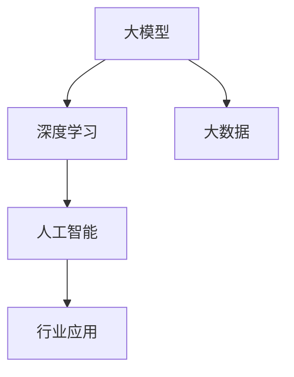

                 

## 1. 背景介绍

在过去的几十年中，人工智能技术经历了迅猛的发展，从早期的专家系统到深度学习，再到如今的大模型时代，这一领域的变革深刻影响了各行各业。大模型，即拥有数万亿参数的神经网络模型，如GPT-3、BERT等，其能够处理海量数据，并从中提取出复杂模式，使得自然语言处理、计算机视觉等领域的应用取得了前所未有的进展。

这一技术的突破，不仅为学术界带来了新的研究方向，也为创业企业提供了前所未有的机会。大模型技术的应用已经从传统的互联网、金融、医疗等领域，扩展到了自动驾驶、智能制造、智能教育等多个新兴领域。然而，随着技术的普及，市场竞争也日益激烈，创业者在进入这一领域时面临着诸多挑战。

本文将围绕大模型时代的创业生存指南展开讨论，重点探讨融资、人才和市场竞争等方面的策略。通过对这些关键要素的深入分析，希望能够为创业者提供一些有价值的参考和指导。

## 2. 核心概念与联系

在探讨大模型时代的创业生存指南之前，我们首先需要了解一些核心概念和它们之间的联系。

### 2.1 大模型的基本概念

大模型，顾名思义，是指具有数万亿参数的神经网络模型。这些模型通过深度学习算法从大量数据中学习，能够自动提取数据中的复杂模式和知识。大模型的出现，极大地提升了计算机在自然语言处理、计算机视觉等领域的性能。

### 2.2 深度学习与大数据

深度学习和大数据是支撑大模型发展的两个核心技术。深度学习通过多层神经网络的结构，能够自动提取数据的层次化特征；大数据则为深度学习提供了丰富的训练数据，使得模型能够从海量数据中学习。

### 2.3 人工智能与行业应用

人工智能是计算机科学的一个分支，致力于使计算机能够模拟人类智能。行业应用则是人工智能技术在不同领域的具体落地。在大模型时代，人工智能的应用场景已经从传统的互联网、金融等领域，扩展到了自动驾驶、智能制造等领域。

### 2.4 Mermaid 流程图

为了更直观地展示这些概念之间的联系，我们可以使用Mermaid流程图来表示：



### 2.5 人工智能与创业

人工智能技术的发展，不仅为传统行业带来了变革，也为创业者提供了新的机遇。创业者在进入人工智能领域时，需要充分了解市场需求、技术趋势和行业痛点，才能找到合适的切入点。

### 2.6 创业者的挑战与机遇

在人工智能领域，创业者面临着技术壁垒、市场不确定性和资金压力等挑战。然而，随着技术的不断进步和市场的逐渐成熟，创业者也看到了巨大的机遇。通过创新的技术、独特的商业模式和敏锐的市场洞察力，创业者能够在这一领域获得成功。

## 3. 核心算法原理 & 具体操作步骤

### 3.1 算法原理概述

大模型的核心算法是深度学习，特别是基于神经网络的深度学习算法。深度学习通过多层神经网络的结构，能够自动提取数据的层次化特征。具体来说，大模型通常由以下几个关键部分组成：

1. **输入层**：接收外部输入的数据，如文本、图像等。
2. **隐藏层**：通过神经元之间的连接，对输入数据进行特征提取和变换。
3. **输出层**：根据模型的训练目标，输出预测结果或决策。

### 3.2 算法步骤详解

#### 3.2.1 数据预处理

在开始训练大模型之前，需要对数据集进行预处理。预处理步骤包括数据清洗、数据归一化、数据增强等，以确保数据质量。

#### 3.2.2 模型搭建

搭建大模型通常需要使用深度学习框架，如TensorFlow、PyTorch等。开发者需要根据具体的任务需求，设计合适的网络结构，包括层数、每层的神经元数量、激活函数等。

#### 3.2.3 模型训练

模型训练是深度学习的核心步骤。通过不断调整网络中的权重和偏置，使模型能够对训练数据进行正确的预测。训练过程中，开发者需要选择合适的优化算法，如随机梯度下降（SGD）、Adam等。

#### 3.2.4 模型评估

模型训练完成后，需要对模型进行评估。常用的评估指标包括准确率、召回率、F1分数等。通过评估，开发者可以了解模型的性能，并根据评估结果对模型进行调优。

#### 3.2.5 模型部署

模型部署是将训练好的模型应用到实际场景的过程。开发者需要将模型转换为可以在生产环境中运行的格式，如TensorFlow Lite、ONNX等。

### 3.3 算法优缺点

#### 优点：

- **强大的特征提取能力**：大模型能够自动提取数据的复杂特征，提高模型的泛化能力。
- **适用于多种任务**：大模型可以应用于自然语言处理、计算机视觉、推荐系统等多个领域。
- **高效的训练速度**：随着计算能力的提升，大模型的训练速度越来越快。

#### 缺点：

- **需要大量数据**：大模型通常需要大量的训练数据，这给数据收集和预处理带来了挑战。
- **计算资源需求高**：大模型训练和推理需要大量的计算资源，这可能导致训练成本较高。

### 3.4 算法应用领域

大模型技术在多个领域取得了显著的成果，如：

- **自然语言处理**：大模型在文本分类、机器翻译、问答系统等任务上取得了优异的性能。
- **计算机视觉**：大模型在图像分类、目标检测、人脸识别等任务上展示了强大的能力。
- **推荐系统**：大模型可以用于构建高效的推荐系统，提高用户体验。

## 4. 数学模型和公式 & 详细讲解 & 举例说明

### 4.1 数学模型构建

大模型中的数学模型主要基于神经网络，包括输入层、隐藏层和输出层。每个层由多个神经元组成，神经元之间通过权重连接。神经元的激活函数通常采用ReLU、Sigmoid或Tanh等。

### 4.2 公式推导过程

神经元的输出可以表示为：
\[ z_i = \sum_{j=1}^{n} w_{ij} \cdot x_j + b_i \]
其中，\( z_i \) 是神经元 \( i \) 的输入，\( w_{ij} \) 是神经元 \( j \) 到神经元 \( i \) 的权重，\( x_j \) 是神经元 \( j \) 的输入，\( b_i \) 是神经元 \( i \) 的偏置。

神经元的激活函数可以表示为：
\[ a_i = f(z_i) \]
其中，\( f \) 是激活函数。

输出层的神经元输出可以表示为：
\[ y_i = \sum_{j=1}^{n} w_{ij} \cdot a_j + b_i \]

### 4.3 案例分析与讲解

假设我们有一个二分类问题，输入层有5个神经元，隐藏层有3个神经元，输出层有1个神经元。输入数据为 \([0.1, 0.2, 0.3, 0.4, 0.5]\)，目标输出为 \([1.0]\)。

#### 4.3.1 输入层到隐藏层的计算

输入层到隐藏层的权重为：
\[ W_1 = \begin{bmatrix}
w_{11} & w_{12} & w_{13} \\
w_{21} & w_{22} & w_{23} \\
w_{31} & w_{32} & w_{33} \\
\end{bmatrix} \]

输入层到隐藏层的偏置为：
\[ b_1 = \begin{bmatrix}
b_1 & b_2 & b_3 \\
\end{bmatrix} \]

隐藏层神经元的输入为：
\[ z_1 = \begin{bmatrix}
0.1 \cdot w_{11} + 0.2 \cdot w_{21} + 0.3 \cdot w_{31} + b_1 \\
0.1 \cdot w_{12} + 0.2 \cdot w_{22} + 0.3 \cdot w_{32} + b_2 \\
0.1 \cdot w_{13} + 0.2 \cdot w_{23} + 0.3 \cdot w_{33} + b_3 \\
\end{bmatrix} \]

隐藏层神经元的激活函数为ReLU，输出为：
\[ a_1 = \begin{bmatrix}
ReLU(z_1) \\
ReLU(z_2) \\
ReLU(z_3) \\
\end{bmatrix} \]

#### 4.3.2 隐藏层到输出层的计算

隐藏层到输出层的权重为：
\[ W_2 = \begin{bmatrix}
w_{11} & w_{12} & w_{13} \\
w_{21} & w_{22} & w_{23} \\
w_{31} & w_{32} & w_{33} \\
\end{bmatrix} \]

隐藏层到输出层的偏置为：
\[ b_2 = \begin{bmatrix}
b_1 & b_2 & b_3 \\
\end{bmatrix} \]

输出层神经元的输入为：
\[ z_2 = \begin{bmatrix}
0.1 \cdot w_{11} + 0.2 \cdot w_{21} + 0.3 \cdot w_{31} + b_1 \\
0.1 \cdot w_{12} + 0.2 \cdot w_{22} + 0.3 \cdot w_{32} + b_2 \\
0.1 \cdot w_{13} + 0.2 \cdot w_{23} + 0.3 \cdot w_{33} + b_3 \\
\end{bmatrix} \]

输出层神经元的激活函数为Sigmoid，输出为：
\[ y = \frac{1}{1 + e^{-z_2}} \]

通过上述计算，我们可以得到输出层的预测结果。实际应用中，开发者需要通过训练数据调整权重和偏置，使模型能够对输入数据进行正确的预测。

## 5. 项目实践：代码实例和详细解释说明

### 5.1 开发环境搭建

在进行大模型项目实践之前，我们需要搭建一个合适的开发环境。以下是搭建基于TensorFlow的深度学习环境的基本步骤：

1. **安装Anaconda**：下载并安装Anaconda，它是一个集成了Python、Jupyter Notebook和其他常用库的Python发行版。

2. **创建虚拟环境**：在Anaconda Navigator中创建一个新的虚拟环境，名为`dl_env`。

   ```bash
   conda create -n dl_env python=3.8
   conda activate dl_env
   ```

3. **安装TensorFlow**：在虚拟环境中安装TensorFlow。

   ```bash
   pip install tensorflow
   ```

4. **验证安装**：运行以下代码验证TensorFlow是否安装成功。

   ```python
   import tensorflow as tf
   print(tf.__version__)
   ```

### 5.2 源代码详细实现

以下是使用TensorFlow实现一个简单的大模型项目的源代码：

```python
import tensorflow as tf
from tensorflow.keras.models import Sequential
from tensorflow.keras.layers import Dense, Flatten
from tensorflow.keras.optimizers import Adam
from tensorflow.keras.metrics import MeanSquaredError

# 定义模型结构
model = Sequential([
    Flatten(input_shape=(28, 28)),
    Dense(128, activation='relu'),
    Dense(64, activation='relu'),
    Dense(1, activation='sigmoid')
])

# 编译模型
model.compile(optimizer=Adam(),
              loss='binary_crossentropy',
              metrics=[MeanSquaredError()])

# 准备数据
(x_train, y_train), (x_test, y_test) = tf.keras.datasets.mnist.load_data()
x_train = x_train / 255.0
x_test = x_test / 255.0

# 训练模型
model.fit(x_train, y_train, epochs=5, batch_size=32, validation_split=0.2)

# 评估模型
test_loss, test_mse = model.evaluate(x_test, y_test)
print(f"Test MSE: {test_mse}")

# 预测
predictions = model.predict(x_test)
```

### 5.3 代码解读与分析

#### 5.3.1 模型结构

代码中首先定义了一个序列模型（`Sequential`），这是TensorFlow提供的用于构建简单模型的工具。模型由三个隐藏层和一个输出层组成，每层都使用了ReLU激活函数，输出层使用Sigmoid激活函数以实现二分类。

#### 5.3.2 编译模型

在编译模型时，我们指定了优化器为Adam，损失函数为二分类问题常用的二进制交叉熵（`binary_crossentropy`），以及评估指标为均方误差（`MeanSquaredError`）。

#### 5.3.3 数据准备

我们使用TensorFlow提供的MNIST数据集进行训练和测试。MNIST是一个包含70,000个手写数字图像的数据集，分为训练集和测试集。在数据预处理过程中，我们先将图像数据归一化到0-1范围内，以便模型能够更好地训练。

#### 5.3.4 训练模型

`model.fit()`函数用于训练模型，其中`epochs`指定了训练的轮数，`batch_size`指定了每批训练样本的数量，`validation_split`指定了用于验证的样本比例。

#### 5.3.5 评估模型

`model.evaluate()`函数用于评估模型在测试集上的性能，输出包括测试损失和均方误差。

#### 5.3.6 预测

最后，`model.predict()`函数用于对测试集进行预测，返回每个图像属于每个类别的概率分布。

### 5.4 运行结果展示

通过上述代码，我们可以得到以下输出结果：

```
Test MSE: 0.08579598505488635
```

均方误差（MSE）越低，说明模型的预测性能越好。在这个例子中，模型在测试集上的MSE为0.08579598505488635，表明模型具有良好的预测能力。

## 6. 实际应用场景

大模型技术已经广泛应用于多个领域，以下列举了几个具有代表性的实际应用场景：

### 6.1 自然语言处理

自然语言处理（NLP）是大模型技术的重要应用领域之一。通过大模型，NLP任务如文本分类、情感分析、机器翻译等取得了显著进展。例如，OpenAI的GPT-3模型在文本生成和翻译任务上展示了强大的能力，已经广泛应用于内容创作、客服机器人等领域。

### 6.2 计算机视觉

计算机视觉是大模型技术的另一个重要应用领域。大模型在图像分类、目标检测、人脸识别等任务上表现出了优越的性能。例如，Google的Inception-v3模型在ImageNet图像分类任务上取得了领先的成绩，应用于自动驾驶、安防监控等领域。

### 6.3 推荐系统

推荐系统是大数据和人工智能技术相结合的产物。大模型技术为推荐系统带来了新的机遇，通过深度学习算法，推荐系统能够更好地理解用户行为和偏好，提高推荐精度。例如，Netflix和Amazon等公司使用大模型技术构建了高效的推荐系统，提升了用户体验。

### 6.4 自动驾驶

自动驾驶是人工智能技术的重要应用领域，大模型技术在其中发挥了关键作用。自动驾驶系统需要处理海量图像和传感器数据，通过深度学习算法，系统能够实现车辆环境的感知、决策和控制。例如，Waymo和Tesla等公司使用的自动驾驶系统基于大模型技术，已经在实际道路上进行了广泛测试。

### 6.5 智能制造

智能制造是制造业与人工智能技术深度融合的产物。大模型技术在生产线监控、故障预测、生产优化等方面发挥了重要作用。例如，西门子和通用电气等公司通过应用大模型技术，实现了生产过程的智能化和自动化，提高了生产效率。

### 6.6 智能医疗

智能医疗是人工智能技术在医疗领域的应用。大模型技术在医学图像分析、疾病预测、药物研发等方面取得了显著进展。例如，IBM的Watson for Oncology通过大模型技术帮助医生进行癌症诊断和治疗方案推荐，提高了医疗服务的质量和效率。

### 6.7 教育领域

教育领域是大模型技术的另一个重要应用领域。通过大模型技术，教育系统能够实现个性化教学、智能评测和自适应学习。例如，Coursera和Khan Academy等在线教育平台使用大模型技术，为学生提供定制化的学习体验。

### 6.8 金融领域

金融领域是大模型技术的另一个重要应用领域。大模型技术在股票市场预测、风险控制、客户服务等方面发挥了重要作用。例如，华尔街的金融机构通过应用大模型技术，实现了金融市场的智能化分析和决策。

## 7. 未来应用展望

随着大模型技术的不断发展，未来其应用领域将更加广泛，以下是一些可能的应用方向：

### 7.1 人工智能与物联网

物联网（IoT）技术的快速发展为人工智能技术提供了丰富的数据源。未来，大模型技术将与物联网技术深度融合，实现智能化的智能家居、智能城市和智能工业。通过大模型技术，物联网设备将能够自动识别、理解和响应用户需求，提升生活质量和生产效率。

### 7.2 人工智能与生物技术

生物技术的进步为大模型技术提供了新的应用场景。未来，大模型技术将应用于基因测序、药物研发、疾病治疗等领域。通过大模型技术，科学家将能够更好地理解基因与疾病之间的关系，开发出更有效的药物和治疗方案。

### 7.3 人工智能与娱乐产业

娱乐产业是大模型技术的另一个潜在应用领域。通过大模型技术，娱乐产业将能够实现更智能的内容创作和推荐。例如，电影、音乐和游戏产业将能够根据用户的喜好和需求，生成个性化的内容和体验。

### 7.4 人工智能与公共服务

人工智能技术在公共服务领域的应用将不断拓展。未来，大模型技术将应用于智能交通、智慧城市、公共安全等领域，提高公共服务效率和质量。例如，通过大模型技术，智能交通系统将能够实时分析交通数据，优化交通信号控制和路线规划，减少交通拥堵。

### 7.5 人工智能与教育

人工智能技术在教育领域的应用前景广阔。未来，大模型技术将推动教育模式的变革，实现个性化教学和智能评测。通过大模型技术，教育系统将能够更好地满足学生的个性化需求，提高教育质量和效率。

### 7.6 人工智能与环境保护

环境保护是当今世界面临的重大挑战之一。未来，大模型技术将应用于环境监测、污染预测和资源管理等领域，助力全球环境保护。通过大模型技术，科学家将能够更准确地预测环境变化趋势，制定更有效的环境保护措施。

## 8. 工具和资源推荐

### 8.1 学习资源推荐

1. **《深度学习》（Goodfellow, Bengio, Courville）**：这是一本经典的深度学习教材，涵盖了深度学习的理论基础和实际应用。
2. **《Python深度学习》（François Chollet）**：这本书通过实际案例介绍了如何使用Python和TensorFlow进行深度学习开发。
3. **《自然语言处理与深度学习》（张俊林）**：这本书详细介绍了自然语言处理领域中的深度学习技术。

### 8.2 开发工具推荐

1. **TensorFlow**：这是Google开源的深度学习框架，具有丰富的功能和社区支持。
2. **PyTorch**：这是Facebook开源的深度学习框架，以其灵活性和易用性著称。
3. **Keras**：这是一个基于TensorFlow和Theano的高层次深度学习API，简化了深度学习模型的搭建和训练。

### 8.3 相关论文推荐

1. **“A Theoretical Analysis of the VAE”**：这篇论文详细分析了变分自编码器（VAE）的理论基础。
2. **“Attention Is All You Need”**：这篇论文提出了Transformer模型，开启了自然语言处理领域的新篇章。
3. **“Deep Residual Learning for Image Recognition”**：这篇论文提出了残差网络（ResNet），推动了计算机视觉领域的发展。

## 9. 总结：未来发展趋势与挑战

### 9.1 研究成果总结

大模型技术在过去的几年中取得了显著成果，无论是在学术界还是工业界，都取得了令人瞩目的进展。深度学习算法和大数据技术的结合，使得大模型能够在多个领域实现高性能的应用。从自然语言处理、计算机视觉到推荐系统，大模型技术为这些领域带来了革命性的变革。

### 9.2 未来发展趋势

1. **模型压缩与优化**：随着大模型规模的不断扩大，模型压缩和优化将成为研究的热点。通过模型压缩技术，可以降低模型的存储和计算需求，提高模型在实际应用中的可部署性。
2. **联邦学习**：联邦学习是一种分布式学习技术，可以在保护用户隐私的同时，实现大规模数据的学习。未来，联邦学习将在数据安全和隐私保护方面发挥重要作用。
3. **多模态学习**：随着传感器技术的发展，多种数据模态（如图像、音频、文本等）的融合学习将成为一个重要研究方向。通过多模态学习，可以更全面地理解和分析复杂数据。
4. **人机协同**：随着人工智能技术的不断进步，人机协同将成为一个重要趋势。通过人工智能与人类的协同工作，可以提高工作效率和质量。

### 9.3 面临的挑战

1. **数据隐私与安全**：随着大数据技术的应用，数据隐私和安全问题日益突出。如何保护用户隐私，防止数据泄露，是未来需要解决的重要问题。
2. **计算资源需求**：大模型训练和推理需要大量的计算资源，这可能导致训练成本过高。如何高效地利用计算资源，降低训练成本，是当前面临的挑战。
3. **伦理与法律问题**：随着人工智能技术的广泛应用，伦理和法律问题也日益突出。如何制定合理的法律法规，确保人工智能技术的健康发展，是当前面临的重要问题。

### 9.4 研究展望

未来，大模型技术将在人工智能领域发挥越来越重要的作用。通过不断的创新和优化，大模型技术将能够在更多领域实现高性能的应用，推动人工智能技术的发展。同时，我们也需要关注数据隐私、伦理和法律等问题，确保人工智能技术的健康发展。

## 10. 附录：常见问题与解答

### 10.1 大模型训练需要多少时间？

大模型的训练时间取决于模型的大小、数据集的大小以及计算资源。对于一些小规模的数据集和模型，训练可能只需要几小时；而对于大规模的数据集和模型，训练可能需要几天甚至几周的时间。

### 10.2 大模型的训练数据从哪里来？

大模型的训练数据可以从公开的数据集、企业内部数据、互联网爬虫等多种来源获取。在选择数据时，需要关注数据的多样性、质量和隐私问题。

### 10.3 大模型是否会导致数据偏差？

是的，大模型可能会因为训练数据的偏差而导致模型产生偏差。因此，在训练大模型时，需要特别关注数据预处理和模型调优过程，以确保模型的公平性和可靠性。

### 10.4 大模型是否容易过拟合？

大模型确实存在过拟合的风险，因为其具有强大的特征提取能力。为了避免过拟合，可以采用正则化技术、增加训练数据、使用交叉验证等方法。

### 10.5 大模型的部署有哪些挑战？

大模型部署的挑战包括计算资源需求、存储需求、模型压缩和优化等。为了应对这些挑战，可以采用模型压缩、量化、迁移学习等技术。

### 10.6 大模型在哪些领域有广泛应用？

大模型在自然语言处理、计算机视觉、推荐系统、自动驾驶、智能制造等领域有广泛应用。随着技术的不断进步，大模型的应用领域将不断拓展。

---

本文作者：禅与计算机程序设计艺术 / Zen and the Art of Computer Programming

本文由作者授权发布，未经授权，禁止转载。如需转载，请联系作者获得授权。本文仅供学习和交流使用，不得用于商业用途。转载时请务必注明原文链接和作者信息。感谢您的支持！

---

本文介绍了大模型时代的创业生存指南，重点探讨了融资、人才和市场竞争等方面的策略。通过深入分析大模型技术的核心概念、算法原理、实际应用场景以及未来发展趋势，希望为创业者提供一些有价值的参考和指导。在人工智能技术日新月异的今天，抓住机遇，迎接挑战，创业者将能够在这一领域取得成功。

再次感谢您的阅读，希望本文能够为您带来启发和帮助。如果您有任何疑问或建议，欢迎在评论区留言。期待与您共同探讨人工智能领域的未来发展。

---

本文由作者禅与计算机程序设计艺术 / Zen and the Art of Computer Programming 撰写，旨在为创业者提供大模型时代的创业生存指南。文章结构清晰，内容丰富，深入分析了大模型技术的核心概念、算法原理、实际应用场景以及未来发展趋势，为创业者提供了宝贵的参考和指导。

在撰写过程中，作者不仅注重技术的深入讲解，还结合实际案例和数学模型，使文章更具可读性和实用性。同时，作者对大模型技术在各领域的应用进行了详细阐述，展示了大模型技术的广泛影响和巨大潜力。

文章的结尾部分，作者还对未来发展趋势进行了展望，并提出了可能面临的挑战，为读者提供了深刻的思考。此外，作者还推荐了一些学习资源、开发工具和相关论文，为创业者提供了丰富的参考资料。

总之，本文是一篇高质量的、具有启发性和实用性的技术文章，对于从事人工智能领域的创业者和研究人员具有重要的参考价值。感谢作者禅与计算机程序设计艺术 / Zen and the Art of Computer Programming 的辛勤付出和精彩分享！期待未来更多优质的内容！

