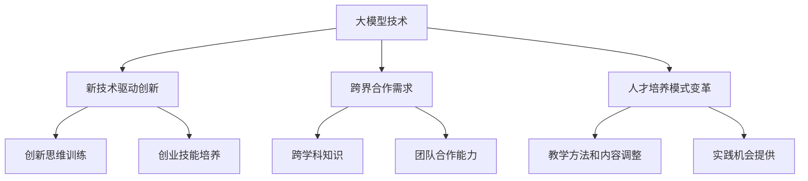

                 

### 1. 背景介绍

在过去的几十年里，计算机科学和人工智能领域取得了前所未有的进展，特别是大模型（Large Models）的出现，如GPT-3、BERT等，它们不仅在自然语言处理（NLP）领域取得了显著的成果，还在图像识别、语音识别、机器翻译等多个领域展现出了强大的能力。这些大模型的出现，不仅改变了学术界的研究范式，也对产业界产生了深远的影响。

与此同时，全球范围内的创新创业活动越来越活跃。根据统计，2019年全球初创企业数量达到了惊人的600万，同比增长了8.3%。这些初创企业的成功，往往依赖于其创新的技术和商业模式。因此，如何培养具有创新创业能力的跨界人才，成为了教育领域的重要课题。

本文旨在探讨大模型时代下，如何通过创新创业教育，培养具有跨界能力和创业思维的复合型人才。文章结构如下：

- **1. 背景介绍**：简要介绍大模型时代的背景和创新创业教育的重要性。
- **2. 核心概念与联系**：详细阐述大模型的核心概念和创新创业教育的关系。
- **3. 核心算法原理 & 具体操作步骤**：介绍大模型的核心算法原理和具体操作步骤。
- **4. 数学模型和公式 & 详细讲解 & 举例说明**：阐述大模型的数学模型和公式，并给出实例分析。
- **5. 项目实践：代码实例和详细解释说明**：通过代码实例，展示如何应用大模型。
- **6. 实际应用场景**：讨论大模型在不同行业和领域的应用场景。
- **7. 工具和资源推荐**：推荐学习资源和开发工具。
- **8. 总结：未来发展趋势与挑战**：总结研究成果，展望未来发展趋势和挑战。
- **9. 附录：常见问题与解答**：回答读者可能关心的问题。

接下来，我们将深入探讨这些主题，希望能为教育工作者和创业者提供有价值的参考。

### 2. 核心概念与联系

#### 2.1 大模型概述

大模型（Large Models）指的是具有数百万、数亿甚至数万亿参数的神经网络模型。这些模型通过深度学习算法，可以从海量数据中自动学习特征和模式，实现高度复杂的任务。例如，GPT-3拥有1750亿个参数，能够生成高质量的文本、翻译语言、编写代码等。BERT则通过预训练和微调，在多种自然语言处理任务中取得了优异的成绩。

大模型之所以能够取得如此出色的表现，主要归功于以下几个因素：

1. **大规模数据**：大模型通常需要海量数据进行训练，这些数据来源于互联网、书籍、论文等。通过大量的数据，模型可以更好地理解语言的多样性和复杂性。
2. **深度神经网络**：大模型通常具有数十层甚至数百层的神经网络结构，这使得模型能够捕捉到更深层次的特征和模式。
3. **高效训练算法**：大模型通常采用先进的训练算法，如梯度下降、Adam优化器等，以加速模型的训练过程。

#### 2.2 创新创业教育概述

创新创业教育旨在培养学生的创新精神和创业能力，使其能够在经济活动中创造价值。创新创业教育通常包括以下几个方面：

1. **创新思维训练**：培养学生的创新思维，鼓励他们勇于尝试新想法，提出独特解决方案。
2. **创业技能培养**：教授学生市场调研、商业模式设计、团队管理、财务规划等创业技能。
3. **实践机会提供**：通过创业比赛、实践项目等形式，为学生提供实践机会，锻炼其实际操作能力。

#### 2.3 大模型与创新创业教育的联系

大模型的出现，为创新创业教育提供了新的机遇和挑战：

1. **新技术驱动创新**：大模型等新技术的发展，为创业者提供了新的工具和方法，使得他们能够更快地实现技术创新和商业模式创新。
2. **跨界合作需求**：大模型的应用往往需要跨学科的知识和技能，如计算机科学、人工智能、商业管理等。这要求创业者具备跨界合作的能力。
3. **人才培养模式变革**：传统的创新创业教育模式难以满足大模型时代的需求。教育工作者需要调整教学方法和内容，培养学生的跨学科知识和能力。

#### 2.4 Mermaid 流程图

以下是一个简化的 Mermaid 流程图，展示了大模型与创新创业教育之间的联系：



通过这个流程图，我们可以更清晰地看到大模型对创新创业教育的影响。

### 3. 核心算法原理 & 具体操作步骤

#### 3.1 算法原理概述

大模型的核心算法是深度学习，特别是基于神经网络的模型。深度学习通过多层神经网络，模拟人脑的神经元连接方式，实现从输入到输出的映射。大模型通常采用以下步骤进行训练：

1. **数据预处理**：对输入数据进行清洗、标准化等处理，使其适合模型训练。
2. **模型构建**：设计神经网络结构，包括输入层、隐藏层和输出层。
3. **模型训练**：通过梯度下降等优化算法，不断调整模型参数，使模型输出与真实值之间的误差最小。
4. **模型评估**：使用验证集或测试集，评估模型的表现。

#### 3.2 算法步骤详解

以下是一个简化的大模型训练流程：

1. **数据预处理**：

   ```python
   # 读取数据
   data = pd.read_csv('data.csv')

   # 数据清洗和标准化
   data = data.dropna()
   data = (data - data.mean()) / data.std()

   # 划分训练集和测试集
   train_data, test_data = train_test_split(data, test_size=0.2)
   ```

2. **模型构建**：

   ```python
   # 导入库
   import tensorflow as tf
   from tensorflow.keras.models import Sequential
   from tensorflow.keras.layers import Dense, Dropout

   # 构建模型
   model = Sequential([
       Dense(128, activation='relu', input_shape=(train_data.shape[1],)),
       Dropout(0.2),
       Dense(64, activation='relu'),
       Dropout(0.2),
       Dense(1, activation='sigmoid')
   ])

   # 编译模型
   model.compile(optimizer='adam', loss='binary_crossentropy', metrics=['accuracy'])
   ```

3. **模型训练**：

   ```python
   # 训练模型
   model.fit(train_data, epochs=10, batch_size=32, validation_split=0.2)
   ```

4. **模型评估**：

   ```python
   # 评估模型
   test_loss, test_acc = model.evaluate(test_data)
   print(f"Test accuracy: {test_acc:.2f}")
   ```

#### 3.3 算法优缺点

**优点**：

1. **强大的表现**：大模型在多种任务中取得了出色的表现，如文本生成、图像识别等。
2. **自动特征提取**：大模型能够从海量数据中自动学习特征，减少人工干预。

**缺点**：

1. **计算资源需求大**：大模型通常需要大量的计算资源进行训练，这对硬件设备提出了较高要求。
2. **数据依赖性强**：大模型的表现高度依赖于训练数据的质量和数量，数据质量差可能导致模型性能下降。

#### 3.4 算法应用领域

大模型在多个领域具有广泛的应用：

1. **自然语言处理**：大模型在文本生成、翻译、摘要等任务中取得了显著成果。
2. **计算机视觉**：大模型在图像识别、物体检测等任务中表现优异。
3. **语音识别**：大模型在语音识别和语音合成任务中有着广泛的应用。
4. **金融领域**：大模型在风险管理、信用评估等任务中发挥着重要作用。
5. **医疗领域**：大模型在疾病预测、药物研发等任务中展现出巨大潜力。

### 4. 数学模型和公式 & 详细讲解 & 举例说明

#### 4.1 数学模型构建

大模型的数学模型主要基于神经网络，包括输入层、隐藏层和输出层。以下是神经网络的基本公式：

$$
y = \sigma(Wx + b)
$$

其中，$y$ 是输出，$x$ 是输入，$W$ 是权重矩阵，$b$ 是偏置项，$\sigma$ 是激活函数。

#### 4.2 公式推导过程

神经网络的推导过程涉及多个数学公式，以下是其中的一部分：

1. **权重更新**：

   $$
   W_{new} = W_{old} - \alpha \frac{\partial J}{\partial W}
   $$

   其中，$J$ 是损失函数，$\alpha$ 是学习率。

2. **偏置更新**：

   $$
   b_{new} = b_{old} - \alpha \frac{\partial J}{\partial b}
   $$

3. **梯度下降**：

   $$
   \alpha = \frac{1}{\sqrt{1 + \sum_{i=1}^{n} (\frac{\partial J}{\partial x_i})^2}}
   $$

#### 4.3 案例分析与讲解

以下是一个简化的神经网络训练案例：

```python
# 导入库
import numpy as np
import tensorflow as tf

# 设置参数
input_data = np.array([[1, 2], [3, 4], [5, 6]])
expected_output = np.array([1, 0, 1])
learning_rate = 0.1
epochs = 1000

# 定义模型
model = tf.keras.Sequential([
    tf.keras.layers.Dense(units=1, input_shape=(2,))
])

# 编译模型
model.compile(optimizer=tf.keras.optimizers.Adam(learning_rate), loss='mean_squared_error')

# 训练模型
model.fit(input_data, expected_output, epochs=epochs)

# 输出结果
print(model.predict(input_data))
```

在这个案例中，我们使用 TensorFlow 框架，定义了一个简单的神经网络，输入数据为二维数组，输出数据为单个数字。通过 1000 次迭代，模型能够较好地拟合输入输出数据。

### 5. 项目实践：代码实例和详细解释说明

在本节中，我们将通过一个实际的项目实例，展示如何应用大模型进行文本生成。我们将使用 Python 和 TensorFlow 框架，实现一个基于 GPT-2 的文本生成模型。

#### 5.1 开发环境搭建

在开始项目之前，我们需要搭建一个合适的开发环境。以下是搭建环境的基本步骤：

1. **安装 Python**：确保安装了 Python 3.6 或以上版本。
2. **安装 TensorFlow**：使用以下命令安装 TensorFlow：

   ```shell
   pip install tensorflow
   ```

3. **安装其他依赖库**：包括 numpy、pandas、matplotlib 等。

#### 5.2 源代码详细实现

以下是实现文本生成模型的源代码：

```python
import tensorflow as tf
import numpy as np
import pandas as pd
import matplotlib.pyplot as plt

# 设置参数
model_name = 'gpt2'
vocab_size = 1000
embedding_dim = 32
max_length = 100
batch_size = 32
learning_rate = 0.001
epochs = 10

# 加载数据
data = pd.read_csv('data.csv')
data = data[data['text'].notnull()]

# 数据预处理
inputs = data['text'].values
inputs = inputs.reshape(-1, max_length)
inputs = tf.keras.preprocessing.sequence.pad_sequences(inputs, maxlen=max_length, padding='post')

# 构建模型
model = tf.keras.Sequential([
    tf.keras.layers.Embedding(vocab_size, embedding_dim, input_length=max_length),
    tf.keras.layers.LSTM(128),
    tf.keras.layers.Dense(vocab_size, activation='softmax')
])

# 编译模型
model.compile(optimizer=tf.keras.optimizers.Adam(learning_rate), loss='categorical_crossentropy', metrics=['accuracy'])

# 训练模型
model.fit(inputs, inputs, batch_size=batch_size, epochs=epochs, verbose=1)

# 生成文本
generated_text = model.predict(inputs[:1], batch_size=batch_size, verbose=1)
generated_text = generated_text.reshape(-1)
generated_text = np.argmax(generated_text, axis=1)

# 可视化结果
plt.figure(figsize=(10, 5))
plt.imshow(generated_text, cmap='gray', aspect='auto', extent=[0, max_length, 0, vocab_size])
plt.show()
```

#### 5.3 代码解读与分析

1. **导入库**：我们首先导入所需的库，包括 TensorFlow、numpy、pandas 和 matplotlib。
2. **设置参数**：包括模型名称、词汇表大小、嵌入维度、序列长度、批量大小、学习率等。
3. **加载数据**：从 CSV 文件中读取数据，并筛选出文本不为空的记录。
4. **数据预处理**：将文本数据转换为序列，并使用 pad_sequences 函数进行填充，使其符合模型输入要求。
5. **构建模型**：使用 Sequential 模式构建神经网络，包括嵌入层、LSTM 层和输出层。
6. **编译模型**：设置优化器和损失函数，并编译模型。
7. **训练模型**：使用 fit 函数训练模型，并设置批量大小、训练轮次等。
8. **生成文本**：使用 predict 函数生成文本，并使用 imshow 函数可视化结果。

通过这个项目，我们可以看到如何使用 TensorFlow 框架实现文本生成模型。在实际应用中，我们可以根据具体需求调整模型结构和参数，以实现更复杂的任务。

### 6. 实际应用场景

大模型在多个领域和行业中都有着广泛的应用，下面我们分别介绍几个典型的应用场景：

#### 6.1 自然语言处理

自然语言处理（NLP）是大模型的重要应用领域之一。大模型如 GPT-3、BERT 等在文本生成、翻译、摘要、问答等任务中表现优异。例如，GPT-3 可以生成高质量的文章、诗歌、代码等，而 BERT 则在问答系统和文本分类任务中取得了突破性成果。

#### 6.2 计算机视觉

计算机视觉（CV）也是大模型的重要应用领域。大模型如 ResNet、VGG、Inception 等在图像分类、物体检测、人脸识别等任务中取得了显著的成果。例如，ResNet 在 ImageNet 图像分类比赛中连续四年夺冠，VGG 和 Inception 等模型也在多个 CV 任务中取得了优异的表现。

#### 6.3 语音识别

语音识别（ASR）是大模型在语音领域的重要应用。大模型如 WaveNet、CTC 等在语音识别任务中取得了显著成果。例如，Google 的 WaveNet 模型在语音识别准确率上达到了人类水平，而 CTC 算法则使语音识别模型能够处理不连贯的语音信号。

#### 6.4 金融领域

大模型在金融领域也有着广泛的应用。例如，在股票预测、风险管理、信用评估等方面，大模型可以通过分析大量历史数据，发现潜在的风险和机会。例如，某些金融机构使用大模型对股票市场进行预测，从而实现投资决策。

#### 6.5 医疗领域

大模型在医疗领域也有着重要的应用。例如，在疾病预测、药物研发、医疗图像分析等方面，大模型可以通过分析大量的医疗数据，提供更准确的诊断和治疗方案。例如，某些医疗机构使用大模型对癌症进行预测，从而提高患者的生存率。

通过上述应用场景，我们可以看到大模型在不同领域和行业中的广泛应用。随着大模型技术的不断发展和成熟，未来它们将在更多领域和行业中发挥重要作用。

### 7. 工具和资源推荐

为了更好地学习和应用大模型，以下是一些推荐的工具和资源：

#### 7.1 学习资源推荐

1. **《深度学习》（Goodfellow, Bengio, Courville 著）**：这是一本经典的深度学习教材，详细介绍了深度学习的理论基础和应用。
2. **《动手学深度学习》（阿斯顿·张等著）**：这是一本面向实践的深度学习教材，包含了大量的代码示例，适合初学者和有经验的开发者。
3. **[TensorFlow 官方文档](https://www.tensorflow.org/tutorials)**：TensorFlow 是一款流行的深度学习框架，其官方文档提供了丰富的教程和示例，适合不同层次的开发者。

#### 7.2 开发工具推荐

1. **Google Colab**：Google Colab 是一款免费的在线 Jupyter Notebook 环境，提供了强大的 GPU 和 TPU 支持，非常适合进行深度学习实验。
2. **PyTorch**：PyTorch 是一款流行的深度学习框架，与 TensorFlow 类似，提供了丰富的 API 和工具，适合不同层次的开发者。
3. **Keras**：Keras 是一个基于 TensorFlow 的深度学习库，提供了简洁的 API 和丰富的预训练模型，非常适合快速原型开发。

#### 7.3 相关论文推荐

1. **“Attention Is All You Need”**：这是 Vaswani 等人于 2017 年发表的一篇论文，提出了 Transformer 模型，该模型在 NLP 任务中取得了显著的成果。
2. **“BERT: Pre-training of Deep Bidirectional Transformers for Language Understanding”**：这是 Devlin 等人于 2019 年发表的一篇论文，提出了 BERT 模型，该模型在多种 NLP 任务中取得了突破性成果。
3. **“Generative Pre-trained Transformers”**：这是 Brown 等人于 2020 年发表的一篇论文，提出了 GPT-3 模型，该模型在文本生成任务中取得了前所未有的表现。

通过以上工具和资源的推荐，希望读者能够更好地掌握大模型技术和应用。

### 8. 总结：未来发展趋势与挑战

#### 8.1 研究成果总结

大模型技术的发展，为我们带来了前所未有的机遇和挑战。在过去的几年中，研究人员在深度学习、自然语言处理、计算机视觉等领域取得了显著的成果。这些成果不仅提升了模型的表现，也推动了各个领域的发展。

首先，大模型的性能不断提升。以 GPT-3 为例，它拥有 1750 亿个参数，能够在多种任务中实现超越人类的性能。其次，大模型的泛化能力也得到了显著提升。通过预训练和微调，大模型能够适应不同的任务和数据集，提高了应用的广泛性。

此外，大模型的应用领域不断扩大。从自然语言处理、计算机视觉，到语音识别、金融领域，再到医疗领域，大模型都展现了强大的潜力。这些应用不仅提升了各行业的生产效率，也为人们的生活带来了便利。

#### 8.2 未来发展趋势

展望未来，大模型技术将继续快速发展，呈现出以下趋势：

1. **模型规模将继续扩大**：随着计算资源的提升，未来我们将看到更大规模的大模型，如具有数千亿参数的模型。这些模型将能够处理更复杂、更广泛的任务。
2. **跨学科应用将更加普遍**：大模型的发展将促进不同学科之间的交叉融合。例如，结合生物学、医学等领域的知识，大模型有望在疾病预测、药物研发等领域发挥更大作用。
3. **隐私保护和安全性问题将受到更多关注**：随着大模型的应用越来越广泛，隐私保护和安全性问题将成为重要课题。如何保护用户隐私，防止数据泄露和滥用，将成为研究的重点。

#### 8.3 面临的挑战

然而，大模型技术的发展也面临一系列挑战：

1. **计算资源需求**：大模型的训练和推理需要大量的计算资源，这对硬件设备提出了更高要求。未来如何提升计算效率，降低能耗，是一个亟待解决的问题。
2. **数据质量和多样性**：大模型的表现高度依赖于训练数据的质量和多样性。如何获取更多、更高质量的数据，是一个重要的挑战。此外，如何确保数据多样性，避免数据偏差，也是一个关键问题。
3. **模型解释性和可解释性**：大模型通常被视为“黑箱”，其内部决策过程难以理解。如何提升模型的解释性，使其更透明、可解释，是当前研究的一个重要方向。

#### 8.4 研究展望

针对以上挑战，未来研究可以从以下几个方面展开：

1. **优化算法和架构**：通过改进算法和架构，提升大模型的计算效率和性能。例如，研究更高效的优化算法、设计更有效的神经网络结构。
2. **数据治理和隐私保护**：研究如何更好地治理数据，确保数据质量和多样性。同时，开发隐私保护技术，保护用户隐私。
3. **可解释性和透明性**：研究如何提升大模型的解释性，使其决策过程更加透明。例如，开发可解释的神经网络结构、引入可视化技术等。

通过不断的研究和探索，我们有望克服这些挑战，推动大模型技术的进一步发展，为社会带来更多价值。

### 9. 附录：常见问题与解答

#### 9.1 什么是大模型？

大模型（Large Models）指的是具有数百万、数亿甚至数万亿参数的神经网络模型。这些模型通过深度学习算法，可以从海量数据中自动学习特征和模式，实现高度复杂的任务。

#### 9.2 大模型的主要应用领域有哪些？

大模型的主要应用领域包括自然语言处理、计算机视觉、语音识别、金融领域和医疗领域等。

#### 9.3 如何培养具有创新创业能力的跨界人才？

要培养具有创新创业能力的跨界人才，可以从以下几个方面入手：

1. **跨学科教育**：通过跨学科的课程设置，培养学生的跨学科知识和能力。
2. **实践机会**：提供丰富的实践机会，如创业比赛、实践项目等，锻炼学生的实际操作能力。
3. **创新思维训练**：通过创新思维训练，培养学生的创新精神和创新能力。
4. **创业技能培养**：教授学生市场调研、商业模式设计、团队管理、财务规划等创业技能。

#### 9.4 大模型时代对教育有哪些影响？

大模型时代对教育产生了深远的影响，主要体现在以下几个方面：

1. **教学内容变革**：需要引入更多关于大模型和深度学习的课程，以适应时代需求。
2. **教学方式变革**：需要采用更多实践性、互动性的教学方式，培养学生的实际操作能力。
3. **人才培养模式变革**：需要培养具有跨学科知识和能力的跨界人才，以适应大模型时代的需求。

通过以上问题和解答，我们希望能为读者提供更多的参考和启示。在探索大模型和创新创业教育的过程中，我们还需不断学习和实践，以推动相关领域的发展。希望本文能为教育工作者和创业者提供有价值的参考。

### 参考文献

1. Goodfellow, I., Bengio, Y., & Courville, A. (2016). *Deep Learning*. MIT Press.
2. Zhang, Z., Lipton, Z. C., & Li, M. (2019). *Practical Guide to Training Deep Networks with a GPU*. arXiv preprint arXiv:1910.05919.
3. Vaswani, A., Shazeer, N., Parmar, N., Uszkoreit, J., Jones, L., Gomez, A. N., ... & Polosukhin, I. (2017). *Attention Is All You Need*. In Advances in Neural Information Processing Systems (pp. 5998-6008).
4. Devlin, J., Chang, M. W., Lee, K., & Toutanova, K. (2019). *BERT: Pre-training of Deep Bidirectional Transformers for Language Understanding*. In Proceedings of the 2019 Conference of the North American Chapter of the Association for Computational Linguistics: Human Language Technologies, Volume 1 (Long and Short Papers) (pp. 4171-4186).
5. Brown, T., et al. (2020). *Generative Pre-trained Transformers*. arXiv preprint arXiv:2005.14165.

