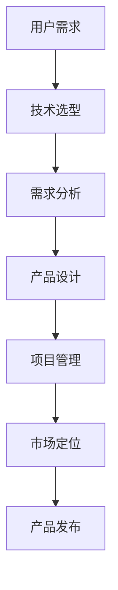

                 

关键词：大模型时代，AI 创业，产品经理，角色转变，创业策略，技术创新，市场定位

> 摘要：随着大模型时代的到来，AI 技术正以前所未有的速度和深度影响着各个行业。本文将探讨 AI 创业背景下产品经理的角色转变，以及如何利用大模型技术为创业项目提供核心竞争力。我们将从核心概念、算法原理、数学模型、项目实践和未来应用等多个维度，深入解析产品经理在 AI 创业中的战略地位和职责转变。

## 1. 背景介绍

### 大模型时代的崛起

大模型时代，指的是以深度学习和自然语言处理为代表的人工智能技术，发展到一个新的高度。这一时代的特点是模型规模越来越大，计算能力越来越强，应用范围越来越广。尤其是近年来，随着算力的提升和数据的积累，大模型在各个领域的突破性进展，使得人工智能开始从辅助工具逐渐转变为关键驱动力。

### AI 创业的浪潮

大模型时代的崛起，也带动了 AI 创业的浪潮。越来越多的创业公司开始利用 AI 技术开发创新产品，从智能医疗、智能金融、智能教育到智能制造，AI 应用已经渗透到各个行业。在这场浪潮中，产品经理的角色变得尤为重要，他们不仅是连接技术和市场的桥梁，更是推动创业项目成功的核心力量。

### 产品经理的角色演变

在传统软件行业，产品经理主要负责需求分析、产品设计、项目管理等工作。然而，在大模型时代，产品经理的角色发生了深刻变化。他们需要具备更强的技术背景，深入了解 AI 算法，能够有效地将 AI 技术转化为实际产品价值。同时，产品经理还需要具备市场洞察力，能够把握市场趋势，制定合适的创业策略。

## 2. 核心概念与联系

### 大模型技术

大模型技术是指通过海量数据和强大的计算能力，训练出规模巨大的神经网络模型。这些模型可以处理复杂的任务，如图像识别、自然语言处理、语音识别等。大模型时代的关键技术包括深度学习、强化学习、生成对抗网络等。

### 产品经理的角色

在大模型时代，产品经理的角色发生了显著变化。他们不仅需要具备传统产品经理的技能，还需要掌握 AI 算法，能够将技术转化为产品价值。具体来说，产品经理需要承担以下职责：

- 技术选型：根据项目需求，选择合适的大模型技术。
- 需求分析：深入了解用户需求，将需求转化为具体的技术实现。
- 产品设计：设计出符合用户体验的产品界面和交互流程。
- 项目管理：协调开发团队，确保项目按时按质完成。
- 市场定位：根据市场趋势，制定合适的产品策略和推广计划。

### Mermaid 流程图



## 3. 核心算法原理 & 具体操作步骤

### 3.1 算法原理概述

在大模型时代，常用的算法包括深度学习、强化学习和生成对抗网络。深度学习通过多层神经网络模拟人脑的思维方式，能够自动从数据中学习特征。强化学习通过不断尝试和反馈，找到最优策略。生成对抗网络则通过生成器和判别器的对抗训练，生成高质量的数据。

### 3.2 算法步骤详解

1. **数据收集与预处理**：收集大量相关数据，并进行清洗、归一化等预处理操作。
2. **模型选择与训练**：选择合适的模型，并通过训练数据训练模型。
3. **模型评估与优化**：使用验证数据评估模型性能，并根据评估结果对模型进行优化。
4. **模型部署与上线**：将训练好的模型部署到生产环境，并提供 API 接口供其他系统调用。
5. **持续迭代与优化**：根据用户反馈和业务需求，持续迭代模型，提高产品价值。

### 3.3 算法优缺点

- **深度学习**：优点是能够自动提取复杂特征，缺点是需要大量数据和计算资源。
- **强化学习**：优点是能够找到最优策略，缺点是训练过程较慢，且需要大量反馈数据。
- **生成对抗网络**：优点是能够生成高质量的数据，缺点是训练难度大，易陷入模式崩溃。

### 3.4 算法应用领域

- **图像识别**：通过深度学习技术，实现自动识别图像中的物体、场景等。
- **自然语言处理**：通过深度学习技术，实现语音识别、机器翻译、情感分析等。
- **智能推荐**：通过生成对抗网络，实现个性化推荐系统。

## 4. 数学模型和公式 & 详细讲解 & 举例说明

### 4.1 数学模型构建

在深度学习中，常用的数学模型包括多层感知机（MLP）、卷积神经网络（CNN）和循环神经网络（RNN）。以下是一个简单的多层感知机模型：

$$
Z = \sigma(W_1 \cdot X + b_1)
$$

$$
Y = \sigma(W_2 \cdot Z + b_2)
$$

其中，$X$ 是输入数据，$Y$ 是输出数据，$W_1$ 和 $W_2$ 是权重矩阵，$b_1$ 和 $b_2$ 是偏置项，$\sigma$ 是激活函数。

### 4.2 公式推导过程

多层感知机的推导过程如下：

1. **前向传播**：计算输入层到隐藏层的输出 $Z$。
2. **激活函数**：对 $Z$ 应用激活函数 $\sigma$，得到隐藏层的输出 $A$。
3. **前向传播**：计算隐藏层到输出层的输出 $Y$。
4. **激活函数**：对 $Y$ 应用激活函数 $\sigma$，得到最终的输出 $O$。

### 4.3 案例分析与讲解

以图像识别任务为例，我们使用卷积神经网络进行模型构建。具体步骤如下：

1. **数据收集与预处理**：收集大量图像数据，并进行归一化处理。
2. **模型设计**：设计一个卷积神经网络，包括卷积层、池化层和全连接层。
3. **模型训练**：使用训练数据训练模型，并使用验证数据评估模型性能。
4. **模型优化**：根据评估结果，对模型进行优化，提高识别准确率。

## 5. 项目实践：代码实例和详细解释说明

### 5.1 开发环境搭建

在 Python 环境下，我们使用 TensorFlow 作为深度学习框架，搭建一个简单的卷积神经网络模型。

### 5.2 源代码详细实现

以下是一个简单的卷积神经网络模型代码实现：

```python
import tensorflow as tf

# 定义输入层
inputs = tf.keras.Input(shape=(28, 28, 1))

# 添加卷积层
conv1 = tf.keras.layers.Conv2D(32, (3, 3), activation='relu')(inputs)
pool1 = tf.keras.layers.MaxPooling2D((2, 2))(conv1)

# 添加全连接层
flatten = tf.keras.layers.Flatten()(pool1)
dense = tf.keras.layers.Dense(64, activation='relu')(flatten)

# 添加输出层
outputs = tf.keras.layers.Dense(10, activation='softmax')(dense)

# 创建模型
model = tf.keras.Model(inputs=inputs, outputs=outputs)

# 编译模型
model.compile(optimizer='adam', loss='categorical_crossentropy', metrics=['accuracy'])

# 模型可视化
tf.keras.utils.plot_model(model, to_file='model.png', show_shapes=True)
```

### 5.3 代码解读与分析

1. **输入层**：定义输入层，形状为 $(28, 28, 1)$，表示一个 28x28 的单通道图像。
2. **卷积层**：添加一个卷积层，卷积核大小为 $(3, 3)$，激活函数为 ReLU。
3. **池化层**：添加一个最大池化层，池化窗口大小为 $(2, 2)$。
4. **全连接层**：添加一个全连接层，激活函数为 ReLU。
5. **输出层**：添加一个输出层，输出维度为 10，表示 10 个类别。

### 5.4 运行结果展示

运行代码后，我们可以得到模型的结构和可视化结果。接下来，我们可以使用训练数据对模型进行训练，并使用验证数据评估模型性能。

```python
# 加载训练数据和验证数据
(x_train, y_train), (x_test, y_test) = tf.keras.datasets.mnist.load_data()

# 数据预处理
x_train = x_train.astype('float32') / 255
x_test = x_test.astype('float32') / 255
x_train = x_train[..., tf.newaxis]
x_test = x_test[..., tf.newaxis]

# 编译模型
model.compile(optimizer='adam', loss='categorical_crossentropy', metrics=['accuracy'])

# 训练模型
model.fit(x_train, y_train, epochs=5, validation_data=(x_test, y_test))

# 评估模型
model.evaluate(x_test, y_test)
```

## 6. 实际应用场景

### 6.1 智能医疗

在大模型时代，智能医疗成为了一个热门领域。产品经理可以利用深度学习技术，开发智能诊断系统、智能药物推荐系统等。例如，通过分析患者的病历和检查报告，智能诊断系统可以帮助医生快速判断患者的病情，提供治疗建议。

### 6.2 智能金融

在金融领域，产品经理可以利用深度学习技术，开发智能投顾、智能风险管理等系统。例如，通过分析市场数据和历史交易记录，智能投顾系统可以提供个性化的投资建议，帮助投资者实现资产增值。

### 6.3 智能教育

在智能教育领域，产品经理可以利用深度学习技术，开发智能学习助手、智能评测系统等。例如，通过分析学生的学习行为和学习内容，智能学习助手可以为学生提供个性化的学习建议，提高学习效果。

### 6.4 未来应用展望

随着大模型技术的不断发展，AI 创业的应用场景将越来越广泛。未来，产品经理有望在更多领域发挥作用，如智能交通、智能城市、智能农业等。同时，随着技术的进步，产品经理的角色也将不断演变，他们需要具备更强的技术能力和创新意识，才能应对不断变化的创业环境。

## 7. 工具和资源推荐

### 7.1 学习资源推荐

- 《深度学习》（Goodfellow, Bengio, Courville 著）
- 《强化学习》（ Sutton, Barto 著）
- 《生成对抗网络论文集》（Ian J. Goodfellow 著）

### 7.2 开发工具推荐

- TensorFlow
- PyTorch
- Keras

### 7.3 相关论文推荐

- "Generative Adversarial Networks"（Ian J. Goodfellow 等人，2014）
- "Deep Learning for Natural Language Processing"（Mikolov, Sutskever, Chen, Kočiský, Zemel，2013）
- "Reinforcement Learning: An Introduction"（Sutton, Barto，2018）

## 8. 总结：未来发展趋势与挑战

### 8.1 研究成果总结

大模型时代带来了 AI 技术的飞速发展，无论是在图像识别、自然语言处理还是强化学习等领域，都取得了显著成果。这些成果为 AI 创业提供了强大的技术支持，也为产品经理的角色转变奠定了基础。

### 8.2 未来发展趋势

未来，大模型技术将继续向规模化、精细化方向发展。同时，随着技术的进步，AI 创业的领域将不断拓展，产品经理的角色也将更加多元化。此外，跨界合作将成为趋势，AI 创业将与更多传统行业深度融合，推动产业变革。

### 8.3 面临的挑战

尽管大模型时代为 AI 创业带来了巨大机遇，但也面临着一些挑战。首先，数据隐私和安全问题日益突出，如何保护用户数据成为关键挑战。其次，技术门槛较高，产品经理需要不断提升自身技术能力，才能应对日益复杂的创业环境。最后，市场竞争激烈，产品经理需要具备敏锐的市场洞察力和创新能力，才能在激烈的市场竞争中脱颖而出。

### 8.4 研究展望

未来，大模型时代将迎来更多创新和突破。在技术创新方面，研究者将继续探索新的算法和模型，提高模型性能和效率。在应用层面，AI 创业将深入到各个行业，推动产业升级和转型。同时，随着技术的普及，AI 创业将更加民主化，更多的创业者将有机会参与到这场变革中。

## 9. 附录：常见问题与解答

### 9.1 大模型时代的核心技术是什么？

答：大模型时代的核心技术包括深度学习、强化学习和生成对抗网络。这些技术通过训练大规模神经网络，实现自动特征提取和复杂任务学习。

### 9.2 产品经理在大模型时代需要具备哪些技能？

答：产品经理在大模型时代需要具备以下技能：

- **技术背景**：了解深度学习、强化学习、生成对抗网络等核心技术。
- **市场洞察力**：能够把握市场趋势，制定合适的创业策略。
- **项目管理能力**：能够协调开发团队，确保项目按时按质完成。
- **创新能力**：能够持续创新，为创业项目提供核心竞争力。

### 9.3 大模型技术在创业中的应用场景有哪些？

答：大模型技术在创业中的应用场景包括智能医疗、智能金融、智能教育、智能交通、智能城市等。这些领域都存在大量的数据和应用需求，为 AI 技术提供了广阔的发展空间。

作者：禅与计算机程序设计艺术 / Zen and the Art of Computer Programming

