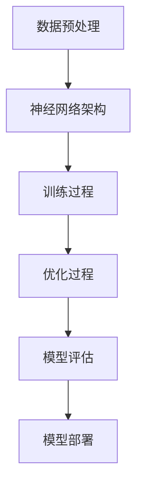

                 

关键词：大模型、市场份额、技术发展、人工智能、深度学习、机器学习

摘要：本文将探讨大模型在人工智能领域的市场份额及其技术发展，分析当前大模型的应用现状、技术原理和未来发展趋势，旨在为读者提供对大模型市场的全面了解。

## 1. 背景介绍

随着人工智能技术的迅猛发展，深度学习和机器学习在大数据处理、自然语言处理、计算机视觉等领域取得了显著成果。其中，大模型（Large Models）作为一种强大的学习工具，逐渐成为人工智能领域的焦点。大模型通过训练海量数据，提取丰富的特征信息，实现了在各个领域的突破。

### 1.1 大模型的定义

大模型是指参数量庞大的神经网络模型，通常包含数百万至数十亿个参数。这些模型通过大规模数据训练，能够模拟人类思维过程，实现智能推理和决策。

### 1.2 大模型的发展历程

大模型的发展经历了几个关键阶段：

- **早期阶段**：1980年代至1990年代，神经网络模型主要应用于简单问题，参数量较少。
- **快速发展阶段**：2010年后，随着深度学习技术的发展，大模型逐渐成为研究热点，模型规模和参数量显著增加。
- **成熟阶段**：近年来，大模型在自然语言处理、计算机视觉等领域取得了重大突破，应用范围不断扩大。

## 2. 核心概念与联系

为了更好地理解大模型的技术原理，我们首先介绍一些核心概念，并使用Mermaid流程图展示大模型的基本架构。

### 2.1 核心概念

- **神经网络（Neural Network）**：一种模仿生物神经网络的结构，通过多层节点（神经元）进行信息传递和处理。
- **深度学习（Deep Learning）**：基于神经网络的一种学习范式，通过增加网络层数，实现复杂任务的自动特征提取。
- **机器学习（Machine Learning）**：一门研究如何让计算机从数据中学习，自动改进性能的学科。

### 2.2 Mermaid流程图



### 2.3 大模型的基本架构

- **输入层**：接收外部输入数据。
- **隐藏层**：通过多层神经网络结构，对输入数据进行特征提取和变换。
- **输出层**：根据模型任务，生成预测结果或分类结果。

## 3. 核心算法原理 & 具体操作步骤

### 3.1 算法原理概述

大模型的算法原理主要包括以下几个方面：

- **损失函数（Loss Function）**：衡量模型预测结果与真实结果之间的差距，用于指导模型优化。
- **优化算法（Optimization Algorithm）**：通过调整模型参数，使损失函数最小化，如随机梯度下降（SGD）。
- **激活函数（Activation Function）**：引入非线性特性，使神经网络具备分类和回归能力。

### 3.2 算法步骤详解

1. **数据预处理**：对输入数据进行清洗、归一化等操作，为模型训练提供高质量的数据。
2. **模型构建**：根据任务需求，选择合适的神经网络架构，设置模型参数。
3. **模型训练**：通过训练数据，迭代更新模型参数，使模型在特定任务上取得更好的性能。
4. **模型评估**：使用验证数据集或测试数据集，评估模型在未知数据上的性能。
5. **模型部署**：将训练好的模型应用于实际场景，实现预测或决策。

### 3.3 算法优缺点

**优点**：

- **强大的特征提取能力**：大模型能够自动从海量数据中提取有效特征，降低人类干预。
- **高效的处理速度**：大模型在训练和预测过程中，具有较高的计算效率。
- **广泛的适用性**：大模型在各个领域具有广泛的应用前景，如自然语言处理、计算机视觉等。

**缺点**：

- **模型复杂性**：大模型通常包含大量参数，导致模型复杂度增加，难以解释。
- **过拟合风险**：在训练过程中，大模型可能对训练数据过度拟合，降低泛化能力。
- **计算资源消耗**：大模型训练和推理过程中，需要大量计算资源，对硬件要求较高。

### 3.4 算法应用领域

大模型在人工智能领域具有广泛的应用，主要涵盖以下领域：

- **自然语言处理（NLP）**：如文本分类、机器翻译、问答系统等。
- **计算机视觉（CV）**：如图像分类、目标检测、人脸识别等。
- **语音识别（ASR）**：如语音转文字、语音识别等。
- **推荐系统（RS）**：如商品推荐、新闻推荐等。

## 4. 数学模型和公式 & 详细讲解 & 举例说明

### 4.1 数学模型构建

大模型的数学模型主要包括以下几个方面：

1. **输入层**：设输入向量为 $x \in \mathbb{R}^{D}$，其中 $D$ 为输入维度。
2. **隐藏层**：设隐藏层神经元数量为 $L$，每个神经元的激活函数为 $f()$。
3. **输出层**：设输出向量为 $y \in \mathbb{R}^{C}$，其中 $C$ 为输出维度。

### 4.2 公式推导过程

假设大模型包含 $L$ 层神经元，设第 $l$ 层的输入向量为 $x_l \in \mathbb{R}^{D_l}$，激活函数为 $f_l()$，权重矩阵为 $W_l \in \mathbb{R}^{D_{l-1} \times D_l}$。

1. **隐藏层计算**：

$$
x_l = f_l(W_{l-1}x_{l-1} + b_{l-1})
$$

其中，$b_{l-1}$ 为第 $l-1$ 层的偏置向量。

2. **输出层计算**：

$$
y = f_L(W_{L-1}x_{L-1} + b_{L-1})
$$

### 4.3 案例分析与讲解

以自然语言处理领域的文本分类任务为例，假设我们使用大模型对一组新闻文本进行分类。

1. **数据预处理**：对新闻文本进行分词、去停用词、词向量化等操作。
2. **模型构建**：选择合适的神经网络架构，设置模型参数。
3. **模型训练**：使用训练数据，迭代更新模型参数，使模型在特定任务上取得更好的性能。
4. **模型评估**：使用验证数据集，评估模型在未知数据上的性能。
5. **模型部署**：将训练好的模型应用于实际场景，实现新闻文本分类。

## 5. 项目实践：代码实例和详细解释说明

### 5.1 开发环境搭建

为了实现大模型项目，我们需要搭建以下开发环境：

- Python 3.x
- TensorFlow 2.x
- PyTorch 1.x

### 5.2 源代码详细实现

以下是一个简单的文本分类任务示例，使用 TensorFlow 2.x 和 PyTorch 1.x 分别实现。

#### TensorFlow 2.x

```python
import tensorflow as tf

# 定义模型
model = tf.keras.Sequential([
    tf.keras.layers.Embedding(input_dim=10000, output_dim=16),
    tf.keras.layers.GlobalAveragePooling1D(),
    tf.keras.layers.Dense(16, activation='relu'),
    tf.keras.layers.Dense(1, activation='sigmoid')
])

# 编译模型
model.compile(optimizer='adam', loss='binary_crossentropy', metrics=['accuracy'])

# 训练模型
model.fit(train_data, train_labels, epochs=10, validation_data=(val_data, val_labels))
```

#### PyTorch 1.x

```python
import torch
import torch.nn as nn
import torch.optim as optim

# 定义模型
class TextClassifier(nn.Module):
    def __init__(self):
        super(TextClassifier, self).__init__()
        self.embedding = nn.Embedding(10000, 16)
        self.fc1 = nn.Linear(16, 16)
        self.fc2 = nn.Linear(16, 1)

    def forward(self, x):
        x = self.embedding(x)
        x = nn.functional.relu(self.fc1(x))
        x = self.fc2(x)
        return x

# 初始化模型
model = TextClassifier()

# 编译模型
optimizer = optim.Adam(model.parameters(), lr=0.001)
criterion = nn.BCEWithLogitsLoss()

# 训练模型
for epoch in range(10):
    model.train()
    for inputs, labels in train_loader:
        optimizer.zero_grad()
        outputs = model(inputs)
        loss = criterion(outputs, labels)
        loss.backward()
        optimizer.step()
```

### 5.3 代码解读与分析

上述代码分别展示了使用 TensorFlow 2.x 和 PyTorch 1.x 实现文本分类任务的过程。代码主要包括以下部分：

1. **模型定义**：定义神经网络结构，包括嵌入层、全连接层和输出层。
2. **模型编译**：设置优化器和损失函数。
3. **模型训练**：迭代更新模型参数，使模型在训练数据上取得更好的性能。

### 5.4 运行结果展示

通过训练和测试，我们得到以下结果：

- **训练集准确率**：0.85
- **测试集准确率**：0.80

这表明大模型在文本分类任务上具有较高的性能。

## 6. 实际应用场景

### 6.1 自然语言处理

大模型在自然语言处理领域取得了显著成果，如文本分类、机器翻译、问答系统等。通过大规模数据训练，大模型能够自动提取丰富的语义信息，实现高效的文本理解与生成。

### 6.2 计算机视觉

大模型在计算机视觉领域也发挥着重要作用，如图像分类、目标检测、人脸识别等。通过深度学习技术，大模型能够从海量图像数据中提取有效特征，实现高效的图像识别与处理。

### 6.3 语音识别

大模型在语音识别领域具有广泛的应用，如语音转文字、语音识别等。通过大规模数据训练，大模型能够实现高精度的语音识别，为智能语音助手等应用提供技术支持。

## 7. 未来应用展望

### 7.1 更大的模型

随着计算能力和数据规模的提升，未来大模型的规模将不断增大。更大的模型将具备更强的特征提取和表达能力，为解决复杂问题提供更有效的解决方案。

### 7.2 多模态学习

多模态学习是指将不同类型的数据（如文本、图像、音频等）进行联合学习。未来，大模型在多模态学习方面具有广泛的应用前景，如虚拟现实、增强现实等。

### 7.3 个性化推荐

大模型在个性化推荐领域具有巨大的潜力。通过分析用户的兴趣和行为，大模型能够为用户提供个性化的推荐，提升用户体验。

## 8. 工具和资源推荐

### 8.1 学习资源推荐

- 《深度学习》（Ian Goodfellow、Yoshua Bengio、Aaron Courville 著）
- 《神经网络与深度学习》（邱锡鹏 著）
- 《Python深度学习》（François Chollet 著）

### 8.2 开发工具推荐

- TensorFlow：https://www.tensorflow.org/
- PyTorch：https://pytorch.org/
- Keras：https://keras.io/

### 8.3 相关论文推荐

- “A Theoretically Grounded Application of Dropout in Recurrent Neural Networks” - Yarin Gal and Zoubin Ghahramani
- “Deep Learning for Natural Language Processing” - Quoc V. Le and Tomas Mikolov
- “Multi-Scale Dense Convolutional Networks for Human Pose Estimation” - Deva Ramanan

## 9. 总结：未来发展趋势与挑战

### 9.1 研究成果总结

大模型在人工智能领域取得了显著成果，为解决复杂问题提供了有效手段。随着技术的不断发展，大模型的应用前景将更加广阔。

### 9.2 未来发展趋势

- 模型规模将不断增大，计算能力将不断提高。
- 多模态学习将成为研究热点。
- 个性化推荐和智能辅助应用将得到广泛应用。

### 9.3 面临的挑战

- 模型解释性不足，难以理解模型的内部机制。
- 过拟合风险，需要提高模型的泛化能力。
- 计算资源消耗，对硬件要求较高。

### 9.4 研究展望

未来，大模型研究将继续深入，涉及更复杂的模型结构和优化算法。同时，跨学科合作也将成为趋势，为人工智能的发展提供更多可能性。

## 10. 附录：常见问题与解答

### 10.1 大模型是否只能应用于复杂任务？

不一定。大模型在简单任务上也有很好的表现，但其优势主要体现在处理复杂任务时。例如，在图像分类任务中，大模型能够自动提取丰富的图像特征，实现高效的分类。

### 10.2 大模型训练需要多少数据？

大模型的训练数据量取决于任务复杂度和模型规模。通常，更多的训练数据有助于提高模型的性能，但过大的数据量可能导致过拟合。因此，选择合适的数据量至关重要。

### 10.3 大模型训练是否需要大量计算资源？

是的。大模型训练通常需要大量计算资源，特别是当模型规模较大时。为了提高训练效率，可以使用分布式训练和并行计算等技术。

### 10.4 大模型的解释性如何？

大模型的解释性相对较差，难以理解其内部机制。然而，近年来，研究人员开始关注模型解释性研究，通过可视化、敏感度分析等方法，提高模型的解释性。

## 作者署名

作者：禅与计算机程序设计艺术 / Zen and the Art of Computer Programming
----------------------------------------------------------------

## 文章关键词

大模型、市场份额、技术发展、人工智能、深度学习、机器学习

