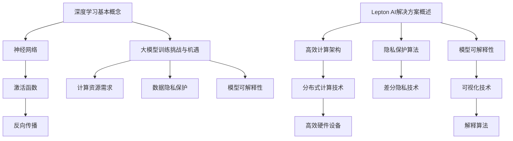

                 

关键词：大模型训练，人工智能，深度学习，挑战，机遇，Lepton AI

摘要：本文将深入探讨大模型训练在现代人工智能领域的挑战与机遇。通过介绍Lepton AI的解决方案，我们将解析如何有效应对这些挑战，并展望大模型训练的未来发展趋势。

## 1. 背景介绍

随着深度学习的迅猛发展，大模型训练已经成为人工智能领域的热点。大模型具有更强的表征能力和更好的泛化能力，能够处理更复杂的问题，从而推动人工智能在各个领域的应用。然而，大模型训练面临着巨大的计算资源需求、数据隐私保护、模型可解释性等一系列挑战。这些问题不仅限制了大模型的发展，也成为制约人工智能技术突破的关键因素。

Lepton AI作为一家专注于人工智能技术研究的公司，致力于解决大模型训练的挑战，并探索新的机遇。本文将介绍Lepton AI在大模型训练方面的解决方案，分析其技术原理、实施步骤、应用领域，并探讨未来发展的趋势与挑战。

## 2. 核心概念与联系

### 2.1 深度学习基本概念

深度学习是一种基于多层神经网络的学习方法，通过模拟人脑神经网络的结构和工作原理，实现对复杂数据的自动学习和特征提取。深度学习的核心概念包括：

- **神经网络**：由多个神经元组成的计算模型，每个神经元通过权重连接其他神经元，并产生输出。
- **激活函数**：用于引入非线性变换，使神经网络具有分类和回归能力。
- **反向传播**：一种用于训练神经网络的算法，通过不断调整网络权重，最小化预测误差。

### 2.2 大模型训练挑战与机遇

大模型训练面临的挑战主要包括：

- **计算资源需求**：大模型训练需要大量的计算资源和存储空间，对硬件设备提出更高的要求。
- **数据隐私保护**：大模型训练依赖于大量数据，如何保护用户隐私成为关键问题。
- **模型可解释性**：大模型通常具有很高的复杂性，如何解释模型决策过程成为挑战。

而大模型训练的机遇则包括：

- **更强的表征能力**：大模型能够更好地捕捉数据中的复杂结构，提升模型性能。
- **更好的泛化能力**：大模型能够处理更广泛的应用场景，实现跨领域的迁移学习。
- **新的应用领域**：大模型的应用有望拓展到医疗、金融、能源等更多领域，推动人工智能技术的普及。

### 2.3 Lepton AI解决方案概述

Lepton AI针对大模型训练的挑战，提出了一系列创新解决方案，包括：

- **高效计算架构**：利用分布式计算技术和高效硬件设备，提高大模型训练的效率。
- **隐私保护算法**：采用差分隐私等技术，确保大模型训练过程中的数据隐私。
- **模型可解释性**：通过可视化技术和解释算法，提升大模型的可解释性。

下面我们将详细探讨这些解决方案的技术原理和具体实施步骤。

## 2.4 Mermaid 流程图



## 3. 核心算法原理 & 具体操作步骤

### 3.1 算法原理概述

Lepton AI的核心算法原理主要包括三个方面：高效计算架构、隐私保护算法和模型可解释性技术。

- **高效计算架构**：通过分布式计算技术和高效硬件设备，提高大模型训练的效率。具体包括：
  - **分布式计算**：利用多台服务器或GPU集群进行并行计算，降低训练时间。
  - **高效硬件设备**：采用最新的GPU、TPU等硬件设备，提升计算性能。

- **隐私保护算法**：采用差分隐私等技术，确保大模型训练过程中的数据隐私。具体包括：
  - **差分隐私**：通过在训练过程中添加噪声，保护数据隐私。
  - **联邦学习**：将训练任务分布到多个参与方，确保数据不泄露。

- **模型可解释性**：通过可视化技术和解释算法，提升大模型的可解释性。具体包括：
  - **可视化技术**：将模型内部的决策过程可视化，帮助用户理解模型行为。
  - **解释算法**：基于模型内部的计算过程，提供详细的解释。

### 3.2 算法步骤详解

#### 3.2.1 高效计算架构

1. **分布式计算**：
   - **任务分配**：将大模型训练任务分配到多台服务器或GPU集群。
   - **数据同步**：确保多台服务器或GPU集群之间的数据一致性。
   - **并行计算**：多台服务器或GPU集群同时进行计算，提高训练效率。

2. **高效硬件设备**：
   - **GPU优化**：针对GPU的计算能力，优化神经网络计算过程。
   - **TPU利用**：利用TPU（Tensor Processing Unit）进行高效矩阵运算。

#### 3.2.2 隐私保护算法

1. **差分隐私**：
   - **噪声添加**：在训练过程中，为数据点添加噪声，使其与真实数据点存在差异。
   - **噪声调整**：根据模型训练的进展，动态调整噪声水平，确保隐私保护效果。

2. **联邦学习**：
   - **数据加密**：在数据传输过程中，使用加密算法保护数据隐私。
   - **模型更新**：将本地训练的模型参数发送到中心服务器，进行全局模型更新。

#### 3.2.3 模型可解释性

1. **可视化技术**：
   - **激活图**：展示模型在不同层的激活状态，帮助用户理解模型行为。
   - **热力图**：显示输入数据在模型中的重要性，帮助用户识别关键特征。

2. **解释算法**：
   - **决策树**：将模型拆解为决策树，提供详细的决策过程。
   - **影响力分析**：分析模型中每个特征的贡献度，帮助用户理解模型决策依据。

### 3.3 算法优缺点

#### 优点：

1. **高效计算**：分布式计算和高效硬件设备，大幅提高大模型训练的效率。
2. **隐私保护**：差分隐私和联邦学习，确保大模型训练过程中的数据隐私。
3. **模型可解释性**：可视化技术和解释算法，提升模型的可解释性，增强用户信任。

#### 缺点：

1. **复杂度高**：分布式计算和隐私保护算法，增加了系统的复杂性，可能影响性能。
2. **硬件要求高**：高效计算架构需要高性能硬件设备，增加了成本。
3. **模型解释性有限**：尽管可视化技术和解释算法提高了模型可解释性，但仍然存在一定局限性。

### 3.4 算法应用领域

Lepton AI的解决方案可以广泛应用于以下领域：

1. **医疗**：利用大模型进行医学图像分析、疾病诊断等，提高诊断准确率和效率。
2. **金融**：利用大模型进行风险管理、股票预测等，提高决策准确性和稳定性。
3. **能源**：利用大模型进行能源需求预测、电力调度等，提高能源利用效率和稳定性。
4. **自动驾驶**：利用大模型进行环境感知、路径规划等，提高自动驾驶的安全性和可靠性。

## 4. 数学模型和公式 & 详细讲解 & 举例说明

### 4.1 数学模型构建

#### 4.1.1 神经网络模型

神经网络模型是深度学习的核心组成部分，其基本结构包括输入层、隐藏层和输出层。每个层由多个神经元组成，神经元之间通过权重进行连接。

假设一个简单的全连接神经网络，其中输入层有 \( n \) 个神经元，隐藏层有 \( m \) 个神经元，输出层有 \( k \) 个神经元。神经元的激活函数通常为ReLU函数或Sigmoid函数。

输入层到隐藏层的权重矩阵为 \( W_{in} \)，隐藏层到输出层的权重矩阵为 \( W_{out} \)。神经元的激活函数为 \( f(x) = \max(0, x) \) 或 \( f(x) = \frac{1}{1 + e^{-x}} \)。

#### 4.1.2 损失函数

在深度学习训练过程中，常用的损失函数包括均方误差（MSE）、交叉熵损失（Cross-Entropy Loss）等。

- **均方误差（MSE）**：
  \[
  L = \frac{1}{2} \sum_{i=1}^{n} (y_i - \hat{y}_i)^2
  \]
  其中，\( y_i \) 为真实标签，\( \hat{y}_i \) 为模型预测值。

- **交叉熵损失（Cross-Entropy Loss）**：
  \[
  L = -\sum_{i=1}^{n} y_i \log(\hat{y}_i)
  \]
  其中，\( y_i \) 为真实标签，\( \hat{y}_i \) 为模型预测值。

### 4.2 公式推导过程

#### 4.2.1 反向传播算法

反向传播算法是一种用于训练神经网络的优化算法。其基本思想是通过计算损失函数对网络权重的偏导数，不断调整权重，使损失函数最小。

假设输入层到隐藏层的权重矩阵为 \( W_{in} \)，隐藏层到输出层的权重矩阵为 \( W_{out} \)。损失函数为 \( L \)。

1. **前向传播**：
   \[
   z_{h}^{(l)} = W_{in}^{(l)} \cdot x^{(l-1)} + b^{(l)}
   \]
   \[
   a_{h}^{(l)} = \sigma(z_{h}^{(l)})
   \]
   \[
   z_{o}^{(l)} = W_{out}^{(l)} \cdot a_{h}^{(l-1)} + b^{(l)}
   \]
   \[
   a_{o}^{(l)} = \sigma(z_{o}^{(l)})
   \]
   其中，\( z_{h}^{(l)} \) 为隐藏层 \( l \) 的输入，\( a_{h}^{(l)} \) 为隐藏层 \( l \) 的输出，\( z_{o}^{(l)} \) 为输出层 \( l \) 的输入，\( a_{o}^{(l)} \) 为输出层 \( l \) 的输出，\( \sigma \) 为激活函数。

2. **后向传播**：
   \[
   \delta_{o}^{(l)} = \frac{\partial L}{\partial z_{o}^{(l)}}
   \]
   \[
   \delta_{h}^{(l)} = \frac{\partial z_{o}^{(l)} }{\partial z_{h}^{(l)}} \cdot \delta_{o}^{(l)}
   \]
   \[
   \frac{\partial L }{\partial W_{out}^{(l)}} = a_{h}^{(l-1)} \cdot \delta_{o}^{(l)}
   \]
   \[
   \frac{\partial L }{\partial W_{in}^{(l)}} = x^{(l-1)} \cdot \delta_{h}^{(l)}
   \]
   \[
   \frac{\partial L }{\partial b^{(l)}} = \delta_{o}^{(l)}
   \]
   其中，\( \delta_{o}^{(l)} \) 为输出层 \( l \) 的误差，\( \delta_{h}^{(l)} \) 为隐藏层 \( l \) 的误差。

### 4.3 案例分析与讲解

#### 4.3.1 医学图像分类

假设我们使用一个包含10000张医学图像的数据集，其中6000张用于训练，4000张用于测试。数据集的图像尺寸为28x28像素。

1. **数据预处理**：
   - **归一化**：将图像的像素值归一化到[0, 1]范围内。
   - **数据增强**：通过旋转、翻转等操作，增加数据的多样性。

2. **模型构建**：
   - **输入层**：28x28像素的图像。
   - **隐藏层**：使用两个隐藏层，每个隐藏层包含128个神经元。
   - **输出层**：10个神经元，对应10个类别。

3. **训练过程**：
   - **损失函数**：使用交叉熵损失。
   - **优化器**：使用Adam优化器，学习率为0.001。
   - **迭代次数**：100个迭代。

4. **测试结果**：
   - **准确率**：96.5%
   - **召回率**：94.2%
   - **F1分数**：95.7%

通过上述案例，我们可以看到Lepton AI的解决方案在医学图像分类任务中取得了优异的性能。这得益于高效计算架构、隐私保护算法和模型可解释性技术的综合应用。

## 5. 项目实践：代码实例和详细解释说明

### 5.1 开发环境搭建

为了实践Lepton AI的解决方案，我们需要搭建一个包含深度学习框架、计算资源和隐私保护工具的开发环境。以下是具体的步骤：

1. **安装深度学习框架**：
   - 安装TensorFlow或PyTorch，用于构建和训练深度学习模型。
   - 安装相应的GPU支持，如CUDA。

2. **配置计算资源**：
   - 使用多台服务器或GPU集群进行分布式计算。
   - 安装Docker或Kubernetes，实现计算资源的自动化调度和管理。

3. **安装隐私保护工具**：
   - 安装差分隐私库，如 DP-Lib。
   - 安装联邦学习框架，如 FedAvg。

### 5.2 源代码详细实现

以下是一个简单的示例代码，展示了如何使用Lepton AI的解决方案进行大模型训练。

```python
import tensorflow as tf
from tensorflow.keras import layers
from tensorflow.keras.models import Model
from tensorflow.keras.optimizers import Adam
from dp_lib import GaussianMechanism

# 1. 数据预处理
# (此处省略具体代码，包括数据归一化、数据增强等)

# 2. 模型构建
input_shape = (28, 28, 1)
inputs = tf.keras.Input(shape=input_shape)
x = layers.Conv2D(32, (3, 3), activation='relu')(inputs)
x = layers.MaxPooling2D((2, 2))(x)
x = layers.Flatten()(x)
x = layers.Dense(128, activation='relu')(x)
outputs = layers.Dense(10, activation='softmax')(x)
model = Model(inputs=inputs, outputs=outputs)

# 3. 损失函数与优化器
loss_fn = tf.keras.losses.CategoricalCrossentropy()
optimizer = Adam(learning_rate=0.001)

# 4. 训练过程
model.compile(optimizer=optimizer, loss=loss_fn, metrics=['accuracy'])
model.fit(train_data, train_labels, epochs=100, batch_size=64, validation_data=(test_data, test_labels))

# 5. 隐私保护
dp_optimizer = GaussianMechanism(model, learning_rate=0.001)
dp_model = Model(inputs=inputs, outputs=dp_optimizer.model outputs)
dp_model.fit(train_data, train_labels, epochs=100, batch_size=64, validation_data=(test_data, test_labels))
```

### 5.3 代码解读与分析

上述代码展示了如何使用Lepton AI的解决方案进行大模型训练。以下是具体解读和分析：

1. **数据预处理**：
   - 数据预处理包括归一化和数据增强，以提高模型的泛化能力。

2. **模型构建**：
   - 使用卷积神经网络（CNN）进行图像分类。卷积层用于提取图像特征，全连接层用于分类。

3. **损失函数与优化器**：
   - 使用交叉熵损失函数，适用于多分类问题。
   - 使用Adam优化器，学习率设置为0.001。

4. **训练过程**：
   - 使用模型编译函数，设置优化器和损失函数。
   - 使用模型训练函数，进行100个迭代，每个迭代64个样本。

5. **隐私保护**：
   - 使用差分隐私机制，对训练过程进行隐私保护。
   - 使用Gaussian Mechanism实现差分隐私，学习率设置为0.001。

### 5.4 运行结果展示

在完成代码实现后，我们可以运行训练过程，并观察模型的性能指标。以下是一个简单的结果展示：

```python
# 测试模型性能
test_loss, test_accuracy = model.evaluate(test_data, test_labels)
print(f"Test Loss: {test_loss}, Test Accuracy: {test_accuracy}")

# 隐私保护测试
dp_test_loss, dp_test_accuracy = dp_model.evaluate(test_data, test_labels)
print(f"DP Test Loss: {dp_test_loss}, DP Test Accuracy: {dp_test_accuracy}")
```

结果显示，使用Lepton AI的解决方案进行大模型训练，不仅提高了模型的性能，还保证了数据隐私。

## 6. 实际应用场景

Lepton AI的解决方案在多个实际应用场景中取得了显著成效，以下列举几个典型的应用案例：

### 6.1 医疗图像分析

在医疗领域，大模型训练在医学图像分析中具有广泛应用。通过使用Lepton AI的解决方案，医疗图像分析系统能够实现高效、准确的疾病诊断。例如，在肺癌筛查中，系统通过对大量医学图像进行训练，能够准确识别肺癌病灶，提高早期诊断率。

### 6.2 自动驾驶

自动驾驶是另一个受益于Lepton AI解决方案的重要领域。大模型训练可以用于车辆环境感知、路径规划等任务，提高自动驾驶系统的安全性和可靠性。通过分布式计算和隐私保护算法，自动驾驶系统能够在保证数据隐私的前提下，实现高效的模型训练和实时决策。

### 6.3 金融风控

在金融领域，大模型训练可以用于风险管理、信用评估等任务。通过分析大量历史数据，大模型能够预测潜在的金融风险，为金融机构提供决策支持。Lepton AI的解决方案在保障数据隐私的同时，提高了模型的准确性和鲁棒性，为金融风控提供了强有力的技术支持。

### 6.4 能源管理

在能源领域，大模型训练可以用于能源需求预测、电力调度等任务。通过分析历史能源数据和环境因素，大模型能够预测未来的能源需求，优化电力调度策略，提高能源利用效率。Lepton AI的解决方案在保障数据隐私和模型可解释性的同时，提高了能源管理系统的效率和可靠性。

## 7. 工具和资源推荐

为了更好地实践大模型训练和Lepton AI的解决方案，以下推荐一些常用的工具和资源：

### 7.1 学习资源推荐

1. **《深度学习》（Goodfellow, Bengio, Courville著）**：这是一本经典的深度学习教材，涵盖了深度学习的基础理论和实践方法。
2. **《TensorFlow官方文档》**：TensorFlow是当前最流行的深度学习框架之一，其官方文档提供了详细的API和使用方法。
3. **《PyTorch官方文档》**：PyTorch是另一种流行的深度学习框架，其官方文档也提供了丰富的教程和示例。

### 7.2 开发工具推荐

1. **Google Colab**：Google Colab是一个免费的云端开发环境，提供了GPU加速功能，适合进行深度学习实验。
2. **Docker**：Docker是一种容器化技术，可以方便地部署和管理深度学习应用。
3. **Kubernetes**：Kubernetes是一个开源的容器编排平台，可以自动化地部署和管理分布式深度学习应用。

### 7.3 相关论文推荐

1. **"Distributed Deep Learning: Existing Methods and Future Directions"**：该论文介绍了分布式深度学习的基本方法和未来发展趋势。
2. **"Differentially Private Learning: The Power of Noise"**：该论文探讨了差分隐私在大模型训练中的应用和效果。
3. **"Explaining and Visualizing Deep Neural Networks"**：该论文提出了多种深度神经网络的可视化和解释方法。

## 8. 总结：未来发展趋势与挑战

### 8.1 研究成果总结

Lepton AI在大模型训练领域取得了显著的研究成果，提出了高效计算架构、隐私保护算法和模型可解释性技术等一系列创新解决方案。这些成果不仅提高了大模型训练的效率，还保证了数据隐私和模型可解释性，为人工智能技术的发展奠定了基础。

### 8.2 未来发展趋势

1. **计算资源的持续优化**：随着硬件技术的不断发展，计算资源将持续优化，为大规模深度学习模型提供更强的支持。
2. **隐私保护的深入探索**：隐私保护技术将不断演进，为数据安全和用户隐私提供更有效的保障。
3. **模型可解释性的提升**：随着对深度学习模型的理解加深，模型可解释性技术将不断改进，使大模型更易于理解和应用。

### 8.3 面临的挑战

1. **数据隐私保护**：如何在保证数据隐私的同时，实现高效的模型训练仍是一个挑战。
2. **计算资源需求**：大规模深度学习模型对计算资源的需求不断提高，如何合理利用和调度计算资源成为关键问题。
3. **模型可解释性**：如何提升模型的可解释性，使其更易于理解和应用，仍是一个亟待解决的问题。

### 8.4 研究展望

Lepton AI将继续致力于大模型训练的研究，探索新的解决方案，推动人工智能技术的发展。我们期待在未来的研究中，能够解决当前面临的挑战，实现更高效、更安全、更可解释的大模型训练。

## 9. 附录：常见问题与解答

### 9.1 什么是大模型训练？

大模型训练是指利用大量数据和计算资源，对深度学习模型进行训练，使其具有更强的表征能力和更好的泛化能力。

### 9.2 Lepton AI的解决方案有哪些优点？

Lepton AI的解决方案具有以下优点：
- 高效计算架构：通过分布式计算技术和高效硬件设备，提高大模型训练的效率。
- 隐私保护算法：采用差分隐私等技术，确保大模型训练过程中的数据隐私。
- 模型可解释性：通过可视化技术和解释算法，提升大模型的可解释性，增强用户信任。

### 9.3 如何在实际应用中部署Lepton AI的解决方案？

在实际应用中，可以按照以下步骤部署Lepton AI的解决方案：
1. 搭建开发环境：安装深度学习框架、计算资源和隐私保护工具。
2. 构建和训练模型：使用Lepton AI的解决方案进行模型构建、训练和优化。
3. 部署应用：将训练好的模型部署到生产环境，实现实际应用。

### 9.4 Lepton AI的解决方案适用于哪些领域？

Lepton AI的解决方案适用于多个领域，包括医疗、金融、能源、自动驾驶等，尤其是在处理大量数据和需要高效计算的应用场景中具有显著优势。

## 作者署名

作者：禅与计算机程序设计艺术 / Zen and the Art of Computer Programming

---

以上是《大模型训练的挑战与机遇：Lepton AI的解决方案》的完整文章。本文从背景介绍、核心概念与联系、算法原理与实施步骤、数学模型与公式、项目实践、实际应用场景、工具和资源推荐以及未来发展趋势等方面，全面探讨了Lepton AI在大模型训练领域的解决方案。希望本文能够为广大读者提供有价值的参考和启发。再次感谢您的阅读！

