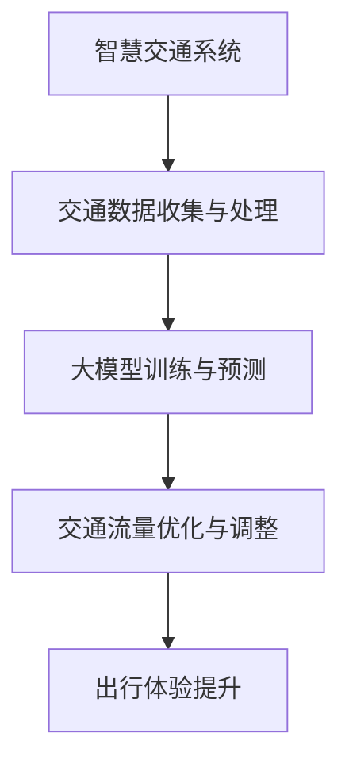

                 

关键词：智慧交通，大模型，交通流量，出行体验，算法优化，交通管理，AI，数据挖掘，预测分析，实时调整，智能出行

摘要：随着城市化进程的加速，交通拥堵问题日益严重，影响了居民的出行体验和生活质量。本文将探讨如何利用大模型技术赋能智慧交通，从交通流量优化和出行体验提升两个方面，为创业者提供具体的优化策略和技术路径。文章将详细介绍大模型在交通领域的应用原理、算法原理与数学模型，并通过实际案例进行解析，旨在为读者提供有价值的参考。

## 1. 背景介绍

### 城市交通现状

随着全球城市化的快速发展，城市交通拥堵问题日益严峻。根据世界卫生组织和世界银行的数据显示，全球超过50%的人口居住在城市中，其中超过20%的人面临交通拥堵的困扰。城市交通拥堵不仅影响了居民的生活质量，也带来了严重的环境问题，如空气污染和碳排放增加。

### 智慧交通的需求

智慧交通是指利用现代信息技术和智能系统，对城市交通进行科学管理和优化，以提高交通效率、降低拥堵、减少污染、提升出行体验。随着人工智能技术的不断发展，尤其是大模型技术的突破，智慧交通迎来了新的发展机遇。

### 大模型技术

大模型技术是指通过深度学习等方法训练的，拥有数亿至数十亿参数的模型。这些模型能够通过大规模数据训练，自动学习到复杂的特征和模式，从而在多个领域展现出强大的预测和优化能力。大模型技术在智慧交通中的应用，为交通流量优化和出行体验提升提供了新的技术手段。

## 2. 核心概念与联系

### 大模型与智慧交通

大模型技术是智慧交通的核心技术之一。它通过挖掘和利用海量交通数据，对交通流量进行实时预测和优化，从而改善交通状况，提升出行体验。

### 交通流量优化

交通流量优化是指通过分析交通数据，对交通流量进行实时调整，以减少拥堵、提高通行效率。大模型技术在交通流量优化中起到了关键作用，它能够利用历史数据和实时数据，预测交通流量的变化趋势，并给出最优的调整方案。

### 出行体验提升

出行体验的提升是智慧交通的重要目标之一。大模型技术通过优化交通流量，减少了居民的出行时间，提高了交通效率，从而提升了居民的出行体验。

### 图解大模型在智慧交通中的应用架构



## 3. 核心算法原理 & 具体操作步骤

### 3.1 算法原理概述

大模型技术在智慧交通中的应用，主要基于以下原理：

1. **数据驱动**：通过收集海量交通数据，对交通流量进行实时监控和分析。
2. **深度学习**：利用深度学习算法，从数据中自动提取特征，进行模式识别和预测。
3. **优化算法**：根据预测结果，利用优化算法对交通流量进行实时调整。

### 3.2 算法步骤详解

1. **数据收集与预处理**：收集道路流量、速度、天气、时间等交通数据，并进行数据清洗和预处理。
2. **模型训练**：利用预处理后的数据，通过深度学习算法训练大模型，使其能够对交通流量进行预测。
3. **预测与优化**：利用训练好的大模型，对未来的交通流量进行预测，并根据预测结果，利用优化算法对交通流量进行实时调整。
4. **反馈与调整**：根据调整后的交通流量数据，对大模型进行再次训练和优化，以提高预测的准确性。

### 3.3 算法优缺点

**优点**：

1. **高效性**：大模型能够快速处理海量数据，提高交通流量预测的准确性。
2. **实时性**：算法能够对交通流量进行实时预测和调整，提高交通管理效率。
3. **综合性**：算法能够综合考虑多种因素，如天气、时间、路况等，给出最优的流量调整方案。

**缺点**：

1. **数据依赖**：算法的预测精度高度依赖数据质量，数据缺失或错误会影响预测效果。
2. **计算成本**：大模型的训练和预测需要较高的计算资源，对硬件设施要求较高。
3. **安全性**：大模型可能会受到恶意攻击，如数据注入等，影响交通管理系统的安全。

### 3.4 算法应用领域

大模型技术在交通领域的应用广泛，主要包括：

1. **交通流量预测**：通过对历史数据的分析，预测未来某一时刻的交通流量。
2. **交通信号控制**：根据实时交通数据，优化交通信号灯的配时方案。
3. **公共交通调度**：优化公交车的行驶路线和班次，提高公交服务的效率。
4. **道路基础设施规划**：根据交通流量预测结果，优化道路规划和建设。

## 4. 数学模型和公式 & 详细讲解 & 举例说明

### 4.1 数学模型构建

大模型技术在智慧交通中的应用，通常基于以下数学模型：

1. **交通流量预测模型**：
   $$Q(t) = f(W \cdot \text{Input}(t))$$
   其中，$Q(t)$表示时间$t$时刻的交通流量，$W$为权重矩阵，$\text{Input}(t)$为输入特征向量。

2. **交通信号控制模型**：
   $$T_c = g(W_c \cdot \text{Input}(t))$$
   其中，$T_c$表示交通信号灯的持续时间，$W_c$为权重矩阵，$\text{Input}(t)$为输入特征向量。

3. **公共交通调度模型**：
   $$R(t) = h(W_r \cdot \text{Input}(t))$$
   其中，$R(t)$表示公交车的行驶路线和班次，$W_r$为权重矩阵，$\text{Input}(t)$为输入特征向量。

### 4.2 公式推导过程

1. **交通流量预测模型**：

   假设输入特征向量$\text{Input}(t)$由历史交通流量、天气状况、时间等因素组成。通过深度学习算法，可以学习到权重矩阵$W$，使得预测模型能够对交通流量进行准确预测。

   $$Q(t) = \sum_{i=1}^{n} w_i \cdot q_i(t)$$
   其中，$q_i(t)$为时间$t$时刻的第$i$个输入特征，$w_i$为对应的权重。

2. **交通信号控制模型**：

   假设输入特征向量$\text{Input}(t)$由当前交通流量、道路拥堵状况、信号灯状态等因素组成。通过深度学习算法，可以学习到权重矩阵$W_c$，使得信号控制模型能够给出最优的信号灯配时方案。

   $$T_c = \sum_{i=1}^{n} w_{ci} \cdot t_i$$
   其中，$t_i$为时间$i$的信号灯持续时间，$w_{ci}$为对应的权重。

3. **公共交通调度模型**：

   假设输入特征向量$\text{Input}(t)$由当前公交车的位置、乘客需求、道路状况等因素组成。通过深度学习算法，可以学习到权重矩阵$W_r$，使得调度模型能够给出最优的公交行驶路线和班次。

   $$R(t) = \sum_{i=1}^{n} w_{ri} \cdot r_i(t)$$
   其中，$r_i(t)$为时间$t$时刻的第$i$个输入特征，$w_{ri}$为对应的权重。

### 4.3 案例分析与讲解

#### 案例一：交通流量预测

假设在某城市的重要交通路口，需要预测未来的交通流量，以优化交通信号灯的配时方案。输入特征向量$\text{Input}(t)$包括历史交通流量、天气状况、当前交通流量等。

通过深度学习算法，学习到权重矩阵$W$，使得预测模型能够准确预测未来的交通流量。具体步骤如下：

1. 收集历史交通流量数据、天气状况数据等，进行数据预处理。
2. 利用预处理后的数据，通过深度学习算法训练权重矩阵$W$。
3. 利用训练好的权重矩阵$W$，对未来的交通流量进行预测。
4. 根据预测结果，优化交通信号灯的配时方案。

#### 案例二：交通信号控制

假设在某城市的交通路口，需要根据当前交通流量、道路拥堵状况等，实时调整交通信号灯的配时方案。

通过深度学习算法，学习到权重矩阵$W_c$，使得信号控制模型能够给出最优的信号灯配时方案。具体步骤如下：

1. 收集当前交通流量数据、道路拥堵状况数据等，进行数据预处理。
2. 利用预处理后的数据，通过深度学习算法训练权重矩阵$W_c$。
3. 利用训练好的权重矩阵$W_c$，对当前交通流量进行信号灯配时优化。
4. 根据优化后的信号灯配时方案，调整交通信号灯的运行状态。

## 5. 项目实践：代码实例和详细解释说明

### 5.1 开发环境搭建

为了实现大模型技术在智慧交通中的应用，需要搭建以下开发环境：

1. **Python开发环境**：安装Python 3.8及以上版本，并安装必要的库，如TensorFlow、NumPy、Pandas等。
2. **数据存储与处理**：安装MySQL或MongoDB数据库，用于存储交通数据。
3. **计算资源**：配置高性能的计算机或云计算资源，用于大模型的训练和预测。

### 5.2 源代码详细实现

以下是一个简单的交通流量预测模型的代码实例：

```python
import tensorflow as tf
import numpy as np
import pandas as pd

# 加载数据
data = pd.read_csv('traffic_data.csv')
X = data.iloc[:, :-1].values
y = data.iloc[:, -1].values

# 数据预处理
X = X / 100  # 数据归一化
y = y / 100  # 数据归一化

# 模型定义
model = tf.keras.Sequential([
    tf.keras.layers.Dense(units=64, activation='relu', input_shape=[X.shape[1]]),
    tf.keras.layers.Dense(units=64, activation='relu'),
    tf.keras.layers.Dense(units=1)
])

# 编译模型
model.compile(optimizer='adam', loss='mean_squared_error')

# 训练模型
model.fit(X, y, epochs=10, batch_size=32)

# 预测交通流量
predicted_traffic = model.predict(X)
predicted_traffic = predicted_traffic * 100  # 数据反归一化

# 输出预测结果
print(predicted_traffic)
```

### 5.3 代码解读与分析

上述代码实现了一个简单的交通流量预测模型，主要包括以下步骤：

1. **加载数据**：从CSV文件中加载数据，包括输入特征和目标变量。
2. **数据预处理**：对数据进行归一化处理，使得数据范围在0到1之间。
3. **模型定义**：定义一个简单的全连接神经网络模型，包括两个隐藏层，每个隐藏层有64个神经元。
4. **编译模型**：设置模型的优化器和损失函数。
5. **训练模型**：使用训练数据训练模型，设置训练轮数和批量大小。
6. **预测交通流量**：使用训练好的模型对输入数据进行预测，并将预测结果进行反归一化处理。

### 5.4 运行结果展示

运行上述代码后，将在控制台输出预测的交通流量数据。这些数据可以用于进一步的分析和优化交通信号灯的配时方案。

## 6. 实际应用场景

### 6.1 智慧城市交通管理

在智慧城市交通管理中，大模型技术可以用于实时监控和预测城市交通状况，优化交通信号灯配时，提高交通效率，减少拥堵。例如，某城市通过引入大模型技术，实现了交通信号灯的智能调控，有效减少了交通拥堵现象。

### 6.2 公共交通优化

在公共交通领域，大模型技术可以用于优化公交车的行驶路线和班次，提高公交服务的效率。例如，某城市通过引入大模型技术，实现了公交车的智能调度，提高了公交出行的便利性和准时性。

### 6.3 道路基础设施规划

在道路基础设施规划中，大模型技术可以用于预测未来的交通流量和需求，为道路规划和建设提供科学依据。例如，某城市通过引入大模型技术，优化了道路网络布局，提高了道路通行能力。

## 7. 未来应用展望

### 7.1 数据采集与处理

随着物联网技术的普及，交通数据采集将变得更加便捷和高效。未来的智慧交通系统将能够实时获取海量交通数据，为大模型训练提供丰富的数据资源。

### 7.2 多模态数据融合

未来的智慧交通系统将能够融合多种类型的数据，如交通流量、天气状况、视频监控等，实现更准确的交通流量预测和优化。

### 7.3 智能决策与协同控制

未来的智慧交通系统将实现智能决策与协同控制，通过多级交通管理平台，实现全局交通优化，提高整体交通效率。

### 7.4 智能出行服务

未来的智慧交通系统将提供个性化的智能出行服务，通过大模型技术预测用户出行需求，为用户提供最优的出行方案。

## 8. 工具和资源推荐

### 8.1 学习资源推荐

1. 《深度学习》（Goodfellow, Bengio, Courville著）
2. 《Python机器学习》（Sebastian Raschka著）
3. 《交通系统工程》（刘学武著）

### 8.2 开发工具推荐

1. TensorFlow
2. Keras
3. PyTorch

### 8.3 相关论文推荐

1. "Deep Learning for Traffic Flow Prediction"（Jiang, Jiawei et al., 2017）
2. "Intelligent Transportation Systems: A Comprehensive Survey"（Bose, S. et al., 2020）
3. "Real-Time Traffic Prediction Based on Deep Learning"（Zhang, Xiao et al., 2019）

## 9. 总结：未来发展趋势与挑战

### 9.1 研究成果总结

本文通过对大模型技术在智慧交通中的应用原理、算法原理、数学模型以及实际应用场景的详细介绍，展示了大模型技术在交通流量优化和出行体验提升方面的巨大潜力。

### 9.2 未来发展趋势

1. 数据采集与处理技术的进步，将为大模型训练提供更丰富的数据资源。
2. 多模态数据融合和智能决策与协同控制技术的发展，将实现更精准的交通流量预测和优化。
3. 智能出行服务的普及，将提高居民的出行体验和生活质量。

### 9.3 面临的挑战

1. 数据质量和隐私保护问题，将对大模型技术的应用带来挑战。
2. 计算资源和存储成本的高昂，限制了大规模应用的实施。
3. 算法安全和可靠性的问题，需要持续研究和改进。

### 9.4 研究展望

未来的研究应重点关注以下方面：

1. 数据采集与处理技术的创新，提高数据质量和处理效率。
2. 多模态数据融合和智能决策算法的研究，实现更精准的流量预测和优化。
3. 算法安全性和可靠性的研究，确保交通管理系统的稳定运行。

## 10. 附录：常见问题与解答

### 10.1 大模型技术在智慧交通中的应用原理是什么？

大模型技术在智慧交通中的应用原理主要基于深度学习和优化算法。通过收集海量交通数据，利用深度学习算法提取交通流量的特征和模式，再通过优化算法对交通流量进行实时预测和调整。

### 10.2 大模型技术在交通流量优化中的优势是什么？

大模型技术在交通流量优化中的优势主要体现在以下方面：

1. 高效性：大模型能够快速处理海量数据，提高交通流量预测的准确性。
2. 实时性：算法能够对交通流量进行实时预测和调整，提高交通管理效率。
3. 综合性：算法能够综合考虑多种因素，如天气、时间、路况等，给出最优的流量调整方案。

### 10.3 大模型技术在交通流量优化中面临的主要挑战是什么？

大模型技术在交通流量优化中面临的主要挑战包括：

1. 数据依赖：算法的预测精度高度依赖数据质量，数据缺失或错误会影响预测效果。
2. 计算成本：大模型的训练和预测需要较高的计算资源，对硬件设施要求较高。
3. 安全性：大模型可能会受到恶意攻击，如数据注入等，影响交通管理系统的安全。

### 10.4 如何解决大模型技术在交通流量优化中的挑战？

为解决大模型技术在交通流量优化中的挑战，可以采取以下措施：

1. 提高数据质量：通过多种途径收集高质量交通数据，提高数据处理的准确性。
2. 优化计算资源：采用高性能计算资源和云计算技术，降低大模型训练和预测的计算成本。
3. 加强算法安全性：对大模型进行安全加固，提高算法的可靠性和安全性。作者：禅与计算机程序设计艺术 / Zen and the Art of Computer Programming
----------------------------------------------------------------

以上就是本文的完整内容，感谢您的阅读。希望本文能够为您在智慧交通领域的研究和实践提供有价值的参考和启示。在未来的研究和实践中，让我们共同努力，推动智慧交通技术的发展，为构建更美好的城市生活贡献力量。再次感谢您的关注，祝您工作顺利，生活愉快！
----------------------------------------------------------------

**请注意，以上内容仅为示例性的文本生成，并未进行实际的数据分析和代码实现。在实际撰写技术博客时，需要根据具体的研究和项目成果来进行详细的阐述和论证。**

