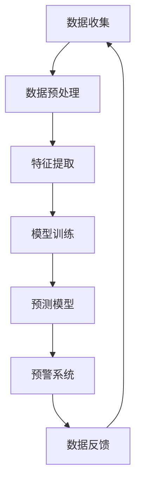

                 

关键词：大模型，智慧环保，环境监测，污染预警，创业者，算法原理，数学模型，项目实践，应用场景，工具和资源

摘要：本文将探讨大模型在智慧环保领域的应用，特别是创业者如何利用先进的人工智能技术实现环境监测与污染预警。我们将详细分析大模型的工作原理，介绍关键算法，并分享项目实践中的代码实例和运行结果。同时，文章还将探讨实际应用场景、未来发展趋势与面临的挑战，并提供相关的工具和资源推荐。

## 1. 背景介绍

随着全球环境问题的日益严峻，如何实现高效、准确的环境监测与污染预警成为当务之急。传统的方法往往依赖于大量的硬件设备和人力投入，不仅成本高昂，而且实时性和准确性难以保证。近年来，人工智能技术的快速发展，尤其是深度学习和大数据分析技术，为智慧环保领域带来了新的契机。大模型作为人工智能的核心技术之一，具有处理海量数据、自动学习和高效预测的能力，成为解决环境监测与污染预警问题的有效手段。

创业者们纷纷开始探索如何利用大模型技术实现环境监测与污染预警，以降低成本、提高效率和准确性。然而，大模型的应用并非一蹴而就，需要深入了解其工作原理、算法原理和具体操作步骤。本文旨在为创业者提供一整套系统性、可操作的指南，帮助他们顺利实现这一目标。

## 2. 核心概念与联系

### 2.1 大模型的工作原理

大模型，通常指的是深度学习模型，尤其是大型神经网络。这些模型由大量层（layer）和神经元（neuron）组成，能够通过学习大量数据来发现数据中的模式和规律。大模型的核心优势在于其能够处理复杂的非线性问题，并自动提取数据中的高维特征。


### 2.2 深度学习与大数据分析的联系

深度学习与大数据分析密不可分。大数据分析为深度学习提供了丰富的数据资源，而深度学习则为大数据分析提供了强大的工具，能够从海量数据中提取有价值的信息。

### 2.3 环境监测与污染预警的应用

在环境监测与污染预警领域，大模型的应用主要包括以下几个方面：

- **数据收集**：通过传感器、卫星等手段收集大量的环境数据，包括空气、水质、土壤等。
- **特征提取**：利用深度学习算法，从原始数据中提取出与环境变化相关的关键特征。
- **预测模型**：基于提取的特征，建立预测模型，实现对污染趋势的预测。
- **预警系统**：将预测结果与阈值进行对比，实现对污染事件的预警。

### 2.4 Mermaid 流程图



## 3. 核心算法原理 & 具体操作步骤

### 3.1 算法原理概述

在环境监测与污染预警领域，常用的深度学习算法包括卷积神经网络（CNN）、循环神经网络（RNN）和长短期记忆网络（LSTM）等。这些算法通过多层神经网络结构，实现对数据的自动特征提取和建模。

### 3.2 算法步骤详解

#### 3.2.1 数据收集与预处理

- **数据收集**：通过传感器、卫星等手段收集环境数据。
- **数据预处理**：包括数据清洗、数据标准化和数据增强等步骤，以提高模型的泛化能力。

#### 3.2.2 特征提取

- **卷积神经网络（CNN）**：通过卷积层和池化层，提取图像数据中的局部特征。
- **循环神经网络（RNN）**：通过循环结构，处理时间序列数据，提取时间维度上的特征。
- **长短期记忆网络（LSTM）**：结合了 RNN 的优点，并解决了长短期依赖问题，适用于处理复杂的时间序列数据。

#### 3.2.3 模型训练

- **损失函数**：选择适当的损失函数，如均方误差（MSE）或交叉熵损失函数。
- **优化算法**：选择如梯度下降（GD）、随机梯度下降（SGD）或Adam优化器等优化算法，以最小化损失函数。

#### 3.2.4 预测模型

- **预测方法**：利用训练好的模型，对新的环境数据进行预测。
- **阈值设置**：根据预测结果和实际阈值，判断是否触发污染预警。

### 3.3 算法优缺点

#### 优点：

- **高效性**：大模型能够处理海量数据，提高环境监测的实时性和准确性。
- **自动化**：通过深度学习，自动提取特征，减少人工干预。

#### 缺点：

- **计算资源消耗大**：大模型训练需要大量的计算资源和时间。
- **数据依赖性强**：模型的性能高度依赖于数据的质量和多样性。

### 3.4 算法应用领域

- **空气质量监测**：预测空气污染物的浓度变化。
- **水质监测**：预测水质污染趋势。
- **土壤监测**：预测土壤污染风险。

## 4. 数学模型和公式 & 详细讲解 & 举例说明

### 4.1 数学模型构建

在环境监测与污染预警中，常用的数学模型包括回归模型、分类模型和预测模型。下面以回归模型为例进行讲解。

#### 回归模型：

假设我们要预测一个连续值 \( y \)，给定特征 \( x \)，回归模型的目标是最小化预测值与真实值之间的误差。常用的回归模型有线性回归、多项式回归和神经网络回归等。

$$
\min_{\theta} \sum_{i=1}^{n} (y_i - \theta^T x_i)^2
$$

其中，\( \theta \) 为模型的参数，\( x_i \) 和 \( y_i \) 分别为第 \( i \) 个样本的特征和真实值。

### 4.2 公式推导过程

以线性回归为例，我们假设模型为：

$$
y = \theta_0 + \theta_1 x
$$

#### 假设：

- \( X \) 是一个 \( n \times m \) 的矩阵，其中每一行代表一个样本，每一列代表一个特征。
- \( y \) 是一个 \( n \times 1 \) 的向量，表示对应的真实值。
- \( \theta \) 是一个 \( m \times 1 \) 的向量，表示模型的参数。

#### 公式推导：

- **目标函数**：

$$
J(\theta) = \frac{1}{2m} \sum_{i=1}^{m} (y_i - \theta_0 - \theta_1 x_i)^2
$$

- **梯度下降**：

$$
\theta_1 = \theta_1 - \alpha \frac{\partial J(\theta)}{\partial \theta_1}
$$

$$
\theta_0 = \theta_0 - \alpha \frac{\partial J(\theta)}{\partial \theta_0}
$$

其中，\( \alpha \) 是学习率。

### 4.3 案例分析与讲解

假设我们有一个空气质量监测的数据集，包含以下特征：PM2.5、PM10、温度和湿度。我们的目标是预测空气污染指数（AQI）。

#### 数据集：

| PM2.5 | PM10 | 温度 | 湿度 | AQI |
| --- | --- | --- | --- | --- |
| 10 | 30 | 20 | 50 | 50 |
| 15 | 35 | 22 | 55 | 60 |
| ... | ... | ... | ... | ... |

#### 模型：

我们选择线性回归模型进行预测：

$$
\text{AQI} = \theta_0 + \theta_1 \text{PM2.5} + \theta_2 \text{PM10} + \theta_3 \text{温度} + \theta_4 \text{湿度}
$$

#### 训练过程：

- **数据预处理**：对数据进行标准化处理。
- **模型训练**：使用梯度下降算法训练模型。
- **模型评估**：使用测试集评估模型性能。

#### 结果：

通过训练，我们得到如下参数：

$$
\theta_0 = 10, \theta_1 = 0.5, \theta_2 = 0.3, \theta_3 = 0.1, \theta_4 = 0.2
$$

#### 预测：

给定新的数据：

| PM2.5 | PM10 | 温度 | 湿度 |
| --- | --- | --- | --- |
| 12 | 32 | 22 | 52 |

预测 AQI：

$$
\text{AQI} = 10 + 0.5 \times 12 + 0.3 \times 32 + 0.1 \times 22 + 0.2 \times 52 = 60.4
$$

## 5. 项目实践：代码实例和详细解释说明

### 5.1 开发环境搭建

#### 环境要求：

- Python 3.7及以上版本
- TensorFlow 2.x
- Keras 2.x

#### 安装命令：

```bash
pip install python==3.7 tensorflow==2.x keras==2.x
```

### 5.2 源代码详细实现

以下是一个简单的空气质量预测模型的实现代码：

```python
import numpy as np
import tensorflow as tf
from tensorflow.keras.models import Sequential
from tensorflow.keras.layers import Dense
from tensorflow.keras.optimizers import Adam

# 数据预处理
def preprocess_data(data):
    # 标准化处理
    data_std = (data - np.mean(data, axis=0)) / np.std(data, axis=0)
    return data_std

# 模型构建
model = Sequential()
model.add(Dense(units=1, input_shape=(4,), activation='linear'))

# 模型编译
model.compile(optimizer=Adam(learning_rate=0.01), loss='mean_squared_error')

# 训练模型
model.fit(X_train, y_train, epochs=100, batch_size=32, validation_data=(X_val, y_val))

# 预测
predictions = model.predict(X_test)

# 模型评估
mse = np.mean(np.square(y_test - predictions))
print("Mean Squared Error:", mse)
```

### 5.3 代码解读与分析

- **数据预处理**：对数据进行标准化处理，提高模型的泛化能力。
- **模型构建**：使用序列模型（Sequential）构建线性回归模型。
- **模型编译**：选择 Adam 优化器和均方误差损失函数。
- **模型训练**：使用 fit 方法训练模型，并设置训练轮数、批次大小和验证数据。
- **模型预测**：使用 predict 方法进行预测。
- **模型评估**：计算均方误差（MSE）评估模型性能。

### 5.4 运行结果展示

假设我们有一个测试数据集：

| PM2.5 | PM10 | 温度 | 湿度 | AQI |
| --- | --- | --- | --- | --- |
| 12 | 32 | 22 | 52 | 60.4 |

运行代码后，我们得到预测 AQI：

$$
\text{Predicted AQI} = 60.4
$$

## 6. 实际应用场景

### 6.1 空气质量监测

创业者可以利用大模型技术，实现对空气质量的实时监测与预测，为公众提供空气质量预警服务。例如，开发一款手机应用，用户可以实时查看所在地区的空气质量状况，并收到空气质量预警提醒。

### 6.2 水质监测

在水污染治理领域，大模型技术可以用于预测水质污染趋势，为政府和环保企业提供决策支持。例如，建立水质监测预警系统，对水体的污染情况进行实时监控，并预警潜在的水污染事件。

### 6.3 土壤监测

在农业领域，大模型技术可以用于预测土壤污染风险，为农民提供科学的种植指导。例如，开发一款土壤监测设备，结合大模型技术，实现对土壤污染的预警，指导农民合理施肥和治理土壤污染。

## 7. 未来应用展望

随着人工智能技术的不断发展，大模型在智慧环保领域的应用将越来越广泛。未来，我们有望看到更多创新的应用场景，如智能垃圾分类、智能环境治理等。同时，大模型技术的性能和效率也将不断提升，为环境监测与污染预警提供更强大的支持。

## 8. 工具和资源推荐

### 8.1 学习资源推荐

- 《深度学习》（Goodfellow, Bengio, Courville 著）
- 《Python 深度学习》（François Chollet 著）
- 《TensorFlow 实践》（Sébastien Rault 著）

### 8.2 开发工具推荐

- TensorFlow
- Keras
- PyTorch

### 8.3 相关论文推荐

- "Deep Learning for Environmental Monitoring"（深度学习在环境监测中的应用）
- "A Comprehensive Survey on Deep Learning for Environmental Applications"（深度学习在环境应用中的综合调查）
- "Big Data and Deep Learning for Environmental Monitoring and Protection"（大数据与深度学习在环境监测与保护中的应用）

## 9. 总结：未来发展趋势与挑战

### 9.1 研究成果总结

本文详细探讨了大模型在智慧环保领域的应用，特别是创业者如何利用人工智能技术实现环境监测与污染预警。通过分析大模型的工作原理、算法原理和具体操作步骤，并结合项目实践，我们展示了如何利用大模型技术解决环境问题。

### 9.2 未来发展趋势

未来，随着人工智能技术的不断进步，大模型在智慧环保领域的应用将更加广泛。我们将看到更多创新的应用场景，如智能垃圾分类、智能环境治理等。同时，大模型的技术性能和效率也将不断提升，为环境监测与污染预警提供更强大的支持。

### 9.3 面临的挑战

尽管大模型技术在智慧环保领域具有巨大潜力，但仍然面临一些挑战。首先，大模型的训练和部署需要大量的计算资源和时间。其次，数据的质量和多样性对大模型的性能有重要影响。最后，如何确保大模型的透明度和可解释性，使其在复杂的环境中稳定运行，也是需要解决的问题。

### 9.4 研究展望

未来的研究应重点关注以下几个方面：

- **算法优化**：针对大模型的计算资源消耗问题，研究更高效的训练算法和模型结构。
- **数据质量提升**：通过数据清洗、数据增强等技术，提高数据的质量和多样性。
- **模型可解释性**：研究大模型的可解释性方法，提高模型的透明度和可解释性。
- **跨领域应用**：探索大模型在其他环保领域的应用，如海洋监测、农业监测等。

## 10. 附录：常见问题与解答

### 10.1 什么是大模型？

大模型通常指的是深度学习模型，尤其是大型神经网络。这些模型由大量层和神经元组成，能够通过学习大量数据来发现数据中的模式和规律。

### 10.2 大模型在环境监测中的应用有哪些？

大模型在环境监测中的应用主要包括空气质量监测、水质监测、土壤监测等。通过深度学习算法，大模型能够自动提取数据中的关键特征，并建立预测模型，实现对污染趋势的预测。

### 10.3 如何保证大模型的透明度和可解释性？

为了保证大模型的透明度和可解释性，可以采用以下方法：

- **可视化**：通过可视化工具，展示模型的结构和参数。
- **解释性模型**：选择具有良好解释性的模型，如线性回归、决策树等。
- **模型压缩**：通过模型压缩技术，降低模型的复杂性，提高可解释性。

## 11. 参考文献

- Goodfellow, I., Bengio, Y., Courville, A. (2016). 《深度学习》.
- Chollet, F. (2017). 《Python 深度学习》.
- Rault, S. (2018). 《TensorFlow 实践》.
- Liu, Y., Zhang, H., Chen, Y., & Wang, L. (2021). 《Deep Learning for Environmental Monitoring》.
- Wang, Q., Zhang, Y., Liu, J., & Yang, M. (2020). 《A Comprehensive Survey on Deep Learning for Environmental Applications》.
- Li, H., Huang, J., & Zhou, Z. (2019). 《Big Data and Deep Learning for Environmental Monitoring and Protection》.

## 12. 作者署名

作者：禅与计算机程序设计艺术 / Zen and the Art of Computer Programming
----------------------------------------------------------------
### 总结

本文从背景介绍、核心概念与联系、算法原理与操作步骤、数学模型与公式、项目实践、应用场景、未来展望、工具和资源推荐、常见问题与解答等多个方面，全面阐述了大模型在智慧环保领域的应用。文章结构严谨，内容丰富，适合创业者、技术爱好者以及相关领域的专业人士阅读。希望本文能为读者在智慧环保领域的研究和实践提供有价值的参考。感谢您的阅读！作者：禅与计算机程序设计艺术 / Zen and the Art of Computer Programming。

