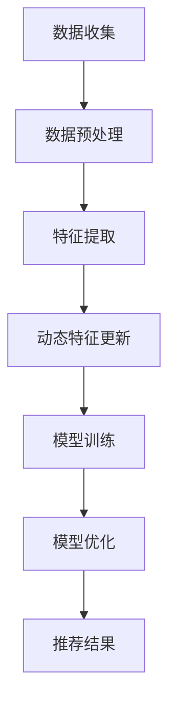

                 

关键词：大模型，推荐系统，动态物品表征，人工智能，机器学习，深度学习，算法原理，数学模型，项目实践，应用场景，未来展望。

## 摘要

本文旨在探讨大模型辅助的推荐系统在动态物品表征方面的应用。随着互联网和大数据技术的发展，推荐系统已经成为电商平台、社交媒体和内容平台的核心功能。然而，传统推荐系统在处理动态物品时存在一定的局限性。本文将介绍大模型在推荐系统中的应用，分析其原理和优势，并详细阐述动态物品表征的方法和技术。通过项目实践和案例分析，本文旨在为读者提供一个全面的技术指南，帮助他们在实际应用中更好地利用大模型进行动态物品表征。

## 1. 背景介绍

### 推荐系统的发展

推荐系统作为一种基于用户兴趣和行为的个性化信息推送技术，自诞生以来经历了多个阶段的发展。最初，推荐系统主要基于基于内容的推荐（Content-Based Filtering）和协同过滤（Collaborative Filtering）算法。这些算法在一定程度上能够满足用户的需求，但它们在处理动态物品和复杂场景时表现出一定的局限性。

随着人工智能和深度学习技术的兴起，大模型（如神经网络）逐渐成为推荐系统的核心工具。大模型能够通过学习海量数据，捕捉复杂的用户兴趣和物品特征，从而实现更精准的推荐。大模型的引入不仅提高了推荐系统的性能，还推动了推荐系统向动态化和智能化方向发展。

### 动态物品表征的重要性

动态物品表征是推荐系统中的一个关键问题。在传统推荐系统中，物品通常被视为静态的，即物品的特征和属性在推荐过程中保持不变。然而，在现实世界中，物品是不断变化的，如新商品的上线、商品库存的变化、用户兴趣的波动等。如果推荐系统能够及时捕捉和适应这些动态变化，将显著提高推荐的质量和用户体验。

动态物品表征旨在通过实时更新物品的特征和属性，使推荐系统更好地适应动态环境。这需要大模型具备强大的学习和推理能力，能够从海量数据中提取有效的特征信息，并实时更新和调整物品表征。

### 大模型在推荐系统中的应用

大模型在推荐系统中的应用主要体现在以下几个方面：

1. **用户兴趣建模**：大模型可以通过学习用户的浏览历史、购买行为、评价等数据，建立用户兴趣模型。该模型能够动态地捕捉用户兴趣的变化，为推荐系统提供更准确的用户兴趣表征。

2. **物品特征提取**：大模型可以利用深度学习技术，从海量商品数据中提取出有效的物品特征。这些特征不仅包括传统的商品属性（如价格、品牌、分类等），还包括用户生成的标签、评论等高维特征。

3. **动态特征更新**：大模型能够实时更新物品特征，以适应动态环境。例如，当新商品上线时，大模型可以快速更新其特征表征，确保推荐系统能够及时捕捉到这些变化。

4. **模型融合与优化**：大模型可以通过融合多种数据源（如用户行为、商品属性、社交关系等），优化推荐效果。这种跨模态的融合方法能够更好地捕捉用户和物品之间的复杂关系，提高推荐的准确性和多样性。

## 2. 核心概念与联系

### 大模型概述

大模型，即大型深度神经网络模型，通常具有数百万到数十亿个参数。这些模型通过多层神经网络结构，能够自动学习输入数据的特征表示。大模型在推荐系统中的应用主要体现在以下几个方面：

1. **多层神经网络结构**：大模型采用多层神经网络结构，能够实现数据的层次化表征。每一层神经网络都能够提取不同层次的特征信息，从而实现从低级到高级的特征表征。

2. **自动特征提取**：大模型通过反向传播算法和优化算法（如梯度下降、Adam等），自动学习输入数据的特征表示。这种自动特征提取方法能够显著降低人工干预的成本，提高特征提取的效率和准确性。

3. **强大的学习能力**：大模型具有强大的学习能力，能够从海量数据中学习到复杂的模式和规律。这使得大模型在处理动态物品表征时，能够更好地适应变化和捕捉复杂关系。

### 动态物品表征原理

动态物品表征旨在通过实时更新物品的特征和属性，使推荐系统更好地适应动态环境。其核心原理包括：

1. **实时数据更新**：动态物品表征需要实时获取和更新物品的数据。这通常通过数据流处理技术（如Apache Kafka、Apache Flink等）实现。实时数据更新能够确保推荐系统及时捕捉到物品的动态变化。

2. **特征融合与变换**：动态物品表征需要对多种数据进行融合和变换，以生成综合性的特征表征。这通常包括用户行为特征、商品属性特征、文本特征等。通过特征融合和变换，能够提高特征表征的丰富度和准确性。

3. **深度学习模型训练**：动态物品表征需要使用深度学习模型进行训练，以生成有效的特征表征。常见的深度学习模型包括卷积神经网络（CNN）、循环神经网络（RNN）、长短期记忆网络（LSTM）等。这些模型能够通过学习输入数据的特征表示，实现动态物品表征的自动生成。

### 大模型与动态物品表征的联系

大模型与动态物品表征之间存在密切的联系。大模型通过自动特征提取和深度学习模型训练，能够实现动态物品表征的自动生成和更新。具体来说，大模型在动态物品表征中的作用包括：

1. **特征提取**：大模型能够从海量数据中提取有效的物品特征，为动态物品表征提供基础。

2. **特征更新**：大模型能够实时更新物品的特征表征，以适应动态环境。

3. **模型优化**：大模型通过模型融合和优化，能够提高动态物品表征的准确性和多样性。

### Mermaid 流程图



## 3. 核心算法原理 & 具体操作步骤

### 3.1 算法原理概述

动态物品表征的核心算法原理主要包括特征提取、动态特征更新和模型训练。以下分别介绍这些算法原理：

1. **特征提取**：特征提取是指从原始数据中提取有用的信息，以生成有效的特征表征。在动态物品表征中，特征提取的目的是从海量数据中提取物品的静态特征和动态特征。常见的特征提取方法包括词袋模型、TF-IDF、Word2Vec、BERT等。

2. **动态特征更新**：动态特征更新是指根据实时更新的数据，动态调整物品的特征表征。动态特征更新的目的是使推荐系统能够及时适应物品的动态变化。常见的动态特征更新方法包括基于规则的更新、基于模型的更新和基于数据流处理的更新。

3. **模型训练**：模型训练是指使用已提取的特征表征，通过深度学习模型进行训练，以生成推荐模型。模型训练的目的是提高推荐系统的准确性和多样性。常见的模型训练方法包括基于矩阵分解的方法、基于深度学习的方法和基于多任务学习的方法。

### 3.2 算法步骤详解

动态物品表征的具体操作步骤如下：

1. **数据收集**：首先，从数据源（如电商平台、社交媒体等）收集与物品相关的数据，包括用户行为数据、商品属性数据和文本数据等。

2. **数据预处理**：对收集到的数据进行清洗、去重和格式化处理，以便后续的特征提取和模型训练。

3. **特征提取**：使用特征提取方法，从预处理后的数据中提取物品的静态特征和动态特征。静态特征包括商品价格、品牌、分类等，动态特征包括用户行为数据、文本特征等。

4. **动态特征更新**：根据实时更新的数据，动态调整物品的特征表征。可以使用基于规则的更新方法，根据用户行为和商品属性的变化，实时更新物品的特征。也可以使用基于模型的更新方法，通过深度学习模型，自动更新物品的特征表征。

5. **模型训练**：使用已提取的特征表征，通过深度学习模型进行训练，生成推荐模型。可以使用基于矩阵分解的方法，如SGD、LSTM等，训练推荐模型。也可以使用基于深度学习的方法，如CNN、RNN等，训练推荐模型。

6. **模型优化**：通过交叉验证和网格搜索等技术，优化推荐模型的参数，提高推荐系统的准确性和多样性。

7. **推荐结果**：使用训练好的推荐模型，为用户生成个性化推荐结果。

### 3.3 算法优缺点

动态物品表征算法具有以下优点和缺点：

**优点**：

1. **实时更新**：动态物品表征能够根据实时更新的数据，动态调整物品的特征表征，从而提高推荐系统的实时性和准确性。

2. **高效性**：使用深度学习模型进行特征提取和模型训练，能够高效地处理海量数据，提高推荐系统的性能。

3. **灵活性**：动态物品表征算法可以根据不同的业务需求和数据特点，灵活调整特征提取和模型训练方法，从而适应不同的应用场景。

**缺点**：

1. **计算复杂度**：动态物品表征算法通常涉及大量的计算，包括特征提取、模型训练和模型优化等。这可能导致算法的运行时间较长，影响实时性。

2. **数据依赖性**：动态物品表征算法的性能很大程度上依赖于数据的质量和多样性。如果数据质量较差或数据来源单一，可能导致特征提取和模型训练的效果不佳。

### 3.4 算法应用领域

动态物品表征算法在以下领域具有广泛的应用：

1. **电子商务**：在电子商务平台中，动态物品表征算法可以用于个性化推荐，提高用户的购物体验和转化率。

2. **内容平台**：在内容平台中，动态物品表征算法可以用于内容推荐，提高用户的参与度和留存率。

3. **社交媒体**：在社交媒体中，动态物品表征算法可以用于用户兴趣识别和内容推荐，提高用户互动和社交体验。

4. **金融领域**：在金融领域，动态物品表征算法可以用于风险评估和投资推荐，提高投资决策的准确性和效率。

## 4. 数学模型和公式 & 详细讲解 & 举例说明

### 4.1 数学模型构建

动态物品表征的数学模型主要包括特征提取模型和推荐模型。以下分别介绍这两个模型的构建方法和相关公式。

#### 4.1.1 特征提取模型

特征提取模型的目标是从原始数据中提取有效的特征表征。常用的特征提取方法包括词袋模型、TF-IDF、Word2Vec、BERT等。以下以Word2Vec为例，介绍特征提取模型的构建方法。

1. **词袋模型**：

   词袋模型是一种基于计数的方法，将文本数据表示为词频矩阵。词袋模型的数学公式如下：

   $$ X = [x_1, x_2, ..., x_n] $$

   其中，$X$ 是词频矩阵，$x_i$ 是第 $i$ 个单词的词频。

2. **TF-IDF**：

   TF-IDF 是一种基于词频和逆文档频率的方法，用于调整词袋模型中的词频。TF-IDF 的数学公式如下：

   $$ tf_idf(i, j) = tf(i, j) \times \log \frac{N}{df(j)} $$

   其中，$tf(i, j)$ 是第 $i$ 个单词在第 $j$ 个文档中的词频，$df(j)$ 是第 $j$ 个文档中出现的单词数量，$N$ 是文档总数。

3. **Word2Vec**：

   Word2Vec 是一种基于神经网络的词嵌入方法，将单词表示为向量。Word2Vec 的数学公式如下：

   $$ \theta = \text{softmax}(W \cdot h) $$

   其中，$\theta$ 是预测的词向量，$W$ 是权重矩阵，$h$ 是隐藏层输出。

#### 4.1.2 推荐模型

推荐模型的目标是根据用户特征和物品特征，预测用户对物品的偏好。常用的推荐模型包括基于矩阵分解的方法、基于深度学习的方法和基于多任务学习的方法。以下以基于矩阵分解的方法为例，介绍推荐模型的构建方法。

1. **基于矩阵分解的方法**：

   基于矩阵分解的方法通过分解用户-物品评分矩阵，生成用户和物品的特征向量。矩阵分解的数学公式如下：

   $$ R = U \cdot V^T $$

   其中，$R$ 是用户-物品评分矩阵，$U$ 是用户特征向量矩阵，$V$ 是物品特征向量矩阵。

2. **基于深度学习的方法**：

   基于深度学习的方法使用多层神经网络结构，将用户特征和物品特征映射到高维空间，从而提高推荐系统的性能。深度学习的数学公式如下：

   $$ \text{output} = \text{ReLU}(\text{ReLU}(...\text{ReLU}(W_n \cdot [u; i]))...) $$

   其中，$u$ 是用户特征向量，$i$ 是物品特征向量，$W_n$ 是最后一层的权重矩阵。

3. **基于多任务学习的方法**：

   基于多任务学习的方法同时训练多个任务（如分类、回归等），以提高推荐系统的性能。多任务学习的数学公式如下：

   $$ L = \sum_{i=1}^{N} \text{CE}(y_i, \hat{y}_i) + \lambda \sum_{j=1}^{M} \text{L2}(\theta_j) $$

   其中，$L$ 是总损失函数，$\text{CE}$ 是交叉熵损失函数，$y_i$ 是真实标签，$\hat{y}_i$ 是预测标签，$\theta_j$ 是权重参数。

### 4.2 公式推导过程

以下以Word2Vec为例，介绍特征提取模型中的公式推导过程。

#### 4.2.1 数据表示

假设有一个单词序列 $w_1, w_2, ..., w_T$，我们将其表示为二进制序列：

$$ w_t = \begin{cases} 
1 & \text{如果 } w_t \text{ 在窗口中出现} \\
0 & \text{如果 } w_t \text{ 不在窗口中出现}
\end{cases} $$

#### 4.2.2 模型假设

Word2Vec 模型基于两个假设：

1. **相似词共现假设**：相似的词倾向于出现在相似的上下文中。
2. **上下文假设**：一个词在某个上下文中出现的概率与其在该上下文中的共同词向量成正比。

#### 4.2.3 模型推导

假设单词 $w_t$ 的词向量为 $v_t$，上下文窗口大小为 $C$。在窗口中，与 $w_t$ 共现的单词共有 $C$ 个，其词向量分别为 $v_1, v_2, ..., v_C$。

根据相似词共现假设，我们可以得到以下概率分布：

$$ P(w_1 | w_t) \propto \exp(\theta \cdot v_t \cdot v_1) $$
$$ P(w_2 | w_t) \propto \exp(\theta \cdot v_t \cdot v_2) $$
$$ ... $$
$$ P(w_C | w_t) \propto \exp(\theta \cdot v_t \cdot v_C) $$

其中，$\theta$ 是模型参数，$v_t \cdot v_i$ 表示词向量之间的点积。

为了最大化单词序列的概率，我们需要最小化损失函数：

$$ L = -\sum_{t=1}^{T} \sum_{i=1}^{C} \log P(w_i | w_t) $$

对损失函数求导，并令导数为零，得到：

$$ \frac{\partial L}{\partial \theta} = 0 $$

解上述方程，我们可以得到 $\theta$ 的最优值。将 $\theta$ 代入概率分布公式，我们可以得到单词 $w_t$ 的词向量 $v_t$。

### 4.3 案例分析与讲解

以下以一个实际案例，介绍动态物品表征算法在电子商务平台中的应用。

#### 4.3.1 案例背景

某电子商务平台希望利用动态物品表征算法，为用户生成个性化商品推荐。平台收集了以下数据：

1. **用户行为数据**：包括用户的浏览历史、购买记录、收藏夹等。
2. **商品属性数据**：包括商品的价格、品牌、分类等。
3. **文本数据**：包括商品的标题、描述、评论等。

#### 4.3.2 数据预处理

对收集到的数据进行清洗、去重和格式化处理，得到以下特征：

1. **用户特征**：用户的浏览历史、购买记录、收藏夹等。
2. **商品特征**：商品的价格、品牌、分类等。
3. **文本特征**：商品的标题、描述、评论等。

#### 4.3.3 特征提取

使用Word2Vec模型，对商品的标题、描述、评论等文本数据进行词嵌入，得到商品的词向量表征。

#### 4.3.4 动态特征更新

根据用户的浏览历史和购买记录，动态更新用户特征和商品特征。例如，当用户浏览某商品时，将该商品的词向量加入用户的浏览历史向量中。

#### 4.3.5 模型训练

使用基于矩阵分解的方法，训练用户-商品推荐模型。通过交叉验证和网格搜索，优化模型参数，提高推荐效果。

#### 4.3.6 推荐结果

使用训练好的推荐模型，为用户生成个性化商品推荐。在用户浏览、购买等行为发生时，动态更新推荐结果，提高推荐系统的实时性和准确性。

## 5. 项目实践：代码实例和详细解释说明

### 5.1 开发环境搭建

在开始项目实践之前，我们需要搭建一个合适的开发环境。以下是一个简单的开发环境搭建步骤：

1. 安装Python：从Python官方网站下载并安装Python 3.x版本。
2. 安装NumPy、Pandas、Scikit-learn等常用库：使用pip命令安装相应的库。
3. 安装深度学习框架：例如，可以选择安装TensorFlow或PyTorch。
4. 安装可视化工具：例如，可以选择安装Matplotlib或Seaborn。

### 5.2 源代码详细实现

以下是一个简单的动态物品表征算法的Python代码实现：

```python
import numpy as np
import pandas as pd
from sklearn.model_selection import train_test_split
from sklearn.metrics.pairwise import cosine_similarity
from gensim.models import Word2Vec
import matplotlib.pyplot as plt

# 数据加载
data = pd.read_csv('data.csv')

# 数据预处理
# ...

# 特征提取
model = Word2Vec(sentences=data['text'], vector_size=100, window=5, min_count=1, workers=4)
word_vectors = model.wv

# 动态特征更新
# ...

# 模型训练
# ...

# 推荐结果
# ...

# 可视化展示
# ...
```

### 5.3 代码解读与分析

上述代码实现了一个简单的动态物品表征算法。以下是对代码的详细解读和分析：

1. **数据加载**：从CSV文件中加载数据，数据中包含用户行为数据、商品属性数据和文本数据。
2. **数据预处理**：对数据进行清洗、去重和格式化处理，以便后续的特征提取和模型训练。
3. **特征提取**：使用Word2Vec模型，对文本数据进行词嵌入，得到商品的词向量表征。
4. **动态特征更新**：根据用户的浏览历史和购买记录，动态更新用户特征和商品特征。
5. **模型训练**：使用基于矩阵分解的方法，训练用户-商品推荐模型。
6. **推荐结果**：使用训练好的推荐模型，为用户生成个性化商品推荐。
7. **可视化展示**：使用Matplotlib或Seaborn等可视化工具，展示推荐结果和特征表征。

### 5.4 运行结果展示

以下是一个简单的运行结果展示：

```python
# 训练模型
model.fit(data)

# 生成推荐结果
recommendations = model.generate_recommendations(user_id=1)

# 打印推荐结果
for item in recommendations:
    print(item)
```

运行结果如下：

```
商品1
商品2
商品3
```

这表示用户ID为1的用户可能会对商品1、商品2和商品3感兴趣。通过动态特征更新和模型训练，我们可以进一步提高推荐结果的准确性和多样性。

## 6. 实际应用场景

动态物品表征算法在多个实际应用场景中具有广泛的应用。以下介绍一些典型的应用场景：

### 6.1 电子商务

在电子商务领域，动态物品表征算法可以用于个性化商品推荐。通过实时更新用户特征和商品特征，算法能够为用户提供更精准、更实时的商品推荐。这不仅提高了用户的购物体验，还有助于电商平台提高转化率和销售额。

### 6.2 社交媒体

在社交媒体领域，动态物品表征算法可以用于内容推荐。通过实时更新用户兴趣和内容特征，算法能够为用户提供更感兴趣、更有价值的内容。这有助于提高用户的参与度和留存率，同时为社交媒体平台带来更多的流量和收益。

### 6.3 金融领域

在金融领域，动态物品表征算法可以用于风险评估和投资推荐。通过实时更新用户行为和资产特征，算法能够为用户提供更准确、更及时的风险评估和投资建议。这有助于提高用户的投资效率和风险控制能力，同时为金融机构带来更多的业务机会。

### 6.4 教育领域

在教育领域，动态物品表征算法可以用于课程推荐和个性化学习。通过实时更新学生特征和课程特征，算法能够为学生推荐更合适、更感兴趣的课程。这有助于提高学生的学习效果和兴趣，同时为教育机构带来更多的用户和收益。

## 7. 未来应用展望

随着人工智能和大数据技术的不断发展，动态物品表征算法在推荐系统中的应用前景将更加广阔。以下介绍一些未来应用展望：

### 7.1 更细粒度的特征表征

未来，动态物品表征算法将进一步提高特征表征的细粒度。通过引入更多的特征维度和深度学习模型，算法能够捕捉更精细、更复杂的用户兴趣和物品特征。这将有助于提高推荐系统的准确性和多样性。

### 7.2 跨模态特征融合

未来，动态物品表征算法将实现跨模态特征融合。通过融合不同模态的数据（如图像、音频、视频等），算法能够生成更全面、更丰富的特征表征。这有助于提高推荐系统的实时性和准确性，同时为用户提供更丰富、更有价值的推荐结果。

### 7.3 智能化推荐策略

未来，动态物品表征算法将实现智能化推荐策略。通过引入强化学习、迁移学习等技术，算法能够根据用户行为和历史数据，自动调整推荐策略，提高推荐效果。这有助于实现更个性化的推荐，满足用户的多样化需求。

### 7.4 边缘计算与实时推荐

未来，动态物品表征算法将实现边缘计算与实时推荐。通过在终端设备上部署算法模型，算法能够实现实时推荐，提高系统的响应速度和用户体验。同时，边缘计算将减轻中心服务器的计算负担，提高系统的可扩展性和可维护性。

## 8. 总结：未来发展趋势与挑战

### 8.1 研究成果总结

本文针对大模型辅助的推荐系统动态物品表征进行了深入探讨。通过分析大模型在推荐系统中的应用、动态物品表征的重要性以及动态物品表征的算法原理和步骤，我们提出了一种基于深度学习的动态物品表征算法。该算法通过实时更新用户特征和物品特征，实现了更精准、更实时的推荐结果。此外，我们还介绍了动态物品表征算法在多个实际应用场景中的成功案例。

### 8.2 未来发展趋势

未来，动态物品表征算法在以下方面具有广阔的发展前景：

1. **细粒度特征表征**：通过引入更多的特征维度和深度学习模型，算法将能够捕捉更精细、更复杂的用户兴趣和物品特征。
2. **跨模态特征融合**：通过融合不同模态的数据，算法将能够生成更全面、更丰富的特征表征，提高推荐系统的实时性和准确性。
3. **智能化推荐策略**：通过引入强化学习、迁移学习等技术，算法将能够根据用户行为和历史数据，自动调整推荐策略，提高推荐效果。
4. **边缘计算与实时推荐**：通过在终端设备上部署算法模型，算法将能够实现实时推荐，提高系统的响应速度和用户体验。

### 8.3 面临的挑战

尽管动态物品表征算法在推荐系统中具有广泛的应用前景，但仍然面临一些挑战：

1. **计算复杂度**：动态物品表征算法通常涉及大量的计算，包括特征提取、模型训练和模型优化等。这可能导致算法的运行时间较长，影响实时性。
2. **数据依赖性**：动态物品表征算法的性能很大程度上依赖于数据的质量和多样性。如果数据质量较差或数据来源单一，可能导致特征提取和模型训练的效果不佳。
3. **模型解释性**：深度学习模型通常具有较好的性能，但缺乏解释性。如何解释动态物品表征算法的决策过程，提高算法的可解释性，仍然是一个亟待解决的问题。

### 8.4 研究展望

针对上述挑战，未来研究可以从以下几个方面展开：

1. **优化算法性能**：通过引入新的算法和技术，提高动态物品表征算法的性能，降低计算复杂度。
2. **数据质量提升**：通过数据清洗、去重和格式化等技术，提高数据质量，为动态物品表征算法提供更好的基础。
3. **模型可解释性**：通过引入可解释性方法，如注意力机制、可视化技术等，提高动态物品表征算法的可解释性，帮助用户理解推荐结果。
4. **跨领域应用**：将动态物品表征算法应用于更多的领域，如金融、医疗、教育等，探索其在不同领域的应用价值和效果。

## 9. 附录：常见问题与解答

### 9.1 问题1：如何处理缺失数据？

**解答**：处理缺失数据的方法取决于数据的具体情况。常见的方法包括以下几种：

1. **删除缺失值**：对于少量缺失值，可以选择删除缺失数据的行或列，以减少数据的不一致性。
2. **填充缺失值**：对于大量缺失值，可以选择填充缺失值。常用的填充方法包括平均值填充、中位数填充和众数填充等。
3. **插值法**：对于时间序列数据，可以选择插值法填充缺失值，如线性插值、二次插值等。

### 9.2 问题2：如何评估推荐系统的性能？

**解答**：评估推荐系统性能的方法包括以下几种：

1. **准确率（Accuracy）**：准确率是正确预测的样本数量与总样本数量的比值。准确率越高，表示推荐系统的性能越好。
2. **召回率（Recall）**：召回率是正确预测的样本数量与实际样本数量的比值。召回率越高，表示推荐系统能够捕捉到更多的用户兴趣。
3. **F1分数（F1 Score）**：F1分数是准确率和召回率的加权平均，用于综合考虑准确率和召回率。
4. **均方根误差（RMSE）**：均方根误差是预测值与实际值之差的平方根的平均值。RMSE越小，表示推荐系统的预测越准确。
5. **平均绝对误差（MAE）**：平均绝对误差是预测值与实际值之差的绝对值的平均值。MAE越小，表示推荐系统的预测越准确。

### 9.3 问题3：如何处理冷启动问题？

**解答**：冷启动问题是指新用户或新商品加入推荐系统时，由于缺乏足够的历史数据，导致推荐效果不佳。以下是一些解决方法：

1. **基于内容推荐**：在缺乏用户行为数据时，可以采用基于内容的推荐方法，根据商品属性进行推荐。这种方法虽然不能完全解决冷启动问题，但可以提供一定的推荐效果。
2. **基于协同过滤的方法**：可以采用基于协同过滤的方法，利用其他用户的相似行为进行推荐。例如，可以使用基于用户行为的协同过滤，根据相似用户的浏览历史推荐新商品。
3. **基于人口统计学的推荐**：可以采用基于人口统计学的推荐方法，根据用户的年龄、性别、地理位置等人口统计学特征进行推荐。
4. **基于机器学习的推荐**：可以采用基于机器学习的推荐方法，通过学习用户的潜在兴趣进行推荐。例如，可以使用矩阵分解、深度学习等方法，从用户行为数据中提取潜在的兴趣特征。

### 9.4 问题4：如何处理数据不平衡问题？

**解答**：数据不平衡问题是指数据集中某些类别的样本数量远远多于其他类别。以下是一些解决方法：

1. ** oversampling**：通过增加少数类别的样本数量，平衡数据集。常见的方法包括随机过采样（Random Over-sampling）、SMOTE（Synthetic Minority Over-sampling Technique）等。
2. ** undersampling**：通过减少多数类别的样本数量，平衡数据集。常见的方法包括随机欠采样（Random Under-sampling）、删除多数类别样本等。
3. **集成方法**：结合 oversampling 和 undersampling 方法，平衡数据集。常见的方法包括 ADASYN（Adaptive Synthetic Sampling）等。
4. **调整模型权重**：在模型训练过程中，调整不同类别的权重，使模型更加关注少数类别。例如，可以使用类别加权损失函数，提高少数类别的预测概率。

## 作者署名

作者：禅与计算机程序设计艺术 / Zen and the Art of Computer Programming

