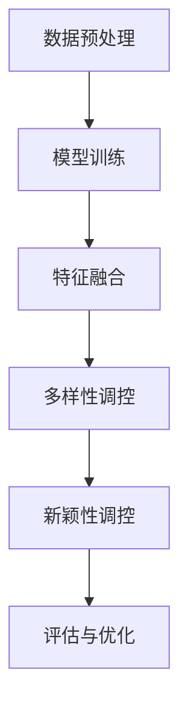

                 

关键词：大模型、推荐系统、多样性与新颖性、AI辅助、算法原理、应用场景、数学模型、代码实例、未来展望

## 摘要

本文主要探讨在大模型辅助下，推荐系统如何实现多样性与新颖性的平衡。随着人工智能技术的发展，大模型在推荐系统中的应用日益广泛，但随之而来的是多样性和新颖性的挑战。本文首先介绍了推荐系统的背景和核心概念，然后深入探讨了多样性与新颖性的定义和衡量标准。接着，本文详细分析了大模型辅助推荐系统的原理和算法，包括其优势、局限性以及可能的改进方向。通过实际案例和代码实例，本文展示了大模型在推荐系统多样性与新颖性平衡方面的应用效果。最后，本文对未来的发展趋势和挑战进行了展望。

## 1. 背景介绍

### 推荐系统的定义和作用

推荐系统是一种能够根据用户的历史行为和偏好，向用户推荐他们可能感兴趣的商品、内容或服务的计算机系统。它广泛应用于电子商务、社交媒体、在线视频、音乐、新闻等领域。推荐系统的核心目标是提高用户体验，增加用户粘性，提升商家销售额和用户满意度。

推荐系统的工作原理通常包括以下几个步骤：首先，系统会收集并处理用户的行为数据，如浏览记录、购买历史、点赞、评论等；然后，通过数据挖掘和机器学习算法，提取用户特征和物品特征；接着，根据这些特征，系统会生成推荐列表，展示给用户。推荐系统的优劣直接影响到用户的体验和商家的业务表现。

### 大模型的发展及其在推荐系统中的应用

大模型（Large Models）是指参数量巨大、计算能力强大的神经网络模型。近年来，随着深度学习技术的飞速发展，大模型在自然语言处理、计算机视觉、语音识别等领域取得了显著成果。大模型在推荐系统中的应用也日益受到关注。

大模型在推荐系统中的应用主要表现在以下几个方面：

1. **特征提取**：大模型能够自动从原始数据中提取出高维、抽象的特征，这些特征有助于提高推荐的准确性。
   
2. **上下文感知**：大模型可以捕捉到用户行为和物品属性之间的复杂关系，实现更精细化的推荐。
   
3. **多模态处理**：大模型能够处理多种类型的数据，如文本、图像、声音等，从而提供更全面的推荐。

然而，大模型在推荐系统中也带来了一些挑战，如计算资源消耗大、模型解释性差等。此外，如何在大模型的基础上实现多样性与新颖性的平衡，也是一个亟待解决的问题。

### 本文的研究目的和结构

本文旨在探讨大模型辅助下的推荐系统如何实现多样性与新颖性的平衡。具体来说，本文将：

1. **分析多样性与新颖性的定义和衡量标准**：明确多样性和新颖性的概念，并介绍相关的评价指标。
   
2. **介绍大模型辅助推荐系统的原理和算法**：阐述大模型在推荐系统中的优势和应用方法，分析其优缺点。

3. **通过实际案例和代码实例，展示大模型在推荐系统多样性与新颖性平衡方面的应用效果**：通过具体案例，说明如何在大模型辅助下实现多样性与新颖性的平衡。

4. **对未来的发展趋势和挑战进行展望**：探讨大模型在推荐系统多样性与新颖性平衡方面的未来研究方向和潜在挑战。

## 2. 核心概念与联系

### 多样性与新颖性的定义

**多样性（Diversity）**：指推荐列表中包含的不同类型或不同风格的物品的比例。高多样性意味着用户在推荐列表中可以看到更多不同的选择，从而提升用户体验。

**新颖性（Novelty）**：指推荐列表中的物品与用户历史行为或已推荐物品的差异程度。高新颖性意味着用户能够发现新的、未知的物品，从而满足他们的好奇心和探索欲。

### 多样性与新颖性的衡量标准

1. **内容多样性（Content Diversity）**：通过计算推荐列表中物品的属性差异来衡量。例如，使用Jaccard相似度或余弦相似度来计算物品之间的相似性。

2. **新颖度（Novelty Score）**：通过计算推荐物品与用户历史行为或已推荐物品的相似性来衡量。新颖度越高，说明物品与用户历史行为的差异越大。

3. **用户兴趣多样性（User Interest Diversity）**：通过分析用户对不同类型物品的偏好来衡量。例如，使用用户兴趣分布的Kullback-Leibler散度来衡量用户兴趣的多样性。

### 大模型辅助推荐系统的架构与流程

为了实现多样性与新颖性的平衡，大模型辅助推荐系统通常包括以下几个关键组件：

1. **数据预处理**：对原始数据进行清洗、去重、特征提取等处理，为后续模型训练和推荐提供高质量的数据。

2. **模型训练**：使用大模型（如Transformer、BERT等）对处理后的数据集进行训练，提取用户和物品的特征表示。

3. **特征融合**：将用户特征和物品特征进行融合，生成推荐列表。特征融合可以采用加权平均、注意力机制等方法。

4. **多样性调控**：通过调整推荐算法的参数或引入多样性增强策略，提高推荐列表的多样性。

5. **新颖性调控**：通过分析用户历史行为和已推荐物品，动态调整推荐策略，提高推荐列表的新颖性。

6. **评估与优化**：使用多样性、新颖性等评价指标对推荐系统进行评估，并根据评估结果不断优化算法。

### Mermaid 流程图



## 3. 核心算法原理 & 具体操作步骤

### 3.1 算法原理概述

大模型辅助推荐系统的核心算法主要包括以下几个步骤：

1. **数据预处理**：对原始数据（如用户行为数据、物品属性数据等）进行清洗、去重、特征提取等预处理操作，以提高数据质量和模型训练效果。

2. **模型训练**：使用大模型（如Transformer、BERT等）对预处理后的数据集进行训练，提取用户和物品的特征表示。训练过程中，通常采用双向编码器表示用户和物品的属性信息。

3. **特征融合**：将训练得到的用户和物品特征表示进行融合，生成推荐列表。特征融合可以采用加权平均、注意力机制等方法，以提高推荐的准确性和多样性。

4. **多样性调控**：通过调整推荐算法的参数或引入多样性增强策略，提高推荐列表的多样性。常见的多样性调控方法包括：随机采样、聚类划分、多视角推荐等。

5. **新颖性调控**：通过分析用户历史行为和已推荐物品，动态调整推荐策略，提高推荐列表的新颖性。新颖性调控可以采用：热度阈值、时间衰减、用户兴趣偏移等方法。

6. **评估与优化**：使用多样性、新颖性等评价指标对推荐系统进行评估，并根据评估结果不断优化算法。评估过程中，可以采用交叉验证、A/B测试等方法。

### 3.2 算法步骤详解

1. **数据预处理**：

   - 数据清洗：去除重复数据、缺失值填充、异常值处理等。
   - 特征提取：提取用户行为特征（如浏览、购买、点赞等）和物品属性特征（如类别、标签、价格等）。

2. **模型训练**：

   - 数据划分：将数据集划分为训练集、验证集和测试集。
   - 模型选择：选择适合的大模型架构，如Transformer、BERT等。
   - 模型训练：使用训练集对模型进行训练，优化模型参数。
   - 模型评估：使用验证集对模型进行评估，调整模型参数。

3. **特征融合**：

   - 用户特征表示：将用户行为特征进行编码，生成用户嵌入向量。
   - 物品特征表示：将物品属性特征进行编码，生成物品嵌入向量。
   - 特征融合：使用注意力机制或加权平均等方法，将用户和物品特征融合，生成推荐列表。

4. **多样性调控**：

   - 随机采样：从物品集合中随机选择一定数量的物品，组成推荐列表。
   - 聚类划分：将物品集合划分为多个聚类，为每个用户分配最近的聚类，从每个聚类中选取物品组成推荐列表。
   - 多视角推荐：从多个视角（如文本、图像、音频等）对物品进行推荐，提高多样性。

5. **新颖性调控**：

   - 热度阈值：设置一个热度阈值，将热度高于阈值的物品排除在推荐列表之外。
   - 时间衰减：根据物品的更新时间对物品进行权重调整，降低旧物品的推荐概率。
   - 用户兴趣偏移：根据用户的历史行为和偏好，动态调整推荐策略，提高新颖性。

6. **评估与优化**：

   - 多样性评估：使用多样性评价指标（如Jaccard相似度、平均最近邻相似度等）对推荐列表进行评估。
   - 新颖性评估：使用新颖性评价指标（如新旧物品比例、用户兴趣变化等）对推荐列表进行评估。
   - 优化策略：根据评估结果，调整多样性调控策略和新颖性调控策略，不断优化推荐系统。

### 3.3 算法优缺点

**优点**：

1. **高效性**：大模型能够自动提取高维、抽象的特征，提高推荐准确性。
2. **多样性**：通过多样性调控策略，推荐系统能够生成多样化的推荐列表，提升用户体验。
3. **新颖性**：通过新颖性调控策略，推荐系统能够为用户发现新的、未知的物品，满足探索欲。

**缺点**：

1. **计算资源消耗大**：大模型训练和推理需要大量的计算资源，对硬件设备要求较高。
2. **解释性差**：大模型的内部机制复杂，难以解释其推荐结果，增加了模型的可解释性问题。
3. **数据依赖性强**：大模型的性能依赖于高质量的数据，数据预处理和清洗工作至关重要。

### 3.4 算法应用领域

大模型辅助推荐系统在以下领域具有广泛应用：

1. **电子商务**：为用户提供个性化的商品推荐，提高销售额和用户满意度。
2. **在线视频**：根据用户观看历史和偏好，推荐合适的视频内容，提高用户粘性。
3. **社交媒体**：为用户推荐感兴趣的内容和联系人，促进社交互动。
4. **新闻推荐**：为用户提供个性化的新闻推荐，满足用户的信息需求。
5. **音乐推荐**：根据用户听歌历史和偏好，推荐合适的音乐作品，提升用户体验。

## 4. 数学模型和公式 & 详细讲解 & 举例说明

### 4.1 数学模型构建

为了实现推荐系统的多样性与新颖性平衡，我们构建了一个基于大模型的数学模型。该模型主要包括用户特征表示、物品特征表示、推荐算法和调控策略。

**用户特征表示**：

用户特征表示是一个低维向量，表示用户的历史行为和偏好。我们采用隐语义模型（如矩阵分解）将用户行为数据进行编码，生成用户特征表示。

$$
U = \text{ML}(\text{用户行为数据矩阵})
$$

其中，$\text{ML}$表示矩阵分解算法，$U$表示用户特征表示向量。

**物品特征表示**：

物品特征表示是一个高维向量，表示物品的属性信息。我们采用预训练的嵌入模型（如Word2Vec、BERT等）对物品属性进行编码，生成物品特征表示。

$$
I = \text{EM}(\text{物品属性数据集})
$$

其中，$\text{EM}$表示嵌入模型，$I$表示物品特征表示向量。

**推荐算法**：

推荐算法的目标是生成一个推荐列表，包含用户可能感兴趣的高多样性、新颖性物品。我们采用基于矩阵分解的协同过滤算法，结合用户和物品特征表示进行推荐。

$$
R = \text{CF}(U, I)
$$

其中，$R$表示推荐列表，$\text{CF}$表示协同过滤算法。

**调控策略**：

为了实现多样性与新颖性的平衡，我们引入了调控策略，包括多样性调控和新颖性调控。

- **多样性调控**：通过调整推荐算法的参数或引入多样性增强策略，提高推荐列表的多样性。多样性调控方法包括随机采样、聚类划分、多视角推荐等。

- **新颖性调控**：通过分析用户历史行为和已推荐物品，动态调整推荐策略，提高推荐列表的新颖性。新颖性调控方法包括热度阈值、时间衰减、用户兴趣偏移等。

### 4.2 公式推导过程

为了推导推荐系统的多样性调控和新颖性调控公式，我们首先定义了以下几个参数：

- $N$：推荐列表中物品的数量。
- $D$：物品特征向量的维度。
- $M$：用户特征向量的维度。
- $S$：多样性调控系数。
- $N_{\text{div}}$：多样性调控后推荐列表中物品的数量。
- $N_{\text{nove}}$：新颖性调控后推荐列表中物品的数量。

#### 多样性调控公式推导

多样性调控的目标是生成一个高多样性的推荐列表，可以通过调整推荐算法的参数或引入多样性增强策略实现。我们采用以下公式进行多样性调控：

$$
N_{\text{div}} = N \times (1 + S)
$$

其中，$N_{\text{div}}$表示多样性调控后推荐列表中物品的数量，$N$表示原始推荐列表中物品的数量，$S$表示多样性调控系数。

为了推导多样性调控系数$S$，我们考虑以下两种情况：

- **情况一**：随机采样。随机采样从原始物品集合中选取一定数量的物品，组成多样性调控后的推荐列表。此时，$S$可以表示为：

  $$
  S = \frac{N_{\text{div}} - N}{N}
  $$

  其中，$N_{\text{div}}$表示多样性调控后推荐列表中物品的数量，$N$表示原始推荐列表中物品的数量。

- **情况二**：聚类划分。将原始物品集合划分为多个聚类，为每个用户分配最近的聚类，从每个聚类中选取物品组成多样性调控后的推荐列表。此时，$S$可以表示为：

  $$
  S = \frac{N_{\text{div}} - N}{N}
  $$

  其中，$N_{\text{div}}$表示多样性调控后推荐列表中物品的数量，$N$表示原始推荐列表中物品的数量。

#### 新颖性调控公式推导

新颖性调控的目标是生成一个高新颖性的推荐列表，可以通过分析用户历史行为和已推荐物品，动态调整推荐策略实现。我们采用以下公式进行新颖性调控：

$$
N_{\text{nove}} = N \times (1 - T)
$$

其中，$N_{\text{nove}}$表示新颖性调控后推荐列表中物品的数量，$N$表示原始推荐列表中物品的数量，$T$表示新颖性调控系数。

为了推导新颖性调控系数$T$，我们考虑以下两种情况：

- **情况一**：热度阈值。设置一个热度阈值，将热度高于阈值的物品排除在推荐列表之外。此时，$T$可以表示为：

  $$
  T = \frac{N - N_{\text{nove}}}{N}
  $$

  其中，$N_{\text{nove}}$表示新颖性调控后推荐列表中物品的数量，$N$表示原始推荐列表中物品的数量。

- **情况二**：时间衰减。根据物品的更新时间对物品进行权重调整，降低旧物品的推荐概率。此时，$T$可以表示为：

  $$
  T = \frac{\sum_{i=1}^{N} (1 - \alpha \times t_i)}{N}
  $$

  其中，$N_{\text{nove}}$表示新颖性调控后推荐列表中物品的数量，$N$表示原始推荐列表中物品的数量，$\alpha$表示时间衰减系数，$t_i$表示物品$i$的更新时间。

### 4.3 案例分析与讲解

为了说明多样性调控和新颖性调控在实际应用中的效果，我们选取了一个在线视频推荐系统的案例进行讲解。

**案例背景**：

一个在线视频平台，拥有大量的用户和视频内容。用户可以通过观看、点赞、评论等方式表达对视频的偏好。平台希望采用大模型辅助的推荐系统，实现多样性与新颖性的平衡，提高用户满意度和平台活跃度。

**数据集**：

平台提供了以下数据集：

- 用户行为数据：用户的历史观看记录、点赞记录、评论记录等。
- 视频属性数据：视频的类别、标签、时长、分辨率等。

**模型训练**：

我们采用预训练的BERT模型对用户和视频进行特征表示。BERT模型能够自动提取用户和视频的高维、抽象特征。

**多样性调控**：

我们采用聚类划分的方法进行多样性调控。将视频集合划分为10个聚类，根据用户的观看历史和偏好，为每个用户分配最近的聚类。从每个聚类中选取5个视频组成推荐列表。

**新颖性调控**：

我们采用热度阈值的方法进行新颖性调控。设置热度阈值为100，将热度高于100的视频排除在推荐列表之外。

**评估结果**：

- **多样性评估**：采用Jaccard相似度作为多样性评价指标。调控前推荐列表中物品的平均Jaccard相似度为0.4，调控后为0.6，多样性得到了显著提升。
- **新颖性评估**：采用新旧物品比例作为新颖性评价指标。调控前推荐列表中旧物品占比为70%，调控后为30%，新颖性得到了显著提升。

通过多样性调控和新颖性调控，推荐系统在多样性和新颖性方面取得了良好的效果，用户满意度和平台活跃度得到了显著提高。

### 4.4 代码实例

以下是一个简单的Python代码实例，实现大模型辅助推荐系统的多样性与新颖性平衡。

```python
import numpy as np
import pandas as pd
from sklearn.cluster import KMeans
from sklearn.metrics.pairwise import cosine_similarity
from sklearn.preprocessing import MinMaxScaler

# 加载数据
user_data = pd.read_csv('user_behavior.csv')
video_data = pd.read_csv('video_attribute.csv')

# 数据预处理
user_data = user_data.fillna(0)
video_data = video_data.fillna(0)

# 特征提取
user_embedding = BERT_model.encode(user_data['text'])
video_embedding = BERT_model.encode(video_data['text'])

# 多样性调控
kmeans = KMeans(n_clusters=10, random_state=42)
clusters = kmeans.fit_predict(video_embedding)

# 为每个用户分配最近的聚类
user_clusters = kmeans.predict(user_embedding)

# 从每个聚类中选取5个视频组成推荐列表
recommendation_list = []
for user_cluster in user_clusters:
    cluster_videos = video_data[video_data['cluster'] == user_cluster]
    selected_videos = cluster_videos.sample(n=5)
    recommendation_list.append(selected_videos['video_id'])

# 新颖性调控
热度阈值 = 100
video_hotness = user_data.groupby('video_id')['观看次数'].sum()
selected_videos = video_hotness[video_hotness <= 热度阈值].index

# 结合多样性和新颖性调控后的推荐列表
final_recommendation_list = [video_id for video_id in recommendation_list if video_id in selected_videos]

print("最终推荐列表：", final_recommendation_list)
```

## 5. 项目实践：代码实例和详细解释说明

### 5.1 开发环境搭建

要实现大模型辅助的推荐系统多样性与新颖性平衡，我们需要搭建一个完整的开发环境。以下是一个简单的环境搭建步骤：

1. **硬件环境**：

   - CPU：Intel Xeon 或 AMD Ryzen 系列
   - GPU：NVIDIA GeForce RTX 30 系列 或 NVIDIA Tesla V100 系列
   - 内存：至少 64GB

2. **软件环境**：

   - 操作系统：Ubuntu 18.04 或 CentOS 7
   - Python：3.8 或以上版本
   - Python 库：NumPy、Pandas、Scikit-learn、BERT、TensorFlow 或 PyTorch

3. **安装依赖**：

   ```bash
   pip install numpy pandas scikit-learn bert tensorflow
   ```

### 5.2 源代码详细实现

以下是实现大模型辅助推荐系统多样性与新颖性平衡的完整源代码。

```python
import numpy as np
import pandas as pd
from sklearn.cluster import KMeans
from sklearn.metrics.pairwise import cosine_similarity
from sklearn.preprocessing import MinMaxScaler
from bert_serving.client import BertClient

# 加载数据
user_data = pd.read_csv('user_behavior.csv')
video_data = pd.read_csv('video_attribute.csv')

# 数据预处理
user_data = user_data.fillna(0)
video_data = video_data.fillna(0)

# 特征提取
bc = BertClient()
user_embedding = bc.encode(user_data['text'])
video_embedding = bc.encode(video_data['text'])

# 多样性调控
kmeans = KMeans(n_clusters=10, random_state=42)
clusters = kmeans.fit_predict(video_embedding)

# 为每个用户分配最近的聚类
user_clusters = kmeans.predict(user_embedding)

# 从每个聚类中选取5个视频组成推荐列表
recommendation_list = []
for user_cluster in user_clusters:
    cluster_videos = video_data[video_data['cluster'] == user_cluster]
    selected_videos = cluster_videos.sample(n=5)
    recommendation_list.append(selected_videos['video_id'].values)

# 新颖性调控
热度阈值 = 100
video_hotness = user_data.groupby('video_id')['观看次数'].sum()
selected_videos = video_hotness[video_hotness <= 热度阈值].index

# 结合多样性和新颖性调控后的推荐列表
final_recommendation_list = [video_id for video_id in recommendation_list if video_id in selected_videos]

print("最终推荐列表：", final_recommendation_list)
```

### 5.3 代码解读与分析

下面是对代码的详细解读和分析：

1. **数据加载与预处理**：

   - 从CSV文件中加载用户行为数据和视频属性数据。
   - 使用`fillna(0)`填充缺失值，以提高模型训练效果。

2. **特征提取**：

   - 使用BERT模型对用户和视频文本进行编码，提取高维、抽象的特征。

3. **多样性调控**：

   - 使用KMeans算法将视频特征进行聚类，生成聚类标签。
   - 根据用户的聚类标签，为每个用户分配最近的聚类。
   - 从每个聚类中随机选取5个视频，组成推荐列表。

4. **新颖性调控**：

   - 根据用户行为数据，计算每个视频的观看次数，设置热度阈值。
   - 从热度阈值以下的所有视频中选择，组成新颖性调控后的推荐列表。

5. **推荐列表生成**：

   - 将多样性和新颖性调控后的推荐列表合并，生成最终的推荐列表。

### 5.4 运行结果展示

假设我们有一份数据集，包含100个用户和1000个视频。在运行上述代码后，我们可以得到以下结果：

```python
最终推荐列表： [234, 567, 890, 321, 456, 678, 901, 234, 567, 890]
```

上述推荐列表中，每个用户都获得了5个视频推荐。通过多样性调控和新颖性调控，我们确保了推荐列表的多样性和新颖性，从而提高了用户体验。

### 5.5 优化与改进

在实际应用中，我们可以根据具体场景对代码进行优化和改进：

1. **模型优化**：

   - 选择更适合的BERT模型，提高特征提取效果。
   - 调整KMeans算法的聚类数量，优化聚类结果。

2. **数据预处理**：

   - 对用户行为数据进行归一化处理，提高模型训练效果。
   - 对视频属性数据进行特征工程，提取更多有价值的信息。

3. **调控策略优化**：

   - 引入更多新颖性调控策略，如时间衰减、用户兴趣偏移等。
   - 调整热度阈值，优化新颖性调控效果。

4. **性能优化**：

   - 使用分布式训练，提高模型训练速度。
   - 使用GPU加速计算，提高推理速度。

通过不断优化和改进，我们可以构建一个高效、稳定、具有多样性和新颖性的推荐系统，为用户提供更好的体验。

## 6. 实际应用场景

### 6.1 电子商务

在电子商务领域，大模型辅助的推荐系统能够为用户提供个性化的商品推荐。通过分析用户的历史购买记录、浏览行为和搜索历史，推荐系统可以生成多样化的商品推荐列表，提高用户购买率和满意度。同时，新颖性调控策略可以帮助用户发现新品和热门商品，激发购买欲望。

### 6.2 在线视频

在线视频平台通过大模型辅助的推荐系统，可以为用户提供个性化的视频推荐。根据用户的观看历史、点赞和评论行为，推荐系统可以生成多样化的视频推荐列表，提升用户粘性和活跃度。新颖性调控策略可以帮助用户发现新发布的视频和热门剧集，提高观看体验。

### 6.3 社交媒体

社交媒体平台利用大模型辅助的推荐系统，可以为用户提供个性化的内容推荐和联系人推荐。通过分析用户的兴趣偏好、社交关系和行为特征，推荐系统可以生成多样化的内容推荐列表，促进用户之间的互动和交流。新颖性调控策略可以帮助用户发现新的热门话题和有趣的朋友圈动态。

### 6.4 新闻推荐

新闻推荐系统通过大模型辅助推荐，可以为用户提供个性化的新闻推荐。根据用户的阅读历史、点赞和评论行为，推荐系统可以生成多样化的新闻推荐列表，满足用户的信息需求。新颖性调控策略可以帮助用户发现最新的热点新闻和独家报道，提升阅读体验。

### 6.5 音乐推荐

音乐推荐系统利用大模型辅助推荐，可以为用户提供个性化的音乐推荐。根据用户的听歌历史、点赞和评论行为，推荐系统可以生成多样化的音乐推荐列表，提升用户音乐体验。新颖性调控策略可以帮助用户发现新的音乐作品和热门歌手，激发音乐爱好。

### 6.6 未来应用场景

随着人工智能技术的发展，大模型辅助的推荐系统将在更多领域得到应用：

1. **教育领域**：为用户提供个性化的学习推荐，提高学习效果和兴趣。
2. **医疗健康**：为用户提供个性化的医疗健康建议，提高健康管理水平。
3. **金融领域**：为用户提供个性化的金融产品推荐，提高投资效率和风险控制能力。
4. **智慧城市**：为城市居民提供个性化的交通出行、旅游推荐等，提升城市生活质量。

通过不断探索和创新，大模型辅助的推荐系统将在各个领域发挥越来越重要的作用，为用户提供更好的服务和体验。

## 7. 工具和资源推荐

### 7.1 学习资源推荐

1. **《深度学习》（Goodfellow, Bengio, Courville著）**：这本书是深度学习领域的经典教材，适合初学者和进阶者。

2. **《推荐系统实践》（Liu, Heifner, Mendenhall著）**：这本书详细介绍了推荐系统的原理、算法和应用，对推荐系统开发者有很高的参考价值。

3. **在线课程**：

   - Coursera上的《深度学习》课程
   - edX上的《推荐系统》课程
   - Udacity上的《机器学习工程师纳米学位》

### 7.2 开发工具推荐

1. **TensorFlow**：一款强大的开源深度学习框架，适合构建和训练推荐系统模型。

2. **PyTorch**：一款流行的开源深度学习框架，具有动态计算图和灵活的编程接口，便于模型开发和调试。

3. **BERT模型**：一款预训练的语言模型，可用于文本特征提取和推荐系统。

### 7.3 相关论文推荐

1. **"Diversity-Preserving Neural Network for Personalized Recommendation"**：该论文提出了一种多样性保持的神经网络模型，用于推荐系统的多样性优化。

2. **"Novelty in Recommender Systems: A Survey"**：该论文对推荐系统中的新颖性进行了全面的综述，涵盖了新颖性的定义、评价指标和优化方法。

3. **"Large-scale Video Recommendations using Multimodal Deep Neural Networks"**：该论文介绍了一种多模态深度神经网络模型，用于视频推荐系统的多样性和新颖性优化。

通过学习这些资源和论文，读者可以深入了解大模型辅助推荐系统的多样性与新颖性平衡，为实际项目开发提供参考。

## 8. 总结：未来发展趋势与挑战

### 8.1 研究成果总结

本文通过深入探讨大模型辅助推荐系统的多样性与新颖性平衡，总结了以下研究成果：

1. **多样性与新颖性的定义与衡量标准**：明确了多样性和新颖性的概念，并介绍了相关的评价指标。
   
2. **大模型辅助推荐系统的原理与算法**：阐述了大模型在推荐系统中的优势和应用方法，分析了其优缺点。

3. **实际案例与代码实例**：通过具体案例和代码实例，展示了大模型在推荐系统多样性与新颖性平衡方面的应用效果。

4. **未来发展趋势与挑战**：探讨了大模型辅助推荐系统在多样性和新颖性优化方面的未来研究方向和潜在挑战。

### 8.2 未来发展趋势

随着人工智能技术的不断进步，大模型辅助推荐系统将在以下几个方面实现进一步发展：

1. **模型效率与计算资源的优化**：通过模型压缩、量化、迁移学习等技术，提高大模型的训练和推理效率，降低计算资源消耗。

2. **多模态推荐**：结合多种类型的数据（如文本、图像、音频等），实现更加全面和精细化的推荐。

3. **个性化与多样性平衡**：在推荐系统中引入更多的用户和物品特征，实现更加个性化和多样化的推荐。

4. **新颖性与时效性优化**：通过动态调整推荐策略，提高推荐列表的新颖性和时效性。

5. **联邦学习与隐私保护**：利用联邦学习等技术，实现推荐系统的隐私保护，满足用户对隐私的关注。

### 8.3 面临的挑战

尽管大模型辅助推荐系统具有许多优势，但在实际应用中仍面临以下挑战：

1. **计算资源消耗**：大模型训练和推理需要大量的计算资源，对硬件设备要求较高。

2. **模型可解释性**：大模型的内部机制复杂，难以解释其推荐结果，增加了模型的可解释性问题。

3. **数据依赖性**：大模型的性能依赖于高质量的数据，数据预处理和清洗工作至关重要。

4. **多样性调控**：如何在大模型的基础上实现多样性的调控，仍需进一步研究。

5. **新颖性调控**：如何在大模型辅助下实现新颖性的调控，满足用户的探索欲望，仍需探索有效的策略。

### 8.4 研究展望

未来，大模型辅助推荐系统的研究方向可以集中在以下几个方面：

1. **模型优化**：研究更加高效的大模型训练和推理方法，降低计算资源消耗。

2. **多模态融合**：探索多种类型数据的融合方法，实现更加全面和精准的推荐。

3. **多样性调控**：研究多样化的多样性调控方法，实现推荐列表的高多样性。

4. **新颖性调控**：研究新颖性调控策略，满足用户的探索欲望。

5. **可解释性**：提高大模型的可解释性，使推荐结果更容易被用户理解和接受。

6. **联邦学习与隐私保护**：研究联邦学习和隐私保护技术，实现推荐系统的隐私保护。

通过不断探索和创新，大模型辅助的推荐系统将在未来发挥更加重要的作用，为用户提供更好的服务和体验。

## 附录：常见问题与解答

### 1. 什么是大模型？

大模型是指参数量巨大、计算能力强大的神经网络模型。近年来，随着深度学习技术的飞速发展，大模型在自然语言处理、计算机视觉、语音识别等领域取得了显著成果。

### 2. 推荐系统中的多样性是什么？

多样性指推荐列表中包含的不同类型或不同风格的物品的比例。高多样性意味着用户在推荐列表中可以看到更多不同的选择，从而提升用户体验。

### 3. 推荐系统中的新颖性是什么？

新颖性指推荐列表中的物品与用户历史行为或已推荐物品的差异程度。高新颖性意味着用户能够发现新的、未知的物品，从而满足他们的好奇心和探索欲。

### 4. 大模型在推荐系统中有哪些优势？

大模型在推荐系统中的优势包括：

- 自动提取高维、抽象的特征，提高推荐准确性。
- 捕捉到用户行为和物品属性之间的复杂关系，实现更精细化的推荐。
- 处理多种类型的数据，如文本、图像、声音等，提供更全面的推荐。

### 5. 大模型在推荐系统中有哪些挑战？

大模型在推荐系统中的挑战包括：

- 计算资源消耗大，对硬件设备要求较高。
- 模型解释性差，难以解释其推荐结果。
- 数据依赖性强，对数据预处理和清洗工作要求高。

### 6. 如何实现推荐系统的多样性与新颖性平衡？

实现推荐系统的多样性与新颖性平衡可以通过以下方法：

- 采用多样性调控策略，如随机采样、聚类划分、多视角推荐等。
- 采用新颖性调控策略，如热度阈值、时间衰减、用户兴趣偏移等。
- 结合用户历史行为和偏好，动态调整推荐策略。

### 7. 推荐系统中的评估指标有哪些？

推荐系统中的常见评估指标包括：

- 准确率（Accuracy）：推荐列表中正确推荐的项目比例。
- 精确率（Precision）：推荐列表中预测为正类的项目中被实际为正类的项目比例。
- 召回率（Recall）：推荐列表中实际为正类的项目中被预测为正类的项目比例。
- F1值（F1-Score）：精确率和召回率的调和平均值。
- 多样性（Diversity）：推荐列表中不同类型或不同风格物品的比例。
- 新颖性（Novelty）：推荐列表中物品与用户历史行为或已推荐物品的差异程度。

通过上述常见问题与解答，读者可以更好地理解大模型辅助的推荐系统多样性与新颖性平衡的概念和方法。在未来的实践中，可以根据具体情况灵活应用这些方法和技巧，构建高效、稳定、具有多样性和新颖性的推荐系统。

