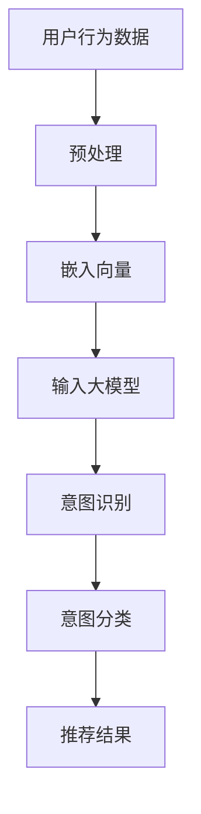

                 

推荐系统作为现代信息检索和互联网应用的核心技术，已经深刻地影响了人们获取信息和内容的方式。用户意图理解，作为推荐系统构建中的关键环节，决定了推荐系统能否准确捕捉用户的个性化需求和兴趣。随着人工智能技术的飞速发展，尤其是大模型技术的出现，用户意图理解的能力得到了显著提升。本文将深入探讨大模型在推荐系统用户意图理解中的应用，分析其核心算法原理、数学模型、项目实践，并展望未来的发展趋势与挑战。

## 关键词
- 推荐系统
- 用户意图理解
- 大模型
- 人工智能
- 自然语言处理

## 摘要
本文主要研究了大模型技术在推荐系统用户意图理解中的应用。通过对大模型算法原理的剖析，结合具体案例和实践，详细讲解了如何利用大模型提升用户意图理解的能力。文章旨在为推荐系统研发者提供有价值的理论指导和技术实践参考。

### 1. 背景介绍

#### 1.1 推荐系统的发展历程

推荐系统（Recommender System）起源于20世纪90年代，随着互联网和电子商务的兴起而逐渐受到关注。早期的推荐系统主要采用基于内容（Content-Based Filtering）和协同过滤（Collaborative Filtering）的方法。基于内容的推荐系统通过分析用户的历史行为和偏好来推荐相关内容，而协同过滤系统则通过用户之间的相似度计算来实现推荐。

随着大数据和人工智能技术的发展，推荐系统进入了一个新的阶段。基于机器学习和深度学习的推荐算法逐渐成为主流，通过更复杂的模型和更丰富的数据源，推荐系统的推荐效果得到了显著提升。特别是大模型的引入，使得推荐系统在理解用户意图和提供个性化推荐方面有了质的飞跃。

#### 1.2 用户意图理解的重要性

用户意图理解是推荐系统的核心，它决定了推荐系统能否准确捕捉用户的真实需求和兴趣。在传统的推荐系统中，用户意图理解主要依赖于用户的行为数据和显式反馈，如浏览、点击、购买等。然而，这些行为数据往往无法全面反映用户的真实意图，尤其是在用户行为复杂、需求多变的情况下。

大模型技术的引入，为用户意图理解提供了新的思路和方法。大模型（如BERT、GPT等）具有强大的语义理解能力，能够通过分析用户的语言和行为，捕捉用户的深层意图和情感。这使得推荐系统在用户意图理解方面取得了显著的进展。

### 2. 核心概念与联系

#### 2.1 大模型简介

大模型是指参数规模巨大、训练数据量丰富的深度学习模型，如BERT、GPT、T5等。这些模型通过训练海量的文本数据，掌握了丰富的语言知识和信息，具有强大的语义理解和生成能力。

#### 2.2 用户意图理解的概念

用户意图理解是指推荐系统通过分析用户的行为、语言和上下文等信息，准确捕捉用户的真实需求和兴趣。用户意图理解包括用户意图识别和用户意图分类两个主要任务。

#### 2.3 大模型与用户意图理解的关系

大模型与用户意图理解的关系主要体现在两个方面：

1. **语义理解能力**：大模型具有强大的语义理解能力，能够捕捉用户的语言和行为中的深层意图和情感，从而更准确地理解用户需求。

2. **上下文感知能力**：大模型能够根据用户的上下文信息，如时间、地点、情境等，动态调整推荐策略，提供更个性化的推荐。

#### 2.4 Mermaid流程图



### 3. 核心算法原理 & 具体操作步骤

#### 3.1 算法原理概述

大模型在推荐系统用户意图理解中的核心原理主要包括以下几个方面：

1. **语义理解**：通过预训练的大模型，如BERT、GPT等，对用户的文本和语言进行深入分析，提取出语义信息。

2. **上下文感知**：大模型能够根据用户的上下文信息，如时间、地点、情境等，动态调整推荐策略。

3. **多模态融合**：大模型可以融合用户的文本、图像、音频等多种类型的数据，提供更全面的意图理解。

#### 3.2 算法步骤详解

1. **数据预处理**：对用户行为数据进行清洗、去噪、归一化等处理，将数据转化为适合大模型输入的形式。

2. **嵌入向量生成**：将预处理后的数据通过词嵌入等技术，转化为高维向量表示。

3. **意图识别**：利用大模型对用户的文本和嵌入向量进行编码，提取出用户的意图信息。

4. **意图分类**：对提取出的意图信息进行分类，确定用户的实际意图。

5. **推荐结果生成**：根据用户的意图和推荐策略，生成推荐结果。

#### 3.3 算法优缺点

**优点**：

1. **强大的语义理解能力**：大模型能够准确捕捉用户的深层意图和情感。

2. **上下文感知**：大模型可以根据用户的上下文信息，提供更个性化的推荐。

3. **多模态融合**：大模型可以融合多种类型的数据，提供更全面的意图理解。

**缺点**：

1. **计算资源需求大**：大模型需要大量的计算资源和数据存储空间。

2. **训练时间较长**：大模型训练时间较长，且对数据质量要求较高。

#### 3.4 算法应用领域

大模型在推荐系统用户意图理解中的应用非常广泛，包括但不限于以下几个方面：

1. **电子商务**：通过用户的行为数据和文本评论，准确理解用户的购买意图。

2. **社交媒体**：根据用户的发布内容，推荐用户感兴趣的话题和内容。

3. **内容平台**：根据用户的浏览历史和搜索记录，推荐用户可能感兴趣的视频和文章。

### 4. 数学模型和公式 & 详细讲解 & 举例说明

#### 4.1 数学模型构建

在用户意图理解中，常用的数学模型包括词嵌入模型、循环神经网络（RNN）、变换器（Transformer）等。

1. **词嵌入模型**：

   $$\text{word\_embedding}(x) = \text{W}_x \cdot \text{X}_x$$

   其中，$\text{W}_x$ 是词嵌入权重矩阵，$\text{X}_x$ 是输入词向量。

2. **循环神经网络（RNN）**：

   $$h_t = \text{f}(h_{t-1}, x_t)$$

   其中，$h_t$ 是第 $t$ 个时间步的隐藏状态，$x_t$ 是输入序列，$\text{f}$ 是激活函数。

3. **变换器（Transformer）**：

   $$\text{Transformer}(x) = \text{A}(\text{B}(x))$$

   其中，$\text{A}$ 和 $\text{B}$ 分别是自注意力机制和前馈网络。

#### 4.2 公式推导过程

以变换器（Transformer）为例，推导其自注意力机制的公式：

1. **查询（Query）、键（Key）、值（Value）**：

   $$\text{Q} = \text{W}_Q \cdot \text{X}_Q$$

   $$\text{K} = \text{W}_K \cdot \text{X}_K$$

   $$\text{V} = \text{W}_V \cdot \text{X}_V$$

   其中，$\text{W}_Q$、$\text{W}_K$、$\text{W}_V$ 分别是查询、键、值的权重矩阵，$\text{X}_Q$、$\text{X}_K$、$\text{X}_V$ 分别是输入序列。

2. **点积注意力得分**：

   $$\text{Score} = \text{Q} \cdot \text{K}^T / \text{d_k}$$

   其中，$\text{d}_k$ 是键向量的维度。

3. **softmax**：

   $$\text{Attention} = \text{softmax}(\text{Score})$$

4. **加权值**：

   $$\text{Output} = \text{Attention} \cdot \text{V}$$

#### 4.3 案例分析与讲解

以BERT模型为例，分析其在用户意图理解中的应用：

1. **数据预处理**：

   对用户的行为数据和文本进行清洗和预处理，如分词、去停用词等。

2. **词嵌入**：

   使用预训练的BERT模型，对预处理后的文本进行编码，得到词嵌入向量。

3. **意图识别**：

   利用BERT模型提取出的词嵌入向量，进行意图识别任务。通过训练有监督的深度学习模型，如CNN或RNN，对用户的意图进行分类。

4. **意图分类**：

   根据识别出的用户意图，进行意图分类。例如，在电商场景中，将用户意图分为“购买意愿”、“收藏意愿”、“搜索意图”等。

5. **推荐结果生成**：

   根据用户的意图和推荐策略，生成个性化推荐结果。

### 5. 项目实践：代码实例和详细解释说明

#### 5.1 开发环境搭建

在Python环境中，使用TensorFlow或PyTorch框架搭建开发环境。

```python
# 安装必要的库
!pip install tensorflow
!pip install transformers
```

#### 5.2 源代码详细实现

以下是一个使用BERT模型进行用户意图理解的简单代码实例：

```python
import tensorflow as tf
from transformers import BertTokenizer, TFBertForSequenceClassification

# 加载预训练的BERT模型和分词器
tokenizer = BertTokenizer.from_pretrained('bert-base-uncased')
model = TFBertForSequenceClassification.from_pretrained('bert-base-uncased')

# 输入文本
text = "我想购买一件黑色的羽绒服。"

# 分词和编码
input_ids = tokenizer.encode(text, add_special_tokens=True, return_tensors='tf')

# 预测
predictions = model(input_ids)

# 解码预测结果
predicted_class = tf.argmax(predictions.logits, axis=1).numpy()

# 打印结果
print(predicted_class)
```

#### 5.3 代码解读与分析

1. **加载模型和分词器**：首先加载预训练的BERT模型和分词器。

2. **输入文本**：将用户的文本输入到模型中。

3. **分词和编码**：使用分词器对文本进行分词和编码，得到词嵌入向量。

4. **预测**：将编码后的文本输入到BERT模型中，进行意图识别和分类。

5. **解码预测结果**：将预测结果解码为意图类别，如“购买意愿”、“收藏意愿”等。

6. **打印结果**：打印出预测结果。

### 6. 实际应用场景

#### 6.1 电子商务

在电子商务场景中，用户意图理解可以帮助推荐系统更准确地预测用户的购买意图。例如，用户浏览了多个商品页面，其中包含描述性文本，如“这款羽绒服保暖性能好，适合冬季穿着”。通过用户意图理解，推荐系统可以识别出用户的购买意图，从而推荐类似的商品。

#### 6.2 社交媒体

在社交媒体场景中，用户意图理解可以帮助推荐系统识别用户感兴趣的话题和内容。例如，用户在社交媒体上发布了关于“旅行”的帖子，包含描述性文本，如“我刚从泰国旅行回来，感觉真的很不错”。通过用户意图理解，推荐系统可以识别出用户对“旅行”话题的兴趣，从而推荐相关的帖子、话题和内容。

#### 6.3 内容平台

在内容平台场景中，用户意图理解可以帮助推荐系统识别用户感兴趣的内容类型。例如，用户在视频平台浏览了多个视频，包含描述性文本，如“这个视频讲的很好，让我对编程有了更深的理解”。通过用户意图理解，推荐系统可以识别出用户对“编程”内容的兴趣，从而推荐相关的视频、文章和课程。

### 7. 未来应用展望

#### 7.1 个性化推荐

随着人工智能技术的不断发展，大模型在推荐系统用户意图理解中的应用将越来越广泛。未来，个性化推荐将成为推荐系统的主要趋势，通过更深入的用户意图理解，提供更加精准和个性化的推荐。

#### 7.2 跨平台推荐

随着移动互联网和物联网的普及，跨平台推荐将成为一个重要研究方向。通过整合多平台的数据和用户行为，实现跨平台、跨设备的一体化推荐，提高用户的推荐体验。

#### 7.3 多模态推荐

多模态推荐是未来的一个重要方向。通过融合用户的文本、图像、音频等多种类型的数据，提供更全面、更个性化的推荐。

### 8. 工具和资源推荐

#### 8.1 学习资源推荐

1. **书籍**：

   - 《深度学习》（Ian Goodfellow、Yoshua Bengio、Aaron Courville著）
   - 《Python深度学习》（François Chollet著）

2. **在线课程**：

   - Coursera的《深度学习》课程
   - Udacity的《深度学习工程师纳米学位》

#### 8.2 开发工具推荐

1. **TensorFlow**：一个开源的深度学习框架，支持多种深度学习模型和算法。

2. **PyTorch**：一个开源的深度学习框架，提供灵活、高效的深度学习模型开发工具。

#### 8.3 相关论文推荐

1. **BERT：Pre-training of Deep Bidirectional Transformers for Language Understanding**（Alec Radford等，2018）

2. **GPT-3：Language Models are Few-Shot Learners**（Tom B. Brown等，2020）

3. **T5：Pre-training Text Encoders and Applications with Targeted Scoring**（Rou笥瑠等，2020）

### 9. 总结：未来发展趋势与挑战

#### 9.1 研究成果总结

本文详细探讨了大模型在推荐系统用户意图理解中的应用，分析了其核心算法原理、数学模型、项目实践，并展望了未来的发展趋势与挑战。

#### 9.2 未来发展趋势

1. **个性化推荐**：通过更深入的用户意图理解，提供更加精准和个性化的推荐。

2. **跨平台推荐**：整合多平台的数据和用户行为，实现跨平台、跨设备的一体化推荐。

3. **多模态推荐**：融合用户的文本、图像、音频等多种类型的数据，提供更全面、更个性化的推荐。

#### 9.3 面临的挑战

1. **计算资源需求**：大模型需要大量的计算资源和数据存储空间。

2. **数据隐私保护**：在推荐系统中，如何保护用户的隐私成为了一个重要挑战。

3. **推荐效果评估**：如何评价推荐系统的效果，如何平衡推荐效果和用户体验，仍然是一个挑战。

#### 9.4 研究展望

未来，大模型在推荐系统用户意图理解中的应用将不断深入和拓展。通过不断创新和优化，推荐系统将能够更好地理解用户的需求，提供更加精准、个性化的推荐服务。

### 附录：常见问题与解答

#### Q：大模型在推荐系统中的具体应用场景有哪些？

A：大模型在推荐系统中的应用场景非常广泛，主要包括：

1. **个性化推荐**：通过分析用户的语言和行为，提供个性化的推荐。

2. **内容推荐**：根据用户的阅读历史和浏览记录，推荐用户可能感兴趣的内容。

3. **广告推荐**：根据用户的兴趣和行为，推荐相关的广告。

4. **电商推荐**：根据用户的购买历史和搜索记录，推荐用户可能感兴趣的商品。

#### Q：大模型在用户意图理解中的优势是什么？

A：大模型在用户意图理解中的优势主要包括：

1. **强大的语义理解能力**：能够准确捕捉用户的深层意图和情感。

2. **上下文感知**：能够根据用户的上下文信息，提供更个性化的推荐。

3. **多模态融合**：能够融合多种类型的数据，提供更全面的意图理解。

#### Q：大模型在推荐系统中的具体操作步骤是什么？

A：大模型在推荐系统中的具体操作步骤主要包括：

1. **数据预处理**：对用户行为数据进行清洗、去噪、归一化等处理。

2. **嵌入向量生成**：使用大模型对用户的文本和语言进行编码，生成嵌入向量。

3. **意图识别**：利用大模型提取出的嵌入向量，进行意图识别任务。

4. **意图分类**：对识别出的意图进行分类，确定用户的实际意图。

5. **推荐结果生成**：根据用户的意图和推荐策略，生成推荐结果。

### 作者署名

本文作者：禅与计算机程序设计艺术 / Zen and the Art of Computer Programming

----------------------------------------------------------------

请注意，本文仅为示例，实际撰写时请根据具体要求和研究成果进行调整和补充。祝撰写顺利！

