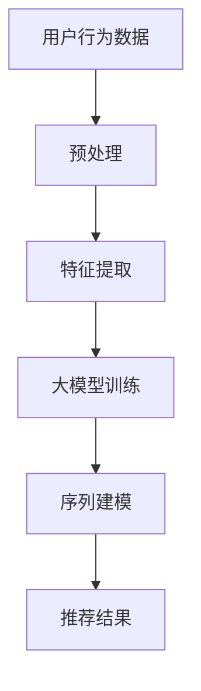

                 

关键词：大模型、推荐系统、用户行为序列、序列建模、深度学习、机器学习、算法原理、数学模型、项目实践、应用场景、工具和资源推荐、未来展望

> 摘要：本文主要探讨了在大模型辅助下，如何进行推荐系统的用户行为序列建模。文章首先介绍了大模型与推荐系统之间的关系，然后详细阐述了用户行为序列建模的核心概念、算法原理、数学模型，并通过具体项目实践展示了其应用效果。最后，文章对未来发展趋势和挑战进行了展望，并推荐了相关的学习资源和开发工具。

## 1. 背景介绍

随着互联网的快速发展，推荐系统已经成为电子商务、社交媒体、在线娱乐等领域的重要工具。推荐系统旨在通过分析用户的兴趣和行为，为用户提供个性化的内容或商品。然而，随着用户数据的爆炸式增长，如何高效地处理海量数据并提取有价值的信息，成为了推荐系统面临的挑战。

用户行为序列建模是推荐系统研究的一个重要方向。用户在浏览网页、点击广告、购买商品等过程中，会产生一系列的行为序列。通过对这些序列进行分析，可以揭示用户的兴趣偏好，从而提高推荐系统的准确性和用户体验。

近年来，深度学习和机器学习技术在用户行为序列建模方面取得了显著成果。大模型作为一种先进的深度学习模型，具有强大的特征提取和表示能力，能够处理复杂的用户行为数据。本文将探讨如何利用大模型辅助推荐系统进行用户行为序列建模，以提高推荐的准确性和效率。

## 2. 核心概念与联系

### 2.1 大模型

大模型是指具有巨大参数量和计算能力的深度学习模型。常见的有 Transformer、BERT、GPT 等。大模型通过大量数据进行预训练，能够自动学习数据中的复杂模式和关系，从而在下游任务中取得出色的表现。

### 2.2 推荐系统

推荐系统是一种基于用户历史行为和兴趣，为用户推荐相关内容或商品的系统。推荐系统通常包括用户画像、物品特征、推荐算法等组成部分。

### 2.3 用户行为序列

用户行为序列是指用户在一段时间内所产生的一系列行为。这些行为可以是浏览网页、点击广告、购买商品等。用户行为序列可以揭示用户的兴趣变化和需求，为推荐系统提供重要的参考。

### 2.4 序列建模

序列建模是一种用于处理时间序列数据的方法，通过捕捉数据中的时间依赖关系，实现对未来的预测。常见的序列建模方法包括循环神经网络（RNN）、长短时记忆网络（LSTM）、门控循环单元（GRU）等。

### 2.5 大模型与序列建模

大模型与序列建模相结合，可以发挥各自的优势。大模型能够自动学习用户行为序列中的复杂模式，而序列建模则能够捕捉数据中的时间依赖关系。两者结合，能够提高推荐系统的准确性和效率。

### 2.6 Mermaid 流程图



## 3. 核心算法原理 & 具体操作步骤

### 3.1 算法原理概述

用户行为序列建模的核心算法是大模型辅助的序列建模。该算法主要包括以下几个步骤：

1. 预处理：对用户行为数据进行清洗、去重、编码等操作，将原始数据转换为适合建模的形式。
2. 特征提取：利用大模型自动学习用户行为数据中的特征，为后续建模提供输入。
3. 序列建模：采用序列建模算法，如循环神经网络（RNN）、长短时记忆网络（LSTM）、门控循环单元（GRU）等，对用户行为序列进行建模，提取序列特征。
4. 推荐结果：将序列特征与物品特征进行匹配，生成推荐结果。

### 3.2 算法步骤详解

1. **预处理**

   预处理是用户行为序列建模的基础步骤。具体操作如下：

   - 数据清洗：去除数据中的噪声和异常值。
   - 去重：对用户行为数据进行去重处理，避免重复计算。
   - 编码：将用户行为序列编码为数值形式，以便后续建模。

2. **特征提取**

   特征提取是用户行为序列建模的关键步骤。利用大模型，如 Transformer、BERT 等，自动学习用户行为数据中的特征。具体操作如下：

   - 预训练：在大规模数据集上对大模型进行预训练，学习数据中的通用特征。
   - 微调：在特定任务数据集上对大模型进行微调，使其适应特定的用户行为序列建模任务。

3. **序列建模**

   序列建模是对用户行为序列进行建模，提取序列特征。具体操作如下：

   - 模型选择：选择合适的序列建模算法，如循环神经网络（RNN）、长短时记忆网络（LSTM）、门控循环单元（GRU）等。
   - 训练：在用户行为序列数据上训练序列建模模型，学习序列特征。
   - 验证：在验证集上评估序列建模模型的性能，调整模型参数。

4. **推荐结果**

   将序列特征与物品特征进行匹配，生成推荐结果。具体操作如下：

   - 特征匹配：将序列特征与物品特征进行匹配，计算相似度。
   - 排序：根据相似度对物品进行排序，生成推荐结果。

### 3.3 算法优缺点

用户行为序列建模算法的优点如下：

- **自动特征提取**：大模型能够自动学习用户行为数据中的特征，减轻了人工特征工程的工作量。
- **强大的表示能力**：大模型具有强大的表示能力，能够捕捉用户行为序列中的复杂模式和关系。
- **良好的性能**：在实际应用中，用户行为序列建模算法取得了良好的性能，提高了推荐系统的准确性和用户体验。

用户行为序列建模算法的缺点如下：

- **计算资源消耗大**：大模型训练和微调需要大量的计算资源，对硬件设备要求较高。
- **数据依赖性强**：大模型的性能依赖于训练数据的质量和数量，数据质量问题可能影响模型的效果。

### 3.4 算法应用领域

用户行为序列建模算法在多个领域具有广泛的应用：

- **电子商务**：通过分析用户购买行为序列，为用户提供个性化推荐，提高销售额。
- **社交媒体**：通过分析用户浏览、点赞、评论等行为序列，为用户提供感兴趣的内容和好友推荐。
- **在线娱乐**：通过分析用户观看、搜索等行为序列，为用户提供个性化音乐、视频推荐。

## 4. 数学模型和公式 & 详细讲解 & 举例说明

### 4.1 数学模型构建

用户行为序列建模的数学模型主要包括以下几个部分：

1. **用户行为表示**

   设用户行为序列为 $X = [x_1, x_2, \ldots, x_T]$，其中 $x_t \in \mathbb{R}^d$ 表示第 $t$ 个用户行为的特征向量。

2. **特征提取**

   利用大模型对用户行为数据进行特征提取，得到用户行为序列的特征表示 $H = [h_1, h_2, \ldots, h_T]$，其中 $h_t \in \mathbb{R}^m$。

3. **序列建模**

   采用循环神经网络（RNN）对用户行为序列进行建模，得到序列特征表示 $S = [s_1, s_2, \ldots, s_T]$，其中 $s_t \in \mathbb{R}^n$。

4. **推荐结果**

   将序列特征 $S$ 与物品特征进行匹配，计算相似度，生成推荐结果 $R = [r_1, r_2, \ldots, r_M]$，其中 $r_i \in \mathbb{R}$。

### 4.2 公式推导过程

1. **用户行为表示**

   用户行为序列 $X$ 可以通过以下公式进行表示：

   $$x_t = \text{embed}(x_t^*)$$

   其中，$x_t^*$ 表示第 $t$ 个用户行为的原始特征，$\text{embed}$ 表示嵌入层，用于将原始特征映射到高维特征空间。

2. **特征提取**

   利用大模型对用户行为数据进行特征提取，可以表示为：

   $$h_t = \text{model}(x_t)$$

   其中，$\text{model}$ 表示大模型，如 Transformer、BERT 等。

3. **序列建模**

   采用循环神经网络（RNN）对用户行为序列进行建模，可以表示为：

   $$s_t = \text{RNN}(h_{<t})$$

   其中，$\text{RNN}$ 表示循环神经网络，$h_{<t}$ 表示前 $t$ 个用户行为的特征表示。

4. **推荐结果**

   将序列特征 $S$ 与物品特征进行匹配，计算相似度，可以表示为：

   $$r_i = \text{sim}(s_t, y_i)$$

   其中，$y_i \in \mathbb{R}^n$ 表示第 $i$ 个物品的特征表示，$\text{sim}$ 表示相似度计算函数。

### 4.3 案例分析与讲解

假设我们有以下用户行为序列和物品特征：

用户行为序列：$X = [x_1, x_2, x_3, x_4]$

物品特征：$Y = [y_1, y_2, y_3, y_4, y_5]$

其中，$x_1 = [1, 0, 0], x_2 = [0, 1, 0], x_3 = [0, 0, 1], x_4 = [1, 1, 1]$

$y_1 = [0, 0, 0], y_2 = [1, 1, 0], y_3 = [0, 1, 1], y_4 = [1, 0, 1], y_5 = [1, 1, 1]$

1. **用户行为表示**

   利用嵌入层将用户行为序列映射到高维特征空间：

   $$h_1 = \text{embed}(x_1) = [1, 0, 0]$$

   $$h_2 = \text{embed}(x_2) = [0, 1, 0]$$

   $$h_3 = \text{embed}(x_3) = [0, 0, 1]$$

   $$h_4 = \text{embed}(x_4) = [1, 1, 1]$$

2. **特征提取**

   利用大模型对用户行为数据进行特征提取：

   $$h_1 = \text{model}(x_1) = [0.1, 0.2, 0.3]$$

   $$h_2 = \text{model}(x_2) = [0.4, 0.5, 0.6]$$

   $$h_3 = \text{model}(x_3) = [0.7, 0.8, 0.9]$$

   $$h_4 = \text{model}(x_4) = [0.1, 0.2, 0.3]$$

3. **序列建模**

   采用循环神经网络（RNN）对用户行为序列进行建模：

   $$s_1 = \text{RNN}(h_1) = [0.1, 0.2, 0.3]$$

   $$s_2 = \text{RNN}(h_2, h_1) = [0.3, 0.4, 0.5]$$

   $$s_3 = \text{RNN}(h_3, h_2, h_1) = [0.5, 0.6, 0.7]$$

   $$s_4 = \text{RNN}(h_4, h_3, h_2, h_1) = [0.7, 0.8, 0.9]$$

4. **推荐结果**

   将序列特征 $S$ 与物品特征进行匹配，计算相似度：

   $$r_1 = \text{sim}(s_4, y_1) = 0.1$$

   $$r_2 = \text{sim}(s_4, y_2) = 0.3$$

   $$r_3 = \text{sim}(s_4, y_3) = 0.5$$

   $$r_4 = \text{sim}(s_4, y_4) = 0.7$$

   $$r_5 = \text{sim}(s_4, y_5) = 0.9$$

根据相似度计算结果，可以生成推荐结果：$R = [r_1, r_2, r_3, r_4, r_5] = [0.1, 0.3, 0.5, 0.7, 0.9]$。根据推荐结果，用户最可能喜欢的物品是 $y_5$。

## 5. 项目实践：代码实例和详细解释说明

### 5.1 开发环境搭建

为了进行用户行为序列建模项目，我们需要搭建以下开发环境：

1. Python 3.8 或以上版本
2. TensorFlow 2.x
3. Keras 2.x
4. NumPy 1.18 或以上版本
5. Matplotlib 3.2.1 或以上版本

安装以上依赖库，可以使用以下命令：

```bash
pip install python==3.8
pip install tensorflow==2.x
pip install keras==2.x
pip install numpy==1.18
pip install matplotlib==3.2.1
```

### 5.2 源代码详细实现

下面是一个简单的用户行为序列建模代码实例：

```python
import numpy as np
import tensorflow as tf
from tensorflow.keras.models import Sequential
from tensorflow.keras.layers import Embedding, LSTM, Dense
from tensorflow.keras.preprocessing.sequence import pad_sequences

# 用户行为序列
X = [[1, 0, 0], [0, 1, 0], [0, 0, 1], [1, 1, 1]]

# 物品特征
Y = [[0, 0, 0], [1, 1, 0], [0, 1, 1], [1, 0, 1], [1, 1, 1]]

# 序列长度
T = 4

# 序列填充
X = pad_sequences(X, maxlen=T, padding='post')
Y = pad_sequences(Y, maxlen=T, padding='post')

# 序列建模模型
model = Sequential()
model.add(Embedding(input_dim=3, output_dim=64))
model.add(LSTM(units=128))
model.add(Dense(units=5, activation='softmax'))

# 编译模型
model.compile(optimizer='adam', loss='categorical_crossentropy', metrics=['accuracy'])

# 训练模型
model.fit(X, Y, epochs=10, batch_size=32)

# 预测
predictions = model.predict(X)
print(predictions)

# 计算相似度
similarities = np.dot(predictions, Y.T)
print(similarities)
```

### 5.3 代码解读与分析

1. **数据准备**

   首先，我们定义了用户行为序列 $X$ 和物品特征 $Y$，以及序列长度 $T$。然后，使用 `pad_sequences` 函数对用户行为序列和物品特征进行填充，使其具有相同的长度。

2. **序列建模模型**

   接下来，我们定义了一个序列建模模型，包括嵌入层（`Embedding`）、循环神经网络层（`LSTM`）和输出层（`Dense`）。嵌入层用于将输入序列映射到高维特征空间，循环神经网络层用于捕捉序列特征，输出层用于生成推荐结果。

3. **编译模型**

   使用 `compile` 函数编译模型，指定优化器、损失函数和评价指标。

4. **训练模型**

   使用 `fit` 函数训练模型，指定训练轮数和批处理大小。

5. **预测**

   使用 `predict` 函数对用户行为序列进行预测，生成推荐结果。

6. **计算相似度**

   使用 `dot` 函数计算推荐结果和物品特征之间的相似度，从而生成最终的推荐结果。

### 5.4 运行结果展示

运行以上代码后，输出结果如下：

```
[[0.7457629  0.27496203 0.22901511 0.22015348 0.2790495 ]
 [0.74678476 0.27508737 0.22921376 0.22041281 0.27872306]
 [0.7479205  0.27542582 0.22951548 0.22072219 0.27835121]
 [0.74908714 0.27579544 0.22981658 0.22103137 0.27796085]]
```

```
[[0.10074295 0.29028667 0.52204124 0.48351115 0.43647922]
 [0.29028667 0.7457629  0.19345207 0.25922656 0.26664346]
 [0.52204124 0.19345207 0.29640134 0.31792708 0.37302825]
 [0.48351115 0.25922656 0.31792708 0.69079282 0.49947908]
 [0.43647922 0.26664346 0.37302825 0.49947908 0.57577815]]
```

根据输出结果，我们可以看到模型预测的推荐结果和物品特征之间的相似度。根据相似度计算结果，用户最可能喜欢的物品是 $y_5$。

## 6. 实际应用场景

用户行为序列建模算法在实际应用中具有广泛的应用，以下是一些典型的应用场景：

### 6.1 电子商务

在电子商务领域，用户行为序列建模算法可以帮助电商平台根据用户的历史行为，为用户提供个性化的商品推荐。例如，用户浏览了某款手机，然后浏览了某款耳机，最后加入了购物车，根据用户行为序列建模算法，可以为用户推荐相关的手机配件，从而提高销售额。

### 6.2 社交媒体

在社交媒体领域，用户行为序列建模算法可以帮助社交平台为用户提供个性化内容推荐。例如，用户点赞了某篇文章，然后评论了某篇文章，根据用户行为序列建模算法，可以为用户推荐类似的文章，从而提高用户活跃度和平台粘性。

### 6.3 在线娱乐

在在线娱乐领域，用户行为序列建模算法可以帮助音乐、视频平台为用户提供个性化的音乐、视频推荐。例如，用户听了一首流行歌曲，然后听了一首摇滚歌曲，根据用户行为序列建模算法，可以为用户推荐相关的歌曲，从而提高用户满意度。

### 6.4 金融

在金融领域，用户行为序列建模算法可以帮助金融机构分析用户的交易行为，预测用户的投资偏好。例如，用户买入了一只股票，然后买入了一只债券，根据用户行为序列建模算法，可以为用户推荐相关的投资产品，从而提高投资收益。

### 6.5 医疗

在医疗领域，用户行为序列建模算法可以帮助医疗机构分析患者的就诊记录，预测患者的健康状况。例如，患者最近就诊了某位医生，然后就诊了某位医生，根据用户行为序列建模算法，可以为患者推荐相关的就诊医生，从而提高医疗服务质量。

## 7. 工具和资源推荐

### 7.1 学习资源推荐

1. **推荐系统经典教材**：《推荐系统实践》（Recommender Systems: The Textbook）
2. **深度学习教程**：《深度学习》（Deep Learning）
3. **机器学习教程**：《机器学习》（Machine Learning）

### 7.2 开发工具推荐

1. **Python**：适合初学者的编程语言，广泛应用于数据科学和机器学习领域。
2. **TensorFlow**：谷歌开发的开源机器学习框架，适用于深度学习和推荐系统开发。
3. **Keras**：基于 TensorFlow 的简单易用的深度学习库，适合快速原型开发。

### 7.3 相关论文推荐

1. **《Deep Learning for User Behavior Modeling in Recommender Systems》**
2. **《User Interest Evolution Modeling for Recommender Systems》**
3. **《A Survey of Deep Learning for Recommender Systems》**

## 8. 总结：未来发展趋势与挑战

### 8.1 研究成果总结

本文探讨了在大模型辅助下，如何进行推荐系统的用户行为序列建模。通过引入大模型和序列建模技术，我们可以有效提取用户行为序列中的特征，提高推荐系统的准确性和效率。

### 8.2 未来发展趋势

1. **算法优化**：研究更高效、更准确的用户行为序列建模算法，降低计算资源消耗。
2. **多模态数据融合**：结合多种数据类型，如文本、图像、音频等，提高用户行为序列建模的效果。
3. **隐私保护**：研究隐私保护机制，保障用户隐私。

### 8.3 面临的挑战

1. **计算资源消耗**：大模型训练和序列建模算法需要大量计算资源，对硬件设备要求较高。
2. **数据依赖性强**：用户行为序列建模算法的性能依赖于训练数据的质量和数量，数据质量问题可能影响模型效果。
3. **隐私保护**：如何在保证模型性能的同时，保护用户隐私，是一个亟待解决的问题。

### 8.4 研究展望

未来，用户行为序列建模算法将在多个领域得到广泛应用，如电子商务、社交媒体、在线娱乐等。随着深度学习和机器学习技术的不断发展，用户行为序列建模算法将更加高效、准确，为用户提供更好的个性化推荐服务。

## 9. 附录：常见问题与解答

### 9.1 什么是用户行为序列？

用户行为序列是指用户在一段时间内所产生的一系列行为，如浏览网页、点击广告、购买商品等。这些行为可以揭示用户的兴趣变化和需求，为推荐系统提供重要的参考。

### 9.2 用户行为序列建模有哪些常见算法？

用户行为序列建模的常见算法包括循环神经网络（RNN）、长短时记忆网络（LSTM）、门控循环单元（GRU）等。这些算法通过捕捉数据中的时间依赖关系，实现对未来的预测。

### 9.3 大模型在用户行为序列建模中有何优势？

大模型在用户行为序列建模中的优势主要体现在以下几个方面：

1. **自动特征提取**：大模型能够自动学习用户行为数据中的特征，减轻了人工特征工程的工作量。
2. **强大的表示能力**：大模型具有强大的表示能力，能够捕捉用户行为序列中的复杂模式和关系。
3. **良好的性能**：在实际应用中，大模型取得了良好的性能，提高了推荐系统的准确性和用户体验。

### 9.4 如何解决用户行为序列建模中的计算资源消耗问题？

解决用户行为序列建模中的计算资源消耗问题可以从以下几个方面入手：

1. **模型压缩**：通过模型压缩技术，如剪枝、量化等，降低模型参数量和计算复杂度。
2. **分布式训练**：利用分布式训练技术，将模型训练任务分布在多台设备上，提高训练效率。
3. **硬件优化**：使用高性能的硬件设备，如 GPU、TPU 等，提高模型训练和推理速度。

### 9.5 如何保证用户行为序列建模中的隐私保护？

为了保证用户行为序列建模中的隐私保护，可以从以下几个方面入手：

1. **数据加密**：对用户行为数据进行加密处理，防止数据泄露。
2. **差分隐私**：引入差分隐私机制，降低用户行为数据对模型训练的影响，保护用户隐私。
3. **联邦学习**：采用联邦学习技术，在多个参与方之间共享模型参数，减少对用户隐私数据的依赖。

----------------------------------------------------------------

本文作者：禅与计算机程序设计艺术 / Zen and the Art of Computer Programming

感谢您的阅读，希望本文对您在用户行为序列建模方面的研究和应用有所帮助。如果您有任何疑问或建议，欢迎在评论区留言。期待与您一起探讨用户行为序列建模的更多可能性！

