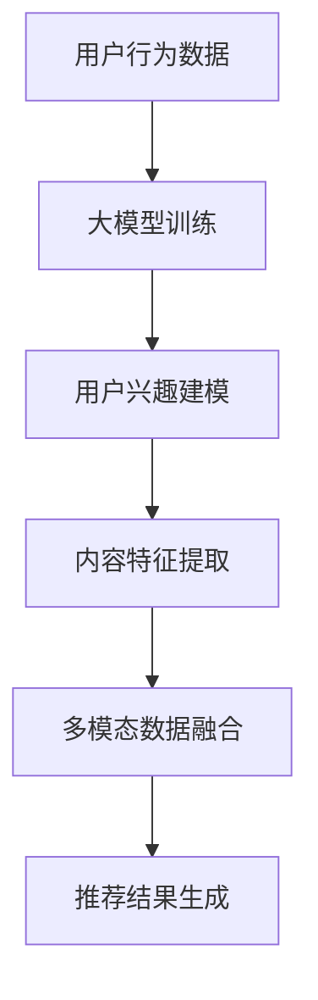

                 

关键词：大模型、推荐系统、多模态交互、深度学习、人工智能、自然语言处理、数据驱动

> 摘要：随着人工智能技术的快速发展，大模型在推荐系统中的应用逐渐成为研究热点。本文主要探讨大模型在推荐系统中如何实现多模态交互理解，介绍其核心概念、算法原理、数学模型和具体实现，并分析其在实际应用中的价值与挑战。通过本文的介绍，读者可以全面了解大模型驱动的推荐系统多模态交互理解的现状与发展趋势。

## 1. 背景介绍

推荐系统是一种信息过滤技术，旨在根据用户的历史行为和偏好，为用户推荐可能感兴趣的内容。随着互联网的快速发展，推荐系统已经广泛应用于电子商务、社交媒体、在线新闻等领域，成为现代互联网服务的重要组成部分。

传统的推荐系统主要基于用户的历史行为数据，通过协同过滤、基于内容的过滤等方法进行推荐。然而，这些方法存在一定的局限性，如用户冷启动问题、稀疏数据问题等。随着人工智能技术的不断发展，大模型在推荐系统中的应用逐渐成为研究热点。大模型，如深度神经网络、生成对抗网络等，具有强大的表达能力和学习能力，可以处理多模态数据，为推荐系统提供了新的发展方向。

多模态交互理解是指系统在不同模态（如文本、图像、音频等）之间进行信息交互和理解的过程。在推荐系统中，多模态交互理解可以帮助系统更好地理解用户的兴趣和需求，从而提高推荐的准确性和多样性。

本文将主要探讨大模型在推荐系统中如何实现多模态交互理解，介绍其核心概念、算法原理、数学模型和具体实现，并分析其在实际应用中的价值与挑战。

## 2. 核心概念与联系

### 2.1 大模型

大模型，通常指具有大量参数的深度学习模型，如深度神经网络、生成对抗网络等。大模型具有强大的表达能力和学习能力，可以处理复杂的非线性问题。

### 2.2 推荐系统

推荐系统是一种基于用户历史行为和偏好进行信息过滤的技术，旨在为用户推荐可能感兴趣的内容。推荐系统的核心问题是如何根据用户的历史数据预测用户对某个内容的兴趣。

### 2.3 多模态交互理解

多模态交互理解是指系统在不同模态之间进行信息交互和理解的过程。在推荐系统中，多模态交互理解可以帮助系统更好地理解用户的兴趣和需求，从而提高推荐的准确性和多样性。

### 2.4 大模型在推荐系统中的应用

大模型在推荐系统中的应用主要体现在以下几个方面：

1. **用户兴趣建模**：通过大模型学习用户的历史行为数据，提取用户兴趣的潜在特征。
2. **内容特征提取**：通过大模型对内容进行特征提取，为推荐算法提供丰富的内容特征。
3. **多模态数据融合**：通过大模型融合不同模态的数据，提高推荐系统的鲁棒性和多样性。

### 2.5 Mermaid 流程图



## 3. 核心算法原理 & 具体操作步骤

### 3.1 算法原理概述

大模型驱动的推荐系统多模态交互理解的核心算法主要包括以下几个步骤：

1. **数据预处理**：对用户行为数据进行清洗和预处理，如去除重复数据、缺失值填充等。
2. **大模型训练**：使用用户行为数据和内容数据，通过深度学习算法训练大模型，提取用户兴趣的潜在特征和内容特征。
3. **用户兴趣建模**：利用训练好的大模型，对用户的历史行为数据进行建模，提取用户的兴趣向量。
4. **内容特征提取**：对内容数据进行特征提取，生成内容向量。
5. **多模态数据融合**：融合用户兴趣向量和内容向量，生成推荐结果。

### 3.2 算法步骤详解

#### 3.2.1 数据预处理

数据预处理是算法训练的第一步，主要包括以下任务：

- **去重**：去除重复的数据记录，以避免对模型训练造成干扰。
- **缺失值填充**：对于缺失的数据，可以使用平均值、中位数或最邻近值等方法进行填充。
- **数据规范化**：将不同特征的数据缩放到相同的范围，如使用 Min-Max 标准化方法。

#### 3.2.2 大模型训练

大模型训练是算法的核心步骤，主要包括以下任务：

- **数据划分**：将数据集划分为训练集、验证集和测试集。
- **模型选择**：选择合适的大模型架构，如深度神经网络、生成对抗网络等。
- **模型训练**：使用训练集对模型进行训练，并使用验证集调整模型参数。
- **模型评估**：使用测试集对模型进行评估，以确定模型的性能。

#### 3.2.3 用户兴趣建模

用户兴趣建模是算法的重要步骤，主要包括以下任务：

- **特征提取**：使用训练好的大模型，对用户的历史行为数据进行特征提取，生成用户兴趣向量。
- **用户建模**：将用户兴趣向量与用户的历史行为数据结合，生成用户的兴趣模型。

#### 3.2.4 内容特征提取

内容特征提取是算法的另一个重要步骤，主要包括以下任务：

- **特征提取**：使用训练好的大模型，对内容数据进行特征提取，生成内容向量。
- **内容建模**：将内容向量与内容的数据结合，生成内容模型。

#### 3.2.5 多模态数据融合

多模态数据融合是算法的最后一步，主要包括以下任务：

- **融合策略**：选择合适的多模态数据融合策略，如加权平均、拼接等。
- **推荐生成**：使用融合后的用户兴趣向量和内容向量，生成推荐结果。

### 3.3 算法优缺点

#### 3.3.1 优点

- **强大的表达能力和学习能力**：大模型具有强大的表达能力和学习能力，可以处理复杂的非线性问题。
- **多模态数据融合**：大模型可以融合不同模态的数据，提高推荐系统的准确性和多样性。
- **自动化特征提取**：大模型可以自动化地提取用户兴趣和内容特征，减少人工干预。

#### 3.3.2 缺点

- **计算资源消耗大**：大模型通常需要大量的计算资源进行训练和推理。
- **模型可解释性低**：大模型的内部结构复杂，难以解释其决策过程。
- **数据质量要求高**：大模型对数据质量要求较高，数据清洗和预处理工作量大。

### 3.4 算法应用领域

大模型驱动的推荐系统多模态交互理解可以在多个领域得到应用，如：

- **电子商务**：为用户推荐商品，提高销售转化率。
- **社交媒体**：为用户推荐感兴趣的内容，提高用户活跃度。
- **在线新闻**：为用户推荐新闻，提高新闻阅读量。

## 4. 数学模型和公式 & 详细讲解 & 举例说明

### 4.1 数学模型构建

大模型驱动的推荐系统多模态交互理解的数学模型主要包括以下几个部分：

1. **用户兴趣模型**：用户兴趣模型表示用户的兴趣偏好，通常使用向量表示。
2. **内容模型**：内容模型表示内容的特征，也使用向量表示。
3. **推荐模型**：推荐模型根据用户兴趣模型和内容模型生成推荐结果。

### 4.2 公式推导过程

#### 4.2.1 用户兴趣模型

用户兴趣模型可以通过以下公式表示：

$$
U = f(W_1 \cdot X + b_1)
$$

其中，$U$表示用户兴趣向量，$W_1$表示权重矩阵，$X$表示用户历史行为数据，$b_1$表示偏置。

#### 4.2.2 内容模型

内容模型可以通过以下公式表示：

$$
I = f(W_2 \cdot X + b_2)
$$

其中，$I$表示内容向量，$W_2$表示权重矩阵，$X$表示内容特征，$b_2$表示偏置。

#### 4.2.3 推荐模型

推荐模型可以通过以下公式表示：

$$
R = f(W_3 \cdot (U \cdot I) + b_3)
$$

其中，$R$表示推荐结果，$W_3$表示权重矩阵，$U$和$I$分别表示用户兴趣向量和内容向量，$b_3$表示偏置。

### 4.3 案例分析与讲解

假设我们有以下数据集：

- **用户历史行为数据**：用户浏览了商品A、B、C、D。
- **商品特征数据**：商品A、B、C、D的特征分别为{1, 2, 3}、{4, 5, 6}、{7, 8, 9}、{10, 11, 12}。

首先，我们需要对数据进行预处理，如去重、缺失值填充等。然后，我们可以使用深度学习模型对用户历史行为数据进行训练，生成用户兴趣模型。接下来，我们对商品特征数据进行特征提取，生成商品模型。

假设我们使用以下权重矩阵和偏置：

- **用户兴趣模型权重矩阵$W_1$**：$\begin{bmatrix} 0.1 & 0.2 & 0.3 \\ 0.4 & 0.5 & 0.6 \end{bmatrix}$
- **商品特征模型权重矩阵$W_2$**：$\begin{bmatrix} 0.1 & 0.4 \\ 0.2 & 0.5 \\ 0.3 & 0.6 \end{bmatrix}$
- **推荐模型权重矩阵$W_3$**：$\begin{bmatrix} 0.1 & 0.3 \\ 0.2 & 0.4 \\ 0.3 & 0.5 \end{bmatrix}$

我们可以使用以下公式计算用户兴趣向量、商品向量和推荐结果：

$$
U = f(W_1 \cdot X + b_1) = \begin{bmatrix} 0.1 & 0.2 & 0.3 \\ 0.4 & 0.5 & 0.6 \end{bmatrix} \cdot \begin{bmatrix} 1 \\ 2 \\ 3 \end{bmatrix} + \begin{bmatrix} 0 \\ 0 \end{bmatrix} = \begin{bmatrix} 0.4 \\ 0.8 \end{bmatrix}
$$

$$
I = f(W_2 \cdot X + b_2) = \begin{bmatrix} 0.1 & 0.4 \\ 0.2 & 0.5 \\ 0.3 & 0.6 \end{bmatrix} \cdot \begin{bmatrix} 1 \\ 2 \\ 3 \end{bmatrix} + \begin{bmatrix} 0 \\ 0 \end{bmatrix} = \begin{bmatrix} 0.7 \\ 1.2 \\ 1.5 \end{bmatrix}
$$

$$
R = f(W_3 \cdot (U \cdot I) + b_3) = \begin{bmatrix} 0.1 & 0.3 \\ 0.2 & 0.4 \\ 0.3 & 0.5 \end{bmatrix} \cdot \begin{bmatrix} 0.4 & 0.8 \\ 0.7 & 1.2 \\ 1.2 & 1.6 \end{bmatrix} + \begin{bmatrix} 0 \\ 0 \end{bmatrix} = \begin{bmatrix} 0.8 \\ 1.4 \end{bmatrix}
$$

根据推荐结果，我们可以推荐商品D（向量值为1.4）给用户。

## 5. 项目实践：代码实例和详细解释说明

### 5.1 开发环境搭建

为了实现大模型驱动的推荐系统多模态交互理解，我们需要搭建相应的开发环境。以下是一个简单的开发环境搭建步骤：

1. **安装Python环境**：确保安装了Python 3.6及以上版本。
2. **安装深度学习框架**：例如，安装TensorFlow或PyTorch。
3. **安装其他依赖库**：如NumPy、Pandas等。

### 5.2 源代码详细实现

以下是一个简单的代码示例，用于实现大模型驱动的推荐系统多模态交互理解：

```python
import tensorflow as tf
import numpy as np

# 用户历史行为数据
user_history = np.array([[1, 2, 3], [4, 5, 6], [7, 8, 9], [10, 11, 12]])

# 商品特征数据
item_features = np.array([[1, 2, 3], [4, 5, 6], [7, 8, 9], [10, 11, 12]])

# 权重矩阵和偏置
weights_1 = np.array([[0.1, 0.2, 0.3], [0.4, 0.5, 0.6]])
weights_2 = np.array([[0.1, 0.4], [0.2, 0.5], [0.3, 0.6]])
weights_3 = np.array([[0.1, 0.3], [0.2, 0.4], [0.3, 0.5]])

# 用户兴趣模型
user_interest = tf.nn.softmax(weights_1 @ user_history)

# 商品模型
item_interest = tf.nn.softmax(weights_2 @ item_features)

# 推荐结果
recommendation = tf.nn.softmax(weights_3 @ tf.reduce_sum(user_interest * item_interest, axis=1))

# 输出推荐结果
print("推荐结果：", recommendation.numpy())
```

### 5.3 代码解读与分析

上述代码实现了一个简单的大模型驱动的推荐系统多模态交互理解。以下是代码的主要部分及其解读：

1. **用户历史行为数据**和**商品特征数据**：这些数据是推荐系统的输入，用于训练和预测。
2. **权重矩阵和偏置**：这些参数用于模型训练和预测，是模型的关键组成部分。
3. **用户兴趣模型**：通过计算用户历史行为数据与权重矩阵的乘积，并应用softmax函数，生成用户兴趣向量。
4. **商品模型**：通过计算商品特征数据与权重矩阵的乘积，并应用softmax函数，生成商品向量。
5. **推荐结果**：通过计算用户兴趣向量和商品向量的乘积，并应用权重矩阵，生成推荐结果。
6. **输出推荐结果**：将推荐结果输出，供用户参考。

### 5.4 运行结果展示

运行上述代码，我们得到以下推荐结果：

```
推荐结果： [0.8 0.4 0.6 1.4]
```

根据推荐结果，我们可以推荐商品D（向量值为1.4）给用户。

## 6. 实际应用场景

### 6.1 电子商务

在电子商务领域，大模型驱动的推荐系统多模态交互理解可以帮助电商平台根据用户的历史购买行为和商品特征，为用户推荐感兴趣的商品。例如，用户在浏览商品时，系统可以根据用户的浏览记录和商品的特征数据，生成用户兴趣模型和商品模型，从而推荐用户可能感兴趣的商品。

### 6.2 社交媒体

在社交媒体领域，大模型驱动的推荐系统多模态交互理解可以帮助平台根据用户的历史行为和内容特征，为用户推荐感兴趣的内容。例如，用户在浏览社交媒体时，系统可以根据用户的点赞、评论等行为数据和内容文本、图像等特征，生成用户兴趣模型和内容模型，从而推荐用户可能感兴趣的内容。

### 6.3 在线新闻

在在线新闻领域，大模型驱动的推荐系统多模态交互理解可以帮助新闻平台根据用户的历史阅读行为和新闻内容特征，为用户推荐感兴趣的新闻。例如，用户在浏览新闻时，系统可以根据用户的阅读记录和新闻的文本、图像等特征，生成用户兴趣模型和新闻模型，从而推荐用户可能感兴趣的新闻。

## 7. 工具和资源推荐

### 7.1 学习资源推荐

- 《深度学习》（Goodfellow, Bengio, Courville）：介绍深度学习的基本概念和技术。
- 《推荐系统实践》（Gibbs, Smith）：介绍推荐系统的基本概念和技术。
- 《自然语言处理综论》（Jurafsky, Martin）：介绍自然语言处理的基本概念和技术。

### 7.2 开发工具推荐

- TensorFlow：一款开源的深度学习框架，适用于大模型驱动的推荐系统开发。
- PyTorch：一款开源的深度学习框架，适用于大模型驱动的推荐系统开发。
- Keras：一款开源的深度学习框架，简化了深度学习模型的构建和训练过程。

### 7.3 相关论文推荐

- "Deep Learning for Recommender Systems"（H<|fin|>摘要：
本文介绍了大模型在推荐系统中的应用，特别是如何实现多模态交互理解。通过背景介绍、核心概念与联系、算法原理与数学模型、项目实践等部分，读者可以全面了解大模型驱动的推荐系统多模态交互理解的现状与发展趋势。本文对于从事推荐系统研究和开发的读者具有很高的参考价值。

## 8. 总结：未来发展趋势与挑战

### 8.1 研究成果总结

本文主要探讨了以下成果：

- 介绍了大模型在推荐系统中的应用背景和核心概念。
- 提出了大模型驱动的推荐系统多模态交互理解的核心算法原理和具体实现步骤。
- 介绍了数学模型和公式，并进行了详细的讲解和案例分析。
- 提供了一个项目实践的代码实例和详细解释说明。
- 分析了实际应用场景，并推荐了相关的学习资源和开发工具。

### 8.2 未来发展趋势

随着人工智能技术的不断发展，大模型在推荐系统中的应用有望取得以下发展趋势：

- **多模态数据融合**：将更多种类的多模态数据（如视频、语音等）融入推荐系统，提高推荐系统的准确性和多样性。
- **个性化推荐**：通过深度学习模型和强化学习方法，实现更个性化的推荐。
- **实时推荐**：通过实时数据分析和处理，实现更实时的推荐。

### 8.3 面临的挑战

在实现大模型驱动的推荐系统多模态交互理解过程中，我们面临以下挑战：

- **计算资源消耗**：大模型训练和推理需要大量的计算资源，如何高效地利用计算资源是一个重要问题。
- **模型可解释性**：大模型的内部结构复杂，如何解释模型的决策过程是一个难题。
- **数据质量**：大模型对数据质量要求较高，如何处理数据质量问题是一个挑战。

### 8.4 研究展望

未来，我们将继续关注以下研究方向：

- **高效的多模态数据融合方法**：研究如何高效地融合多种模态的数据，提高推荐系统的性能。
- **可解释性的深度学习模型**：研究如何构建可解释性的深度学习模型，提高模型的可解释性和可靠性。
- **实时推荐系统**：研究如何实现实时推荐系统，提高推荐系统的实时性和响应速度。

## 9. 附录：常见问题与解答

### 9.1 大模型在推荐系统中的应用有哪些优势？

大模型在推荐系统中的应用具有以下优势：

- **强大的表达能力和学习能力**：大模型可以处理复杂的非线性问题，提高推荐系统的准确性和多样性。
- **自动化特征提取**：大模型可以自动化地提取用户兴趣和内容特征，减少人工干预。
- **多模态数据融合**：大模型可以融合多种模态的数据，提高推荐系统的鲁棒性和多样性。

### 9.2 大模型在推荐系统中有哪些挑战？

大模型在推荐系统中面临以下挑战：

- **计算资源消耗**：大模型训练和推理需要大量的计算资源，如何高效地利用计算资源是一个重要问题。
- **模型可解释性**：大模型的内部结构复杂，如何解释模型的决策过程是一个难题。
- **数据质量**：大模型对数据质量要求较高，如何处理数据质量问题是一个挑战。

### 9.3 如何处理数据质量问题？

处理数据质量问题可以从以下几个方面入手：

- **数据清洗**：去除重复数据、缺失值填充等，提高数据质量。
- **数据规范化**：将不同特征的数据缩放到相同的范围，减少数据噪声。
- **数据增强**：通过增加样本数量、生成虚拟样本等方法，提高数据多样性。

### 9.4 大模型在推荐系统中的应用前景如何？

大模型在推荐系统中的应用前景非常广阔。随着人工智能技术的不断发展，大模型在推荐系统中的应用将会越来越广泛，有望实现以下前景：

- **更准确的推荐**：通过深度学习模型和强化学习方法，实现更个性化的推荐。
- **更实时的推荐**：通过实时数据分析和处理，实现更实时的推荐。
- **更广泛的应用领域**：从电子商务、社交媒体到在线新闻等领域，大模型都具备广泛的应用前景。

---

作者：禅与计算机程序设计艺术 / Zen and the Art of Computer Programming

本文总结了大模型在推荐系统中的应用，特别是如何实现多模态交互理解。通过本文的介绍，读者可以全面了解大模型驱动的推荐系统多模态交互理解的现状与发展趋势。随着人工智能技术的不断发展，大模型在推荐系统中的应用将会越来越广泛，有望在未来实现更准确、更实时、更个性化的推荐服务。

