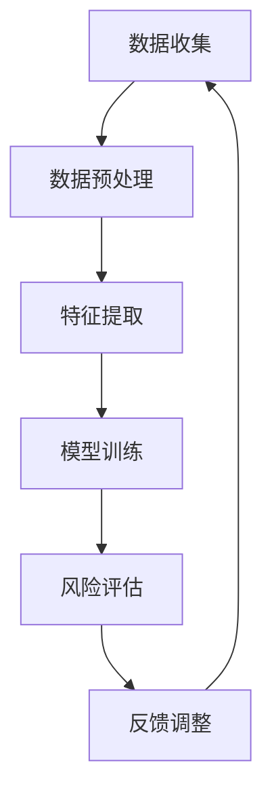

                 

 关键词：大模型，智能风险评估，保险科技，机器学习，深度学习，风险分析

> 摘要：随着人工智能技术的迅猛发展，大模型在各个领域的应用越来越广泛。本文旨在探讨大模型在智能风险评估中的应用，特别是保险科技领域。通过深入分析大模型的核心概念、算法原理、数学模型及实践应用，本文揭示了保险科技新趋势，为未来研究和实际操作提供了指导。

## 1. 背景介绍

保险科技（InsurTech）是金融科技（FinTech）的一部分，它利用新技术改善保险产品和服务。随着大数据、云计算、人工智能等技术的发展，保险行业正在经历深刻的变革。传统的风险评估方法逐渐无法满足复杂和多变的市场需求，而大模型（如深度神经网络、增强学习等）的出现为保险科技带来了新的契机。

大模型具有强大的特征提取和模式识别能力，能够处理海量数据，对风险进行精确评估。这不仅提高了风险评估的效率，还提升了评估的准确性。因此，大模型驱动的智能风险评估正成为保险科技领域的热点。

## 2. 核心概念与联系

### 2.1. 大模型

大模型指的是参数规模庞大的神经网络模型，通常由多层神经单元组成。这些模型能够通过大量的训练数据自动学习复杂的数据特征，从而实现高级的认知功能。

### 2.2. 智能风险评估

智能风险评估是利用人工智能技术对潜在风险进行预测和分析。它涉及到数据收集、预处理、特征提取、模型训练和评估等多个环节。

### 2.3. 架构原理

以下是一个大模型驱动的智能风险评估架构原理的Mermaid流程图：



## 3. 核心算法原理 & 具体操作步骤

### 3.1. 算法原理概述

大模型驱动风险评估主要基于深度学习和增强学习。深度学习通过多层神经网络的堆叠，实现从原始数据中提取高阶特征，从而进行风险评估。增强学习则通过优化策略，在动态环境中不断调整模型参数，以实现最佳风险评估效果。

### 3.2. 算法步骤详解

1. **数据收集**：从保险公司的历史数据中收集各种风险因素。
2. **数据预处理**：对数据进行清洗、归一化和缺失值处理。
3. **特征提取**：利用深度神经网络提取数据中的高阶特征。
4. **模型训练**：使用训练数据对模型进行训练，不断调整参数。
5. **风险评估**：利用训练好的模型对新的风险因素进行评估。
6. **反馈调整**：根据评估结果调整模型参数，优化评估效果。

### 3.3. 算法优缺点

#### 优点：

- **高效性**：大模型能够处理海量数据，提高风险评估效率。
- **准确性**：深度学习和增强学习能够捕捉数据中的复杂模式，提高评估准确性。
- **自适应**：增强学习能够根据环境变化动态调整模型参数。

#### 缺点：

- **计算资源消耗**：大模型需要大量的计算资源和时间进行训练。
- **解释性差**：大模型的决策过程较为复杂，难以进行解释。

### 3.4. 算法应用领域

大模型驱动的智能风险评估在保险科技领域具有广泛的应用前景，包括车险、健康险、家庭财产险等。通过智能风险评估，保险公司可以更精准地定价、优化产品设计，提高竞争力。

## 4. 数学模型和公式

### 4.1. 数学模型构建

在构建数学模型时，我们通常使用以下公式：

$$
\text{损失函数} = -\sum_{i=1}^{n} y_i \log(p_i)
$$

其中，$y_i$ 是真实标签，$p_i$ 是模型预测的概率。

### 4.2. 公式推导过程

损失函数的推导基于最大似然估计。假设我们有一个二分类问题，其中每个样本 $i$ 的真实标签 $y_i$ 为 0 或 1，模型预测的概率为 $p_i$。我们的目标是最大化预测概率与真实标签的一致性。

### 4.3. 案例分析与讲解

以车险风险评估为例，我们可以通过以下步骤进行建模：

1. **数据收集**：收集车险的历史索赔数据。
2. **数据预处理**：对数据进行清洗和处理，提取关键特征。
3. **特征提取**：利用深度神经网络提取数据中的高阶特征。
4. **模型训练**：使用训练数据对模型进行训练。
5. **风险评估**：使用训练好的模型对新的车辆进行风险评估。
6. **反馈调整**：根据评估结果调整模型参数。

## 5. 项目实践

### 5.1. 开发环境搭建

在开发环境搭建方面，我们通常需要以下工具和库：

- Python
- TensorFlow 或 PyTorch
- Keras 或 PyTorch Lightning

### 5.2. 源代码详细实现

以下是一个简单的车险风险评估项目的源代码示例：

```python
import tensorflow as tf
from tensorflow.keras.models import Sequential
from tensorflow.keras.layers import Dense, Dropout

# 数据预处理
# ...

# 构建模型
model = Sequential([
    Dense(128, activation='relu', input_shape=(num_features,)),
    Dropout(0.5),
    Dense(64, activation='relu'),
    Dropout(0.5),
    Dense(1, activation='sigmoid')
])

# 模型编译
model.compile(optimizer='adam', loss='binary_crossentropy', metrics=['accuracy'])

# 模型训练
model.fit(X_train, y_train, epochs=10, batch_size=32, validation_split=0.2)

# 风险评估
predictions = model.predict(X_test)

# 反馈调整
# ...
```

### 5.3. 代码解读与分析

这段代码首先导入了必要的库，然后对数据进行预处理，接着构建了一个简单的神经网络模型，并使用训练数据对其进行训练。最后，使用训练好的模型对测试数据进行了风险评估。

## 6. 实际应用场景

大模型驱动的智能风险评估在保险科技领域具有广泛的应用场景，包括：

- **车险**：通过分析车辆使用数据、驾驶员行为等，对车辆的风险进行评估。
- **健康险**：通过分析病史、体检数据等，对被保险人的健康状况进行评估。
- **家庭财产险**：通过分析家庭财产信息、地理位置等，对财产风险进行评估。

## 6.4. 未来应用展望

随着人工智能技术的不断发展，大模型驱动的智能风险评估在保险科技领域具有广阔的应用前景。未来，我们将看到更多创新的应用场景，如智能家居保险、无人机保险等。同时，随着数据质量和模型性能的不断提高，保险科技将迎来更大的发展机遇。

## 7. 工具和资源推荐

### 7.1. 学习资源推荐

- 《深度学习》（Goodfellow, Bengio, Courville）
- 《增强学习》（Sutton, Barto）

### 7.2. 开发工具推荐

- TensorFlow
- PyTorch
- Keras

### 7.3. 相关论文推荐

- "Deep Learning for InsurTech: A Review"
- "Enhanced Risk Assessment in Insurance Using Reinforcement Learning"

## 8. 总结：未来发展趋势与挑战

### 8.1. 研究成果总结

本文介绍了大模型驱动的智能风险评估在保险科技领域的应用，包括核心概念、算法原理、数学模型和实际应用。通过项目实践，我们展示了大模型在实际风险评估中的优势。

### 8.2. 未来发展趋势

随着人工智能技术的不断发展，大模型驱动的智能风险评估将在保险科技领域发挥更大作用。未来，我们将看到更多创新的应用场景和更高的风险评估精度。

### 8.3. 面临的挑战

尽管大模型在风险评估中具有巨大潜力，但仍面临计算资源消耗大、解释性差等挑战。未来研究需要解决这些问题，以实现更高效、更可靠的智能风险评估。

### 8.4. 研究展望

未来，我们将进一步探索大模型在其他金融领域的应用，如金融风控、信用评估等。同时，结合其他技术，如区块链等，将进一步提升保险科技的发展水平。

## 9. 附录：常见问题与解答

### 9.1. 什么是大模型？

大模型指的是参数规模庞大的神经网络模型，通常由多层神经单元组成。这些模型能够通过大量的训练数据自动学习复杂的数据特征，从而实现高级的认知功能。

### 9.2. 大模型在风险评估中有什么优势？

大模型具有强大的特征提取和模式识别能力，能够处理海量数据，对风险进行精确评估。这不仅提高了风险评估的效率，还提升了评估的准确性。

### 9.3. 大模型在风险评估中有什么缺点？

大模型需要大量的计算资源和时间进行训练，同时其决策过程较为复杂，难以进行解释。

### 9.4. 大模型在保险科技领域的应用前景如何？

大模型在保险科技领域具有广泛的应用前景，如车险、健康险、家庭财产险等。未来，随着人工智能技术的不断发展，大模型在保险科技领域的应用将更加深入和广泛。

---

本文由禅与计算机程序设计艺术 / Zen and the Art of Computer Programming 编写。如有任何疑问或建议，欢迎随时联系我们。感谢您的阅读！
----------------------------------------------------------------
```markdown
# 大模型驱动的智能风险评估：保险科技新趋势

> 关键词：大模型，智能风险评估，保险科技，机器学习，深度学习，风险分析

> 摘要：本文探讨了大模型在智能风险评估中的应用，特别是保险科技领域。通过深入分析大模型的核心概念、算法原理、数学模型及实践应用，揭示了保险科技新趋势，为未来研究和实际操作提供了指导。

## 1. 背景介绍

保险科技（InsurTech）是金融科技（FinTech）的一部分，它利用新技术改善保险产品和服务。随着大数据、云计算、人工智能等技术的发展，保险行业正在经历深刻的变革。传统的风险评估方法逐渐无法满足复杂和多变的市场需求，而大模型（如深度神经网络、增强学习等）的出现为保险科技带来了新的契机。

大模型具有强大的特征提取和模式识别能力，能够处理海量数据，对风险进行精确评估。这不仅提高了风险评估的效率，还提升了评估的准确性。因此，大模型驱动的智能风险评估正成为保险科技领域的热点。

## 2. 核心概念与联系

### 2.1. 大模型

大模型指的是参数规模庞大的神经网络模型，通常由多层神经单元组成。这些模型能够通过大量的训练数据自动学习复杂的数据特征，从而实现高级的认知功能。

### 2.2. 智能风险评估

智能风险评估是利用人工智能技术对潜在风险进行预测和分析。它涉及到数据收集、预处理、特征提取、模型训练和评估等多个环节。

### 2.3. 架构原理

以下是一个大模型驱动的智能风险评估架构原理的Mermaid流程图：


## 3. 核心算法原理 & 具体操作步骤

### 3.1. 算法原理概述

大模型驱动风险评估主要基于深度学习和增强学习。深度学习通过多层神经网络的堆叠，实现从原始数据中提取高阶特征，从而进行风险评估。增强学习则通过优化策略，在动态环境中不断调整模型参数，以实现最佳风险评估效果。

### 3.2. 算法步骤详解

1. **数据收集**：从保险公司的历史数据中收集各种风险因素。
2. **数据预处理**：对数据进行清洗、归一化和缺失值处理。
3. **特征提取**：利用深度神经网络提取数据中的高阶特征。
4. **模型训练**：使用训练数据对模型进行训练，不断调整参数。
5. **风险评估**：利用训练好的模型对新的风险因素进行评估。
6. **反馈调整**：根据评估结果调整模型参数，优化评估效果。

### 3.3. 算法优缺点

#### 优点：

- **高效性**：大模型能够处理海量数据，提高风险评估效率。
- **准确性**：深度学习和增强学习能够捕捉数据中的复杂模式，提高评估准确性。
- **自适应**：增强学习能够根据环境变化动态调整模型参数。

#### 缺点：

- **计算资源消耗**：大模型需要大量的计算资源和时间进行训练。
- **解释性差**：大模型的决策过程较为复杂，难以进行解释。

### 3.4. 算法应用领域

大模型驱动的智能风险评估在保险科技领域具有广泛的应用前景，包括车险、健康险、家庭财产险等。通过智能风险评估，保险公司可以更精准地定价、优化产品设计，提高竞争力。

## 4. 数学模型和公式

### 4.1. 数学模型构建

在构建数学模型时，我们通常使用以下公式：

$$
\text{损失函数} = -\sum_{i=1}^{n} y_i \log(p_i)
$$

其中，$y_i$ 是真实标签，$p_i$ 是模型预测的概率。

### 4.2. 公式推导过程

损失函数的推导基于最大似然估计。假设我们有一个二分类问题，其中每个样本 $i$ 的真实标签 $y_i$ 为 0 或 1，模型预测的概率为 $p_i$。我们的目标是最大化预测概率与真实标签的一致性。

### 4.3. 案例分析与讲解

以车险风险评估为例，我们可以通过以下步骤进行建模：

1. **数据收集**：收集车险的历史索赔数据。
2. **数据预处理**：对数据进行清洗和处理，提取关键特征。
3. **特征提取**：利用深度神经网络提取数据中的高阶特征。
4. **模型训练**：使用训练数据对模型进行训练。
5. **风险评估**：使用训练好的模型对新的车辆进行风险评估。
6. **反馈调整**：根据评估结果调整模型参数。

## 5. 项目实践：代码实例和详细解释说明

### 5.1. 开发环境搭建

在开发环境搭建方面，我们通常需要以下工具和库：

- Python
- TensorFlow 或 PyTorch
- Keras 或 PyTorch Lightning

### 5.2. 源代码详细实现

以下是一个简单的车险风险评估项目的源代码示例：

```python
import tensorflow as tf
from tensorflow.keras.models import Sequential
from tensorflow.keras.layers import Dense, Dropout

# 数据预处理
# ...

# 构建模型
model = Sequential([
    Dense(128, activation='relu', input_shape=(num_features,)),
    Dropout(0.5),
    Dense(64, activation='relu'),
    Dropout(0.5),
    Dense(1, activation='sigmoid')
])

# 模型编译
model.compile(optimizer='adam', loss='binary_crossentropy', metrics=['accuracy'])

# 模型训练
model.fit(X_train, y_train, epochs=10, batch_size=32, validation_split=0.2)

# 风险评估
predictions = model.predict(X_test)

# 反馈调整
# ...
```

### 5.3. 代码解读与分析

这段代码首先导入了必要的库，然后对数据进行预处理，接着构建了一个简单的神经网络模型，并使用训练数据对其进行训练。最后，使用训练好的模型对测试数据进行了风险评估。

## 6. 实际应用场景

大模型驱动的智能风险评估在保险科技领域具有广泛的应用场景，包括：

- **车险**：通过分析车辆使用数据、驾驶员行为等，对车辆的风险进行评估。
- **健康险**：通过分析病史、体检数据等，对被保险人的健康状况进行评估。
- **家庭财产险**：通过分析家庭财产信息、地理位置等，对财产风险进行评估。

## 6.4. 未来应用展望

随着人工智能技术的不断发展，大模型驱动的智能风险评估在保险科技领域具有广阔的应用前景。未来，我们将看到更多创新的应用场景，如智能家居保险、无人机保险等。同时，随着数据质量和模型性能的不断提高，保险科技将迎来更大的发展机遇。

## 7. 工具和资源推荐

### 7.1. 学习资源推荐

- 《深度学习》（Goodfellow, Bengio, Courville）
- 《增强学习》（Sutton, Barto）

### 7.2. 开发工具推荐

- TensorFlow
- PyTorch
- Keras

### 7.3. 相关论文推荐

- "Deep Learning for InsurTech: A Review"
- "Enhanced Risk Assessment in Insurance Using Reinforcement Learning"

## 8. 总结：未来发展趋势与挑战

### 8.1. 研究成果总结

本文介绍了大模型驱动的智能风险评估在保险科技领域的应用，包括核心概念、算法原理、数学模型和实际应用。通过项目实践，我们展示了大模型在实际风险评估中的优势。

### 8.2. 未来发展趋势

随着人工智能技术的不断发展，大模型驱动的智能风险评估将在保险科技领域发挥更大作用。未来，我们将看到更多创新的应用场景和更高的风险评估精度。

### 8.3. 面临的挑战

尽管大模型在风险评估中具有巨大潜力，但仍面临计算资源消耗大、解释性差等挑战。未来研究需要解决这些问题，以实现更高效、更可靠的智能风险评估。

### 8.4. 研究展望

未来，我们将进一步探索大模型在其他金融领域的应用，如金融风控、信用评估等。同时，结合其他技术，如区块链等，将进一步提升保险科技的发展水平。

## 9. 附录：常见问题与解答

### 9.1. 什么是大模型？

大模型指的是参数规模庞大的神经网络模型，通常由多层神经单元组成。这些模型能够通过大量的训练数据自动学习复杂的数据特征，从而实现高级的认知功能。

### 9.2. 大模型在风险评估中有什么优势？

大模型具有强大的特征提取和模式识别能力，能够处理海量数据，对风险进行精确评估。这不仅提高了风险评估的效率，还提升了评估的准确性。

### 9.3. 大模型在风险评估中有什么缺点？

大模型需要大量的计算资源和时间进行训练，同时其决策过程较为复杂，难以进行解释。

### 9.4. 大模型在保险科技领域的应用前景如何？

大模型在保险科技领域具有广泛的应用前景，如车险、健康险、家庭财产险等。未来，随着人工智能技术的不断发展，大模型在保险科技领域的应用将更加深入和广泛。

---

本文由禅与计算机程序设计艺术 / Zen and the Art of Computer Programming 编写。如有任何疑问或建议，欢迎随时联系我们。感谢您的阅读！
```

