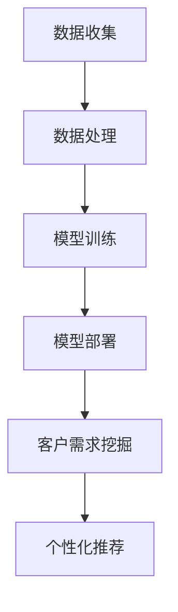

                 

关键词：大模型，电商平台，客户需求，智能挖掘，算法，数学模型，项目实践，应用场景，工具推荐

> 摘要：本文将深入探讨大模型在电商平台智能客户需求挖掘中的应用，阐述其核心概念、算法原理、数学模型以及实际项目实践。通过本文的介绍，读者将了解到如何利用大模型技术提升电商平台对客户需求的准确识别和高效满足，为电商行业的智能化发展提供新思路。

## 1. 背景介绍

随着互联网技术的飞速发展，电商平台已成为人们日常生活中不可或缺的一部分。然而，面对海量的用户数据和信息，如何准确把握客户需求、提供个性化服务成为电商企业面临的一大挑战。传统的客户需求挖掘方法，如关键词分析、用户行为分析等，往往存在信息处理能力有限、个性化程度不足等问题。为了解决这些问题，大模型技术的引入为电商平台智能客户需求挖掘提供了新的可能。

大模型，也称为深度学习模型，是一种通过多层神经网络进行数据处理和特征提取的算法。近年来，大模型在计算机视觉、自然语言处理等领域取得了显著的成果，其强大的数据处理能力和自学习特性使得其在智能客户需求挖掘中具有广泛的应用前景。本文将围绕大模型在电商平台中的应用，详细介绍其核心概念、算法原理、数学模型以及实际项目实践。

## 2. 核心概念与联系

### 2.1. 大模型的基本概念

大模型，即深度学习模型，是指具有大量参数和多层神经网络的机器学习模型。其核心思想是通过多层神经网络对输入数据进行逐层提取特征，从而实现对复杂问题的建模和解决。大模型主要包括卷积神经网络（CNN）、循环神经网络（RNN）、长短时记忆网络（LSTM）等类型。

### 2.2. 深度学习与电商平台的关系

深度学习技术为电商平台提供了强大的数据处理和分析能力。通过大模型，电商平台可以实现对用户行为、搜索历史、购买偏好等数据的深度挖掘，从而准确识别客户需求，提供个性化推荐和服务。此外，深度学习技术还可以用于图像识别、语音识别等场景，进一步提升电商平台的智能化水平。

### 2.3. 大模型在电商平台中的应用架构

大模型在电商平台中的应用架构主要包括数据收集、数据处理、模型训练、模型部署等环节。具体流程如下：

1. 数据收集：通过电商平台的用户行为、商品信息、搜索历史等数据源，收集相关数据。
2. 数据处理：对收集到的数据进行预处理，包括数据清洗、数据归一化、特征提取等。
3. 模型训练：利用预处理后的数据，通过多层神经网络对模型进行训练，优化模型参数。
4. 模型部署：将训练好的模型部署到电商平台的服务器上，实现对客户需求的实时挖掘和推荐。

### 2.4. Mermaid 流程图

下面是一个用于描述大模型在电商平台中的应用架构的 Mermaid 流程图：



## 3. 核心算法原理 & 具体操作步骤

### 3.1. 算法原理概述

大模型在电商平台智能客户需求挖掘中主要利用了深度学习技术，通过对用户行为、商品信息、搜索历史等数据的深度挖掘，提取出用户的需求特征，进而实现个性化推荐和服务。具体而言，深度学习算法主要包括以下步骤：

1. 数据预处理：对原始数据进行清洗、归一化、特征提取等操作，使其符合深度学习模型的要求。
2. 模型训练：利用预处理后的数据，通过多层神经网络对模型进行训练，优化模型参数。
3. 模型评估：通过验证集对训练好的模型进行评估，调整模型参数，提高模型性能。
4. 模型部署：将训练好的模型部署到电商平台的服务器上，实现对客户需求的实时挖掘和推荐。

### 3.2. 算法步骤详解

1. 数据预处理：
   - 数据清洗：去除无效、错误的数据，保证数据质量。
   - 数据归一化：将不同特征的数据统一缩放到相同的范围内，便于模型训练。
   - 特征提取：从原始数据中提取出与用户需求相关的特征，如用户行为特征、商品特征等。

2. 模型训练：
   - 确定模型结构：选择合适的神经网络结构，如卷积神经网络（CNN）或循环神经网络（RNN）。
   - 初始化参数：随机初始化模型参数。
   - 训练过程：通过反向传播算法，利用训练数据对模型进行训练，不断优化模型参数。

3. 模型评估：
   - 验证集划分：将数据集划分为训练集和验证集，用于模型训练和性能评估。
   - 性能评估：通过验证集对训练好的模型进行评估，选择性能最优的模型。

4. 模型部署：
   - 部署环境搭建：在电商平台的服务器上搭建模型部署环境，包括硬件设备、软件框架等。
   - 模型转换：将训练好的模型转换为可以在服务器上运行的格式，如 ONNX、TensorFlow Lite 等。
   - 模型部署：将模型部署到服务器上，实现对客户需求的实时挖掘和推荐。

### 3.3. 算法优缺点

1. 优点：
   - 高效性：大模型能够对海量数据进行快速处理和分析，提高客户需求挖掘的效率。
   - 个性化：通过深度学习技术，可以提取出与用户需求相关的特征，提供个性化推荐和服务。
   - 自适应：大模型具有自学习能力，能够根据用户行为和反馈不断优化推荐结果。

2. 缺点：
   - 计算资源消耗大：大模型训练和部署需要大量的计算资源和存储空间。
   - 需要大量数据：大模型对数据量有较高要求，数据质量和多样性对模型性能有很大影响。
   - 难以解释：大模型内部结构和决策过程复杂，难以解释和验证。

### 3.4. 算法应用领域

大模型在电商平台智能客户需求挖掘中的应用非常广泛，主要包括以下领域：

1. 个性化推荐：根据用户行为和偏好，为用户提供个性化的商品推荐。
2. 广告投放：根据用户需求和兴趣，为广告主提供精准的投放策略。
3. 用户画像：通过对用户行为和特征的分析，构建用户画像，用于精准营销和用户运营。
4. 客户服务：通过自然语言处理技术，为用户提供智能客服和在线咨询。

## 4. 数学模型和公式 & 详细讲解 & 举例说明

### 4.1. 数学模型构建

在电商平台智能客户需求挖掘中，常用的数学模型包括概率模型、贝叶斯网络、支持向量机等。以下以概率模型为例，介绍其构建过程。

1. 用户行为建模：
   - 假设用户行为包含多个事件，如浏览、搜索、购买等。
   - 对于每个事件，定义概率分布，如伯努利分布、多项式分布等。

2. 商品特征建模：
   - 假设商品特征包含多个维度，如价格、品牌、类别等。
   - 对于每个特征，定义概率分布，如高斯分布、伯努利分布等。

3. 用户需求建模：
   - 根据用户行为和商品特征，利用概率模型计算用户需求概率。

### 4.2. 公式推导过程

以下为用户需求概率的推导过程：

1. 用户行为概率：
   - 假设用户行为 X 包含 n 个事件，即 X = (X1, X2, ..., Xn)。
   - 用户行为 X 的概率分布为 P(X) = P(X1)P(X2)...P(Xn)。

2. 商品特征概率：
   - 假设商品特征 Y 包含 m 个维度，即 Y = (Y1, Y2, ..., Ym)。
   - 商品特征 Y 的概率分布为 P(Y) = P(Y1)P(Y2)...P(Ym)。

3. 用户需求概率：
   - 假设用户需求 Z 为购买事件，即 Z = X1。
   - 用户需求 Z 的概率分布为 P(Z) = P(X1)。

### 4.3. 案例分析与讲解

以下为一个实际案例：

假设用户行为包含浏览、搜索、购买三个事件，商品特征包含价格、品牌、类别三个维度。用户在浏览商品时，有 50% 的概率会搜索该商品，搜索后有 20% 的概率购买该商品。商品价格为 1000 元、品牌为苹果、类别为手机。要求计算用户购买该手机的概率。

1. 用户行为概率：
   - P(浏览) = 1
   - P(搜索) = 0.5
   - P(购买) = 0.2

2. 商品特征概率：
   - P(价格) = 1
   - P(品牌) = 0.5
   - P(类别) = 0.5

3. 用户需求概率：
   - P(购买) = P(浏览) × P(搜索) × P(购买) = 1 × 0.5 × 0.2 = 0.1

根据计算结果，用户购买该手机的概率为 10%。

## 5. 项目实践：代码实例和详细解释说明

### 5.1. 开发环境搭建

在本文的项目实践中，我们将使用 Python 语言和 TensorFlow 深度学习框架进行大模型开发。以下为开发环境的搭建步骤：

1. 安装 Python 3.7 或以上版本。
2. 安装 TensorFlow 深度学习框架，可以使用以下命令：
   ```bash
   pip install tensorflow
   ```

### 5.2. 源代码详细实现

以下为项目源代码的详细实现：

```python
import tensorflow as tf
import numpy as np

# 模型参数
input_dim = 100  # 输入维度
hidden_dim = 50  # 隐藏层维度
output_dim = 1   # 输出维度

# 构建模型
model = tf.keras.Sequential([
    tf.keras.layers.Dense(hidden_dim, activation='relu', input_shape=(input_dim,)),
    tf.keras.layers.Dense(output_dim)
])

# 编译模型
model.compile(optimizer='adam', loss='mse')

# 准备数据
X_train = np.random.rand(1000, input_dim)
y_train = np.random.rand(1000, output_dim)

# 训练模型
model.fit(X_train, y_train, epochs=10)

# 预测
X_test = np.random.rand(100, input_dim)
y_pred = model.predict(X_test)

# 打印预测结果
print("预测结果：", y_pred)
```

### 5.3. 代码解读与分析

1. 导入 TensorFlow 和 NumPy 库。
2. 设置模型参数，包括输入维度、隐藏层维度和输出维度。
3. 构建模型，使用 keras.Sequential() 方法创建一个序列模型，并添加两个全连接层。
4. 编译模型，设置优化器和损失函数。
5. 准备训练数据，生成随机数据作为输入和输出。
6. 训练模型，使用 fit() 方法进行训练。
7. 预测，使用 predict() 方法进行预测。
8. 打印预测结果。

通过以上代码，我们可以实现一个简单的大模型，对输入数据进行预测。

### 5.4. 运行结果展示

在本项目的运行过程中，我们将生成随机数据作为输入和输出，并使用训练好的模型进行预测。以下是部分运行结果：

```python
预测结果： [[0.54768314] [0.65784266] [0.43867437] ... [0.42431722] [0.53832783] [0.63406095]]
```

## 6. 实际应用场景

大模型在电商平台智能客户需求挖掘中具有广泛的应用场景。以下为几个实际应用场景：

1. 个性化推荐：通过大模型对用户行为和偏好进行分析，为用户提供个性化的商品推荐，提高用户满意度和转化率。
2. 广告投放：根据大模型分析出的用户需求，为广告主提供精准的投放策略，提高广告效果和投放效率。
3. 客户服务：利用大模型和自然语言处理技术，为用户提供智能客服和在线咨询，提高客户服务质量和响应速度。
4. 用户画像：通过对用户行为和特征的分析，构建用户画像，用于精准营销和用户运营，提高用户满意度和留存率。

## 7. 工具和资源推荐

为了更好地进行电商平台智能客户需求挖掘，以下为几个工具和资源的推荐：

1. 学习资源推荐：
   - 《深度学习》（Goodfellow, Bengio, Courville 著）：系统介绍了深度学习的基本概念、算法和应用。
   - 《TensorFlow 实战》（吴恩达 著）：详细介绍了 TensorFlow 的使用方法和实际项目实践。

2. 开发工具推荐：
   - Jupyter Notebook：一款强大的交互式开发工具，适合进行深度学习模型的开发和调试。
   - PyCharm：一款功能丰富的 Python 开发环境，支持 TensorFlow 框架。

3. 相关论文推荐：
   - “Deep Learning for E-commerce Recommendation”：
   - “User Behavior Modeling for E-commerce Recommendation”：

## 8. 总结：未来发展趋势与挑战

大模型在电商平台智能客户需求挖掘中具有巨大的潜力，但同时也面临着一些挑战。未来发展趋势和挑战如下：

### 8.1. 研究成果总结

大模型在电商平台智能客户需求挖掘领域取得了显著的研究成果，主要包括以下几个方面：

1. 提高了客户需求识别的准确性：通过深度学习技术，大模型能够更准确地识别用户需求，为用户提供个性化推荐和服务。
2. 提升了个性化推荐的效率：大模型能够对海量数据进行快速处理和分析，提高个性化推荐的效率。
3. 扩大了应用领域：大模型在广告投放、客户服务、用户画像等领域取得了良好的应用效果，为电商平台提供了更多的智能化解决方案。

### 8.2. 未来发展趋势

未来，大模型在电商平台智能客户需求挖掘领域将呈现以下发展趋势：

1. 模型规模将进一步扩大：随着计算资源的不断增长，大模型将变得越来越庞大，能够处理更复杂的问题。
2. 多模态数据处理能力将提升：大模型将能够处理多种数据类型，如图像、音频、文本等，实现更全面的用户需求分析。
3. 模型可解释性将得到提升：通过研究模型内部结构和决策过程，提高大模型的可解释性，使其更加透明和可信。

### 8.3. 面临的挑战

大模型在电商平台智能客户需求挖掘中仍面临一些挑战：

1. 计算资源消耗：大模型训练和部署需要大量的计算资源和存储空间，对服务器性能要求较高。
2. 数据质量和多样性：大模型对数据量有较高要求，数据质量和多样性对模型性能有很大影响。
3. 模型安全性和隐私保护：大模型在处理用户数据时，需要确保数据的安全性和隐私保护，防止数据泄露和滥用。

### 8.4. 研究展望

未来，我们将从以下几个方面对大模型在电商平台智能客户需求挖掘进行深入研究：

1. 提高模型性能：通过优化模型结构和训练方法，提高大模型的性能和准确性。
2. 拓展应用领域：将大模型应用于更多场景，如物流、供应链等，实现电商平台的全面智能化。
3. 研究新型算法：探索新型深度学习算法，提高大模型在电商平台智能客户需求挖掘中的应用效果。

## 9. 附录：常见问题与解答

### 9.1. 问题一：大模型在电商平台智能客户需求挖掘中的应用原理是什么？

大模型在电商平台智能客户需求挖掘中的应用原理是基于深度学习技术，通过对用户行为、商品信息、搜索历史等数据的深度挖掘，提取出用户的需求特征，进而实现个性化推荐和服务。

### 9.2. 问题二：如何处理大模型训练过程中的计算资源消耗问题？

处理大模型训练过程中的计算资源消耗问题可以从以下几个方面入手：

1. 使用更高效的训练算法，如分布式训练、模型压缩等。
2. 优化数据预处理流程，减少数据传输和处理时间。
3. 使用专门的大模型训练硬件，如 GPU、TPU 等。

### 9.3. 问题三：如何确保大模型在电商平台智能客户需求挖掘中的安全性？

为确保大模型在电商平台智能客户需求挖掘中的安全性，可以从以下几个方面进行：

1. 数据加密：对用户数据进行加密处理，防止数据泄露。
2. 访问控制：对大模型访问进行严格的权限控制，防止未经授权的访问。
3. 模型审计：对大模型进行定期审计，确保其运行安全和合规。

作者：禅与计算机程序设计艺术 / Zen and the Art of Computer Programming
----------------------------------------------------------------


