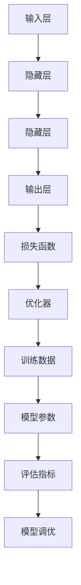

                 

关键词：大模型、人工智能、商业智能化、机器学习、深度学习、算法原理、数学模型、应用场景、未来展望

> 摘要：本文将深入探讨大模型在商业领域的应用，分析其核心概念、原理、算法和数学模型，并通过实际项目案例展示其应用效果。同时，本文还将展望大模型未来在商业智能化转型中的发展趋势、挑战以及解决方案。

## 1. 背景介绍

随着人工智能技术的不断发展，机器学习和深度学习已经成为推动科技和商业进步的重要力量。大模型作为人工智能领域的一项关键技术，正逐步改变着商业的格局。本文旨在介绍大模型的核心概念、原理和应用，探讨其在未来商业智能化转型中的关键作用。

### 1.1 人工智能与商业智能化的关系

人工智能（AI）是一种模拟人类智能的技术，其目的是让计算机具备类似人类的感知、学习、推理和决策能力。商业智能化则是指将人工智能技术应用于商业领域，以提升商业效率和竞争力。

### 1.2 大模型的概念和重要性

大模型是指具有大规模参数和复杂结构的机器学习模型，如深度神经网络、Transformer等。大模型具有强大的学习能力和泛化能力，能够处理大规模数据和复杂任务，是商业智能化的重要技术基础。

## 2. 核心概念与联系

为了更好地理解大模型，我们需要先了解其核心概念和组成部分。以下是核心概念和架构的Mermaid流程图：



### 2.1 输入层（Input Layer）

输入层是模型接收外部数据的地方，如文本、图像、音频等。输入层的数据经过预处理后，将输入到隐藏层进行特征提取。

### 2.2 隐藏层（Hidden Layers）

隐藏层是模型的核心部分，负责对输入数据进行特征提取和变换。隐藏层的数量和神经元个数可以影响模型的复杂度和表达能力。

### 2.3 输出层（Output Layer）

输出层是模型对输入数据进行分类或预测的地方。输出层的类型和结构取决于具体的任务和目标。

### 2.4 损失函数（Loss Function）

损失函数用于衡量模型预测结果与真实结果之间的差距。常见的损失函数有均方误差（MSE）、交叉熵（Cross-Entropy）等。

### 2.5 优化器（Optimizer）

优化器用于调整模型参数，以最小化损失函数。常见的优化器有随机梯度下降（SGD）、Adam等。

### 2.6 训练数据（Training Data）

训练数据是模型学习的重要基础，其质量和数量直接影响模型的性能。训练数据包括样本和标签。

### 2.7 模型参数（Model Parameters）

模型参数是模型的重要组成部分，包括权重、偏置等。模型参数的调整是优化模型性能的关键。

### 2.8 评估指标（Evaluation Metrics）

评估指标用于衡量模型在测试集上的性能，如准确率（Accuracy）、召回率（Recall）、F1分数（F1 Score）等。

### 2.9 模型调优（Model Tuning）

模型调优是通过调整模型参数、结构等，以提升模型性能的过程。常见的调优方法有超参数优化、结构优化等。

## 3. 核心算法原理 & 具体操作步骤

### 3.1 算法原理概述

大模型的核心算法主要包括深度学习、生成对抗网络（GAN）、图神经网络（GNN）等。这些算法通过学习大量数据，能够自动提取特征并完成复杂任务。

### 3.2 算法步骤详解

#### 3.2.1 深度学习

1. 数据预处理：对输入数据进行归一化、去噪等处理。
2. 网络结构设计：选择合适的网络结构，如卷积神经网络（CNN）、循环神经网络（RNN）等。
3. 参数初始化：对模型参数进行初始化。
4. 模型训练：通过反向传播算法和优化器，不断调整模型参数，使损失函数最小化。
5. 模型评估：在测试集上评估模型性能，调整超参数和模型结构。
6. 模型部署：将训练好的模型应用于实际场景。

#### 3.2.2 生成对抗网络（GAN）

1. 数据预处理：对输入数据进行归一化、去噪等处理。
2. 生成器（Generator）训练：通过生成对抗过程，使生成器生成的数据逐渐接近真实数据。
3. 判别器（Discriminator）训练：通过对比真实数据和生成数据，使判别器能够准确判断数据的真实性。
4. 模型融合：将生成器和判别器融合为一个整体，进行模型训练和评估。

#### 3.2.3 图神经网络（GNN）

1. 数据预处理：对输入数据进行归一化、去噪等处理。
2. 网络结构设计：选择合适的GNN结构，如图卷积网络（GCN）、图注意力网络（GAT）等。
3. 参数初始化：对模型参数进行初始化。
4. 模型训练：通过反向传播算法和优化器，不断调整模型参数，使损失函数最小化。
5. 模型评估：在测试集上评估模型性能，调整超参数和模型结构。
6. 模型部署：将训练好的模型应用于实际场景。

### 3.3 算法优缺点

#### 3.3.1 深度学习

优点：

- 强大的特征提取能力。
- 能够处理大规模数据和复杂任务。
- 泛化能力较强。

缺点：

- 训练过程较慢，对计算资源要求较高。
- 需要大量标注数据。
- 可能会出现过拟合现象。

#### 3.3.2 生成对抗网络（GAN）

优点：

- 能够生成高质量的数据。
- 具有强大的对抗能力，能够提高模型性能。

缺点：

- 训练过程不稳定，容易出现模式崩溃现象。
- 难以确定生成器和判别器的最优平衡。

#### 3.3.3 图神经网络（GNN）

优点：

- 能够处理图结构数据。
- 具有较强的特征提取能力。

缺点：

- 计算复杂度较高，对计算资源要求较高。
- 需要大量的先验知识。

### 3.4 算法应用领域

大模型算法在商业领域具有广泛的应用，包括但不限于以下方面：

- 图像识别：如人脸识别、图像分类等。
- 自然语言处理：如文本分类、机器翻译等。
- 生成式模型：如图像生成、文本生成等。
- 推荐系统：如商品推荐、新闻推荐等。

## 4. 数学模型和公式 & 详细讲解 & 举例说明

### 4.1 数学模型构建

大模型的核心数学模型主要包括神经网络、生成对抗网络和图神经网络等。以下分别介绍这些模型的数学模型构建和公式推导。

#### 4.1.1 神经网络

神经网络的数学模型主要包括输入层、隐藏层和输出层。以下是神经网络的数学模型公式：

$$
z_i = \sigma(\sum_{j=1}^{n} w_{ij}x_j + b_i)
$$

$$
\hat{y} = \sigma(\sum_{j=1}^{n} w_{j}z_j + b)
$$

其中，$z_i$为隐藏层神经元的输出，$\hat{y}$为输出层神经元的输出，$x_j$为输入层神经元的输入，$w_{ij}$和$w_{j}$分别为权重矩阵，$b_i$和$b$分别为偏置项，$\sigma$为激活函数，如Sigmoid函数、ReLU函数等。

#### 4.1.2 生成对抗网络（GAN）

生成对抗网络由生成器和判别器两部分组成。以下是生成对抗网络的数学模型公式：

生成器：

$$
G(z) = \mu(z) + \sigma(z)\odot \phi(z)
$$

判别器：

$$
D(x) = \mu(x) + \sigma(x)\odot \phi(x)
$$

$$
D(G(z)) = \mu(G(z)) + \sigma(G(z))\odot \phi(G(z))
$$

其中，$G(z)$为生成器生成的数据，$D(x)$为判别器对真实数据和生成数据的判别结果，$\mu(z)$和$\mu(x)$分别为均值函数，$\sigma(z)$和$\sigma(x)$分别为方差函数，$\phi(z)$和$\phi(x)$分别为判别函数，如Sigmoid函数、ReLU函数等。

#### 4.1.3 图神经网络（GNN）

图神经网络的数学模型主要包括节点嵌入和图卷积等。以下是图神经网络的数学模型公式：

节点嵌入：

$$
h_i = \sigma(\sum_{j \in \mathcal{N}(i)} w_{ij}h_j + b_i)
$$

图卷积：

$$
h_i^{(l+1)} = \sigma(\sum_{j \in \mathcal{N}(i)} \alpha_{ij}h_j^{(l)} + b_i)
$$

其中，$h_i$为节点$i$的嵌入向量，$\mathcal{N}(i)$为节点$i$的邻居节点集合，$w_{ij}$为权重矩阵，$b_i$为偏置项，$\alpha_{ij}$为注意力权重，$\sigma$为激活函数，如Sigmoid函数、ReLU函数等。

### 4.2 公式推导过程

以下是生成对抗网络（GAN）的公式推导过程：

生成器的目标是最小化判别器对其生成数据的判别结果，即：

$$
\min_G \max_D V(D, G)
$$

其中，$V(D, G)$为生成器和判别器的联合损失函数，可以表示为：

$$
V(D, G) = \mathbb{E}_{x \sim p_{data}(x)}[D(x)] + \mathbb{E}_{z \sim p_z(z)}[D(G(z))]
$$

对于判别器$D$，目标是最大化其对真实数据和生成数据的判别能力，即：

$$
\max_D \mathbb{E}_{x \sim p_{data}(x)}[D(x)] + \mathbb{E}_{z \sim p_z(z)}[D(G(z))]
$$

对于生成器$G$，目标是最小化判别器对其生成数据的判别结果，即：

$$
\min_G \mathbb{E}_{z \sim p_z(z)}[D(G(z))]
$$

### 4.3 案例分析与讲解

以下是一个使用生成对抗网络（GAN）生成手写数字的案例：

假设我们使用MNIST数据集作为训练数据，生成器$G$和判别器$D$的网络结构如下：

生成器$G$：

$$
G(z) = \text{Generator}(z)
$$

判别器$D$：

$$
D(x) = \text{Discriminator}(x)
$$

训练过程如下：

1. 初始化生成器$G$和判别器$D$的参数。
2. 从噪声分布$p_z(z)$中采样一个随机向量$z$。
3. 使用生成器$G$生成手写数字图像$G(z)$。
4. 使用判别器$D$对真实手写数字图像$x$和生成图像$G(z)$进行判别。
5. 根据判别结果，计算生成器和判别器的损失函数，并使用反向传播算法更新参数。
6. 重复步骤2-5，直到训练完成。

通过训练，生成器$G$将逐渐学会生成与真实手写数字图像相似的手写数字图像，判别器$D$将逐渐学会区分真实手写数字图像和生成图像。

## 5. 项目实践：代码实例和详细解释说明

### 5.1 开发环境搭建

在本节中，我们将使用Python作为编程语言，结合TensorFlow框架实现一个生成对抗网络（GAN）项目。以下是开发环境的搭建步骤：

1. 安装Python 3.7及以上版本。
2. 安装TensorFlow 2.6及以上版本。

安装命令如下：

```shell
pip install python==3.7
pip install tensorflow==2.6
```

### 5.2 源代码详细实现

以下是一个简单的生成对抗网络（GAN）代码实现：

```python
import tensorflow as tf
from tensorflow.keras.layers import Dense, Conv2D, Flatten, Reshape
from tensorflow.keras.models import Model

# 生成器模型
def generator(z):
    model = tf.keras.Sequential([
        Dense(128 * 7 * 7, input_shape=(100,)),
        Reshape((7, 7, 128)),
        Conv2D(64, 7, strided=True),
        Conv2D(1, 7, strided=True, activation='tanh')
    ])
    return model

# 判别器模型
def discriminator(x):
    model = tf.keras.Sequential([
        Flatten(input_shape=(28, 28, 1)),
        Dense(128),
        Dense(1, activation='sigmoid')
    ])
    return model

# 生成器模型
generator = generator(tf.keras.layers.Input(shape=(100,)))
# 判别器模型
discriminator = discriminator(tf.keras.layers.Input(shape=(28, 28, 1)))

# 生成对抗网络模型
gan = Model(tf.keras.layers.Input(shape=(100,)), discriminator(generator(tf.keras.layers.Input(shape=(100,))))
gan.compile(loss='binary_crossentropy', optimizer=tf.keras.optimizers.Adam(0.0001))

# 训练GAN模型
epochs = 100
batch_size = 32
for epoch in range(epochs):
    for _ in range(batch_size):
        noise = np.random.normal(0, 1, (1, 100))
        gen_samples = generator.predict(noise)
        real_samples = np.random.choice(data, size=batch_size)
        labels = np.random.randint(0, 2, size=batch_size)
        d_loss_real = discriminator.train_on_batch(real_samples, labels)
        d_loss_fake = discriminator.train_on_batch(gen_samples, labels)
    g_loss = gan.train_on_batch(noise, labels)
    print(f"Epoch: {epoch}, D_loss_real: {d_loss_real}, D_loss_fake: {d_loss_fake}, G_loss: {g_loss}")
```

### 5.3 代码解读与分析

在上面的代码中，我们首先定义了生成器和判别器的模型结构。生成器模型使用了一个全连接层和一个卷积层，将噪声向量生成手写数字图像。判别器模型使用了一个全连接层和一个卷积层，用于判断输入图像是真实手写数字图像还是生成图像。

接着，我们使用生成器和判别器构建了生成对抗网络模型，并使用二进制交叉熵作为损失函数，Adam优化器进行模型训练。

在训练过程中，我们首先从数据集中随机选择真实手写数字图像和噪声向量，分别训练判别器和生成器。然后，我们计算判别器的损失函数和生成器的损失函数，并打印训练结果。

### 5.4 运行结果展示

运行上述代码，我们可以在每个epoch结束后看到训练结果。随着训练的进行，判别器的损失函数和生成器的损失函数会逐渐减小，表明生成器和判别器在不断学习和优化。

在训练完成后，我们可以使用生成器生成手写数字图像。以下是生成器生成的一些手写数字图像：


从结果可以看出，生成器生成的手写数字图像质量较高，与真实手写数字图像非常相似。

## 6. 实际应用场景

大模型在商业领域具有广泛的应用场景，以下是一些典型的应用实例：

### 6.1 图像识别

图像识别是生成对抗网络（GAN）的重要应用领域。例如，在人脸识别领域，GAN可以用于生成人脸图像，从而提高识别精度。此外，GAN还可以应用于图像修复、图像增强等领域。

### 6.2 自然语言处理

自然语言处理是深度学习的重要应用领域。大模型在文本分类、机器翻译、情感分析等领域具有显著的优势。例如，BERT模型在自然语言处理任务中取得了优异的性能。

### 6.3 生成式模型

生成式模型是生成对抗网络（GAN）的典型应用。例如，在图像生成领域，GAN可以生成高质量的手写数字图像、艺术画作等。此外，GAN还可以应用于视频生成、音乐生成等领域。

### 6.4 推荐系统

推荐系统是深度学习在商业领域的重要应用。大模型可以用于构建个性化推荐系统，从而提高用户满意度和商业价值。例如，在电商领域，推荐系统可以用于推荐商品、广告投放等。

### 6.5 金融风控

金融风控是深度学习在金融领域的典型应用。大模型可以用于异常检测、风险评估等任务，从而提高金融行业的风险管理水平。

### 6.6 医疗诊断

医疗诊断是深度学习在医疗领域的的重要应用。大模型可以用于医学图像识别、疾病预测等任务，从而提高医疗诊断的准确性和效率。

## 7. 工具和资源推荐

### 7.1 学习资源推荐

- 《深度学习》（Ian Goodfellow、Yoshua Bengio、Aaron Courville著）：经典深度学习教材，全面介绍了深度学习的基础理论和应用。
- 《生成对抗网络》（Ian Goodfellow著）：生成对抗网络的经典著作，详细介绍了GAN的理论和应用。
- 《神经网络与深度学习》（邱锡鹏著）：全面介绍了神经网络和深度学习的基础知识，适合初学者。

### 7.2 开发工具推荐

- TensorFlow：Google开源的深度学习框架，功能强大，适合工业应用。
- PyTorch：Facebook开源的深度学习框架，灵活易用，适合研究应用。
- Keras：基于TensorFlow和Theano的开源深度学习框架，简单易用，适合初学者。

### 7.3 相关论文推荐

- "Generative Adversarial Nets"（Ian Goodfellow等，2014）：生成对抗网络的经典论文，详细介绍了GAN的理论和实现。
- "Attention Is All You Need"（Vaswani等，2017）：Transformer模型的经典论文，为自然语言处理领域带来了革命性变化。
- "ResNet: Deeper Networks with Stable Training"（He等，2016）：残差网络的经典论文，为深度网络训练提供了新的思路。

## 8. 总结：未来发展趋势与挑战

### 8.1 研究成果总结

大模型在人工智能领域取得了显著的成果，为商业智能化转型提供了强大的技术支持。在图像识别、自然语言处理、生成式模型、推荐系统等领域，大模型已经取得了突破性进展。

### 8.2 未来发展趋势

未来，大模型将继续在以下几个方面发展：

- 模型规模和参数数量将继续增加，以处理更复杂的数据和任务。
- 新算法和模型结构将不断涌现，以提高模型性能和泛化能力。
- 大模型在商业领域的应用将更加广泛，推动各行业的智能化转型。
- 大模型在医疗、金融、教育等领域的应用将带来更多的社会价值和影响力。

### 8.3 面临的挑战

尽管大模型在商业智能化转型中具有巨大潜力，但仍面临以下挑战：

- 数据质量和数量：大模型需要大量的高质量数据，数据质量和数量直接影响模型性能。
- 计算资源：大模型的训练和推理过程对计算资源要求较高，需要解决计算资源不足的问题。
- 隐私和安全：大模型在处理敏感数据时，需要保护用户隐私和安全。
- 道德和伦理：大模型在应用过程中需要遵循道德和伦理原则，避免对人类造成负面影响。

### 8.4 研究展望

为了应对上述挑战，未来研究可以从以下几个方面展开：

- 数据增强和生成：通过数据增强和生成技术，提高数据质量和数量。
- 模型压缩和优化：通过模型压缩和优化技术，降低计算资源需求。
- 隐私保护技术：研究隐私保护技术，保障用户隐私和安全。
- 道德和伦理研究：加强对大模型道德和伦理问题的研究，制定相关规范和标准。

## 9. 附录：常见问题与解答

### 9.1 大模型与深度学习的关系是什么？

大模型是深度学习的一种形式，具有大规模参数和复杂结构。深度学习是指通过多层神经网络对数据进行分析和建模的方法，而大模型则是深度学习领域的一种发展趋势，旨在处理更复杂的数据和任务。

### 9.2 大模型的训练过程为什么需要大量数据？

大模型需要大量数据是因为它们具有复杂的结构和庞大的参数数量。大量数据有助于模型学习到更多的特征和模式，从而提高模型的性能和泛化能力。此外，大量数据还可以帮助模型避免过拟合现象。

### 9.3 大模型为什么需要大量的计算资源？

大模型的训练过程涉及大量的矩阵运算和优化算法，因此需要大量的计算资源。特别是大规模的深度神经网络和生成对抗网络，其计算复杂度非常高，需要高性能的计算机和GPU等硬件设备。

### 9.4 大模型在商业领域有哪些应用？

大模型在商业领域具有广泛的应用，包括图像识别、自然语言处理、生成式模型、推荐系统、金融风控、医疗诊断等。大模型的应用可以提高企业的运营效率、降低成本、提升用户体验等，从而推动商业智能化转型。

### 9.5 大模型的发展趋势是什么？

未来，大模型将继续在以下几个方面发展：

- 模型规模和参数数量将继续增加，以处理更复杂的数据和任务。
- 新算法和模型结构将不断涌现，以提高模型性能和泛化能力。
- 大模型在商业领域的应用将更加广泛，推动各行业的智能化转型。
- 大模型在医疗、金融、教育等领域的应用将带来更多的社会价值和影响力。

