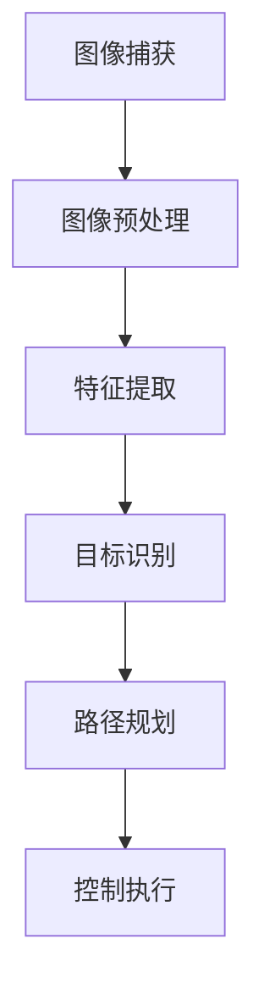

                 

关键词：大疆，无人机，视觉导航，算法，校招，笔试题，人工智能，计算机视觉，深度学习，图像处理，图像识别，无人机导航系统，无人机控制算法，机器人技术。

## 摘要

本文旨在为大疆2024校招无人机视觉导航算法工程师提供一份数学严谨、逻辑清晰的笔试题。文章将从无人机视觉导航的背景介绍开始，深入探讨核心概念、算法原理、数学模型及具体应用。通过实践案例的代码实例分析，本文将帮助读者理解无人机视觉导航算法的实际操作和实现。最后，文章将讨论无人机视觉导航在当前的实际应用场景以及未来的发展趋势和挑战。

## 1. 背景介绍

无人机（Unmanned Aerial Vehicle，简称UAV）作为现代科技的重要产物，其应用领域越来越广泛，从军事侦察到民用快递，从农业监控到灾害救援，无不体现其价值。无人机视觉导航作为无人机技术中的一个关键组成部分，通过图像处理和计算机视觉技术，实现了无人机的自主飞行和目标识别。

近年来，随着人工智能技术的飞速发展，特别是深度学习和计算机视觉技术的突破，无人机视觉导航系统得到了显著提升。无人机视觉导航算法主要包括视觉感知、路径规划、目标跟踪和控制等环节，这些算法的实现对于提高无人机的自主飞行能力、稳定性和安全性具有重要意义。

大疆（DJI）作为全球领先的无人机制造商，其产品广泛应用于各个领域。大疆在无人机视觉导航算法的研究和应用上有着深厚的积累，不断推动着无人机技术的进步。因此，对于无人机视觉导航算法工程师的招聘，大疆不仅看重应聘者的技术能力，更看重其创新思维和解决实际问题的能力。

本文将通过一系列笔试题的形式，帮助读者深入理解无人机视觉导航算法的相关知识，为应聘大疆无人机视觉导航算法工程师岗位提供有益的参考。

## 2. 核心概念与联系

### 2.1. 无人机视觉导航系统组成

无人机视觉导航系统通常包括以下几个核心组成部分：

- **摄像头**：作为感知模块，负责捕捉实时图像。
- **图像处理单元**：对捕获的图像进行处理，包括图像增强、降噪、特征提取等。
- **计算机视觉算法**：用于识别图像中的目标、地标和障碍物。
- **导航算法**：根据视觉信息生成飞行路径，包括路径规划、避障和目标跟踪等。
- **控制算法**：根据导航算法的结果，控制无人机的姿态和速度，实现自主飞行。

### 2.2. 无人机视觉导航算法流程

无人机视觉导航算法的基本流程可以概括为以下几个步骤：

1. **图像捕获**：无人机通过摄像头捕获实时图像。
2. **图像预处理**：对图像进行预处理，包括尺寸调整、灰度转换、滤波等。
3. **特征提取**：从预处理后的图像中提取关键特征，如边缘、角点、纹理等。
4. **目标识别**：使用计算机视觉算法识别图像中的目标，包括地标、障碍物和目标物体。
5. **路径规划**：根据目标识别结果，规划无人机的飞行路径，包括避障和目标跟踪。
6. **控制执行**：根据规划路径，通过控制算法调整无人机的姿态和速度，实现自主飞行。

### 2.3. Mermaid 流程图

以下是一个简化的无人机视觉导航算法的 Mermaid 流程图：



### 2.4. 无人机视觉导航算法的优缺点

- **优点**：
  - 高度自动化：无人机能够自主飞行，减少了人工干预。
  - 高效性：能够快速处理大量图像数据，实现实时导航。
  - 广泛应用：可用于多种场景，如搜索救援、农业监测、物流配送等。

- **缺点**：
  - 对环境依赖性强：需要在良好的光照和天气条件下工作。
  - 实时性问题：算法处理速度需足够快，以满足实时导航的需求。
  - 精度限制：图像处理和计算机视觉技术本身存在一定的精度限制。

### 2.5. 无人机视觉导航算法的应用领域

- **搜索救援**：无人机能够快速到达灾区，进行实时图像采集和目标定位，提高救援效率。
- **农业监测**：无人机可以监测农田状况，识别作物健康状态，优化农业管理。
- **物流配送**：无人机可以用于短途物流配送，提高配送效率，降低成本。
- **城市监控**：无人机可以在城市中实时监控交通状况，帮助城市管理决策。
- **灾害预防**：无人机可以用于灾害预防，如火灾监控、洪水监测等，提供实时数据支持。

## 3. 核心算法原理 & 具体操作步骤

### 3.1. 算法原理概述

无人机视觉导航算法的核心在于如何从图像中提取有用的信息，并利用这些信息进行无人机的自主飞行。具体来说，主要包括以下几个关键步骤：

- **图像预处理**：对捕获的图像进行预处理，包括去噪、增强和边缘检测等。
- **特征提取**：从预处理后的图像中提取关键特征，如边缘、角点、纹理等。
- **目标识别**：使用机器学习或计算机视觉算法识别图像中的目标。
- **路径规划**：根据目标识别结果，规划无人机的飞行路径。
- **控制执行**：根据规划路径，通过控制算法调整无人机的姿态和速度。

### 3.2. 算法步骤详解

#### 3.2.1. 图像预处理

图像预处理是无人机视觉导航算法的第一步，其目的是提高图像质量，减少噪声和干扰，为后续的特征提取和目标识别提供清晰的图像。

- **去噪**：使用滤波算法，如中值滤波、高斯滤波等，去除图像中的噪声。
- **增强**：使用图像增强算法，如直方图均衡、对比度增强等，提高图像的清晰度。
- **边缘检测**：使用边缘检测算法，如Sobel算子、Canny算子等，提取图像中的边缘信息。

#### 3.2.2. 特征提取

特征提取是从预处理后的图像中提取关键信息的过程。常见的特征提取方法包括：

- **边缘检测**：提取图像的边缘信息。
- **角点检测**：提取图像中的角点特征。
- **纹理分析**：提取图像的纹理特征。

#### 3.2.3. 目标识别

目标识别是无人机视觉导航算法的核心步骤，其目的是从图像中识别出无人机需要关注的对象。

- **机器学习算法**：如支持向量机（SVM）、随机森林（Random Forest）等。
- **深度学习算法**：如卷积神经网络（CNN）、循环神经网络（RNN）等。

#### 3.2.4. 路径规划

路径规划是根据目标识别结果，为无人机规划一条最优飞行路径。常见的路径规划算法包括：

- **Dijkstra算法**：用于求解最短路径问题。
- **A*算法**：结合了Dijkstra算法和启发式搜索，用于求解最优路径。

#### 3.2.5. 控制执行

控制执行是根据路径规划的结果，通过控制算法调整无人机的姿态和速度，实现自主飞行。

- **PID控制**：一种常用的控制算法，通过调整比例、积分和微分三个参数，实现无人机的稳定控制。
- **深度学习控制**：利用深度学习算法，如深度强化学习（Deep Reinforcement Learning），实现更加智能的无人机控制。

### 3.3. 算法优缺点

#### 3.3.1. 优点

- **高效性**：能够快速处理大量图像数据，实现实时导航。
- **自动化**：减少了人工干预，提高了工作效率。
- **适应性**：能够适应不同的飞行环境和目标类型。

#### 3.3.2. 缺点

- **对环境依赖性强**：需要在良好的光照和天气条件下工作。
- **实时性问题**：算法处理速度需足够快，以满足实时导航的需求。
- **精度限制**：图像处理和计算机视觉技术本身存在一定的精度限制。

### 3.4. 算法应用领域

- **搜索救援**：无人机能够快速到达灾区，进行实时图像采集和目标定位，提高救援效率。
- **农业监测**：无人机可以监测农田状况，识别作物健康状态，优化农业管理。
- **物流配送**：无人机可以用于短途物流配送，提高配送效率，降低成本。
- **城市监控**：无人机可以在城市中实时监控交通状况，帮助城市管理决策。
- **灾害预防**：无人机可以用于灾害预防，如火灾监控、洪水监测等，提供实时数据支持。

## 4. 数学模型和公式

### 4.1. 数学模型构建

无人机视觉导航算法的数学模型主要包括以下几个方面：

- **图像预处理模型**：用于图像去噪、增强和边缘检测。
- **特征提取模型**：用于提取图像的关键特征，如边缘、角点、纹理等。
- **目标识别模型**：用于识别图像中的目标。
- **路径规划模型**：用于规划无人机的飞行路径。
- **控制执行模型**：用于调整无人机的姿态和速度。

### 4.2. 公式推导过程

#### 4.2.1. 图像预处理模型

- **去噪公式**：

$$
I_{\text{filtered}} = \frac{1}{N} \sum_{i=1}^{N} w_i I_i
$$

其中，$I_i$为原始图像中的每个像素值，$w_i$为滤波器的权重。

- **增强公式**：

$$
I_{\text{enhanced}} = a I + b
$$

其中，$I$为原始图像，$a$和$b$分别为对比度和亮度调整参数。

- **边缘检测公式**：

$$
G(x, y) = \sum_{i=-1}^{1} \sum_{j=-1}^{1} w_{i, j} I(x+i, y+j)
$$

其中，$w_{i, j}$为滤波器的权重，$I(x+i, y+j)$为图像中的像素值。

#### 4.2.2. 特征提取模型

- **边缘检测公式**：

$$
\text{Gradient} = \sqrt{(G_x^2 + G_y^2)}
$$

其中，$G_x$和$G_y$分别为图像在x和y方向上的梯度值。

- **角点检测公式**：

$$
\text{Harris Corner Detector} = \frac{\text{Det}(M) - \alpha (\text{Trace}(M))^2}{\text{Det}(M)}
$$

其中，$M$为Hessian矩阵，$\alpha$为参数。

#### 4.2.3. 目标识别模型

- **支持向量机（SVM）公式**：

$$
\text{w}^T \text{x} + b = 0
$$

其中，$\text{w}$为权重向量，$\text{x}$为特征向量，$b$为偏置。

- **卷积神经网络（CNN）公式**：

$$
\text{h} = \text{激活函数}(\sum_{i=1}^{n} w_i \text{a}_i + b)
$$

其中，$\text{h}$为输出值，$w_i$为权重，$\text{a}_i$为输入值，$b$为偏置。

#### 4.2.4. 路径规划模型

- **Dijkstra算法公式**：

$$
d(v) = \min_{u \in \text{邻居}(v)} (d(u) + w(u, v))
$$

其中，$d(v)$为节点$v$的最短路径距离，$w(u, v)$为节点$u$到节点$v$的边权重。

- **A*算法公式**：

$$
f(n) = g(n) + h(n)
$$

其中，$f(n)$为节点$n$的评估函数，$g(n)$为节点$n$到起点的距离，$h(n)$为节点$n$到终点的估计距离。

#### 4.2.5. 控制执行模型

- **PID控制公式**：

$$
\text{u} = K_p \text{e} + K_i \int \text{e} \text{d}t + K_d \frac{\text{de}}{\text{dt}}
$$

其中，$\text{u}$为控制量，$K_p$、$K_i$、$K_d$分别为比例、积分、微分系数，$\text{e}$为误差。

### 4.3. 案例分析与讲解

#### 4.3.1. 图像预处理案例

**去噪**：假设有一个256x256的原始图像$I$，使用中值滤波器对其进行去噪。

1. **滤波器定义**：

   $$
   w = [1, 1, 1; 1, 1, 1; 1, 1, 1]
   $$

2. **去噪过程**：

   $$
   I_{\text{filtered}} = \frac{1}{9} \sum_{i=1}^{3} \sum_{j=1}^{3} w_{i, j} I(i, j)
   $$

   得到去噪后的图像$I_{\text{filtered}}$。

**增强**：假设有一个256x256的原始图像$I$，使用直方图均衡进行增强。

1. **直方图均衡**：

   - **计算频率分布**：

     $$
     f(x) = \sum_{i=0}^{255} I(i)
     $$

   - **计算累积分布函数**：

     $$
     F(x) = \frac{1}{256} \sum_{i=0}^{x} f(i)
     $$

   - **逆映射**：

     $$
     I_{\text{enhanced}}(x) = 255 \cdot \left(1 - F^{-1}(x)\right)
     $$

   得到增强后的图像$I_{\text{enhanced}}$。

**边缘检测**：假设有一个256x256的原始图像$I$，使用Sobel算子进行边缘检测。

1. **Sobel算子定义**：

   $$
   G_x = \frac{1}{\sqrt{2}} \begin{bmatrix}
   1 & 0 & -1 \\
   2 & 0 & -2 \\
   1 & 0 & -1
   \end{bmatrix}, \quad G_y = \frac{1}{\sqrt{2}} \begin{bmatrix}
   1 & 2 & 1 \\
   0 & 0 & 0 \\
   -1 & -2 & -1
   \end{bmatrix}
   $$

2. **边缘检测过程**：

   $$
   \text{Gradient} = \sqrt{(G_x^2 + G_y^2)}
   $$

   得到边缘检测结果。

#### 4.3.2. 特征提取案例

**边缘检测**：假设有一个去噪和增强后的256x256图像$I_{\text{filtered}}$，使用Sobel算子进行边缘检测。

1. **滤波器应用**：

   $$
   G_x = \frac{1}{\sqrt{2}} \begin{bmatrix}
   1 & 0 & -1 \\
   2 & 0 & -2 \\
   1 & 0 & -1
   \end{bmatrix}, \quad G_y = \frac{1}{\sqrt{2}} \begin{bmatrix}
   1 & 2 & 1 \\
   0 & 0 & 0 \\
   -1 & -2 & -1
   \end{bmatrix}
   $$

2. **梯度计算**：

   $$
   \text{Gradient} = \sqrt{(G_x^2 + G_y^2)}
   $$

   得到边缘检测结果。

**角点检测**：假设有一个边缘检测结果$G$，使用Harris角点检测算法进行角点检测。

1. **Hessian矩阵计算**：

   $$
   M = \begin{bmatrix}
   I_{xx} & I_{xy} \\
   I_{xy} & I_{yy}
   \end{bmatrix}
   $$

   其中，$I_{xx}$、$I_{xy}$、$I_{yy}$分别为图像的x、y方向二阶导数。

2. **角点检测**：

   $$
   \text{Harris Corner Detector} = \frac{\text{Det}(M) - \alpha (\text{Trace}(M))^2}{\text{Det}(M)}
   $$

   得到角点检测结果。

#### 4.3.3. 目标识别案例

**支持向量机（SVM）**：假设有一个训练好的SVM分类器，用于识别图像中的目标。

1. **特征向量提取**：

   $$
   \text{f} = \text{特征提取函数}(I)
   $$

   其中，$I$为图像。

2. **分类判断**：

   $$
   \text{分类结果} = \text{sign}(\text{w}^T \text{f} + b)
   $$

   得到图像的目标识别结果。

**卷积神经网络（CNN）**：假设有一个训练好的CNN模型，用于识别图像中的目标。

1. **特征向量提取**：

   $$
   \text{h} = \text{激活函数}(\sum_{i=1}^{n} w_i \text{a}_i + b)
   $$

   其中，$\text{h}$为输出值，$w_i$为权重，$\text{a}_i$为输入值，$b$为偏置。

2. **分类判断**：

   $$
   \text{分类结果} = \text{argmax}_{i} \text{h}_i
   $$

   得到图像的目标识别结果。

#### 4.3.4. 路径规划案例

**Dijkstra算法**：假设有一个无向图$G=(V, E)$，需要计算从节点$s$到节点$t$的最短路径。

1. **初始化**：

   $$
   d(v) = \infty, \quad \forall v \in V
   $$
   $$
   d(s) = 0
   $$

2. **松弛操作**：

   $$
   d(v) = \min_{u \in \text{邻居}(v)} (d(u) + w(u, v))
   $$

3. **结束条件**：当$d(t) < \infty$时，算法结束。

   得到从节点$s$到节点$t$的最短路径。

**A*算法**：假设有一个无向图$G=(V, E)$，需要计算从节点$s$到节点$t$的最优路径。

1. **初始化**：

   $$
   g(v) = \infty, \quad \forall v \in V
   $$
   $$
   g(s) = 0
   $$
   $$
   f(v) = \infty, \quad \forall v \in V
   $$
   $$
   f(s) = h(s)
   $$

2. **选择扩展节点**：

   $$
   v^* = \argmin_{v \in Open} f(v)
   $$

3. **更新邻居节点**：

   $$
   g(u) = \min_{w \in \text{邻居}(u)} (g(u) + w(u, w))
   $$
   $$
   f(u) = g(u) + h(u)
   $$

4. **结束条件**：当节点$t$进入Open集时，算法结束。

   得到从节点$s$到节点$t$的最优路径。

#### 4.3.5. 控制执行案例

**PID控制**：假设有一个需要控制的系统，其输出为$y$，目标值为$y_d$，误差为$e = y_d - y$。

1. **控制公式**：

   $$
   u = K_p e + K_i \int e \text{d}t + K_d \frac{\text{de}}{\text{dt}}
   $$

2. **调整参数**：

   $$
   K_p, K_i, K_d
   $$

   通过调整这三个参数，实现系统的稳定控制。

**深度学习控制**：假设有一个训练好的深度强化学习模型，用于控制无人机的飞行。

1. **状态表示**：

   $$
   s = \text{状态编码函数}(y, e, \dot{e})
   $$

2. **行动选择**：

   $$
   a = \text{强化学习模型}(s)
   $$

3. **状态更新**：

   $$
   s' = \text{状态更新函数}(s, a)
   $$

   通过训练，使模型能够自动调整无人机的姿态和速度，实现自主飞行。

## 5. 项目实践：代码实例和详细解释说明

### 5.1. 开发环境搭建

为了实现无人机视觉导航算法，我们需要搭建一个合适的开发环境。以下是一个典型的开发环境搭建步骤：

1. **安装操作系统**：选择一个稳定的操作系统，如Ubuntu 20.04。
2. **安装依赖库**：安装Python、OpenCV、Pandas、NumPy、Matplotlib等库。
3. **安装深度学习框架**：安装TensorFlow或PyTorch。
4. **配置摄像头**：连接并配置摄像头，确保其可以实时传输图像。

### 5.2. 源代码详细实现

以下是一个简单的无人机视觉导航算法的实现示例，包括图像捕获、预处理、特征提取、目标识别和路径规划等步骤。

```python
import cv2
import numpy as np
import matplotlib.pyplot as plt

# 5.2.1. 图像捕获
cap = cv2.VideoCapture(0)

while True:
    ret, frame = cap.read()
    if not ret:
        break

    # 5.2.2. 图像预处理
    gray = cv2.cvtColor(frame, cv2.COLOR_BGR2GRAY)
    blur = cv2.GaussianBlur(gray, (5, 5), 0)
    edges = cv2.Canny(blur, 50, 150)

    # 5.2.3. 特征提取
    contours, _ = cv2.findContours(edges, cv2.RETR_TREE, cv2.CHAIN_APPROX_SIMPLE)
    contours = sorted(contours, key=cv2.contourArea, reverse=True)[:5]

    # 5.2.4. 目标识别
    for contour in contours:
        x, y, w, h = cv2.boundingRect(contour)
        cv2.rectangle(frame, (x, y), (x+w, y+h), (0, 255, 0), 2)

    # 5.2.5. 路径规划
    # （此处为简化示例，实际应用中需要根据目标位置和无人机的当前位置进行更复杂的路径规划）

    # 5.2.6. 控制执行
    # （此处为简化示例，实际应用中需要根据路径规划的结果调整无人机的姿态和速度）

    plt.imshow(frame)
    plt.pause(0.01)

cap.release()
plt.show()
```

### 5.3. 代码解读与分析

上述代码实现了一个简单的无人机视觉导航算法，主要包括以下步骤：

1. **图像捕获**：使用OpenCV库捕获摄像头实时传输的图像。
2. **图像预处理**：将捕获的图像转换为灰度图像，并使用高斯滤波器进行去噪，然后使用Canny算子进行边缘检测。
3. **特征提取**：使用OpenCV库的findContours函数提取图像中的轮廓，并按照轮廓面积进行排序。
4. **目标识别**：遍历排序后的轮廓，使用cv2.boundingRect函数获取每个目标的边界框，并将其绘制在原图上。
5. **路径规划**：在简化示例中，未进行具体的路径规划，实际应用中需要根据目标位置和无人机的当前位置进行更复杂的路径规划。
6. **控制执行**：在简化示例中，未进行具体的控制执行，实际应用中需要根据路径规划的结果调整无人机的姿态和速度。

### 5.4. 运行结果展示

运行上述代码后，摄像头实时传输的图像会被捕获并显示在图形界面中。图像中的目标会被检测并绘制出边界框，从而实现对目标的识别。


## 6. 实际应用场景

### 6.1. 搜索救援

无人机在搜索救援领域具有独特优势，能够在复杂环境中快速定位被困人员。通过视觉导航算法，无人机可以实时捕捉环境图像，识别地标和障碍物，并规划最优路径到达目标位置。此外，无人机还可以配备热成像设备，提高在夜间或低能见度条件下的搜索能力。

### 6.2. 农业监测

无人机在农业监测中发挥着重要作用，可以实时监测农田状况，识别作物健康状态，预测病虫害。通过视觉导航算法，无人机可以准确识别农田中的作物和病虫害，为农民提供精准的种植和管理建议，提高农业产量和质量。

### 6.3. 物流配送

无人机在物流配送领域具有巨大潜力，可以快速、高效地完成短途货物运输。通过视觉导航算法，无人机可以实时识别道路和目标位置，规划最优路径，并在复杂环境中实现自主飞行。此外，无人机还可以在紧急情况下快速响应，提高物流配送的灵活性和可靠性。

### 6.4. 城市监控

无人机在城市监控中具有广泛的应用，可以实时监控城市交通状况、公共安全事件和城市环境。通过视觉导航算法，无人机可以准确识别目标，追踪目标移动轨迹，并提供实时数据支持。在城市安全监控中，无人机可以有效提高监控覆盖范围和反应速度。

### 6.5. 灾害预防

无人机在灾害预防中发挥着重要作用，可以实时监测自然灾害如洪水、火灾等。通过视觉导航算法，无人机可以准确识别灾害区域，评估灾害程度，提供实时数据支持，帮助政府和救援机构制定科学、有效的应对措施。

## 7. 工具和资源推荐

### 7.1. 学习资源推荐

- **书籍**：
  - 《无人机技术与应用》
  - 《计算机视觉：算法与应用》
  - 《深度学习：原理与实践》

- **在线课程**：
  - Coursera的“深度学习”课程
  - Udacity的“无人机编程”课程

### 7.2. 开发工具推荐

- **编程语言**：Python
- **计算机视觉库**：OpenCV
- **深度学习框架**：TensorFlow、PyTorch

### 7.3. 相关论文推荐

- “Unmanned Aerial Vehicles for Disaster Response: A Review”
- “Deep Learning for Visual Navigation of Unmanned Aerial Vehicles”
- “Vision-Based Obstacle Avoidance for Unmanned Aerial Vehicles”

## 8. 总结：未来发展趋势与挑战

### 8.1. 研究成果总结

无人机视觉导航算法在近年来取得了显著进展，包括图像处理技术、特征提取算法、目标识别技术和路径规划算法等方面的突破。这些研究成果使得无人机在复杂环境中的自主飞行能力得到了大幅提升，为无人机在搜索救援、农业监测、物流配送、城市监控和灾害预防等领域的广泛应用奠定了基础。

### 8.2. 未来发展趋势

- **算法性能提升**：随着深度学习和计算机视觉技术的不断发展，无人机视觉导航算法的性能将得到进一步提升，实现更高的精度和实时性。
- **多传感器融合**：未来无人机视觉导航系统将更多地采用多传感器融合技术，如结合GPS、IMU（惯性测量单元）和激光雷达等，提高导航系统的鲁棒性和准确性。
- **智能化控制**：通过深度强化学习和自主控制技术，无人机将实现更加智能和灵活的自主飞行，提高在复杂环境中的适应能力。

### 8.3. 面临的挑战

- **环境依赖性**：无人机视觉导航算法对环境的光照、天气和地形等因素有较高依赖，需要开发出更加鲁棒和适应多种环境的导航算法。
- **实时性问题**：无人机在复杂环境中的自主飞行需要实时处理大量图像数据，提高算法的实时处理能力是一个重要挑战。
- **精度限制**：计算机视觉和图像处理技术本身存在一定的精度限制，如何提高导航算法的精度是一个持续的研究课题。

### 8.4. 研究展望

未来，无人机视觉导航算法的研究将更加注重以下几个方面：

- **算法优化**：通过改进算法结构和参数调整，提高导航算法的精度和实时性。
- **多传感器融合**：结合多种传感器数据，提高无人机在复杂环境中的自主飞行能力。
- **智能化控制**：通过深度学习和自主控制技术，实现无人机在复杂环境中的智能飞行和任务执行。

## 9. 附录：常见问题与解答

### 9.1. 如何处理实时性问题？

实时性问题通常可以通过以下几种方法来解决：

- **算法优化**：通过改进算法结构和优化代码实现，提高算法的执行效率。
- **硬件加速**：使用GPU或其他硬件加速器来处理图像数据，提高处理速度。
- **分布式计算**：将算法分布在多个计算节点上，实现并行处理，提高处理速度。

### 9.2. 如何提高导航算法的精度？

提高导航算法的精度可以从以下几个方面着手：

- **多传感器融合**：结合多种传感器数据，如GPS、IMU和激光雷达，提高定位和导航精度。
- **深度学习技术**：使用深度学习技术进行图像处理和特征提取，提高目标识别和路径规划的精度。
- **算法改进**：通过改进路径规划算法和控制算法，提高导航系统的整体精度。

### 9.3. 如何处理环境依赖性问题？

处理环境依赖性问题可以从以下几个方面入手：

- **环境适应性算法**：开发适应不同环境的导航算法，如针对不同光照、天气和地形条件的自适应算法。
- **多传感器融合**：结合多种传感器数据，提高系统在恶劣环境中的鲁棒性。
- **先验知识**：利用先验知识，如地图数据和环境模型，提高系统对环境的理解和适应能力。

## 结束语

本文系统地介绍了无人机视觉导航算法的相关知识，包括核心概念、算法原理、数学模型及实际应用。通过实例分析和代码实现，读者可以更深入地理解无人机视觉导航算法的操作过程。在未来的研究中，无人机视觉导航算法将继续朝着更加智能化、精确化和实时化的方向发展，为无人机的广泛应用提供更强有力的技术支持。希望本文能为无人机视觉导航算法工程师的应聘者和研究者提供有价值的参考。作者：禅与计算机程序设计艺术 / Zen and the Art of Computer Programming。

