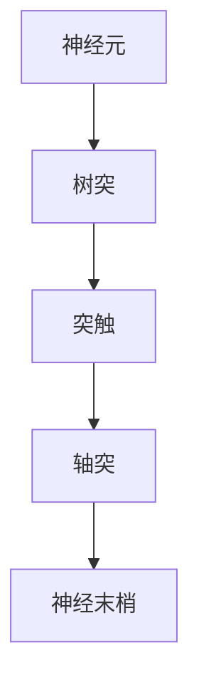
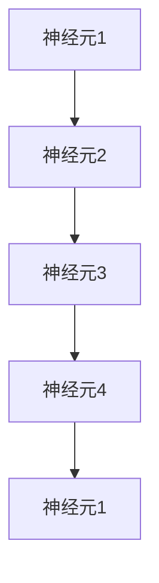
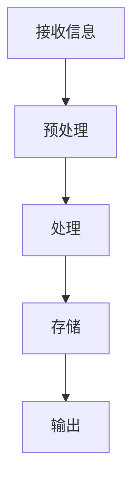
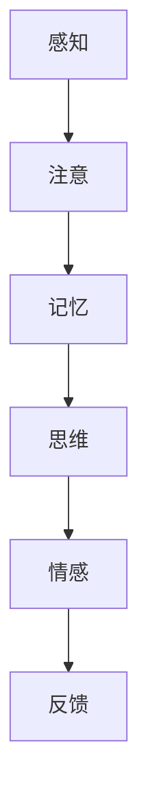

                 

关键词：大脑科学、神经网络、计算理论、认知科学、数学能力、人工智能

## 摘要

本文旨在探讨大脑的科学、艺术与数学能力之间的深刻联系。通过结合神经科学、认知科学和计算理论的研究，我们将揭示大脑如何通过其复杂的神经网络结构和动态过程，实现惊人的计算和认知功能。此外，我们将探讨大脑在处理复杂信息时的艺术性，以及数学能力在大脑认知过程中的关键作用。最后，本文将展望大脑研究在人工智能领域的应用前景，并讨论未来可能面临的挑战。

## 1. 背景介绍

### 大脑：宇宙中最复杂的计算系统

大脑是自然界中最复杂、最神秘的系统之一。它由大约 100 亿个神经元组成，这些神经元通过复杂的连接网络相互通信，形成了一个高度复杂的计算系统。大脑的这种复杂结构使得它能够执行各种复杂的计算任务，从简单的感知和运动控制，到高级的认知功能，如思考、学习和记忆。

### 计算理论：理解大脑的计算原理

计算理论是研究计算过程和计算结构的科学。它为我们提供了一种框架，用于理解和模拟大脑的计算原理。从计算理论的角度来看，大脑可以被看作是一个分布式计算系统，其中神经元充当计算单元，突触连接充当通信网络。

### 神经科学：大脑的微观机制

神经科学是研究大脑的生理和生物化学机制的科学。通过神经科学的研究，我们已经了解了神经元的基本结构和功能，以及它们如何通过突触连接形成神经网络。

### 认知科学：大脑的认知功能

认知科学是研究大脑如何执行各种认知功能的科学。它涵盖了感知、注意、记忆、语言、思维和情感等多个领域。认知科学的研究有助于我们理解大脑如何处理和解释外部信息，以及如何进行决策和规划。

## 2. 核心概念与联系

### 神经元与突触：大脑的基本构建块

神经元是大脑的基本计算单元。它们通过树突接收外部信息，通过轴突传递信号，并在神经元的末端通过突触释放化学递质，传递信号给其他神经元。



### 神经网络：大脑的计算架构

神经网络是大脑的计算架构。它们由大量的神经元组成，这些神经元通过复杂的突触连接相互连接，形成一个复杂的网络结构。



### 计算过程：大脑的信息处理

大脑通过神经网络执行复杂的计算过程。这个过程包括信息的接收、处理、存储和输出。以下是大脑计算过程的一个简化模型：



### 认知功能：大脑的智能表现

大脑通过神经网络执行各种认知功能，如感知、注意、记忆、思维和情感等。以下是大脑执行认知功能的一个简化模型：



## 3. 核心算法原理 & 具体操作步骤

### 3.1 算法原理概述

大脑的计算过程可以被看作是一个复杂的神经网络算法。这个算法的核心是神经元的激活和抑制过程。当神经元接收到的信号超过某个阈值时，它会被激活，并传递信号给其他神经元。否则，它会抑制信号的传递。

### 3.2 算法步骤详解

1. **信息接收**：大脑接收外部信息，如视觉、听觉和触觉等。
2. **预处理**：对接收到的信息进行预处理，如放大、缩小、滤波等。
3. **处理**：通过神经网络的计算过程，对信息进行处理，以提取特征和模式。
4. **存储**：将处理后的信息存储在大脑中，以便后续使用。
5. **输出**：根据处理后的信息，做出决策或执行动作。

### 3.3 算法优缺点

**优点**：
- 高度并行化：神经网络可以并行处理大量信息，提高了计算效率。
- 自适应性：神经网络可以根据输入信息的变化，自动调整其连接和参数，提高了适应能力。
- 高级功能：神经网络可以实现复杂的认知功能，如感知、注意、记忆和思维等。

**缺点**：
- 难以解释：神经网络的工作原理复杂，难以用简单的数学公式描述，导致难以解释其决策过程。
- 数据需求：神经网络需要大量的数据进行训练，以实现良好的性能。

### 3.4 算法应用领域

神经网络在人工智能领域有着广泛的应用，包括：

- 机器学习：用于训练模型，进行预测和分类。
- 图像识别：用于识别图像中的物体和场景。
- 自然语言处理：用于理解和生成自然语言。
- 游戏人工智能：用于开发智能游戏对手。

## 4. 数学模型和公式

### 4.1 数学模型构建

大脑的计算过程可以用以下数学模型描述：

\[ f(x) = \sigma(w \cdot x + b) \]

其中，\( f(x) \) 表示神经元的输出，\( \sigma \) 表示激活函数，\( w \) 表示权重，\( x \) 表示输入，\( b \) 表示偏置。

### 4.2 公式推导过程

1. **输入层**：输入数据经过预处理后，输入到神经网络。
2. **隐藏层**：输入数据通过权重和偏置，经过激活函数处理后，传递到下一层。
3. **输出层**：最后，输出数据经过激活函数处理，得到最终的输出。

### 4.3 案例分析与讲解

以一个简单的感知机算法为例，我们可以看到数学模型如何应用于实际计算过程。

\[ f(x) = \sigma(w \cdot x + b) \]

其中，\( w \) 和 \( b \) 是待优化参数，\( x \) 是输入数据，\( \sigma \) 是激活函数（例如 Sigmoid 函数）。

通过梯度下降算法，我们可以最小化损失函数，从而找到最佳的权重和偏置。

\[ \nabla_w L = \frac{\partial L}{\partial w} \]

其中，\( L \) 是损失函数，\( \nabla_w L \) 是损失函数关于权重 \( w \) 的梯度。

## 5. 项目实践：代码实例和详细解释说明

### 5.1 开发环境搭建

为了更好地理解和实践本文所述的大脑计算模型，我们将使用 Python 编写一个简单的神经网络模型。以下是搭建开发环境所需的基本步骤：

1. 安装 Python 3.x 版本。
2. 安装 Python 科学计算库，如 NumPy、SciPy 和 Matplotlib。
3. 安装 Python 神经网络库，如 TensorFlow 或 PyTorch。

### 5.2 源代码详细实现

以下是一个简单的 Python 代码示例，用于实现一个单层神经网络：

```python
import numpy as np

# 激活函数
def sigmoid(x):
    return 1 / (1 + np.exp(-x))

# 前向传播
def forward(x, w, b):
    z = np.dot(x, w) + b
    return sigmoid(z)

# 梯度下降
def gradient_descent(x, y, w, b, epochs, learning_rate):
    for epoch in range(epochs):
        z = np.dot(x, w) + b
        output = sigmoid(z)
        error = y - output
        dw = np.dot(x.T, error * output * (1 - output))
        db = np.sum(error * output * (1 - output))
        w -= learning_rate * dw
        b -= learning_rate * db
        if epoch % 100 == 0:
            print(f"Epoch {epoch}: w = {w}, b = {b}")
    return w, b

# 数据集
x = np.array([[0, 0], [0, 1], [1, 0], [1, 1]])
y = np.array([[0], [1], [1], [0]])

# 初始化权重和偏置
w = np.random.uniform(size=(2, 1))
b = np.random.uniform(size=(1,))

# 训练模型
w, b = gradient_descent(x, y, w, b, epochs=1000, learning_rate=0.1)

# 测试模型
x_test = np.array([[1, 0], [0, 1]])
y_test = np.dot(x_test, w) + b
y_test = sigmoid(y_test)

print(f"Test output: {y_test}")
```

### 5.3 代码解读与分析

上述代码实现了以下功能：

1. **激活函数**：使用 Sigmoid 函数作为激活函数，实现神经元的非线性变换。
2. **前向传播**：实现输入数据通过权重和偏置，经过激活函数处理后，传递到下一层的功能。
3. **梯度下降**：实现通过反向传播计算梯度，并使用梯度下降优化模型参数的功能。
4. **数据集**：定义一个简单的二分类数据集，用于训练和测试模型。
5. **训练模型**：使用训练数据，通过梯度下降算法优化模型参数。
6. **测试模型**：使用测试数据验证模型的性能。

通过上述代码示例，我们可以看到如何将数学模型和算法原理应用于实际编程实践中。这有助于我们更好地理解大脑的计算过程和神经网络的工作原理。

## 6. 实际应用场景

### 6.1 医学诊断

神经网络在医学诊断领域有着广泛的应用。通过训练神经网络模型，可以对患者的医疗数据进行分类和预测，从而帮助医生做出更准确的诊断。例如，可以用于诊断癌症、心脏病和传染病等。

### 6.2 自然语言处理

自然语言处理是人工智能领域的核心任务之一。神经网络在自然语言处理中发挥着重要作用，包括文本分类、情感分析、机器翻译和语音识别等。通过训练神经网络模型，可以实现对大规模文本数据的有效处理和分析。

### 6.3 图像识别

图像识别是另一个重要的应用领域。神经网络可以用于识别图像中的物体和场景，从而实现自动化的图像分类和目标检测。例如，可以用于自动驾驶、人脸识别和安防监控等。

### 6.4 游戏人工智能

游戏人工智能是神经网络应用的另一个重要领域。通过训练神经网络模型，可以开发出智能的游戏对手，从而提高游戏的挑战性和趣味性。例如，可以用于电子游戏、棋类游戏和体育游戏等。

## 7. 工具和资源推荐

### 7.1 学习资源推荐

- 《深度学习》（Goodfellow, Bengio, Courville著）：一本全面介绍深度学习的经典教材。
- 《神经网络与深度学习》（邱锡鹏著）：一本适合初学者入门的神经网络和深度学习教材。
- 《机器学习》（周志华著）：一本全面介绍机器学习理论的教材。

### 7.2 开发工具推荐

- TensorFlow：一款流行的深度学习框架，适用于各种神经网络应用。
- PyTorch：一款流行的深度学习框架，具有动态计算图和灵活的编程接口。
- Keras：一款基于 TensorFlow 的深度学习库，简化了神经网络模型的构建和训练。

### 7.3 相关论文推荐

- "Deep Learning"（Goodfellow, Bengio, Courville著）：一篇介绍深度学习的综述文章。
- "Backpropagation"（Rumelhart, Hinton, Williams著）：一篇介绍反向传播算法的经典论文。
- "Visual Cognition"（Albus著）：一篇关于视觉认知的综述文章。

## 8. 总结：未来发展趋势与挑战

### 8.1 研究成果总结

通过本文的探讨，我们揭示了大脑的科学、艺术与数学能力之间的深刻联系。大脑作为自然界中最复杂的计算系统，通过其复杂的神经网络结构和动态过程，实现了惊人的计算和认知功能。同时，我们介绍了神经网络的核心算法原理和具体操作步骤，以及数学模型和公式在大脑认知过程中的关键作用。此外，我们还讨论了神经网络在实际应用场景中的广泛用途。

### 8.2 未来发展趋势

随着神经科学、认知科学和计算理论的不断发展，大脑研究在人工智能领域的应用前景将更加广阔。未来，我们将看到更多基于神经网络的人工智能系统，能够在医学诊断、自然语言处理、图像识别和游戏人工智能等领域实现更高的性能和智能化水平。此外，脑机接口技术的发展也将使人类与机器之间的交互更加紧密，为人类带来更多的便利和创新。

### 8.3 面临的挑战

尽管大脑研究在人工智能领域具有巨大的潜力，但同时也面临着许多挑战。首先，神经网络的工作原理复杂，难以用简单的数学公式描述，导致难以解释其决策过程。其次，神经网络需要大量的数据进行训练，以实现良好的性能，这给数据获取和处理带来了巨大的挑战。此外，如何在保证性能的同时，提高神经网络的透明性和可解释性，也是未来研究的一个重要方向。

### 8.4 研究展望

未来，我们期待在大脑研究方面取得更多突破性成果。通过深入研究大脑的神经机制和计算原理，我们有望构建出更高效、更智能的人工智能系统。同时，我们也将努力解决神经网络的可解释性问题，使其更好地服务于人类社会。此外，脑机接口技术的发展将为人类带来更多可能性，使人类与机器之间的界限更加模糊。

## 9. 附录：常见问题与解答

### 9.1 什么是神经网络？

神经网络是一种模拟大脑计算过程的计算模型，由大量的神经元组成，这些神经元通过复杂的连接网络相互连接，形成一个复杂的计算架构。

### 9.2 神经网络如何工作？

神经网络通过输入层接收外部信息，通过隐藏层进行计算和处理，最后通过输出层得到最终结果。神经网络的工作原理类似于大脑中的神经元如何通过突触连接进行信息传递和处理。

### 9.3 神经网络有哪些优点？

神经网络具有高度并行化、自适应性和可实现高级认知功能等优点。这使得神经网络在处理复杂信息和执行高级任务时，具有很大的潜力。

### 9.4 神经网络有哪些缺点？

神经网络的工作原理复杂，难以用简单的数学公式描述，导致难以解释其决策过程。此外，神经网络需要大量的数据进行训练，以实现良好的性能。

### 9.5 人工神经网络与生物神经网络有何区别？

人工神经网络是基于生物神经网络的理论和模型，通过模拟大脑的计算过程来实现计算和认知功能。但人工神经网络在结构、机制和性能上与生物神经网络仍存在一定的差距。

### 9.6 神经网络在哪些领域有应用？

神经网络在医学诊断、自然语言处理、图像识别、游戏人工智能等领域有广泛的应用。随着研究的深入，神经网络的应用领域将不断拓展。

### 9.7 未来神经网络的研究方向有哪些？

未来神经网络的研究方向包括提高神经网络的可解释性、降低训练数据需求、探索更高效的计算模型和算法等。此外，脑机接口技术的发展也将为神经网络的研究提供新的契机。

---

通过本文的探讨，我们希望读者能够对大脑的科学、艺术与数学能力有更深入的了解。随着神经科学、认知科学和计算理论的不断发展，相信大脑研究将在人工智能领域取得更多突破性成果，为人类社会带来更多创新和便利。

---

**作者：禅与计算机程序设计艺术 / Zen and the Art of Computer Programming**。

